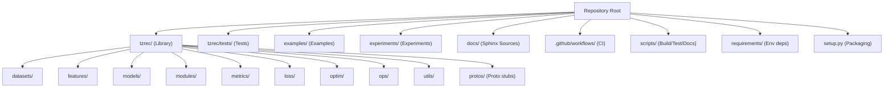
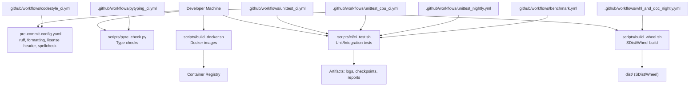
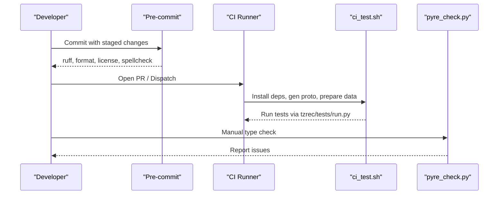
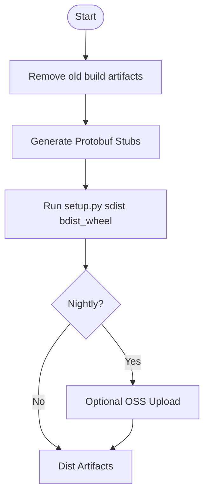
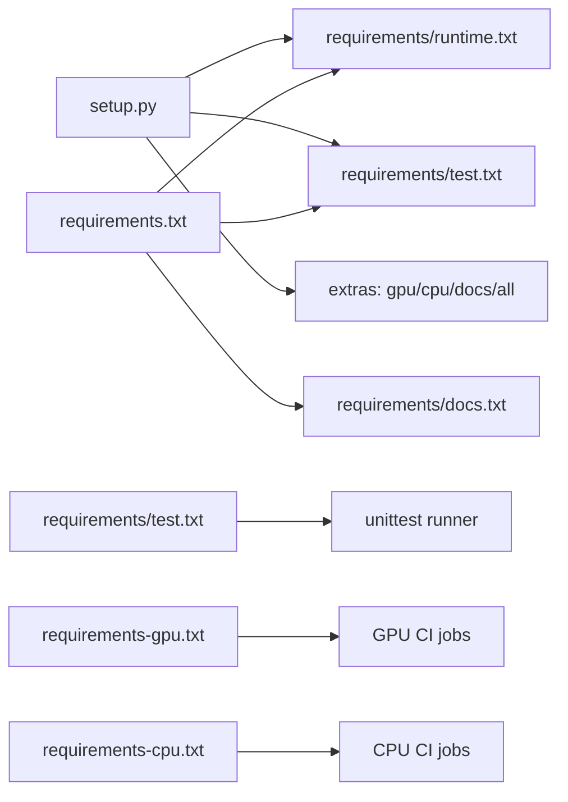

# Development Guide and Contributing

<cite>
**Referenced Files in This Document**
- [README.md](file://README.md)
- [develop.md](file://docs/source/develop.md)
- [setup.py](file://setup.py)
- [requirements.txt](file://requirements.txt)
- [requirements-gpu.txt](file://requirements-gpu.txt)
- [requirements-cpu.txt](file://requirements-cpu.txt)
- [requirements/test.txt](file://requirements/test.txt)
- [requirements/runtime.txt](file://requirements/runtime.txt)
- [requirements/docs.txt](file://requirements/docs.txt)
- [requirements/extra.txt](file://requirements/extra.txt)
- [scripts/ci/ci_test.sh](file://scripts/ci/ci_test.sh)
- [scripts/build_wheel.sh](file://scripts/build_wheel.sh)
- [scripts/build_docker.sh](file://scripts/build_docker.sh)
- [scripts/gen_proto.sh](file://scripts/gen_proto.sh)
- [scripts/pyre_check.py](file://scripts/pyre_check.py)
- [.pre-commit-config.yaml](file://.pre-commit-config.yaml)
- [.ruff.toml](file://.ruff.toml)
- [.github/workflows/unittest_ci.yml](file://.github/workflows/unittest_ci.yml)
- [.github/workflows/codestyle_ci.yml](file://.github/workflows/codestyle_ci.yml)
- [.github/workflows/pytyping_ci.yml](file://.github/workflows/pytyping_ci.yml)
- [.github/workflows/unittest_cpu_ci.yml](file://.github/workflows/unittest_cpu_ci.yml)
- [.github/workflows/unittest_nightly.yml](file://.github/workflows/unittest_nightly.yml)
- [.github/workflows/whl_and_doc_nightly.yml](file://.github/workflows/whl_and_doc_nightly.yml)
- [.github/workflows/benchmark.yml](file://.github/workflows/benchmark.yml)
- [tzrec/version.py](file://tzrec/version.py)
</cite>

## Table of Contents

1. [Introduction](#introduction)
1. [Project Structure](#project-structure)
1. [Core Components](#core-components)
1. [Architecture Overview](#architecture-overview)
1. [Detailed Component Analysis](#detailed-component-analysis)
1. [Dependency Analysis](#dependency-analysis)
1. [Performance Considerations](#performance-considerations)
1. [Troubleshooting Guide](#troubleshooting-guide)
1. [Contribution Guidelines](#contribution-guidelines)
1. [Release Procedures](#release-procedures)
1. [Community and Governance](#community-and-governance)
1. [Conclusion](#conclusion)

## Introduction

This document is the development guide and contributing companion for TorchEasyRec. It explains how to set up the development environment, adhere to code style and quality standards, run tests, and contribute effectively via pull requests. It also documents the testing infrastructure, CI/CD pipeline, packaging and publishing workflows, and extension practices while emphasizing backward compatibility and maintainability.

## Project Structure

At a high level, the repository is organized into:

- Core library under tzrec/: Python packages implementing datasets, features, models, modules, metrics, losses, optimizers, utilities, and CLI entry points.
- Tests under tzrec/tests/ and per-module test files (e.g., \*\_test.py) for unit and integration coverage.
- Examples and experiments under examples/ and experiments/ for end-to-end tutorials and research.
- Documentation under docs/ (Sphinx sources) and images.
- CI/CD under .github/workflows/, with scripts under scripts/.
- Packaging and environment requirements under requirements/ and setup.py.

**Section sources**

- \[README.md\](file://README.md#L1-L83)
- \[setup.py\](file://setup.py#L64-L84)

## Core Components

- Library core: datasets, features, models, modules, metrics, losses, optimizers, ops, and utilities.
- CLI entry points: train/eval/export/predict/main.
- Protobuf definitions and generated stubs under protos/.
- Tests: unit tests per module and integration tests under tzrec/tests/.

Key development entry points:

- Training and evaluation: see training and evaluation entry points and CLI usage.
- Export and serving: export utilities and serving preparation.
- Predictions: prediction pipeline entry point.

**Section sources**

- \[README.md\](file://README.md#L45-L52)
- \[develop.md\](file://docs/source/develop.md#L35-L77)

## Architecture Overview

The development workflow integrates local development, pre-commit checks, type checking, unit/integration tests, and CI pipelines. Packaging and Docker builds support distribution and reproducible environments.

**Diagram sources**

- \[.pre-commit-config.yaml\](file://.pre-commit-config.yaml#L1-L35)
- \[.ruff.toml\](file://.ruff.toml#L1-L10)
- \[scripts/ci/ci_test.sh\](file://scripts/ci/ci_test.sh#L1-L9)
- \[scripts/pyre_check.py\](file://scripts/pyre_check.py)
- \[scripts/build_wheel.sh\](file://scripts/build_wheel.sh#L1-L75)
- \[scripts/build_docker.sh\](file://scripts/build_docker.sh#L1-L23)
- \[.github/workflows/unittest_ci.yml\](file://.github/workflows/unittest_ci.yml#L1-L25)
- \[.github/workflows/codestyle_ci.yml\](file://.github/workflows/codestyle_ci.yml#L1-L26)
- \[.github/workflows/pytyping_ci.yml\](file://.github/workflows/pytyping_ci.yml#L1-L26)
- \[.github/workflows/unittest_cpu_ci.yml\](file://.github/workflows/unittest_cpu_ci.yml)
- \[.github/workflows/unittest_nightly.yml\](file://.github/workflows/unittest_nightly.yml)
- \[.github/workflows/whl_and_doc_nightly.yml\](file://.github/workflows/whl_and_doc_nightly.yml)
- \[.github/workflows/benchmark.yml\](file://.github/workflows/benchmark.yml)

## Detailed Component Analysis

### Code Style and Pre-commit

- Style: PEP8 with ruff lint/format.
- Docstring convention: Google-style via pydocstyle.
- Pre-commit enforces license headers, ruff fix/format, trailing whitespace, YAML checks, end-of-file, requirements sorting, merge conflict detection, line endings, and spelling.
- Configuration files:
  - .pre-commit-config.yaml
  - .ruff.toml
- Typical commands:
  - Install hooks after cloning.
  - Run all checks locally before committing.
  - Type checks require manual invocation via pyre script.

**Section sources**

- \[develop.md\](file://docs/source/develop.md#L3-L26)
- \[.pre-commit-config.yaml\](file://.pre-commit-config.yaml#L1-L35)
- \[.ruff.toml\](file://.ruff.toml#L1-L10)

### Testing Infrastructure

- Unit/integration tests runner: scripts/ci/ci_test.sh installs GPU requirements, extra dependencies, generates protobuf stubs, prepares test data, and executes the centralized test runner.
- Running a single test module/class/method is supported via Python’s unittest discovery.
- CI jobs:
  - unittest_ci.yml: GPU container, runs ci_test.sh.
  - unittest_cpu_ci.yml: CPU-only job variant.
  - unittest_nightly.yml: Nightly execution.
  - pytyping_ci.yml: Proto generation and pyre type checks.
  - codestyle_ci.yml: Pre-commit enforcement.
- Requirements:
  - requirements-gpu.txt for GPU tests.
  - requirements/test.txt for test harness dependencies.

**Diagram sources**

- \[.github/workflows/unittest_ci.yml\](file://.github/workflows/unittest_ci.yml#L1-L25)
- \[.github/workflows/codestyle_ci.yml\](file://.github/workflows/codestyle_ci.yml#L1-L26)
- \[.github/workflows/pytyping_ci.yml\](file://.github/workflows/pytyping_ci.yml#L1-L26)
- \[scripts/ci/ci_test.sh\](file://scripts/ci/ci_test.sh#L1-L9)
- \[scripts/pyre_check.py\](file://scripts/pyre_check.py)

**Section sources**

- \[develop.md\](file://docs/source/develop.md#L35-L47)
- \[scripts/ci/ci_test.sh\](file://scripts/ci/ci_test.sh#L1-L9)
- \[.github/workflows/unittest_ci.yml\](file://.github/workflows/unittest_ci.yml#L1-L25)
- \[.github/workflows/pytyping_ci.yml\](file://.github/workflows/pytyping_ci.yml#L1-L26)
- \[.github/workflows/codestyle_ci.yml\](file://.github/workflows/codestyle_ci.yml#L1-L26)

### Documentation Build

- Sphinx-based docs under docs/.
- Build command documented in develop.md.
- Proto docs generation is integrated into the documentation build via scripts/gen_proto.sh.

**Section sources**

- \[develop.md\](file://docs/source/develop.md#L49-L61)
- \[scripts/gen_proto.sh\](file://scripts/gen_proto.sh#L1-L24)

### Packaging and Wheels

- Wheel building supports nightly tagging and optional OSS upload automation.
- Cleans build artifacts, regenerates protos, then builds sdist and bdist_wheel.
- Version is read from tzrec/version.py and optionally augmented with nightly suffix.

**Diagram sources**

- \[scripts/build_wheel.sh\](file://scripts/build_wheel.sh#L1-L75)
- \[scripts/gen_proto.sh\](file://scripts/gen_proto.sh#L1-L24)
- \[tzrec/version.py\](file://tzrec/version.py#L12-L12)

**Section sources**

- \[develop.md\](file://docs/source/develop.md#L62-L77)
- \[scripts/build_wheel.sh\](file://scripts/build_wheel.sh#L1-L75)
- \[setup.py\](file://setup.py#L26-L36)
- \[tzrec/version.py\](file://tzrec/version.py#L12-L12)

### Docker Builds

- Automated Docker image builds for CPU and CUDA variants, tagging and pushing to registry.
- Copies requirements into docker/ prior to build.

**Section sources**

- \[scripts/build_docker.sh\](file://scripts/build_docker.sh#L1-L23)

### Proto Generation and Docs

- Proto generation script downloads platform-specific protoc plugins, compiles \*.proto files, and generates Python stubs and pyi files.
- Also generates HTML documentation embedded into docs/source.

**Section sources**

- \[scripts/gen_proto.sh\](file://scripts/gen_proto.sh#L1-L24)

## Dependency Analysis

- Packaging metadata:
  - setup.py defines install_requires from requirements/runtime.txt, tests_require from requirements/test.txt, and extras for gpu/cpu/docs/all.
  - requirements.txt aggregates runtime, test, and docs requirements.
- Environment requirements:
  - requirements-gpu.txt for GPU-enabled tests.
  - requirements-cpu.txt for CPU-only environments.
  - requirements/extra.txt for additional dev/testing tools.
- Python version requirement is >=3.8.

**Diagram sources**

- \[setup.py\](file://setup.py#L64-L84)
- \[requirements.txt\](file://requirements.txt#L1-L4)
- \[requirements-gpu.txt\](file://requirements-gpu.txt)
- \[requirements-cpu.txt\](file://requirements-cpu.txt)
- \[requirements/test.txt\](file://requirements/test.txt)
- \[requirements/docs.txt\](file://requirements/docs.txt)

**Section sources**

- \[setup.py\](file://setup.py#L39-L84)
- \[requirements.txt\](file://requirements.txt#L1-L4)

## Performance Considerations

- Mixed precision and optimized kernels are part of the framework’s performance story; ensure tests run with appropriate device resources.
- CI workflows specify GPU containers and IPC sharing for reproducibility.
- Prefer running targeted unit tests during development to iterate quickly; use nightly suites for broader regression checks.

[No sources needed since this section provides general guidance]

## Troubleshooting Guide

Common issues and remedies:

- Pre-commit failures:
  - Re-run pre-commit on all files to auto-fix formatting and license headers.
  - Review ruff and pydocstyle messages; adjust according to .ruff.toml.
- Type errors:
  - Run pyre check manually as documented.
- Test failures:
  - Ensure GPU/CPU requirements are installed per requirements-gpu.txt or requirements-cpu.txt.
  - Verify protobuf stubs are regenerated via scripts/gen_proto.sh.
  - Use single-test invocation to isolate failures.
- CI flakiness:
  - Confirm container runtime and GPU availability in CI runners.
  - Validate that nightly wheel build steps succeed and artifacts are produced.

**Section sources**

- \[develop.md\](file://docs/source/develop.md#L3-L26)
- \[develop.md\](file://docs/source/develop.md#L35-L77)
- \[.github/workflows/unittest_ci.yml\](file://.github/workflows/unittest_ci.yml#L1-L25)
- \[.github/workflows/pytyping_ci.yml\](file://.github/workflows/pytyping_ci.yml#L1-L26)
- \[.github/workflows/codestyle_ci.yml\](file://.github/workflows/codestyle_ci.yml#L1-L26)

## Contribution Guidelines

How to contribute:

- Fork and branch, implement changes, and open a pull request.
- Follow code style and pass pre-commit checks locally.
- Run unit/integration tests and ensure CI passes.
- Keep commits focused and add tests for new functionality.
- Update documentation as needed.

Review and quality:

- Code review is part of the PR process; address reviewer feedback promptly.
- Maintain backward compatibility for public APIs and configs.
- Add unit tests alongside new features; integration tests for end-to-end flows.

**Section sources**

- \[README.md\](file://README.md#L54-L60)
- \[develop.md\](file://docs/source/develop.md#L3-L26)
- \[develop.md\](file://docs/source/develop.md#L35-L77)

## Release Procedures

- Versioning:
  - Base version is defined in tzrec/version.py.
  - Nightly builds append a date+commit suffix controlled by scripts/build_wheel.sh.
- Building:
  - Use scripts/build_wheel.sh with arguments to produce SDist and Wheel.
  - Optional OSS upload and repository page updates for nightly wheels.
- Publishing:
  - Distribute built wheels from dist/ to internal or external channels as appropriate.

**Section sources**

- \[scripts/build_wheel.sh\](file://scripts/build_wheel.sh#L1-L75)
- \[setup.py\](file://setup.py#L26-L36)
- \[tzrec/version.py\](file://tzrec/version.py#L12-L12)

## Community and Governance

- Communication:
  - DingTalk groups and email for discussions and enterprise services.
- Reporting issues:
  - Use GitHub Issues to report bugs and request features.
- Collaboration:
  - Submit PRs with clear descriptions, tests, and documentation updates.

**Section sources**

- \[README.md\](file://README.md#L62-L78)

## Conclusion

This guide consolidates the development workflow, code style, testing, CI/CD, packaging, and contribution practices for TorchEasyRec. By following these processes, contributors can efficiently extend the framework, maintain quality, and collaborate effectively while preserving backward compatibility.
