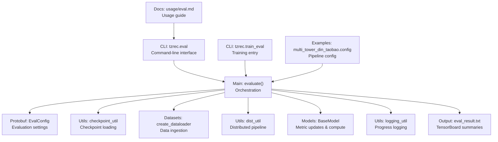
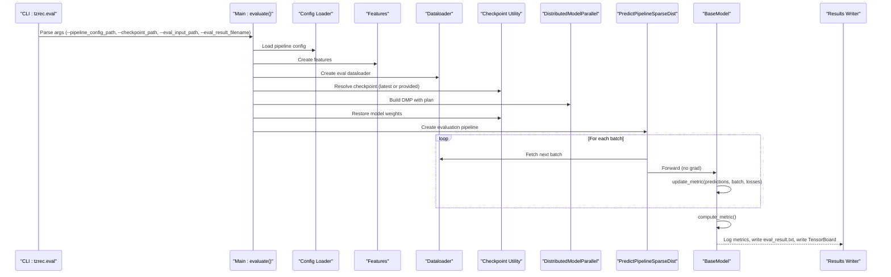
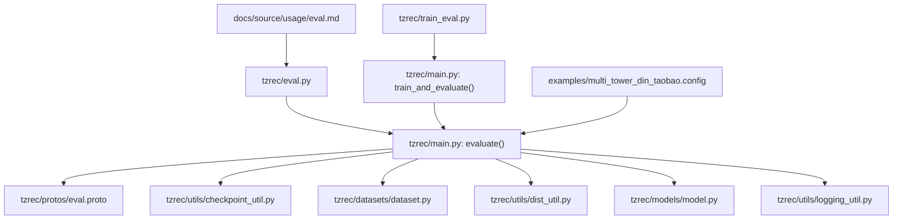

# Evaluation Pipeline Architecture

<cite>
**Referenced Files in This Document**
- [eval.py](file://tzrec/eval.py)
- [main.py](file://tzrec/main.py)
- [train_eval.py](file://tzrec/train_eval.py)
- [eval.proto](file://tzrec/protos/eval.proto)
- [checkpoint_util.py](file://tzrec/utils/checkpoint_util.py)
- [dist_util.py](file://tzrec/utils/dist_util.py)
- [logging_util.py](file://tzrec/utils/logging_util.py)
- [model.py](file://tzrec/models/model.py)
- [rank_model.py](file://tzrec/models/rank_model.py)
- [eval_usage.md](file://docs/source/usage/eval.md)
- [multi_tower_din_taobao.config](file://examples/multi_tower_din_taobao.config)
</cite>

## Table of Contents

1. [Introduction](#introduction)
1. [Project Structure](#project-structure)
1. [Core Components](#core-components)
1. [Architecture Overview](#architecture-overview)
1. [Detailed Component Analysis](#detailed-component-analysis)
1. [Dependency Analysis](#dependency-analysis)
1. [Performance Considerations](#performance-considerations)
1. [Troubleshooting Guide](#troubleshooting-guide)
1. [Conclusion](#conclusion)
1. [Appendices](#appendices)

## Introduction

This document explains the evaluation pipeline architecture of TorchEasyRec, focusing on the end-to-end workflow from the command-line interface to model evaluation. It covers how the CLI parses arguments, how the evaluation orchestrator loads configurations and checkpoints, how data is processed, how batch evaluation proceeds, and how results are recorded. It also provides practical examples for configuring evaluation runs, overriding inputs, specifying checkpoints, and interpreting results, along with distributed evaluation considerations, performance optimization strategies, and troubleshooting guidance.

## Project Structure

The evaluation pipeline spans several modules:

- Command-line entry points for evaluation and training
- Main orchestration logic for evaluation
- Protobuf configuration definitions for evaluation settings
- Utilities for checkpoint loading and distributed pipeline execution
- Model abstractions and metric computation
- Documentation and example configurations

**Diagram sources**

- \[eval.py\](file://tzrec/eval.py#L16-L50)
- \[main.py\](file://tzrec/main.py#L739-L837)
- \[eval.proto\](file://tzrec/protos/eval.proto#L4-L9)
- \[checkpoint_util.py\](file://tzrec/utils/checkpoint_util.py#L242-L321)
- \[dist_util.py\](file://tzrec/utils/dist_util.py#L304-L345)
- \[model.py\](file://tzrec/models/model.py#L106-L138)
- \[logging_util.py\](file://tzrec/utils/logging_util.py#L20-L46)
- \[train_eval.py\](file://tzrec/train_eval.py#L16-L72)
- \[eval_usage.md\](file://docs/source/usage/eval.md#L1-L34)
- \[multi_tower_din_taobao.config\](file://examples/multi_tower_din_taobao.config#L1-L244)

**Section sources**

- \[eval.py\](file://tzrec/eval.py#L16-L50)
- \[main.py\](file://tzrec/main.py#L739-L837)
- \[eval.proto\](file://tzrec/protos/eval.proto#L4-L9)
- \[checkpoint_util.py\](file://tzrec/utils/checkpoint_util.py#L242-L321)
- \[dist_util.py\](file://tzrec/utils/dist_util.py#L304-L345)
- \[model.py\](file://tzrec/models/model.py#L106-L138)
- \[logging_util.py\](file://tzrec/utils/logging_util.py#L20-L46)
- \[train_eval.py\](file://tzrec/train_eval.py#L16-L72)
- \[eval_usage.md\](file://docs/source/usage/eval.md#L1-L34)
- \[multi_tower_din_taobao.config\](file://examples/multi_tower_din_taobao.config#L1-L244)

## Core Components

- Command-line entry for evaluation:
  - Parses pipeline config path, checkpoint path, evaluation input path, and evaluation result filename.
  - Invokes the main evaluation function with parsed arguments.
- Main evaluation function:
  - Loads pipeline configuration and initializes distributed environment.
  - Builds features and evaluation dataloader.
  - Creates model, restores checkpoint, sets up distributed model parallelism, and runs evaluation loop.
  - Aggregates metrics, logs results, and writes to eval_result.txt and TensorBoard.
- Evaluation configuration:
  - EvalConfig defines num_steps and log_step_count_steps to control evaluation behavior.
- Checkpoint utilities:
  - Latest checkpoint discovery, best checkpoint selection, and robust model/optimizer restoration.
- Distributed pipeline:
  - Specialized pipeline for evaluation that handles data availability across workers and avoids hangs.
- Metrics and model abstraction:
  - BaseModel exposes update_metric and compute_metric for evaluation-time aggregation.
  - Rank models initialize and update metrics (e.g., AUC, MAE, MSE, accuracy).

**Section sources**

- \[eval.py\](file://tzrec/eval.py#L16-L50)
- \[main.py\](file://tzrec/main.py#L739-L837)
- \[eval.proto\](file://tzrec/protos/eval.proto#L4-L9)
- \[checkpoint_util.py\](file://tzrec/utils/checkpoint_util.py#L147-L174)
- \[checkpoint_util.py\](file://tzrec/utils/checkpoint_util.py#L242-L321)
- \[dist_util.py\](file://tzrec/utils/dist_util.py#L274-L302)
- \[model.py\](file://tzrec/models/model.py#L106-L138)
- \[rank_model.py\](file://tzrec/models/rank_model.py#L286-L414)

## Architecture Overview

The evaluation workflow follows a clear sequence from CLI to model execution and result recording.

**Diagram sources**

- \[eval.py\](file://tzrec/eval.py#L16-L50)
- \[main.py\](file://tzrec/main.py#L739-L837)
- \[checkpoint_util.py\](file://tzrec/utils/checkpoint_util.py#L242-L321)
- \[dist_util.py\](file://tzrec/utils/dist_util.py#L304-L345)
- \[model.py\](file://tzrec/models/model.py#L106-L138)

## Detailed Component Analysis

### Command-Line Interface: Evaluation Entry Point

- Parses:
  - --pipeline_config_path: Path to the pipeline configuration.
  - --checkpoint_path: Optional checkpoint to evaluate; defaults to latest in model_dir if not provided.
  - --eval_input_path: Overrides eval_input_path in the pipeline config.
  - --eval_result_filename: Filename for saving evaluation metrics.
- Calls the main evaluate function with parsed arguments.

Practical usage examples:

- Basic evaluation with distributed launch:
  - See usage guide for a torchrun example invoking tzrec.eval with pipeline config and eval input path.
- Overriding evaluation input:
  - Pass --eval_input_path to override the eval data path in the pipeline config.
- Specifying checkpoint:
  - Pass --checkpoint_path to evaluate a specific checkpoint instead of the latest.

**Section sources**

- \[eval.py\](file://tzrec/eval.py#L16-L50)
- \[eval_usage.md\](file://docs/source/usage/eval.md#L5-L16)

### Evaluation Orchestration: main.evaluate

Key responsibilities:

- Load pipeline configuration and initialize distributed environment (process group, device, backend).
- Build features and evaluation dataloader; optionally reuse sampler cluster from training dataloader.
- Create model and wrap with TrainWrapper for mixed precision and distributed execution.
- Resolve checkpoint path (latest if not provided) and restore model weights.
- Create distributed model parallel plan and instantiate DMP.
- Initialize TensorBoard writers for evaluation summaries.
- Run evaluation loop via PredictPipelineSparseDist, updating metrics per batch.
- Aggregate metrics, log results, and write eval_result.txt with global_step and metric values.

Batch evaluation process:

- Iterates over the evaluation dataloader until StopIteration or num_steps reached.
- Uses PredictPipelineSparseDist to fetch batches and run forward passes without gradients.
- Updates metrics via BaseModel.update_metric and computes final metrics with compute_metric.

Memory management:

- Uses torch.no_grad to disable gradient computation and reduce memory footprint.
- Distributed execution leverages sharded tensors and collective plans to manage memory across devices.

Integration with training pipeline:

- Reuses training-side infrastructure (feature creation, model creation, distributed plan, checkpoint utilities).
- Shares evaluation configuration (EvalConfig) with training configuration for consistent behavior.

**Section sources**

- \[main.py\](file://tzrec/main.py#L739-L837)
- \[dist_util.py\](file://tzrec/utils/dist_util.py#L274-L302)
- \[model.py\](file://tzrec/models/model.py#L106-L138)

### Evaluation Configuration Parsing

- EvalConfig supports:
  - num_steps: Number of steps to evaluate; if unset or zero, evaluates the entire dataset.
  - log_step_count_steps: Logging interval for progress and summaries.

These settings control the evaluation loop’s termination and reporting cadence.

**Section sources**

- \[eval.proto\](file://tzrec/protos/eval.proto#L4-L9)

### Checkpoint Loading Mechanisms

- Latest checkpoint discovery:
  - latest_checkpoint scans model_dir for model.ckpt-\* directories and extracts the step.
- Best checkpoint selection:
  - best_checkpoint reads eval_result.txt and selects the checkpoint associated with the best metric value.
- Robust restore:
  - restore_model loads model and optimizer states with a partial planner supporting parameter remapping and compatibility transformations.
  - Supports dynamic embedding restoration when present.

Practical tips:

- To evaluate a specific checkpoint, pass --checkpoint_path to the CLI.
- If no checkpoint is provided, the system automatically uses the latest checkpoint in model_dir.

**Section sources**

- \[checkpoint_util.py\](file://tzrec/utils/checkpoint_util.py#L147-L174)
- \[checkpoint_util.py\](file://tzrec/utils/checkpoint_util.py#L176-L240)
- \[checkpoint_util.py\](file://tzrec/utils/checkpoint_util.py#L242-L321)

### Data Input Processing

- Features are created from feature_configs and data_config, including sampler-specific fields when applicable.
- Evaluation dataloader is created with mode=Mode.EVAL and optional sampler cluster alignment with training.
- Data parsing and batching are handled by the dataset stack; evaluation batches are consumed by the prediction pipeline.

**Section sources**

- \[main.py\](file://tzrec/main.py#L93-L111)
- \[main.py\](file://tzrec/main.py#L767-L772)

### Batch Evaluation Process and Metrics

- Prediction pipeline:
  - PredictPipelineSparseDist ensures consistent batch handling across workers and avoids deadlocks by padding missing batches with dummy batches when needed.
- Metric updates:
  - BaseModel.update_metric updates internal metric states using predictions and ground truth.
  - BaseModel.compute_metric aggregates and resets metric states, returning a dictionary of metric names to values.
- Rank model metrics:
  - Rank models initialize and update metrics such as AUC, MAE, MSE, accuracy, grouped AUC, and xAUC depending on configuration.

**Section sources**

- \[dist_util.py\](file://tzrec/utils/dist_util.py#L274-L302)
- \[model.py\](file://tzrec/models/model.py#L106-L138)
- \[rank_model.py\](file://tzrec/models/rank_model.py#L286-L414)

### Distributed Evaluation Considerations

- Data availability synchronization:
  - When batch_cost_size is configured, the pipeline checks whether all workers have or lack a batch to avoid hangs and drop remainder batches consistently.
- Device and backend initialization:
  - Distributed environment is initialized early; logging and TensorBoard writers are guarded by rank checks.
- Plan and sharding:
  - DistributedModelParallel uses a collective plan built from checkpoint plan or computed plan to shard parameters across devices.

**Section sources**

- \[main.py\](file://tzrec/main.py#L824-L825)
- \[dist_util.py\](file://tzrec/utils/dist_util.py#L243-L268)
- \[main.py\](file://tzrec/main.py#L805-L812)

### Practical Examples and Usage Patterns

- Running evaluation:
  - Use torchrun to launch tzrec.eval with --pipeline_config_path and --eval_input_path.
  - Example invocation is documented in the usage guide.
- Overriding inputs:
  - Pass --eval_input_path to override the eval data path in the pipeline config.
- Specifying checkpoints:
  - Pass --checkpoint_path to evaluate a specific checkpoint; otherwise, the latest checkpoint is used.
- Customizing outputs:
  - Adjust --eval_result_filename to change the metrics output file name.

Configuration examples:

- Multi-tower DIN Taobao pipeline config demonstrates typical structure, including train_config, eval_config, data_config, and feature_configs.

**Section sources**

- \[eval_usage.md\](file://docs/source/usage/eval.md#L5-L16)
- \[multi_tower_din_taobao.config\](file://examples/multi_tower_din_taobao.config#L1-L244)

### Evaluating Different Model Types

- BaseModel defines the contract for metric updates and computation; concrete models implement model-specific metrics.
- Rank models support binary and multiclass AUC, MAE, MSE, accuracy, grouped AUC, and xAUC.
- Other model families inherit from BaseModel and can leverage the same evaluation pipeline.

Interpretation guidance:

- Metrics are logged and written to eval_result.txt with global_step included.
- For best checkpoint selection, use best_checkpoint to pick the optimal model based on a chosen metric.

**Section sources**

- \[model.py\](file://tzrec/models/model.py#L106-L138)
- \[rank_model.py\](file://tzrec/models/rank_model.py#L286-L414)
- \[checkpoint_util.py\](file://tzrec/utils/checkpoint_util.py#L176-L240)

## Dependency Analysis

The evaluation pipeline exhibits tight coupling among configuration, data, model, and distributed utilities, with clear separation of concerns.

**Diagram sources**

- \[eval.py\](file://tzrec/eval.py#L16-L50)
- \[main.py\](file://tzrec/main.py#L739-L837)
- \[eval.proto\](file://tzrec/protos/eval.proto#L4-L9)
- \[checkpoint_util.py\](file://tzrec/utils/checkpoint_util.py#L242-L321)
- \[dist_util.py\](file://tzrec/utils/dist_util.py#L304-L345)
- \[model.py\](file://tzrec/models/model.py#L106-L138)
- \[logging_util.py\](file://tzrec/utils/logging_util.py#L20-L46)
- \[train_eval.py\](file://tzrec/train_eval.py#L16-L72)
- \[multi_tower_din_taobao.config\](file://examples/multi_tower_din_taobao.config#L1-L244)
- \[eval_usage.md\](file://docs/source/usage/eval.md#L1-L34)

**Section sources**

- \[eval.py\](file://tzrec/eval.py#L16-L50)
- \[main.py\](file://tzrec/main.py#L739-L837)
- \[eval.proto\](file://tzrec/protos/eval.proto#L4-L9)
- \[checkpoint_util.py\](file://tzrec/utils/checkpoint_util.py#L242-L321)
- \[dist_util.py\](file://tzrec/utils/dist_util.py#L304-L345)
- \[model.py\](file://tzrec/models/model.py#L106-L138)
- \[logging_util.py\](file://tzrec/utils/logging_util.py#L20-L46)
- \[train_eval.py\](file://tzrec/train_eval.py#L16-L72)
- \[multi_tower_din_taobao.config\](file://examples/multi_tower_din_taobao.config#L1-L244)
- \[eval_usage.md\](file://docs/source/usage/eval.md#L1-L34)

## Performance Considerations

- Mixed precision:
  - TrainWrapper enables mixed precision to reduce memory and improve throughput during evaluation.
- Gradient-free execution:
  - torch.no_grad disables gradient computation, lowering memory pressure and speeding up evaluation.
- Distributed sharding:
  - Collective plans and DMP shard parameters across devices, improving scalability.
- Logging cadence:
  - log_step_count_steps controls how frequently progress and summaries are written; tune for desired balance between overhead and visibility.
- Data pipeline:
  - Ensure efficient data loaders and appropriate num_workers; align sampler clusters between train and eval for consistent performance.

[No sources needed since this section provides general guidance]

## Troubleshooting Guide

Common issues and resolutions:

- No checkpoint found:
  - If --checkpoint_path is not provided and model_dir is empty, evaluation will fail. Provide a valid checkpoint or ensure model_dir contains checkpoints.
- Incompatible checkpoint:
  - restore_model raises errors if model or optimizer checkpoint paths do not exist; verify checkpoint structure and parameter mappings.
- Distributed hangs:
  - PredictPipelineSparseDist pads missing batches with dummy batches to prevent deadlocks; ensure all workers participate and data is aligned.
- Metric computation anomalies:
  - Ensure BaseModel.update_metric is called for every batch; compute_metric resets internal states after aggregation.
- Logging and output:
  - ProgressLogger reports iteration speed; verify log levels and output file paths.

**Section sources**

- \[main.py\](file://tzrec/main.py#L814-L817)
- \[checkpoint_util.py\](file://tzrec/utils/checkpoint_util.py#L256-L301)
- \[dist_util.py\](file://tzrec/utils/dist_util.py#L288-L301)
- \[model.py\](file://tzrec/models/model.py#L121-L138)
- \[logging_util.py\](file://tzrec/utils/logging_util.py#L20-L46)

## Conclusion

The TorchEasyRec evaluation pipeline integrates a clean CLI, robust configuration and checkpoint handling, efficient data ingestion, and distributed execution to deliver scalable and accurate model evaluation. By leveraging BaseModel’s metric framework and PredictPipelineSparseDist, it supports diverse model types and provides actionable insights via eval_result.txt and TensorBoard. Proper configuration, checkpoint management, and distributed awareness are key to reliable and performant evaluations.

[No sources needed since this section summarizes without analyzing specific files]

## Appendices

### Appendix A: Evaluation CLI Arguments

- --pipeline_config_path: Path to pipeline config file.
- --checkpoint_path: Optional checkpoint to evaluate; defaults to latest in model_dir.
- --eval_input_path: Overrides eval_input_path in pipeline config.
- --eval_result_filename: Filename for evaluation metrics output.

**Section sources**

- \[eval.py\](file://tzrec/eval.py#L16-L50)
- \[eval_usage.md\](file://docs/source/usage/eval.md#L13-L16)

### Appendix B: Evaluation Configuration Fields

- eval_config.num_steps: Number of steps to evaluate; leave unset to evaluate the whole dataset.
- eval_config.log_step_count_steps: Logging interval for progress and summaries.

**Section sources**

- \[eval.proto\](file://tzrec/protos/eval.proto#L4-L9)

### Appendix C: Example Pipeline Config Reference

- Multi-tower DIN Taobao config demonstrates typical structure for train_config, eval_config, data_config, and feature_configs.

**Section sources**

- \[multi_tower_din_taobao.config\](file://examples/multi_tower_din_taobao.config#L1-L244)
