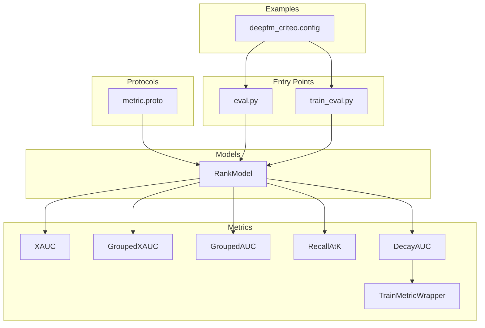
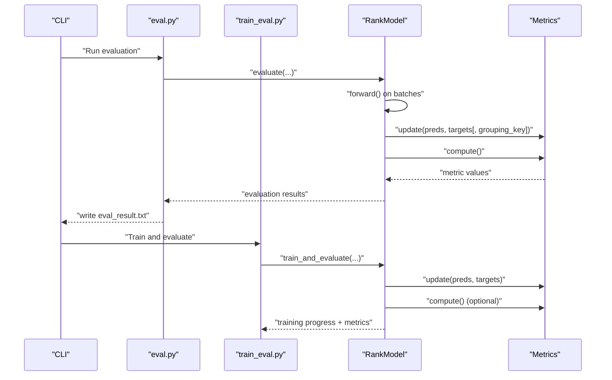
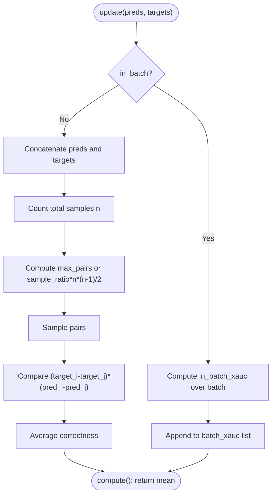
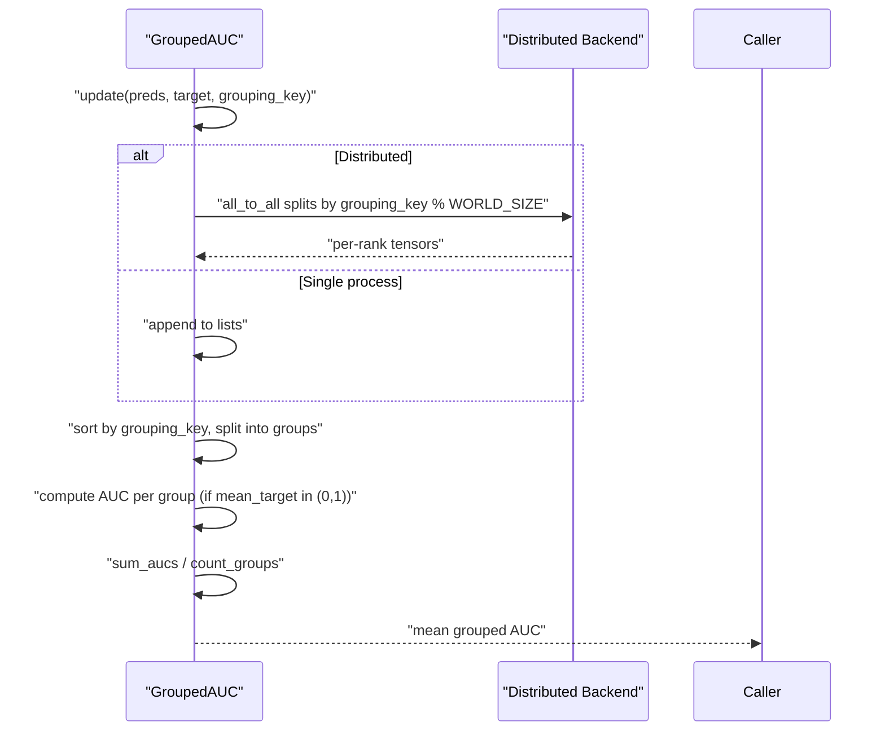
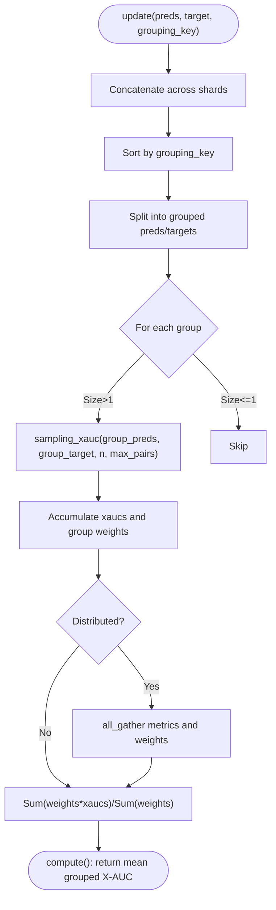
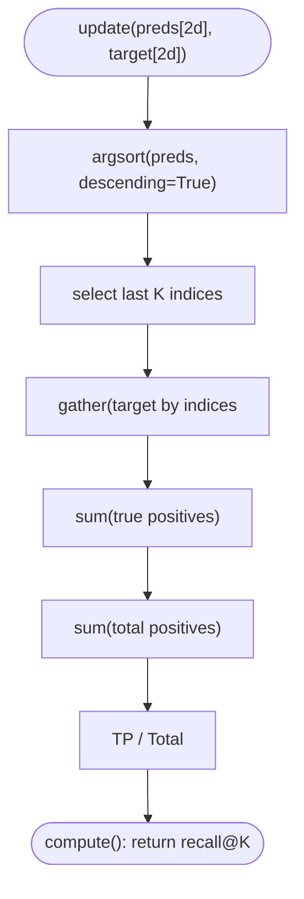
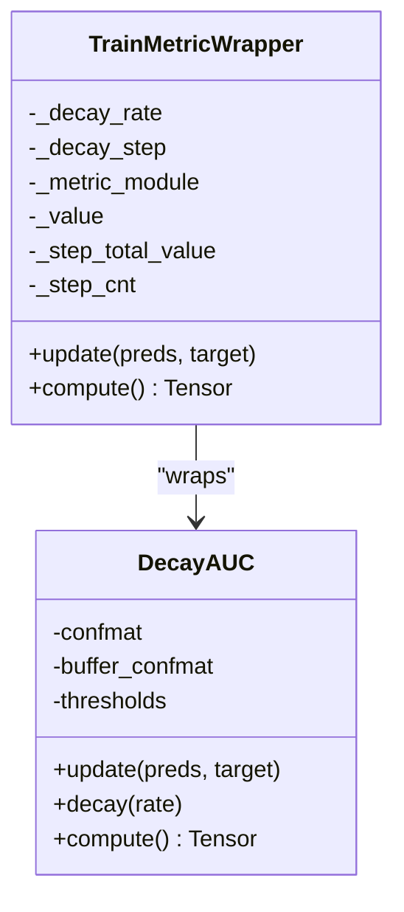
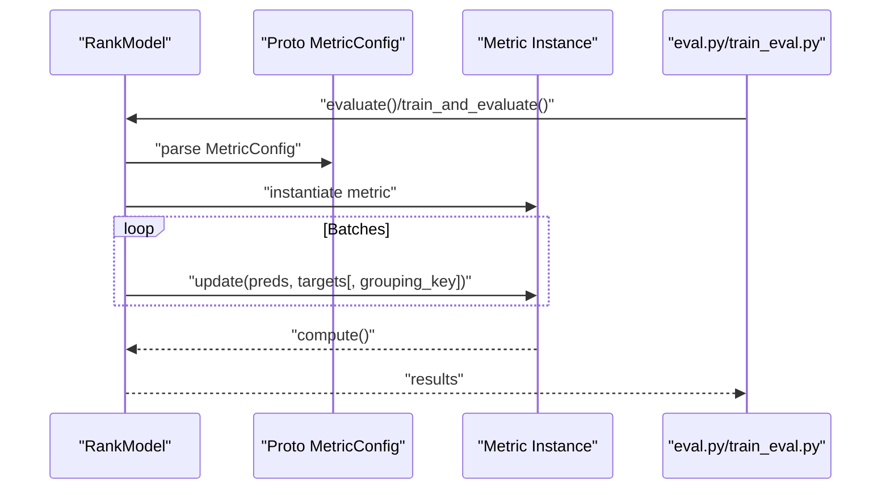
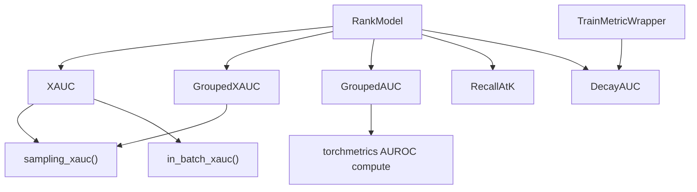

# Evaluation and Metrics System

<cite>
**Referenced Files in This Document**
- [tzrec/metrics/xauc.py](file://tzrec/metrics/xauc.py)
- [tzrec/metrics/grouped_xauc.py](file://tzrec/metrics/grouped_xauc.py)
- [tzrec/metrics/grouped_auc.py](file://tzrec/metrics/grouped_auc.py)
- [tzrec/metrics/recall_at_k.py](file://tzrec/metrics/recall_at_k.py)
- [tzrec/metrics/decay_auc.py](file://tzrec/metrics/decay_auc.py)
- [tzrec/metrics/train_metric_wrapper.py](file://tzrec/metrics/train_metric_wrapper.py)
- [tzrec/protos/metric.proto](file://tzrec/protos/metric.proto)
- [tzrec/eval.py](file://tzrec/eval.py)
- [tzrec/train_eval.py](file://tzrec/train_eval.py)
- [tzrec/models/rank_model.py](file://tzrec/models/rank_model.py)
- [examples/deepfm_criteo.config](file://examples/deepfm_criteo.config)
- [tzrec/metrics/xauc_test.py](file://tzrec/metrics/xauc_test.py)
- [tzrec/metrics/grouped_xauc_test.py](file://tzrec/metrics/grouped_xauc_test.py)
- [tzrec/metrics/recall_at_k_test.py](file://tzrec/metrics/recall_at_k_test.py)
</cite>

## Table of Contents

1. [Introduction](#introduction)
1. [Project Structure](#project-structure)
1. [Core Components](#core-components)
1. [Architecture Overview](#architecture-overview)
1. [Detailed Component Analysis](#detailed-component-analysis)
1. [Dependency Analysis](#dependency-analysis)
1. [Performance Considerations](#performance-considerations)
1. [Troubleshooting Guide](#troubleshooting-guide)
1. [Conclusion](#conclusion)
1. [Appendices](#appendices)

## Introduction

This document explains TorchEasyRec’s evaluation and metrics system with a focus on the evaluation pipeline, metric implementations, and integration with training. It covers specialized recommendation metrics such as X-AUC, grouped AUC, recall@K, and decayed AUC, along with their configurations, computation workflows, and best practices for performance evaluation, A/B testing, and production monitoring.

## Project Structure

The metrics system resides primarily under the metrics package and integrates with the model training and evaluation entry points. Configuration is defined via protocol buffers and consumed by the ranking model during training and evaluation.

**Diagram sources**

- \[tzrec/metrics/xauc.py\](file://tzrec/metrics/xauc.py#L74-L174)
- \[tzrec/metrics/grouped_xauc.py\](file://tzrec/metrics/grouped_xauc.py#L65-L169)
- \[tzrec/metrics/grouped_auc.py\](file://tzrec/metrics/grouped_auc.py#L22-L126)
- \[tzrec/metrics/recall_at_k.py\](file://tzrec/metrics/recall_at_k.py#L19-L55)
- \[tzrec/metrics/decay_auc.py\](file://tzrec/metrics/decay_auc.py#L24-L61)
- \[tzrec/metrics/train_metric_wrapper.py\](file://tzrec/metrics/train_metric_wrapper.py#L20-L63)
- \[tzrec/protos/metric.proto\](file://tzrec/protos/metric.proto#L48-L77)
- \[tzrec/models/rank_model.py\](file://tzrec/models/rank_model.py#L286-L414)
- \[tzrec/eval.py\](file://tzrec/eval.py#L16-L51)
- \[tzrec/train_eval.py\](file://tzrec/train_eval.py#L16-L73)
- \[examples/deepfm_criteo.config\](file://examples/deepfm_criteo.config#L1-L31)

**Section sources**

- \[tzrec/metrics/xauc.py\](file://tzrec/metrics/xauc.py#L1-L174)
- \[tzrec/metrics/grouped_xauc.py\](file://tzrec/metrics/grouped_xauc.py#L1-L169)
- \[tzrec/metrics/grouped_auc.py\](file://tzrec/metrics/grouped_auc.py#L1-L126)
- \[tzrec/metrics/recall_at_k.py\](file://tzrec/metrics/recall_at_k.py#L1-L55)
- \[tzrec/metrics/decay_auc.py\](file://tzrec/metrics/decay_auc.py#L1-L61)
- \[tzrec/metrics/train_metric_wrapper.py\](file://tzrec/metrics/train_metric_wrapper.py#L1-L63)
- \[tzrec/protos/metric.proto\](file://tzrec/protos/metric.proto#L1-L77)
- \[tzrec/eval.py\](file://tzrec/eval.py#L1-L51)
- \[tzrec/train_eval.py\](file://tzrec/train_eval.py#L1-L73)
- \[examples/deepfm_criteo.config\](file://examples/deepfm_criteo.config#L1-L31)

## Core Components

- X-AUC: A pair-wise ranking metric suitable for short video and session-based recommendations. Supports in-batch and full-sample modes with configurable downsampling.
- Grouped AUC: Computes AUC per group and averages by group weights, enabling fairness across segments.
- Grouped X-AUC: Extends X-AUC to compute per-group X-AUC and returns a weighted global X-AUC.
- Recall@K: Standard recall computed over top-K predictions per sample.
- Decay AUC: AUC with exponential decay for training metrics to emphasize recent performance.
- TrainMetricWrapper: Wraps metrics for training with periodic decay and smoothing.
- Protobuf Metric Config: Defines metric types and parameters for configuration-driven evaluation.

**Section sources**

- \[tzrec/metrics/xauc.py\](file://tzrec/metrics/xauc.py#L74-L174)
- \[tzrec/metrics/grouped_auc.py\](file://tzrec/metrics/grouped_auc.py#L22-L126)
- \[tzrec/metrics/grouped_xauc.py\](file://tzrec/metrics/grouped_xauc.py#L65-L169)
- \[tzrec/metrics/recall_at_k.py\](file://tzrec/metrics/recall_at_k.py#L19-L55)
- \[tzrec/metrics/decay_auc.py\](file://tzrec/metrics/decay_auc.py#L24-L61)
- \[tzrec/metrics/train_metric_wrapper.py\](file://tzrec/metrics/train_metric_wrapper.py#L20-L63)
- \[tzrec/protos/metric.proto\](file://tzrec/protos/metric.proto#L48-L77)

## Architecture Overview

The evaluation pipeline integrates with the training loop and supports distributed evaluation. Metrics are configured via protobuf messages and instantiated inside the ranking model. During evaluation, predictions and targets are passed to metric instances, which aggregate statistics and compute final scores.

**Diagram sources**

- \[tzrec/eval.py\](file://tzrec/eval.py#L16-L51)
- \[tzrec/train_eval.py\](file://tzrec/train_eval.py#L16-L73)
- \[tzrec/models/rank_model.py\](file://tzrec/models/rank_model.py#L286-L414)
- \[tzrec/metrics/xauc.py\](file://tzrec/metrics/xauc.py#L128-L174)
- \[tzrec/metrics/grouped_auc.py\](file://tzrec/metrics/grouped_auc.py#L96-L126)
- \[tzrec/metrics/grouped_xauc.py\](file://tzrec/metrics/grouped_xauc.py#L92-L169)
- \[tzrec/metrics/recall_at_k.py\](file://tzrec/metrics/recall_at_k.py#L37-L55)

## Detailed Component Analysis

### X-AUC

X-AUC measures pairwise ranking correctness across samples. It supports two computation modes:

- In-batch mode: computes X-AUC per batch and averages across batches.
- Full-sample mode: concatenates all predictions/targets and samples pairs across the entire evaluation set.

Key parameters:

- sample_ratio: fraction of all possible pairs to sample.
- max_pairs: absolute cap on sampled pairs.
- in_batch: whether to compute per-batch X-AUC.

**Diagram sources**

- \[tzrec/metrics/xauc.py\](file://tzrec/metrics/xauc.py#L55-L71)
- \[tzrec/metrics/xauc.py\](file://tzrec/metrics/xauc.py#L20-L52)
- \[tzrec/metrics/xauc.py\](file://tzrec/metrics/xauc.py#L128-L174)

Practical configuration:

- Use in_batch=True for large datasets to reduce memory and improve speed.
- Tune sample_ratio or max_pairs to balance accuracy and performance.

Use cases:

- Session-based recommendation where pairwise consistency matters.
- Short video ranking where local pairwise preferences are important.

**Section sources**

- \[tzrec/metrics/xauc.py\](file://tzrec/metrics/xauc.py#L74-L174)
- \[tzrec/protos/metric.proto\](file://tzrec/protos/metric.proto#L36-L40)
- \[tzrec/metrics/xauc_test.py\](file://tzrec/metrics/xauc_test.py#L20-L46)

### Grouped AUC

Computes AUC per group and returns a weighted average across groups. It supports distributed evaluation by sharding samples across ranks and aggregating results.

**Diagram sources**

- \[tzrec/metrics/grouped_auc.py\](file://tzrec/metrics/grouped_auc.py#L34-L95)
- \[tzrec/metrics/grouped_auc.py\](file://tzrec/metrics/grouped_auc.py#L96-L126)

Use cases:

- Fairness across user segments, regions, or devices.
- Multi-silo or multi-domain evaluation requiring per-domain AUC reporting.

**Section sources**

- \[tzrec/metrics/grouped_auc.py\](file://tzrec/metrics/grouped_auc.py#L22-L126)
- \[tzrec/protos/metric.proto\](file://tzrec/protos/metric.proto#L32-L34)

### Grouped X-AUC

Per-group X-AUC with weighted aggregation. It sorts by grouping_key, splits into groups, and computes X-AUC per group up to a max_pairs_per_group limit, then averages by group sizes.

**Diagram sources**

- \[tzrec/metrics/grouped_xauc.py\](file://tzrec/metrics/grouped_xauc.py#L78-L91)
- \[tzrec/metrics/grouped_xauc.py\](file://tzrec/metrics/grouped_xauc.py#L92-L169)
- \[tzrec/metrics/xauc.py\](file://tzrec/metrics/xauc.py#L20-L52)

Use cases:

- Segment-wise ranking consistency across demographics or content categories.
- Production monitoring where per-group performance must be tracked.

**Section sources**

- \[tzrec/metrics/grouped_xauc.py\](file://tzrec/metrics/grouped_xauc.py#L65-L169)
- \[tzrec/protos/metric.proto\](file://tzrec/protos/metric.proto#L42-L46)
- \[tzrec/metrics/grouped_xauc_test.py\](file://tzrec/metrics/grouped_xauc_test.py#L20-L39)

### Recall@K

Standard recall@K computed over top-K predictions per sample. It tracks true positives in top-K and divides by total positives.

**Diagram sources**

- \[tzrec/metrics/recall_at_k.py\](file://tzrec/metrics/recall_at_k.py#L37-L54)

Use cases:

- Retrieval and recommendation tasks where top-K relevance matters.
- Diversity-aware ranking where coverage of positive items is important.

**Section sources**

- \[tzrec/metrics/recall_at_k.py\](file://tzrec/metrics/recall_at_k.py#L19-L55)
- \[tzrec/protos/metric.proto\](file://tzrec/protos/metric.proto#L15-L17)
- \[tzrec/metrics/recall_at_k_test.py\](file://tzrec/metrics/recall_at_k_test.py#L20-L34)

### Decay AUC and TrainMetricWrapper

DecayAUC maintains a decaying confusion matrix buffer and computes AUC from aggregated states. TrainMetricWrapper periodically decays or resets metrics for training logs.

**Diagram sources**

- \[tzrec/metrics/decay_auc.py\](file://tzrec/metrics/decay_auc.py#L24-L61)
- \[tzrec/metrics/train_metric_wrapper.py\](file://tzrec/metrics/train_metric_wrapper.py#L20-L63)

Use cases:

- Training-time monitoring with smoothed metrics to avoid noisy spikes.
- Early stopping or LR scheduling based on recent performance trends.

**Section sources**

- \[tzrec/metrics/decay_auc.py\](file://tzrec/metrics/decay_auc.py#L24-L61)
- \[tzrec/metrics/train_metric_wrapper.py\](file://tzrec/metrics/train_metric_wrapper.py#L20-L63)
- \[tzrec/protos/metric.proto\](file://tzrec/protos/metric.proto#L63-L77)

### Integration with Training and Evaluation

- RankModel instantiates metrics from protobuf configs and updates them during forward passes.
- Evaluation entry points trigger evaluation runs and write results to disk.
- Example configs demonstrate how to set up evaluation inputs and steps.

**Diagram sources**

- \[tzrec/models/rank_model.py\](file://tzrec/models/rank_model.py#L286-L414)
- \[tzrec/protos/metric.proto\](file://tzrec/protos/metric.proto#L48-L77)
- \[tzrec/eval.py\](file://tzrec/eval.py#L16-L51)
- \[tzrec/train_eval.py\](file://tzrec/train_eval.py#L16-L73)

**Section sources**

- \[tzrec/models/rank_model.py\](file://tzrec/models/rank_model.py#L286-L414)
- \[tzrec/protos/metric.proto\](file://tzrec/protos/metric.proto#L48-L77)
- \[tzrec/eval.py\](file://tzrec/eval.py#L16-L51)
- \[tzrec/train_eval.py\](file://tzrec/train_eval.py#L16-L73)
- \[examples/deepfm_criteo.config\](file://examples/deepfm_criteo.config#L21-L23)

## Dependency Analysis

- Metrics depend on torchmetrics for standard metrics and PyTorch for distributed operations.
- Grouped metrics rely on sorting and splitting tensors by grouping keys.
- X-AUC relies on pair-wise comparisons and optional random sampling.
- TrainMetricWrapper depends on DecayAUC for decayed training metrics.

**Diagram sources**

- \[tzrec/metrics/xauc.py\](file://tzrec/metrics/xauc.py#L20-L71)
- \[tzrec/metrics/grouped_xauc.py\](file://tzrec/metrics/grouped_xauc.py#L126-L128)
- \[tzrec/metrics/grouped_auc.py\](file://tzrec/metrics/grouped_auc.py#L116-L117)
- \[tzrec/metrics/train_metric_wrapper.py\](file://tzrec/metrics/train_metric_wrapper.py#L47-L58)
- \[tzrec/models/rank_model.py\](file://tzrec/models/rank_model.py#L286-L414)

**Section sources**

- \[tzrec/metrics/xauc.py\](file://tzrec/metrics/xauc.py#L1-L174)
- \[tzrec/metrics/grouped_xauc.py\](file://tzrec/metrics/grouped_xauc.py#L1-L169)
- \[tzrec/metrics/grouped_auc.py\](file://tzrec/metrics/grouped_auc.py#L1-L126)
- \[tzrec/metrics/recall_at_k.py\](file://tzrec/metrics/recall_at_k.py#L1-L55)
- \[tzrec/metrics/decay_auc.py\](file://tzrec/metrics/decay_auc.py#L1-L61)
- \[tzrec/metrics/train_metric_wrapper.py\](file://tzrec/metrics/train_metric_wrapper.py#L1-L63)
- \[tzrec/models/rank_model.py\](file://tzrec/models/rank_model.py#L286-L414)

## Performance Considerations

- X-AUC in-batch mode reduces memory and improves throughput for large datasets; ensure evaluation data is shuffled to minimize bias.
- Use max_pairs or sample_ratio to cap computational cost; larger sample ratios increase accuracy but memory/CPU usage.
- Grouped metrics require sorting and splitting; keep grouping_key balanced to avoid heavy skew.
- DecayAUC reduces noise in training logs by smoothing recent performance; tune decay_step to align with logging cadence.
- Distributed evaluation: GroupedAUC uses all_to_all to shard data across ranks; ensure WORLD_SIZE and RANK are set appropriately.

[No sources needed since this section provides general guidance]

## Troubleshooting Guide

Common issues and resolutions:

- Memory errors with X-AUC full-sample mode:
  - Switch to in_batch=True or reduce sample_ratio/max_pairs.
- Unstable grouped metrics:
  - Verify grouping_key distribution; small groups may cause NaN or unstable estimates.
- Zero or constant targets:
  - GroupedAUC skips groups with mean_target not in (0,1); ensure labels vary within groups.
- Training metric drift:
  - Adjust decay_rate/decay_step in TrainMetricWrapper to smooth logs; for DecayAUC, call decay() periodically.
- Evaluation not writing results:
  - Confirm eval_result_filename and output paths; check CLI arguments for eval.py/train_eval.py.

**Section sources**

- \[tzrec/metrics/xauc.py\](file://tzrec/metrics/xauc.py#L144-L174)
- \[tzrec/metrics/grouped_auc.py\](file://tzrec/metrics/grouped_auc.py#L96-L126)
- \[tzrec/metrics/train_metric_wrapper.py\](file://tzrec/metrics/train_metric_wrapper.py#L42-L62)
- \[tzrec/eval.py\](file://tzrec/eval.py#L16-L51)
- \[tzrec/train_eval.py\](file://tzrec/train_eval.py#L16-L73)

## Conclusion

TorchEasyRec’s metrics system provides robust, scalable evaluation primitives tailored for recommendation tasks. Specialized metrics like X-AUC and grouped variants enable nuanced performance assessment across sessions, domains, and user segments. Proper configuration, batching strategies, and distributed evaluation ensure reliable and efficient evaluation pipelines suitable for production A/B testing and continuous monitoring.

[No sources needed since this section summarizes without analyzing specific files]

## Appendices

### Practical Configuration Examples

- Configure X-AUC with downsampling:
  - sample_ratio: set to a small value (e.g., 1e-3) for large datasets.
  - max_pairs: cap total pairs when full-sample mode is preferred.
- Grouped AUC:
  - grouping_key: specify a feature name present in the dataset.
- Grouped X-AUC:
  - grouping_key: same as above; max_pairs_per_group controls per-group sampling.
- Recall@K:
  - top_k: choose based on retrieval depth and business goals.

**Section sources**

- \[tzrec/protos/metric.proto\](file://tzrec/protos/metric.proto#L15-L17)
- \[tzrec/protos/metric.proto\](file://tzrec/protos/metric.proto#L32-L34)
- \[tzrec/protos/metric.proto\](file://tzrec/protos/metric.proto#L36-L40)
- \[tzrec/protos/metric.proto\](file://tzrec/protos/metric.proto#L42-L46)

### Mathematical Formulations

- X-AUC (pairwise correctness):
  - For each pair (i, j) where i < j, compare sign(target_i - target_j) and sign(pred_i - pred_j). X-AUC is the fraction of concordant pairs.
- Grouped AUC:
  - Compute AUC per group; average by group weights (e.g., group size).
- Grouped X-AUC:
  - Compute X-AUC per group up to max_pairs_per_group; weighted average by group sizes.
- Recall@K:
  - TP@K / TotalPositives, where TP@K is the number of relevant items among top-K predictions.

**Section sources**

- \[tzrec/metrics/xauc.py\](file://tzrec/metrics/xauc.py#L20-L52)
- \[tzrec/metrics/grouped_auc.py\](file://tzrec/metrics/grouped_auc.py#L112-L125)
- \[tzrec/metrics/grouped_xauc.py\](file://tzrec/metrics/grouped_xauc.py#L122-L131)
- \[tzrec/metrics/recall_at_k.py\](file://tzrec/metrics/recall_at_k.py#L44-L54)
