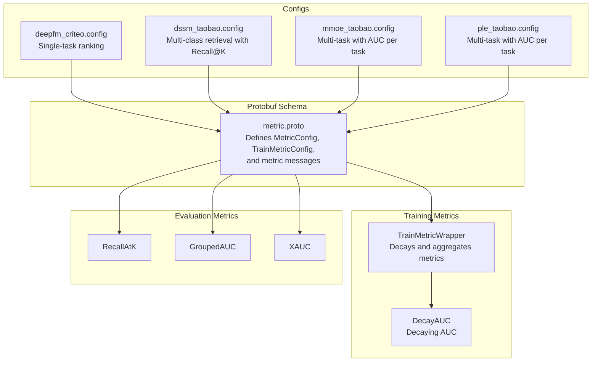
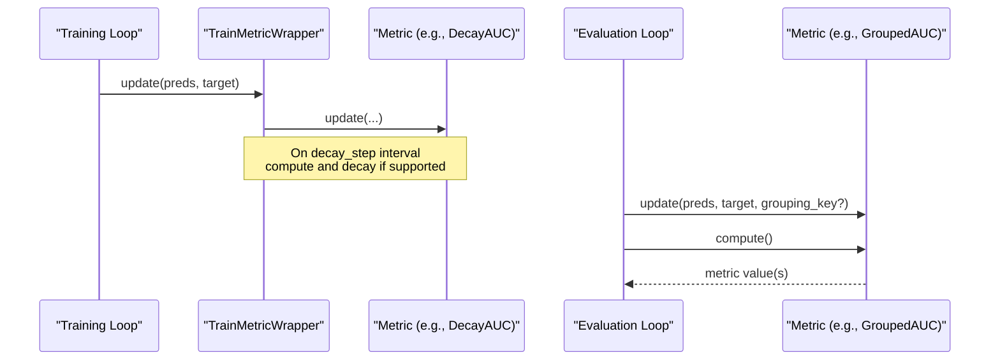
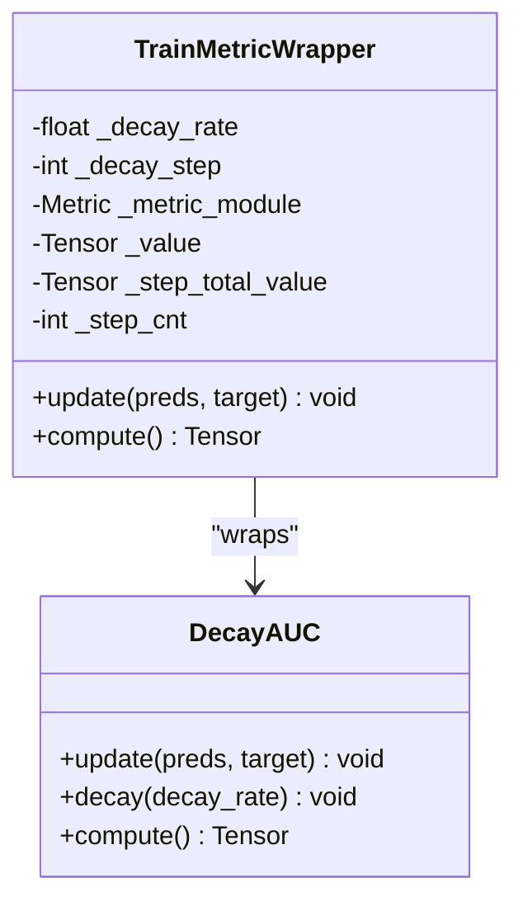
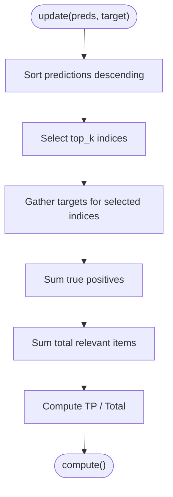
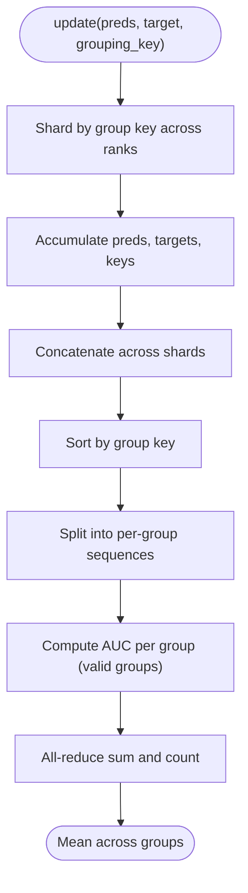
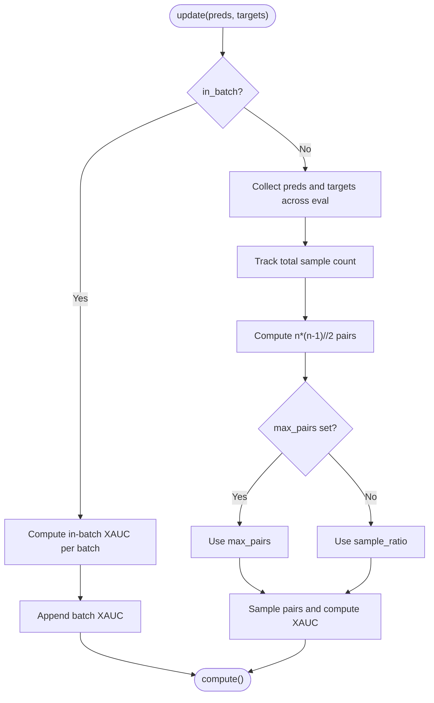
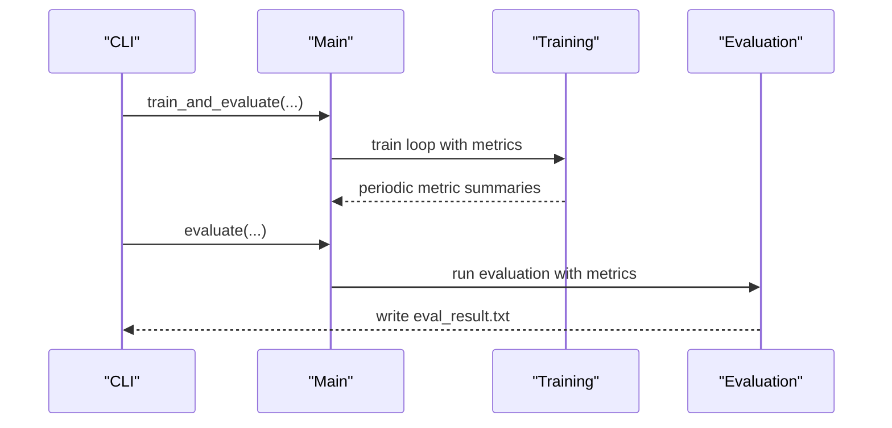
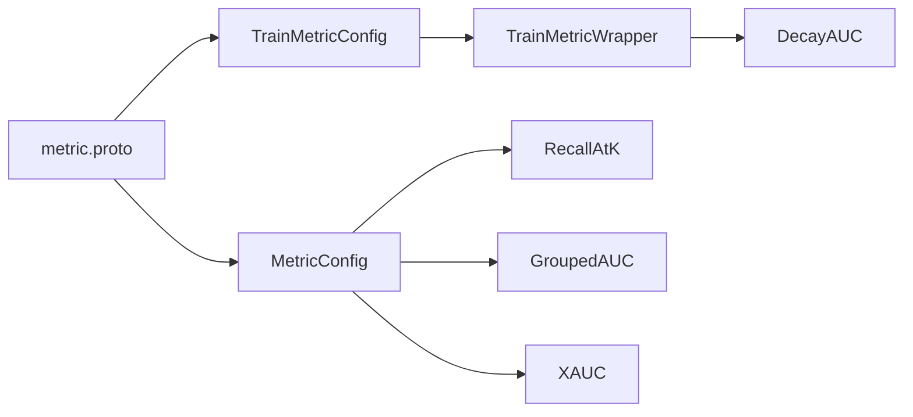

# Metric Configuration and Usage

<cite>
**Referenced Files in This Document**
- [metric.proto](file://tzrec/protos/metric.proto)
- [train_metric_wrapper.py](file://tzrec/metrics/train_metric_wrapper.py)
- [decay_auc.py](file://tzrec/metrics/decay_auc.py)
- [recall_at_k.py](file://tzrec/metrics/recall_at_k.py)
- [grouped_auc.py](file://tzrec/metrics/grouped_auc.py)
- [xauc.py](file://tzrec/metrics/xauc.py)
- [eval.md](file://docs/source/usage/eval.md)
- [train_eval.py](file://tzrec/train_eval.py)
- [eval.py](file://tzrec/eval.py)
- [deepfm_criteo.config](file://examples/deepfm_criteo.config)
- [dssm_taobao.config](file://examples/dssm_taobao.config)
- [mmoe_taobao.config](file://examples/mmoe_taobao.config)
- [ple_taobao.config](file://examples/ple_taobao.config)
</cite>

## Table of Contents

1. [Introduction](#introduction)
1. [Project Structure](#project-structure)
1. [Core Components](#core-components)
1. [Architecture Overview](#architecture-overview)
1. [Detailed Component Analysis](#detailed-component-analysis)
1. [Dependency Analysis](#dependency-analysis)
1. [Performance Considerations](#performance-considerations)
1. [Troubleshooting Guide](#troubleshooting-guide)
1. [Conclusion](#conclusion)
1. [Appendices](#appendices)

## Introduction

This document explains how to configure and use metrics in TorchEasyRec. It covers the Protocol Buffers schema for metrics, how to define metrics in pipeline configurations, how training-time metrics are decayed and aggregated, and how evaluation-time metrics are computed and reported. Practical examples demonstrate configurations for ranking, multi-task learning, and recall-based tasks. Guidance is also provided for selecting appropriate metrics, interpreting results, optimizing performance, and troubleshooting common configuration issues.

## Project Structure

Metrics in TorchEasyRec are defined via Protocol Buffers and implemented using PyTorch Metrics. Training-time metrics are optionally decayed and aggregated, while evaluation-time metrics are computed over the entire dataset or batches depending on the metric type.

**Diagram sources**

- \[metric.proto\](file://tzrec/protos/metric.proto#L48-L76)
- \[train_metric_wrapper.py\](file://tzrec/metrics/train_metric_wrapper.py#L20-L62)
- \[decay_auc.py\](file://tzrec/metrics/decay_auc.py#L24-L60)
- \[recall_at_k.py\](file://tzrec/metrics/recall_at_k.py#L19-L54)
- \[grouped_auc.py\](file://tzrec/metrics/grouped_auc.py#L22-L125)
- \[xauc.py\](file://tzrec/metrics/xauc.py#L74-L173)
- \[deepfm_criteo.config\](file://examples/deepfm_criteo.config#L390-L396)
- \[dssm_taobao.config\](file://examples/dssm_taobao.config#L253-L262)
- \[mmoe_taobao.config\](file://examples/mmoe_taobao.config#L191-L212)
- \[ple_taobao.config\](file://examples/ple_taobao.config#L215-L242)

**Section sources**

- \[metric.proto\](file://tzrec/protos/metric.proto#L1-L77)
- \[train_metric_wrapper.py\](file://tzrec/metrics/train_metric_wrapper.py#L1-L63)
- \[recall_at_k.py\](file://tzrec/metrics/recall_at_k.py#L1-L55)
- \[grouped_auc.py\](file://tzrec/metrics/grouped_auc.py#L1-L126)
- \[xauc.py\](file://tzrec/metrics/xauc.py#L1-L174)
- \[deepfm_criteo.config\](file://examples/deepfm_criteo.config#L1-L397)
- \[dssm_taobao.config\](file://examples/dssm_taobao.config#L1-L267)
- \[mmoe_taobao.config\](file://examples/mmoe_taobao.config#L1-L216)
- \[ple_taobao.config\](file://examples/ple_taobao.config#L1-L246)

## Core Components

- Metric schema: Defines metric types and parameters via Protocol Buffers.
- Training-time metrics: Decayed and aggregated periodically during training.
- Evaluation-time metrics: Computed over the evaluation dataset or batches.

Key capabilities:

- Binary and multiclass AUC with configurable thresholds.
- Recall@K for retrieval tasks.
- Grouped AUC for stratified evaluation.
- XAUC for short video recommendation with downsampling options.
- Train-time decay for AUC and other metrics.

**Section sources**

- \[metric.proto\](file://tzrec/protos/metric.proto#L4-L76)
- \[train_metric_wrapper.py\](file://tzrec/metrics/train_metric_wrapper.py#L20-L62)
- \[decay_auc.py\](file://tzrec/metrics/decay_auc.py#L24-L60)
- \[recall_at_k.py\](file://tzrec/metrics/recall_at_k.py#L19-L54)
- \[grouped_auc.py\](file://tzrec/metrics/grouped_auc.py#L22-L125)
- \[xauc.py\](file://tzrec/metrics/xauc.py#L74-L173)

## Architecture Overview

The metric system integrates with the training and evaluation loops. During training, predictions and targets are passed to a wrapper that updates and decays metrics at specified intervals. During evaluation, metrics are computed over the held-out dataset according to their definitions.

**Diagram sources**

- \[train_metric_wrapper.py\](file://tzrec/metrics/train_metric_wrapper.py#L42-L62)
- \[decay_auc.py\](file://tzrec/metrics/decay_auc.py#L42-L60)
- \[grouped_auc.py\](file://tzrec/metrics/grouped_auc.py#L34-L125)

**Section sources**

- \[train_metric_wrapper.py\](file://tzrec/metrics/train_metric_wrapper.py#L20-L62)
- \[grouped_auc.py\](file://tzrec/metrics/grouped_auc.py#L22-L125)

## Detailed Component Analysis

### Metric Schema (Protocol Buffers)

The schema defines metric types and parameters used in pipeline configurations:

- AUC: supports thresholds count.
- MulticlassAUC: supports thresholds and averaging mode (macro or weighted).
- RecallAtK: supports top_k.
- MeanAbsoluteError, MeanSquaredError, Accuracy: support threshold and top_k for multiclass.
- GroupedAUC: requires a grouping key field name.
- XAUC: supports sample_ratio, max_pairs, and in-batch computation.
- GroupedXAUC: similar to XAUC but grouped by a key.

Training-specific:

- TrainMetricConfig supports the same metric types as MetricConfig plus decay_rate and decay_step.

Practical usage:

- Add metrics under model_config.metrics or task_towers.metrics in configs.
- Adjust parameters like thresholds, top_k, sample_ratio, max_pairs, and decay_rate.

**Section sources**

- \[metric.proto\](file://tzrec/protos/metric.proto#L4-L76)

### Training-Time Metric Wrapper

The wrapper updates underlying metrics, tracks steps, and applies exponential decay for supported metrics (e.g., DecayAUC). After decay_step updates, it either decays DecayAUC or averages the computed value with a decay factor for others.

**Diagram sources**

- \[train_metric_wrapper.py\](file://tzrec/metrics/train_metric_wrapper.py#L20-L62)
- \[decay_auc.py\](file://tzrec/metrics/decay_auc.py#L24-L60)

**Section sources**

- \[train_metric_wrapper.py\](file://tzrec/metrics/train_metric_wrapper.py#L20-L62)
- \[decay_auc.py\](file://tzrec/metrics/decay_auc.py#L24-L60)

### Recall@K

Computes recall at top_k by sorting predictions and counting relevant items within the top_k window.

**Diagram sources**

- \[recall_at_k.py\](file://tzrec/metrics/recall_at_k.py#L37-L54)

**Section sources**

- \[recall_at_k.py\](file://tzrec/metrics/recall_at_k.py#L19-L54)

### Grouped AUC

Computes AUC per group and averages across groups. Supports distributed all-to-all sharding by group keys and reduces results across workers.

**Diagram sources**

- \[grouped_auc.py\](file://tzrec/metrics/grouped_auc.py#L34-L125)

**Section sources**

- \[grouped_auc.py\](file://tzrec/metrics/grouped_auc.py#L22-L125)

### XAUC

XAUC measures pairwise ranking correctness with optional downsampling. It supports:

- Global evaluation with downsampling controlled by sample_ratio or max_pairs.
- In-batch evaluation for memory efficiency.

**Diagram sources**

- \[xauc.py\](file://tzrec/metrics/xauc.py#L128-L173)

**Section sources**

- \[xauc.py\](file://tzrec/metrics/xauc.py#L74-L173)

### Configuring Metrics in Pipeline Configurations

- Single-task ranking (binary classification):

  - Define AUC under model_config.metrics.
  - Example path: \[deepfm_criteo.config\](file://examples/deepfm_criteo.config#L390-L396)

- Multi-class retrieval (recall-based):

  - Define RecallAtK with top_k values under model_config.metrics.
  - Example path: \[dssm_taobao.config\](file://examples/dssm_taobao.config#L253-L262)

- Multi-task learning (per-task metrics):

  - Define AUC under each task_towers.metrics with optional thresholds.
  - Examples path: \[mmoe_taobao.config\](file://examples/mmoe_taobao.config#L191-L212), \[ple_taobao.config\](file://examples/ple_taobao.config#L215-L242)

- Training-time decayed metrics:

  - Use TrainMetricConfig with decay_rate and decay_step alongside metric definitions.
  - Schema reference: \[metric.proto\](file://tzrec/protos/metric.proto#L63-L76)

**Section sources**

- \[deepfm_criteo.config\](file://examples/deepfm_criteo.config#L390-L396)
- \[dssm_taobao.config\](file://examples/dssm_taobao.config#L253-L262)
- \[mmoe_taobao.config\](file://examples/mmoe_taobao.config#L191-L212)
- \[ple_taobao.config\](file://examples/ple_taobao.config#L215-L242)
- \[metric.proto\](file://tzrec/protos/metric.proto#L63-L76)

### Metric Evaluation Workflow in Training and Evaluation

- Training:

  - At each step, update metrics with predictions and targets.
  - Periodically decay or reset metrics and maintain a moving average for non-DecayAUC metrics.
  - Reference: \[train_metric_wrapper.py\](file://tzrec/metrics/train_metric_wrapper.py#L42-L62)

- Evaluation:

  - Run evaluation with the evaluation CLI and inspect eval_result.txt.
  - Reference: \[eval.md\](file://docs/source/usage/eval.md#L1-L34)

**Diagram sources**

- \[train_eval.py\](file://tzrec/train_eval.py#L63-L72)
- \[eval.py\](file://tzrec/eval.py#L45-L50)
- \[eval.md\](file://docs/source/usage/eval.md#L1-L34)

**Section sources**

- \[train_metric_wrapper.py\](file://tzrec/metrics/train_metric_wrapper.py#L20-L62)
- \[eval.md\](file://docs/source/usage/eval.md#L1-L34)

## Dependency Analysis

- Protobuf schema defines metric types consumed by both training and evaluation paths.
- Training-time wrapper depends on torchmetrics and supports DecayAUC specifically.
- Evaluation metrics depend on torch and torchmetrics; some support distributed computation.

**Diagram sources**

- \[metric.proto\](file://tzrec/protos/metric.proto#L48-L76)
- \[train_metric_wrapper.py\](file://tzrec/metrics/train_metric_wrapper.py#L20-L62)
- \[decay_auc.py\](file://tzrec/metrics/decay_auc.py#L24-L60)
- \[recall_at_k.py\](file://tzrec/metrics/recall_at_k.py#L19-L54)
- \[grouped_auc.py\](file://tzrec/metrics/grouped_auc.py#L22-L125)
- \[xauc.py\](file://tzrec/metrics/xauc.py#L74-L173)

**Section sources**

- \[metric.proto\](file://tzrec/protos/metric.proto#L48-L76)
- \[train_metric_wrapper.py\](file://tzrec/metrics/train_metric_wrapper.py#L20-L62)

## Performance Considerations

- AUC thresholds: Larger thresholds increase accuracy estimation fidelity but may reduce speed; adjust based on dataset scale.
- Recall@K: top_k impacts precision/recall trade-offs; choose values aligned with downstream cutoffs.
- XAUC:
  - sample_ratio or max_pairs controls memory and compute; reduce for large eval sets.
  - in_batch mode reduces memory footprint but may introduce bias; ensure eval data is shuffled.
- Grouped AUC:
  - Distributed all-to-all communication adds overhead; ensure balanced group sizes.
- Training decay:
  - decay_step should align with log_step_count_steps for consistent reporting.
  - decay_rate balances responsiveness vs. stability; tune empirically.

[No sources needed since this section provides general guidance]

## Troubleshooting Guide

- AUC thresholds out of range:

  - Verify thresholds in MulticlassAUC/AUC are reasonable for your dataset cardinality.
  - Reference: \[metric.proto\](file://tzrec/protos/metric.proto#L8-L13), \[metric.proto\](file://tzrec/protos/metric.proto#L4-L6)

- Recall@K top_k too large:

  - Ensure top_k does not exceed available candidates; otherwise, results may be misleading.
  - Reference: \[recall_at_k.py\](file://tzrec/metrics/recall_at_k.py#L26-L28)

- XAUC memory errors:

  - Reduce sample_ratio or set max_pairs; prefer in_batch mode for very large eval sets.
  - Reference: \[xauc.py\](file://tzrec/metrics/xauc.py#L103-L126), \[xauc.py\](file://tzrec/metrics/xauc.py#L164-L169)

- Grouped AUC imbalance:

  - Uneven group sizes can skew results; consider balancing groups or adjusting grouping_key.
  - Reference: \[grouped_auc.py\](file://tzrec/metrics/grouped_auc.py#L112-L125)

- Training vs. evaluation metric mismatch:

  - Ensure metric definitions in configs match model outputs and labels.
  - Reference: \[deepfm_criteo.config\](file://examples/deepfm_criteo.config#L390-L396), \[dssm_taobao.config\](file://examples/dssm_taobao.config#L253-L262)

**Section sources**

- \[metric.proto\](file://tzrec/protos/metric.proto#L4-L13)
- \[recall_at_k.py\](file://tzrec/metrics/recall_at_k.py#L26-L28)
- \[xauc.py\](file://tzrec/metrics/xauc.py#L103-L126)
- \[xauc.py\](file://tzrec/metrics/xauc.py#L164-L169)
- \[grouped_auc.py\](file://tzrec/metrics/grouped_auc.py#L112-L125)
- \[deepfm_criteo.config\](file://examples/deepfm_criteo.config#L390-L396)
- \[dssm_taobao.config\](file://examples/dssm_taobao.config#L253-L262)

## Conclusion

TorchEasyRec’s metric system provides flexible, configurable evaluation for both training and evaluation phases. By leveraging the Protocol Buffers schema, implementing robust metric classes, and tuning decay and downsampling parameters, practitioners can monitor meaningful signals, interpret results accurately, and optimize performance for large-scale recommendation systems.

[No sources needed since this section summarizes without analyzing specific files]

## Appendices

### Practical Configuration Examples

- Binary ranking with AUC:
  - Path: \[deepfm_criteo.config\](file://examples/deepfm_criteo.config#L390-L396)
- Retrieval with Recall@K:
  - Path: \[dssm_taobao.config\](file://examples/dssm_taobao.config#L253-L262)
- Multi-task with per-task AUC:
  - Paths: \[mmoe_taobao.config\](file://examples/mmoe_taobao.config#L191-L212), \[ple_taobao.config\](file://examples/ple_taobao.config#L215-L242)

### Selecting Metrics by Use Case

- Binary classification: AUC.
- Multi-class classification: MulticlassAUC (macro or weighted).
- Retrieval: Recall@K (top_k aligned with business cutoffs).
- Grouped fairness: GroupedAUC.
- Short video ranking: XAUC with downsampling or in-batch mode.

[No sources needed since this section provides general guidance]
