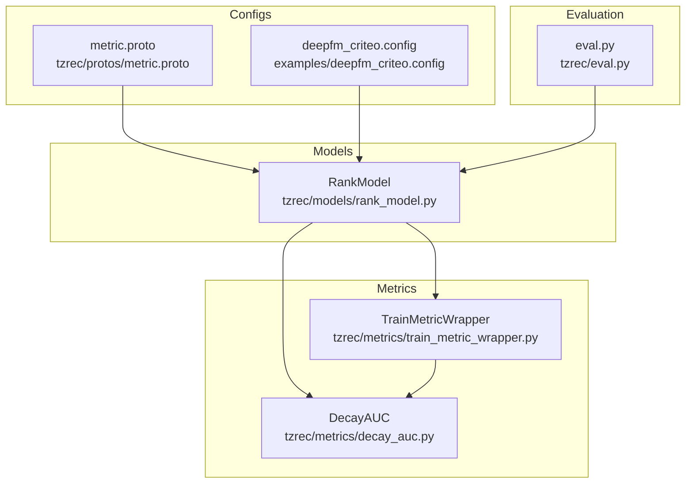
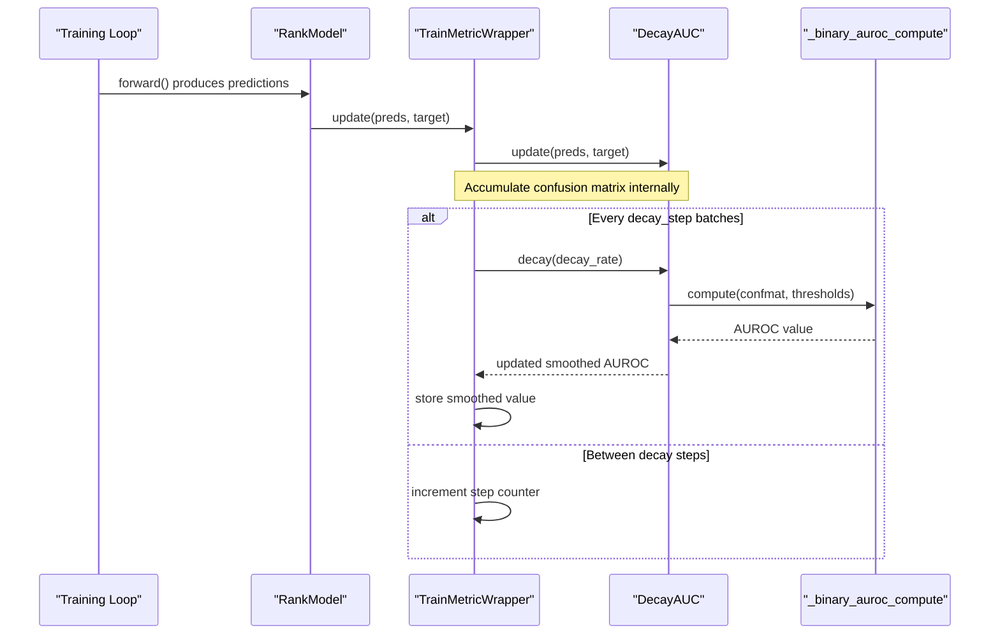
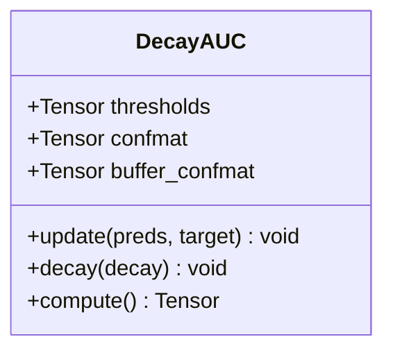
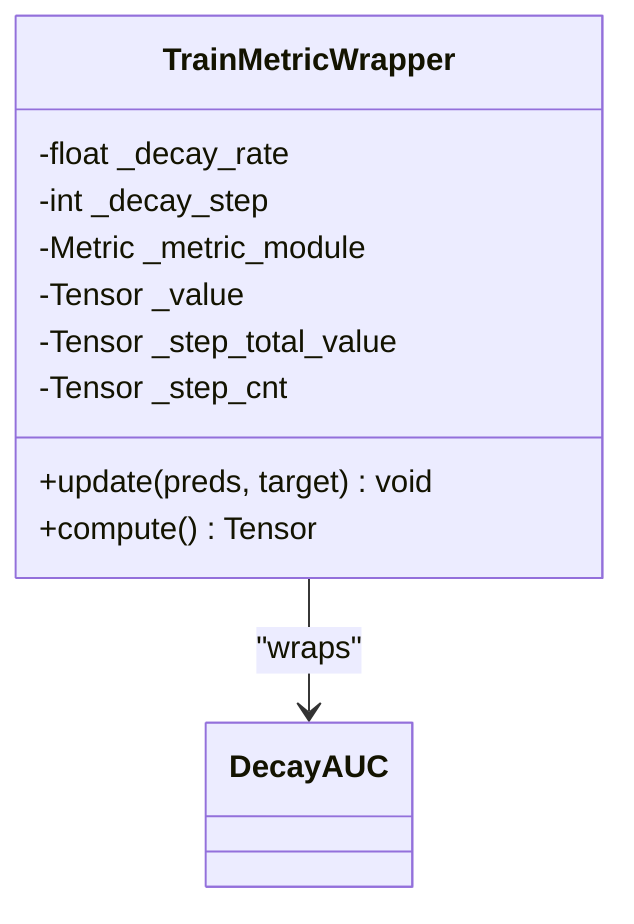
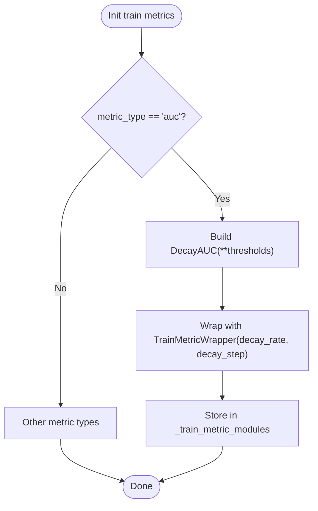
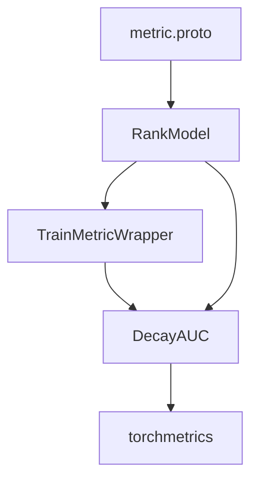

# Decay AUC and Temporal Evaluation Metrics

<cite>
**Referenced Files in This Document**
- [decay_auc.py](file://tzrec/metrics/decay_auc.py)
- [decay_auc_test.py](file://tzrec/metrics/decay_auc_test.py)
- [train_metric_wrapper.py](file://tzrec/metrics/train_metric_wrapper.py)
- [rank_model.py](file://tzrec/models/rank_model.py)
- [metric.proto](file://tzrec/protos/metric.proto)
- [eval.py](file://tzrec/eval.py)
- [deepfm_criteo.config](file://examples/deepfm_criteo.config)
</cite>

## Table of Contents

1. [Introduction](#introduction)
1. [Project Structure](#project-structure)
1. [Core Components](#core-components)
1. [Architecture Overview](#architecture-overview)
1. [Detailed Component Analysis](#detailed-component-analysis)
1. [Dependency Analysis](#dependency-analysis)
1. [Performance Considerations](#performance-considerations)
1. [Troubleshooting Guide](#troubleshooting-guide)
1. [Conclusion](#conclusion)
1. [Appendices](#appendices)

## Introduction

This document explains Decay AUC and temporal evaluation metrics in TorchEasyRec. It focuses on how the framework applies a temporal decay mechanism to AUC during training to emphasize more recent interactions, and how this affects recommendation evaluation. It also documents the implementation of the DecayAUC metric, the TrainMetricWrapper that applies exponential decay at fixed intervals, and the configuration options that control decay behavior. Practical guidance is provided for selecting decay functions and parameters, interpreting results, and applying temporal weighting in scenarios where recency matters (e.g., news, trending content, and time-sensitive promotions).

## Project Structure

The Decay AUC feature spans several modules:

- Metrics: DecayAUC and TrainMetricWrapper implement temporal decay for AUC.
- Model integration: RankModel wires DecayAUC into training metrics via TrainMetricWrapper.
- Protos: MetricConfig and TrainMetricConfig define configuration for AUC and decay parameters.
- Examples: Example configs demonstrate enabling AUC metrics.

**Diagram sources**

- \[decay_auc.py\](file://tzrec/metrics/decay_auc.py#L24-L60)
- \[train_metric_wrapper.py\](file://tzrec/metrics/train_metric_wrapper.py#L20-L62)
- \[rank_model.py\](file://tzrec/models/rank_model.py#L328-L356)
- \[metric.proto\](file://tzrec/protos/metric.proto#L48-L76)
- \[deepfm_criteo.config\](file://examples/deepfm_criteo.config#L390-L396)
- \[eval.py\](file://tzrec/eval.py#L16-L50)

**Section sources**

- \[decay_auc.py\](file://tzrec/metrics/decay_auc.py#L24-L60)
- \[train_metric_wrapper.py\](file://tzrec/metrics/train_metric_wrapper.py#L20-L62)
- \[rank_model.py\](file://tzrec/models/rank_model.py#L328-L356)
- \[metric.proto\](file://tzrec/protos/metric.proto#L48-L76)
- \[deepfm_criteo.config\](file://examples/deepfm_criteo.config#L390-L396)
- \[eval.py\](file://tzrec/eval.py#L16-L50)

## Core Components

- DecayAUC: A binary AUROC metric that accumulates confusion matrices over time and supports an exponential decay operator to blend historical and recent statistics.
- TrainMetricWrapper: A training-time wrapper that periodically decays metrics (including DecayAUC) and maintains a smoothed value for logging and checkpointing.
- RankModel integration: Selects DecayAUC for training when AUC is configured, and wraps it with TrainMetricWrapper using decay_rate and decay_step.
- Protobuf configuration: Defines MetricConfig and TrainMetricConfig, including AUC thresholds and decay_rate/decay_step.

Key behaviors:

- DecayAUC updates internal confusion matrices per batch and exposes a decay() method to apply exponential smoothing.
- TrainMetricWrapper increments a step counter and triggers decay every decay_step batches. For DecayAUC, it calls decay() and re-computes the metric; for other metrics, it resets and applies exponential smoothing to the computed value.
- RankModel initializes DecayAUC for training when AUC is requested.

**Section sources**

- \[decay_auc.py\](file://tzrec/metrics/decay_auc.py#L24-L60)
- \[train_metric_wrapper.py\](file://tzrec/metrics/train_metric_wrapper.py#L20-L62)
- \[rank_model.py\](file://tzrec/models/rank_model.py#L328-L356)
- \[metric.proto\](file://tzrec/protos/metric.proto#L48-L76)

## Architecture Overview

The temporal decay pipeline integrates metric computation, periodic decay, and model training orchestration.

**Diagram sources**

- \[train_metric_wrapper.py\](file://tzrec/metrics/train_metric_wrapper.py#L42-L58)
- \[decay_auc.py\](file://tzrec/metrics/decay_auc.py#L42-L60)
- \[rank_model.py\](file://tzrec/models/rank_model.py#L328-L356)

## Detailed Component Analysis

### DecayAUC Implementation

DecayAUC extends a PyTorch metric and maintains:

- thresholds: linspace from 0 to 1 for AUROC discretization.
- confmat: accumulated confusion matrices per threshold.
- buffer_confmat: temporary accumulation buffer for current window.

Behavior:

- update(): Formats predictions/targets and updates buffer_confmat.
- decay(decay): Applies exponential smoothing: confmat = decay * confmat + (1 - decay) * buffer_confmat, then clears buffer.
- compute(): Computes AUROC from the current confmat.

**Diagram sources**

- \[decay_auc.py\](file://tzrec/metrics/decay_auc.py#L24-L60)

**Section sources**

- \[decay_auc.py\](file://tzrec/metrics/decay_auc.py#L24-L60)
- \[decay_auc_test.py\](file://tzrec/metrics/decay_auc_test.py#L20-L39)

### TrainMetricWrapper: Periodic Exponential Decay

TrainMetricWrapper manages training-time metrics with temporal decay:

- Stores metric_module (e.g., DecayAUC), decay_rate, and decay_step.
- On update(): Calls metric_module.update(), increments step counter.
- On decay steps: For DecayAUC, calls decay() and recomputes; for others, resets metric, computes value, and applies exponential smoothing to the stored value.

**Diagram sources**

- \[train_metric_wrapper.py\](file://tzrec/metrics/train_metric_wrapper.py#L20-L62)

**Section sources**

- \[train_metric_wrapper.py\](file://tzrec/metrics/train_metric_wrapper.py#L20-L62)
- \[train_metric_wrapper_test.py\](file://tzrec/metrics/train_metric_wrapper_test.py#L21-L36)

### RankModel Integration and Configuration

RankModel selects DecayAUC for training when AUC is configured:

- Initializes DecayAUC with thresholds from MetricConfig.
- Wraps it with TrainMetricWrapper using decay_rate and decay_step from TrainMetricConfig.

Protobuf definitions:

- MetricConfig.metric includes AUC with thresholds.
- TrainMetricConfig.metric includes AUC with decay_rate and decay_step.

**Diagram sources**

- \[rank_model.py\](file://tzrec/models/rank_model.py#L328-L356)
- \[metric.proto\](file://tzrec/protos/metric.proto#L48-L76)

**Section sources**

- \[rank_model.py\](file://tzrec/models/rank_model.py#L328-L356)
- \[metric.proto\](file://tzrec/protos/metric.proto#L48-L76)

### Mathematical Formulation and Decay Functions

Concept: In DecayAUC, the AUROC is computed from confusion matrices aggregated over time. The temporal decay operator blends historical and recent statistics.

- Confusion matrix accumulation:

  - buffer_confmat is updated per batch.
  - confmat holds cumulative statistics.

- Exponential decay operator:

  - confmat(t+1) = decay * confmat(t) + (1 - decay) * buffer_confmat(t)
  - After decay, buffer_confmat is reset.

- AUROC computation:

  - AUROC is computed from the current confmat using standard methods.

Notes:

- The current implementation applies exponential smoothing to confusion matrices before computing AUROC.
- The repository does not implement explicit per-sample timestamp weighting or decay functions (e.g., exponential or linear decay of scores) in the metric computation itself. Instead, it smooths the underlying confusion matrix counts.

Practical implications:

- Higher decay_rate emphasizes recent batches; lower decay_rate retains more historical context.
- decay_step controls how frequently smoothing occurs; choose multiples of logging intervals for consistency.

**Section sources**

- \[decay_auc.py\](file://tzrec/metrics/decay_auc.py#L42-L60)
- \[train_metric_wrapper.py\](file://tzrec/metrics/train_metric_wrapper.py#L42-L58)

### Practical Configuration and Usage

Enable AUC with temporal decay in model configs:

- Under model_config.metrics, add auc {}.
- Under model_config.train_metrics, add auc with decay_rate and decay_step.

Example configuration:

- The example config demonstrates enabling auc in metrics.

Evaluation:

- Use the evaluation entry point to run evaluation with the configured metrics.

**Section sources**

- \[metric.proto\](file://tzrec/protos/metric.proto#L48-L76)
- \[deepfm_criteo.config\](file://examples/deepfm_criteo.config#L390-L396)
- \[eval.py\](file://tzrec/eval.py#L16-L50)

### Interpretation of Results

- The reported AUC value reflects smoothed statistics at the last decay boundary.
- To monitor temporal trends, track the smoothed value across decay steps.
- For comparative analysis, compare smoothed AUC against baseline or rolling averages.

**Section sources**

- \[train_metric_wrapper.py\](file://tzrec/metrics/train_metric_wrapper.py#L42-L62)

## Dependency Analysis

The Decay AUC temporal evaluation relies on:

- torchmetrics for AUROC computation internals.
- RankModel for metric initialization and training integration.
- Protobuf configs for metric and decay parameters.

**Diagram sources**

- \[decay_auc.py\](file://tzrec/metrics/decay_auc.py#L17-L21)
- \[train_metric_wrapper.py\](file://tzrec/metrics/train_metric_wrapper.py#L13-L15)
- \[rank_model.py\](file://tzrec/models/rank_model.py#L328-L356)
- \[metric.proto\](file://tzrec/protos/metric.proto#L48-L76)

**Section sources**

- \[decay_auc.py\](file://tzrec/metrics/decay_auc.py#L17-L21)
- \[train_metric_wrapper.py\](file://tzrec/metrics/train_metric_wrapper.py#L13-L15)
- \[rank_model.py\](file://tzrec/models/rank_model.py#L328-L356)
- \[metric.proto\](file://tzrec/protos/metric.proto#L48-L76)

## Performance Considerations

- DecayAUC maintains confusion matrices per threshold; increasing thresholds increases memory and computation overhead.
- Exponential smoothing adds minimal overhead compared to raw AUROC computation.
- For very large datasets, consider reducing thresholds or using in-batch metrics to reduce memory footprint.

[No sources needed since this section provides general guidance]

## Troubleshooting Guide

Common issues and resolutions:

- Unexpected zero or unchanged AUC:
  - Ensure update() is called with valid predictions and targets.
  - Verify decay_step aligns with training loop steps so decay() is invoked regularly.
- Inconsistent smoothing:
  - Confirm decay_rate is set appropriately for the desired temporal emphasis.
  - Check that the metric is wrapped with TrainMetricWrapper and initialized in RankModel.

**Section sources**

- \[decay_auc_test.py\](file://tzrec/metrics/decay_auc_test.py#L20-L39)
- \[train_metric_wrapper_test.py\](file://tzrec/metrics/train_metric_wrapper_test.py#L21-L36)

## Conclusion

TorchEasyRec’s DecayAUC introduces temporal smoothing to training-time AUC by exponentially blending recent and historical confusion matrix statistics. Combined with TrainMetricWrapper, this enables robust, recency-aware monitoring during training. While the current implementation smooths confusion matrices rather than applying per-sample temporal weights, it provides a practical and effective way to emphasize recent performance trends. Proper configuration of thresholds, decay_rate, and decay_step allows practitioners to tailor temporal emphasis to domain needs such as news, trending content, and time-sensitive promotions.

[No sources needed since this section summarizes without analyzing specific files]

## Appendices

### Appendix A: Configuration Reference

- MetricConfig.auc.thresholds: Number of thresholds for AUROC discretization.
- TrainMetricConfig.auc: AUC metric definition for training.
- TrainMetricConfig.decay_rate: Exponential decay factor applied to metric smoothing.
- TrainMetricConfig.decay_step: Number of training steps between decay operations.

**Section sources**

- \[metric.proto\](file://tzrec/protos/metric.proto#L48-L76)
