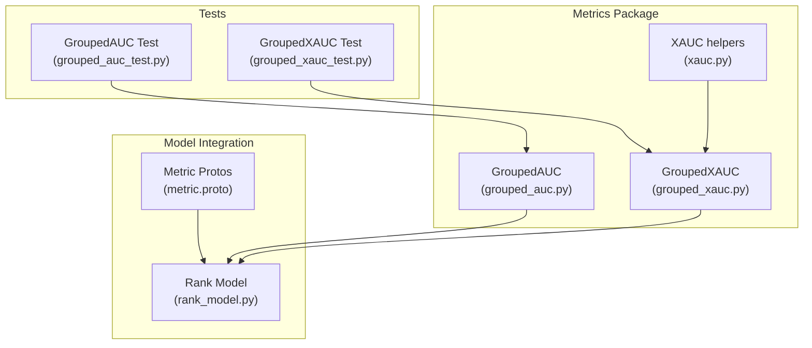
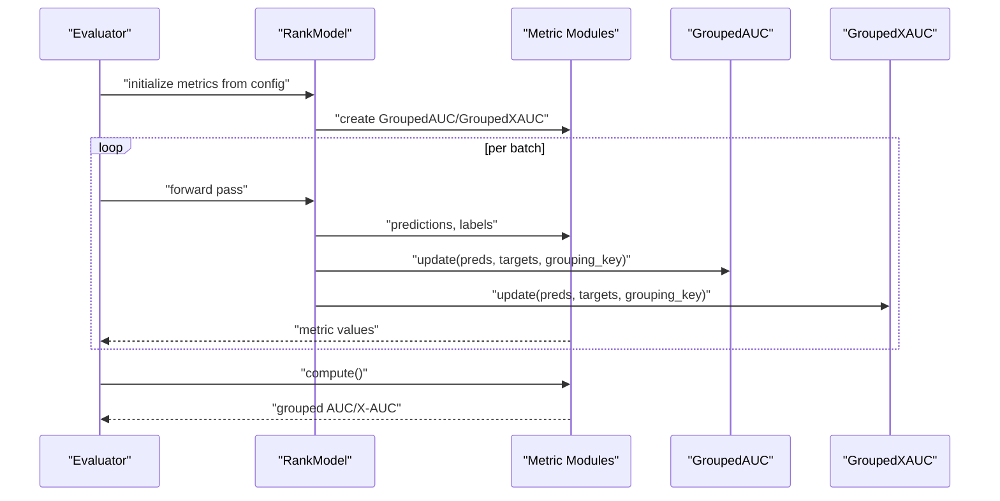
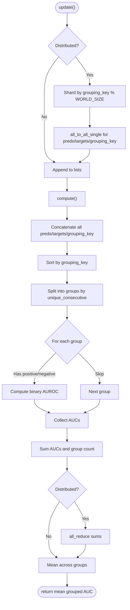
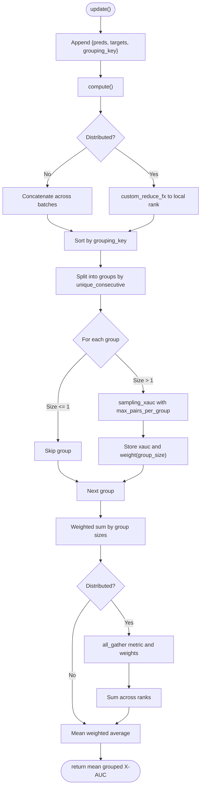
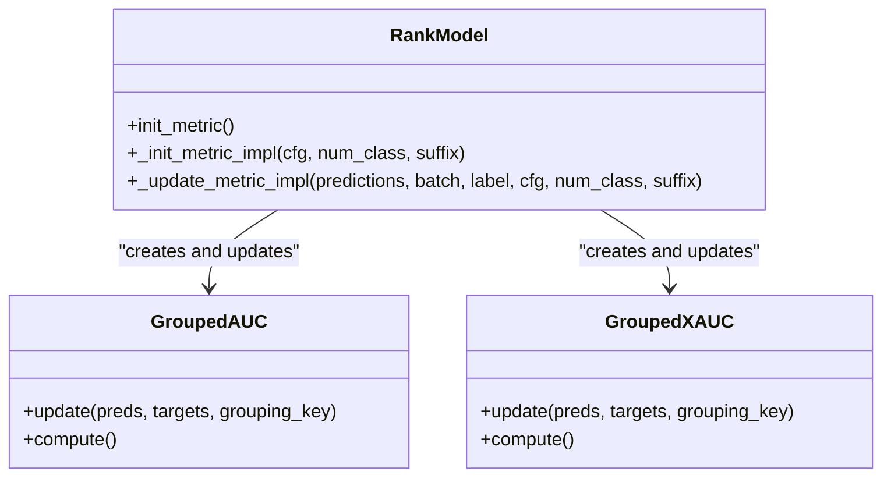
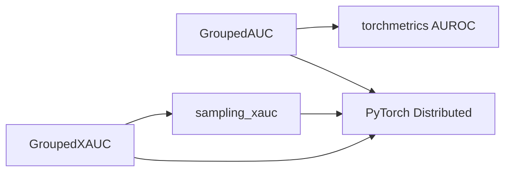

# Grouped AUC and Grouped X-AUC Metrics

<cite>
**Referenced Files in This Document**
- [grouped_auc.py](file://tzrec/metrics/grouped_auc.py)
- [grouped_xauc.py](file://tzrec/metrics/grouped_xauc.py)
- [xauc.py](file://tzrec/metrics/xauc.py)
- [metric.proto](file://tzrec/protos/metric.proto)
- [rank_model.py](file://tzrec/models/rank_model.py)
- [grouped_auc_test.py](file://tzrec/metrics/grouped_auc_test.py)
- [grouped_xauc_test.py](file://tzrec/metrics/grouped_xauc_test.py)
</cite>

## Table of Contents

1. [Introduction](#introduction)
1. [Project Structure](#project-structure)
1. [Core Components](#core-components)
1. [Architecture Overview](#architecture-overview)
1. [Detailed Component Analysis](#detailed-component-analysis)
1. [Dependency Analysis](#dependency-analysis)
1. [Performance Considerations](#performance-considerations)
1. [Troubleshooting Guide](#troubleshooting-guide)
1. [Conclusion](#conclusion)
1. [Appendices](#appendices)

## Introduction

This document explains grouped metrics for recommendation evaluation in TorchEasyRec, focusing on Grouped AUC and Grouped X-AUC implementations. It covers:

- Why grouping metrics by user segments, time periods, or categorical variables matters for fair evaluation
- Mathematical formulations for grouped AUC and grouped X-AUC
- Implementation patterns for computing metrics within groups and aggregating results across all groups
- Practical configuration examples and interpretation guidelines
- Use cases where grouped metrics are essential, such as evaluating across user demographics or temporal contexts

## Project Structure

Grouped metrics live under the metrics package and integrate with the model evaluation pipeline via protocol buffers and model initialization logic.

**Diagram sources**

- \[grouped_auc.py\](file://tzrec/metrics/grouped_auc.py#L22-L126)
- \[grouped_xauc.py\](file://tzrec/metrics/grouped_xauc.py#L65-L169)
- \[xauc.py\](file://tzrec/metrics/xauc.py#L20-L174)
- \[metric.proto\](file://tzrec/protos/metric.proto#L32-L46)
- \[rank_model.py\](file://tzrec/models/rank_model.py#L314-L430)
- \[grouped_auc_test.py\](file://tzrec/metrics/grouped_auc_test.py#L20-L28)
- \[grouped_xauc_test.py\](file://tzrec/metrics/grouped_xauc_test.py#L20-L34)

**Section sources**

- \[grouped_auc.py\](file://tzrec/metrics/grouped_auc.py#L1-L126)
- \[grouped_xauc.py\](file://tzrec/metrics/grouped_xauc.py#L1-L169)
- \[xauc.py\](file://tzrec/metrics/xauc.py#L1-L174)
- \[metric.proto\](file://tzrec/protos/metric.proto#L1-L77)
- \[rank_model.py\](file://tzrec/models/rank_model.py#L286-L432)
- \[grouped_auc_test.py\](file://tzrec/metrics/grouped_auc_test.py#L1-L33)
- \[grouped_xauc_test.py\](file://tzrec/metrics/grouped_xauc_test.py#L1-L39)

## Core Components

- GroupedAUC: Computes group-wise AUC per segment and averages across groups. It handles distributed evaluation by sharding samples by group keys and performing all-to-all exchanges when applicable.
- GroupedXAUC: Computes group-wise X-AUC per segment with controlled pair sampling per group and aggregates using weighted averaging by group sizes. It supports distributed evaluation via custom reduction.

Key configuration:

- GroupedAUC requires a grouping_key field in the metric configuration.
- GroupedXAUC requires grouping_key and optionally max_pairs_per_group.

**Section sources**

- \[grouped_auc.py\](file://tzrec/metrics/grouped_auc.py#L22-L126)
- \[grouped_xauc.py\](file://tzrec/metrics/grouped_xauc.py#L65-L169)
- \[metric.proto\](file://tzrec/protos/metric.proto#L32-L46)

## Architecture Overview

The evaluation pipeline integrates grouped metrics during model training/evaluation. The model reads metric configurations, constructs the appropriate metric instances, and updates them with predictions, labels, and grouping keys.

**Diagram sources**

- \[rank_model.py\](file://tzrec/models/rank_model.py#L314-L430)
- \[grouped_auc.py\](file://tzrec/metrics/grouped_auc.py#L34-L126)
- \[grouped_xauc.py\](file://tzrec/metrics/grouped_xauc.py#L78-L169)

## Detailed Component Analysis

### GroupedAUC

GroupedAUC computes AUC within each group and averages across groups. It:

- Accepts predictions, targets, and grouping_key tensors
- Sorts samples by grouping_key and splits into groups
- Computes AUC per group using torchmetrics’ binary AUROC computation
- Aggregates across groups and supports distributed all-reduce

**Diagram sources**

- \[grouped_auc.py\](file://tzrec/metrics/grouped_auc.py#L34-L126)

**Section sources**

- \[grouped_auc.py\](file://tzrec/metrics/grouped_auc.py#L22-L126)
- \[grouped_auc_test.py\](file://tzrec/metrics/grouped_auc_test.py#L20-L28)

### GroupedXAUC

GroupedXAUC computes X-AUC per group with controlled pair sampling and weights by group size. It:

- Accepts predictions, targets, and grouping_key tensors
- Sorts samples by grouping_key and splits into groups
- Samples pairs per group up to max_pairs_per_group and computes X-AUC
- Aggregates using weighted average across groups
- Supports distributed evaluation via custom reduction and all_gather

**Diagram sources**

- \[grouped_xauc.py\](file://tzrec/metrics/grouped_xauc.py#L78-L169)
- \[xauc.py\](file://tzrec/metrics/xauc.py#L20-L52)

**Section sources**

- \[grouped_xauc.py\](file://tzrec/metrics/grouped_xauc.py#L65-L169)
- \[xauc.py\](file://tzrec/metrics/xauc.py#L20-L52)
- \[grouped_xauc_test.py\](file://tzrec/metrics/grouped_xauc_test.py#L20-L34)

### Integration with Rank Model

The rank model initializes grouped metrics from configuration and updates them during evaluation.

**Diagram sources**

- \[rank_model.py\](file://tzrec/models/rank_model.py#L314-L430)
- \[grouped_auc.py\](file://tzrec/metrics/grouped_auc.py#L34-L126)
- \[grouped_xauc.py\](file://tzrec/metrics/grouped_xauc.py#L78-L169)

**Section sources**

- \[rank_model.py\](file://tzrec/models/rank_model.py#L314-L430)

## Dependency Analysis

- GroupedAUC depends on torchmetrics’ binary AUROC computation and PyTorch distributed primitives for multi-rank aggregation.
- GroupedXAUC depends on the sampling_xauc helper and PyTorch distributed all_gather for multi-rank aggregation.
- Both metrics rely on grouping_key tensors derived from the model’s feature groups.

**Diagram sources**

- \[grouped_auc.py\](file://tzrec/metrics/grouped_auc.py#L18-L19)
- \[grouped_xauc.py\](file://tzrec/metrics/grouped_xauc.py#L19-L20)
- \[xauc.py\](file://tzrec/metrics/xauc.py#L20-L52)

**Section sources**

- \[grouped_auc.py\](file://tzrec/metrics/grouped_auc.py#L1-L126)
- \[grouped_xauc.py\](file://tzrec/metrics/grouped_xauc.py#L1-L169)
- \[xauc.py\](file://tzrec/metrics/xauc.py#L1-L174)

## Performance Considerations

- GroupedAUC: Sorting and splitting by grouping_key is linear in the number of samples. AUC computation per group is efficient via torchmetrics’ optimized implementation.
- GroupedXAUC: Pair sampling per group scales with max_pairs_per_group. Larger values increase memory and compute; consider reducing max_pairs_per_group for large datasets.
- Distributed evaluation: GroupedAUC uses all_to_all_single for sharding by group keys; GroupedXAUC uses custom_reduce_fx and all_gather. Ensure WORLD_SIZE and RANK are set appropriately.

[No sources needed since this section provides general guidance]

## Troubleshooting Guide

- GroupedAUC returns NaN or zero when a group has no positive or negative samples; the implementation skips such groups.
- GroupedXAUC skips groups with fewer than two samples; ensure sufficient samples per group.
- Distributed metrics require WORLD_SIZE and RANK environment variables; otherwise, metrics compute locally.
- If results vary across runs, consider deterministic seeding and consistent data ordering.

**Section sources**

- \[grouped_auc.py\](file://tzrec/metrics/grouped_auc.py#L114-L118)
- \[grouped_xauc.py\](file://tzrec/metrics/grouped_xauc.py#L124-L130)

## Conclusion

Grouped AUC and Grouped X-AUC enable fair, stratified evaluation across user segments, time periods, or categorical variables. They provide robust aggregation strategies—simple averaging for AUC and weighted averaging for X-AUC—to ensure balanced representation across groups. Proper configuration and distributed setup are essential for reliable results.

[No sources needed since this section summarizes without analyzing specific files]

## Appendices

### Mathematical Formulations

- Grouped AUC

  - For each group g, compute AUC using predictions and targets within that group.
  - Average across groups: mean_gauc = (Σ AUC_g) / number_of_groups_with_valid_labels.
  - Skips groups with invalid label distributions.

- Grouped X-AUC

  - For each group g, sample up to max_pairs_per_group pairs and compute X-AUC.
  - Weighted average across groups: mean_gxauc = (Σ (weight_g × xauc_g)) / Σ weight_g, where weight_g = |group_g|.

- X-AUC Sampling

  - Total pairs in a group of size n: n\*(n-1)/2.
  - Randomly sample n_sample_pairs indices and map to pairs (i, j) with i < j.
  - X-AUC correctness condition: (target_i - target_j) and (pred_i - pred_j) must have the same sign.

**Section sources**

- \[grouped_auc.py\](file://tzrec/metrics/grouped_auc.py#L96-L126)
- \[grouped_xauc.py\](file://tzrec/metrics/grouped_xauc.py#L92-L169)
- \[xauc.py\](file://tzrec/metrics/xauc.py#L20-L52)

### Configuration and Usage Examples

- Protocol buffer definitions

  - GroupedAUC: requires grouping_key (string).
  - GroupedXAUC: requires grouping_key (string) and optionally max_pairs_per_group (uint64).

- Model integration

  - The rank model constructs GroupedAUC or GroupedXAUC based on metric configuration and updates them with predictions, labels, and grouping_key extracted from feature groups.

- Practical segmentation strategies

  - User segments: age, gender, geography, cohort
  - Temporal contexts: day-of-week, hour-of-day, season
  - Content categories: item category, popularity bins
  - Interaction contexts: device type, session duration bins

- Interpretation tips

  - Compare group-wise metrics to detect disparities across segments.
  - Use weighted Grouped X-AUC to reflect group sizes and avoid dominance by large groups.
  - Monitor stability across runs and adjust max_pairs_per_group for reproducibility.

**Section sources**

- \[metric.proto\](file://tzrec/protos/metric.proto#L32-L46)
- \[rank_model.py\](file://tzrec/models/rank_model.py#L314-L430)
- \[grouped_auc_test.py\](file://tzrec/metrics/grouped_auc_test.py#L20-L28)
- \[grouped_xauc_test.py\](file://tzrec/metrics/grouped_xauc_test.py#L20-L34)
