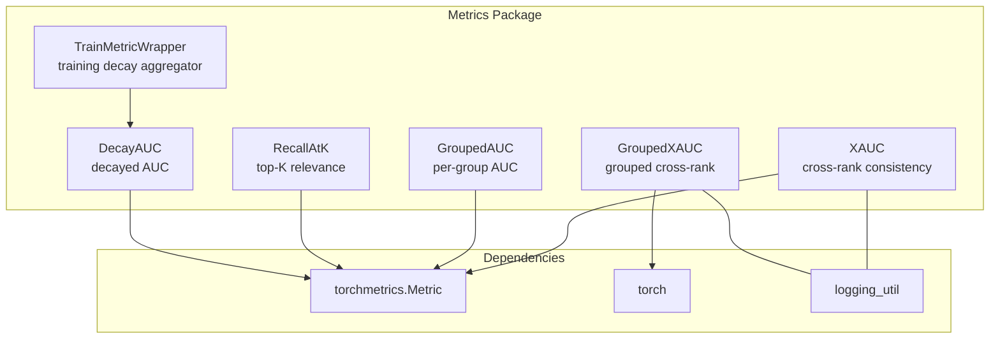
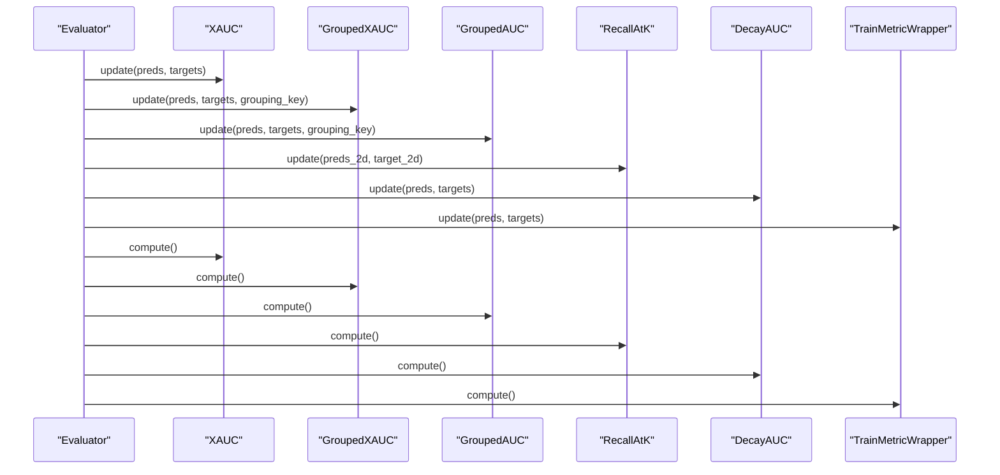
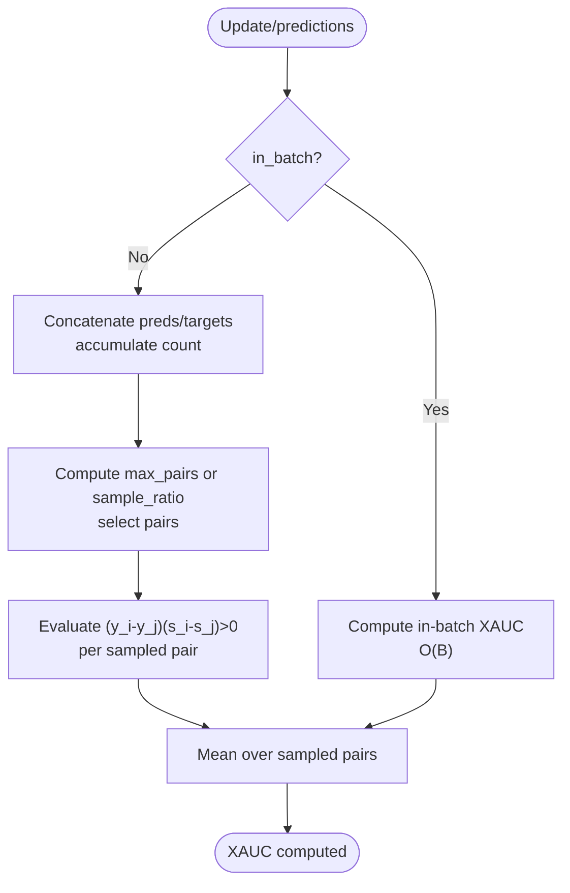
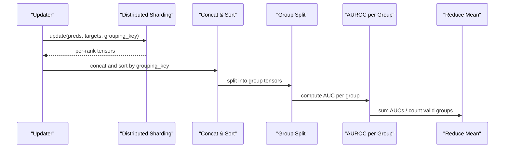
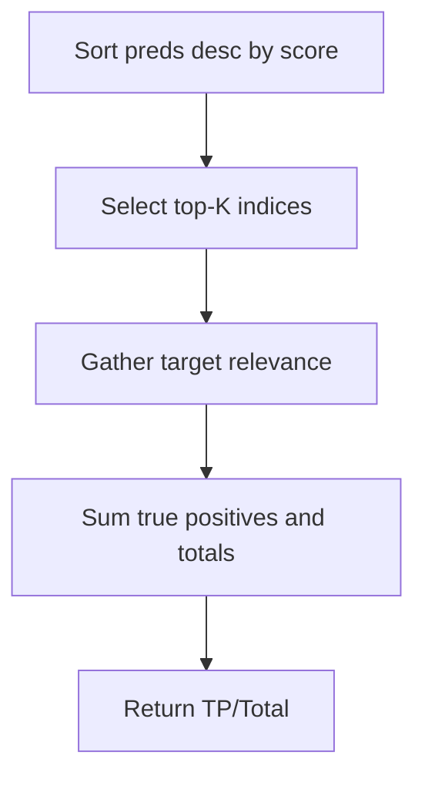
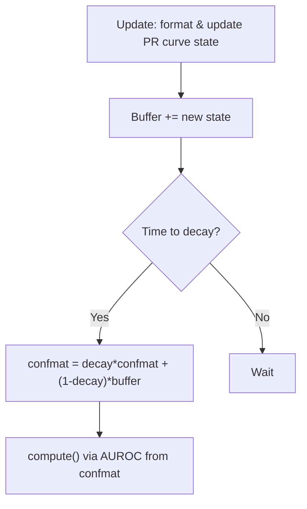
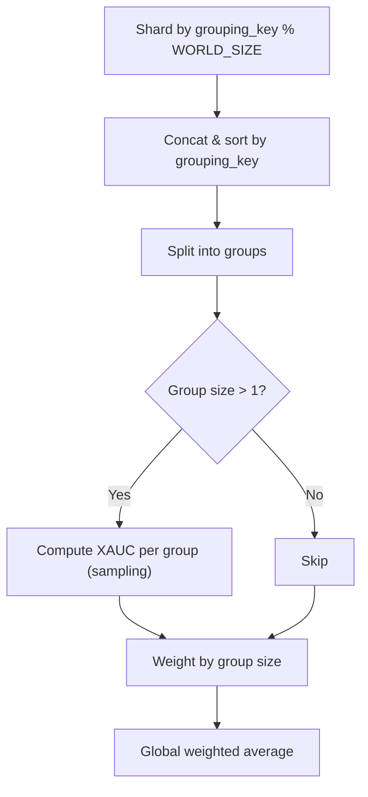
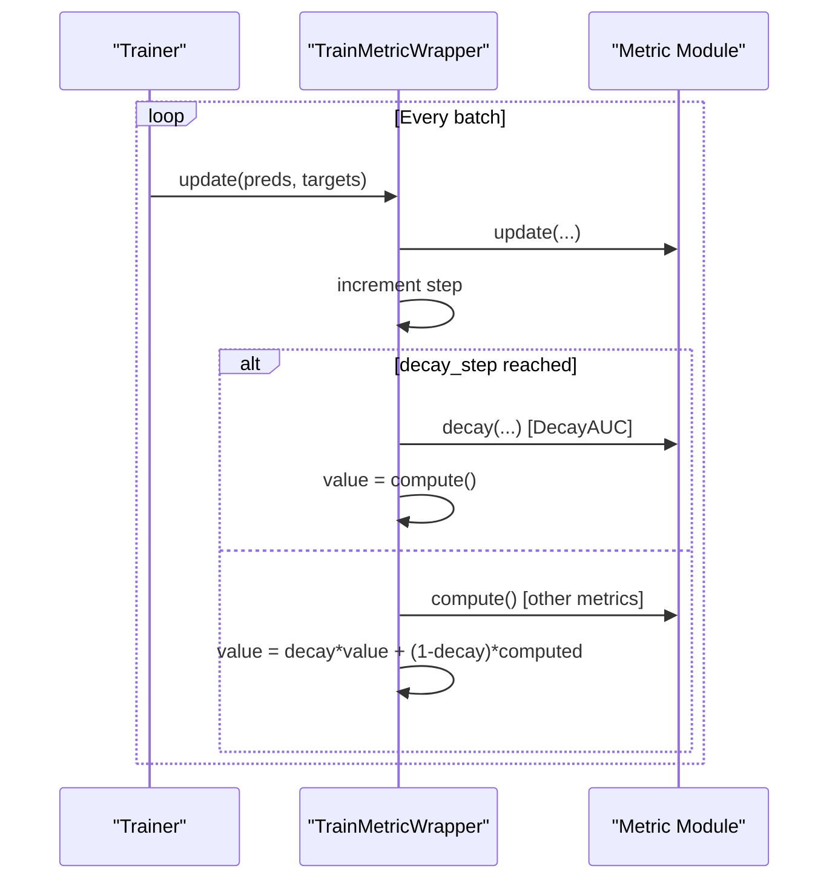
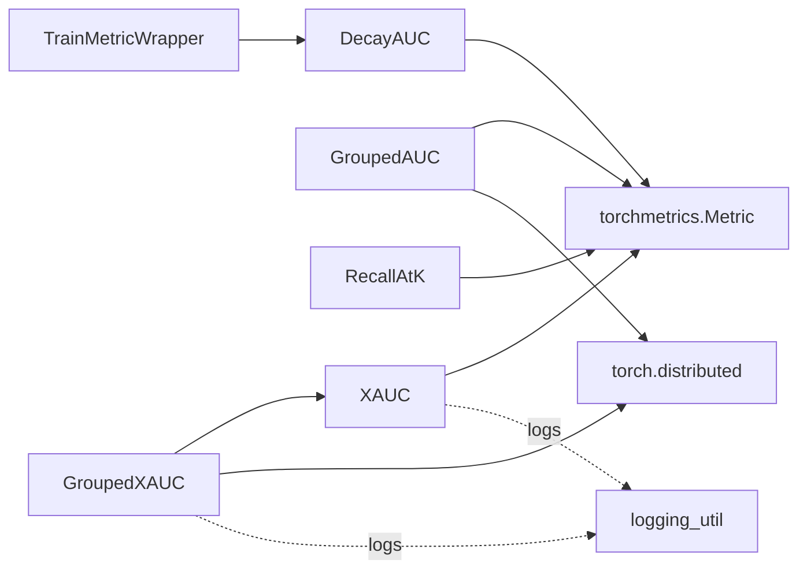

# Metric Implementations and Calculations

<cite>
**Referenced Files in This Document**
- [metrics/__init__.py](file://tzrec/metrics/__init__.py)
- [metrics/xauc.py](file://tzrec/metrics/xauc.py)
- [metrics/grouped_auc.py](file://tzrec/metrics/grouped_auc.py)
- [metrics/recall_at_k.py](file://tzrec/metrics/recall_at_k.py)
- [metrics/decay_auc.py](file://tzrec/metrics/decay_auc.py)
- [metrics/grouped_xauc.py](file://tzrec/metrics/grouped_xauc.py)
- [metrics/train_metric_wrapper.py](file://tzrec/metrics/train_metric_wrapper.py)
- [metrics/xauc_test.py](file://tzrec/metrics/xauc_test.py)
- [metrics/grouped_auc_test.py](file://tzrec/metrics/grouped_auc_test.py)
- [metrics/recall_at_k_test.py](file://tzrec/metrics/recall_at_k_test.py)
- [metrics/decay_auc_test.py](file://tzrec/metrics/decay_auc_test.py)
</cite>

## Table of Contents

1. [Introduction](#introduction)
1. [Project Structure](#project-structure)
1. [Core Components](#core-components)
1. [Architecture Overview](#architecture-overview)
1. [Detailed Component Analysis](#detailed-component-analysis)
1. [Dependency Analysis](#dependency-analysis)
1. [Performance Considerations](#performance-considerations)
1. [Troubleshooting Guide](#troubleshooting-guide)
1. [Conclusion](#conclusion)
1. [Appendices](#appendices)

## Introduction

This document explains TorchEasyRec’s metric implementations for recommendation systems, focusing on X-AUC (Cross-Area Under Curve), grouped AUC, recall@K, decay AUC, and grouped X-AUC. It covers mathematical formulations, implementation details, batch processing strategies, distributed computation, and integration with evaluation/training pipelines. Practical configuration guidance, interpretation tips, and troubleshooting advice are included to help select and deploy appropriate metrics for different recommendation scenarios.

## Project Structure

The metrics package is organized around modular, torchmetrics-compatible classes that encapsulate stateful computation and distribution-aware aggregation. Key files:

- X-AUC and grouped X-AUC: cross-group ranking consistency metrics for short videos and grouped data
- Grouped AUC: per-group AUC with global averaging
- Recall@K: ranking relevance at top-K items
- Decay AUC: AUC with exponential decay for training monitoring
- Train metric wrapper: decaying aggregation during training

**Diagram sources**

- \[metrics/xauc.py\](file://tzrec/metrics/xauc.py#L74-L174)
- \[metrics/grouped_xauc.py\](file://tzrec/metrics/grouped_xauc.py#L65-L169)
- \[metrics/grouped_auc.py\](file://tzrec/metrics/grouped_auc.py#L22-L126)
- \[metrics/recall_at_k.py\](file://tzrec/metrics/recall_at_k.py#L19-L55)
- \[metrics/decay_auc.py\](file://tzrec/metrics/decay_auc.py#L24-L61)
- \[metrics/train_metric_wrapper.py\](file://tzrec/metrics/train_metric_wrapper.py#L20-L63)

**Section sources**

- \[metrics/__init__.py\](file://tzrec/metrics/__init__.py#L1-L11)

## Core Components

- XAUC: Measures pairwise ranking consistency across samples with optional downsampling or in-batch sampling to manage O(n^2) complexity.
- GroupedXAUC: Computes X-AUC within groups and averages by group weight; supports distributed reduction via custom reduce function.
- GroupedAUC: Computes AUC per group and returns the mean across valid groups; handles distributed all-to-all sharding.
- Recall@K: Computes recall among top-K predictions per sample.
- DecayAUC: Maintains confusion matrices with threshold bins and supports exponential decay updates for training monitoring.
- TrainMetricWrapper: Wraps a metric to compute a decaying moving average during training, with periodic decay and reset behavior.

**Section sources**

- \[metrics/xauc.py\](file://tzrec/metrics/xauc.py#L74-L174)
- \[metrics/grouped_xauc.py\](file://tzrec/metrics/grouped_xauc.py#L65-L169)
- \[metrics/grouped_auc.py\](file://tzrec/metrics/grouped_auc.py#L22-L126)
- \[metrics/recall_at_k.py\](file://tzrec/metrics/recall_at_k.py#L19-L55)
- \[metrics/decay_auc.py\](file://tzrec/metrics/decay_auc.py#L24-L61)
- \[metrics/train_metric_wrapper.py\](file://tzrec/metrics/train_metric_wrapper.py#L20-L63)

## Architecture Overview

The metrics integrate with torchmetrics’ Metric base class and leverage PyTorch’s distributed communication primitives for multi-GPU/multi-node evaluation. Training metrics are optionally decayed to track recent performance trends.

**Diagram sources**

- \[metrics/xauc.py\](file://tzrec/metrics/xauc.py#L128-L174)
- \[metrics/grouped_xauc.py\](file://tzrec/metrics/grouped_xauc.py#L78-L169)
- \[metrics/grouped_auc.py\](file://tzrec/metrics/grouped_auc.py#L34-L126)
- \[metrics/recall_at_k.py\](file://tzrec/metrics/recall_at_k.py#L37-L55)
- \[metrics/decay_auc.py\](file://tzrec/metrics/decay_auc.py#L42-L61)
- \[metrics/train_metric_wrapper.py\](file://tzrec/metrics/train_metric_wrapper.py#L42-L63)

## Detailed Component Analysis

### X-AUC (Cross-Area AUC)

- Purpose: Measures whether positive samples tend to receive higher scores than negative samples across the entire evaluation set. Uses pairwise comparisons with controlled sampling to avoid O(n^2) memory/time for large sets.
- Mathematical formulation:
  - Pairwise correctness indicator: I[(y_i − y_j)(s_i − s_j) > 0], where y ∈ {0,1} is the label and s is the score.
  - XAUC = mean of pairwise indicators across sampled pairs.
- Implementation highlights:
  - Downsampled sampling via random pair indices; supports either global sampling across the full eval set or in-batch sampling.
  - States: stores concatenated predictions/targets (global mode) or per-batch XAUCs (in-batch mode).
  - Distributed: in-batch mode aggregates batch-wise XAUCs; global mode concatenates tensors across ranks.
- Parameters:
  - sample_ratio: fraction of total possible pairs to sample.
  - max_pairs: absolute cap on sampled pairs overriding sample_ratio.
  - in_batch: enable per-batch sampling and averaging.
- Complexity:
  - Sampling-based XAUC: O(S) where S is sampled pairs; in-batch O(B) per batch.
  - Global mode: O(N) to concatenate and compute, with memory proportional to N.

**Diagram sources**

- \[metrics/xauc.py\](file://tzrec/metrics/xauc.py#L20-L72)
- \[metrics/xauc.py\](file://tzrec/metrics/xauc.py#L128-L174)

**Section sources**

- \[metrics/xauc.py\](file://tzrec/metrics/xauc.py#L74-L174)
- \[metrics/xauc_test.py\](file://tzrec/metrics/xauc_test.py#L20-L46)

### Grouped AUC

- Purpose: Compute AUC within each group and return the mean across groups with valid labels.
- Implementation highlights:
  - Sorts by grouping_key, splits into group tensors, computes AUC per group using torchmetrics’ AUROC compute function, and averages valid group AUCs.
  - Distributed: performs all-to-all communication to shard data by destination rank, then concatenates and computes.
- Parameters: none (exposed via torchmetrics interface).
- Complexity: O(N log N) sorting plus per-group AUC computation; memory scales with N.

**Diagram sources**

- \[metrics/grouped_auc.py\](file://tzrec/metrics/grouped_auc.py#L34-L126)

**Section sources**

- \[metrics/grouped_auc.py\](file://tzrec/metrics/grouped_auc.py#L22-L126)
- \[metrics/grouped_auc_test.py\](file://tzrec/metrics/grouped_auc_test.py#L20-L33)

### Recall@K

- Purpose: Measures the fraction of relevant items among the top K predictions per sample.
- Implementation highlights:
  - Sorts predictions along the last dimension and gathers targets for top-K indices; accumulates true positives and totals.
  - Expects 2D inputs: preds of shape [B, V] and target of shape [B, V] with boolean relevance.
- Parameters:
  - top_k: number of top predictions to consider.
- Complexity: O(B V log V) for sorting plus O(B K) for gathering and accumulation.

**Diagram sources**

- \[metrics/recall_at_k.py\](file://tzrec/metrics/recall_at_k.py#L37-L55)

**Section sources**

- \[metrics/recall_at_k.py\](file://tzrec/metrics/recall_at_k.py#L19-L55)
- \[metrics/recall_at_k_test.py\](file://tzrec/metrics/recall_at_k_test.py#L20-L34)

### Decay AUC

- Purpose: Track AUC with exponential decay for training monitoring, emphasizing recent batches.
- Implementation highlights:
  - Maintains thresholded confusion matrices and a buffer; periodically decays confmat using buffer contributions.
  - Uses torchmetrics’ AUROC compute from precision-recall curve states.
- Parameters:
  - thresholds: number of probability bins for discretized PR curves.
- Complexity: O(T) per update where T is number of thresholds; decay operation is O(T).

**Diagram sources**

- \[metrics/decay_auc.py\](file://tzrec/metrics/decay_auc.py#L42-L61)

**Section sources**

- \[metrics/decay_auc.py\](file://tzrec/metrics/decay_auc.py#L24-L61)
- \[metrics/decay_auc_test.py\](file://tzrec/metrics/decay_auc_test.py#L20-L44)

### Grouped X-AUC

- Purpose: Extends X-AUC to grouped data by computing XAUC within each group and weighting by group size.
- Implementation highlights:
  - Custom distributed reduce function shards per-rank tensors by grouping_key modulo WORLD_SIZE; concatenates across ranks.
  - Sorts by grouping_key, splits into groups, computes per-group XAUC using shared sampling routine, weights by group size, and averages globally.
- Parameters:
  - max_pairs_per_group: caps per-group sampling to balance accuracy and memory.
- Complexity: O(G P) where G is number of groups and P is sampled pairs per group; dominates by per-group pairwise checks.

**Diagram sources**

- \[metrics/grouped_xauc.py\](file://tzrec/metrics/grouped_xauc.py#L78-L169)

**Section sources**

- \[metrics/grouped_xauc.py\](file://tzrec/metrics/grouped_xauc.py#L65-L169)

### Train Metric Wrapper

- Purpose: Provides a decaying moving average of a metric during training, with periodic resets or decay steps.
- Implementation highlights:
  - On update: forwards to underlying metric; increments step counter; on decay step applies decay (special-case for DecayAUC) or generic exponential smoothing.
  - Stores a cached value for reporting.
- Parameters:
  - decay_rate: smoothing factor for exponential decay.
  - decay_step: frequency of decay/reset.

**Diagram sources**

- \[metrics/train_metric_wrapper.py\](file://tzrec/metrics/train_metric_wrapper.py#L42-L63)

**Section sources**

- \[metrics/train_metric_wrapper.py\](file://tzrec/metrics/train_metric_wrapper.py#L20-L63)

## Dependency Analysis

- Internal dependencies:
  - GroupedXAUC depends on shared XAUC sampling utilities.
  - All metrics inherit from torchmetrics.Metric and use torch for tensor operations.
  - GroupedAUC and GroupedXAUC use torch.distributed for multi-GPU/all-to-all sharding.
- External dependencies:
  - torchmetrics functional modules for AUROC and precision-recall curve computations.
  - Logging utility for info-level messages during compute.

**Diagram sources**

- \[metrics/xauc.py\](file://tzrec/metrics/xauc.py#L74-L174)
- \[metrics/grouped_xauc.py\](file://tzrec/metrics/grouped_xauc.py#L65-L169)
- \[metrics/grouped_auc.py\](file://tzrec/metrics/grouped_auc.py#L22-L126)
- \[metrics/decay_auc.py\](file://tzrec/metrics/decay_auc.py#L24-L61)
- \[metrics/train_metric_wrapper.py\](file://tzrec/metrics/train_metric_wrapper.py#L20-L63)

**Section sources**

- \[metrics/xauc.py\](file://tzrec/metrics/xauc.py#L1-L174)
- \[metrics/grouped_xauc.py\](file://tzrec/metrics/grouped_xauc.py#L1-L169)
- \[metrics/grouped_auc.py\](file://tzrec/metrics/grouped_auc.py#L1-L126)
- \[metrics/recall_at_k.py\](file://tzrec/metrics/recall_at_k.py#L1-L55)
- \[metrics/decay_auc.py\](file://tzrec/metrics/decay_auc.py#L1-L61)
- \[metrics/train_metric_wrapper.py\](file://tzrec/metrics/train_metric_wrapper.py#L1-L63)

## Performance Considerations

- X-AUC
  - Prefer in-batch mode for large datasets to reduce memory footprint; ensure evaluation data is shuffled to mitigate bias.
  - Tune sample_ratio or max_pairs to balance accuracy and speed; very large sample_ratio risks memory exhaustion.
- Grouped AUC/X-AUC
  - Sorting dominates complexity; keep grouping_key compact and leverage distributed sharding to reduce per-rank workload.
  - For GroupedXAUC, limit max_pairs_per_group to cap per-group sampling cost.
- Recall@K
  - Sorting complexity O(V log V); consider smaller V or pre-filtering candidates to reduce overhead.
- Decay AUC
  - Thresholds impact buffer size; choose a moderate number to balance resolution and memory.
  - Decay operations are lightweight; adjust decay_step to trade responsiveness vs. stability.
- Distributed training
  - Use all_to_all sharding in grouped metrics to minimize cross-rank data transfer.
  - Ensure WORLD_SIZE and RANK environment variables are set for accurate partitioning.

[No sources needed since this section provides general guidance]

## Troubleshooting Guide

- X-AUC
  - Symptom: Out-of-memory errors on large eval sets.
    - Action: Enable in_batch mode or reduce sample_ratio/max_pairs.
  - Symptom: Slow computation.
    - Action: Increase sample_ratio cautiously; consider in_batch mode.
- Grouped AUC/X-AUC
  - Symptom: Uneven group sizes causing imbalanced contribution.
    - Action: Weight by group size (already done); verify grouping_key distribution.
  - Symptom: Incorrect metric after distributed runs.
    - Action: Confirm WORLD_SIZE and RANK are set; ensure custom reduce function receives per-rank tensors.
- Recall@K
  - Symptom: Unexpected zero recall.
    - Action: Verify target shapes and boolean relevance; ensure top_k does not exceed vocabulary size.
- Decay AUC
  - Symptom: Metric remains zero or unstable.
    - Action: Confirm updates occur before decay; adjust decay_rate and decay_step.
- TrainMetricWrapper
  - Symptom: Value not updating.
    - Action: Check decay_step alignment with training steps; ensure compute() is called to fetch the cached value.

**Section sources**

- \[metrics/xauc.py\](file://tzrec/metrics/xauc.py#L74-L174)
- \[metrics/grouped_auc.py\](file://tzrec/metrics/grouped_auc.py#L22-L126)
- \[metrics/grouped_xauc.py\](file://tzrec/metrics/grouped_xauc.py#L65-L169)
- \[metrics/recall_at_k.py\](file://tzrec/metrics/recall_at_k.py#L19-L55)
- \[metrics/decay_auc.py\](file://tzrec/metrics/decay_auc.py#L24-L61)
- \[metrics/train_metric_wrapper.py\](file://tzrec/metrics/train_metric_wrapper.py#L20-L63)

## Conclusion

TorchEasyRec’s metrics suite provides robust, scalable implementations for recommendation evaluation:

- X-AUC and GroupedXAUC capture cross-sample and cross-group ranking quality with controllable computational costs.
- GroupedAUC ensures fair per-group assessment.
- Recall@K focuses on practical ranking relevance at top-K.
- DecayAUC and TrainMetricWrapper support training-time monitoring with decaying emphasis on recent performance.
  Adopt these metrics based on scenario needs: use X-AUC for overall ranking consistency, GroupedXAUC for heterogeneous groups, GroupedAUC for fairness across segments, Recall@K for retrieval effectiveness, and DecayAUC/TrainMetricWrapper for trend tracking during training.

[No sources needed since this section summarizes without analyzing specific files]

## Appendices

### Practical Configuration Examples

- Configure X-AUC
  - Global mode: set sample_ratio or max_pairs to control sampling; suitable for small to medium eval sets.
  - In-batch mode: set in_batch=True for large datasets; ensure data is shuffled.
  - Reference: \[metrics/xauc.py\](file://tzrec/metrics/xauc.py#L103-L126)
- Configure GroupedAUC
  - Provide grouping_key alongside preds and targets; metric internally shards and reduces across ranks.
  - Reference: \[metrics/grouped_auc.py\](file://tzrec/metrics/grouped_auc.py#L34-L95)
- Configure Recall@K
  - Set top_k according to downstream application; ensure 2D preds and boolean target tensors.
  - Reference: \[metrics/recall_at_k.py\](file://tzrec/metrics/recall_at_k.py#L26-L35)
- Configure DecayAUC
  - Adjust thresholds for resolution/memory; set decay_rate and decay_step for responsiveness.
  - Reference: \[metrics/decay_auc.py\](file://tzrec/metrics/decay_auc.py#L27-L41)
- Configure GroupedXAUC
  - Set max_pairs_per_group to bound per-group sampling; metric automatically weights by group size.
  - Reference: \[metrics/grouped_xauc.py\](file://tzrec/metrics/grouped_xauc.py#L68-L76)
- Configure TrainMetricWrapper
  - Wrap a metric and tune decay_rate and decay_step for desired smoothing behavior.
  - Reference: \[metrics/train_metric_wrapper.py\](file://tzrec/metrics/train_metric_wrapper.py#L29-L41)

### Interpretation Guidelines

- X-AUC: Closer to 1 indicates stronger cross-sample ranking; use grouped variant for heterogeneous audiences.
- GroupedAUC: Averages per-group AUC; useful for detecting group-specific performance drops.
- Recall@K: Higher values indicate better retrieval quality at top-K; sensitive to candidate set size and scoring quality.
- DecayAUC: Reflects recent model performance; helpful for early trend detection during training.
- GroupedXAUC: Weighted average of per-group XAUC; robust to group imbalance.

[No sources needed since this section provides general guidance]
