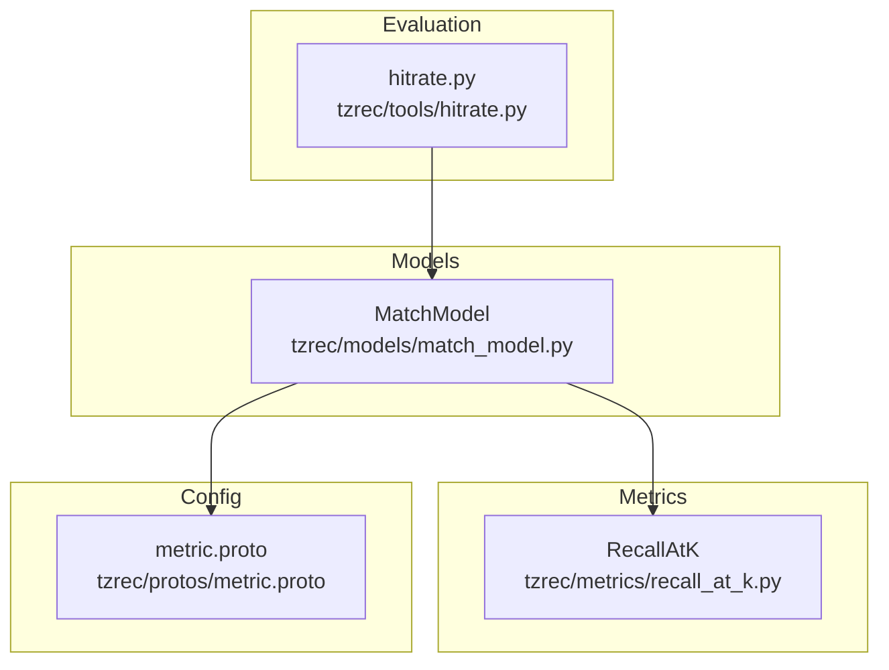
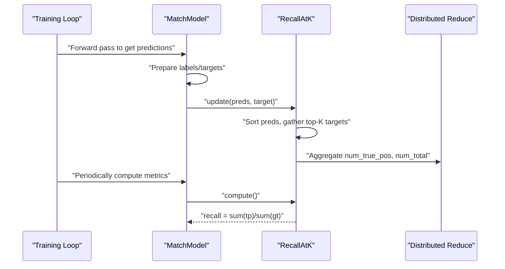
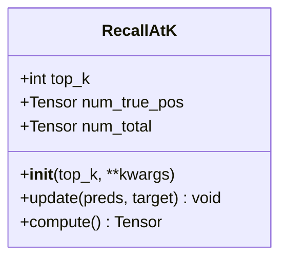
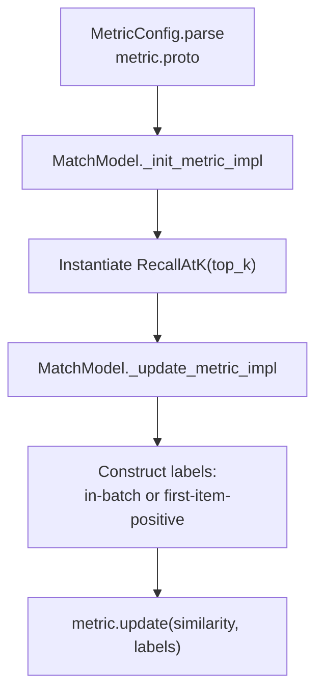
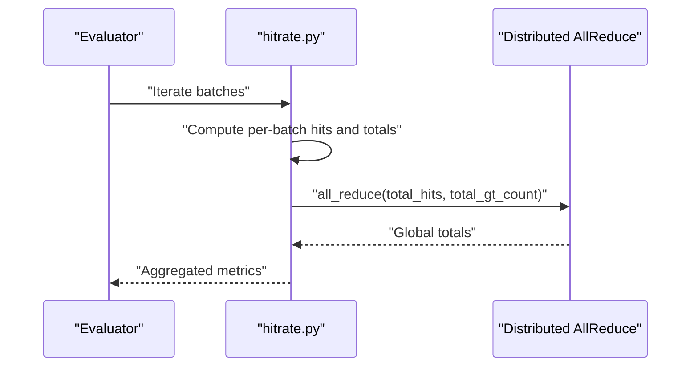
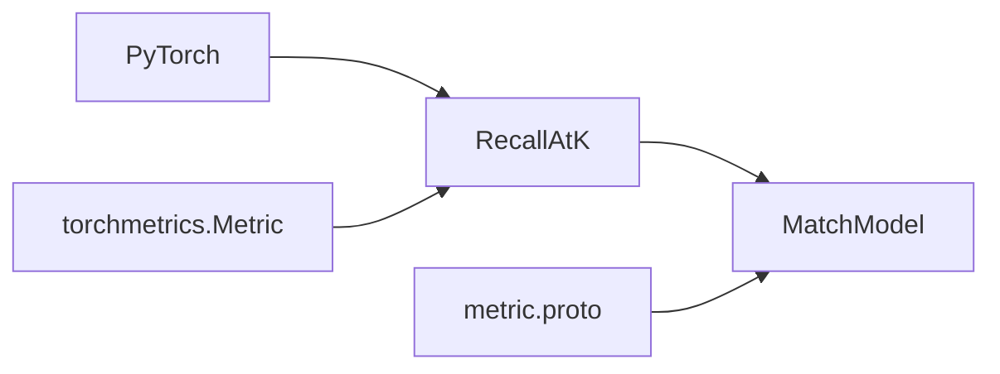

# Recall@K and Precision@K Metrics

<cite>
**Referenced Files in This Document**
- [recall_at_k.py](file://tzrec/metrics/recall_at_k.py)
- [recall_at_k_test.py](file://tzrec/metrics/recall_at_k_test.py)
- [match_model.py](file://tzrec/models/match_model.py)
- [metric.proto](file://tzrec/protos/metric.proto)
- [hitrate.py](file://tzrec/tools/hitrate.py)
</cite>

## Table of Contents

1. [Introduction](#introduction)
1. [Project Structure](#project-structure)
1. [Core Components](#core-components)
1. [Architecture Overview](#architecture-overview)
1. [Detailed Component Analysis](#detailed-component-analysis)
1. [Dependency Analysis](#dependency-analysis)
1. [Performance Considerations](#performance-considerations)
1. [Troubleshooting Guide](#troubleshooting-guide)
1. [Conclusion](#conclusion)
1. [Appendices](#appendices)

## Introduction

This document explains Recall@K and related ranking metrics in TorchEasyRec. It covers the mathematical definitions, implementation details, configuration options, and practical guidance for evaluating recommendation systems across different scenarios such as personalized ranking, candidate ranking, and diversity-aware evaluation. It also provides guidance on choosing K values, interpreting recall curves, and optimizing for business objectives, along with performance and memory considerations for large-scale evaluation.

## Project Structure

TorchEasyRec implements Recall@K as a PyTorch metric and integrates it into model training and evaluation flows. The relevant components are:

- Metric definition: Recall@K implementation
- Model integration: Match model initialization and update logic for Recall@K
- Configuration: Protocol buffer schema for metric configuration
- Evaluation utilities: Tools that compute hit rates and aggregate metrics across distributed workers

**Diagram sources**

- \[recall_at_k.py\](file://tzrec/metrics/recall_at_k.py#L19-L54)
- \[match_model.py\](file://tzrec/models/match_model.py#L331-L388)
- \[metric.proto\](file://tzrec/protos/metric.proto#L15-L17)
- \[hitrate.py\](file://tzrec/tools/hitrate.py#L419-L454)

**Section sources**

- \[recall_at_k.py\](file://tzrec/metrics/recall_at_k.py#L1-L54)
- \[match_model.py\](file://tzrec/models/match_model.py#L331-L388)
- \[metric.proto\](file://tzrec/protos/metric.proto#L15-L17)
- \[hitrate.py\](file://tzrec/tools/hitrate.py#L419-L454)

## Core Components

- Recall@K metric: Computes recall at top-K by ranking predictions and counting relevant items among the top-K.
- Model integration: MatchModel initializes and updates Recall@K during training and evaluation.
- Configuration: MetricConfig supports RecallAtK with a configurable top_K parameter.
- Distributed aggregation: Utilities reduce per-rank totals across workers for global metrics.

Key implementation highlights:

- Sorting predictions to obtain top-K indices
- Gathering targets for top-K positions
- Aggregating true positives and total positives across batches
- Computing recall as ratio of true positives to total positives

**Section sources**

- \[recall_at_k.py\](file://tzrec/metrics/recall_at_k.py#L26-L54)
- \[match_model.py\](file://tzrec/models/match_model.py#L331-L388)
- \[metric.proto\](file://tzrec/protos/metric.proto#L15-L17)

## Architecture Overview

The Recall@K pipeline connects model predictions to metric computation and aggregation:

**Diagram sources**

- \[match_model.py\](file://tzrec/models/match_model.py#L378-L386)
- \[recall_at_k.py\](file://tzrec/metrics/recall_at_k.py#L37-L54)
- \[hitrate.py\](file://tzrec/tools/hitrate.py#L450-L454)

## Detailed Component Analysis

### Recall@K Metric Implementation

Recall@K is implemented as a PyTorch metric with:

- State variables for aggregated true positives and total positives
- Update logic that sorts predictions, selects top-K indices, gathers target relevance, and accumulates counts
- Compute logic returning the recall ratio

**Diagram sources**

- \[recall_at_k.py\](file://tzrec/metrics/recall_at_k.py#L19-L54)

**Section sources**

- \[recall_at_k.py\](file://tzrec/metrics/recall_at_k.py#L26-L54)

### Model Integration and Configuration

MatchModel integrates Recall@K via:

- Config parsing to instantiate RecallAtK with top_K
- Metric naming convention recall@K
- Update logic that passes similarity predictions and constructed labels to the metric
- Support for in-batch negatives versus explicit positive-first layout

**Diagram sources**

- \[metric.proto\](file://tzrec/protos/metric.proto#L48-L59)
- \[match_model.py\](file://tzrec/models/match_model.py#L331-L388)

**Section sources**

- \[metric.proto\](file://tzrec/protos/metric.proto#L15-L17)
- \[match_model.py\](file://tzrec/models/match_model.py#L331-L388)

### Evaluation Utilities and Distributed Aggregation

Utilities compute hit rates and aggregate totals across distributed ranks:

- Per-batch hit rate computations
- Reduction of per-rank counters to global totals
- Optional detailed logging and output

**Diagram sources**

- \[hitrate.py\](file://tzrec/tools/hitrate.py#L419-L454)

**Section sources**

- \[hitrate.py\](file://tzrec/tools/hitrate.py#L419-L454)

### Mathematical Definitions and Use Cases

- Recall@K: Proportion of relevant items among the top-K ranked items for each query. It emphasizes completeness of relevant discovery up to rank K.
- Precision@K: Proportion of relevant items among the top-K ranked items. It emphasizes accuracy of the top-K results.
- Use cases:
  - Personalized recommendations: Use Recall@K to measure coverage of relevant items; use Precision@K to measure precision of top-K.
  - Candidate ranking: Focus on Recall@K to ensure relevant candidates are surfaced; adjust K to balance coverage vs. cost.
  - Diversity-aware evaluation: Combine Recall@K/Precision@K with diversity metrics to avoid over-reliance on highly similar items.

Note: While this repository implements Recall@K, Precision@K is not present as a dedicated metric class here. It can be implemented similarly by replacing the gathered target relevance with a relevance mask for precision computation.

**Section sources**

- \[recall_at_k.py\](file://tzrec/metrics/recall_at_k.py#L37-L54)

### Handling Tied Scores and Aggregation Across Batches

- Tied scores: The sorting operation determines the order among ties. The current implementation relies on the underlying sort behavior; if tie-breaking determinism is required, consider adding a small random jitter or stable sort tie-breakers at the caller level.
- Aggregation across batches: The metric accumulates counts per batch and divides totals at compute time. Distributed training aggregates per-rank counters using all_reduce.

**Section sources**

- \[recall_at_k.py\](file://tzrec/metrics/recall_at_k.py#L37-L54)
- \[hitrate.py\](file://tzrec/tools/hitrate.py#L450-L454)

### Configuration Options and Ranking Scenarios

- Configuration: RecallAtK supports top_K via MetricConfig.
- Ranking scenarios:
  - Personalized recommendations: Set K based on display capacity and business goals (e.g., 10–50). Monitor both Recall@K and Precision@K trends.
  - Candidate ranking: Use larger K to improve recall of relevant candidates; tune K to balance retrieval cost and downstream conversion.
  - Diversity-aware evaluation: Pair Recall@K with separation/diversity metrics to prevent over-ranking of similar items.

**Section sources**

- \[metric.proto\](file://tzrec/protos/metric.proto#L15-L17)
- \[match_model.py\](file://tzrec/models/match_model.py#L331-L388)

### Practical Examples and Business Guidance

- Choosing K:
  - Start with industry baselines (e.g., K=10, 20, 50) and measure Recall@K and Precision@K curves.
  - Optimize K to maximize business metrics (e.g., click-through rate, conversion) while maintaining acceptable recall.
- Interpreting recall curves:
  - Plot Recall@K vs. K to identify diminishing returns and choose K where gains plateau.
- Example workflow:
  - Define MetricConfig with desired top_K.
  - Run evaluation to obtain global Recall@K.
  - Adjust model/top_K based on business objectives.

**Section sources**

- \[recall_at_k_test.py\](file://tzrec/metrics/recall_at_k_test.py#L20-L30)
- \[match_model.py\](file://tzrec/models/match_model.py#L331-L388)

## Dependency Analysis

Recall@K depends on:

- PyTorch for tensor operations and distributed reductions
- torchmetrics base Metric for metric lifecycle
- MatchModel for integration and label construction
- Protobuf schema for configuration

**Diagram sources**

- \[recall_at_k.py\](file://tzrec/metrics/recall_at_k.py#L15-L16)
- \[match_model.py\](file://tzrec/models/match_model.py#L331-L388)
- \[metric.proto\](file://tzrec/protos/metric.proto#L15-L17)

**Section sources**

- \[recall_at_k.py\](file://tzrec/metrics/recall_at_k.py#L15-L16)
- \[match_model.py\](file://tzrec/models/match_model.py#L331-L388)
- \[metric.proto\](file://tzrec/protos/metric.proto#L15-L17)

## Performance Considerations

- Sorting complexity: Sorting predictions for top-K dominates compute; typical O(N log N) per sample where N is candidate count. For very large candidate sets, consider approximate top-K selection or pre-filtering.
- Memory optimization:
  - Avoid materializing full similarity matrices when unnecessary; stream or chunk computations.
  - Use appropriate data types (float32) and minimize intermediate copies.
  - Aggregate counts on-device and reduce across ranks efficiently.
- Distributed evaluation:
  - Use all_reduce for global totals to avoid collecting tensors across ranks.
  - Log progress periodically to monitor throughput.

**Section sources**

- \[recall_at_k.py\](file://tzrec/metrics/recall_at_k.py#L37-L54)
- \[hitrate.py\](file://tzrec/tools/hitrate.py#L419-L454)

## Troubleshooting Guide

- Incorrect K values:
  - Verify MetricConfig top_K matches expectations.
  - Confirm metric naming (e.g., recall@K) aligns with evaluation logs.
- Zero recall:
  - Ensure labels are properly constructed (in-batch or first-item-positive).
  - Check that predictions are numeric and not all zeros.
- Inconsistent results across ranks:
  - Confirm all_reduce is applied to both numerator and denominator.
  - Validate deterministic sorting behavior if tie-breaking matters.

**Section sources**

- \[match_model.py\](file://tzrec/models/match_model.py#L331-L388)
- \[hitrate.py\](file://tzrec/tools/hitrate.py#L450-L454)

## Conclusion

Recall@K in TorchEasyRec provides a robust, distributed metric for ranking evaluation. By configuring top_K appropriately and integrating with model training loops, practitioners can monitor and optimize recommendation quality across diverse scenarios. For Precision@K and related ranking metrics not present in this repository, the same pattern can be followed to implement and integrate new metrics consistently.

## Appendices

- Example test validates Recall@K computation on a small batch.
- Distributed hitrate utilities demonstrate reduction of totals across ranks.

**Section sources**

- \[recall_at_k_test.py\](file://tzrec/metrics/recall_at_k_test.py#L20-L30)
- \[hitrate.py\](file://tzrec/tools/hitrate.py#L419-L454)
