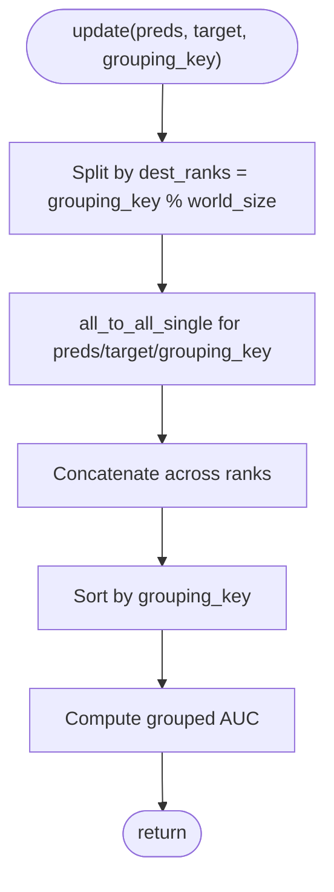

# Training Metric Wrapper and Batch Processing

<cite>
**Referenced Files in This Document**
- [train_metric_wrapper.py](file://tzrec/metrics/train_metric_wrapper.py)
- [decay_auc.py](file://tzrec/metrics/decay_auc.py)
- [xauc.py](file://tzrec/metrics/xauc.py)
- [grouped_auc.py](file://tzrec/metrics/grouped_auc.py)
- [grouped_xauc.py](file://tzrec/metrics/grouped_xauc.py)
- [rank_model.py](file://tzrec/models/rank_model.py)
- [model.py](file://tzrec/models/model.py)
- [main.py](file://tzrec/main.py)
- [dist_util.py](file://tzrec/utils/dist_util.py)
- [dataset.py](file://tzrec/datasets/dataset.py)
- [data_parser.py](file://tzrec/datasets/data_parser.py)
- [utils.py](file://tzrec/datasets/utils.py)
- [metric.proto](file://tzrec/protos/metric.proto)
- [train_eval.py](file://tzrec/train_eval.py)
</cite>

## Table of Contents

1. [Introduction](#introduction)
1. [Project Structure](#project-structure)
1. [Core Components](#core-components)
1. [Architecture Overview](#architecture-overview)
1. [Detailed Component Analysis](#detailed-component-analysis)
1. [Dependency Analysis](#dependency-analysis)
1. [Performance Considerations](#performance-considerations)
1. [Troubleshooting Guide](#troubleshooting-guide)
1. [Conclusion](#conclusion)
1. [Appendices](#appendices)

## Introduction

This document explains the training metric wrapper and batch processing system in TorchEasyRec. It focuses on how metrics are integrated into the training loop, how metric states are maintained across batches, and how distributed metric computation is handled. It also covers batch processing workflows, memory management for large-scale training, and the interface between the training system and metric computations for logging, early stopping, and learning rate scheduling.

## Project Structure

The training metric system spans several modules:

- Metrics: metric wrappers and implementations (e.g., training wrapper, AUC variants, XAUC)
- Model: initialization and update of training metrics during forward passes
- Training loop: orchestration of batch processing, metric updates, and logging
- Distributed utilities: safe batch fetching and synchronization across workers
- Dataset and data parsing: batch construction and device transfers

**Diagram sources**

- \[train_metric_wrapper.py\](file://tzrec/metrics/train_metric_wrapper.py#L20-L62)
- \[decay_auc.py\](file://tzrec/metrics/decay_auc.py#L24-L60)
- \[xauc.py\](file://tzrec/metrics/xauc.py#L74-L174)
- \[grouped_auc.py\](file://tzrec/metrics/grouped_auc.py#L39-L104)
- \[grouped_xauc.py\](file://tzrec/metrics/grouped_xauc.py#L151-L168)
- \[rank_model.py\](file://tzrec/models/rank_model.py#L328-L356)
- \[model.py\](file://tzrec/models/model.py#L121-L138)
- \[main.py\](file://tzrec/main.py#L416-L433)
- \[dist_util.py\](file://tzrec/utils/dist_util.py#L248-L301)
- \[dataset.py\](file://tzrec/datasets/dataset.py#L149-L200)
- \[data_parser.py\](file://tzrec/datasets/data_parser.py#L385-L402)
- \[utils.py\](file://tzrec/datasets/utils.py#L152-L246)
- \[metric.proto\](file://tzrec/protos/metric.proto#L48-L76)
- \[train_eval.py\](file://tzrec/train_eval.py#L16-L72)

**Section sources**

- \[train_metric_wrapper.py\](file://tzrec/metrics/train_metric_wrapper.py#L20-L62)
- \[rank_model.py\](file://tzrec/models/rank_model.py#L328-L356)
- \[main.py\](file://tzrec/main.py#L416-L433)
- \[dist_util.py\](file://tzrec/utils/dist_util.py#L248-L301)
- \[dataset.py\](file://tzrec/datasets/dataset.py#L149-L200)
- \[data_parser.py\](file://tzrec/datasets/data_parser.py#L385-L402)
- \[utils.py\](file://tzrec/datasets/utils.py#L152-L246)
- \[metric.proto\](file://tzrec/protos/metric.proto#L48-L76)
- \[train_eval.py\](file://tzrec/train_eval.py#L16-L72)

## Core Components

- TrainMetricWrapper: wraps a torchmetrics Metric to maintain a decaying value and step counters, periodically decays and aggregates metric values for training logs.
- DecayAUC: a specialized AUC metric with internal buffers and a decay mechanism suitable for training.
- XAUC: supports in-batch and full-set computation with configurable downsampling to manage memory.
- RankModel: initializes and updates training metrics during forward passes, selecting appropriate metric modules based on configuration.
- Model base: computes and resets standard evaluation metrics after each logging interval.
- Training loop: drives batch processing, metric updates, and logging at configured intervals.
- Distributed utilities: ensures consistent batch availability across workers and avoids deadlocks.
- Dataset/DataParser/Batch: constructs and moves batches to devices efficiently.

**Section sources**

- \[train_metric_wrapper.py\](file://tzrec/metrics/train_metric_wrapper.py#L20-L62)
- \[decay_auc.py\](file://tzrec/metrics/decay_auc.py#L24-L60)
- \[xauc.py\](file://tzrec/metrics/xauc.py#L74-L174)
- \[rank_model.py\](file://tzrec/models/rank_model.py#L328-L356)
- \[model.py\](file://tzrec/models/model.py#L121-L138)
- \[main.py\](file://tzrec/main.py#L416-L433)
- \[dist_util.py\](file://tzrec/utils/dist_util.py#L248-L301)
- \[dataset.py\](file://tzrec/datasets/dataset.py#L149-L200)
- \[data_parser.py\](file://tzrec/datasets/data_parser.py#L385-L402)
- \[utils.py\](file://tzrec/datasets/utils.py#L152-L246)

## Architecture Overview

The training pipeline integrates metric computation tightly with batch processing:

- The training loop fetches a batch via the pipeline, runs a forward pass, and updates training metrics.
- At logging steps, training metrics are computed and logged.
- Standard evaluation metrics are computed and reset after each compute cycle.
- Distributed utilities ensure all workers synchronize around batch availability and dummy batches when needed.

**Diagram sources**

- \[main.py\](file://tzrec/main.py#L416-L433)
- \[dist_util.py\](file://tzrec/utils/dist_util.py#L248-L301)
- \[rank_model.py\](file://tzrec/models/rank_model.py#L494-L512)
- \[train_metric_wrapper.py\](file://tzrec/metrics/train_metric_wrapper.py#L42-L58)

## Detailed Component Analysis

### TrainMetricWrapper

Purpose:

- Wraps a torchmetrics Metric to track a decaying training metric value.
- Maintains step count and triggers periodic decay for AUC or generic metrics.

Key behaviors:

- update(preds, target): updates the underlying metric, increments step counter, and on decay steps either decays a DecayAUC or computes and averages with exponential smoothing for other metrics.
- compute(): returns the current decaying value.

**Diagram sources**

- \[train_metric_wrapper.py\](file://tzrec/metrics/train_metric_wrapper.py#L20-L62)
- \[decay_auc.py\](file://tzrec/metrics/decay_auc.py#L24-L60)

**Section sources**

- \[train_metric_wrapper.py\](file://tzrec/metrics/train_metric_wrapper.py#L20-L62)

### DecayAUC

Purpose:

- AUC variant designed for training with internal buffers and a decay operation.

Key behaviors:

- update: formats and updates internal confusion matrix buffers.
- decay: applies exponential decay to the stored confusion matrix using buffer.
- compute: computes AUROC from the current confusion matrix.

**Diagram sources**

- \[decay_auc.py\](file://tzrec/metrics/decay_auc.py#L42-L60)
- \[train_metric_wrapper.py\](file://tzrec/metrics/train_metric_wrapper.py#L46-L58)

**Section sources**

- \[decay_auc.py\](file://tzrec/metrics/decay_auc.py#L24-L60)

### XAUC

Purpose:

- Computes XAUC with two modes: in-batch (memory efficient) and full-set (with downsampling).

Key behaviors:

- update: stores predictions/targets or computes per-batch XAUC depending on mode.
- compute: concatenates stored tensors (full-set) or averages per-batch values (in-batch), optionally downsamples pairs to control memory.

**Diagram sources**

- \[xauc.py\](file://tzrec/metrics/xauc.py#L128-L173)

**Section sources**

- \[xauc.py\](file://tzrec/metrics/xauc.py#L74-L174)

### RankModel Training Metrics Integration

Initialization:

- Creates metric modules based on TrainMetricConfig (e.g., AUC -> DecayAUC, XAUC -> XAUC).
- Wraps each metric with TrainMetricWrapper and configures decay_rate and decay_step.

Update during training:

- Selects prediction tensors based on metric type and number of classes.
- Calls update on the corresponding TrainMetricWrapper.

**Diagram sources**

- \[rank_model.py\](file://tzrec/models/rank_model.py#L328-L356)
- \[rank_model.py\](file://tzrec/models/rank_model.py#L434-L465)
- \[rank_model.py\](file://tzrec/models/rank_model.py#L494-L512)

**Section sources**

- \[rank_model.py\](file://tzrec/models/rank_model.py#L328-L356)
- \[rank_model.py\](file://tzrec/models/rank_model.py#L434-L465)
- \[rank_model.py\](file://tzrec/models/rank_model.py#L494-L512)

### Distributed Metric Computation

GroupedAUC and GroupedXAUC:

- GroupedAUC partitions data by group id across workers and performs all-to-all exchanges to align groups for computation.
- GroupedXAUC gathers partial metrics across workers and computes a weighted average.

**Diagram sources**

- \[grouped_auc.py\](file://tzrec/metrics/grouped_auc.py#L39-L104)
- \[grouped_xauc.py\](file://tzrec/metrics/grouped_xauc.py#L151-L168)

**Section sources**

- \[grouped_auc.py\](file://tzrec/metrics/grouped_auc.py#L39-L104)
- \[grouped_xauc.py\](file://tzrec/metrics/grouped_xauc.py#L151-L168)

### Batch Processing Workflow

- Dataset and DataParser construct batches and handle tiling and conversion to Batch objects.
- Batch.to and Batch.pin_memory move data to target devices and pinned memory for efficient transfer.
- Distributed utilities ensure consistent batch availability across workers; dummy batches prevent hangs when some workers finish earlier.

**Diagram sources**

- \[dataset.py\](file://tzrec/datasets/dataset.py#L149-L200)
- \[data_parser.py\](file://tzrec/datasets/data_parser.py#L385-L402)
- \[utils.py\](file://tzrec/datasets/utils.py#L152-L246)
- \[dist_util.py\](file://tzrec/utils/dist_util.py#L248-L301)
- \[main.py\](file://tzrec/main.py#L416-L433)

**Section sources**

- \[dataset.py\](file://tzrec/datasets/dataset.py#L149-L200)
- \[data_parser.py\](file://tzrec/datasets/data_parser.py#L385-L402)
- \[utils.py\](file://tzrec/datasets/utils.py#L152-L246)
- \[dist_util.py\](file://tzrec/utils/dist_util.py#L248-L301)
- \[main.py\](file://tzrec/main.py#L416-L433)

## Dependency Analysis

- RankModel depends on metric configurations to instantiate metric modules and TrainMetricWrapper instances.
- TrainMetricWrapper depends on DecayAUC for AUC decay and on generic torchmetrics for other metrics.
- XAUC depends on torchmetrics infrastructure and supports both in-batch and full-set computation.
- Distributed metrics rely on torch.distributed primitives for cross-rank communication.
- The training loop orchestrates pipeline progress, metric updates, and logging.

**Diagram sources**

- \[rank_model.py\](file://tzrec/models/rank_model.py#L328-L356)
- \[train_metric_wrapper.py\](file://tzrec/metrics/train_metric_wrapper.py#L20-L62)
- \[decay_auc.py\](file://tzrec/metrics/decay_auc.py#L24-L60)
- \[xauc.py\](file://tzrec/metrics/xauc.py#L74-L174)
- \[grouped_auc.py\](file://tzrec/metrics/grouped_auc.py#L39-L104)
- \[grouped_xauc.py\](file://tzrec/metrics/grouped_xauc.py#L151-L168)
- \[main.py\](file://tzrec/main.py#L416-L433)
- \[dist_util.py\](file://tzrec/utils/dist_util.py#L248-L301)
- \[dataset.py\](file://tzrec/datasets/dataset.py#L149-L200)
- \[data_parser.py\](file://tzrec/datasets/data_parser.py#L385-L402)
- \[utils.py\](file://tzrec/datasets/utils.py#L152-L246)

**Section sources**

- \[rank_model.py\](file://tzrec/models/rank_model.py#L328-L356)
- \[train_metric_wrapper.py\](file://tzrec/metrics/train_metric_wrapper.py#L20-L62)
- \[decay_auc.py\](file://tzrec/metrics/decay_auc.py#L24-L60)
- \[xauc.py\](file://tzrec/metrics/xauc.py#L74-L174)
- \[grouped_auc.py\](file://tzrec/metrics/grouped_auc.py#L39-L104)
- \[grouped_xauc.py\](file://tzrec/metrics/grouped_xauc.py#L151-L168)
- \[main.py\](file://tzrec/main.py#L416-L433)
- \[dist_util.py\](file://tzrec/utils/dist_util.py#L248-L301)
- \[dataset.py\](file://tzrec/datasets/dataset.py#L149-L200)
- \[data_parser.py\](file://tzrec/datasets/data_parser.py#L385-L402)
- \[utils.py\](file://tzrec/datasets/utils.py#L152-L246)

## Performance Considerations

- Decaying metrics: Use TrainMetricWrapper with reasonable decay_step to balance responsiveness and stability. For AUC, DecayAUC’s decay reduces noise while maintaining recent trends.
- Memory-efficient XAUC: Prefer in-batch XAUC for large-scale training to avoid storing entire prediction/target sets. Tune sample_ratio or max_pairs to control memory footprint.
- Batch device transfers: Use Batch.to and Batch.pin_memory to minimize CPU-GPU transfer overhead. Ensure data is moved to the correct device early in the pipeline.
- Distributed synchronization: Distributed utilities insert dummy batches to prevent deadlocks and ensure consistent epoch boundaries across workers.
- Logging cadence: Log training metrics at intervals aligned with decay steps to reduce redundant computations and stabilize displayed values.

[No sources needed since this section provides general guidance]

## Troubleshooting Guide

Common issues and resolutions:

- Metric not updating: Verify that update_train_metric is called with correct predictions and labels and that metric type matches the model’s configuration.
- AUC instability: Increase decay_rate or decay_step to smooth values; ensure decay_step divides log_step_count_steps for consistent reporting.
- High memory usage with XAUC: Switch to in-batch mode or reduce sample_ratio/max_pairs; shuffle data to mitigate bias.
- Distributed hangs: Ensure check_all_workers_data_status is enabled so dummy batches are used when some workers finish earlier.
- Incorrect metric values: Confirm that predictions and labels are passed to the correct metric module (e.g., probabilities vs logits) and that suffixes match model outputs.

**Section sources**

- \[rank_model.py\](file://tzrec/models/rank_model.py#L434-L465)
- \[train_metric_wrapper.py\](file://tzrec/metrics/train_metric_wrapper.py#L42-L58)
- \[xauc.py\](file://tzrec/metrics/xauc.py#L74-L174)
- \[dist_util.py\](file://tzrec/utils/dist_util.py#L248-L301)

## Conclusion

The training metric wrapper and batch processing system in TorchEasyRec provide a robust, scalable framework for metric computation during training. TrainMetricWrapper enables decaying, memory-aware metrics, while DecayAUC and XAUC offer specialized behaviors suited to ranking tasks. Distributed utilities ensure reliable multi-worker training, and the training loop integrates metric updates and logging seamlessly. Proper configuration of decay rates, logging cadence, and XAUC parameters helps achieve accurate, efficient, and stable training monitoring.

[No sources needed since this section summarizes without analyzing specific files]

## Appendices

### Practical Configuration Examples

- Configure training metrics in the pipeline config using TrainMetricConfig with desired decay_rate and decay_step.
- Choose AUC with DecayAUC for stable training AUROC tracking; use XAUC with in-batch mode for large-scale scenarios.
- Align log_step_count_steps with decay_step to ensure consistent metric reporting.

**Section sources**

- \[metric.proto\](file://tzrec/protos/metric.proto#L63-L76)
- \[rank_model.py\](file://tzrec/models/rank_model.py#L328-L356)
- \[train_metric_wrapper.py\](file://tzrec/metrics/train_metric_wrapper.py#L29-L40)

### Monitoring and Early Stopping

- Use compute_train_metric to retrieve logged metrics at each interval.
- Integrate returned metrics with external systems for early stopping or learning rate scheduling decisions.

**Section sources**

- \[model.py\](file://tzrec/models/model.py#L133-L138)
- \[main.py\](file://tzrec/main.py#L422-L433)
