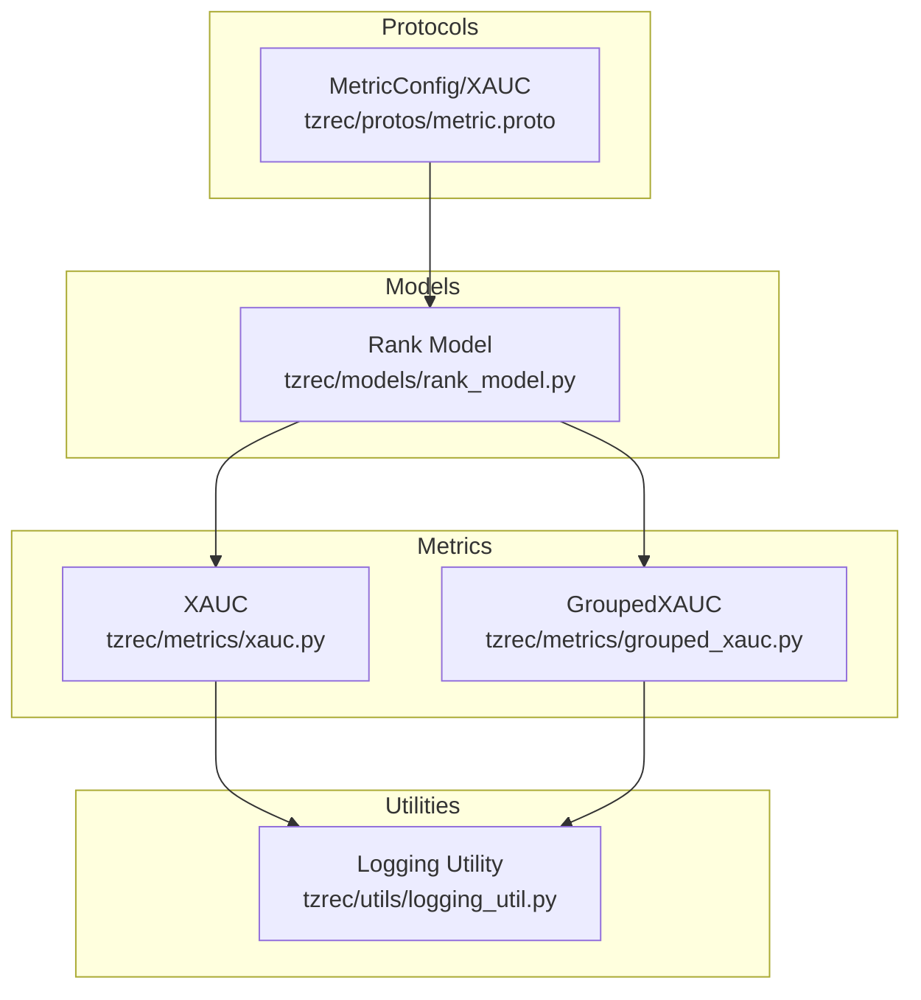
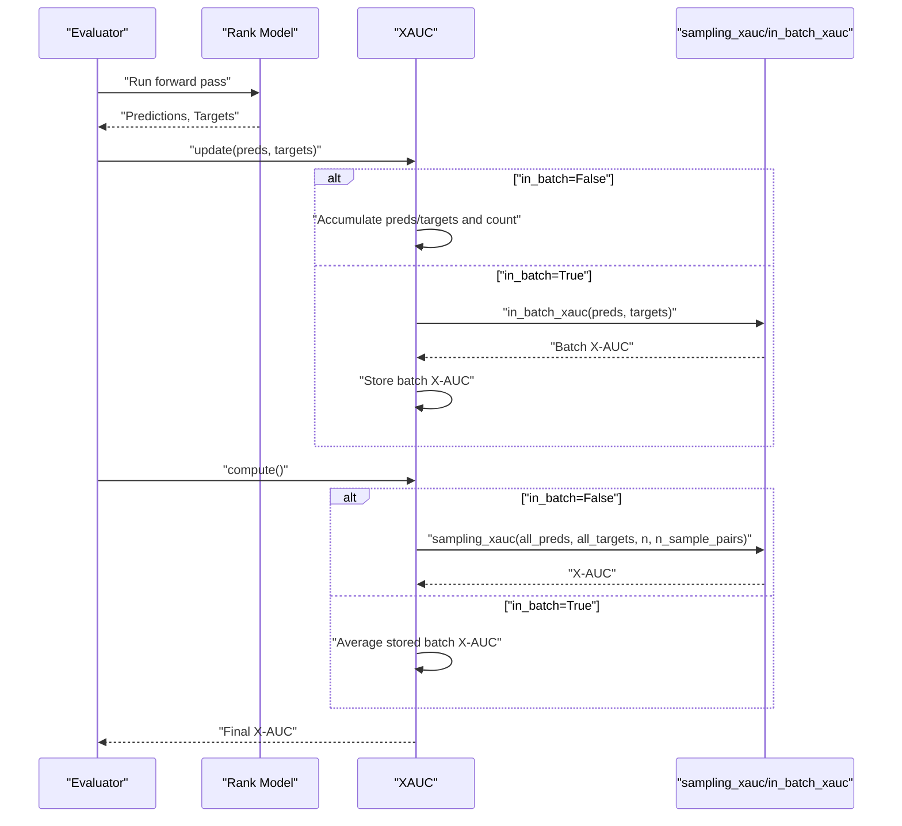
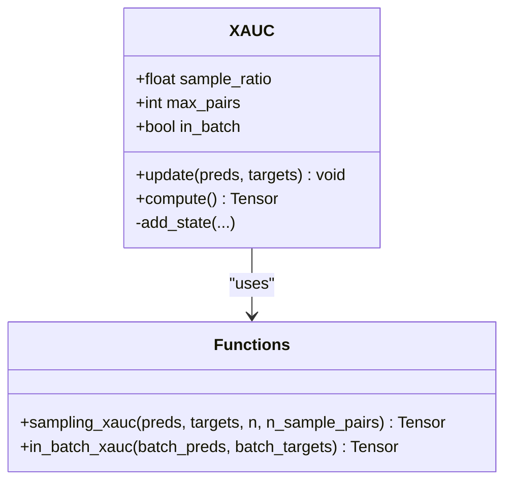
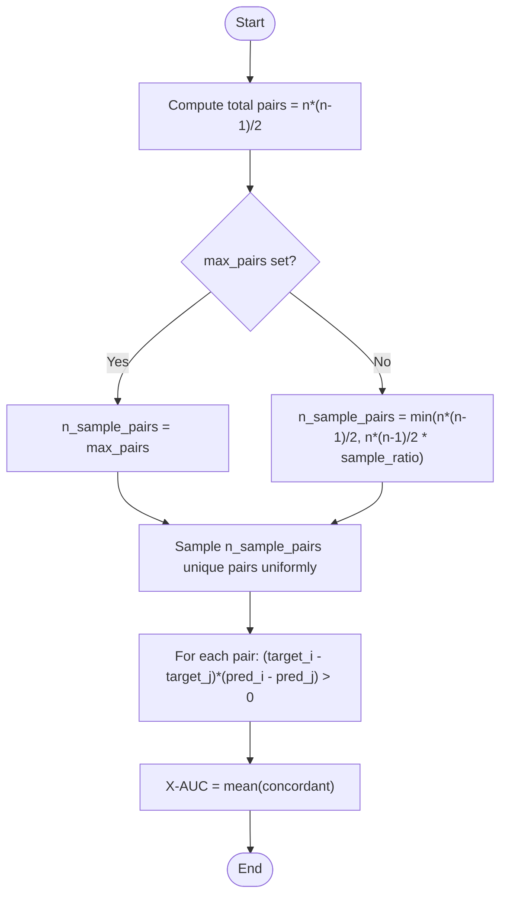
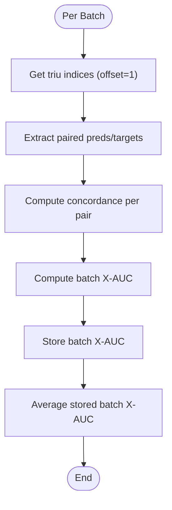
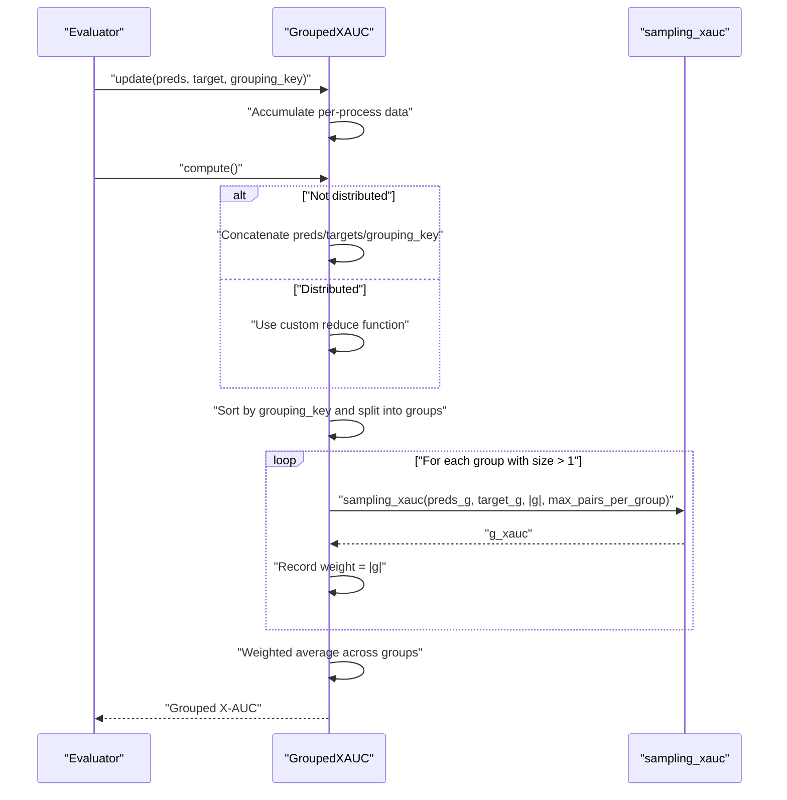
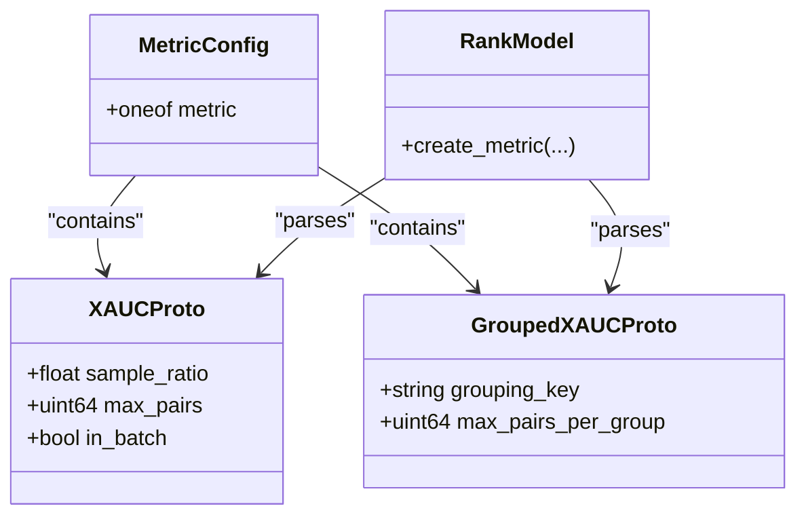
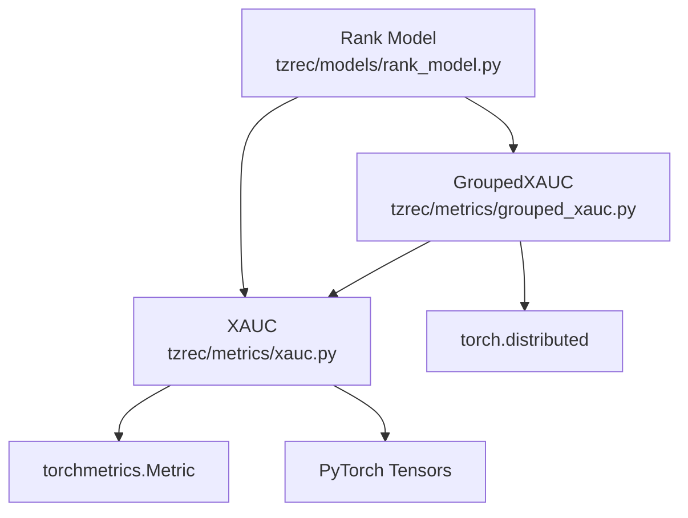

# X-AUC Metric Implementation

<cite>
**Referenced Files in This Document**
- [xauc.py](file://tzrec/metrics/xauc.py)
- [grouped_xauc.py](file://tzrec/metrics/grouped_xauc.py)
- [xauc_test.py](file://tzrec/metrics/xauc_test.py)
- [grouped_xauc_test.py](file://tzrec/metrics/grouped_xauc_test.py)
- [metric.proto](file://tzrec/protos/metric.proto)
- [rank_model.py](file://tzrec/models/rank_model.py)
- [logging_util.py](file://tzrec/utils/logging_util.py)
</cite>

## Table of Contents

1. [Introduction](#introduction)
1. [Project Structure](#project-structure)
1. [Core Components](#core-components)
1. [Architecture Overview](#architecture-overview)
1. [Detailed Component Analysis](#detailed-component-analysis)
1. [Dependency Analysis](#dependency-analysis)
1. [Performance Considerations](#performance-considerations)
1. [Troubleshooting Guide](#troubleshooting-guide)
1. [Conclusion](#conclusion)

## Introduction

This document explains the X-AUC (Cross-Area Under Curve) metric implementation in TorchEasyRec. X-AUC extends traditional AUC by focusing on cross-group comparisons rather than global ranking, making it particularly suitable for recommendation systems where items belong to distinct categories or domains. It measures the probability that a randomly selected positive item from one group outranks a negative item from another group, using pairwise comparisons. The implementation supports two calculation modes:

- Sampling-based X-AUC: Randomly samples pairs from all possible pairs to estimate X-AUC, enabling controlled memory usage via parameters like sample_ratio and max_pairs.
- In-batch X-AUC: Computes X-AUC within each evaluation batch and averages results across batches, which is typically more memory-efficient for large datasets.

Key characteristics:

- Mathematical formulation: Probability of concordant pairwise comparisons across groups.
- Computational complexity: O(n^2) in the number of evaluation samples due to pairwise comparisons.
- Downsampling strategy: Random uniform sampling of pairs with explicit bounds via sample_ratio or max_pairs.
- Practical configuration: sample_ratio, max_pairs, and in_batch options for balancing accuracy and memory.

## Project Structure

The X-AUC implementation resides in the metrics package and integrates with the model framework and configuration protocol buffers.

**Diagram sources**

- \[xauc.py\](file://tzrec/metrics/xauc.py#L74-L173)
- \[grouped_xauc.py\](file://tzrec/metrics/grouped_xauc.py#L65-L168)
- \[metric.proto\](file://tzrec/protos/metric.proto#L36-L60)
- \[rank_model.py\](file://tzrec/models/rank_model.py#L26-L324)
- \[logging_util.py\](file://tzrec/utils/logging_util.py#L16-L46)

**Section sources**

- \[xauc.py\](file://tzrec/metrics/xauc.py#L1-L174)
- \[grouped_xauc.py\](file://tzrec/metrics/grouped_xauc.py#L1-L169)
- \[metric.proto\](file://tzrec/protos/metric.proto#L1-L77)
- \[rank_model.py\](file://tzrec/models/rank_model.py#L12-L324)
- \[logging_util.py\](file://tzrec/utils/logging_util.py#L1-L46)

## Core Components

- XAUC: Implements the core X-AUC metric with two calculation modes and downsampling controls.
- GroupedXAUC: Extends X-AUC to compute group-aware averages using a grouping key.
- Protocol Buffers: Define configuration schema for X-AUC and GroupedXAUC.
- Model Integration: Rank model instantiates XAUC based on configuration.

Key responsibilities:

- Pairwise comparison logic and downsampling.
- Distributed reduction and aggregation.
- Configuration-driven behavior (sample_ratio, max_pairs, in_batch).

**Section sources**

- \[xauc.py\](file://tzrec/metrics/xauc.py#L74-L173)
- \[grouped_xauc.py\](file://tzrec/metrics/grouped_xauc.py#L65-L168)
- \[metric.proto\](file://tzrec/protos/metric.proto#L36-L60)
- \[rank_model.py\](file://tzrec/models/rank_model.py#L26-L324)

## Architecture Overview

The X-AUC computation pipeline depends on whether in-batch mode is enabled. In sampling mode, predictions and targets are accumulated across batches, then a fixed number of random pairs are sampled and evaluated. In in-batch mode, X-AUC is computed per batch and averaged.

**Diagram sources**

- \[xauc.py\](file://tzrec/metrics/xauc.py#L128-L173)
- \[xauc.py\](file://tzrec/metrics/xauc.py#L55-L71)
- \[xauc.py\](file://tzrec/metrics/xauc.py#L20-L52)

## Detailed Component Analysis

### XAUC Class

The XAUC metric encapsulates:

- Downstream sampling logic via sampling_xauc.
- In-batch computation via in_batch_xauc.
- State management for accumulating predictions/targets or batch scores.
- Parameter validation and configuration parsing.

**Diagram sources**

- \[xauc.py\](file://tzrec/metrics/xauc.py#L74-L173)
- \[xauc.py\](file://tzrec/metrics/xauc.py#L20-L71)

Implementation highlights:

- Parameter constraints: sample_ratio must be within (0, 1\].
- Memory considerations: sampling-based mode stores entire evaluation set; in-batch mode is more memory-efficient.
- Distributed behavior: states are aggregated across processes using torchmetrics’ distributed reduction.

**Section sources**

- \[xauc.py\](file://tzrec/metrics/xauc.py#L74-L173)

### Pairwise Comparison Logic and Downsampling

The pairwise comparison evaluates whether a positive-negative pair is concordant:

- Concordance condition: (target_i - target_j) * (pred_i - pred_j) > 0.
- X-AUC is the mean of concordant outcomes across sampled pairs.

Downsampling strategy:

- Random uniform sampling of pair indices from the set of all possible pairs.
- Explicit bounds via max_pairs or via sample_ratio * total_pairs.

**Diagram sources**

- \[xauc.py\](file://tzrec/metrics/xauc.py#L20-L52)
- \[xauc.py\](file://tzrec/metrics/xauc.py#L144-L173)

**Section sources**

- \[xauc.py\](file://tzrec/metrics/xauc.py#L20-L52)
- \[xauc.py\](file://tzrec/metrics/xauc.py#L144-L173)

### In-Batch X-AUC

In-batch mode computes X-AUC within each batch using upper-triangular index pairs and averages across batches.

**Diagram sources**

- \[xauc.py\](file://tzrec/metrics/xauc.py#L55-L71)
- \[xauc.py\](file://tzrec/metrics/xauc.py#L135-L149)

**Section sources**

- \[xauc.py\](file://tzrec/metrics/xauc.py#L55-L71)
- \[xauc.py\](file://tzrec/metrics/xauc.py#L135-L149)

### GroupedXAUC

GroupedXAUC segments the evaluation data by a grouping key, computes X-AUC per group up to a maximum number of pairs per group, and returns a weighted average across groups.

**Diagram sources**

- \[grouped_xauc.py\](file://tzrec/metrics/grouped_xauc.py#L65-L168)
- \[grouped_xauc.py\](file://tzrec/metrics/grouped_xauc.py#L18-L18)

**Section sources**

- \[grouped_xauc.py\](file://tzrec/metrics/grouped_xauc.py#L65-L168)

### Configuration and Integration

- Protocol Buffers define XAUC parameters: sample_ratio, max_pairs, in_batch, and GroupedXAUC parameters including grouping_key and max_pairs_per_group.
- Rank model instantiates XAUC or GroupedXAUC based on configuration.

**Diagram sources**

- \[metric.proto\](file://tzrec/protos/metric.proto#L36-L60)
- \[rank_model.py\](file://tzrec/models/rank_model.py#L26-L324)

**Section sources**

- \[metric.proto\](file://tzrec/protos/metric.proto#L36-L60)
- \[rank_model.py\](file://tzrec/models/rank_model.py#L26-L324)

## Dependency Analysis

- XAUC depends on torchmetrics’ Metric base class and PyTorch tensors for computation.
- GroupedXAUC depends on XAUC’s sampling_xauc and torch.distributed for multi-GPU aggregation.
- Rank model integrates XAUC/GroupedXAUC into evaluation pipelines.

**Diagram sources**

- \[xauc.py\](file://tzrec/metrics/xauc.py#L14-L173)
- \[grouped_xauc.py\](file://tzrec/metrics/grouped_xauc.py#L16-L168)
- \[rank_model.py\](file://tzrec/models/rank_model.py#L26-L324)

**Section sources**

- \[xauc.py\](file://tzrec/metrics/xauc.py#L14-L173)
- \[grouped_xauc.py\](file://tzrec/metrics/grouped_xauc.py#L16-L168)
- \[rank_model.py\](file://tzrec/models/rank_model.py#L26-L324)

## Performance Considerations

- Complexity: O(n^2) due to pairwise comparisons; memory scales with number of pairs.
- Sampling-based mode:
  - Controls memory via sample_ratio and max_pairs.
  - Recommended for global accuracy when memory allows.
- In-batch mode:
  - Typically more memory-efficient and faster for large datasets.
  - Requires shuffling the evaluation dataset to avoid bias.
- Distributed training:
  - GroupedXAUC aggregates across devices using all_gather; ensure NCCL backend compatibility for GPU tensors.
- Logging:
  - Computation logs are emitted during compute(), aiding monitoring.

Practical tips:

- Prefer in_batch mode for very large evaluation sets.
- Tune sample_ratio or max_pairs to balance accuracy and memory footprint.
- For grouped evaluation, cap max_pairs_per_group to limit per-group computation.

**Section sources**

- \[xauc.py\](file://tzrec/metrics/xauc.py#L77-L99)
- \[xauc.py\](file://tzrec/metrics/xauc.py#L144-L173)
- \[grouped_xauc.py\](file://tzrec/metrics/grouped_xauc.py#L135-L168)
- \[logging_util.py\](file://tzrec/utils/logging_util.py#L16-L46)

## Troubleshooting Guide

Common issues and resolutions:

- Extremely high memory usage:
  - Cause: Very large n_sample_pairs leading to massive intermediate arrays.
  - Resolution: Reduce sample_ratio or set max_pairs explicitly; prefer in_batch mode.
- Assertion failures:
  - Cause: max_pairs exceeds maximum possible pairs or invalid sample_ratio.
  - Resolution: Ensure max_pairs < n\*(n-1)/2 and 0 < sample_ratio \<= 1.
- Biased in-batch estimates:
  - Cause: Non-random order of batches.
  - Resolution: Shuffle evaluation dataset before running evaluation.
- Distributed aggregation anomalies:
  - Cause: Backend mismatch or missing WORLD_SIZE/RANK environment variables.
  - Resolution: Verify environment variables and backend; ensure all processes participate.
- Incorrect grouping in GroupedXAUC:
  - Cause: Misaligned grouping_key or unsorted data.
  - Resolution: Ensure grouping_key is provided consistently and data is sorted by grouping_key before splitting.

Validation references:

- Unit tests demonstrate expected behavior for both sampling-based and in-batch modes.

**Section sources**

- \[xauc.py\](file://tzrec/metrics/xauc.py#L111-L116)
- \[xauc.py\](file://tzrec/metrics/xauc.py#L164-L169)
- \[grouped_xauc.py\](file://tzrec/metrics/grouped_xauc.py#L135-L168)
- \[xauc_test.py\](file://tzrec/metrics/xauc_test.py#L20-L42)
- \[grouped_xauc_test.py\](file://tzrec/metrics/grouped_xauc_test.py#L20-L35)

## Conclusion

X-AUC provides a robust evaluation metric for recommendation systems by focusing on cross-group pairwise discrimination. The TorchEasyRec implementation offers flexible configuration and two calculation modes—sampling-based and in-batch—to accommodate varying memory and accuracy requirements. Proper tuning of sample_ratio, max_pairs, and in_batch, combined with careful data preparation and distributed setup, ensures reliable and efficient evaluation at scale.
