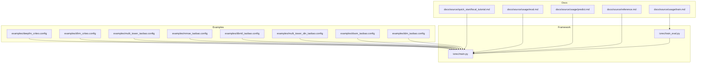
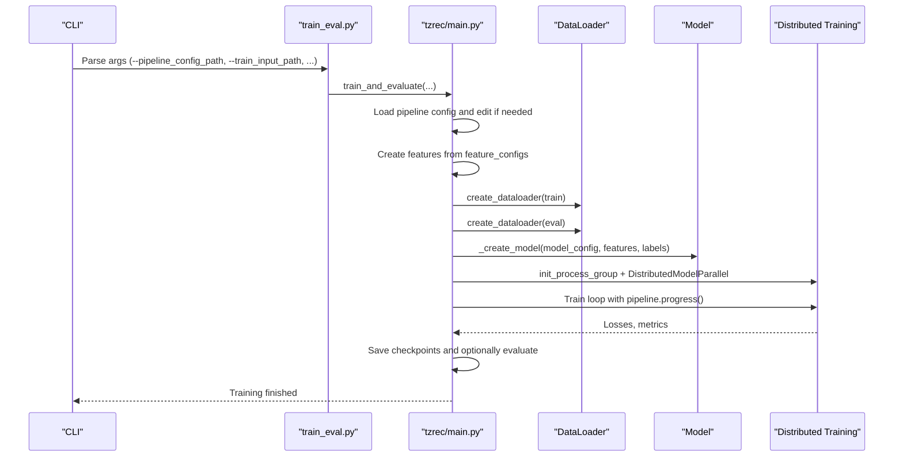
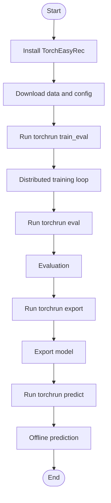
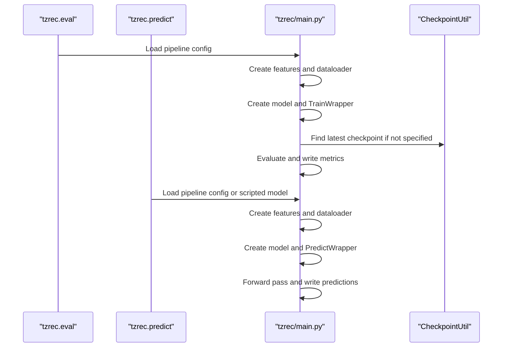
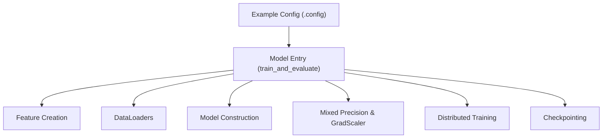

# Examples and Practical Tutorials

<cite>
**Referenced Files in This Document**
- [README.md](file://README.md)
- [examples/deepfm_criteo.config](file://examples/deepfm_criteo.config)
- [examples/dlrm_criteo.config](file://examples/dlrm_criteo.config)
- [examples/multi_tower_taobao.config](file://examples/multi_tower_taobao.config)
- [examples/mmoe_taobao.config](file://examples/mmoe_taobao.config)
- [examples/dbmtl_taobao.config](file://examples/dbmtl_taobao.config)
- [examples/multi_tower_din_taobao.config](file://examples/multi_tower_din_taobao.config)
- [examples/dssm_taobao.config](file://examples/dssm_taobao.config)
- [examples/tdm_taobao.config](file://examples/tdm_taobao.config)
- [docs/source/quick_start/local_tutorial.md](file://docs/source/quick_start/local_tutorial.md)
- [docs/source/usage/train.md](file://docs/source/usage/train.md)
- [docs/source/usage/eval.md](file://docs/source/usage/eval.md)
- [docs/source/usage/predict.md](file://docs/source/usage/predict.md)
- [docs/source/reference.md](file://docs/source/reference.md)
- [tzrec/main.py](file://tzrec/main.py)
- [tzrec/train_eval.py](file://tzrec/train_eval.py)
</cite>

## Table of Contents

1. [Introduction](#introduction)
1. [Project Structure](#project-structure)
1. [Core Components](#core-components)
1. [Architecture Overview](#architecture-overview)
1. [Detailed Component Analysis](#detailed-component-analysis)
1. [Dependency Analysis](#dependency-analysis)
1. [Performance Considerations](#performance-considerations)
1. [Troubleshooting Guide](#troubleshooting-guide)
1. [Conclusion](#conclusion)
1. [Appendices](#appendices)

## Introduction

This document presents comprehensive examples and practical tutorials for TorchEasyRec, focusing on the example configurations, experimental implementations, and step-by-step workflows for common recommendation tasks. It explains the example project structure, configuration patterns, and implementation approaches, and provides detailed walkthroughs for data preparation, model configuration, training execution, and evaluation. It also covers local and distributed training, custom model development, production deployment, adaptation tips for different datasets, troubleshooting, and extension strategies.

## Project Structure

The repository organizes examples and tutorials as follows:

- examples/: Example configuration files for representative models and datasets (e.g., DeepFM, DLRM, MultiTower, MMoE, DBMTL, DIN, DSSM, TDM).
- docs/source/quick_start/: End-to-end tutorials for local training and related workflows.
- docs/source/usage/: Detailed command-line usage for training, evaluation, prediction, and exporting.
- tzrec/: Core framework modules implementing data loading, feature engineering, model construction, training loops, evaluation, export, and prediction.



**Diagram sources**

- \[examples/deepfm_criteo.config\](file://examples/deepfm_criteo.config#L1-L397)
- \[examples/dlrm_criteo.config\](file://examples/dlrm_criteo.config#L1-L398)
- \[examples/multi_tower_taobao.config\](file://examples/multi_tower_taobao.config#L1-L207)
- \[examples/mmoe_taobao.config\](file://examples/mmoe_taobao.config#L1-L216)
- \[examples/dbmtl_taobao.config\](file://examples/dbmtl_taobao.config#L1-L224)
- \[examples/multi_tower_din_taobao.config\](file://examples/multi_tower_din_taobao.config#L1-L244)
- \[examples/dssm_taobao.config\](file://examples/dssm_taobao.config#L1-L267)
- \[examples/tdm_taobao.config\](file://examples/tdm_taobao.config#L1-L264)
- \[docs/source/quick_start/local_tutorial.md\](file://docs/source/quick_start/local_tutorial.md#L1-L330)
- \[docs/source/usage/train.md\](file://docs/source/usage/train.md#L1-L132)
- \[docs/source/usage/eval.md\](file://docs/source/usage/eval.md#L1-L34)
- \[docs/source/usage/predict.md\](file://docs/source/usage/predict.md#L1-L66)
- \[tzrec/main.py\](file://tzrec/main.py#L527-L737)
- \[tzrec/train_eval.py\](file://tzrec/train_eval.py#L1-L73)

**Section sources**

- \[README.md\](file://README.md#L1-L83)
- \[docs/source/quick_start/local_tutorial.md\](file://docs/source/quick_start/local_tutorial.md#L1-L330)
- \[docs/source/usage/train.md\](file://docs/source/usage/train.md#L1-L132)
- \[docs/source/usage/eval.md\](file://docs/source/usage/eval.md#L1-L34)
- \[docs/source/usage/predict.md\](file://docs/source/usage/predict.md#L1-L66)
- \[tzrec/main.py\](file://tzrec/main.py#L527-L737)
- \[tzrec/train_eval.py\](file://tzrec/train_eval.py#L1-L73)

## Core Components

- Example configurations: Each .config file defines training paths, evaluation paths, model directory, training/evaluation settings, data configuration, feature configurations, and model-specific blocks. They demonstrate best practices for feature groups, optimizer settings, metrics, and losses.
- Tutorials: Local tutorial documents installation, data preparation, and end-to-end commands for training, evaluation, export, and prediction.
- Usage docs: Detailed CLI arguments and environment variables for training, evaluation, and prediction.
- Framework entry points: train_and_evaluate orchestrates feature creation, data loaders, model construction, distributed training, evaluation, and checkpointing.

Key capabilities demonstrated:

- Data ingestion from MaxCompute tables, OSS files, CSV, and Parquet.
- Feature engineering via feature groups and sequence features.
- Model families: DeepFM, DLRM, MultiTower, DIN, DSSM, MMoE, DBMTL, TDM.
- Distributed training with mixed precision, gradient accumulation, and profiling.
- Export and offline prediction pipelines.

**Section sources**

- \[examples/deepfm_criteo.config\](file://examples/deepfm_criteo.config#L1-L397)
- \[examples/dlrm_criteo.config\](file://examples/dlrm_criteo.config#L1-L398)
- \[examples/multi_tower_taobao.config\](file://examples/multi_tower_taobao.config#L1-L207)
- \[examples/mmoe_taobao.config\](file://examples/mmoe_taobao.config#L1-L216)
- \[examples/dbmtl_taobao.config\](file://examples/dbmtl_taobao.config#L1-L224)
- \[examples/multi_tower_din_taobao.config\](file://examples/multi_tower_din_taobao.config#L1-L244)
- \[examples/dssm_taobao.config\](file://examples/dssm_taobao.config#L1-L267)
- \[examples/tdm_taobao.config\](file://examples/tdm_taobao.config#L1-L264)
- \[docs/source/quick_start/local_tutorial.md\](file://docs/source/quick_start/local_tutorial.md#L1-L330)
- \[docs/source/usage/train.md\](file://docs/source/usage/train.md#L1-L132)
- \[docs/source/usage/eval.md\](file://docs/source/usage/eval.md#L1-L34)
- \[docs/source/usage/predict.md\](file://docs/source/usage/predict.md#L1-L66)
- \[tzrec/main.py\](file://tzrec/main.py#L527-L737)
- \[tzrec/train_eval.py\](file://tzrec/train_eval.py#L1-L73)

## Architecture Overview

The end-to-end workflow integrates configuration-driven feature engineering, model construction, distributed training, evaluation, export, and prediction.



**Diagram sources**

- \[tzrec/train_eval.py\](file://tzrec/train_eval.py#L16-L72)
- \[tzrec/main.py\](file://tzrec/main.py#L527-L737)

**Section sources**

- \[tzrec/train_eval.py\](file://tzrec/train_eval.py#L1-L73)
- \[tzrec/main.py\](file://tzrec/main.py#L527-L737)

## Detailed Component Analysis

### Example Configurations Overview

Each example demonstrates a distinct recommendation scenario and model family:

- DeepFM on Criteo: Wide-deep feature groups, binary cross-entropy loss, AUC metric.
- DLRM on Criteo: Dense and sparse feature groups with MLP arch, binary cross-entropy.
- MultiTower on Taobao: Separate user/item towers with shared final MLP, AUC.
- MMoE on Taobao: Multi-task with shared experts and task-specific towers, AUC per task.
- DBMTL on Taobao: Multi-task with bottom MLP and task towers, AUC per task.
- MultiTower DIN on Taobao: Sequence-aware DIN tower plus deep towers, AUC.
- DSSM on Taobao: Matching model with user/item towers and recall metrics.
- TDM on Taobao: Tree-based retrieval model with hierarchical sampling, AUC.

These examples illustrate:

- Feature configuration patterns (id/raw/sequence features).
- Feature grouping strategies (DEEP, SEQUENCE, WIDE).
- Model-specific blocks and hyperparameters.
- Metrics and losses aligned with task objectives.

**Section sources**

- \[examples/deepfm_criteo.config\](file://examples/deepfm_criteo.config#L1-L397)
- \[examples/dlrm_criteo.config\](file://examples/dlrm_criteo.config#L1-L398)
- \[examples/multi_tower_taobao.config\](file://examples/multi_tower_taobao.config#L1-L207)
- \[examples/mmoe_taobao.config\](file://examples/mmoe_taobao.config#L1-L216)
- \[examples/dbmtl_taobao.config\](file://examples/dbmtl_taobao.config#L1-L224)
- \[examples/multi_tower_din_taobao.config\](file://examples/multi_tower_din_taobao.config#L1-L244)
- \[examples/dssm_taobao.config\](file://examples/dssm_taobao.config#L1-L267)
- \[examples/tdm_taobao.config\](file://examples/tdm_taobao.config#L1-L264)

### Local Training Tutorial Walkthrough

The local tutorial provides a complete end-to-end workflow:

- Installation via Conda or Docker.
- Downloading sample data and configuration.
- Running distributed training with torchrun.
- Evaluating, exporting, and offline prediction.

Key steps:

- Prepare data (Parquet) and configuration.
- Launch training with torchrun and pass pipeline config and input paths.
- Optionally evaluate and export.
- Predict with exported scripted model or checkpoint.



**Diagram sources**

- \[docs/source/quick_start/local_tutorial.md\](file://docs/source/quick_start/local_tutorial.md#L65-L129)

**Section sources**

- \[docs/source/quick_start/local_tutorial.md\](file://docs/source/quick_start/local_tutorial.md#L1-L330)

### Training Execution Patterns

Training is orchestrated by train_and_evaluate, which:

- Loads and edits pipeline configuration.
- Initializes distributed process group and device backend.
- Builds features, data loaders, and model.
- Creates optimizers and schedulers.
- Runs training loop with periodic evaluation and checkpointing.
- Supports mixed precision, gradient accumulation, profiling, and TensorBoard logging.

```mermaid
sequenceDiagram
    participant TE as "train_and_evaluate"
    participant FEAT as "_create_features"
    participant DL as "create_dataloader"
    participant MD as "_create_model"
    participant DP as "DistributedModelParallel"
    participant OPT as "TZRecOptimizer"
    participant LR as "Schedulers"
    participant CKPT as "CheckpointUtil"

    TE->>FEAT: "Build features from feature_configs"
    TE->>DL: "Create train dataloader"
    TE->>DL: "Create eval dataloader"
    TE->>MD: "Build model from model_config"
    TE->>DP: "Wrap with distributed parallel"
    TE->>OPT: "Build sparse/dense/part optimizers"
    TE->>LR: "Create schedulers"
    TE->>TE: "Train loop with pipeline.progress()"
    TE->>CKPT: "Save checkpoints periodically"
    TE->>TE: "Optional evaluation after checkpoint"
```

**Diagram sources**

- \[tzrec/main.py\](file://tzrec/main.py#L527-L737)

**Section sources**

- \[tzrec/main.py\](file://tzrec/main.py#L527-L737)
- \[docs/source/usage/train.md\](file://docs/source/usage/train.md#L1-L132)

### Evaluation and Prediction Pipelines

- Evaluation: Loads the latest checkpoint by default, runs evaluation loop, logs metrics, and writes results.
- Prediction: Supports two modes—offline prediction against a scripted export model (stable across code changes) and prediction against a checkpoint (reflects current code).



**Diagram sources**

- \[tzrec/main.py\](file://tzrec/main.py#L739-L850)
- \[docs/source/usage/eval.md\](file://docs/source/usage/eval.md#L1-L34)
- \[docs/source/usage/predict.md\](file://docs/source/usage/predict.md#L1-L66)

**Section sources**

- \[tzrec/main.py\](file://tzrec/main.py#L739-L850)
- \[docs/source/usage/eval.md\](file://docs/source/usage/eval.md#L1-L34)
- \[docs/source/usage/predict.md\](file://docs/source/usage/predict.md#L1-L66)

### Configuration Reference and Best Practices

- Configuration reference: The configuration reference points to an interactive proto HTML for detailed schema.
- Best practices:
  - Use feature groups to organize inputs by semantics (user/item/context/sequence).
  - Choose appropriate dataset types and FG modes for training vs. inference.
  - Align metrics and losses with task objectives (AUC for ranking, Recall@K for matching, Softmax for retrieval).
  - Configure optimizers and schedulers per task and scale.
  - Enable mixed precision and gradient accumulation for large-scale training.

**Section sources**

- \[docs/source/reference.md\](file://docs/source/reference.md#L1-L8)

## Dependency Analysis

The examples depend on the framework’s configuration-driven pipeline and training engine. The training entry point delegates to the main orchestration module, which constructs features, data loaders, models, and distributed training components.



**Diagram sources**

- \[tzrec/train_eval.py\](file://tzrec/train_eval.py#L16-L72)
- \[tzrec/main.py\](file://tzrec/main.py#L527-L737)

**Section sources**

- \[tzrec/train_eval.py\](file://tzrec/train_eval.py#L1-L73)
- \[tzrec/main.py\](file://tzrec/main.py#L527-L737)

## Performance Considerations

- Mixed precision and TF32 toggles for speed/accuracy balance.
- Gradient accumulation for small batch sizes.
- TensorBoard summaries for diagnostics.
- Profiling support for training and prediction.
- Environment variables to tune inter/intra-node bandwidth and storage reserve percent for memory-constrained environments.

Practical guidance:

- Enable mixed precision for GPU training when supported.
- Use gradient accumulation to simulate larger batches.
- Reduce TensorBoard logging overhead if profiling heavy computations.
- Adjust bandwidth and storage reserve variables for your cluster topology.

**Section sources**

- \[docs/source/usage/train.md\](file://docs/source/usage/train.md#L95-L131)

## Troubleshooting Guide

Common issues and resolutions:

- Missing or invalid fine-tune checkpoint path: Ensure the path exists and matches the expected checkpoint layout.
- Conflicting model_dir: If continuing training, ensure the directory is empty or pass the continue flag.
- Out-of-memory (OOM): Increase storage reserve percentage to allow the planner to re-optimize sharding.
- Data source configuration: Set ODPS_ENDPOINT and ODPS_CONFIG_FILE_PATH when using MaxCompute tables.

Operational tips:

- Use is_profiling to capture traces for performance analysis.
- Verify dataset_type and input paths align with your data format.
- Confirm label_fields and sample_weight_fields match your schema.

**Section sources**

- \[tzrec/main.py\](file://tzrec/main.py#L592-L617)
- \[docs/source/usage/train.md\](file://docs/source/usage/train.md#L24-L28)
- \[docs/source/usage/eval.md\](file://docs/source/usage/eval.md#L18-L21)
- \[docs/source/usage/predict.md\](file://docs/source/usage/predict.md#L61-L66)

## Conclusion

The examples and tutorials in TorchEasyRec provide a comprehensive foundation for building, training, evaluating, and deploying recommendation models. By leveraging configuration-driven feature engineering, flexible model architectures, and robust distributed training, practitioners can adapt these examples to diverse datasets and tasks. The provided workflows, best practices, and troubleshooting guidance enable efficient experimentation and production deployment.

## Appendices

- Quick Start: Local training tutorial with commands and configuration breakdown.
- Usage Docs: CLI arguments and environment variables for training, evaluation, and prediction.
- Configuration Reference: Interactive schema for pipeline, data, feature, model, optimizer, and metric definitions.

**Section sources**

- \[docs/source/quick_start/local_tutorial.md\](file://docs/source/quick_start/local_tutorial.md#L1-L330)
- \[docs/source/usage/train.md\](file://docs/source/usage/train.md#L1-L132)
- \[docs/source/usage/eval.md\](file://docs/source/usage/eval.md#L1-L34)
- \[docs/source/usage/predict.md\](file://docs/source/usage/predict.md#L1-L66)
- \[docs/source/reference.md\](file://docs/source/reference.md#L1-L8)
