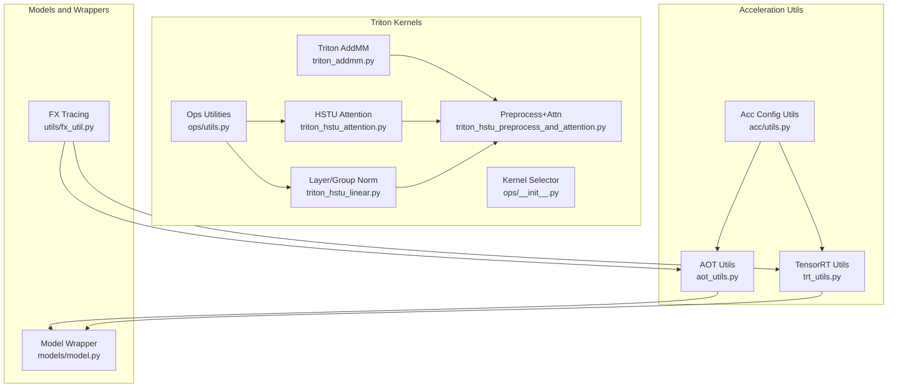
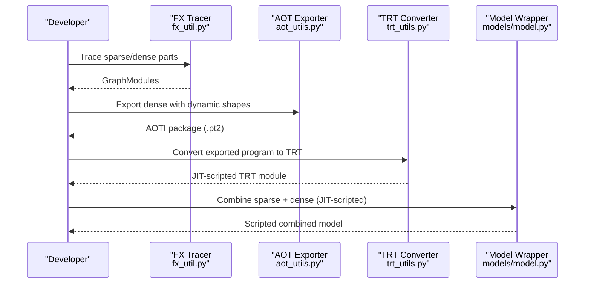
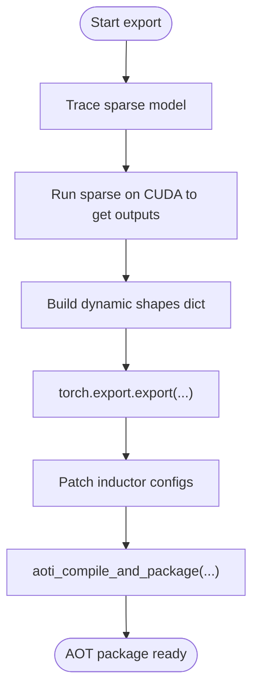
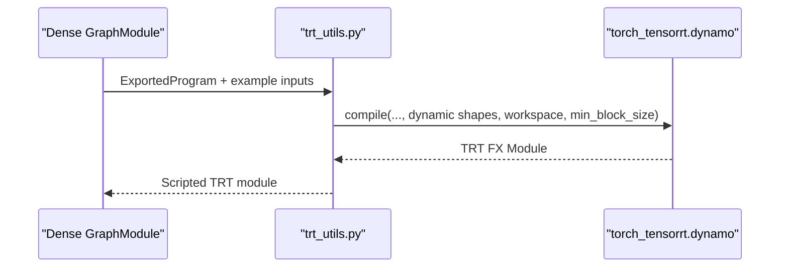
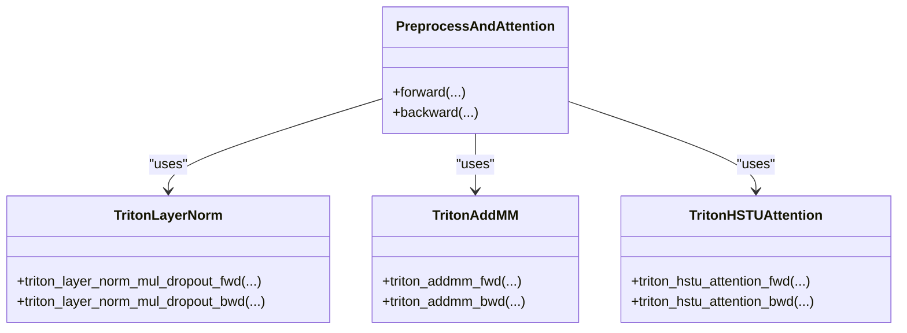
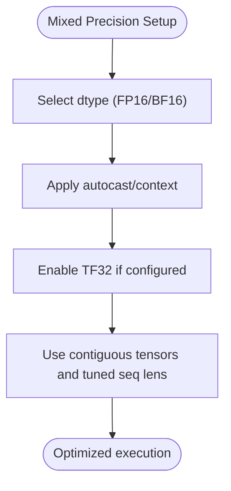
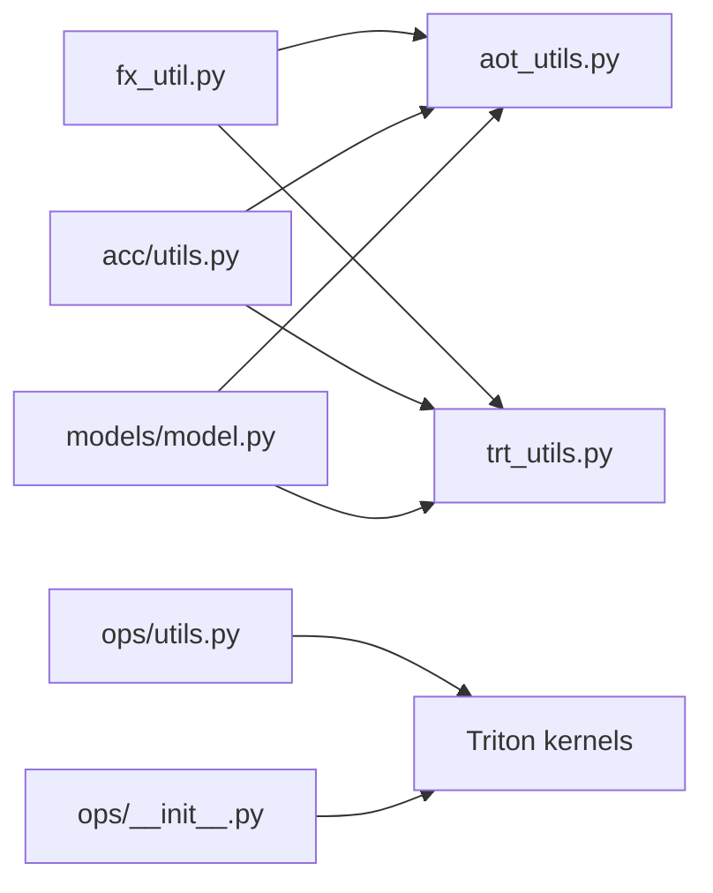

# Acceleration Utilities and Optimization

<cite>
**Referenced Files in This Document**
- [aot_utils.py](file://tzrec/acc/aot_utils.py)
- [trt_utils.py](file://tzrec/acc/trt_utils.py)
- [utils.py](file://tzrec/acc/utils.py)
- [__init__.py](file://tzrec/ops/__init__.py)
- [utils.py](file://tzrec/ops/utils.py)
- [triton_addmm.py](file://tzrec/ops/_triton/triton_addmm.py)
- [triton_hstu_attention.py](file://tzrec/ops/_triton/triton_hstu_attention.py)
- [triton_hstu_linear.py](file://tzrec/ops/_triton/triton_hstu_linear.py)
- [triton_hstu_preprocess_and_attention.py](file://tzrec/ops/_triton/triton_hstu_preprocess_and_attention.py)
- [model.py](file://tzrec/models/model.py)
- [fx_util.py](file://tzrec/utils/fx_util.py)
- [predict.py](file://tzrec/predict.py)
- [train_eval.py](file://tzrec/train_eval.py)
</cite>

## Table of Contents

1. [Introduction](#introduction)
1. [Project Structure](#project-structure)
1. [Core Components](#core-components)
1. [Architecture Overview](#architecture-overview)
1. [Detailed Component Analysis](#detailed-component-analysis)
1. [Dependency Analysis](#dependency-analysis)
1. [Performance Considerations](#performance-considerations)
1. [Troubleshooting Guide](#troubleshooting-guide)
1. [Conclusion](#conclusion)

## Introduction

This document explains TorchEasyRec’s acceleration utilities and optimization techniques for inference and training. It covers:

- Ahead-of-Time (AOT) compilation with torch.compile and AOTInductor
- TensorRT integration for GPU acceleration
- Torch-Triton kernels for compute-intensive operators
- Mixed precision and memory optimization strategies
- Practical guidance for applying acceleration across model families
- Hardware-aware configurations and profiling workflows

## Project Structure

The acceleration stack is organized around three pillars:

- Export and packaging utilities for AOT and TRT
- Triton-based kernels for attention, normalization, and linear ops
- Environment-driven configuration and wrappers for mixed precision

**Diagram sources**

- \[aot_utils.py\](file://tzrec/acc/aot_utils.py#L1-L108)
- \[trt_utils.py\](file://tzrec/acc/trt_utils.py#L1-L218)
- \[utils.py\](file://tzrec/acc/utils.py#L1-L228)
- \[triton_addmm.py\](file://tzrec/ops/\_triton/triton_addmm.py#L1-L326)
- \[triton_hstu_attention.py\](file://tzrec/ops/\_triton/triton_hstu_attention.py#L1-L800)
- \[triton_hstu_linear.py\](file://tzrec/ops/\_triton/triton_hstu_linear.py#L1-L800)
- \[triton_hstu_preprocess_and_attention.py\](file://tzrec/ops/\_triton/triton_hstu_preprocess_and_attention.py#L1-L347)
- \[utils.py\](file://tzrec/ops/utils.py#L1-L79)
- \[__init__.py\](file://tzrec/ops/__init__.py#L1-L22)
- \[model.py\](file://tzrec/models/model.py#L1-L200)
- \[fx_util.py\](file://tzrec/utils/fx_util.py#L30-L71)

**Section sources**

- \[aot_utils.py\](file://tzrec/acc/aot_utils.py#L1-L108)
- \[trt_utils.py\](file://tzrec/acc/trt_utils.py#L1-L218)
- \[utils.py\](file://tzrec/acc/utils.py#L1-L228)
- \[triton_addmm.py\](file://tzrec/ops/\_triton/triton_addmm.py#L1-L326)
- \[triton_hstu_attention.py\](file://tzrec/ops/\_triton/triton_hstu_attention.py#L1-L800)
- \[triton_hstu_linear.py\](file://tzrec/ops/\_triton/triton_hstu_linear.py#L1-L800)
- \[triton_hstu_preprocess_and_attention.py\](file://tzrec/ops/\_triton/triton_hstu_preprocess_and_attention.py#L1-L347)
- \[utils.py\](file://tzrec/ops/utils.py#L1-L79)
- \[__init__.py\](file://tzrec/ops/__init__.py#L1-L22)
- \[model.py\](file://tzrec/models/model.py#L1-L200)
- \[fx_util.py\](file://tzrec/utils/fx_util.py#L30-L71)

## Core Components

- AOT compilation utilities export dense subgraphs with dynamic shapes and package them for deployment.
- TensorRT utilities convert exported programs to TRT engines with dynamic shape support and optional profiling.
- Triton kernels provide high-performance attention, normalization, and linear ops with autotuning.
- Environment-driven toggles control quantization, input tiling, and acceleration modes.
- Model wrappers integrate mixed precision and device placement for inference.

**Section sources**

- \[aot_utils.py\](file://tzrec/acc/aot_utils.py#L24-L108)
- \[trt_utils.py\](file://tzrec/acc/trt_utils.py#L35-L218)
- \[utils.py\](file://tzrec/acc/utils.py#L51-L228)
- \[triton_addmm.py\](file://tzrec/ops/\_triton/triton_addmm.py#L160-L326)
- \[triton_hstu_attention.py\](file://tzrec/ops/\_triton/triton_hstu_attention.py#L588-L684)
- \[triton_hstu_linear.py\](file://tzrec/ops/\_triton/triton_hstu_linear.py#L312-L537)
- \[model.py\](file://tzrec/models/model.py#L222-L321)

## Architecture Overview

The acceleration pipeline integrates tracing, export, and runtime execution:

**Diagram sources**

- \[fx_util.py\](file://tzrec/utils/fx_util.py#L30-L71)
- \[aot_utils.py\](file://tzrec/acc/aot_utils.py#L46-L108)
- \[trt_utils.py\](file://tzrec/acc/trt_utils.py#L102-L186)
- \[model.py\](file://tzrec/models/model.py#L1-L200)

## Detailed Component Analysis

### AOT Compilation Utilities

- Dynamic shape specification supports variable-length sequences and jagged tensors.
- Export uses torch.export with patched inductor configs to handle autotune args safely.
- Packaging produces AOTI packages consumable at runtime.

**Diagram sources**

- \[aot_utils.py\](file://tzrec/acc/aot_utils.py#L46-L108)

**Section sources**

- \[aot_utils.py\](file://tzrec/acc/aot_utils.py#L24-L108)
- \[fx_util.py\](file://tzrec/utils/fx_util.py#L30-L71)

### TensorRT Integration

- Converts exported programs to TRT engines with dynamic shape support.
- Uses torch_tensorrt.dynamo.compile with workspace sizing and min_block_size tuning.
- Provides optional profiling of dense and combined inference stages.

**Diagram sources**

- \[trt_utils.py\](file://tzrec/acc/trt_utils.py#L35-L91)
- \[trt_utils.py\](file://tzrec/acc/trt_utils.py#L102-L186)

**Section sources**

- \[trt_utils.py\](file://tzrec/acc/trt_utils.py#L35-L218)

### Torch-Triton Kernels

- AddMM fusion kernel with autotuning configs for various architectures.
- HSTU attention kernel with autotuning and optional TMA support.
- Layer/group normalization with dropout fused operations.
- Preprocess-and-attention function composes normalization, projection, and attention.

**Diagram sources**

- \[triton_addmm.py\](file://tzrec/ops/\_triton/triton_addmm.py#L160-L326)
- \[triton_hstu_attention.py\](file://tzrec/ops/\_triton/triton_hstu_attention.py#L588-L684)
- \[triton_hstu_linear.py\](file://tzrec/ops/\_triton/triton_hstu_linear.py#L312-L537)
- \[triton_hstu_preprocess_and_attention.py\](file://tzrec/ops/\_triton/triton_hstu_preprocess_and_attention.py#L37-L347)

**Section sources**

- \[triton_addmm.py\](file://tzrec/ops/\_triton/triton_addmm.py#L160-L326)
- \[triton_hstu_attention.py\](file://tzrec/ops/\_triton/triton_hstu_attention.py#L46-L244)
- \[triton_hstu_linear.py\](file://tzrec/ops/\_triton/triton_hstu_linear.py#L312-L537)
- \[triton_hstu_preprocess_and_attention.py\](file://tzrec/ops/\_triton/triton_hstu_preprocess_and_attention.py#L37-L347)

### Mixed Precision and Memory Optimization

- Mixed precision wrappers select FP16 or BF16 for inference and training.
- TF32 toggles for cuDNN and CUDA matmul can be configured via training config.
- Ops utilities enforce contiguity and autotune sequence lengths for Triton kernels.

**Diagram sources**

- \[model.py\](file://tzrec/models/model.py#L222-L321)
- \[utils.py\](file://tzrec/ops/utils.py#L18-L79)
- \[utils.py\](file://tzrec/acc/utils.py#L221-L228)

**Section sources**

- \[model.py\](file://tzrec/models/model.py#L222-L321)
- \[utils.py\](file://tzrec/ops/utils.py#L18-L79)
- \[utils.py\](file://tzrec/acc/utils.py#L221-L228)

### Practical Application Across Model Architectures

- MultiTower/DIN-style models: leverage preprocess-and-attention fusion for efficient sequence modeling.
- MMoE/PLE: use Triton attention kernels for shared towers and task-specific components.
- DeepFM/DCN: fuse linear projections with normalization using Triton kernels.
- DLRM-style: combine embedding lookups with fused dense layers using AddMM fusion.

[No sources needed since this section provides general guidance]

## Dependency Analysis

Key dependencies and coupling:

- AOT and TRT depend on FX tracing and dynamic shape metadata.
- Triton kernels depend on ops utilities for contiguity and autotuning.
- Environment variables drive quantization, input tiling, and acceleration mode selection.

**Diagram sources**

- \[fx_util.py\](file://tzrec/utils/fx_util.py#L30-L71)
- \[aot_utils.py\](file://tzrec/acc/aot_utils.py#L1-L108)
- \[trt_utils.py\](file://tzrec/acc/trt_utils.py#L1-L218)
- \[utils.py\](file://tzrec/acc/utils.py#L1-L228)
- \[utils.py\](file://tzrec/ops/utils.py#L1-L79)
- \[__init__.py\](file://tzrec/ops/__init__.py#L1-L22)
- \[model.py\](file://tzrec/models/model.py#L1-L200)

**Section sources**

- \[aot_utils.py\](file://tzrec/acc/aot_utils.py#L1-L108)
- \[trt_utils.py\](file://tzrec/acc/trt_utils.py#L1-L218)
- \[utils.py\](file://tzrec/acc/utils.py#L1-L228)
- \[utils.py\](file://tzrec/ops/utils.py#L1-L79)
- \[__init__.py\](file://tzrec/ops/__init__.py#L1-L22)
- \[model.py\](file://tzrec/models/model.py#L1-L200)
- \[fx_util.py\](file://tzrec/utils/fx_util.py#L30-L71)

## Performance Considerations

- Prefer AOTI packaging for stable, compiled dense subgraphs with dynamic shapes.
- Use TensorRT for GPU-bound dense layers with compatible dynamic shapes.
- Enable Triton kernels for attention and normalization-heavy layers.
- Tune batch size and sequence lengths; use runtime autotuning helpers for sequence bounds.
- Enable mixed precision (FP16/BF16) and TF32 where supported by hardware.

[No sources needed since this section provides general guidance]

## Troubleshooting Guide

Common issues and remedies:

- AOT dynamic shape mismatches: verify dynamic shapes align with meta_info and sequence names.
- TRT conversion failures: adjust workspace size, min_block_size, and enable debug mode for diagnostics.
- Triton autotune instability: reduce search space or constrain sequence length tuning.
- Mixed precision errors: ensure target device capability supports BF16 and that TF32 toggles are set appropriately.

**Section sources**

- \[aot_utils.py\](file://tzrec/acc/aot_utils.py#L70-L108)
- \[trt_utils.py\](file://tzrec/acc/trt_utils.py#L35-L91)
- \[utils.py\](file://tzrec/ops/utils.py#L53-L79)
- \[utils.py\](file://tzrec/acc/utils.py#L221-L228)

## Conclusion

TorchEasyRec’s acceleration stack combines AOT compilation, TensorRT integration, and high-performance Triton kernels to deliver efficient inference across diverse recommendation architectures. By leveraging environment-driven configuration, dynamic shape export, and kernel autotuning, practitioners can achieve significant speedups while maintaining flexibility across hardware platforms.
