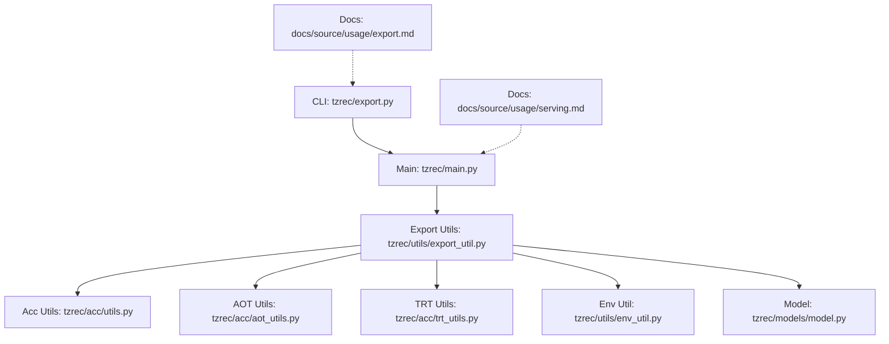
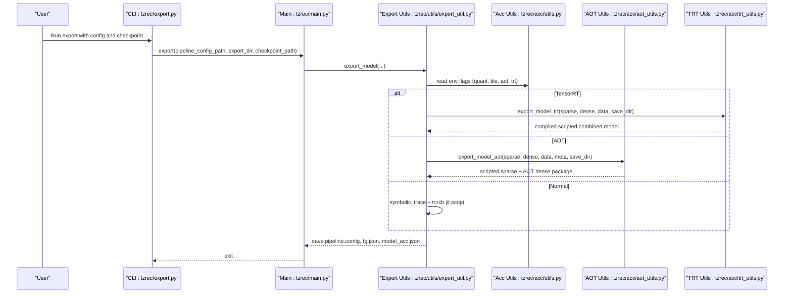
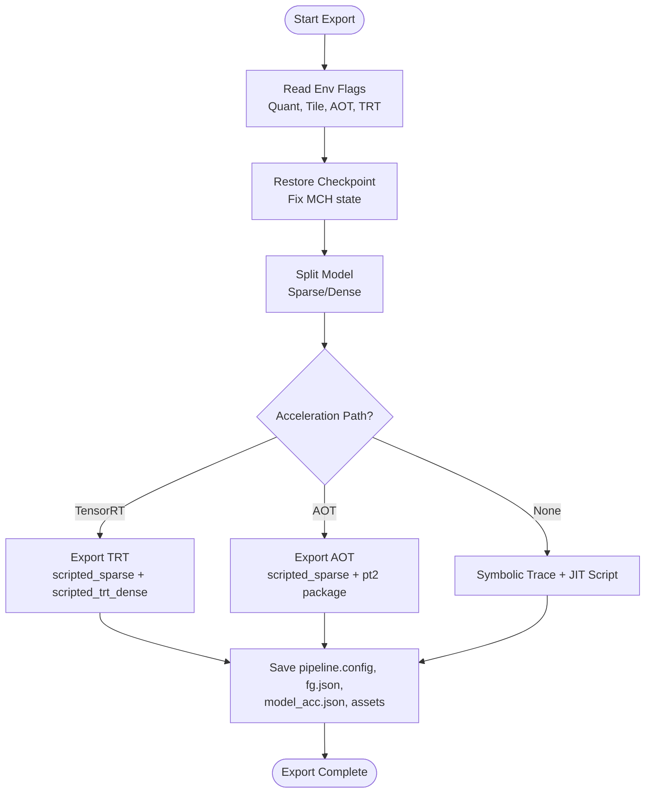
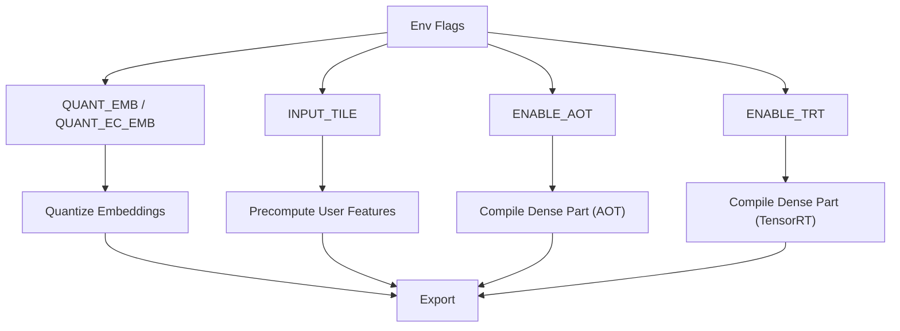
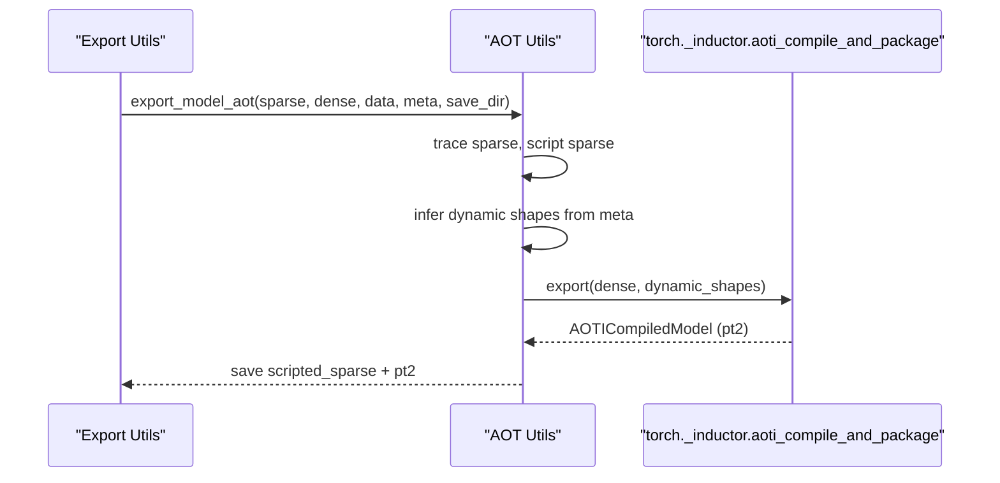
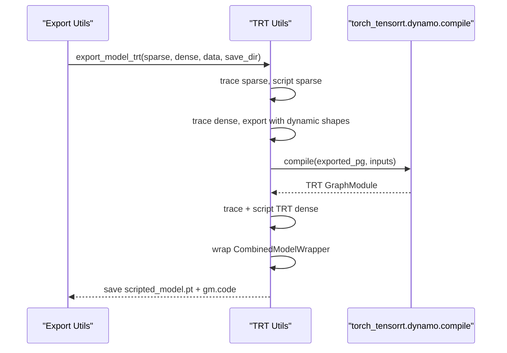
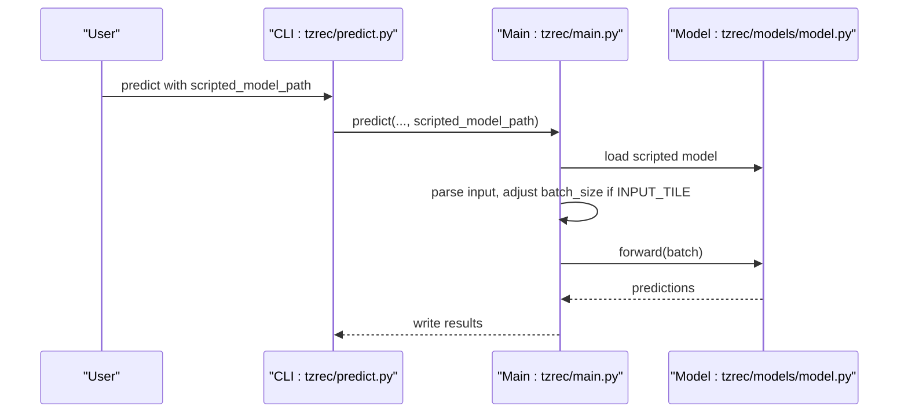
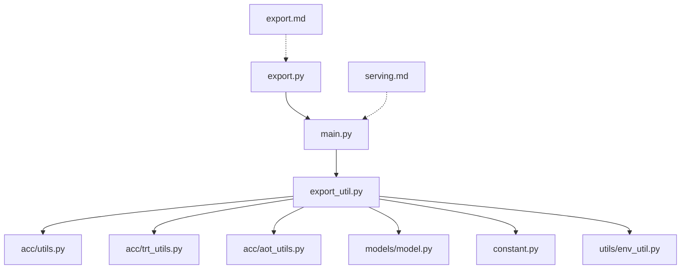

# Export and Deployment Pipeline

<cite>
**Referenced Files in This Document**
- [export.py](file://tzrec/export.py)
- [main.py](file://tzrec/main.py)
- [export_util.py](file://tzrec/utils/export_util.py)
- [aot_utils.py](file://tzrec/acc/aot_utils.py)
- [trt_utils.py](file://tzrec/acc/trt_utils.py)
- [env_util.py](file://tzrec/utils/env_util.py)
- [utils.py](file://tzrec/acc/utils.py)
- [export.md](file://docs/source/usage/export.md)
- [serving.md](file://docs/source/usage/serving.md)
- [model.py](file://tzrec/models/model.py)
- [constant.py](file://tzrec/constant.py)
- [predict.py](file://tzrec/predict.py)
</cite>

## Table of Contents

1. [Introduction](#introduction)
1. [Project Structure](#project-structure)
1. [Core Components](#core-components)
1. [Architecture Overview](#architecture-overview)
1. [Detailed Component Analysis](#detailed-component-analysis)
1. [Dependency Analysis](#dependency-analysis)
1. [Performance Considerations](#performance-considerations)
1. [Troubleshooting Guide](#troubleshooting-guide)
1. [Conclusion](#conclusion)
1. [Appendices](#appendices)

## Introduction

This document explains TorchEasyRec’s export and deployment pipeline. It covers model export, TorchScript compilation, TensorRT integration, and production deployment strategies. It also documents acceleration utilities (Ahead-of-Time compilation and TensorRT optimizations), model serialization formats, deployment automation, and operational guidance for cloud and on-premises environments.

## Project Structure

The export and deployment pipeline spans CLI entry points, export utilities, acceleration helpers, and serving documentation. The following diagram maps the primary components involved in exporting and deploying models.

**Diagram sources**

- \[export.py\](file://tzrec/export.py#L16-L50)
- \[main.py\](file://tzrec/main.py#L86-L86)
- \[export_util.py\](file://tzrec/utils/export_util.py#L75-L106)
- \[aot_utils.py\](file://tzrec/acc/aot_utils.py#L46-L107)
- \[trt_utils.py\](file://tzrec/acc/trt_utils.py#L102-L217)
- \[env_util.py\](file://tzrec/utils/env_util.py#L24-L32)
- \[model.py\](file://tzrec/models/model.py#L39-L83)
- \[export.md\](file://docs/source/usage/export.md#L18-L26)
- \[serving.md\](file://docs/source/usage/serving.md#L1-L55)

**Section sources**

- \[export.py\](file://tzrec/export.py#L16-L50)
- \[export.md\](file://docs/source/usage/export.md#L18-L26)

## Core Components

- Export entry point: command-line interface that invokes the export routine with pipeline configuration, checkpoint path, and export directory.
- Export utilities: orchestrate model export, including quantization, splitting sparse/dense parts, tracing, scripting, and saving artifacts.
- Acceleration utilities: environment-driven toggles for quantization, input tiling, AOT, and TensorRT; helpers to serialize acceleration configurations.
- Serving documentation: describes deployment to Alibaba Cloud EAS with TorchEasyRec Processor, including service parameters and invocation.

Key responsibilities:

- Export: restore checkpoint, prepare model for inference, optionally quantize embeddings, trace/export dense part, JIT-script sparse part, and persist pipeline config, feature graph JSON, and acceleration metadata.
- Acceleration: select and configure AOT/TensorRT paths during export; load compiled artifacts at runtime.
- Serving: deploy exported models to EAS and invoke via PAI-REC engine or Processor SDK.

**Section sources**

- \[export.py\](file://tzrec/export.py#L16-L50)
- \[export_util.py\](file://tzrec/utils/export_util.py#L75-L238)
- \[aot_utils.py\](file://tzrec/acc/aot_utils.py#L46-L107)
- \[trt_utils.py\](file://tzrec/acc/trt_utils.py#L102-L217)
- \[utils.py\](file://tzrec/acc/utils.py#L51-L85)
- \[serving.md\](file://docs/source/usage/serving.md#L1-L55)

## Architecture Overview

The export pipeline integrates configuration parsing, model restoration, feature generation, and optional acceleration. The serving pipeline loads exported artifacts and routes requests through the Processor.

**Diagram sources**

- \[export.py\](file://tzrec/export.py#L16-L50)
- \[main.py\](file://tzrec/main.py#L86-L86)
- \[export_util.py\](file://tzrec/utils/export_util.py#L75-L238)
- \[aot_utils.py\](file://tzrec/acc/aot_utils.py#L46-L107)
- \[trt_utils.py\](file://tzrec/acc/trt_utils.py#L102-L217)
- \[utils.py\](file://tzrec/acc/utils.py#L51-L85)

## Detailed Component Analysis

### Export Utilities

The export utilities coordinate the end-to-end export process:

- Environment-aware selection between normal export and RTP export.
- Quantization of embeddings for both sparse and dense embedding collections.
- Splitting the model into sparse and dense parts, tracing/exporting, and saving artifacts.
- Saving pipeline configuration, feature graph JSON, and acceleration metadata.

**Diagram sources**

- \[export_util.py\](file://tzrec/utils/export_util.py#L108-L238)
- \[trt_utils.py\](file://tzrec/acc/trt_utils.py#L102-L217)
- \[aot_utils.py\](file://tzrec/acc/aot_utils.py#L46-L107)

**Section sources**

- \[export_util.py\](file://tzrec/utils/export_util.py#L75-L238)

### Acceleration Utilities

Environment flags control acceleration features:

- Quantization: embedding quantization for both sparse and dense embedding collections.
- Input tiling: reduces request size and computation by precomputing user-side features.
- AOT: Ahead-of-Time compilation for the dense part.
- TensorRT: GPU-accelerated runtime for the dense part.

**Diagram sources**

- \[utils.py\](file://tzrec/acc/utils.py#L22-L154)
- \[env_util.py\](file://tzrec/utils/env_util.py#L24-L32)

**Section sources**

- \[utils.py\](file://tzrec/acc/utils.py#L51-L154)
- \[env_util.py\](file://tzrec/utils/env_util.py#L24-L32)

### AOT Compilation

AOT compiles the dense part into a portable package for fast runtime execution. The process includes dynamic shape specification and packaging.

**Diagram sources**

- \[aot_utils.py\](file://tzrec/acc/aot_utils.py#L46-L107)

**Section sources**

- \[aot_utils.py\](file://tzrec/acc/aot_utils.py#L46-L107)

### TensorRT Integration

TensorRT converts the dense part into a GPU-accelerated runtime graph. The process traces the dense model, exports it with dynamic shapes, compiles with TensorRT, and saves a combined scripted model.

**Diagram sources**

- \[trt_utils.py\](file://tzrec/acc/trt_utils.py#L102-L217)

**Section sources**

- \[trt_utils.py\](file://tzrec/acc/trt_utils.py#L102-L217)

### Model Loading and Prediction

At runtime, exported models are loaded and executed. The prediction pipeline supports scripted models and handles input tiling adjustments.

**Diagram sources**

- \[predict.py\](file://tzrec/predict.py#L16-L144)
- \[main.py\](file://tzrec/main.py#L994-L1157)
- \[model.py\](file://tzrec/models/model.py#L39-L83)

**Section sources**

- \[predict.py\](file://tzrec/predict.py#L16-L144)
- \[main.py\](file://tzrec/main.py#L994-L1157)
- \[model.py\](file://tzrec/models/model.py#L39-L83)

## Dependency Analysis

The export pipeline depends on environment flags, model utilities, and acceleration libraries. The following diagram highlights key dependencies.

**Diagram sources**

- \[export_util.py\](file://tzrec/utils/export_util.py#L46-L72)
- \[aot_utils.py\](file://tzrec/acc/aot_utils.py#L19-L43)
- \[trt_utils.py\](file://tzrec/acc/trt_utils.py#L20-L23)
- \[env_util.py\](file://tzrec/utils/env_util.py#L24-L32)
- \[constant.py\](file://tzrec/constant.py#L16-L41)
- \[export.py\](file://tzrec/export.py#L16-L50)
- \[main.py\](file://tzrec/main.py#L86-L86)
- \[export.md\](file://docs/source/usage/export.md#L18-L26)
- \[serving.md\](file://docs/source/usage/serving.md#L1-L55)

**Section sources**

- \[export_util.py\](file://tzrec/utils/export_util.py#L46-L72)
- \[aot_utils.py\](file://tzrec/acc/aot_utils.py#L19-L43)
- \[trt_utils.py\](file://tzrec/acc/trt_utils.py#L20-L23)
- \[env_util.py\](file://tzrec/utils/env_util.py#L24-L32)
- \[constant.py\](file://tzrec/constant.py#L16-L41)
- \[export.py\](file://tzrec/export.py#L16-L50)
- \[main.py\](file://tzrec/main.py#L86-L86)
- \[export.md\](file://docs/source/usage/export.md#L18-L26)
- \[serving.md\](file://docs/source/usage/serving.md#L1-L55)

## Performance Considerations

- Quantization: Enable embedding quantization to reduce memory footprint and improve throughput. Supports FP32/FP16/INT8/INT4/INT2.
- Input tiling: Precompute user-side features to reduce request size and network transfer time.
- Dynamic shapes: Configure maximum batch size and sequence lengths for TensorRT/AOT to avoid recompilation overhead.
- Device placement: Prefer CUDA export when using AOT/TensorRT to leverage GPU acceleration.
- Memory optimization: Limit export batch size to prevent out-of-memory errors during compilation.

[No sources needed since this section provides general guidance]

## Troubleshooting Guide

Common issues and resolutions:

- Export fails with missing checkpoint path: ensure a valid checkpoint is provided.
- World size not supported: export currently requires single-process execution; the export utility sets WORLD_SIZE to 1.
- TensorRT not available: ensure the runtime has torch_tensorrt installed; otherwise, fallback to AOT or normal export.
- Quantization dtype invalid: confirm the quantization dtype is one of the supported types.
- RTP feature conflicts: embedding or feature names must be unique across modules when using RTP export.

**Section sources**

- \[export_util.py\](file://tzrec/utils/export_util.py#L117-L127)
- \[trt_utils.py\](file://tzrec/acc/trt_utils.py#L25-L32)
- \[utils.py\](file://tzrec/acc/utils.py#L129-L153)
- \[export_util.py\](file://tzrec/utils/export_util.py#L286-L301)

## Conclusion

TorchEasyRec’s export and deployment pipeline provides robust mechanisms for converting trained models into production-ready artifacts. By leveraging quantization, input tiling, AOT, and TensorRT, the system achieves significant performance gains. The documented commands and environment flags enable reproducible exports and seamless deployment to Alibaba Cloud EAS via TorchEasyRec Processor.

[No sources needed since this section summarizes without analyzing specific files]

## Appendices

### Practical Examples

- Export a trained model:
  - Use the export CLI with pipeline configuration and checkpoint path, specifying the export directory.
  - Reference: \[export.md\](file://docs/source/usage/export.md#L18-L26)
- Optimize for inference:
  - Enable quantization and input tiling via environment variables.
  - Choose AOT or TensorRT by setting the respective flags.
  - Reference: \[export.md\](file://docs/source/usage/export.md#L32-L46)
- Deploy to Alibaba Cloud EAS:
  - Prepare a service configuration JSON and use eascmd to create/modify the service.
  - Reference: \[serving.md\](file://docs/source/usage/serving.md#L5-L55)

### Model Versioning, A/B Testing, Rollback, and Monitoring

- Versioning: Tag exported artifacts with semantic versioning and maintain separate directories per version.
- A/B Testing: Deploy multiple model variants behind a routing layer and gradually shift traffic.
- Rollback: Keep previous model versions and switch routing to the prior version if performance degrades.
- Monitoring: Track latency, throughput, and error rates; integrate with cloud monitoring dashboards.

[No sources needed since this section provides general guidance]

### Scaling Recommendation

- Horizontal scaling: Increase instance count and worker threads in the EAS service configuration.
- Vertical scaling: Use larger GPU instances for higher concurrency.
- Caching: Leverage FeatureStore and Processor caching to reduce latency.

[No sources needed since this section provides general guidance]
