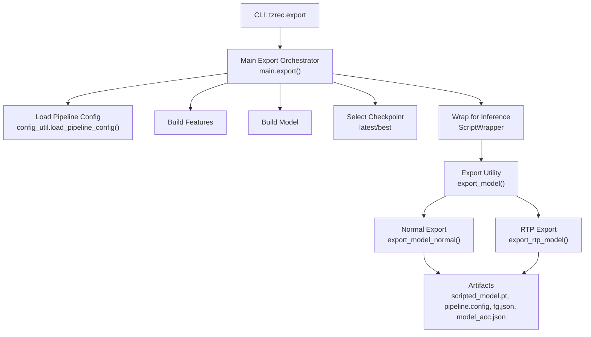
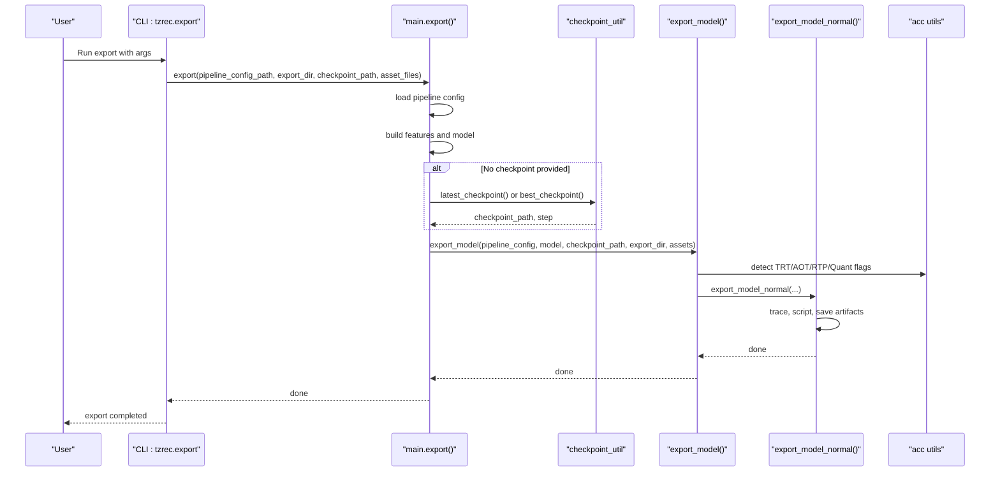
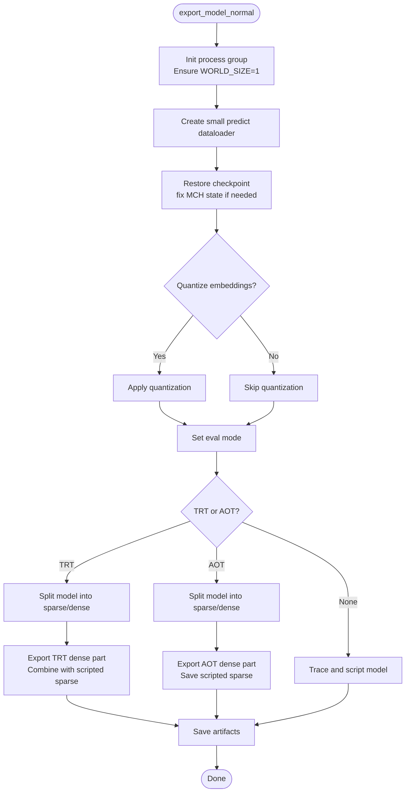
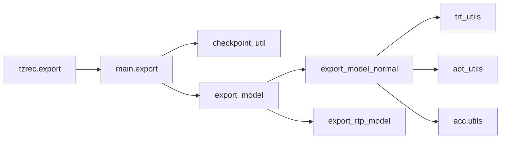

# Model Export Process

<cite>
**Referenced Files in This Document**
- [export.py](file://tzrec/export.py)
- [main.py](file://tzrec/main.py)
- [export_util.py](file://tzrec/utils/export_util.py)
- [checkpoint_util.py](file://tzrec/utils/checkpoint_util.py)
- [export.proto](file://tzrec/protos/export.proto)
- [export.md](file://docs/source/usage/export.md)
- [aot_utils.py](file://tzrec/acc/aot_utils.py)
- [trt_utils.py](file://tzrec/acc/trt_utils.py)
- [utils.py](file://tzrec/acc/utils.py)
- [match_integration_test.py](file://tzrec/tests/match_integration_test.py)
- [rank_integration_test.py](file://tzrec/tests/rank_integration_test.py)
- [deepfm_criteo.config](file://examples/deepfm_criteo.config)
- [mmoe_taobao.config](file://examples/mmoe_taobao.config)
</cite>

## Table of Contents

1. [Introduction](#introduction)
1. [Project Structure](#project-structure)
1. [Core Components](#core-components)
1. [Architecture Overview](#architecture-overview)
1. [Detailed Component Analysis](#detailed-component-analysis)
1. [Dependency Analysis](#dependency-analysis)
1. [Performance Considerations](#performance-considerations)
1. [Troubleshooting Guide](#troubleshooting-guide)
1. [Conclusion](#conclusion)
1. [Appendices](#appendices)

## Introduction

This document explains the model export process in TorchEasyRec. It covers the export pipeline architecture, command-line interface, configuration requirements, and the end-to-end workflow from loading a trained model to generating production-ready artifacts. It also documents export arguments, validation, format compatibility, and integration with cloud storage and deployment workflows.

## Project Structure

The export capability is implemented as a CLI entry point that delegates to the main export routine, which orchestrates model creation, checkpoint selection, tracing, scripting, and artifact generation. Supporting utilities handle quantization, TensorRT/AOT acceleration, and distributed export scenarios.

**Diagram sources**

- \[export.py\](file://tzrec/export.py#L16-L50)
- \[main.py\](file://tzrec/main.py#L857-L936)
- \[export_util.py\](file://tzrec/utils/export_util.py#L75-L106)

**Section sources**

- \[export.py\](file://tzrec/export.py#L16-L50)
- \[main.py\](file://tzrec/main.py#L857-L936)

## Core Components

- Command-line entry point: parses export arguments and invokes the main export routine.
- Main export orchestrator: loads pipeline config, builds model and features, selects checkpoint, wraps model for inference, and dispatches export.
- Export utilities: normal export (JIT scripting), TRT export, AOT export, and RTP export; handles quantization and feature graph JSON generation.
- Checkpoint utilities: resolves latest or best checkpoint based on training evaluation logs and export configuration.
- Protobuf export configuration: defines exporter type and metric selection for best export.

**Section sources**

- \[export.py\](file://tzrec/export.py#L16-L50)
- \[main.py\](file://tzrec/main.py#L857-L936)
- \[export_util.py\](file://tzrec/utils/export_util.py#L75-L106)
- \[checkpoint_util.py\](file://tzrec/utils/checkpoint_util.py#L147-L219)
- \[export.proto\](file://tzrec/protos/export.proto#L4-L13)

## Architecture Overview

The export pipeline follows a deterministic flow:

- Parse CLI arguments and load the pipeline configuration.
- Build features and model from the pipeline.
- Select checkpoint (latest or best) based on export configuration and evaluation logs.
- Wrap model for inference and export.
- Export artifacts depending on environment flags and model type.

**Diagram sources**

- \[export.py\](file://tzrec/export.py#L16-L50)
- \[main.py\](file://tzrec/main.py#L857-L936)
- \[checkpoint_util.py\](file://tzrec/utils/checkpoint_util.py#L147-L219)
- \[export_util.py\](file://tzrec/utils/export_util.py#L75-L106)

## Detailed Component Analysis

### Command-Line Interface

- Arguments:
  - pipeline_config_path: Path to the pipeline config file.
  - checkpoint_path: Optional; if omitted, selects latest or best checkpoint based on export_config.
  - export_dir: Directory where exported artifacts are written.
  - asset_files: Comma-separated list of additional files to copy into export_dir.
- Execution: The CLI parses arguments and calls the main export routine.

**Section sources**

- \[export.py\](file://tzrec/export.py#L16-L50)

### Main Export Orchestrator

- Loads pipeline config and validates export_dir does not exist.
- Builds features and model from the pipeline.
- Selects checkpoint:
  - Uses latest_checkpoint if no export_config or exporter_type is not best.
  - Uses best_checkpoint if exporter_type is best and evaluation logs are present.
- Wraps model with an inference-friendly wrapper and dispatches export_model.

**Section sources**

- \[main.py\](file://tzrec/main.py#L857-L936)
- \[checkpoint_util.py\](file://tzrec/utils/checkpoint_util.py#L147-L219)

### Export Utilities

- export_model:
  - Detects whether to use normal export or RTP export based on environment.
  - Handles remote filesystem uploads via local cache when saving to remote paths.
- export_model_normal:
  - Ensures single-process export and initializes a minimal process group.
  - Creates a small prediction dataloader to warm up tracing.
  - Restores checkpoint and optionally quantizes embeddings.
  - Traces and scripts the model, saves scripted_model.pt.
  - Generates feature graph JSON and pipeline config, and copies assets.
- export_rtp_model:
  - Specialized export for RTP environments with distributed sharding and graph splitting.
  - Saves sparse and dense parts separately and metadata for embeddings.
- split_model:
  - Splits a model into sparse and dense parts for TRT/AOT export.
- TRT/AOT helpers:
  - export_model_trt: exports TRT-optimized dense part and combines with scripted sparse part.
  - export_model_aot: exports AOT-compiled dense part and scripted sparse part.

**Diagram sources**

- \[export_util.py\](file://tzrec/utils/export_util.py#L108-L238)
- \[aot_utils.py\](file://tzrec/acc/aot_utils.py#L46-L107)
- \[trt_utils.py\](file://tzrec/acc/trt_utils.py#L102-L218)

**Section sources**

- \[export_util.py\](file://tzrec/utils/export_util.py#L75-L106)
- \[export_util.py\](file://tzrec/utils/export_util.py#L108-L238)
- \[export_util.py\](file://tzrec/utils/export_util.py#L596-L934)
- \[export_util.py\](file://tzrec/utils/export_util.py#L935-L1070)
- \[aot_utils.py\](file://tzrec/acc/aot_utils.py#L46-L107)
- \[trt_utils.py\](file://tzrec/acc/trt_utils.py#L102-L218)

### Checkpoint Selection

- latest_checkpoint: Finds the most recent checkpoint directory or returns the provided directory if it is already a checkpoint.
- best_checkpoint: Reads evaluation logs to select the best checkpoint based on export_config, supporting configurable metric and direction.

**Section sources**

- \[checkpoint_util.py\](file://tzrec/utils/checkpoint_util.py#L147-L174)
- \[checkpoint_util.py\](file://tzrec/utils/checkpoint_util.py#L176-L219)

### Export Configuration

- ExportConfig supports:
  - exporter_type: latest or best.
  - best_exporter_metric: metric name used to pick best checkpoint.
  - metric_larger_is_better: whether higher is better for the chosen metric.

**Section sources**

- \[export.proto\](file://tzrec/protos/export.proto#L4-L13)

### Practical Examples

- Basic export command:
  - Use torchrun to launch the export module with pipeline_config_path and export_dir.
- Example configurations:
  - DeepFM on Criteo: demonstrates typical feature and model configuration.
  - MMOE on Taobao: demonstrates multi-task configuration and feature expressions.

Note: Replace placeholders with actual paths and adjust environment variables as needed.

**Section sources**

- \[export.md\](file://docs/source/usage/export.md#L18-L26)
- \[deepfm_criteo.config\](file://examples/deepfm_criteo.config#L1-L397)
- \[mmoe_taobao.config\](file://examples/mmoe_taobao.config#L1-L216)

### Export Artifacts and Validation

- Typical artifacts:
  - scripted_model.pt: JIT-scripted model.
  - pipeline.config: Updated pipeline configuration with feature configs embedded.
  - fg.json: Feature graph JSON.
  - model_acc.json: Acceleration configuration used during export.
  - Additional assets: Copied from asset_files argument.
- Validation:
  - Tests verify presence of scripted_model.pt, FAISS index, id_mapping, and fg.json for matching models.
  - Integration tests demonstrate export followed by predict workflows.

**Section sources**

- \[export_util.py\](file://tzrec/utils/export_util.py#L214-L238)
- \[match_integration_test.py\](file://tzrec/tests/match_integration_test.py#L140-L168)
- \[rank_integration_test.py\](file://tzrec/tests/rank_integration_test.py#L547-L569)

### Environment Flags and Formats

- Quantization:
  - QUANT_EMB: Enable quantization for non-sequence embeddings (INT8 default).
  - QUANT_EC_EMB: Enable quantization for sequence embeddings (disabled by default).
- Acceleration:
  - ENABLE_TRT: Export TRT-optimized model.
  - ENABLE_AOT: Export AOT-compiled model.
- Other:
  - INPUT_TILE: Enables input tiling optimizations for feature generation.
  - LOCAL_CACHE_DIR: Used for remote filesystem uploads during export.
  - MAX_EXPORT_BATCH_SIZE/TRT_MAX_BATCH_SIZE: Controls maximum batch sizes for export.

**Section sources**

- \[export.md\](file://docs/source/usage/export.md#L32-L46)
- \[utils.py\](file://tzrec/acc/utils.py#L190-L218)

## Dependency Analysis

- CLI depends on main.export.
- main.export depends on config loading, feature/model creation, checkpoint utilities, and export utilities.
- export_model dispatches to normal or RTP export based on environment detection.
- Normal export depends on TRT/AOT helpers when enabled.

**Diagram sources**

- \[export.py\](file://tzrec/export.py#L16-L50)
- \[main.py\](file://tzrec/main.py#L857-L936)
- \[export_util.py\](file://tzrec/utils/export_util.py#L75-L106)
- \[trt_utils.py\](file://tzrec/acc/trt_utils.py#L102-L218)
- \[aot_utils.py\](file://tzrec/acc/aot_utils.py#L46-L107)
- \[utils.py\](file://tzrec/acc/utils.py#L190-L218)

**Section sources**

- \[export.py\](file://tzrec/export.py#L16-L50)
- \[main.py\](file://tzrec/main.py#L857-L936)
- \[export_util.py\](file://tzrec/utils/export_util.py#L75-L106)

## Performance Considerations

- Batch size limits during export:
  - Export enforces a maximum batch size to avoid out-of-memory errors during compilation.
- Quantization:
  - INT8 quantization can reduce model size and improve throughput with minimal accuracy loss.
- Acceleration backends:
  - TRT and AOT exports require GPU and enable backend-specific optimizations.

[No sources needed since this section provides general guidance]

## Troubleshooting Guide

- Export directory exists:
  - The export routine raises an error if export_dir already exists; choose a new directory.
- Checkpoint selection:
  - If exporter_type is best but evaluation logs are missing, falls back to latest checkpoint.
  - Ensure best_exporter_metric exists in evaluation logs.
- Remote filesystem:
  - When exporting to remote paths, ensure LOCAL_CACHE_DIR is set; artifacts are uploaded after local export.
- TRT/AOT constraints:
  - Certain operations and sequence lengths may require specific batch sizes; consult logs for constraints.
- Assets not copied:
  - Verify asset_files argument is a comma-separated list of existing files.

**Section sources**

- \[main.py\](file://tzrec/main.py#L860-L862)
- \[checkpoint_util.py\](file://tzrec/utils/checkpoint_util.py#L192-L219)
- \[export_util.py\](file://tzrec/utils/export_util.py#L86-L106)
- \[export_util.py\](file://tzrec/utils/export_util.py#L192-L219)

## Conclusion

TorchEasyRec’s export pipeline provides a robust, configurable mechanism to transform trained models into production-ready artifacts. It supports multiple export modes (normal, TRT, AOT, RTP), automatic checkpoint selection, quantization, and seamless integration with cloud storage. By following the documented arguments, configuration, and environment flags, teams can reliably export models and integrate them into deployment workflows.

[No sources needed since this section summarizes without analyzing specific files]

## Appendices

### Export Arguments Reference

- pipeline_config_path: Path to the pipeline configuration file.
- checkpoint_path: Optional; overrides automatic checkpoint selection.
- export_dir: Output directory for exported artifacts.
- asset_files: Comma-separated list of additional files to copy into export_dir.

**Section sources**

- \[export.py\](file://tzrec/export.py#L18-L42)

### Export Workflow Summary

- Load pipeline config.
- Build features and model.
- Select checkpoint (latest or best).
- Wrap model for inference.
- Export artifacts (scripted model, pipeline config, feature graph, acceleration config, assets).

**Section sources**

- \[main.py\](file://tzrec/main.py#L857-L936)
- \[export_util.py\](file://tzrec/utils/export_util.py#L214-L238)
