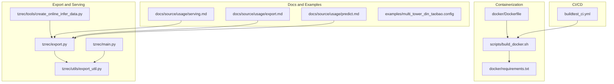
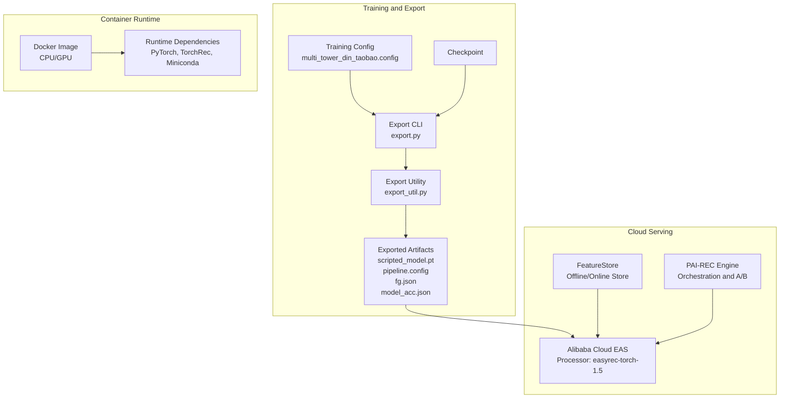
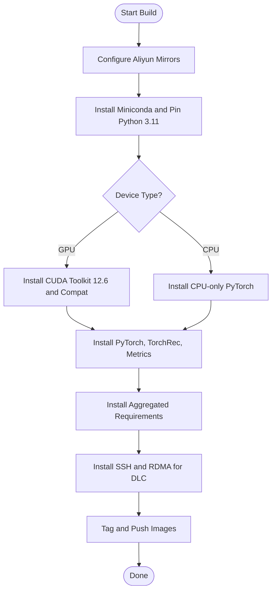
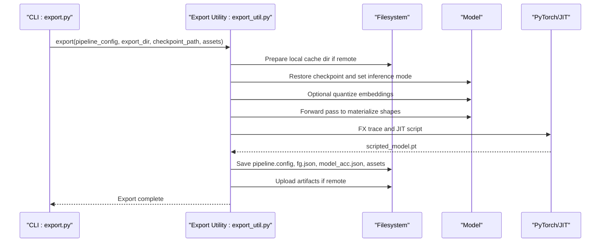
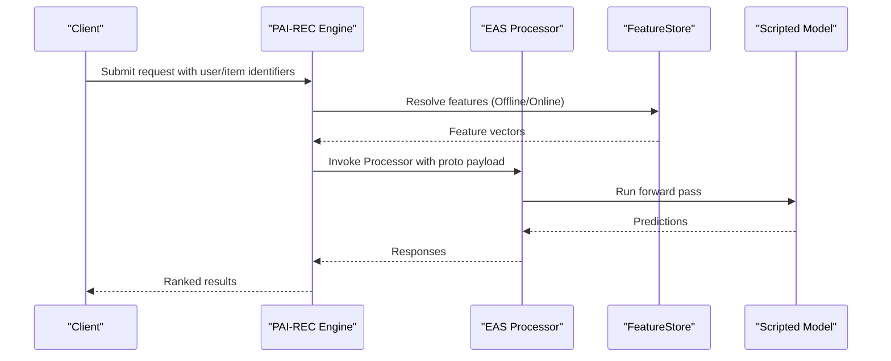
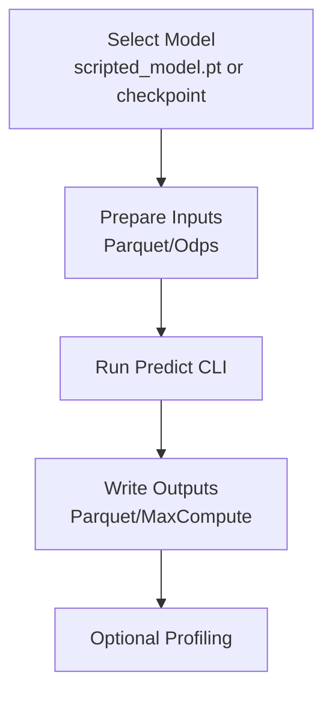
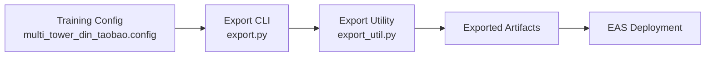

# Production Deployment Strategies

<cite>
**Referenced Files in This Document**
- [README.md](file://README.md)
- [Dockerfile](file://docker/Dockerfile)
- [build_docker.sh](file://scripts/build_docker.sh)
- [requirements.txt](file://docker/requirements.txt)
- [export.py](file://tzrec/export.py)
- [export_util.py](file://tzrec/utils/export_util.py)
- [main.py](file://tzrec/main.py)
- [serving.md](file://docs/source/usage/serving.md)
- [export.md](file://docs/source/usage/export.md)
- [predict.md](file://docs/source/usage/predict.md)
- [multi_tower_din_taobao.config](file://examples/multi_tower_din_taobao.config)
- [buildtest_ci.yml](file://.github/workflows/buildtest_ci.yml)
- [create_online_infer_data.py](file://tzrec/tools/create_online_infer_data.py)
</cite>

## Table of Contents

1. [Introduction](#introduction)
1. [Project Structure](#project-structure)
1. [Core Components](#core-components)
1. [Architecture Overview](#architecture-overview)
1. [Detailed Component Analysis](#detailed-component-analysis)
1. [Dependency Analysis](#dependency-analysis)
1. [Performance Considerations](#performance-considerations)
1. [Troubleshooting Guide](#troubleshooting-guide)
1. [Conclusion](#conclusion)
1. [Appendices](#appendices)

## Introduction

This document provides production deployment strategies for TorchEasyRec, focusing on containerization, cloud service integrations, and model serving. It explains how to export trained models and deploy them to Alibaba Cloud EAS (Elastic Algorithm Service) and other production environments. It also covers model serving patterns, API endpoints, request-response handling, model versioning, A/B testing, rollback strategies, monitoring, scalability, load balancing, performance optimization, infrastructure integration, CI/CD pipelines, and automated deployment workflows. Guidance is grounded in repository-provided files and documented behaviors.

## Project Structure

The repository organizes deployment-related capabilities across:

- Containerization: Dockerfile and scripts for building GPU/CPU images
- Export and Serving: CLI entry points and utilities for exporting models and preparing them for inference
- Documentation: Usage guides for export, serving, and prediction
- Examples: Training configuration templates for typical scenarios
- CI/CD: Workflow to build and test containers

**Diagram sources**

- \[Dockerfile\](file://docker/Dockerfile#L1-L98)
- \[build_docker.sh\](file://scripts/build_docker.sh#L1-L23)
- \[requirements.txt\](file://docker/requirements.txt#L1-L4)
- \[export.py\](file://tzrec/export.py#L1-L51)
- \[export_util.py\](file://tzrec/utils/export_util.py#L75-L239)
- \[main.py\](file://tzrec/main.py#L1123-L1157)
- \[create_online_infer_data.py\](file://tzrec/tools/create_online_infer_data.py#L48-L90)
- \[serving.md\](file://docs/source/usage/serving.md#L1-L97)
- \[export.md\](file://docs/source/usage/export.md#L1-L46)
- \[predict.md\](file://docs/source/usage/predict.md#L1-L66)
- \[multi_tower_din_taobao.config\](file://examples/multi_tower_din_taobao.config#L1-L200)
- \[buildtest_ci.yml\](file://.github/workflows/buildtest_ci.yml#L1-L28)

**Section sources**

- \[Dockerfile\](file://docker/Dockerfile#L1-L98)
- \[build_docker.sh\](file://scripts/build_docker.sh#L1-L23)
- \[requirements.txt\](file://docker/requirements.txt#L1-L4)
- \[export.py\](file://tzrec/export.py#L1-L51)
- \[export_util.py\](file://tzrec/utils/export_util.py#L75-L239)
- \[main.py\](file://tzrec/main.py#L1123-L1157)
- \[serving.md\](file://docs/source/usage/serving.md#L1-L97)
- \[export.md\](file://docs/source/usage/export.md#L1-L46)
- \[predict.md\](file://docs/source/usage/predict.md#L1-L66)
- \[multi_tower_din_taobao.config\](file://examples/multi_tower_din_taobao.config#L1-L200)
- \[buildtest_ci.yml\](file://.github/workflows/buildtest_ci.yml#L1-L28)

## Core Components

- Containerization and base images:
  - Dockerfile defines Ubuntu-based images with Miniconda, PyTorch, TorchRec, and GPU toolkit installation for CUDA variants. It also installs SSH and RDMA dependencies for DLC environments.
  - build_docker.sh builds and pushes CPU and GPU images, tagging latest and versioned tags.
  - requirements.txt aggregates runtime, test, and docs dependencies into the image.
- Export pipeline:
  - export.py is the CLI entry for exporting models, delegating to the export utility.
  - export_util.py implements export_model and export_model_normal, handling scripted model export, quantization, feature graph JSON generation, and saving pipeline.config and assets.
- Serving and prediction:
  - serving.md documents EAS deployment parameters, storage mounts, and processor configuration.
  - predict.md describes offline prediction via exported scripted models and checkpoints.
  - create_online_infer_data.py helps generate online inference test data and run a small-scale predict loop for debugging.

**Section sources**

- \[Dockerfile\](file://docker/Dockerfile#L1-L98)
- \[build_docker.sh\](file://scripts/build_docker.sh#L1-L23)
- \[requirements.txt\](file://docker/requirements.txt#L1-L4)
- \[export.py\](file://tzrec/export.py#L1-L51)
- \[export_util.py\](file://tzrec/utils/export_util.py#L75-L239)
- \[serving.md\](file://docs/source/usage/serving.md#L1-L97)
- \[predict.md\](file://docs/source/usage/predict.md#L1-L66)
- \[create_online_infer_data.py\](file://tzrec/tools/create_online_infer_data.py#L48-L90)

## Architecture Overview

The production deployment architecture centers on exporting a trained model to a portable format and serving it through Alibaba Cloud EAS with optional FeatureStore integration and PAI-REC orchestration.

**Diagram sources**

- \[multi_tower_din_taobao.config\](file://examples/multi_tower_din_taobao.config#L1-L200)
- \[export.py\](file://tzrec/export.py#L1-L51)
- \[export_util.py\](file://tzrec/utils/export_util.py#L75-L239)
- \[Dockerfile\](file://docker/Dockerfile#L1-L98)
- \[serving.md\](file://docs/source/usage/serving.md#L1-L97)

## Detailed Component Analysis

### Containerization and Images

- Purpose:
  - Provide reproducible environments for training, export, and serving.
  - Support both CPU and GPU (CUDA 12.6) variants.
- Key behaviors:
  - Base OS mirrors and package sources are redirected to Aliyun mirrors.
  - Miniconda is installed and configured; Python pinned to 3.11.
  - PyTorch and TorchRec versions are pinned; optional TensorRT and CUDA toolkit for GPU builds.
  - RDMA and SSH dependencies are installed for DLC compatibility.
  - Requirements are installed from aggregated requirements files.
- CI/CD integration:
  - The CI workflow pulls the development image and builds wheels for testing.

**Diagram sources**

- \[Dockerfile\](file://docker/Dockerfile#L1-L98)
- \[build_docker.sh\](file://scripts/build_docker.sh#L1-L23)
- \[requirements.txt\](file://docker/requirements.txt#L1-L4)
- \[buildtest_ci.yml\](file://.github/workflows/buildtest_ci.yml#L1-L28)

**Section sources**

- \[Dockerfile\](file://docker/Dockerfile#L1-L98)
- \[build_docker.sh\](file://scripts/build_docker.sh#L1-L23)
- \[requirements.txt\](file://docker/requirements.txt#L1-L4)
- \[buildtest_ci.yml\](file://.github/workflows/buildtest_ci.yml#L1-L28)

### Model Export Pipeline

- CLI entry:
  - export.py parses pipeline config, checkpoint path, and export directory, then invokes the export utility.
- Export utility:
  - export_model delegates to export_model_normal for standard export.
  - export_model_normal:
    - Ensures single-process export and restores model parameters from checkpoint.
    - Optionally quantizes embeddings (INT8/FP32/FP16/INT4/INT2) and sequences.
    - Generates scripted model via FX tracing and JIT scripting.
    - Saves feature graph JSON, pipeline.config, and auxiliary assets.
    - Supports AOT and TensorRT export paths when enabled.
- Environment variables:
  - QUANT_EMB, QUANT_EC_EMB, INPUT_TILE, ENABLE_AOT influence export behavior.

**Diagram sources**

- \[export.py\](file://tzrec/export.py#L1-L51)
- \[export_util.py\](file://tzrec/utils/export_util.py#L75-L239)

**Section sources**

- \[export.py\](file://tzrec/export.py#L1-L51)
- \[export_util.py\](file://tzrec/utils/export_util.py#L75-L239)
- \[export.md\](file://docs/source/usage/export.md#L1-L46)

### EAS Deployment and Serving

- Deployment parameters:
  - Metadata includes CPU/memory/instance counts and RPC tuning (worker threads, queue size, jemalloc).
  - Storage mounts OSS path containing exported model artifacts.
  - Processor type set to easyrec-torch-1.5.
  - FeatureStore integration via fs_project, fs_model, fs_entity, region, and credentials.
  - Optional feature auto-expand via INPUT_TILE and NO_GRAD_GUARD toggles.
- Calling patterns:
  - Direct Processor invocation via proto-defined requests.
  - Recommended: integrate with PAI-REC engine for simplified request construction, consistency checks, and A/B experimentation.

**Diagram sources**

- \[serving.md\](file://docs/source/usage/serving.md#L1-L97)

**Section sources**

- \[serving.md\](file://docs/source/usage/serving.md#L1-L97)

### Offline Prediction and Debugging

- Offline prediction:
  - Predict against exported scripted models or checkpoints using the predict CLI.
  - Supports dataset writers, reserved columns, profiling, and MaxCompute outputs.
- Debugging:
  - create_online_infer_data.py generates synthetic inference data from pipeline.config and runs a small predict loop to inspect feature generation outputs and results.

**Diagram sources**

- \[predict.md\](file://docs/source/usage/predict.md#L1-L66)
- \[create_online_infer_data.py\](file://tzrec/tools/create_online_infer_data.py#L48-L90)

**Section sources**

- \[predict.md\](file://docs/source/usage/predict.md#L1-L66)
- \[create_online_infer_data.py\](file://tzrec/tools/create_online_infer_data.py#L48-L90)

### Model Serving Patterns, API Endpoints, and Request-Response Handling

- Serving pattern:
  - EAS Processor serves a scripted model with integrated feature generation and optional FeatureStore retrieval.
- API endpoints:
  - Direct Processor invocation via proto-defined requests.
  - PAI-REC engine simplifies endpoint composition and adds A/B experiment support.
- Request-response:
  - Requests carry user/item identifiers; responses include model scores and optionally ranked items.
- Tuning:
  - Worker threads, queue sizes, and jemalloc can be tuned for throughput and latency.

**Section sources**

- \[serving.md\](file://docs/source/usage/serving.md#L86-L97)

### Model Versioning, A/B Testing, Rollback, and Monitoring

- Versioning:
  - Exported artifacts include pipeline.config and model_acc.json; use distinct export directories per version.
- A/B testing:
  - PAI-REC engine supports A/B experiments and consistency checks.
- Rollback:
  - Switch EAS service to previous storage mount or model version; maintain multiple export directories.
- Monitoring:
  - EAS provides built-in autoscaling and monitoring; integrate with FeatureStore diagnostics and PAI-REC consistency checks.

**Section sources**

- \[serving.md\](file://docs/source/usage/serving.md#L1-L97)
- \[README.md\](file://README.md#L33-L33)

### Scalability, Load Balancing, and Performance Optimization

- Horizontal scaling:
  - EAS instances scale automatically; tune instance count and resource allocation.
- Load balancing:
  - Use EAS endpoints behind load balancers; route traffic via PAI-REC for advanced routing.
- Performance optimization:
  - Enable quantization (QUANT_EMB, QUANT_EC_EMB) during export.
  - Use INPUT_TILE to reduce repeated computation for user features.
  - Consider AOT/TensorRT exports for specialized acceleration.
  - Tune RPC worker threads and queue sizes.

**Section sources**

- \[export.md\](file://docs/source/usage/export.md#L32-L46)
- \[export_util.py\](file://tzrec/utils/export_util.py#L176-L209)
- \[serving.md\](file://docs/source/usage/serving.md#L57-L97)

### Integration with Existing Infrastructure and CI/CD

- Container registry:
  - build_docker.sh tags and pushes images to a registry; use versioned tags and latest alias.
- CI/CD:
  - buildtest_ci.yml builds wheels inside the development image and validates importability.
- Orchestration:
  - Use EAS service JSON to provision and manage deployments; automate via CLI commands.

**Section sources**

- \[build_docker.sh\](file://scripts/build_docker.sh#L1-L23)
- \[buildtest_ci.yml\](file://.github/workflows/buildtest_ci.yml#L1-L28)
- \[serving.md\](file://docs/source/usage/serving.md#L50-L55)

## Dependency Analysis

- Export depends on:
  - CLI entry (export.py) -> export utility (export_util.py) -> model restoration and scripted export.
- Serving depends on:
  - Exported artifacts (scripted_model.pt, pipeline.config, fg.json) mounted into EAS storage.
- Training configuration influences export:
  - multi_tower_din_taobao.config demonstrates feature groups, embedding dimensions, and dataset settings.

**Diagram sources**

- \[multi_tower_din_taobao.config\](file://examples/multi_tower_din_taobao.config#L1-L200)
- \[export.py\](file://tzrec/export.py#L1-L51)
- \[export_util.py\](file://tzrec/utils/export_util.py#L75-L239)
- \[serving.md\](file://docs/source/usage/serving.md#L1-L97)

**Section sources**

- \[multi_tower_din_taobao.config\](file://examples/multi_tower_din_taobao.config#L1-L200)
- \[export.py\](file://tzrec/export.py#L1-L51)
- \[export_util.py\](file://tzrec/utils/export_util.py#L75-L239)
- \[serving.md\](file://docs/source/usage/serving.md#L1-L97)

## Performance Considerations

- Quantization:
  - Enable QUANT_EMB and QUANT_EC_EMB to reduce memory footprint and improve throughput.
- Export-time optimizations:
  - Use AOT/TensorRT when appropriate; limit export batch size for CUDA export.
- Runtime tuning:
  - Adjust RPC worker threads and queue sizes; enable jemalloc for memory efficiency.
- Feature reuse:
  - INPUT_TILE reduces repeated feature generation and embedding computations.

**Section sources**

- \[export.md\](file://docs/source/usage/export.md#L32-L46)
- \[export_util.py\](file://tzrec/utils/export_util.py#L176-L209)
- \[serving.md\](file://docs/source/usage/serving.md#L57-L97)

## Troubleshooting Guide

- Export fails due to WORLD_SIZE:
  - export_model enforces single-process export; ensure WORLD_SIZE=1 during export.
- CUDA OOM during export:
  - Reduce batch size for export; the utility adjusts batch size for CUDA export.
- FeatureStore connectivity:
  - Verify fs_project, fs_model, fs_entity, region, and credentials in EAS service JSON.
- A/B experiment inconsistencies:
  - Use PAI-REC consistency checks to compare online/offline behavior.
- Debugging inference:
  - Use create_online_infer_data.py to generate test data and inspect feature outputs.

**Section sources**

- \[export_util.py\](file://tzrec/utils/export_util.py#L122-L127)
- \[export_util.py\](file://tzrec/utils/export_util.py#L134-L139)
- \[serving.md\](file://docs/source/usage/serving.md#L1-L97)
- \[create_online_infer_data.py\](file://tzrec/tools/create_online_infer_data.py#L48-L90)

## Conclusion

TorchEasyRec provides a complete pipeline for production deployment: reproducible containers, robust model export with quantization and scripting, and seamless integration with Alibaba Cloud EAS and PAI-REC. By leveraging export artifacts, EAS storage mounts, and PAI-REC orchestration, teams can achieve scalable, monitored, and optimized model serving with versioning, A/B testing, and rollback strategies.

## Appendices

- Example training configuration for reference:
  - multi_tower_din_taobao.config demonstrates feature definitions, embedding dimensions, and dataset settings.

**Section sources**

- \[multi_tower_din_taobao.config\](file://examples/multi_tower_din_taobao.config#L1-L200)
