# Feature Engineering System

<cite>
**Referenced Files in This Document**
- [feature.py](file://tzrec/features/feature.py)
- [id_feature.py](file://tzrec/features/id_feature.py)
- [raw_feature.py](file://tzrec/features/raw_feature.py)
- [combo_feature.py](file://tzrec/features/combo_feature.py)
- [expr_feature.py](file://tzrec/features/expr_feature.py)
- [match_feature.py](file://tzrec/features/match_feature.py)
- [tokenize_feature.py](file://tzrec/features/tokenize_feature.py)
- [overlap_feature.py](file://tzrec/features/overlap_feature.py)
- [bool_mask_feature.py](file://tzrec/features/bool_mask_feature.py)
- [kv_dot_product.py](file://tzrec/features/kv_dot_product.py)
- [custom_feature.py](file://tzrec/features/custom_feature.py)
- [lookup_feature.py](file://tzrec/features/lookup_feature.py)
- [feature.proto](file://tzrec/protos/feature.proto)
- [data.proto](file://tzrec/protos/data.proto)
- [data_parser.py](file://tzrec/datasets/data_parser.py)
- [dataset.py](file://tzrec/datasets/dataset.py)
- [utils.py](file://tzrec/datasets/utils.py)
- [embedding.py](file://tzrec/modules/embedding.py)
- [dense_embedding_collection.py](file://tzrec/modules/dense_embedding_collection.py)
- [sequence.py](file://tzrec/modules/sequence.py)
- [train_eval.py](file://tzrec/train_eval.py)
- [predict.py](file://tzrec/predict.py)
- [export.py](file://tzrec/export.py)
- [feature_selection.py](file://tzrec/tools/feature_selection.py)
- [create_fg_json.py](file://tzrec/tools/create_fg_json.py)
- [add_feature_info_to_config.py](file://tzrec/tools/add_feature_info_to_config.py)
- [dbmtl_taobao.config](file://examples/dbmtl_taobao.config)
- [multi_tower_taobao.config](file://examples/multi_tower_taobao.config)
- [dlrm_criteo.config](file://examples/dlrm_criteo.config)
- [dssm_taobao.config](file://examples/dssm_taobao.config)
</cite>

## Table of Contents

1. [Introduction](#introduction)
1. [Project Structure](#project-structure)
1. [Core Components](#core-components)
1. [Architecture Overview](#architecture-overview)
1. [Detailed Component Analysis](#detailed-component-analysis)
1. [Dependency Analysis](#dependency-analysis)
1. [Performance Considerations](#performance-considerations)
1. [Troubleshooting Guide](#troubleshooting-guide)
1. [Conclusion](#conclusion)
1. [Appendices](#appendices)

## Introduction

This document describes the TorchEasyRec feature engineering system, focusing on the complete feature processing pipeline across all supported feature types. It explains how features are configured, transformed, integrated into the model input pipeline, and optimized for large-scale recommendation systems. The system supports:

- IdFeature for discrete categorical variables with embedding
- RawFeature for continuous numerical features
- ComboFeature for feature combinations
- ExprFeature for expression-based transformations
- MatchFeature for candidate generation
- TokenizeFeature for text processing
- OverlapFeature for set intersection calculations
- BoolMaskFeature for boolean masking operations
- KvDotProduct for key-value dot products
- CustomFeature and LookupFeature for advanced scenarios

## Project Structure

The feature engineering system is organized around a base feature abstraction and specialized implementations. Configuration is defined via Protocol Buffers, and runtime data parsing integrates with PyArrow and the broader TorchRec ecosystem.

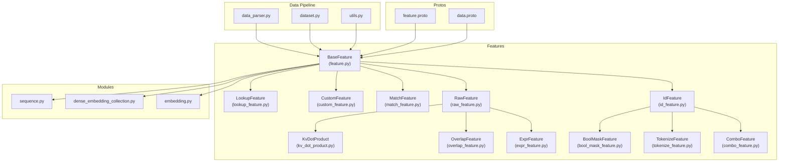

**Diagram sources**

- \[feature.py\](file://tzrec/features/feature.py#L375-L800)
- \[id_feature.py\](file://tzrec/features/id_feature.py#L22-L141)
- \[raw_feature.py\](file://tzrec/features/raw_feature.py#L20-L100)
- \[combo_feature.py\](file://tzrec/features/combo_feature.py#L24-L107)
- \[expr_feature.py\](file://tzrec/features/expr_feature.py#L21-L73)
- \[match_feature.py\](file://tzrec/features/match_feature.py#L24-L190)
- \[tokenize_feature.py\](file://tzrec/features/tokenize_feature.py#L30-L162)
- \[overlap_feature.py\](file://tzrec/features/overlap_feature.py#L21-L83)
- \[bool_mask_feature.py\](file://tzrec/features/bool_mask_feature.py#L24-L95)
- \[kv_dot_product.py\](file://tzrec/features/kv_dot_product.py#L21-L85)
- \[custom_feature.py\](file://tzrec/features/custom_feature.py#L28-L195)
- \[lookup_feature.py\](file://tzrec/features/lookup_feature.py#L24-L205)
- \[feature.proto\](file://tzrec/protos/feature.proto#L112-L957)
- \[data.proto\](file://tzrec/protos/data.proto#L1-L200)
- \[data_parser.py\](file://tzrec/datasets/data_parser.py#L1-L200)
- \[dataset.py\](file://tzrec/datasets/dataset.py#L1-L200)
- \[utils.py\](file://tzrec/datasets/utils.py#L1-L200)
- \[embedding.py\](file://tzrec/modules/embedding.py#L1-L200)
- \[dense_embedding_collection.py\](file://tzrec/modules/dense_embedding_collection.py#L1-L200)
- \[sequence.py\](file://tzrec/modules/sequence.py#L1-L200)

**Section sources**

- \[feature.py\](file://tzrec/features/feature.py#L1-L1268)
- \[feature.proto\](file://tzrec/protos/feature.proto#L1-L957)

## Core Components

- BaseFeature: Defines the feature interface, parsing logic, embedding configuration, managed collision handling, and sequence support. It also manages fg-encoded data parsing helpers and side inputs resolution.
- Feature implementations: Specialized classes for each feature type, overriding value_dim, output_dim, num_embeddings, and fg_json generation.
- Protobuf configuration: feature.proto defines all feature message types and their fields, enabling declarative feature configuration.
- Data pipeline: data_parser.py and dataset.py integrate PyArrow inputs, apply fg-encoded parsing, and produce structured tensors for models.
- Modules: embedding.py and dense_embedding_collection.py provide embedding configurations compatible with TorchRec; sequence.py handles sequence encoders.

Key capabilities:

- Side inputs resolution with user/item/context prefixes and grouped sequences
- FG DAG JSON generation for external feature graph compilation
- Sparse vs dense embedding support with boundary bucketization and dense embeddings (AutoDis/MLP)
- Managed collision and dynamic embedding integration
- Sequence feature support with configurable delimiters and lengths

**Section sources**

- \[feature.py\](file://tzrec/features/feature.py#L375-L800)
- \[feature.proto\](file://tzrec/protos/feature.proto#L112-L957)
- \[data_parser.py\](file://tzrec/datasets/data_parser.py#L1-L200)
- \[dataset.py\](file://tzrec/datasets/dataset.py#L1-L200)

## Architecture Overview

The feature engineering pipeline transforms raw inputs into model-ready tensors through a series of stages: input parsing, feature-specific transformations, embedding lookups, and sequence encoding.

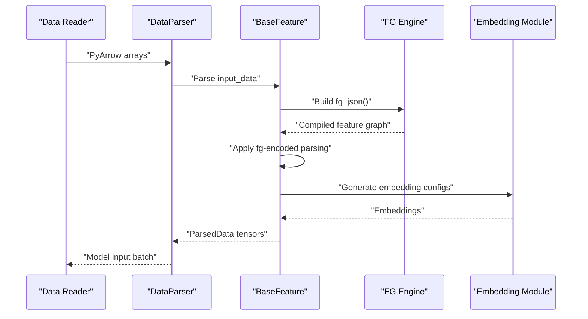

**Diagram sources**

- \[feature.py\](file://tzrec/features/feature.py#L777-L800)
- \[data_parser.py\](file://tzrec/datasets/data_parser.py#L1-L200)
- \[embedding.py\](file://tzrec/modules/embedding.py#L1-L200)

## Detailed Component Analysis

### BaseFeature and Parsing Workflow

BaseFeature centralizes parsing, side input resolution, and embedding configuration. It supports:

- fg_mode handling (FG_NONE, FG_NORMAL)
- fg-encoded parsing helpers for sparse, dense, and sequence features
- Side inputs with prefixed names for grouped sequences
- Parameter constraints for embedding sharding and kernels
- Managed collision and dynamic embedding integration

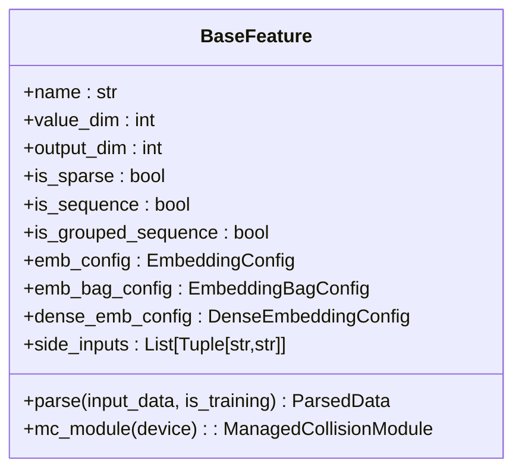

**Diagram sources**

- \[feature.py\](file://tzrec/features/feature.py#L375-L800)

**Section sources**

- \[feature.py\](file://tzrec/features/feature.py#L375-L800)

### IdFeature

Purpose: Discrete categorical features with optional weighted multi-values and bucketization.

Key behaviors:

- value_dim defaults to 1 for sequences, 0 otherwise
- Supports hash buckets, vocab lists/dicts, ZCH, dynamic embedding
- Generates fg_json with appropriate value_type and bucketization settings

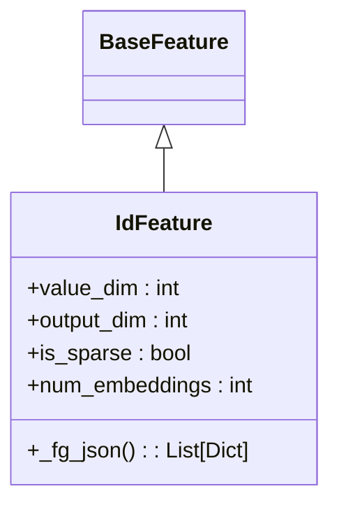

**Diagram sources**

- \[id_feature.py\](file://tzrec/features/id_feature.py#L22-L141)
- \[feature.py\](file://tzrec/features/feature.py#L375-L800)

**Section sources**

- \[id_feature.py\](file://tzrec/features/id_feature.py#L22-L141)
- \[feature.proto\](file://tzrec/protos/feature.proto#L112-L180)

### RawFeature

Purpose: Continuous numerical features with optional bucketization and dense embeddings.

Key behaviors:

- value_dim defaults to 1; supports multi-dimensional values
- Boundaries enable bucketization; dense embeddings supported for non-sequence
- Normalizer expressions supported

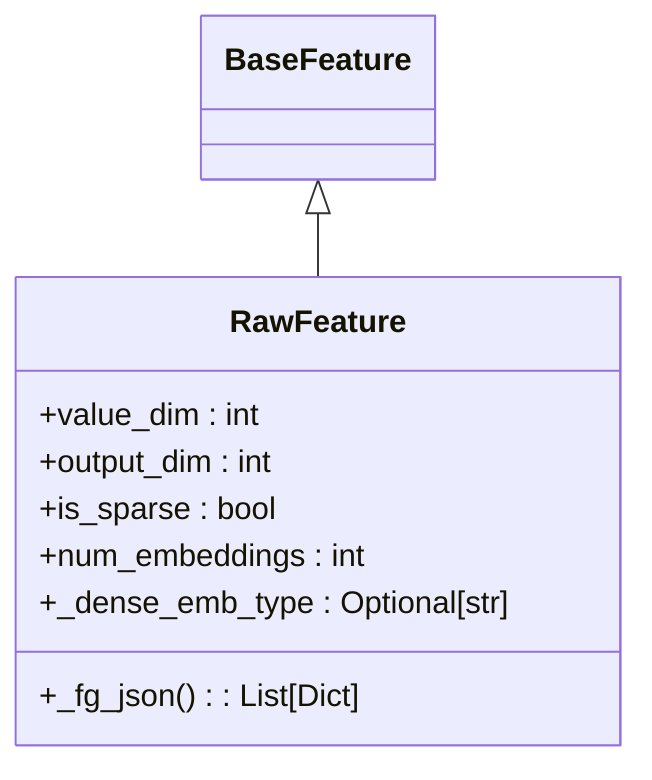

**Diagram sources**

- \[raw_feature.py\](file://tzrec/features/raw_feature.py#L20-L100)
- \[feature.py\](file://tzrec/features/feature.py#L375-L800)

**Section sources**

- \[raw_feature.py\](file://tzrec/features/raw_feature.py#L20-L100)
- \[feature.proto\](file://tzrec/protos/feature.proto#L182-L239)

### ComboFeature

Purpose: Combinatorial features from multiple inputs (e.g., user-item pairs).

Key behaviors:

- Inherits IdFeature behavior with multi-input expressions
- Negative sampling mapped to cross-negative data group

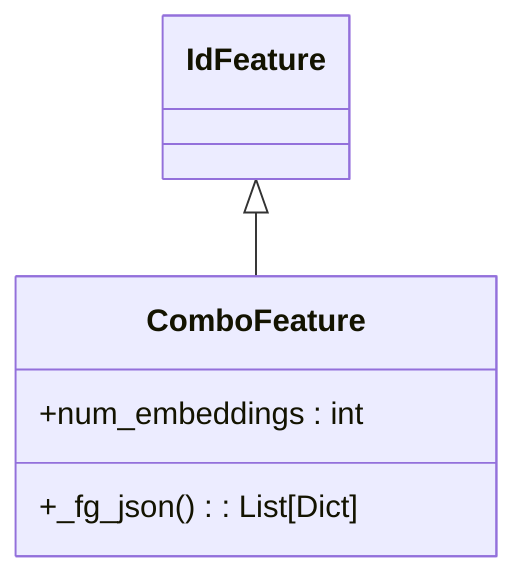

**Diagram sources**

- \[combo_feature.py\](file://tzrec/features/combo_feature.py#L24-L107)
- \[id_feature.py\](file://tzrec/features/id_feature.py#L22-L141)

**Section sources**

- \[combo_feature.py\](file://tzrec/features/combo_feature.py#L24-L107)
- \[feature.proto\](file://tzrec/protos/feature.proto#L241-L301)

### ExprFeature

Purpose: Expression-based transformations over variables.

Key behaviors:

- Multi-variable expressions with optional fill_missing
- Bucketization boundaries supported

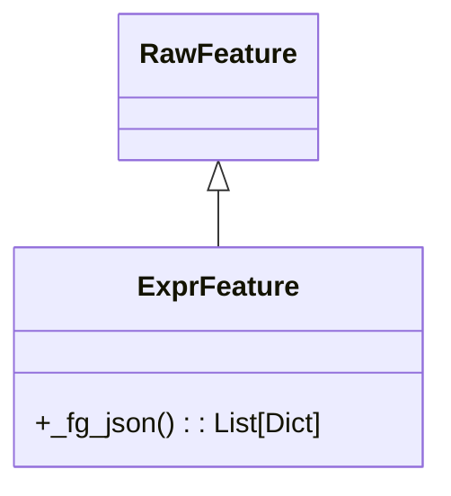

**Diagram sources**

- \[expr_feature.py\](file://tzrec/features/expr_feature.py#L21-L73)
- \[raw_feature.py\](file://tzrec/features/raw_feature.py#L20-L100)

**Section sources**

- \[expr_feature.py\](file://tzrec/features/expr_feature.py#L21-L73)
- \[feature.proto\](file://tzrec/protos/feature.proto#L492-L546)

### MatchFeature

Purpose: Candidate generation and matching with nested maps and keys.

Key behaviors:

- Supports wildcard primary/secondary keys
- Discrete or dense embedding depending on configuration
- Normalizer and boundaries supported

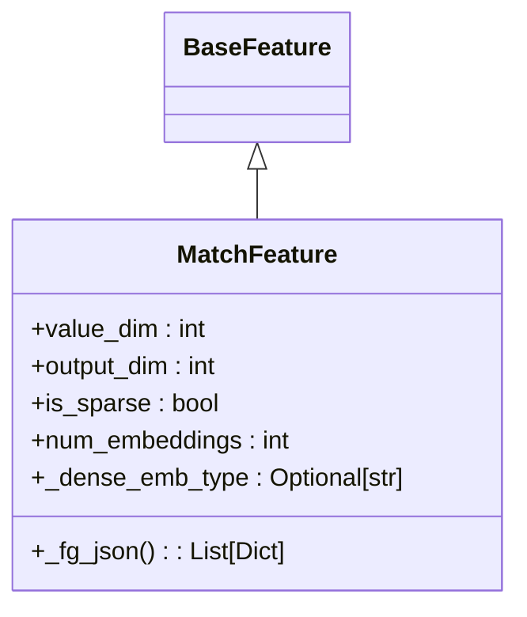

**Diagram sources**

- \[match_feature.py\](file://tzrec/features/match_feature.py#L24-L190)
- \[feature.py\](file://tzrec/features/feature.py#L375-L800)

**Section sources**

- \[match_feature.py\](file://tzrec/features/match_feature.py#L24-L190)
- \[feature.proto\](file://tzrec/protos/feature.proto#L398-L490)

### TokenizeFeature

Purpose: Text tokenization with normalization and vocabulary-backed token IDs.

Key behaviors:

- Text normalization options and stop char files
- SentencePiece/BPE tokenizers
- Vocabulary size determined by tokenizer model

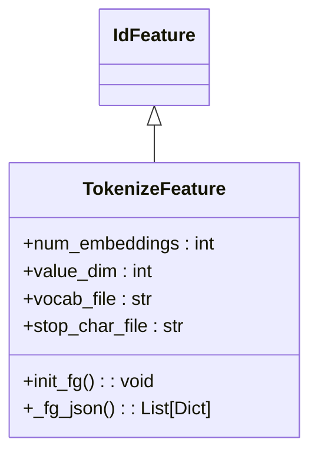

**Diagram sources**

- \[tokenize_feature.py\](file://tzrec/features/tokenize_feature.py#L30-L162)
- \[id_feature.py\](file://tzrec/features/id_feature.py#L22-L141)

**Section sources**

- \[tokenize_feature.py\](file://tzrec/features/tokenize_feature.py#L30-L162)
- \[feature.proto\](file://tzrec/protos/feature.proto#L635-L681)

### OverlapFeature

Purpose: Set similarity metrics (e.g., Jaccard ratio) between query and title sets.

Key behaviors:

- Methods include query/title common ratios and containment checks
- Normalizer and boundaries supported

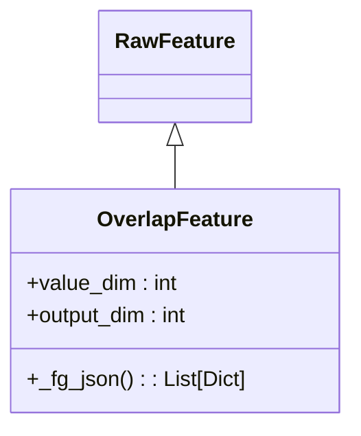

**Diagram sources**

- \[overlap_feature.py\](file://tzrec/features/overlap_feature.py#L21-L83)
- \[raw_feature.py\](file://tzrec/features/raw_feature.py#L20-L100)

**Section sources**

- \[overlap_feature.py\](file://tzrec/features/overlap_feature.py#L21-L83)
- \[feature.proto\](file://tzrec/protos/feature.proto#L548-L606)

### BoolMaskFeature

Purpose: Boolean masking over categorical features for filtering.

Key behaviors:

- Expression-driven masks with optional bucketization
- Supports sequence grouping

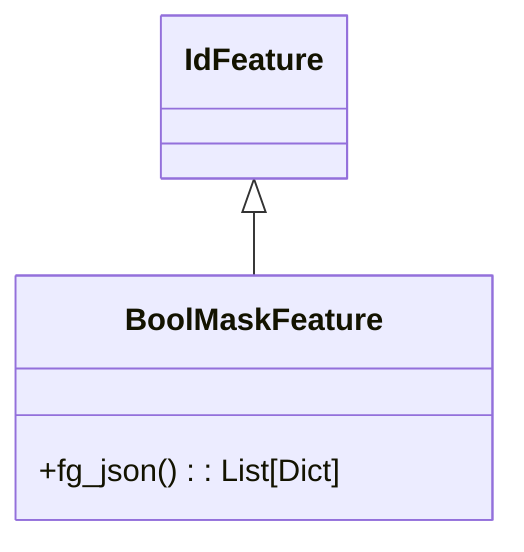

**Diagram sources**

- \[bool_mask_feature.py\](file://tzrec/features/bool_mask_feature.py#L24-L95)
- \[id_feature.py\](file://tzrec/features/id_feature.py#L22-L141)

**Section sources**

- \[bool_mask_feature.py\](file://tzrec/features/bool_mask_feature.py#L24-L95)
- \[feature.proto\](file://tzrec/protos/feature.proto#L112-L180)

### KvDotProduct

Purpose: Dot product computation over key-value vectors.

Key behaviors:

- Query/document KV strings with optional separators
- Boundaries and normalizer supported

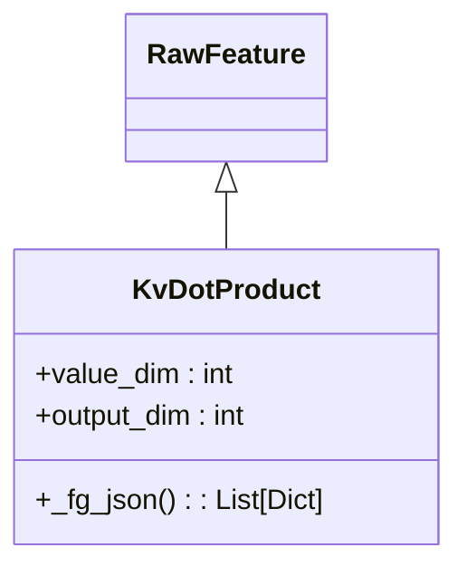

**Diagram sources**

- \[kv_dot_product.py\](file://tzrec/features/kv_dot_product.py#L21-L85)
- \[raw_feature.py\](file://tzrec/features/raw_feature.py#L20-L100)

**Section sources**

- \[kv_dot_product.py\](file://tzrec/features/kv_dot_product.py#L21-L85)
- \[feature.proto\](file://tzrec/protos/feature.proto#L684-L742)

### CustomFeature

Purpose: Extensible operator-based features with custom libraries.

Key behaviors:

- Operator name and shared library file
- Thread-safety flag and parameters
- Dense/sparse embedding support

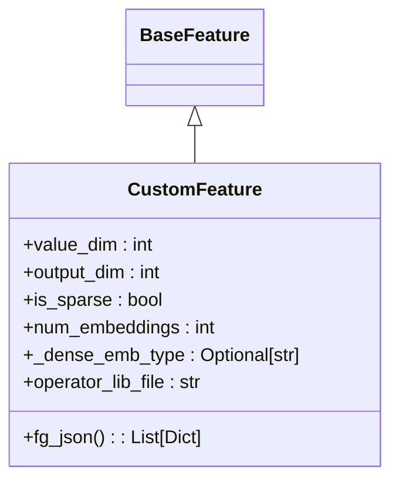

**Diagram sources**

- \[custom_feature.py\](file://tzrec/features/custom_feature.py#L28-L195)
- \[feature.py\](file://tzrec/features/feature.py#L375-L800)

**Section sources**

- \[custom_feature.py\](file://tzrec/features/custom_feature.py#L28-L195)
- \[feature.proto\](file://tzrec/protos/feature.proto#L744-L850)

### LookupFeature

Purpose: Map-based lookups with optional discrete bucketization and combiners.

Key behaviors:

- Map and key inputs with optional value dimensions
- Discrete mode with combiners (sum/mean/min/max/count)
- Normalizer and boundaries supported

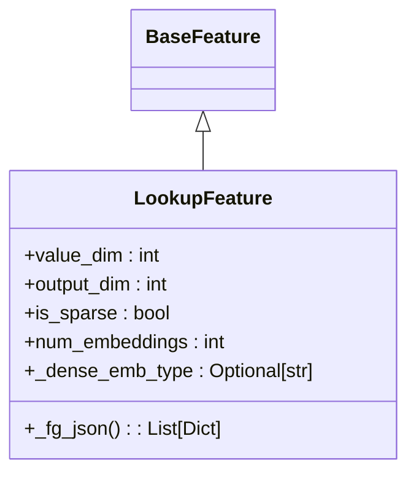

**Diagram sources**

- \[lookup_feature.py\](file://tzrec/features/lookup_feature.py#L24-L205)
- \[feature.py\](file://tzrec/features/feature.py#L375-L800)

**Section sources**

- \[lookup_feature.py\](file://tzrec/features/lookup_feature.py#L24-L205)
- \[feature.proto\](file://tzrec/protos/feature.proto#L303-L396)

## Dependency Analysis

Feature classes depend on:

- BaseFeature for shared parsing and configuration
- Protobuf messages for feature definitions
- TorchRec embedding configs for distributed training
- PyArrow for efficient data parsing
- Optional external libraries for tokenization and custom operators

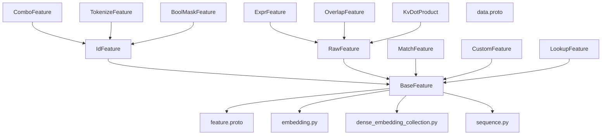

**Diagram sources**

- \[feature.py\](file://tzrec/features/feature.py#L375-L800)
- \[feature.proto\](file://tzrec/protos/feature.proto#L112-L957)
- \[embedding.py\](file://tzrec/modules/embedding.py#L1-L200)
- \[dense_embedding_collection.py\](file://tzrec/modules/dense_embedding_collection.py#L1-L200)
- \[sequence.py\](file://tzrec/modules/sequence.py#L1-L200)

**Section sources**

- \[feature.py\](file://tzrec/features/feature.py#L375-L800)
- \[feature.proto\](file://tzrec/protos/feature.proto#L112-L957)

## Performance Considerations

- Embedding sharding and compute kernels: Configure ParameterConstraints to optimize placement and compute kernels.
- Managed collision and dynamic embedding: Use ZCH and DynamicEmbedding to reduce collisions and scale embeddings efficiently.
- Sequence processing: Control sequence_delim and sequence_length to minimize padding overhead.
- FG-encoded parsing: Use appropriate default values and separators to avoid expensive conversions.
- Dense embeddings: AutoDis and MLP embeddings can reduce parameter counts for dense features.
- Memory optimization: Prefer bucketization and discrete embeddings for high-cardinality categorical features.

[No sources needed since this section provides general guidance]

## Troubleshooting Guide

Common issues and resolutions:

- Invalid FG input errors: Ensure side inputs are properly formatted and include required prefixes for grouped sequences.
- Missing vocabulary or bucket sizes: Provide vocab_list, vocab_dict, vocab_file, hash_bucket_size, or num_buckets for IdFeature variants.
- Sequence configuration mismatches: Verify sequence_delim, sequence_length, and sequence_fields alignment with grouped sequences.
- FG DAG compilation failures: Validate fg_json generation and operator library paths for CustomFeature.

**Section sources**

- \[feature.py\](file://tzrec/features/feature.py#L369-L373)
- \[custom_feature.py\](file://tzrec/features/custom_feature.py#L171-L189)

## Conclusion

TorchEasyRec’s feature engineering system provides a robust, extensible framework for transforming heterogeneous inputs into model-ready tensors. By leveraging BaseFeature abstractions, Protocol Buffer configurations, and TorchRec-compatible embeddings, it supports diverse feature types and scales to large recommendation workloads. Proper configuration of embeddings, sequences, and FG-encoded parsing ensures optimal performance and accuracy.

[No sources needed since this section summarizes without analyzing specific files]

## Appendices

### Feature Configuration Examples

Configuration files demonstrate feature usage across models:

- Multi-task learning with Taobao features
- Deep factorization machines with Criteo features
- DSSM ranking with Taobao features

These examples illustrate feature groups, embedding dimensions, bucketization, and sequence settings.

**Section sources**

- \[dbmtl_taobao.config\](file://examples/dbmtl_taobao.config#L1-L200)
- \[multi_tower_taobao.config\](file://examples/multi_tower_taobao.config#L1-L200)
- \[dlrm_criteo.config\](file://examples/dlrm_criteo.config#L1-L200)
- \[dssm_taobao.config\](file://examples/dssm_taobao.config#L1-L200)

### Feature Selection Strategies

Tools for feature selection and pipeline generation:

- Feature selection utilities to prune low-importance features
- FG JSON creation for DAG compilation
- Adding feature metadata to configs

**Section sources**

- \[feature_selection.py\](file://tzrec/tools/feature_selection.py#L1-L200)
- \[create_fg_json.py\](file://tzrec/tools/create_fg_json.py#L1-L200)
- \[add_feature_info_to_config.py\](file://tzrec/tools/add_feature_info_to_config.py#L1-L200)
