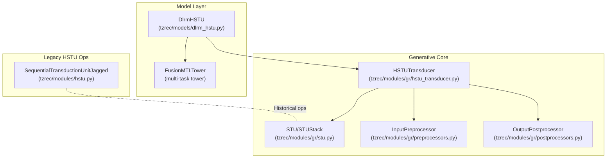
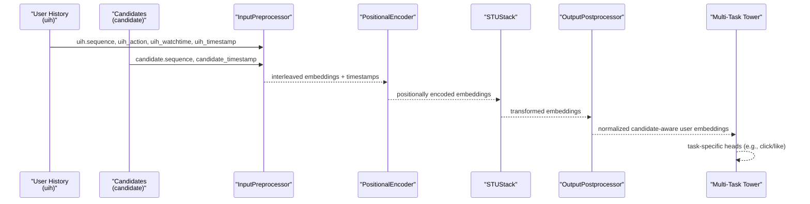
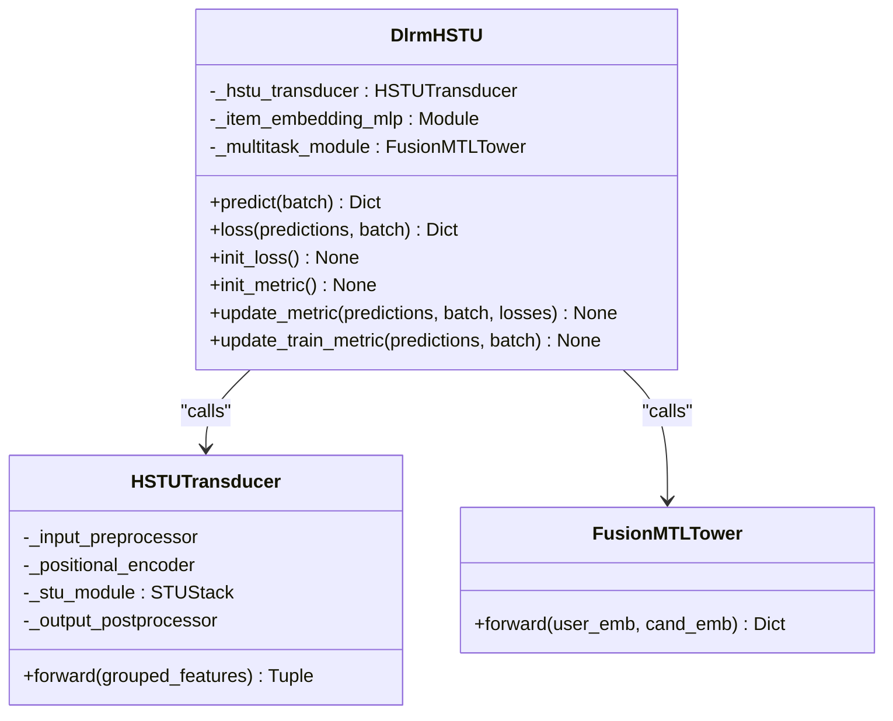
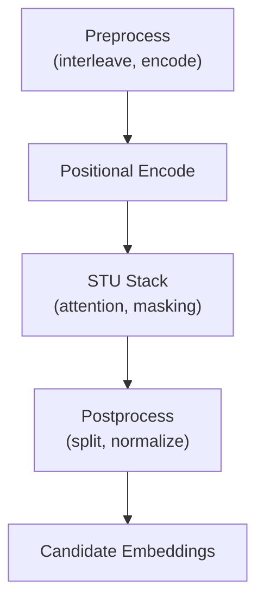
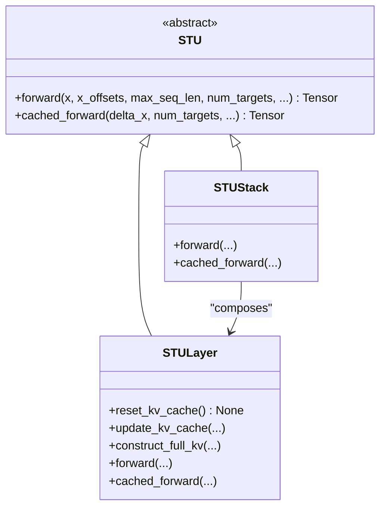
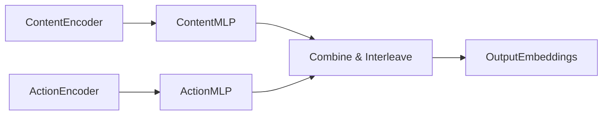
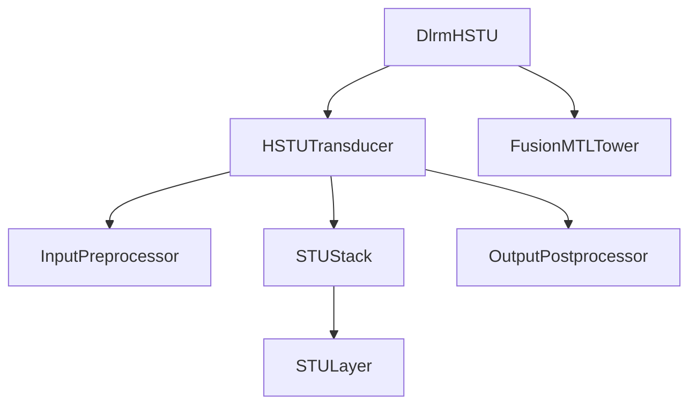

# Generative Recommendation Models

<cite>
**Referenced Files in This Document**
- [dlrm_hstu.py](file://tzrec/models/dlrm_hstu.py)
- [hstu_transducer.py](file://tzrec/modules/gr/hstu_transducer.py)
- [stu.py](file://tzrec/modules/gr/stu.py)
- [hstu.py](file://tzrec/modules/hstu.py)
- [preprocessors.py](file://tzrec/modules/gr/preprocessors.py)
- [postprocessors.py](file://tzrec/modules/gr/postprocessors.py)
- [dlrm_hstu.md](file://docs/source/models/dlrm_hstu.md)
- [generative.rst](file://docs/source/models/generative.rst)
- [rank_model.py](file://tzrec/models/rank_model.py)
- [recall_at_k.py](file://tzrec/metrics/recall_at_k.py)
</cite>

## Table of Contents

1. [Introduction](#introduction)
1. [Project Structure](#project-structure)
1. [Core Components](#core-components)
1. [Architecture Overview](#architecture-overview)
1. [Detailed Component Analysis](#detailed-component-analysis)
1. [Dependency Analysis](#dependency-analysis)
1. [Performance Considerations](#performance-considerations)
1. [Troubleshooting Guide](#troubleshooting-guide)
1. [Conclusion](#conclusion)
1. [Appendices](#appendices)

## Introduction

This document explains TorchEasyRec’s generative recommendation capabilities with a focus on the DLRM-HSTU (Deep Learning Recommender Model with Hierarchical Self-Training Unit) architecture. Unlike traditional ranking models that score items independently, DLRM-HSTU models user behavior sequences end-to-end via a hierarchical transduction unit (HSTU/STU) to produce embeddings that capture long-range sequential dynamics. These embeddings power downstream multi-task towers for ranking and matching objectives, while the underlying transduction mechanism enables generative-style modeling of user history and candidate interactions.

Key highlights:

- HSTU/STU layers process jagged sequences with attention and residual computation, supporting causal and target-aware masking.
- Input preprocessing interleaves user history and candidate sequences with optional action/content encoders and contextual features.
- Output postprocessing normalizes embeddings and optionally incorporates timestamp-based periodic features.
- The model integrates with multi-task learning towers and supports both classification and regression objectives.

## Project Structure

The generative recommendation stack centers around:

- Model definition: DlrmHSTU orchestrating embeddings, HSTU transducer, and multi-task towers.
- Generative modules: HSTUTransducer, STU/STUStack, and preprocessing/postprocessing modules.
- Documentation: Protobuf-based configuration examples and usage notes.

**Diagram sources**

- \[dlrm_hstu.py\](file://tzrec/models/dlrm_hstu.py#L82-L353)
- \[hstu_transducer.py\](file://tzrec/modules/gr/hstu_transducer.py#L35-L282)
- \[stu.py\](file://tzrec/modules/gr/stu.py#L172-L578)
- \[hstu.py\](file://tzrec/modules/hstu.py#L236-L504)
- \[preprocessors.py\](file://tzrec/modules/gr/preprocessors.py#L109-L478)
- \[postprocessors.py\](file://tzrec/modules/gr/postprocessors.py#L33-L250)

**Section sources**

- \[dlrm_hstu.py\](file://tzrec/models/dlrm_hstu.py#L82-L353)
- \[hstu_transducer.py\](file://tzrec/modules/gr/hstu_transducer.py#L35-L282)
- \[preprocessors.py\](file://tzrec/modules/gr/preprocessors.py#L109-L478)
- \[postprocessors.py\](file://tzrec/modules/gr/postprocessors.py#L33-L250)
- \[hstu.py\](file://tzrec/modules/hstu.py#L236-L504)

## Core Components

- DlrmHSTU: Top-level model that builds contextual and candidate embeddings, passes them through HSTUTransducer, and feeds the resulting user embeddings into a multi-task tower.
- HSTUTransducer: Orchestrates preprocessing, positional encoding, STU stacking, and postprocessing to extract candidate-aware user embeddings.
- STU/STUStack: Hierarchical attention blocks with key-value caching for efficient incremental computation.
- InputPreprocessor: Encodes user history and candidate tokens, optionally interleaves them with actions and contextual features.
- OutputPostprocessor: Applies normalization and timestamp-aware transformations to embeddings.

Practical configuration anchors:

- Model-level configuration and feature groups are documented in the model guide.
- Kernel selection and training tips are included in the model documentation.

**Section sources**

- \[dlrm_hstu.py\](file://tzrec/models/dlrm_hstu.py#L82-L353)
- \[hstu_transducer.py\](file://tzrec/modules/gr/hstu_transducer.py#L35-L282)
- \[stu.py\](file://tzrec/modules/gr/stu.py#L172-L578)
- \[preprocessors.py\](file://tzrec/modules/gr/preprocessors.py#L109-L478)
- \[postprocessors.py\](file://tzrec/modules/gr/postprocessors.py#L33-L250)
- \[dlrm_hstu.md\](file://docs/source/models/dlrm_hstu.md#L1-L313)

## Architecture Overview

The DLRM-HSTU pipeline transforms raw user and candidate sequences into embeddings suitable for multi-task ranking and matching.

**Diagram sources**

- \[hstu_transducer.py\](file://tzrec/modules/gr/hstu_transducer.py#L99-L151)
- \[hstu_transducer.py\](file://tzrec/modules/gr/hstu_transducer.py#L153-L169)
- \[hstu_transducer.py\](file://tzrec/modules/gr/hstu_transducer.py#L171-L228)
- \[dlrm_hstu.py\](file://tzrec/models/dlrm_hstu.py#L164-L167)

## Detailed Component Analysis

### DlrmHSTU: Generative Embedding Pipeline

- Input grouping: Supports contextual (DEEP), user history (JAGGED_SEQUENCE), candidates (JAGGED_SEQUENCE), and auxiliary sequences (actions, watchtime, timestamps).
- HSTUTransducer construction: Builds a hierarchical transducer with configurable attention layers, positional encoding, and input dropout.
- Candidate embedding projection: Projects candidate embeddings into the HSTU embedding space.
- Multi-task tower: Fuses user and candidate embeddings to produce task-specific outputs.

**Diagram sources**

- \[dlrm_hstu.py\](file://tzrec/models/dlrm_hstu.py#L82-L353)
- \[hstu_transducer.py\](file://tzrec/modules/gr/hstu_transducer.py#L35-L282)

**Section sources**

- \[dlrm_hstu.py\](file://tzrec/models/dlrm_hstu.py#L82-L353)

### HSTUTransducer: Hierarchical Transduction Unit

- Preprocessing: Interleaves user history and candidate sequences, applies action/content encoders, and optionally contextual features.
- Positional encoding: Optional encoder for temporal and positional context.
- STU stacking: Applies multiple STU layers with attention, masking, and KV caching.
- Postprocessing: Splits user history and candidate segments, applies normalization and timestamp-aware transformations.

**Diagram sources**

- \[hstu_transducer.py\](file://tzrec/modules/gr/hstu_transducer.py#L99-L151)
- \[hstu_transducer.py\](file://tzrec/modules/gr/hstu_transducer.py#L153-L169)
- \[hstu_transducer.py\](file://tzrec/modules/gr/hstu_transducer.py#L171-L228)

**Section sources**

- \[hstu_transducer.py\](file://tzrec/modules/gr/hstu_transducer.py#L35-L282)

### STU/STUStack: Attention Blocks with KV Caching

- STULayer: Computes Q/K/V via learned projections, applies attention with causal and target-aware masks, and produces residual outputs with optional group normalization.
- STUStack: Chains multiple STULayers.
- KV caching: Enables incremental computation for long sequences by storing and reusing keys/values.

**Diagram sources**

- \[stu.py\](file://tzrec/modules/gr/stu.py#L34-L81)
- \[stu.py\](file://tzrec/modules/gr/stu.py#L172-L501)
- \[stu.py\](file://tzrec/modules/gr/stu.py#L503-L578)

**Section sources**

- \[stu.py\](file://tzrec/modules/gr/stu.py#L172-L578)

### Preprocessing and Postprocessing Modules

- InputPreprocessor: Encodes content/action pairs, optionally interleaves with targets during training, and concatenates contextual features.
- OutputPostprocessor: Applies L2/Layer/Time-aware normalization to embeddings.

**Diagram sources**

- \[preprocessors.py\](file://tzrec/modules/gr/preprocessors.py#L109-L478)
- \[postprocessors.py\](file://tzrec/modules/gr/postprocessors.py#L33-L250)

**Section sources**

- \[preprocessors.py\](file://tzrec/modules/gr/preprocessors.py#L109-L478)
- \[postprocessors.py\](file://tzrec/modules/gr/postprocessors.py#L33-L250)

### Generative vs Discriminative Components

- Generative aspect: HSTU/STU models sequential behavior as a joint distribution over tokens, enabling long-range dependencies and scalable scaling behavior on very long sequences.
- Discriminative aspect: The multi-task tower uses the learned user embeddings to predict task-specific signals (e.g., click/like), optimizing downstream objectives.

Relationship mapping:

- DlrmHSTU embeds users into a latent space informed by history and candidates.
- FusionMTLTower performs discriminative prediction using these embeddings.

**Section sources**

- \[dlrm_hstu.py\](file://tzrec/models/dlrm_hstu.py#L164-L167)
- \[hstu_transducer.py\](file://tzrec/modules/gr/hstu_transducer.py#L230-L282)

### Implementation Notes and Training Strategies

- Sequence ordering: The model supports reversing sequences when timestamps are descending and restoring order in predictions.
- Global averaging loss: Optional batch-size normalization for stable multi-device training.
- Kernel selection: TRITON kernel can significantly improve performance and memory footprint compared to PyTorch kernels.

**Section sources**

- \[dlrm_hstu.py\](file://tzrec/models/dlrm_hstu.py#L178-L201)
- \[dlrm_hstu.py\](file://tzrec/models/dlrm_hstu.py#L256-L258)
- \[dlrm_hstu.md\](file://docs/source/models/dlrm_hstu.md#L168-L168)

### Evaluation Metrics for Generative Scenarios

- Ranking metrics: AUC and recall@K are commonly used for ranking objectives.
- Matching metrics: Cross-entropy loss is used for matching tasks.

**Section sources**

- \[rank_model.py\](file://tzrec/models/rank_model.py#L214-L230)
- \[recall_at_k.py\](file://tzrec/metrics/recall_at_k.py#L19-L55)

## Dependency Analysis

The generative recommendation stack exhibits clear separation of concerns:

- DlrmHSTU depends on HSTUTransducer and FusionMTLTower.
- HSTUTransducer composes InputPreprocessor, STUStack, and OutputPostprocessor.
- STUStack relies on STULayer and leverages attention kernels and KV caching.

**Diagram sources**

- \[dlrm_hstu.py\](file://tzrec/models/dlrm_hstu.py#L139-L167)
- \[hstu_transducer.py\](file://tzrec/modules/gr/hstu_transducer.py#L73-L87)
- \[stu.py\](file://tzrec/modules/gr/stu.py#L503-L578)

**Section sources**

- \[dlrm_hstu.py\](file://tzrec/models/dlrm_hstu.py#L139-L167)
- \[hstu_transducer.py\](file://tzrec/modules/gr/hstu_transducer.py#L73-L87)
- \[stu.py\](file://tzrec/modules/gr/stu.py#L503-L578)

## Performance Considerations

- Kernel choice: Prefer TRITON kernel for speed and memory efficiency.
- Mixed precision: Disable mixed precision temporarily if training instability occurs; adjust data types accordingly.
- KV caching: Leverage STU’s key/value caching for efficient incremental inference on long sequences.
- Sequence length: Configure max_seq_len appropriately to balance coverage and memory usage.

[No sources needed since this section provides general guidance]

## Troubleshooting Guide

Common issues and remedies:

- Training instability: Disable mixed precision and remove data-type overrides in feature configs; enable TF32 matmul if supported.
- Sequence order mismatch: Ensure sequence_timestamp_is_ascending is configured correctly; the model reverses and restores order internally.
- Feature dimension mismatch: All contextual features must share the same output dimension; otherwise, initialization raises an error.

**Section sources**

- \[dlrm_hstu.md\](file://docs/source/models/dlrm_hstu.md#L308-L308)
- \[dlrm_hstu.py\](file://tzrec/models/dlrm_hstu.py#L181-L201)
- \[dlrm_hstu.py\](file://tzrec/models/dlrm_hstu.py#L125-L129)

## Conclusion

DLRM-HSTU integrates a hierarchical attention-based transducer with multi-task learning to jointly model user history and candidate interactions. Its generative-style sequential modeling enables scalable, long-range reasoning over very long sequences, while the multi-task tower delivers strong discriminative performance. Proper configuration of preprocessing, positional encoding, and postprocessing, along with careful training strategies, unlocks robust real-world deployment.

[No sources needed since this section summarizes without analyzing specific files]

## Appendices

### Practical Configuration Examples

- MetaGR-style configuration: Defines feature groups, HSTU parameters, input/output preprocessors, and multi-task tower with classification losses and metrics.
- MTGR-style configuration: Adds cross-user-item features and MLP-based content encoder to align token spaces.

**Section sources**

- \[dlrm_hstu.md\](file://docs/source/models/dlrm_hstu.md#L13-L167)
- \[dlrm_hstu.md\](file://docs/source/models/dlrm_hstu.md#L170-L295)

### When to Use Generative Approaches vs Traditional Ranking

- Use generative models (DLRM-HSTU) when:
  - Long-range sequential dependencies are critical.
  - Very long user histories are common.
  - You want to jointly model history and candidates in a unified embedding space.
- Use traditional ranking models when:
  - Computational overhead of long-sequence modeling is prohibitive.
  - Simpler, fast inference is prioritized.
  - Downstream tasks do not benefit from sequential modeling.

[No sources needed since this section provides general guidance]

### Adaptation Guidance for Generative Recommendation Use Cases

- Extend InputPreprocessor to incorporate richer action/content encoders and contextual features.
- Tune STU attention parameters (heads, hidden dims, attention dims) for your sequence length and domain.
- Use OutputPostprocessor variants suited to your similarity metric (e.g., LayerNorm or Time-aware normalization).
- Evaluate with both ranking and matching metrics to assess generative gains.

[No sources needed since this section provides general guidance]
