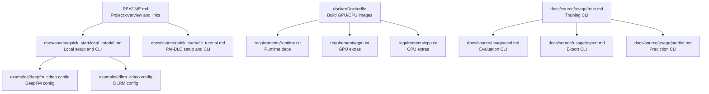
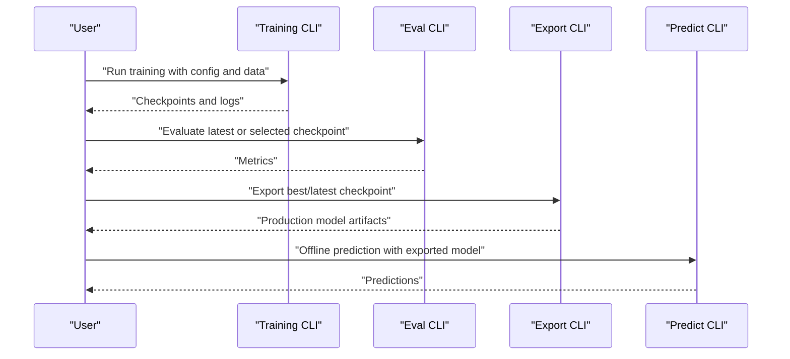
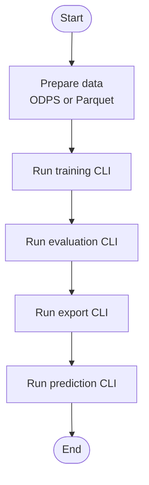
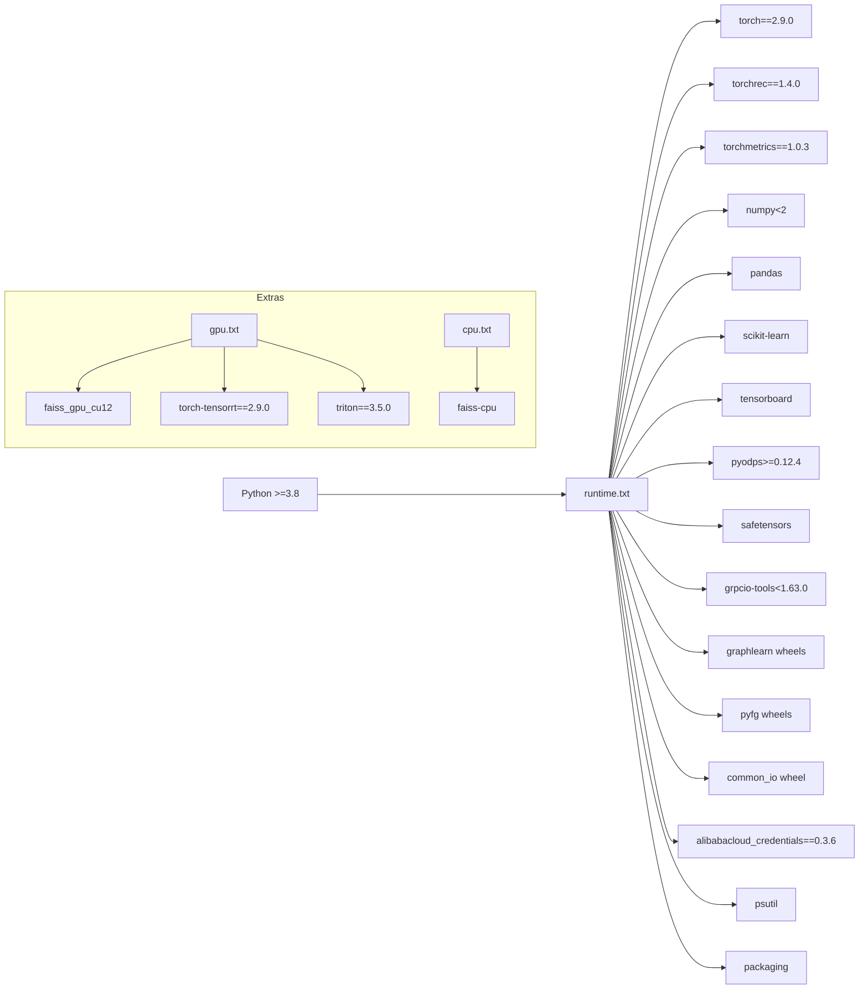

# Getting Started Guide

<cite>
**Referenced Files in This Document**
- [README.md](file://README.md)
- [setup.py](file://setup.py)
- [requirements.txt](file://requirements.txt)
- [requirements/runtime.txt](file://requirements/runtime.txt)
- [requirements/gpu.txt](file://requirements/gpu.txt)
- [requirements/cpu.txt](file://requirements/cpu.txt)
- [docker/Dockerfile](file://docker/Dockerfile)
- [examples/deepfm_criteo.config](file://examples/deepfm_criteo.config)
- [examples/dlrm_criteo.config](file://examples/dlrm_criteo.config)
- [docs/source/quick_start/local_tutorial.md](file://docs/source/quick_start/local_tutorial.md)
- [docs/source/quick_start/dlc_tutorial.md](file://docs/source/quick_start/dlc_tutorial.md)
- [docs/source/usage/train.md](file://docs/source/usage/train.md)
- [docs/source/usage/eval.md](file://docs/source/usage/eval.md)
- [docs/source/usage/export.md](file://docs/source/usage/export.md)
- [docs/source/usage/predict.md](file://docs/source/usage/predict.md)
- [docs/source/faq.md](file://docs/source/faq.md)
</cite>

## Table of Contents

1. [Introduction](#introduction)
1. [Project Structure](#project-structure)
1. [Core Components](#core-components)
1. [Architecture Overview](#architecture-overview)
1. [Detailed Component Analysis](#detailed-component-analysis)
1. [Dependency Analysis](#dependency-analysis)
1. [Performance Considerations](#performance-considerations)
1. [Troubleshooting Guide](#troubleshooting-guide)
1. [Conclusion](#conclusion)
1. [Appendices](#appendices)

## Introduction

This guide helps you quickly install and run TorchEasyRec across local, PAI-DLC, and PAI-DSW environments. It covers system requirements, dependency installation via pip and conda, Docker containerization, and end-to-end workflows for local training with synthetic datasets, distributed training on PAI-DLC, and ODPS dataset integration. Practical examples demonstrate training, evaluation, export, and prediction using the provided configuration files deepfm_criteo.config and dlrm_criteo.config. You will also learn the basic workflow from data preparation to model deployment, plus troubleshooting tips and verification steps.

## Project Structure

TorchEasyRec provides:

- Ready-to-use tutorials for local and PAI-DLC environments
- Example configuration files for representative models (DeepFM, DLRM)
- Docker image definitions and requirements for CPU/GPU builds
- CLI commands for training, evaluation, export, and prediction
- FAQ covering common setup and runtime issues

**Diagram sources**

- \[README.md\](file://README.md#L1-L83)
- \[docs/source/quick_start/local_tutorial.md\](file://docs/source/quick_start/local_tutorial.md#L1-L330)
- \[docs/source/quick_start/dlc_tutorial.md\](file://docs/source/quick_start/dlc_tutorial.md#L1-L156)
- \[examples/deepfm_criteo.config\](file://examples/deepfm_criteo.config#L1-L397)
- \[examples/dlrm_criteo.config\](file://examples/dlrm_criteo.config#L1-L398)
- \[docker/Dockerfile\](file://docker/Dockerfile#L1-L98)
- \[requirements/runtime.txt\](file://requirements/runtime.txt#L1-L24)
- \[requirements/gpu.txt\](file://requirements/gpu.txt#L1-L6)
- \[requirements/cpu.txt\](file://requirements/cpu.txt#L1-L2)
- \[docs/source/usage/train.md\](file://docs/source/usage/train.md#L1-L132)
- \[docs/source/usage/eval.md\](file://docs/source/usage/eval.md#L1-L34)
- \[docs/source/usage/export.md\](file://docs/source/usage/export.md#L1-L46)
- \[docs/source/usage/predict.md\](file://docs/source/usage/predict.md#L1-L66)

**Section sources**

- \[README.md\](file://README.md#L1-L83)
- \[docs/source/quick_start/local_tutorial.md\](file://docs/source/quick_start/local_tutorial.md#L1-L330)
- \[docs/source/quick_start/dlc_tutorial.md\](file://docs/source/quick_start/dlc_tutorial.md#L1-L156)
- \[examples/deepfm_criteo.config\](file://examples/deepfm_criteo.config#L1-L397)
- \[examples/dlrm_criteo.config\](file://examples/dlrm_criteo.config#L1-L398)
- \[docker/Dockerfile\](file://docker/Dockerfile#L1-L98)
- \[requirements/runtime.txt\](file://requirements/runtime.txt#L1-L24)
- \[requirements/gpu.txt\](file://requirements/gpu.txt#L1-L6)
- \[requirements/cpu.txt\](file://requirements/cpu.txt#L1-L2)
- \[docs/source/usage/train.md\](file://docs/source/usage/train.md#L1-L132)
- \[docs/source/usage/eval.md\](file://docs/source/usage/eval.md#L1-L34)
- \[docs/source/usage/export.md\](file://docs/source/usage/export.md#L1-L46)
- \[docs/source/usage/predict.md\](file://docs/source/usage/predict.md#L1-L66)

## Core Components

- Training pipeline: CLI entrypoint for training and evaluation
- Export pipeline: Produces production-ready models
- Prediction pipeline: Supports offline prediction from exported or checkpoint models
- Dataset integrations: Parquet, CSV, MaxCompute (ODPS), OSS
- Model configurations: Example configs for DeepFM and DLRM on synthetic Criteo-like datasets

Key CLI references:

- Training: \[docs/source/usage/train.md\](file://docs/source/usage/train.md#L5-L23)
- Evaluation: \[docs/source/usage/eval.md\](file://docs/source/usage/eval.md#L5-L16)
- Export: \[docs/source/usage/export.md\](file://docs/source/usage/export.md#L18-L30)
- Prediction: \[docs/source/usage/predict.md\](file://docs/source/usage/predict.md#L7-L27)

**Section sources**

- \[docs/source/usage/train.md\](file://docs/source/usage/train.md#L1-L132)
- \[docs/source/usage/eval.md\](file://docs/source/usage/eval.md#L1-L34)
- \[docs/source/usage/export.md\](file://docs/source/usage/export.md#L1-L46)
- \[docs/source/usage/predict.md\](file://docs/source/usage/predict.md#L1-L66)

## Architecture Overview

End-to-end workflow from data to deployment:

**Diagram sources**

- \[docs/source/usage/train.md\](file://docs/source/usage/train.md#L5-L23)
- \[docs/source/usage/eval.md\](file://docs/source/usage/eval.md#L5-L16)
- \[docs/source/usage/export.md\](file://docs/source/usage/export.md#L18-L30)
- \[docs/source/usage/predict.md\](file://docs/source/usage/predict.md#L7-L27)

## Detailed Component Analysis

### Local Setup and Installation

- Supported installation modes:
  - Conda + pip (Python 3.11 recommended)
  - Docker (GPU/CPU images)
- Required runtime dependencies are declared in requirements/runtime.txt
- Optional GPU extras and CPU extras are available separately

Installation steps:

- Conda + pip: see \[docs/source/quick_start/local_tutorial.md\](file://docs/source/quick_start/local_tutorial.md#L13-L23)
- Docker: see \[docs/source/quick_start/local_tutorial.md\](file://docs/source/quick_start/local_tutorial.md#L25-L40)
- Runtime dependencies: \[requirements/runtime.txt\](file://requirements/runtime.txt#L1-L24)
- GPU extras: \[requirements/gpu.txt\](file://requirements/gpu.txt#L1-L6)
- CPU extras: \[requirements/cpu.txt\](file://requirements/cpu.txt#L1-L2)

Verification:

- Confirm GPU availability and driver readiness
- Verify torch, torchrec, and torchmetrics versions align with the runtime requirements

**Section sources**

- \[docs/source/quick_start/local_tutorial.md\](file://docs/source/quick_start/local_tutorial.md#L13-L40)
- \[requirements/runtime.txt\](file://requirements/runtime.txt#L1-L24)
- \[requirements/gpu.txt\](file://requirements/gpu.txt#L1-L6)
- \[requirements/cpu.txt\](file://requirements/cpu.txt#L1-L2)

### PAI-DLC Distributed Training

- Create dataset in NAS/OSS and upload data/config
- Use official DLC image or Docker image built from \[docker/Dockerfile\](file://docker/Dockerfile#L1-L98)
- Submit training jobs with torchrun and environment variables for ODPS endpoints
- Direct MaxCompute access is supported by setting ODPS_ENDPOINT and selecting the appropriate role

Key references:

- Dataset creation and job submission: \[docs/source/quick_start/dlc_tutorial.md\](file://docs/source/quick_start/dlc_tutorial.md#L5-L70)
- Direct ODPS access: \[docs/source/quick_start/dlc_tutorial.md\](file://docs/source/quick_start/dlc_tutorial.md#L120-L133)
- CLI commands for train/eval/export/predict: \[docs/source/quick_start/dlc_tutorial.md\](file://docs/source/quick_start/dlc_tutorial.md#L44-L118)

**Section sources**

- \[docs/source/quick_start/dlc_tutorial.md\](file://docs/source/quick_start/dlc_tutorial.md#L5-L156)
- \[docker/Dockerfile\](file://docker/Dockerfile#L1-L98)

### PAI-DSW Notebook Service

- Use the same Docker image approach as PAI-DLC
- Install tzrec nightly wheel inside the notebook
- Run training/evaluation/export/predict using the same CLI patterns

Reference:

- Docker image usage: \[docs/source/quick_start/dlc_tutorial.md\](file://docs/source/quick_start/dlc_tutorial.md#L36-L40)

**Section sources**

- \[docs/source/quick_start/dlc_tutorial.md\](file://docs/source/quick_start/dlc_tutorial.md#L36-L40)

### Local Training with Synthetic Datasets

- Download sample Parquet data and the example config for DeepFM or DLRM
- Train with torchrun and evaluate/export/predict using the CLI references below

References:

- Data download and config: \[docs/source/quick_start/local_tutorial.md\](file://docs/source/quick_start/local_tutorial.md#L51-L63)
- Training command: \[docs/source/usage/train.md\](file://docs/source/usage/train.md#L5-L13)
- Evaluation command: \[docs/source/usage/eval.md\](file://docs/source/usage/eval.md#L5-L11)
- Export command: \[docs/source/usage/export.md\](file://docs/source/usage/export.md#L18-L26)
- Prediction command: \[docs/source/usage/predict.md\](file://docs/source/usage/predict.md#L7-L15)

**Section sources**

- \[docs/source/quick_start/local_tutorial.md\](file://docs/source/quick_start/local_tutorial.md#L51-L63)
- \[docs/source/usage/train.md\](file://docs/source/usage/train.md#L5-L13)
- \[docs/source/usage/eval.md\](file://docs/source/usage/eval.md#L5-L11)
- \[docs/source/usage/export.md\](file://docs/source/usage/export.md#L18-L26)
- \[docs/source/usage/predict.md\](file://docs/source/usage/predict.md#L7-L15)

### ODPS Dataset Integration

- Configure data_config.dataset_type to OdpsDataset
- Set ODPS_ENDPOINT in PAI-DLC/PAI-DSW or ODPS_CONFIG_FILE_PATH locally
- Use odps:// URLs for train_input_path and eval_input_path

References:

- ODPS endpoint setup: \[docs/source/quick_start/dlc_tutorial.md\](file://docs/source/quick_start/dlc_tutorial.md#L120-L123)
- Environment variables: \[docs/source/usage/train.md\](file://docs/source/usage/train.md#L24-L27), \[docs/source/usage/eval.md\](file://docs/source/usage/eval.md#L18-L21), \[docs/source/usage/predict.md\](file://docs/source/usage/predict.md#L61-L66)

**Section sources**

- \[docs/source/quick_start/dlc_tutorial.md\](file://docs/source/quick_start/dlc_tutorial.md#L120-L123)
- \[docs/source/usage/train.md\](file://docs/source/usage/train.md#L24-L27)
- \[docs/source/usage/eval.md\](file://docs/source/usage/eval.md#L18-L21)
- \[docs/source/usage/predict.md\](file://docs/source/usage/predict.md#L61-L66)

### Practical Examples: DeepFM and DLRM on Criteo-like Data

- DeepFM example config: \[examples/deepfm_criteo.config\](file://examples/deepfm_criteo.config#L1-L397)
- DLRM example config: \[examples/dlrm_criteo.config\](file://examples/dlrm_criteo.config#L1-L398)
- Typical workflow:
  - Prepare ODPS tables or Parquet files
  - Adjust data_config.batch_size and dataset_type
  - Run training, evaluation, export, and prediction as shown in the CLI references

**Diagram sources**

- \[examples/deepfm_criteo.config\](file://examples/deepfm_criteo.config#L1-L397)
- \[examples/dlrm_criteo.config\](file://examples/dlrm_criteo.config#L1-L398)
- \[docs/source/usage/train.md\](file://docs/source/usage/train.md#L5-L13)
- \[docs/source/usage/eval.md\](file://docs/source/usage/eval.md#L5-L11)
- \[docs/source/usage/export.md\](file://docs/source/usage/export.md#L18-L26)
- \[docs/source/usage/predict.md\](file://docs/source/usage/predict.md#L7-L15)

**Section sources**

- \[examples/deepfm_criteo.config\](file://examples/deepfm_criteo.config#L1-L397)
- \[examples/dlrm_criteo.config\](file://examples/dlrm_criteo.config#L1-L398)
- \[docs/source/usage/train.md\](file://docs/source/usage/train.md#L5-L13)
- \[docs/source/usage/eval.md\](file://docs/source/usage/eval.md#L5-L11)
- \[docs/source/usage/export.md\](file://docs/source/usage/export.md#L18-L26)
- \[docs/source/usage/predict.md\](file://docs/source/usage/predict.md#L7-L15)

## Dependency Analysis

- Python version requirement: >= 3.8
- Core runtime dependencies include torch, torchrec, torchmetrics, numpy, pandas, scikit-learn, grpcio, pyodps, safetensors, tensorboard, and others
- GPU extras include FAISS GPU wheels and optional Triton
- CPU extras include FAISS CPU

**Diagram sources**

- \[setup.py\](file://setup.py#L73-L83)
- \[requirements/runtime.txt\](file://requirements/runtime.txt#L1-L24)
- \[requirements/gpu.txt\](file://requirements/gpu.txt#L1-L6)
- \[requirements/cpu.txt\](file://requirements/cpu.txt#L1-L2)

**Section sources**

- \[setup.py\](file://setup.py#L73-L83)
- \[requirements/runtime.txt\](file://requirements/runtime.txt#L1-L24)
- \[requirements/gpu.txt\](file://requirements/gpu.txt#L1-L6)
- \[requirements/cpu.txt\](file://requirements/cpu.txt#L1-L2)

## Performance Considerations

- Mixed precision training can be enabled via training configuration
- Gradient accumulation is supported for small batch scenarios
- Environment variables can tune intra-node and cross-node bandwidth assumptions
- Storage reserve percentage can be adjusted to mitigate OOM during embedding sharding

References:

- Mixed precision and gradient scaler: \[docs/source/usage/train.md\](file://docs/source/usage/train.md#L95-L105)
- Gradient accumulation: \[docs/source/usage/train.md\](file://docs/source/usage/train.md#L107-L107)
- Bandwidth tuning: \[docs/source/usage/train.md\](file://docs/source/usage/train.md#L113-L125)
- Storage reserve: \[docs/source/usage/train.md\](file://docs/source/usage/train.md#L127-L131)

**Section sources**

- \[docs/source/usage/train.md\](file://docs/source/usage/train.md#L95-L131)

## Troubleshooting Guide

Common issues and resolutions:

- CUDA version conflicts: Clear LD_LIBRARY_PATH or adjust to match installed CUDA
- Missing libidn: Install libidn via OS package manager or use provided deb package
- GPU not detected: Verify nvidia-smi and container GPU flags
- Device ordinal mismatch: Ensure --nproc-per-node matches available GPUs
- Missing pipeline.config: Confirm training completed and generated pipeline.config exists
- Offline prediction KeyError batch_size: Disable INPUT_TILE and re-export
- Dataloader OOM: Reduce batch_size or num_workers
- ODPS schema mismatch: Delete existing table or rename output table
- EmbeddingBoundsCheck: Increase LOG_LEVEL and inspect offending embedding feature
- CUDA initialization errors: Set LD_LIBRARY_PATH= before running

References:

- FAQ entries: \[docs/source/faq.md\](file://docs/source/faq.md#L3-L235)

**Section sources**

- \[docs/source/faq.md\](file://docs/source/faq.md#L3-L235)

## Conclusion

You now have a complete path to install TorchEasyRec, prepare data (local Parquet or ODPS), train models (DeepFM/DLRM), evaluate, export, and predict. Use the provided CLI references and example configs to accelerate your first end-to-end run. For distributed training, leverage PAI-DLC with the official image or the Docker image built from the repository. Consult the FAQ for quick fixes to frequent issues.

## Appendices

### Quick Reference: CLI Commands

- Training: \[docs/source/usage/train.md\](file://docs/source/usage/train.md#L5-L13)
- Evaluation: \[docs/source/usage/eval.md\](file://docs/source/usage/eval.md#L5-L11)
- Export: \[docs/source/usage/export.md\](file://docs/source/usage/export.md#L18-L26)
- Prediction: \[docs/source/usage/predict.md\](file://docs/source/usage/predict.md#L7-L15)

### Example Configurations

- DeepFM (Criteo-like): \[examples/deepfm_criteo.config\](file://examples/deepfm_criteo.config#L1-L397)
- DLRM (Criteo-like): \[examples/dlrm_criteo.config\](file://examples/dlrm_criteo.config#L1-L398)
