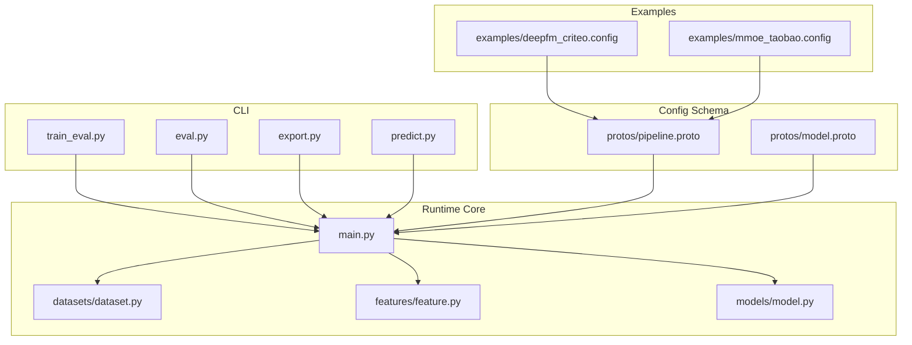
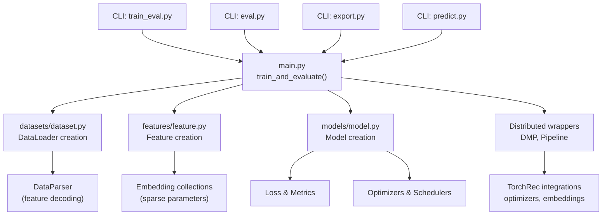
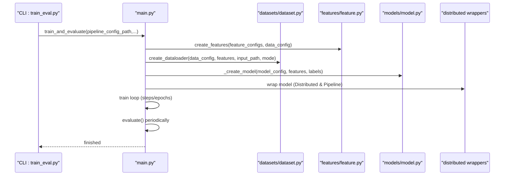
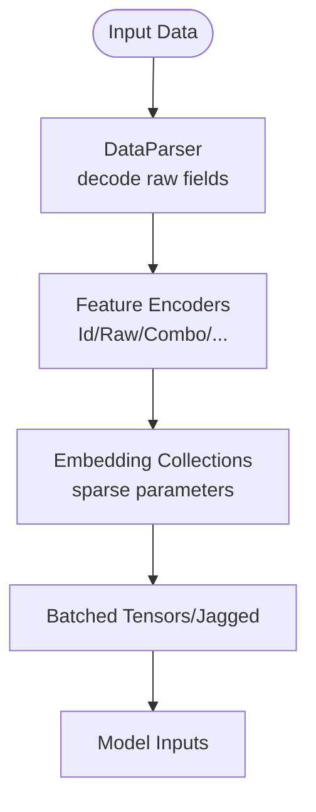
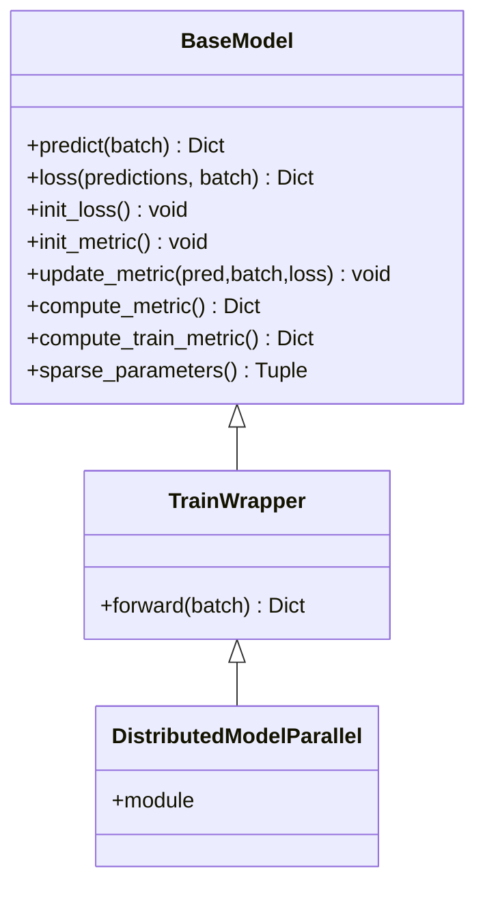
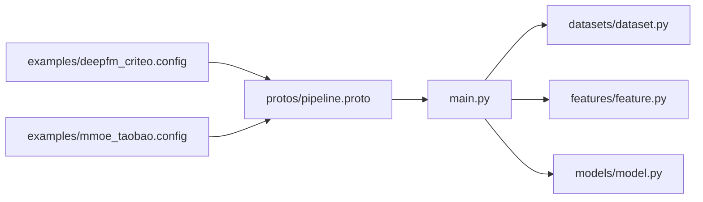
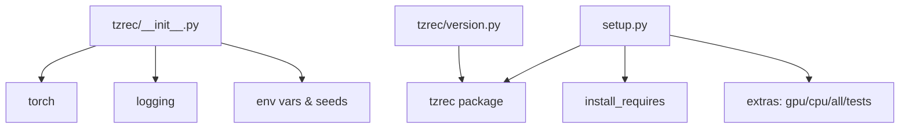

# Introduction and Overview

<cite>
**Referenced Files in This Document**
- [README.md](file://README.md)
- [docs/source/intro.md](file://docs/source/intro.md)
- [tzrec/__init__.py](file://tzrec/__init__.py)
- [setup.py](file://setup.py)
- [tzrec/version.py](file://tzrec/version.py)
- [tzrec/main.py](file://tzrec/main.py)
- [tzrec/train_eval.py](file://tzrec/train_eval.py)
- [tzrec/eval.py](file://tzrec/eval.py)
- [tzrec/export.py](file://tzrec/export.py)
- [tzrec/predict.py](file://tzrec/predict.py)
- [tzrec/models/model.py](file://tzrec/models/model.py)
- [tzrec/features/feature.py](file://tzrec/features/feature.py)
- [tzrec/datasets/dataset.py](file://tzrec/datasets/dataset.py)
- [examples/deepfm_criteo.config](file://examples/deepfm_criteo.config)
- [examples/mmoe_taobao.config](file://examples/mmoe_taobao.config)
- [tzrec/protos/pipeline.proto](file://tzrec/protos/pipeline.proto)
- [tzrec/protos/model.proto](file://tzrec/protos/model.proto)
</cite>

## Table of Contents

1. [Introduction](#introduction)
1. [Project Structure](#project-structure)
1. [Core Components](#core-components)
1. [Architecture Overview](#architecture-overview)
1. [Detailed Component Analysis](#detailed-component-analysis)
1. [Dependency Analysis](#dependency-analysis)
1. [Performance Considerations](#performance-considerations)
1. [Troubleshooting Guide](#troubleshooting-guide)
1. [Conclusion](#conclusion)

## Introduction

TorchEasyRec is an easy-to-use framework for building recommendation systems. It focuses on practical, production-ready workflows for modern recommendation tasks including candidate generation (matching), scoring (ranking), multi-task learning, and generative recommendation. The framework emphasizes simplicity through flexible configuration, robust feature engineering, and efficient execution powered by PyTorch and the TorchRec ecosystem.

Key benefits:

- Run everywhere: local, PAI-DLC, PAI-DSW, and EMR environments
- Diversified input data support: MaxCompute tables, OSS, CSV, and Parquet
- Easy-to-use: flexible feature and model configuration, straightforward deployment to EAS
- Fast and robust: efficient feature generation, large-scale embedding with sharding, hybrid data-parallelism/model-parallelism, optimized kernels for RecSys, mixed precision, and consistency between training and serving
- Rich feature set and models: extensive built-in features and a broad collection of state-of-the-art models

Practical examples demonstrate the framework’s versatility across domains and scales, from small local runs to large-scale distributed training on cloud platforms.

**Section sources**

- \[README.md\](file://README.md#L1-L83)
- \[docs/source/intro.md\](file://docs/source/intro.md#L1-L80)

## Project Structure

At a high level, TorchEasyRec organizes functionality into:

- CLI entry points for training, evaluation, exporting, and prediction
- Core runtime modules for datasets, features, models, and distributed execution
- Protobuf-based configuration schema for pipelines, data, features, and models
- Example configurations showcasing real-world scenarios

**Diagram sources**

- \[tzrec/train_eval.py\](file://tzrec/train_eval.py#L1-L73)
- \[tzrec/eval.py\](file://tzrec/eval.py#L1-L51)
- \[tzrec/export.py\](file://tzrec/export.py#L1-L51)
- \[tzrec/predict.py\](file://tzrec/predict.py#L1-L144)
- \[tzrec/main.py\](file://tzrec/main.py#L527-L737)
- \[tzrec/datasets/dataset.py\](file://tzrec/datasets/dataset.py#L1-L200)
- \[tzrec/features/feature.py\](file://tzrec/features/feature.py#L1-L200)
- \[tzrec/models/model.py\](file://tzrec/models/model.py#L1-L200)
- \[tzrec/protos/pipeline.proto\](file://tzrec/protos/pipeline.proto#L1-L30)
- \[tzrec/protos/model.proto\](file://tzrec/protos/model.proto#L1-L90)
- \[examples/deepfm_criteo.config\](file://examples/deepfm_criteo.config#L1-L200)
- \[examples/mmoe_taobao.config\](file://examples/mmoe_taobao.config#L1-L200)

**Section sources**

- \[tzrec/train_eval.py\](file://tzrec/train_eval.py#L1-L73)
- \[tzrec/eval.py\](file://tzrec/eval.py#L1-L51)
- \[tzrec/export.py\](file://tzrec/export.py#L1-L51)
- \[tzrec/predict.py\](file://tzrec/predict.py#L1-L144)
- \[tzrec/main.py\](file://tzrec/main.py#L527-L737)
- \[tzrec/datasets/dataset.py\](file://tzrec/datasets/dataset.py#L1-L200)
- \[tzrec/features/feature.py\](file://tzrec/features/feature.py#L1-L200)
- \[tzrec/models/model.py\](file://tzrec/models/model.py#L1-L200)
- \[tzrec/protos/pipeline.proto\](file://tzrec/protos/pipeline.proto#L1-L30)
- \[tzrec/protos/model.proto\](file://tzrec/protos/model.proto#L1-L90)
- \[examples/deepfm_criteo.config\](file://examples/deepfm_criteo.config#L1-L200)
- \[examples/mmoe_taobao.config\](file://examples/mmoe_taobao.config#L1-L200)

## Core Components

- CLI entry points: thin argument parsers that delegate to the main training, evaluation, export, and prediction routines
- Runtime core:
  - Datasets: unified data loading, parsing, and sampling pipeline supporting multiple formats and modes
  - Features: modular feature encoders and embedding collections enabling diverse feature types and sharding strategies
  - Models: extensible model base with standardized predict/loss/metric interfaces and distributed training wrappers
- Protobuf configuration: strongly typed schema for pipeline, data, features, and models, enabling declarative experimentation and deployment
- Examples: ready-to-run configurations for common scenarios (e.g., DeepFM on Criteo-style data, MMoE on Taobao-style multi-task data)

These components work together to provide a consistent developer experience across environments and tasks.

**Section sources**

- \[tzrec/train_eval.py\](file://tzrec/train_eval.py#L1-L73)
- \[tzrec/eval.py\](file://tzrec/eval.py#L1-L51)
- \[tzrec/export.py\](file://tzrec/export.py#L1-L51)
- \[tzrec/predict.py\](file://tzrec/predict.py#L1-L144)
- \[tzrec/main.py\](file://tzrec/main.py#L527-L737)
- \[tzrec/datasets/dataset.py\](file://tzrec/datasets/dataset.py#L1-L200)
- \[tzrec/features/feature.py\](file://tzrec/features/feature.py#L1-L200)
- \[tzrec/models/model.py\](file://tzrec/models/model.py#L1-L200)
- \[tzrec/protos/pipeline.proto\](file://tzrec/protos/pipeline.proto#L1-L30)
- \[tzrec/protos/model.proto\](file://tzrec/protos/model.proto#L1-L90)

## Architecture Overview

The framework integrates PyTorch and TorchRec to deliver scalable, efficient recommendation pipelines. The runtime orchestrates data ingestion, feature generation, model training/evaluation, and export/prediction, leveraging distributed execution and optimized kernels.

**Diagram sources**

- \[tzrec/train_eval.py\](file://tzrec/train_eval.py#L1-L73)
- \[tzrec/eval.py\](file://tzrec/eval.py#L1-L51)
- \[tzrec/export.py\](file://tzrec/export.py#L1-L51)
- \[tzrec/predict.py\](file://tzrec/predict.py#L1-L144)
- \[tzrec/main.py\](file://tzrec/main.py#L527-L737)
- \[tzrec/datasets/dataset.py\](file://tzrec/datasets/dataset.py#L1-L200)
- \[tzrec/features/feature.py\](file://tzrec/features/feature.py#L1-L200)
- \[tzrec/models/model.py\](file://tzrec/models/model.py#L1-L200)

## Detailed Component Analysis

### Training and Evaluation Orchestration

The training loop coordinates dataset creation, model instantiation, distributed execution, optimizer scheduling, and periodic evaluation. It supports mixed precision, profiling, and checkpointing.

**Diagram sources**

- \[tzrec/train_eval.py\](file://tzrec/train_eval.py#L1-L73)
- \[tzrec/main.py\](file://tzrec/main.py#L527-L737)
- \[tzrec/datasets/dataset.py\](file://tzrec/datasets/dataset.py#L1-L200)
- \[tzrec/features/feature.py\](file://tzrec/features/feature.py#L1-L200)
- \[tzrec/models/model.py\](file://tzrec/models/model.py#L1-L200)

**Section sources**

- \[tzrec/main.py\](file://tzrec/main.py#L527-L737)
- \[tzrec/train_eval.py\](file://tzrec/train_eval.py#L1-L73)

### Feature Engineering Pipeline

Features are parsed, encoded, and prepared for embedding collections. The system supports diverse input types and formats, including feature groups and sequence encoders.

**Diagram sources**

- \[tzrec/datasets/dataset.py\](file://tzrec/datasets/dataset.py#L1-L200)
- \[tzrec/features/feature.py\](file://tzrec/features/feature.py#L1-L200)

**Section sources**

- \[tzrec/datasets/dataset.py\](file://tzrec/datasets/dataset.py#L1-L200)
- \[tzrec/features/feature.py\](file://tzrec/features/feature.py#L1-L200)

### Model Abstractions and Distributed Execution

Models implement a common interface for prediction, loss computation, and metrics. Distributed wrappers enable hybrid data-parallelism and model-parallelism, integrating with TorchRec optimizers and embedding modules.

**Diagram sources**

- \[tzrec/models/model.py\](file://tzrec/models/model.py#L1-L200)
- \[tzrec/main.py\](file://tzrec/main.py#L629-L663)

**Section sources**

- \[tzrec/models/model.py\](file://tzrec/models/model.py#L1-L200)
- \[tzrec/main.py\](file://tzrec/main.py#L629-L663)

### Practical Examples and Performance Advantages

- DeepFM on Criteo-style data demonstrates efficient feature configuration and large-scale embedding usage
- MMoE on Taobao-style multi-task data showcases multi-target modeling and feature grouping

These examples highlight:

- Flexible configuration via protobuf-based pipeline and model configs
- Scalable training across environments (local, cloud)
- Strong performance characteristics enabled by optimized kernels and mixed precision

**Diagram sources**

- \[examples/deepfm_criteo.config\](file://examples/deepfm_criteo.config#L1-L200)
- \[examples/mmoe_taobao.config\](file://examples/mmoe_taobao.config#L1-L200)
- \[tzrec/protos/pipeline.proto\](file://tzrec/protos/pipeline.proto#L1-L30)
- \[tzrec/main.py\](file://tzrec/main.py#L527-L737)
- \[tzrec/datasets/dataset.py\](file://tzrec/datasets/dataset.py#L1-L200)
- \[tzrec/features/feature.py\](file://tzrec/features/feature.py#L1-L200)
- \[tzrec/models/model.py\](file://tzrec/models/model.py#L1-L200)

**Section sources**

- \[examples/deepfm_criteo.config\](file://examples/deepfm_criteo.config#L1-L200)
- \[examples/mmoe_taobao.config\](file://examples/mmoe_taobao.config#L1-L200)
- \[tzrec/protos/pipeline.proto\](file://tzrec/protos/pipeline.proto#L1-L30)
- \[tzrec/main.py\](file://tzrec/main.py#L527-L737)

## Dependency Analysis

The framework’s runtime depends on PyTorch and TorchRec for distributed training, optimizers, and embedding modules. The initialization script sets environment variables and seeds for reproducibility and registers external filesystems. The package metadata defines supported Python versions and optional extras for GPU/CPU environments.

**Diagram sources**

- \[tzrec/__init__.py\](file://tzrec/__init__.py#L1-L73)
- \[setup.py\](file://setup.py#L1-L85)
- \[tzrec/version.py\](file://tzrec/version.py#L1-L13)

**Section sources**

- \[tzrec/__init__.py\](file://tzrec/__init__.py#L1-L73)
- \[setup.py\](file://setup.py#L1-L85)
- \[tzrec/version.py\](file://tzrec/version.py#L1-L13)

## Performance Considerations

- Mixed precision and optimized kernels for RecSys accelerate training and inference
- Hybrid data-parallelism/model-parallelism enables scaling across devices
- Large-scale embedding with configurable sharding strategies supports massive vocabularies
- Consistency between training and serving ensures reliable deployment
- Profiling and TensorBoard summaries facilitate performance debugging

[No sources needed since this section provides general guidance]

## Troubleshooting Guide

Common operational tips:

- Verify environment variables and seed settings for reproducibility
- Confirm pipeline configuration paths and model directories
- Check dataset availability and format compatibility
- Review logs and summaries for training progress and anomalies

**Section sources**

- \[tzrec/__init__.py\](file://tzrec/__init__.py#L48-L64)
- \[tzrec/main.py\](file://tzrec/main.py#L566-L570)

## Conclusion

TorchEasyRec delivers a cohesive, production-focused recommendation framework that combines flexibility and performance. Its configuration-driven design, strong integration with PyTorch and TorchRec, and broad model and feature coverage make it suitable for practitioners at all levels. Whether you are experimenting locally or deploying at scale, TorchEasyRec streamlines the journey from data to model to production.

[No sources needed since this section summarizes without analyzing specific files]
