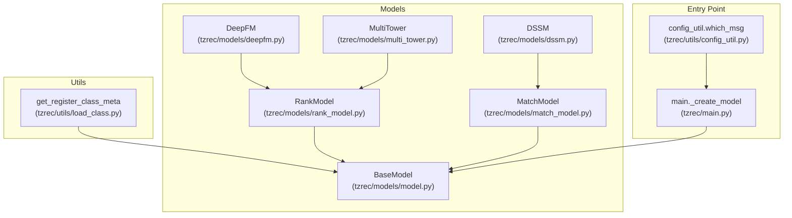
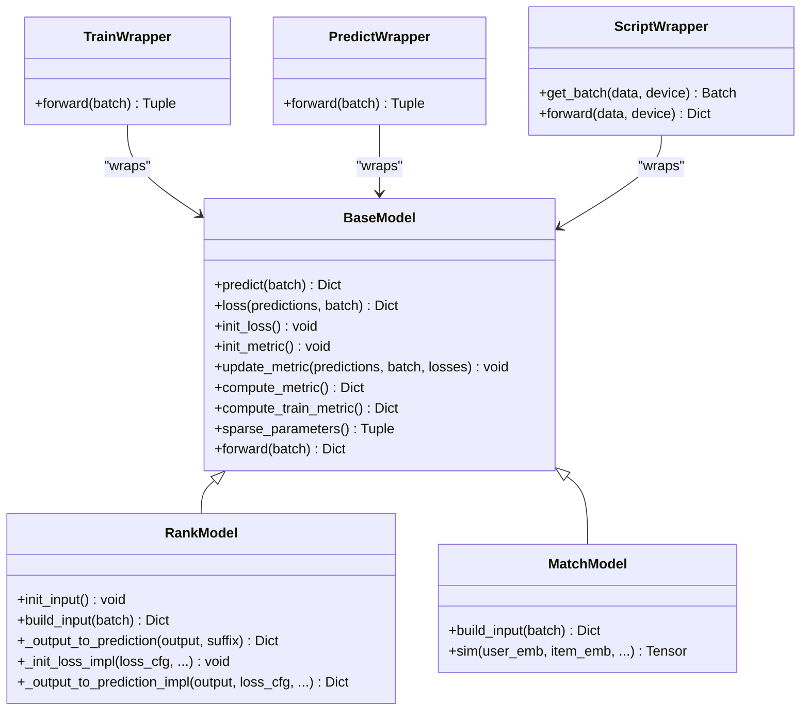
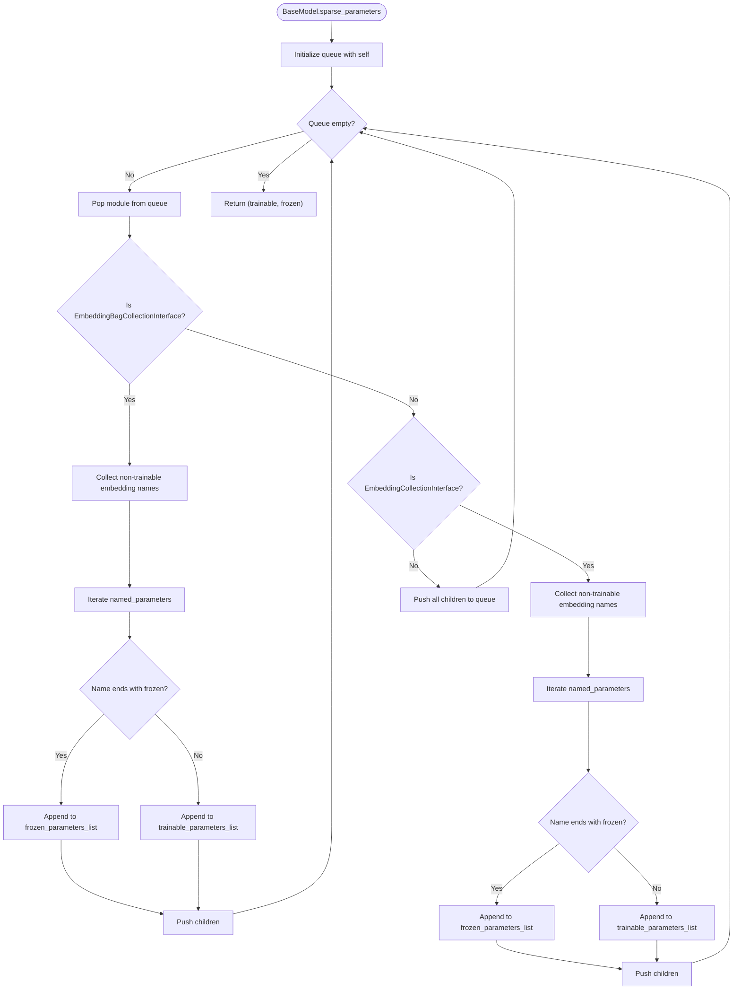
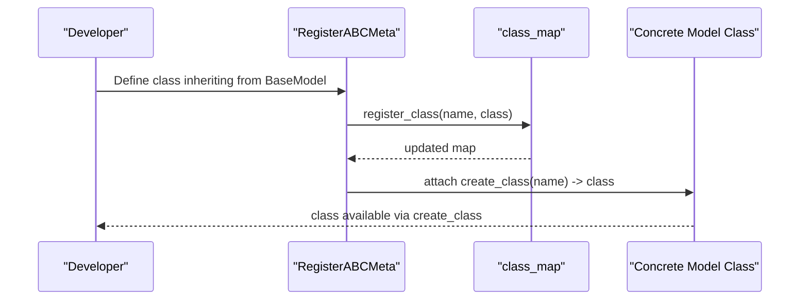
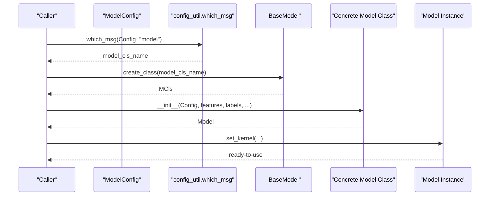
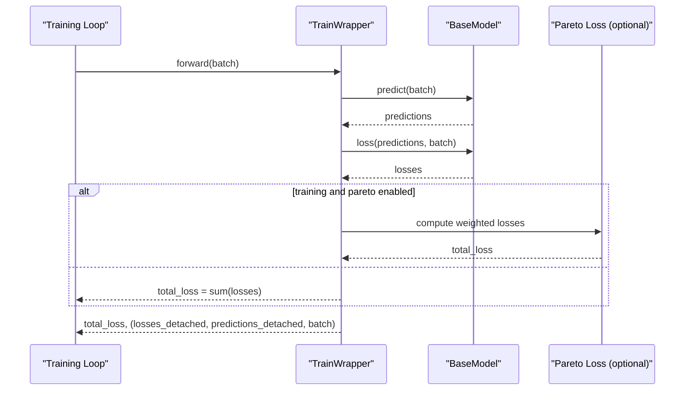
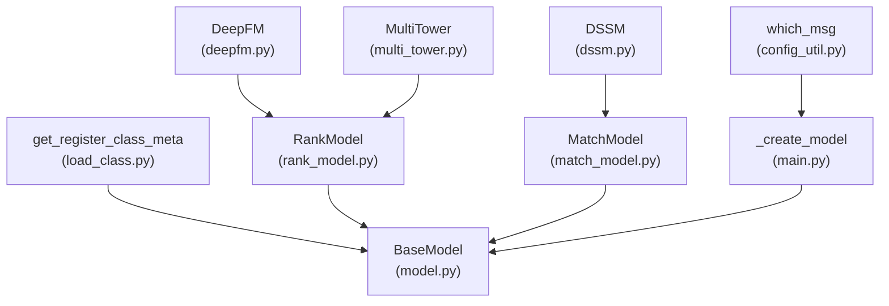

# Base Model System and Factory Pattern

<cite>
**Referenced Files in This Document**
- [model.py](file://tzrec/models/model.py)
- [load_class.py](file://tzrec/utils/load_class.py)
- [rank_model.py](file://tzrec/models/rank_model.py)
- [match_model.py](file://tzrec/models/match_model.py)
- [deepfm.py](file://tzrec/models/deepfm.py)
- [multi_tower.py](file://tzrec/models/multi_tower.py)
- [dssm.py](file://tzrec/models/dssm.py)
- [main.py](file://tzrec/main.py)
- [config_util.py](file://tzrec/utils/config_util.py)
</cite>

## Table of Contents

1. [Introduction](#introduction)
1. [Project Structure](#project-structure)
1. [Core Components](#core-components)
1. [Architecture Overview](#architecture-overview)
1. [Detailed Component Analysis](#detailed-component-analysis)
1. [Dependency Analysis](#dependency-analysis)
1. [Performance Considerations](#performance-considerations)
1. [Troubleshooting Guide](#troubleshooting-guide)
1. [Conclusion](#conclusion)

## Introduction

This document explains the base model system and factory pattern implementation in TorchEasyRec. It focuses on the BaseModel class architecture, the registration mechanism via get_register_class_meta, the factory pattern enabling dynamic model instantiation from configuration, model type detection, and the relationship between model configurations and concrete implementations. It also covers the abstract methods that all models must implement (predict, loss, init_loss, init_metric, update_metric), the metric and loss management systems, parameter grouping for sparse/frozen parameters, and the wrapper classes (TrainWrapper, PredictWrapper, ScriptWrapper) that handle training, prediction, and JIT-scripted inference modes. Finally, it documents model interface contracts, parameter sharing strategies, and consistency mechanisms across different model types.

## Project Structure

The base model system resides primarily under tzrec/models and is complemented by the registration utilities in tzrec/utils. The main orchestration for model creation from configuration occurs in the CLI entry point.

**Diagram sources**

- \[model.py\](file://tzrec/models/model.py#L39-L216)
- \[load_class.py\](file://tzrec/utils/load_class.py#L117-L145)
- \[rank_model.py\](file://tzrec/models/rank_model.py#L56-L200)
- \[match_model.py\](file://tzrec/models/match_model.py#L110-L200)
- \[deepfm.py\](file://tzrec/models/deepfm.py#L26-L109)
- \[multi_tower.py\](file://tzrec/models/multi_tower.py#L25-L86)
- \[dssm.py\](file://tzrec/models/dssm.py#L86-L156)
- \[main.py\](file://tzrec/main.py#L126-L158)
- \[config_util.py\](file://tzrec/utils/config_util.py#L73-L76)

**Section sources**

- \[model.py\](file://tzrec/models/model.py#L39-L216)
- \[load_class.py\](file://tzrec/utils/load_class.py#L117-L145)
- \[main.py\](file://tzrec/main.py#L126-L158)
- \[config_util.py\](file://tzrec/utils/config_util.py#L73-L76)

## Core Components

- BaseModel: The foundational class that defines the contract for all models, including abstract methods (predict, loss, init_loss, init_metric, update_metric), metric and loss management, and parameter grouping for sparse/frozen embeddings.
- Registration MetaClass: A registration mechanism that automatically registers model classes into a class map using get_register_class_meta, enabling dynamic lookup by name.
- Factory Function: \_create_model in main.py uses configuration-driven model type detection to instantiate the appropriate model subclass.
- Wrapper Classes: TrainWrapper, PredictWrapper, and ScriptWrapper encapsulate training/prediction/inference concerns and handle device placement, autocast, and output formatting.

Key responsibilities:

- Abstract method contract ensures consistent behavior across models.
- Metric and loss modules are initialized and managed centrally.
- Parameter grouping supports sparse/frozen embedding parameters for efficient optimization.
- Wrappers standardize execution modes and device handling.

**Section sources**

- \[model.py\](file://tzrec/models/model.py#L39-L216)
- \[load_class.py\](file://tzrec/utils/load_class.py#L117-L145)
- \[main.py\](file://tzrec/main.py#L126-L158)

## Architecture Overview

The system uses a layered architecture:

- Base layer: BaseModel defines the interface and shared utilities.
- Domain-specific layers: RankModel and MatchModel extend BaseModel for ranking and matching tasks respectively.
- Concrete models: Implementations like DeepFM, MultiTower, and DSSM inherit from domain-specific base classes.
- Factory: \_create_model resolves the model class by name from configuration and constructs the model instance.
- Wrappers: Encapsulate training, prediction, and script inference with device and precision handling.

**Diagram sources**

- \[model.py\](file://tzrec/models/model.py#L39-L216)
- \[rank_model.py\](file://tzrec/models/rank_model.py#L56-L200)
- \[match_model.py\](file://tzrec/models/match_model.py#L110-L200)

## Detailed Component Analysis

### BaseModel: Foundation and Contracts

BaseModel centralizes:

- Abstract methods that subclasses must implement:
  - predict: produce model outputs given a Batch.
  - loss: compute per-task losses from predictions and batch.
  - init_loss: initialize internal loss modules.
  - init_metric: initialize internal metric modules.
  - update_metric: update metric states using predictions, batch, and optional losses.
- Metric and loss management:
  - Maintains ModuleDicts for metrics and losses.
  - Provides compute_metric and compute_train_metric helpers.
  - Internal helpers to initialize and update loss-based metrics.
- Parameter grouping:
  - Traverses module tree to separate trainable vs frozen parameters for sparse embeddings.
- Feature grouping:
  - Selects features according to feature groups for consistent input ordering.

**Diagram sources**

- \[model.py\](file://tzrec/models/model.py#L140-L179)

**Section sources**

- \[model.py\](file://tzrec/models/model.py#L39-L216)

### Registration Mechanism: get_register_class_meta

The registration system:

- Defines a metaclass RegisterABCMeta that registers each newly defined class into a shared class_map.
- Exposes a create_class static method on the generated classes to resolve a registered class by name.
- Used by BaseModel to enable dynamic model instantiation by name.

**Diagram sources**

- \[load_class.py\](file://tzrec/utils/load_class.py#L117-L145)
- \[model.py\](file://tzrec/models/model.py#L35-L36)

**Section sources**

- \[load_class.py\](file://tzrec/utils/load_class.py#L117-L145)
- \[model.py\](file://tzrec/models/model.py#L35-L36)

### Factory Pattern: Dynamic Model Instantiation

The factory pattern is implemented in main.\_create_model:

- Detects the model type from ModelConfig using config_util.which_msg.
- Resolves the concrete class via BaseModel.create_class.
- Constructs the model with features, labels, and optional sampler_type.

**Diagram sources**

- \[main.py\](file://tzrec/main.py#L126-L158)
- \[config_util.py\](file://tzrec/utils/config_util.py#L73-L76)
- \[model.py\](file://tzrec/models/model.py#L35-L36)

**Section sources**

- \[main.py\](file://tzrec/main.py#L126-L158)
- \[config_util.py\](file://tzrec/utils/config_util.py#L73-L76)

### Model Type Detection and Configuration Relationship

- Model type detection: config_util.which_msg reads the oneof discriminator to extract the model class name from ModelConfig.
- Configuration-to-implementation mapping: The registered class map ensures that the model name in the config corresponds to a concrete class definition.

Practical implication:

- Adding a new model requires defining a class that inherits from BaseModel (or a subclass) so it gets registered automatically.

**Section sources**

- \[config_util.py\](file://tzrec/utils/config_util.py#L73-L76)
- \[model.py\](file://tzrec/models/model.py#L35-L36)

### Abstract Methods and Implementation Examples

All models must implement:

- predict(batch): return a dict of tensors for downstream consumers.
- loss(predictions, batch): return a dict of scalar losses keyed by loss type.
- init_loss(): initialize loss modules.
- init_metric(): initialize metric modules.
- update_metric(predictions, batch, losses): update internal metric states.

Examples from concrete models:

- DeepFM (RankModel): Implements predict to compute wide, deep, and FM branches and returns classification outputs.
- MultiTower (RankModel): Implements predict to combine per-tower MLP outputs.
- DSSM (MatchModel): Implements predict to compute user/item embeddings and similarity scores.

These examples demonstrate how the abstract contract is fulfilled while leveraging shared utilities from RankModel and MatchModel.

**Section sources**

- \[deepfm.py\](file://tzrec/models/deepfm.py#L72-L109)
- \[multi_tower.py\](file://tzrec/models/multi_tower.py#L65-L86)
- \[dssm.py\](file://tzrec/models/dssm.py#L129-L156)
- \[rank_model.py\](file://tzrec/models/rank_model.py#L56-L200)
- \[match_model.py\](file://tzrec/models/match_model.py#L110-L200)

### Metric and Loss Management Systems

- Loss initialization and update:
  - BaseModel provides \_init_loss_metric_impl and \_update_loss_metric_impl to manage MeanMetric entries for each loss type.
- Metric computation:
  - compute_metric iterates metric modules, computes values, resets state, and returns aggregated results.
  - compute_train_metric returns computed but does not reset, suitable for periodic reporting during training.
- RankModel integrates loss initialization and prediction-to-probability conversions for various loss types.

**Section sources**

- \[model.py\](file://tzrec/models/model.py#L185-L202)
- \[model.py\](file://tzrec/models/model.py#L121-L138)
- \[rank_model.py\](file://tzrec/models/rank_model.py#L182-L200)

### Parameter Grouping for Sparse/Frozen Parameters

BaseModel.sparse_parameters traverses the module tree:

- Identifies EmbeddingBagCollectionInterface and EmbeddingCollectionInterface modules.
- Collects non-trainable embedding weights and separates them from trainable parameters.
- Returns two lists: trainable_parameters_list and frozen_parameters_list.

This enables:

- Efficient optimizer selection by grouping sparse/frozen parameters separately.
- Consistent behavior across different model types that use sparse embeddings.

**Section sources**

- \[model.py\](file://tzrec/models/model.py#L140-L179)

### Wrapper Classes: Execution Modes

- TrainWrapper:
  - Calls model.predict and model.loss.
  - Supports mixed precision autocast.
  - Optionally applies Pareto-efficient multi-task weighting when configured.
  - Returns detached predictions and losses alongside total loss.
- PredictWrapper:
  - Performs inference with autocast and optional output column filtering.
  - Ensures results are moved to CPU when running on CUDA.
- ScriptWrapper:
  - Builds a DataParser from features and sampler_type.
  - Converts input dicts to Batch and runs model.predict.

**Diagram sources**

- \[model.py\](file://tzrec/models/model.py#L222-L284)

**Section sources**

- \[model.py\](file://tzrec/models/model.py#L222-L390)

### Model Interface Contracts and Consistency

- Contract enforcement:
  - BaseModel enforces abstract methods and provides shared utilities for metric/loss management and parameter grouping.
  - RankModel and MatchModel add domain-specific behavior while preserving the same external interface for training and prediction.
- Consistency across model types:
  - All models return predictions as a dict and accept a Batch input.
  - Loss and metric modules are initialized consistently via init_loss and init_metric.
  - Parameter grouping ensures sparse/frozen parameters are handled uniformly.

**Section sources**

- \[model.py\](file://tzrec/models/model.py#L39-L216)
- \[rank_model.py\](file://tzrec/models/rank_model.py#L56-L200)
- \[match_model.py\](file://tzrec/models/match_model.py#L110-L200)

## Dependency Analysis

The following diagram highlights the key dependencies among the base model system, registration, and factory:

**Diagram sources**

- \[load_class.py\](file://tzrec/utils/load_class.py#L117-L145)
- \[model.py\](file://tzrec/models/model.py#L39-L216)
- \[rank_model.py\](file://tzrec/models/rank_model.py#L56-L200)
- \[match_model.py\](file://tzrec/models/match_model.py#L110-L200)
- \[deepfm.py\](file://tzrec/models/deepfm.py#L26-L109)
- \[multi_tower.py\](file://tzrec/models/multi_tower.py#L25-L86)
- \[dssm.py\](file://tzrec/models/dssm.py#L86-L156)
- \[config_util.py\](file://tzrec/utils/config_util.py#L73-L76)
- \[main.py\](file://tzrec/main.py#L126-L158)

**Section sources**

- \[load_class.py\](file://tzrec/utils/load_class.py#L117-L145)
- \[model.py\](file://tzrec/models/model.py#L39-L216)
- \[main.py\](file://tzrec/main.py#L126-L158)

## Performance Considerations

- Mixed precision: TrainWrapper and PredictWrapper support FP16/BF16 autocast to reduce memory footprint and improve throughput.
- Pareto-efficient multi-task loss: When enabled, TrainWrapper can dynamically weight multi-task losses to stabilize training.
- Device placement: PredictWrapper moves results to CPU on CUDA to avoid GPU memory overhead during post-processing.
- Parameter grouping: Separating trainable and frozen parameters allows for targeted optimizer updates and reduces unnecessary gradient computations on frozen embeddings.

[No sources needed since this section provides general guidance]

## Troubleshooting Guide

Common issues and resolutions:

- Model class not found:
  - Ensure the model class is imported so that get_register_class_meta can register it. The auto-import mechanism scans predefined directories; user-defined models should be placed accordingly.
- Incorrect model type in configuration:
  - Verify that the model’s oneof discriminator matches the registered class name resolved by BaseModel.create_class.
- Metric/loss mismatch:
  - Confirm that init_loss and init_metric are called before training/prediction loops and that update_metric receives the correct keys.
- Sparse parameter grouping anomalies:
  - Check that embedding modules implement EmbeddingBagCollectionInterface or EmbeddingCollectionInterface so that BaseModel.sparse_parameters can detect frozen parameters.

**Section sources**

- \[load_class.py\](file://tzrec/utils/load_class.py#L53-L100)
- \[model.py\](file://tzrec/models/model.py#L35-L36)
- \[model.py\](file://tzrec/models/model.py#L84-L119)

## Conclusion

TorchEasyRec’s base model system and factory pattern provide a robust, extensible framework for model development and deployment. BaseModel defines a consistent interface and shared utilities, get_register_class_meta enables automatic registration and dynamic resolution, and \_create_model bridges configuration to concrete implementations. The wrapper classes standardize execution across training, prediction, and scripted inference, while metric/loss management and parameter grouping ensure correctness and performance. Together, these components maintain consistency across diverse model types and simplify configuration-driven model creation.
