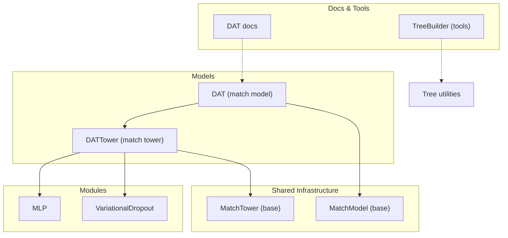
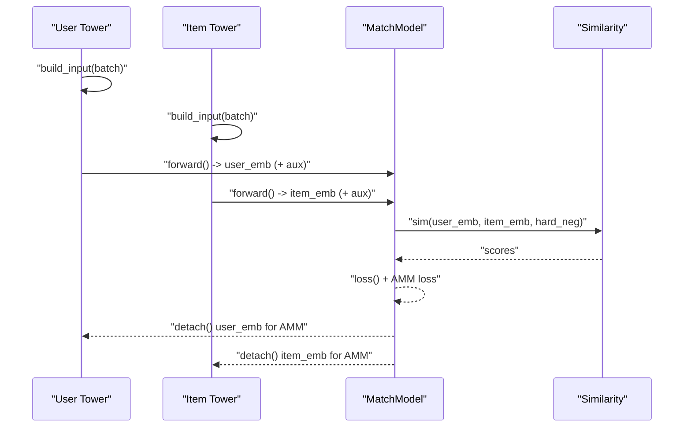
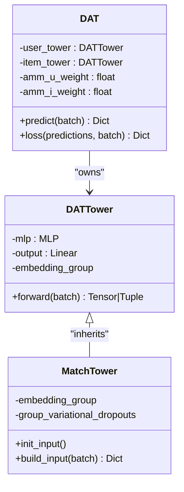
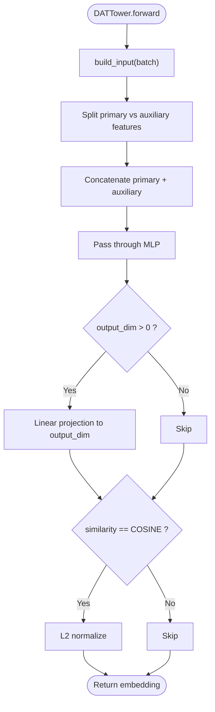
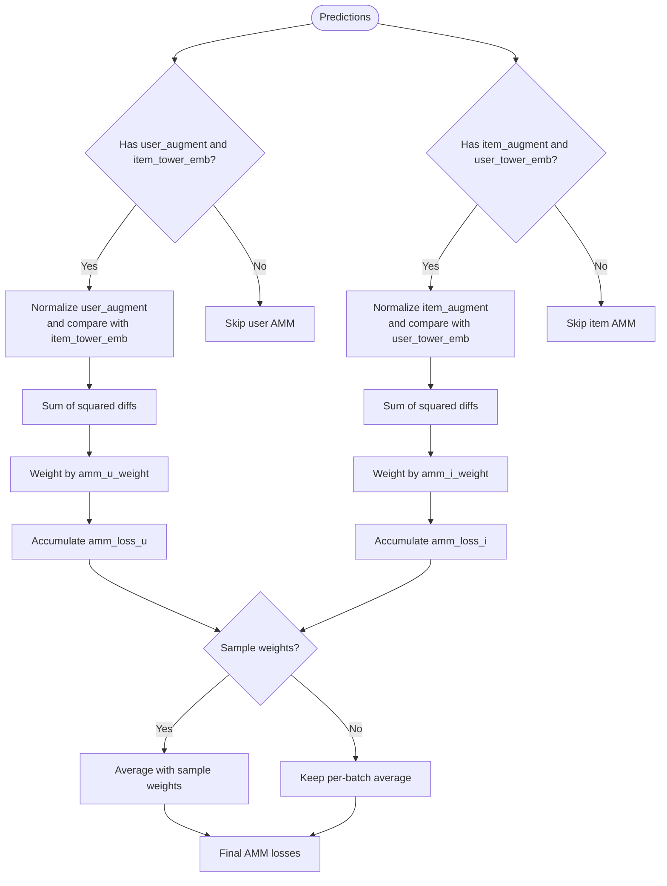
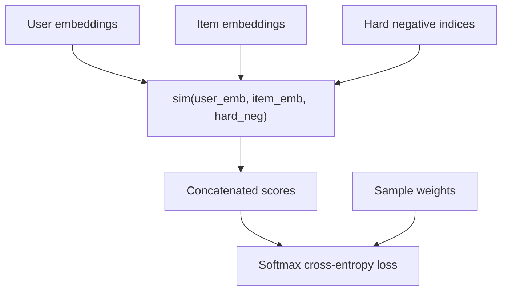
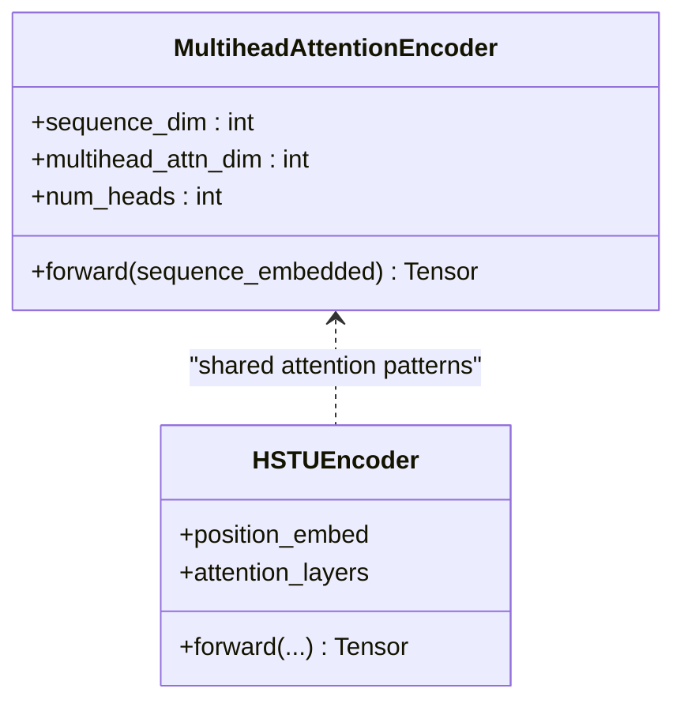
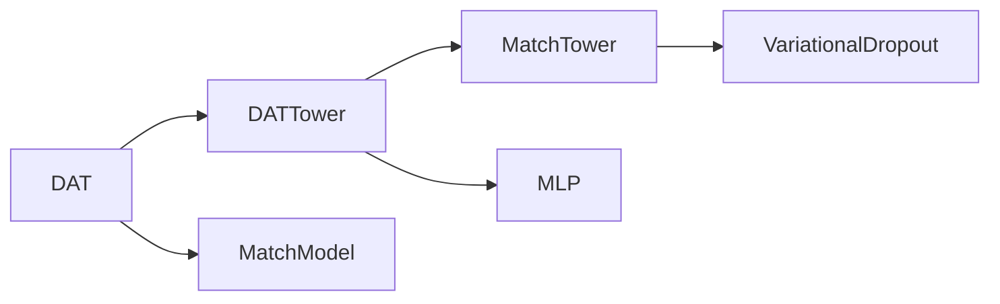

# DAT (Deep Attention Tree Matching)

<cite>
**Referenced Files in This Document**
- [dat.py](file://tzrec/models/dat.py)
- [match_model.py](file://tzrec/models/match_model.py)
- [dat.md](file://docs/source/models/dat.md)
- [tree_builder.py](file://tzrec/tools/tdm/gen_tree/tree_builder.py)
- [sequence.py](file://tzrec/modules/sequence.py)
- [hstu.py](file://tzrec/modules/hstu.py)
- [hstu_attention_test.py](file://tzrec/ops/hstu_attention_test.py)
- [tirhon_hstu_attention.py](file://tzrec/ops/_triton/triton_hstu_attention.py)
- [variational_dropout.py](file://tzrec/modules/variational_dropout.py)
</cite>

## Table of Contents

1. [Introduction](#introduction)
1. [Project Structure](#project-structure)
1. [Core Components](#core-components)
1. [Architecture Overview](#architecture-overview)
1. [Detailed Component Analysis](#detailed-component-analysis)
1. [Dependency Analysis](#dependency-analysis)
1. [Performance Considerations](#performance-considerations)
1. [Troubleshooting Guide](#troubleshooting-guide)
1. [Conclusion](#conclusion)
1. [Appendices](#appendices)

## Introduction

This document explains the DAT (Deep Attention Tree Matching) model implementation in TorchEasyRec. DAT extends a dual-tower matching architecture by introducing auxiliary embeddings per tower to improve user-item interaction learning via an Adaptive-Mimic Mechanism (AMM). While the current DAT implementation focuses on dual towers and AMM loss, it is designed to integrate with broader matching and ranking stacks. The documentation covers:

- How DAT structures user and item towers with auxiliary embeddings
- The AMM loss formulation and its role during training
- Similarity computation and negative sampling integration
- Practical configuration guidance for attention-like modules and tree-aware components
- Training methodology, complexity considerations, and optimization strategies

Note: The current DAT implementation does not implement explicit tree convolution or multi-head attention on tree structures. Instead, it leverages auxiliary embeddings and attention-style modules elsewhere in the stack (e.g., sequence encoders and HSTU attention) to inform the design of attention-based matching.

## Project Structure

The DAT model resides in the models package and integrates with shared matching infrastructure. Auxiliary embeddings are fed through MLP towers, and the AMM loss encourages alignment between auxiliary vectors and the opposite tower’s representation.

**Diagram sources**

- \[dat.py\](file://tzrec/models/dat.py#L109-L260)
- \[match_model.py\](file://tzrec/models/match_model.py#L110-L191)
- \[dat.md\](file://docs/source/models/dat.md#L1-L86)
- \[tree_builder.py\](file://tzrec/tools/tdm/gen_tree/tree_builder.py#L69-L147)

**Section sources**

- \[dat.py\](file://tzrec/models/dat.py#L109-L260)
- \[match_model.py\](file://tzrec/models/match_model.py#L225-L451)
- \[dat.md\](file://docs/source/models/dat.md#L1-L86)

## Core Components

- DAT (match model): orchestrates dual towers, computes similarity, and aggregates AMM loss.
- DATTower (match tower): builds concatenated embeddings from primary and auxiliary feature groups, applies MLP, and optionally normalizes for cosine similarity.
- MatchTower (base): manages embedding groups, optional variational dropout, and input building.
- MatchModel (base): defines similarity computation, loss initialization, and metrics.

Key behaviors:

- Dual towers produce embeddings; optional cosine normalization is applied.
- AMM loss aligns auxiliary embeddings with the opposite tower’s embedding.
- Similarity supports in-batch negatives and hard negatives via a unified interface.

**Section sources**

- \[dat.py\](file://tzrec/models/dat.py#L39-L107)
- \[dat.py\](file://tzrec/models/dat.py#L109-L260)
- \[match_model.py\](file://tzrec/models/match_model.py#L110-L191)
- \[match_model.py\](file://tzrec/models/match_model.py#L225-L451)

## Architecture Overview

The DAT architecture composes two towers (user and item), each with:

- A primary feature group (DEEP) processed by an embedding group and MLP
- An auxiliary feature group (DEEP) that mirrors the identity of the primary group (e.g., user_id or item_id) to form an auxiliary vector
- Optional cosine normalization for similarity
- AMM loss that encourages auxiliary vectors to mimic the opposite tower’s embedding

**Diagram sources**

- \[dat.py\](file://tzrec/models/dat.py#L168-L211)
- \[dat.py\](file://tzrec/models/dat.py#L212-L259)
- \[match_model.py\](file://tzrec/models/match_model.py#L253-L263)

## Detailed Component Analysis

### DAT Model

- Dual towers initialized with separate primary and auxiliary feature groups.
- During training, auxiliary embeddings are returned alongside embeddings for computing AMM loss.
- Temperature scaling and similarity normalization are applied before computing cross-entropy loss.

**Diagram sources**

- \[dat.py\](file://tzrec/models/dat.py#L39-L107)
- \[dat.py\](file://tzrec/models/dat.py#L109-L260)
- \[match_model.py\](file://tzrec/models/match_model.py#L110-L191)

**Section sources**

- \[dat.py\](file://tzrec/models/dat.py#L109-L260)

### DATTower

- Builds grouped features from primary and auxiliary groups.
- Concatenates them and passes through an MLP; optional output projection to output_dim.
- Applies cosine normalization when similarity type is cosine.

**Diagram sources**

- \[dat.py\](file://tzrec/models/dat.py#L82-L106)

**Section sources**

- \[dat.py\](file://tzrec/models/dat.py#L39-L107)

### AMM Loss and Training Methodology

- AMM loss encourages auxiliary embeddings to mimic the opposite tower’s embedding:
  - User auxiliary aligned with item embedding
  - Item auxiliary aligned with user embedding
- Loss weighting controlled by amm_u_weight and amm_i_weight.
- Sample weights can be applied; the implementation averages AMM loss with sample weights normalized by mean weight.

**Diagram sources**

- \[dat.py\](file://tzrec/models/dat.py#L212-L259)

**Section sources**

- \[dat.py\](file://tzrec/models/dat.py#L212-L259)

### Similarity Computation and Negative Sampling

- Unified similarity interface supports:
  - In-batch negatives (full matrix)
  - Hard negatives (sparse indices)
- Softmax cross-entropy loss is used with optional sample-weighted averaging.

**Diagram sources**

- \[match_model.py\](file://tzrec/models/match_model.py#L253-L263)
- \[match_model.py\](file://tzrec/models/match_model.py#L282-L315)

**Section sources**

- \[match_model.py\](file://tzrec/models/match_model.py#L253-L263)
- \[match_model.py\](file://tzrec/models/match_model.py#L282-L315)

### Attention-Based Modules in the Stack (Context for DAT)

While DAT itself does not implement tree convolution or multi-head attention on trees, TorchEasyRec includes attention modules that inform attention-centric matching designs:

- Sequence multihead attention encoder with configurable heads and attention dimension
- HSTU attention with Triton kernels and causal/max-attn-length controls
- These modules demonstrate attention mechanics (Q/K/V projections, masking, multi-head aggregation) that can inspire attention-based tree traversal designs

**Diagram sources**

- \[sequence.py\](file://tzrec/modules/sequence.py#L236-L290)
- \[hstu.py\](file://tzrec/modules/hstu.py#L458-L493)

**Section sources**

- \[sequence.py\](file://tzrec/modules/sequence.py#L236-L290)
- \[hstu.py\](file://tzrec/modules/hstu.py#L458-L493)

## Dependency Analysis

DAT depends on:

- MatchTower for input building and optional variational dropout
- MLP for embedding fusion
- Similarity computation from MatchModel
- VariationalDropout for regularization (when configured)

**Diagram sources**

- \[dat.py\](file://tzrec/models/dat.py#L147-L163)
- \[match_model.py\](file://tzrec/models/match_model.py#L110-L191)
- \[variational_dropout.py\](file://tzrec/modules/variational_dropout.py#L71-L105)

**Section sources**

- \[dat.py\](file://tzrec/models/dat.py#L109-L260)
- \[match_model.py\](file://tzrec/models/match_model.py#L110-L191)

## Performance Considerations

- AMM loss adds minimal overhead beyond standard tensor operations; ensure auxiliary embeddings are projected to the same dimensionality as the MLP output for efficient comparisons.
- Cosine normalization is lightweight; consider pre-normalization only when similarity type is cosine.
- Sequence attention modules (multihead and HSTU) provide scalable attention patterns; leverage masking and head-dimension divisibility to optimize memory and throughput.
- For large-scale retrieval, prefer in-batch negatives to reduce memory footprint compared to large hard negatives.

[No sources needed since this section provides general guidance]

## Troubleshooting Guide

Common issues and remedies:

- Dimension mismatch between auxiliary embeddings and MLP output: ensure auxiliary feature group embedding dimensions match the MLP output dimension so AMM loss can be computed.
- Incorrect similarity normalization: verify that cosine normalization is enabled only when similarity type is cosine.
- Sample weights not applied: confirm sample weights are present in the batch and that the loss path divides by mean weight when sample weights are used.
- Variational dropout not taking effect: check that the model config enables variational dropout and that feature groups are non-sequence types.

**Section sources**

- \[dat.py\](file://tzrec/models/dat.py#L212-L259)
- \[match_model.py\](file://tzrec/models/match_model.py#L152-L172)

## Conclusion

DAT augments dual-tower matching with auxiliary embeddings and an AMM loss to strengthen user-item interaction learning. Its design cleanly integrates with TorchEasyRec’s shared matching infrastructure, supporting flexible similarity computation and negative sampling strategies. While the current implementation does not include explicit tree convolution or multi-head attention on trees, the attention patterns in sequence encoders and HSTU modules offer practical guidance for designing attention-based tree traversal and contextual aggregation in future extensions.

[No sources needed since this section summarizes without analyzing specific files]

## Appendices

### Configuration Examples and Guidance

- Feature groups:
  - Primary groups: user and item (DEEP)
  - Auxiliary groups: user_augment and item_augment (DEEP), mirroring identity features (e.g., user_id, item_id)
- Tower configuration:
  - Each tower specifies input and augment_input feature groups
  - MLP hidden units define intermediate fusion dimensions
- Model-level parameters:
  - output_dim: must match auxiliary embedding dimensions
  - amm_u_weight and amm_i_weight: balance AMM contributions
  - temperature: softmax temperature scaling
  - similarity: choose cosine normalization when appropriate

For a concrete configuration example, refer to the DAT documentation page included in the repository.

**Section sources**

- \[dat.md\](file://docs/source/models/dat.md#L9-L73)

### Practical Guidance: Choosing DAT vs Other Match Models

- Choose DAT when:
  - You want to leverage auxiliary embeddings to improve matching signal alignment
  - You benefit from AMM loss to regularize auxiliary vectors toward meaningful representations
  - You prefer dual towers with MLP fusion and cosine similarity
- Consider alternatives when:
  - You require explicit tree convolution or attention on hierarchical structures (not currently implemented in DAT)
  - You need sequence modeling with attention over long contexts (use sequence attention or HSTU modules)

[No sources needed since this section provides general guidance]

### Integration Patterns with Ranking Models

- DAT can be integrated as a matching backbone feeding similarity scores into downstream ranking models.
- Ensure feature group names and embedding dimensions align across matching and ranking stages.
- Use the provided similarity interface to plug in in-batch or hard negatives consistently.

[No sources needed since this section provides general guidance]
