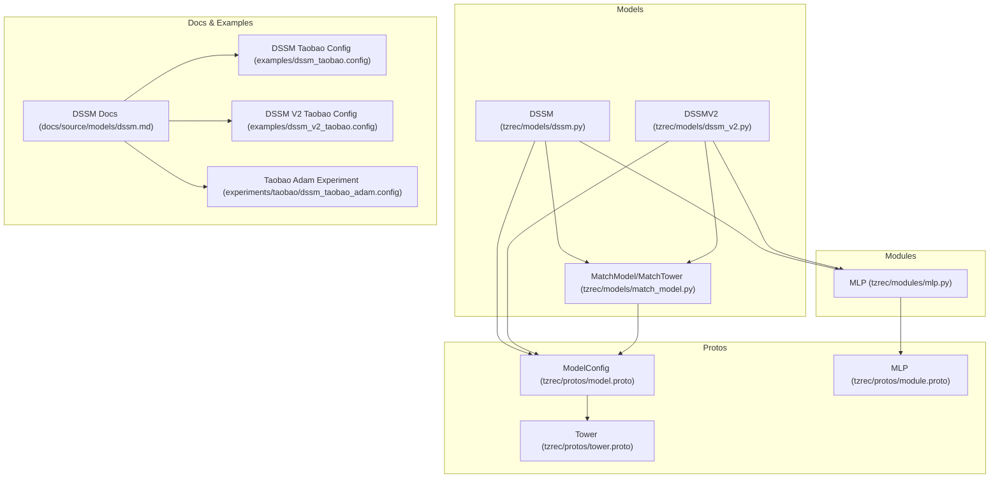
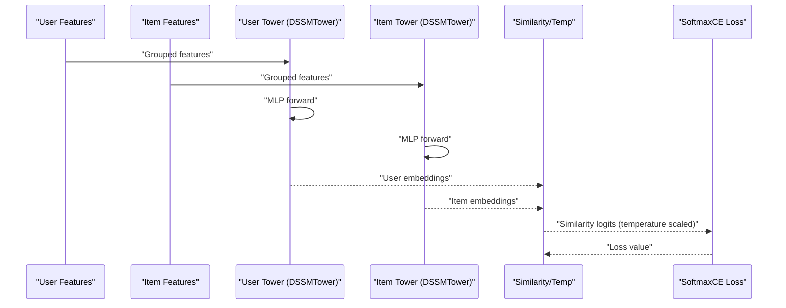
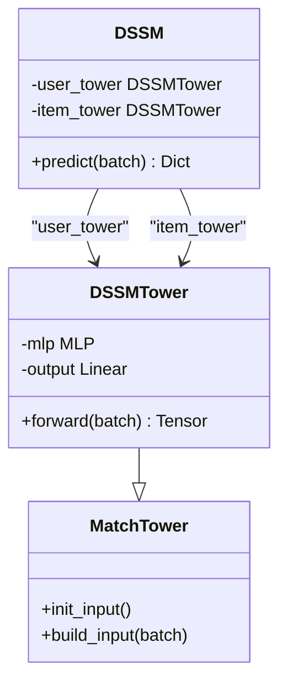
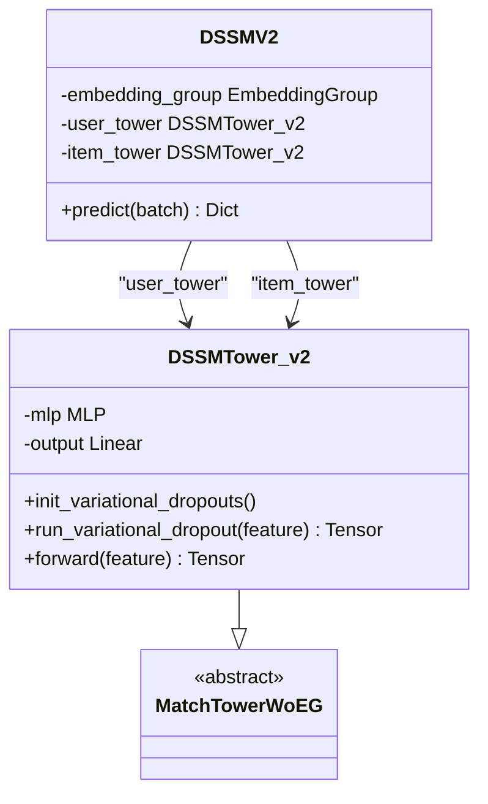
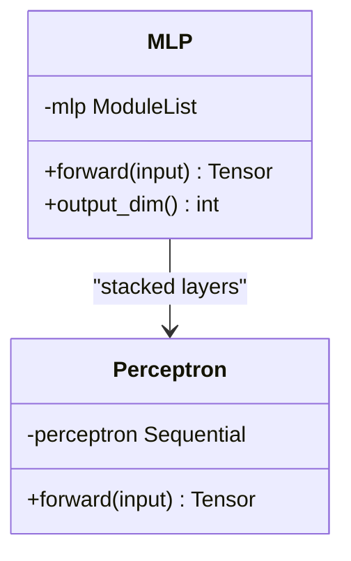
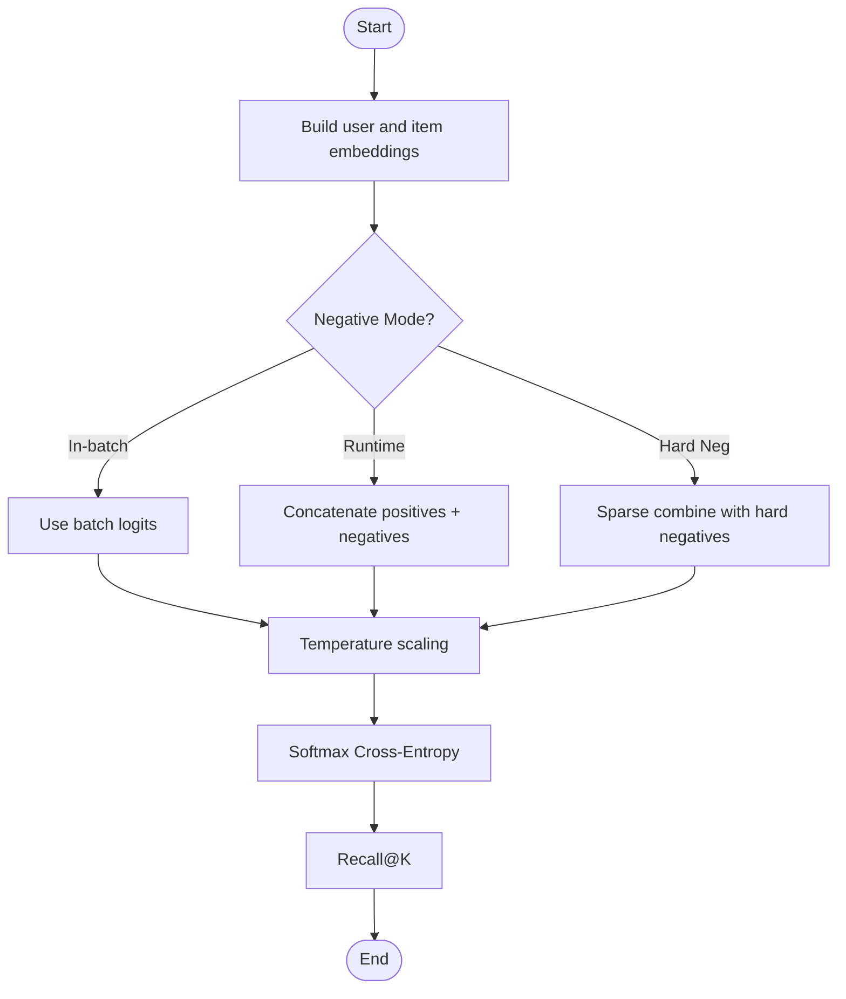
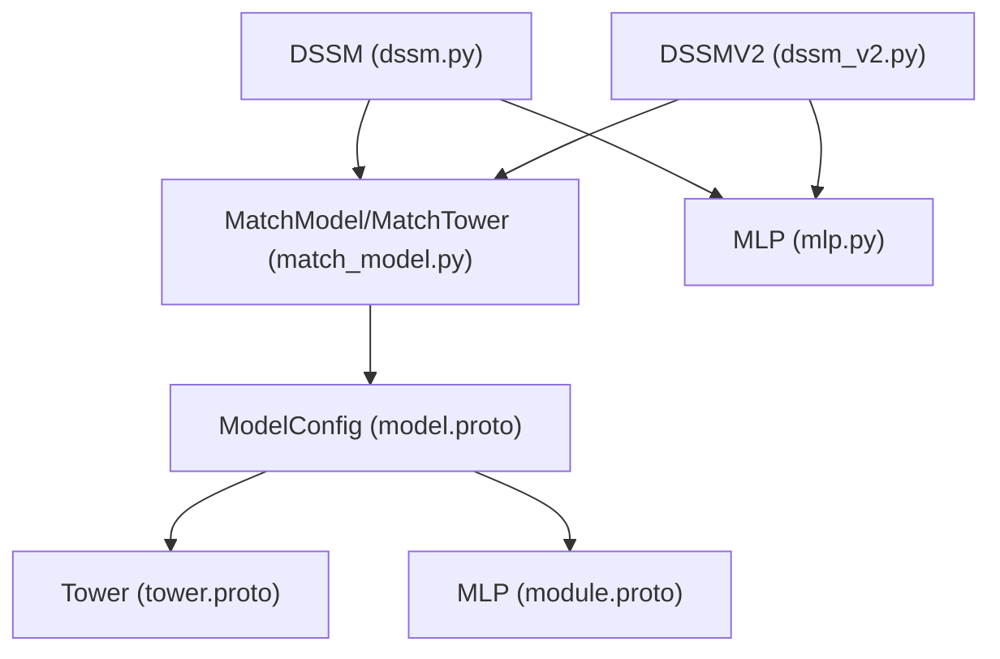

# DSSM (Deep Structured Semantic Model)

<cite>
**Referenced Files in This Document**
- [dssm.py](file://tzrec/models/dssm.py)
- [dssm_v2.py](file://tzrec/models/dssm_v2.py)
- [match_model.py](file://tzrec/models/match_model.py)
- [mlp.py](file://tzrec/modules/mlp.py)
- [dssm.md](file://docs/source/models/dssm.md)
- [dssm_taobao.config](file://examples/dssm_taobao.config)
- [dssm_v2_taobao.config](file://examples/dssm_v2_taobao.config)
- [dssm_taobao_adam.config](file://experiments/taobao/dssm_taobao_adam.config)
- [model.proto](file://tzrec/protos/model.proto)
- [tower.proto](file://tzrec/protos/tower.proto)
- [module.proto](file://tzrec/protos/module.proto)
</cite>

## Table of Contents

1. [Introduction](#introduction)
1. [Project Structure](#project-structure)
1. [Core Components](#core-components)
1. [Architecture Overview](#architecture-overview)
1. [Detailed Component Analysis](#detailed-component-analysis)
1. [Dependency Analysis](#dependency-analysis)
1. [Performance Considerations](#performance-considerations)
1. [Troubleshooting Guide](#troubleshooting-guide)
1. [Conclusion](#conclusion)
1. [Appendices](#appendices)

## Introduction

DSSM (Deep Structured Semantic Model) in TorchEasyRec is a two-tower matching model that learns joint latent representations for users and items via multi-layer perceptrons (MLPs). It transforms categorical and raw features into dense embeddings and computes semantic similarity, typically via cosine similarity, to support retrieval tasks such as recall. The framework supports runtime negative sampling to handle large-scale item pools efficiently, and offers both a standard DSSM and an extended DSSM v2 variant with shared embedding capabilities.

Key capabilities:

- Two-tower MLP architectures for user and item embeddings
- Cosine normalization for semantic matching
- Runtime negative sampling with configurable samplers
- Softmax cross-entropy loss with recall@K metrics
- Configurable MLP layers, activations, normalization, and regularization

## Project Structure

The DSSM implementation spans model definitions, matching infrastructure, MLP modules, and configuration schemas. The following diagram shows the primary code-to-file mapping.

**Diagram sources**

- \[dssm.py\](file://tzrec/models/dssm.py#L86-L156)
- \[dssm_v2.py\](file://tzrec/models/dssm_v2.py#L113-L198)
- \[match_model.py\](file://tzrec/models/match_model.py#L225-L500)
- \[mlp.py\](file://tzrec/modules/mlp.py#L86-L178)
- \[model.proto\](file://tzrec/protos/model.proto#L40-L90)
- \[tower.proto\](file://tzrec/protos/tower.proto#L8-L13)
- \[module.proto\](file://tzrec/protos/module.proto#L4-L17)
- \[dssm.md\](file://docs/source/models/dssm.md#L1-L153)
- \[dssm_taobao.config\](file://examples/dssm_taobao.config#L201-L267)
- \[dssm_v2_taobao.config\](file://examples/dssm_v2_taobao.config#L202-L268)
- \[dssm_taobao_adam.config\](file://experiments/taobao/dssm_taobao_adam.config#L170-L224)

**Section sources**

- \[dssm.py\](file://tzrec/models/dssm.py#L1-L156)
- \[dssm_v2.py\](file://tzrec/models/dssm_v2.py#L1-L198)
- \[match_model.py\](file://tzrec/models/match_model.py#L1-L500)
- \[mlp.py\](file://tzrec/modules/mlp.py#L1-L178)
- \[model.proto\](file://tzrec/protos/model.proto#L40-L90)
- \[tower.proto\](file://tzrec/protos/tower.proto#L8-L13)
- \[module.proto\](file://tzrec/protos/module.proto#L4-L17)
- \[dssm.md\](file://docs/source/models/dssm.md#L1-L153)
- \[dssm_taobao.config\](file://examples/dssm_taobao.config#L201-L267)
- \[dssm_v2_taobao.config\](file://examples/dssm_v2_taobao.config#L202-L268)
- \[dssm_taobao_adam.config\](file://experiments/taobao/dssm_taobao_adam.config#L170-L224)

## Core Components

- DSSMTower (standard) and DSSMTower (v2): Each builds a user or item embedding tower from grouped features, applies an MLP, optionally projects to a fixed output dimension, and normalizes for cosine similarity.
- DSSM and DSSMV2: Construct user and item towers and compute a temperature-scaled similarity matrix between user and item embeddings, supporting in-batch negatives or runtime negative sampling.
- MLP module: Stacked perceptrons with configurable activation, batch/layer normalization, dropout, and bias.
- Matching infrastructure: Similarity computation, loss (softmax cross-entropy), and metrics (recall@K), with support for hard negatives and in-batch negatives.

Key configuration highlights:

- Feature groups define user and item feature sets.
- MLP hidden_units define layer widths.
- output_dim controls the final embedding dimension.
- similarity supports cosine normalization.
- losses support softmax_cross_entropy; metrics include recall@K.

**Section sources**

- \[dssm.py\](file://tzrec/models/dssm.py#L38-L84)
- \[dssm_v2.py\](file://tzrec/models/dssm_v2.py#L30-L111)
- \[match_model.py\](file://tzrec/models/match_model.py#L253-L329)
- \[mlp.py\](file://tzrec/modules/mlp.py#L86-L178)
- \[dssm.md\](file://docs/source/models/dssm.md#L17-L107)
- \[dssm_taobao.config\](file://examples/dssm_taobao.config#L201-L267)
- \[dssm_v2_taobao.config\](file://examples/dssm_v2_taobao.config#L202-L268)

## Architecture Overview

The DSSM architecture comprises:

- Feature grouping and embedding collection
- MLP towers per user and item
- Optional projection to output_dim
- Cosine normalization for embeddings
- Similarity computation with temperature scaling
- Loss and metrics for training and evaluation

**Diagram sources**

- \[dssm.py\](file://tzrec/models/dssm.py#L129-L156)
- \[match_model.py\](file://tzrec/models/match_model.py#L253-L329)

## Detailed Component Analysis

### DSSM Tower and Model

- DSSMTower (standard):
  - Builds an MLP from the total dimension of grouped features.
  - Optionally adds a final linear layer to reach output_dim.
  - Applies L2 normalization when similarity mode is cosine.
- DSSM:
  - Constructs separate user and item towers.
  - Computes similarity between user and item embeddings, scaled by temperature.
  - Returns similarity scores for downstream loss and metrics.

**Diagram sources**

- \[dssm.py\](file://tzrec/models/dssm.py#L38-L84)
- \[dssm.py\](file://tzrec/models/dssm.py#L86-L156)
- \[match_model.py\](file://tzrec/models/match_model.py#L110-L191)

**Section sources**

- \[dssm.py\](file://tzrec/models/dssm.py#L38-L84)
- \[dssm.py\](file://tzrec/models/dssm.py#L86-L156)

### DSSM v2 Tower and Model

- DSSMTower (v2):
  - Uses a shared EmbeddingGroup and computes per-feature dimensions.
  - Supports variational dropout per feature group (when configured).
  - Applies MLP and optional projection, then cosine normalization.
- DSSMV2:
  - Builds EmbeddingGroup once and feeds grouped features to towers.
  - Aggregates variational dropout losses into the loss collection.

**Diagram sources**

- \[dssm_v2.py\](file://tzrec/models/dssm_v2.py#L30-L111)
- \[dssm_v2.py\](file://tzrec/models/dssm_v2.py#L113-L198)

**Section sources**

- \[dssm_v2.py\](file://tzrec/models/dssm_v2.py#L30-L111)
- \[dssm_v2.py\](file://tzrec/models/dssm_v2.py#L113-L198)

### MLP Module

- Perceptron: Linear layer with optional BN/LN, activation, and dropout.
- MLP: Sequential stack of Perceptrons with configurable hidden_units, dropout, activation, normalization, and bias.

**Diagram sources**

- \[mlp.py\](file://tzrec/modules/mlp.py#L21-L84)
- \[mlp.py\](file://tzrec/modules/mlp.py#L86-L178)

**Section sources**

- \[mlp.py\](file://tzrec/modules/mlp.py#L21-L84)
- \[mlp.py\](file://tzrec/modules/mlp.py#L86-L178)

### Training Methodology and Negative Sampling

- Similarity computation:
  - Supports in-batch negatives or runtime negative sampling.
  - Hard negatives are supported via sparse indices mapping.
- Loss:
  - Softmax cross-entropy with label selection depending on negative strategy.
- Metrics:
  - Recall@K for evaluation.

**Diagram sources**

- \[match_model.py\](file://tzrec/models/match_model.py#L50-L108)
- \[match_model.py\](file://tzrec/models/match_model.py#L253-L329)

**Section sources**

- \[match_model.py\](file://tzrec/models/match_model.py#L50-L108)
- \[match_model.py\](file://tzrec/models/match_model.py#L253-L329)
- \[dssm.md\](file://docs/source/models/dssm.md#L109-L145)

### Configuration Options

- ModelConfig:
  - One-of: DSSM or DSSMV2
  - FeatureGroups: user and item groups
  - Losses: softmax_cross_entropy
  - Metrics: recall_at_k
- Tower:
  - input: feature group name
  - mlp: hidden_units, activation, use_bn, use_ln, dropout_ratio, bias
- DSSM/DSSMV2:
  - output_dim: final embedding dimension
  - similarity: inner product or cosine
  - temperature: similarity scaling (applied in model predict)
- VariationalDropout (DSSM v2):
  - regularization_lambda, embedding_wise_variational_dropout

Practical examples:

- Standard DSSM Taobao config: defines user and item feature groups, MLP hidden_units, output_dim, metrics, and loss.
- DSSM v2 Taobao config: similar structure with force_base_data_group enabled for v2.
- Experiment config: demonstrates optimizer settings and negative sampler configuration.

**Section sources**

- \[model.proto\](file://tzrec/protos/model.proto#L40-L90)
- \[tower.proto\](file://tzrec/protos/tower.proto#L8-L13)
- \[module.proto\](file://tzrec/protos/module.proto#L4-L17)
- \[dssm_taobao.config\](file://examples/dssm_taobao.config#L201-L267)
- \[dssm_v2_taobao.config\](file://examples/dssm_v2_taobao.config#L202-L268)
- \[dssm_taobao_adam.config\](file://experiments/taobao/dssm_taobao_adam.config#L170-L224)

## Dependency Analysis

- DSSM/DSSMV2 depend on:
  - MatchModel/MatchTower base classes for similarity, loss, and metrics.
  - MLP module for multi-layer perceptrons.
  - Protobuf schemas for configuration parsing.
- Negative sampling and hard negatives are integrated via the matching infrastructure.

**Diagram sources**

- \[dssm.py\](file://tzrec/models/dssm.py#L86-L156)
- \[dssm_v2.py\](file://tzrec/models/dssm_v2.py#L113-L198)
- \[match_model.py\](file://tzrec/models/match_model.py#L225-L500)
- \[mlp.py\](file://tzrec/modules/mlp.py#L86-L178)
- \[model.proto\](file://tzrec/protos/model.proto#L40-L90)
- \[tower.proto\](file://tzrec/protos/tower.proto#L8-L13)
- \[module.proto\](file://tzrec/protos/module.proto#L4-L17)

**Section sources**

- \[dssm.py\](file://tzrec/models/dssm.py#L86-L156)
- \[dssm_v2.py\](file://tzrec/models/dssm_v2.py#L113-L198)
- \[match_model.py\](file://tzrec/models/match_model.py#L225-L500)
- \[mlp.py\](file://tzrec/modules/mlp.py#L86-L178)
- \[model.proto\](file://tzrec/protos/model.proto#L40-L90)
- \[tower.proto\](file://tzrec/protos/tower.proto#L8-L13)
- \[module.proto\](file://tzrec/protos/module.proto#L4-L17)

## Performance Considerations

- Embedding dimension and MLP width:
  - output_dim controls memory footprint and representational capacity.
  - Hidden_units shape affects compute; deeper networks increase capacity but cost.
- Normalization:
  - Using cosine similarity normalizes embeddings, improving downstream dot-product stability.
- Batch size and negative sampling:
  - Larger batch sizes improve throughput; ensure sufficient GPU memory.
  - num_sample in negative_sampler impacts recall quality and training cost.
- Optimizer and learning rate:
  - Adam with small learning rates commonly used; adjust based on convergence.
- Regularization:
  - Dropout and normalization (BN/LN) help mitigate overfitting.
  - Variational dropout (v2) adds structured regularization per feature group.

[No sources needed since this section provides general guidance]

## Troubleshooting Guide

Common issues and resolutions:

- Embedding dimension mismatch:
  - Ensure MLP input dimension equals the grouped feature dimension sum.
  - Verify feature group definitions and embedding dimensions align with feature_configs.
- Convergence problems:
  - Adjust learning rate, batch size, or negative sampling scale.
  - Enable cosine similarity normalization for stable gradients.
  - Use recall@K metrics to monitor early-stage progress.
- Negative sampling configuration:
  - Confirm negative_sampler settings and item_id_field alignment with data.
  - For v2, ensure force_base_data_group is set appropriately.
- Hard negatives:
  - Validate HARD_NEG_INDICES shape and sparsity; ensure indices map to correct user-item pairs.

**Section sources**

- \[dssm.md\](file://docs/source/models/dssm.md#L109-L145)
- \[dssm_taobao.config\](file://examples/dssm_taobao.config#L29-L41)
- \[dssm_v2_taobao.config\](file://examples/dssm_v2_taobao.config#L29-L42)

## Conclusion

DSSM in TorchEasyRec provides a robust, scalable two-tower architecture for semantic matching with strong support for runtime negative sampling and cosine normalization. The modular MLP and matching infrastructure enable flexible configuration for diverse recommendation scenarios, while standardized loss and metrics simplify training and evaluation. Proper configuration of feature groups, MLP layers, and negative sampling yields effective recall performance at scale.

[No sources needed since this section summarizes without analyzing specific files]

## Appendices

### Practical Configuration Examples

- Standard DSSM:
  - Define user and item feature groups, MLP hidden_units, output_dim, metrics, and softmax_cross_entropy loss.
  - Reference: \[dssm_taobao.config\](file://examples/dssm_taobao.config#L201-L267)
- DSSM v2:
  - Same structure as DSSM with force_base_data_group enabled.
  - Reference: \[dssm_v2_taobao.config\](file://examples/dssm_v2_taobao.config#L202-L268)
- Experiment with Adam optimizer and negative sampling:
  - Reference: \[dssm_taobao_adam.config\](file://experiments/taobao/dssm_taobao_adam.config#L170-L224)

**Section sources**

- \[dssm_taobao.config\](file://examples/dssm_taobao.config#L201-L267)
- \[dssm_v2_taobao.config\](file://examples/dssm_v2_taobao.config#L202-L268)
- \[dssm_taobao_adam.config\](file://experiments/taobao/dssm_taobao_adam.config#L170-L224)
