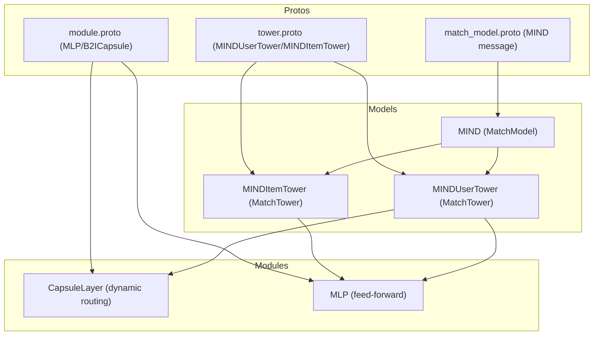
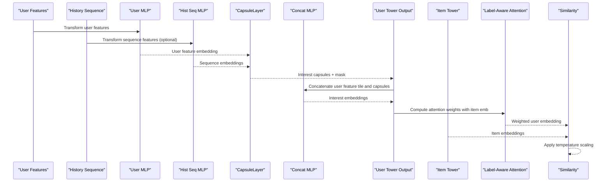
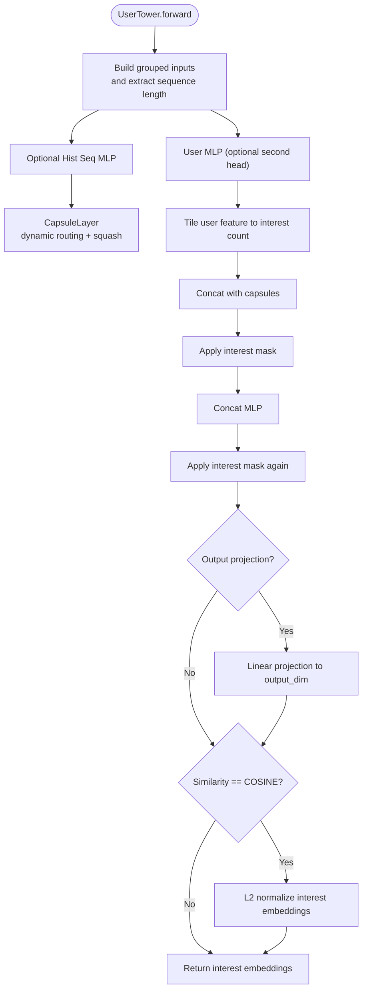
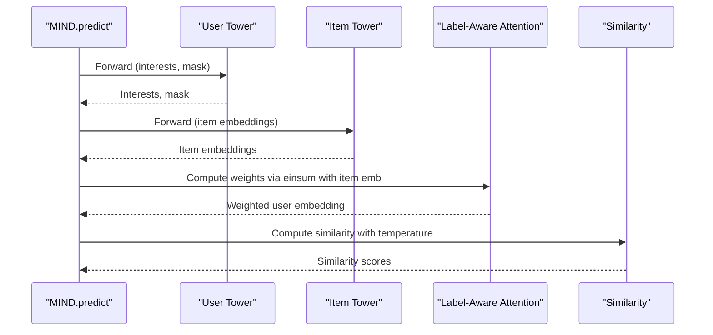
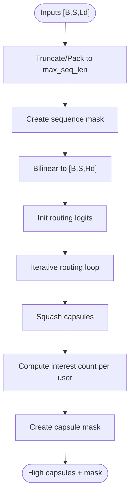
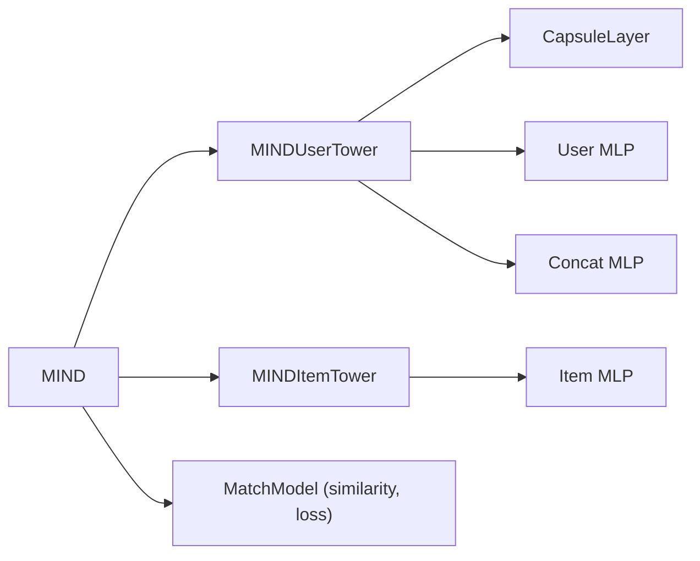

# MIND (Multi-interest Network)

<cite>
**Referenced Files in This Document**
- [mind.py](file://tzrec/models/mind.py)
- [mind.md](file://docs/source/models/mind.md)
- [mind_test.py](file://tzrec/models/mind_test.py)
- [match_model.py](file://tzrec/models/match_model.py)
- [capsule.py](file://tzrec/modules/capsule.py)
- [mind_taobao.config](file://examples/mind_taobao.config)
- [match_model.proto](file://tzrec/protos/models/match_model.proto)
- [module.proto](file://tzrec/protos/module.proto)
- [tower.proto](file://tzrec/protos/tower.proto)
</cite>

## Table of Contents

1. [Introduction](#introduction)
1. [Project Structure](#project-structure)
1. [Core Components](#core-components)
1. [Architecture Overview](#architecture-overview)
1. [Detailed Component Analysis](#detailed-component-analysis)
1. [Dependency Analysis](#dependency-analysis)
1. [Performance Considerations](#performance-considerations)
1. [Troubleshooting Guide](#troubleshooting-guide)
1. [Conclusion](#conclusion)
1. [Appendices](#appendices)

## Introduction

MIND (Multi-interest Network) is a matching model that extends traditional deep matching approaches by capturing users’ multiple distinct interests from historical behavior sequences. It leverages a capsule routing mechanism to cluster heterogeneous interaction signals into a small set of interpretable interest vectors, and then applies label-aware attention to select the most relevant interest for a given item. This enables personalized candidate generation that reflects diverse user preferences while maintaining efficient similarity computation.

Key capabilities:

- Interest extraction via a capsule layer that dynamically routes sequence tokens into a fixed number of high-dimensional interest capsules.
- Multi-interest embedding generation that combines user static features with discovered interest capsules.
- Attention-based interest selection conditioned on the item embedding to produce a user representation aligned with the current recommendation goal.
- Interest-aware similarity computation for ranking candidates.
- Training with softmax cross-entropy loss and optional hard negatives.

## Project Structure

The MIND implementation spans model definition, configuration, and supporting modules:

- Model definition: user tower, item tower, and the top-level matching model.
- Matching infrastructure: base tower and model abstractions, similarity computation, and loss/metric initialization.
- Capsule routing: dynamic routing with squashing and interest masking.
- Protobuf definitions: configuration schemas for MIND towers, MLPs, and capsule parameters.
- Examples and documentation: configuration templates and usage guidance.

**Diagram sources**

- \[mind.py\](file://tzrec/models/mind.py#L255-L366)
- \[match_model.py\](file://tzrec/models/match_model.py#L110-L500)
- \[capsule.py\](file://tzrec/modules/capsule.py#L65-L232)
- \[match_model.proto\](file://tzrec/protos/models/match_model.proto#L72-L81)
- \[tower.proto\](file://tzrec/protos/tower.proto#L171-L198)
- \[module.proto\](file://tzrec/protos/module.proto#L4-L17)

**Section sources**

- \[mind.py\](file://tzrec/models/mind.py#L1-L366)
- \[match_model.py\](file://tzrec/models/match_model.py#L110-L500)
- \[capsule.py\](file://tzrec/modules/capsule.py#L65-L232)
- \[match_model.proto\](file://tzrec/protos/models/match_model.proto#L72-L81)
- \[tower.proto\](file://tzrec/protos/tower.proto#L171-L198)
- \[module.proto\](file://tzrec/protos/module.proto#L4-L17)

## Core Components

- MINDUserTower: Extracts user static features and transforms the historical behavior sequence into interest capsules via a capsule layer. Concatenates user features with interest capsules and projects to a compact user interest space. Outputs either interest embeddings (training) or interest embeddings plus masks (inference).
- MINDItemTower: Embeds item features via an MLP and optionally normalizes for cosine similarity.
- MIND (MatchModel): Orchestrates user and item towers, computes label-aware attention over user interests conditioned on the item embedding, and produces a user representation used for similarity computation with items. Supports temperature scaling and hard negatives.

Key configuration highlights:

- User tower: user_mlp, hist_seq_mlp (optional), capsule_config (max_k, high_dim, num_iters, routing logits parameters, squash_pow), concat_mlp.
- Item tower: mlp.
- Model-level: output_dim, simi_pow, similarity (COSINE/INNER_PRODUCT), temperature, in_batch_negative.

**Section sources**

- \[mind.py\](file://tzrec/models/mind.py#L28-L195)
- \[mind.py\](file://tzrec/models/mind.py#L197-L252)
- \[mind.py\](file://tzrec/models/mind.py#L255-L366)
- \[mind.md\](file://docs/source/models/mind.md#L139-L163)
- \[match_model.proto\](file://tzrec/protos/models/match_model.proto#L72-L81)
- \[tower.proto\](file://tzrec/protos/tower.proto#L171-L198)
- \[module.proto\](file://tzrec/protos/module.proto#L4-L17)

## Architecture Overview

The MIND architecture comprises three stages:

1. Interest extraction: User static features and history sequence features are transformed; the sequence is routed into interest capsules.
1. Interest fusion: User features are broadcast and concatenated with interest capsules; masked and projected to a unified interest space.
1. Interest selection: Label-aware attention computes a weighted combination of interests using item-aware scores; the resulting user embedding is normalized if needed and used for similarity with items.

**Diagram sources**

- \[mind.py\](file://tzrec/models/mind.py#L143-L195)
- \[mind.py\](file://tzrec/models/mind.py#L303-L366)
- \[capsule.py\](file://tzrec/modules/capsule.py#L184-L232)

**Section sources**

- \[mind.py\](file://tzrec/models/mind.py#L143-L195)
- \[mind.py\](file://tzrec/models/mind.py#L303-L366)
- \[capsule.py\](file://tzrec/modules/capsule.py#L184-L232)

## Detailed Component Analysis

### MINDUserTower: Interest Extraction and Fusion

- Input handling: Builds grouped embeddings for user and history groups; extracts sequence length for masking.
- User MLP: Projects user features to a latent space; optional second projection head.
- History sequence MLP: Optional transformation of sequence features before routing.
- CapsuleLayer: Dynamic routing clusters sequence tokens into up to max_k interest capsules with configurable routing logits initialization and squash power. Capsules are masked by learned interest counts per user.
- Interest fusion: Tiles user features to match interest count, concatenates with capsules, applies masking and a concat MLP to form interest embeddings. Optional output projection to output_dim.
- Normalization: Applies L2 normalization when similarity is set to COSINE.

**Diagram sources**

- \[mind.py\](file://tzrec/models/mind.py#L143-L195)
- \[capsule.py\](file://tzrec/modules/capsule.py#L184-L232)

**Section sources**

- \[mind.py\](file://tzrec/models/mind.py#L143-L195)
- \[capsule.py\](file://tzrec/modules/capsule.py#L65-L232)

### MINDItemTower: Item Embedding Generation

- Embeds item features via an MLP and optionally normalizes for cosine similarity.
- Supports configurable output dimensionality.

**Section sources**

- \[mind.py\](file://tzrec/models/mind.py#L197-L252)

### MIND (MatchModel): Label-Aware Attention and Similarity

- Predict path: Runs user tower (interests and mask) and item tower (embeddings). Computes label-aware attention weights by projecting user interests onto the positive item embedding, applies a similarity power, and softmax over interests. Aggregates interests into a user embedding. Computes item-user similarity with optional hard negatives and temperature scaling.
- Training: Uses softmax cross-entropy loss; supports in-batch negatives or sampler-based negatives.

**Diagram sources**

- \[mind.py\](file://tzrec/models/mind.py#L335-L366)
- \[match_model.py\](file://tzrec/models/match_model.py#L253-L264)

**Section sources**

- \[mind.py\](file://tzrec/models/mind.py#L303-L366)
- \[match_model.py\](file://tzrec/models/match_model.py#L253-L264)

### CapsuleLayer: Dynamic Routing and Interest Clustering

- Initializes routing logits with configurable distribution and scale.
- Low-dimension sequence vectors are bilinearly transformed to high-dimension capsules.
- Iterative routing accumulates agreement with detach-and-norm terms; squash compresses capsule magnitudes with a tunable power.
- Interest count per user is either fixed (constant) or logarithmic in sequence length; masks are applied to zero out unused capsules.
- Returns interest capsules and a mask indicating valid interest slots.

**Diagram sources**

- \[capsule.py\](file://tzrec/modules/capsule.py#L184-L232)

**Section sources**

- \[capsule.py\](file://tzrec/modules/capsule.py#L65-L232)

### Configuration and Training Methodology

- Configuration schema: Protobuf messages define MIND’s user and item towers, MLPs, and capsule parameters. The model-level message includes similarity, temperature, and output dimension.
- Example configuration: The Taobao example demonstrates feature groups for user, item, and history, along with MIND configuration including user_mlp, hist_seq_mlp, capsule_config, concat_mlp, and model-level parameters.
- Training: Softmax cross-entropy loss; supports in-batch negatives or sampler-based negatives; metrics include recall@K; evaluation utilities accept num_interests and top_K parameters.

**Section sources**

- \[match_model.proto\](file://tzrec/protos/models/match_model.proto#L72-L81)
- \[tower.proto\](file://tzrec/protos/tower.proto#L171-L198)
- \[module.proto\](file://tzrec/protos/module.proto#L39-L59)
- \[mind_taobao.config\](file://examples/mind_taobao.config#L206-L296)
- \[mind.md\](file://docs/source/models/mind.md#L137-L163)

## Dependency Analysis

- MIND depends on:
  - MatchTower base class for embedding group construction and input building.
  - CapsuleLayer for dynamic routing and interest discovery.
  - MLP modules for feature transformations.
  - Protobuf schemas for configuration parsing and validation.
- Coupling:
  - User tower couples user features, history features, and capsule routing.
  - Item tower couples item features and projection.
  - MIND orchestrates attention and similarity computation.

**Diagram sources**

- \[mind.py\](file://tzrec/models/mind.py#L255-L366)
- \[match_model.py\](file://tzrec/models/match_model.py#L225-L500)
- \[capsule.py\](file://tzrec/modules/capsule.py#L65-L232)

**Section sources**

- \[mind.py\](file://tzrec/models/mind.py#L255-L366)
- \[match_model.py\](file://tzrec/models/match_model.py#L225-L500)

## Performance Considerations

- Computational overhead:
  - Capsule routing involves iterative updates and bilinear projections; complexity scales with batch size, sequence length, interest count (max_k), and embedding dimensions.
  - Concatenation and MLP layers add per-interest compute proportional to interest count.
- Memory usage:
  - Interest embeddings and masks are stored per user; memory increases with max_k and batch size.
  - Temperature scaling and similarity matrices influence intermediate storage during scoring.
- Practical tips:
  - Tune max_k and high_dim to balance representativeness and memory footprint.
  - Use in-batch negatives judiciously; they reduce external sampling overhead but increase intra-batch similarity matrix size.
  - Normalize embeddings for cosine similarity to stabilize gradients and improve separation.

[No sources needed since this section provides general guidance]

## Troubleshooting Guide

- Shape mismatches:
  - Ensure user feature and history sequence MLP outputs align with capsule input expectations.
  - Verify sequence lengths and masks are correctly computed and applied.
- Convergence issues:
  - Adjust simi_pow to emphasize differences among interests.
  - Lower temperature for cosine similarity to improve discrimination.
  - Validate that hard negatives are provided when configured.
- Evaluation discrepancies:
  - Confirm num_interests and top_K settings match training configuration.
  - Check that item and user embeddings are normalized consistently when using cosine similarity.

**Section sources**

- \[mind.py\](file://tzrec/models/mind.py#L143-L195)
- \[mind.py\](file://tzrec/models/mind.py#L303-L366)
- \[mind.md\](file://docs/source/models/mind.md#L207-L252)

## Conclusion

MIND enhances matching by discovering and leveraging multiple user interests from behavior sequences. Its capsule-based interest extraction, attention-driven interest selection, and interest-aware similarity computation provide a strong foundation for diverse and personalized candidate generation. Proper configuration of attention parameters, interest counts, and similarity scaling yields robust training and effective retrieval performance.

[No sources needed since this section summarizes without analyzing specific files]

## Appendices

### Configuration Examples and Parameter Guide

- Model-level parameters:
  - output_dim: Dimensionality of user and item embeddings.
  - simi_pow: Amplification factor for interest discrimination.
  - similarity: COSINE or INNER_PRODUCT.
  - temperature: Scaling factor for similarity logits.
  - in_batch_negative: Toggle for in-batch negatives.
- MINDUserTower:
  - user_mlp: Hidden units and activation for user feature projection.
  - hist_seq_mlp: Optional sequence feature projection.
  - capsule_config: max_k, high_dim, num_iters, routing_logits_scale/stddev, squash_pow, const_caps_num.
  - concat_mlp: Fusion MLP after concatenating user features and capsules.
- MINDItemTower:
  - mlp: Hidden units for item feature projection.

**Section sources**

- \[mind.md\](file://docs/source/models/mind.md#L139-L163)
- \[match_model.proto\](file://tzrec/protos/models/match_model.proto#L72-L81)
- \[tower.proto\](file://tzrec/protos/tower.proto#L171-L198)
- \[module.proto\](file://tzrec/protos/module.proto#L4-L17)

### Training and Evaluation Notes

- Loss: Softmax cross-entropy.
- Metrics: Recall@K.
- Evaluation utilities: Support hard negatives and interest-aware recall settings.

**Section sources**

- \[mind_test.py\](file://tzrec/models/mind_test.py#L1-L261)
- \[mind.md\](file://docs/source/models/mind.md#L207-L252)
