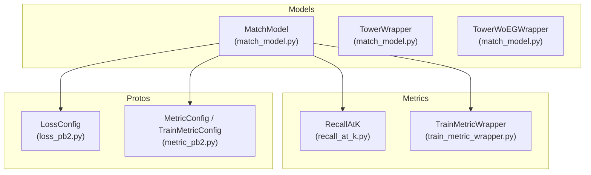
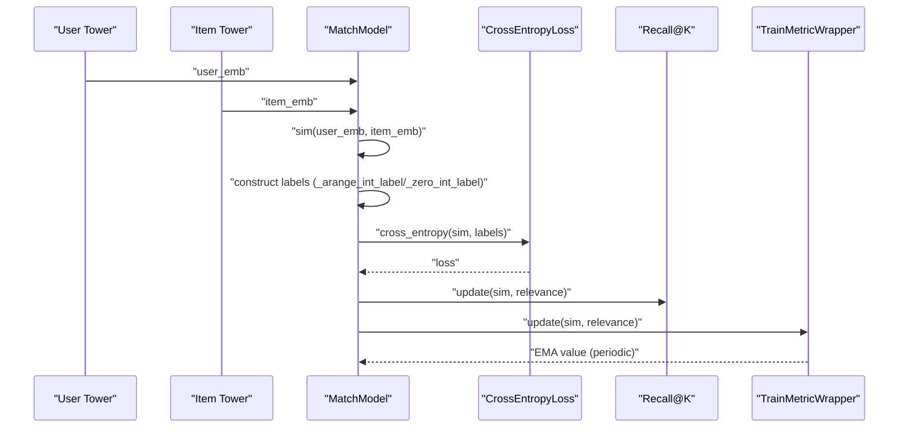
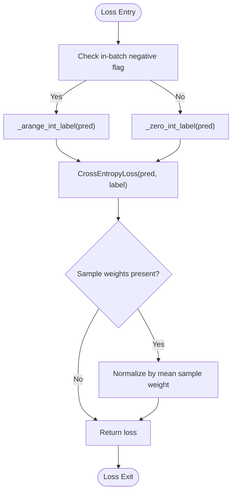
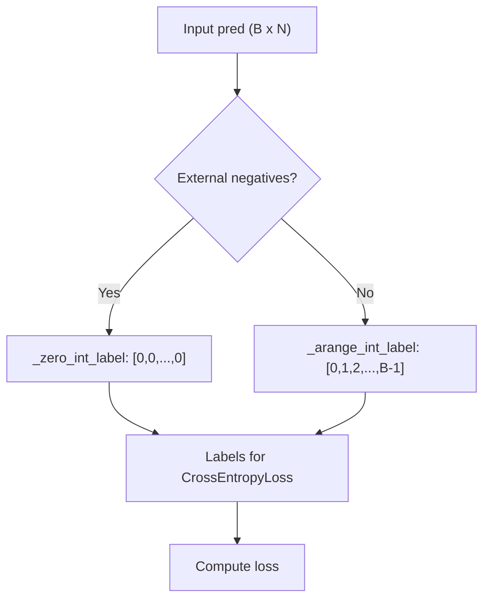
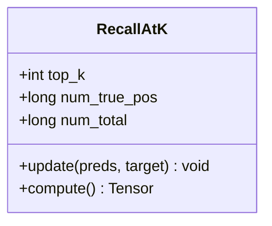
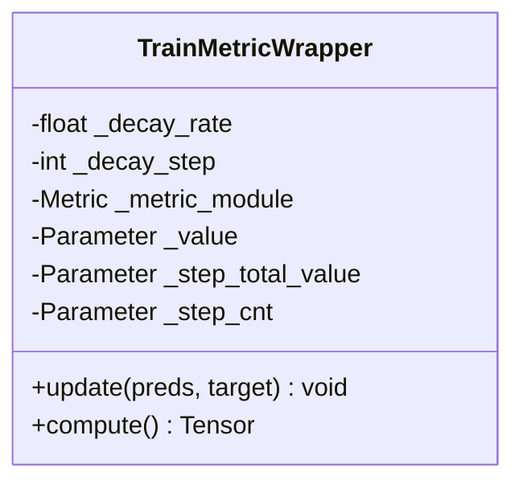
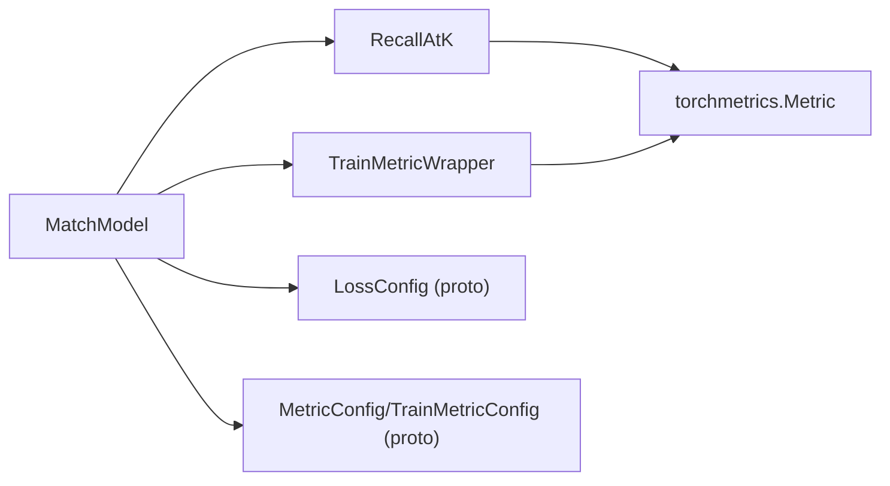

# Loss Functions and Metrics System

<cite>
**Referenced Files in This Document**
- [match_model.py](file://tzrec/models/match_model.py)
- [recall_at_k.py](file://tzrec/metrics/recall_at_k.py)
- [train_metric_wrapper.py](file://tzrec/metrics/train_metric_wrapper.py)
- [loss_pb2.py](file://tzrec/protos/loss_pb2.py)
- [metric_pb2.py](file://tzrec/protos/metric_pb2.py)
- [recall_at_k_test.py](file://tzrec/metrics/recall_at_k_test.py)
- [train_metric_wrapper_test.py](file://tzrec/metrics/train_metric_wrapper_test.py)
</cite>

## Table of Contents

1. [Introduction](#introduction)
1. [Project Structure](#project-structure)
1. [Core Components](#core-components)
1. [Architecture Overview](#architecture-overview)
1. [Detailed Component Analysis](#detailed-component-analysis)
1. [Dependency Analysis](#dependency-analysis)
1. [Performance Considerations](#performance-considerations)
1. [Troubleshooting Guide](#troubleshooting-guide)
1. [Conclusion](#conclusion)

## Introduction

This document explains the loss functions and metrics system tailored for matching models. It focuses on the softmax cross-entropy loss implementation designed for matching tasks, the label construction logic for in-batch and external negative sampling, the Recall@K metric system (including evaluation and training metrics), and the TrainMetricWrapper for exponential moving averages during training. It also covers configuration examples, initialization, performance evaluation techniques, and common issues in distributed training.

## Project Structure

The matching loss and metrics are implemented within the models and metrics packages, with protocol buffer definitions specifying configuration schemas for loss and metric settings.

**Diagram sources**

- \[match_model.py\](file://tzrec/models/match_model.py#L225-L451)
- \[recall_at_k.py\](file://tzrec/metrics/recall_at_k.py#L19-L55)
- \[train_metric_wrapper.py\](file://tzrec/metrics/train_metric_wrapper.py#L20-L63)
- \[loss_pb2.py\](file://tzrec/protos/loss_pb2.py#L17-L36)
- \[metric_pb2.py\](file://tzrec/protos/metric_pb2.py#L42-L46)

**Section sources**

- \[match_model.py\](file://tzrec/models/match_model.py#L1-L500)
- \[recall_at_k.py\](file://tzrec/metrics/recall_at_k.py#L1-L55)
- \[train_metric_wrapper.py\](file://tzrec/metrics/train_metric_wrapper.py#L1-L63)
- \[loss_pb2.py\](file://tzrec/protos/loss_pb2.py#L1-L37)
- \[metric_pb2.py\](file://tzrec/protos/metric_pb2.py#L1-L47)

## Core Components

- Softmax Cross Entropy Loss for Matching
  - Implemented via PyTorch’s CrossEntropyLoss with a custom label construction strategy.
  - Supports in-batch negatives and external negative sampling (including hard negatives).
- Label Construction Utilities
  - \_zero_int_label: creates zero-indexed labels for external negative sampling.
  - \_arange_int_label: creates row-indexed labels for in-batch negatives.
- Recall@K Metric
  - Computes recall at top-K predictions against a boolean relevance mask.
  - Supports both evaluation and training modes.
- TrainMetricWrapper
  - Applies exponential moving average to training metrics at fixed intervals.
  - Handles decay for DecayAUC and simple averaging for other metrics.

**Section sources**

- \[match_model.py\](file://tzrec/models/match_model.py#L32-L40)
- \[match_model.py\](file://tzrec/models/match_model.py#L265-L316)
- \[recall_at_k.py\](file://tzrec/metrics/recall_at_k.py#L19-L55)
- \[train_metric_wrapper.py\](file://tzrec/metrics/train_metric_wrapper.py#L20-L63)

## Architecture Overview

The matching model computes a similarity matrix between user and item embeddings. The loss is computed using softmax cross-entropy with labels constructed depending on whether in-batch negatives are used. Metrics are updated per batch for evaluation and optionally for training with exponential smoothing.

**Diagram sources**

- \[match_model.py\](file://tzrec/models/match_model.py#L253-L316)
- \[match_model.py\](file://tzrec/models/match_model.py#L331-L411)
- \[recall_at_k.py\](file://tzrec/metrics/recall_at_k.py#L37-L54)
- \[train_metric_wrapper.py\](file://tzrec/metrics/train_metric_wrapper.py#L42-L62)

## Detailed Component Analysis

### Softmax Cross Entropy Loss for Matching

- Purpose
  - Designed for learning user-item match embeddings by ranking positive pairs higher than negative ones.
- Implementation Notes
  - Uses PyTorch CrossEntropyLoss with reduction set to “none” when sample weights are present; otherwise “mean”.
  - Enforces single loss configuration for matching models.
- Label Construction
  - In-batch negatives: integer labels are row indices (diagonal positions are positives).
  - External negatives: integer labels are zeros (first column is positive).
- Sample Weighting
  - When provided, loss values are weighted and normalized by mean sample weights.

**Diagram sources**

- \[match_model.py\](file://tzrec/models/match_model.py#L265-L316)
- \[match_model.py\](file://tzrec/models/match_model.py#L32-L40)

**Section sources**

- \[match_model.py\](file://tzrec/models/match_model.py#L265-L316)

### Label Construction Logic

- \_zero_int_label
  - Produces a 1D tensor of zeros sized to the batch, indicating the first item per user is the positive example in external negative sampling.
- \_arange_int_label
  - Produces row indices for in-batch negative sampling, aligning diagonal positions as positives.
- Usage
  - Applied in loss computation to construct integer-class labels for CrossEntropyLoss.

**Diagram sources**

- \[match_model.py\](file://tzrec/models/match_model.py#L32-L40)
- \[match_model.py\](file://tzrec/models/match_model.py#L282-L316)

**Section sources**

- \[match_model.py\](file://tzrec/models/match_model.py#L32-L40)
- \[match_model.py\](file://tzrec/models/match_model.py#L282-L316)

### Recall@K Metric System

- Recall@K
  - Maintains counts of true positives and totals across batches.
  - Computes recall as true positives divided by total positives.
- Evaluation vs Training
  - Evaluation: updates metric directly with predictions and boolean relevance.
  - Training: updates via TrainMetricWrapper for smoothed reporting.
- Relevance Construction
  - In-batch negatives: diagonal mask as relevance.
  - External negatives: first column as relevance.

**Diagram sources**

- \[recall_at_k.py\](file://tzrec/metrics/recall_at_k.py#L19-L55)

**Section sources**

- \[recall_at_k.py\](file://tzrec/metrics/recall_at_k.py#L19-L55)
- \[match_model.py\](file://tzrec/models/match_model.py#L331-L411)

### TrainMetricWrapper for Exponential Moving Averages

- Purpose
  - Smooth training metric reporting by applying exponential moving average at fixed intervals.
- Behavior
  - On decay steps, computes current metric value, resets internal state, and updates EMA.
  - Special-case handling for DecayAUC to apply decay internally.
- Configuration
  - Controlled by decay_rate and decay_step in TrainMetricConfig.

**Diagram sources**

- \[train_metric_wrapper.py\](file://tzrec/metrics/train_metric_wrapper.py#L20-L63)

**Section sources**

- \[train_metric_wrapper.py\](file://tzrec/metrics/train_metric_wrapper.py#L20-L63)
- \[metric_pb2.py\](file://tzrec/protos/metric_pb2.py#L42-L46)

### Metric Initialization and Label Preparation

- Initialization
  - Evaluation metrics: initialized from MetricConfig entries.
  - Training metrics: initialized from TrainMetricConfig entries with decay settings.
  - Loss metrics: initialized alongside losses for monitoring.
- Label Preparation
  - In-batch negatives: relevance is a boolean diagonal mask.
  - External negatives: relevance is a boolean mask with the first column True.

**Section sources**

- \[match_model.py\](file://tzrec/models/match_model.py#L358-L366)
- \[match_model.py\](file://tzrec/models/match_model.py#L367-L411)

### Configuration Examples

- Loss Configuration
  - SoftmaxCrossEntropy supports label_smoothing in the schema.
  - MatchModel enforces softmax_cross_entropy and single-loss constraint.
- Metric Configuration
  - RecallAtK configured with top_k.
  - TrainMetricConfig includes decay_rate and decay_step for smoothing.
- Example Keys
  - LossConfig.loss.softmax_cross_entropy
  - MetricConfig.metric.recall_at_k
  - TrainMetricConfig.metric.recall_at_k plus decay_rate and decay_step

**Section sources**

- \[loss_pb2.py\](file://tzrec/protos/loss_pb2.py#L17-L36)
- \[metric_pb2.py\](file://tzrec/protos/metric_pb2.py#L28-L46)
- \[match_model.py\](file://tzrec/models/match_model.py#L331-L366)

## Dependency Analysis

- MatchModel depends on:
  - Recall@K metric for evaluation and training.
  - TrainMetricWrapper for training metric smoothing.
  - Protocol buffers for loss and metric configuration schemas.
- Recall@K depends on torchmetrics Metric base class.
- TrainMetricWrapper depends on torch and torchmetrics.

**Diagram sources**

- \[match_model.py\](file://tzrec/models/match_model.py#L19-L21)
- \[recall_at_k.py\](file://tzrec/metrics/recall_at_k.py#L16)
- \[train_metric_wrapper.py\](file://tzrec/metrics/train_metric_wrapper.py#L14-L15)
- \[loss_pb2.py\](file://tzrec/protos/loss_pb2.py#L17-L36)
- \[metric_pb2.py\](file://tzrec/protos/metric_pb2.py#L42-L46)

**Section sources**

- \[match_model.py\](file://tzrec/models/match_model.py#L19-L21)
- \[recall_at_k.py\](file://tzrec/metrics/recall_at_k.py#L16)
- \[train_metric_wrapper.py\](file://tzrec/metrics/train_metric_wrapper.py#L14-L15)
- \[loss_pb2.py\](file://tzrec/protos/loss_pb2.py#L17-L36)
- \[metric_pb2.py\](file://tzrec/protos/metric_pb2.py#L42-L46)

## Performance Considerations

- In-batch negatives
  - Simpler label construction but requires computing full similarity matrix.
- External negatives
  - Enables larger candidate sets; label construction is constant-time per row.
- Distributed Training
  - Ensure consistent label construction across devices.
  - Use appropriate reduction modes and normalization for weighted losses.
- Metric Smoothing
  - TrainMetricWrapper reduces noisy reporting spikes by decaying values periodically.

[No sources needed since this section provides general guidance]

## Troubleshooting Guide

- Incorrect Loss Type
  - MatchModel enforces softmax_cross_entropy and single loss; ensure configuration matches.
- Label Mismatch
  - Verify in-batch flag to select correct label construction function.
  - For external negatives, confirm the first column corresponds to positives.
- Metric Computation Issues
  - Ensure relevance masks are boolean and shaped consistently with predictions.
  - For Recall@K, top_k should be less than or equal to number of items.
- Distributed Training
  - Confirm that labels and predictions are aligned across devices.
  - Validate that sample weights are properly normalized when used.

**Section sources**

- \[match_model.py\](file://tzrec/models/match_model.py#L265-L316)
- \[match_model.py\](file://tzrec/models/match_model.py#L331-L411)
- \[recall_at_k_test.py\](file://tzrec/metrics/recall_at_k_test.py#L20-L34)
- \[train_metric_wrapper_test.py\](file://tzrec/metrics/train_metric_wrapper_test.py#L21-L54)

## Conclusion

The matching loss and metrics system centers on softmax cross-entropy with careful label construction for in-batch versus external negatives. Recall@K provides robust evaluation and training metrics, with TrainMetricWrapper enabling stable training reporting via exponential moving averages. Proper configuration of loss and metric settings, along with attention to distributed training alignment, ensures reliable performance.
