# Match Model Base Architecture

<cite>
**Referenced Files in This Document**
- [match_model.py](file://tzrec/models/match_model.py)
- [model.py](file://tzrec/models/model.py)
- [embedding.py](file://tzrec/modules/embedding.py)
- [variational_dropout.py](file://tzrec/modules/variational_dropout.py)
- [recall_at_k.py](file://tzrec/metrics/recall_at_k.py)
- [dssm.py](file://tzrec/models/dssm.py)
- [tower_pb2.py](file://tzrec/protos/tower_pb2.py)
- [simi_pb2.py](file://tzrec/protos/simi_pb2.py)
- [sampler.py](file://tzrec/datasets/sampler.py)
- [dssm_taobao.config](file://examples/dssm_taobao.config)
</cite>

## Table of Contents

1. [Introduction](#introduction)
1. [Project Structure](#project-structure)
1. [Core Components](#core-components)
1. [Architecture Overview](#architecture-overview)
1. [Detailed Component Analysis](#detailed-component-analysis)
1. [Dependency Analysis](#dependency-analysis)
1. [Performance Considerations](#performance-considerations)
1. [Troubleshooting Guide](#troubleshooting-guide)
1. [Conclusion](#conclusion)
1. [Appendices](#appendices)

## Introduction

This document explains the MatchModel base architecture in TorchEasyRec. It focuses on the differences between matching and ranking models, the MatchTower base class for user/item towers, embedding group initialization, feature processing, and variational dropout integration. It also covers similarity computation, softmax cross-entropy loss, recall@K metrics, JIT scripting wrappers, and configuration examples for match towers with different similarity functions and feature processing strategies. Trade-offs between in-batch negative sampling and external sampling are addressed, along with how the base architecture supports both.

## Project Structure

The MatchModel base architecture spans several modules:

- Model base classes and wrappers
- Tower abstractions and concrete implementations
- Embedding group and feature processing
- Metrics and loss modules
- Sampling infrastructure for negatives

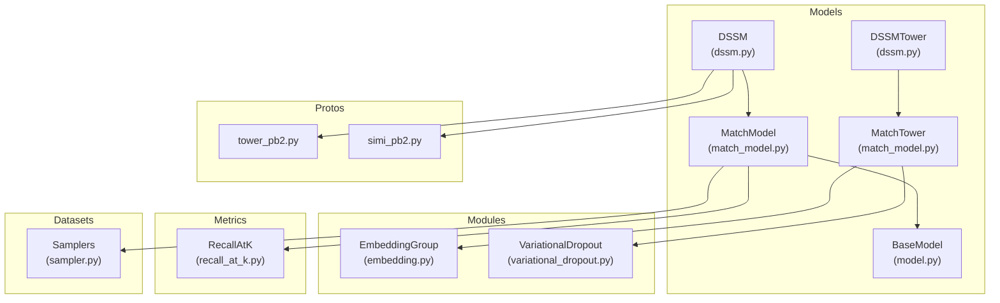

**Diagram sources**

- \[match_model.py\](file://tzrec/models/match_model.py#L110-L500)
- \[model.py\](file://tzrec/models/model.py#L39-L216)
- \[embedding.py\](file://tzrec/modules/embedding.py#L139-L508)
- \[variational_dropout.py\](file://tzrec/modules/variational_dropout.py#L38-L119)
- \[recall_at_k.py\](file://tzrec/metrics/recall_at_k.py#L19-L55)
- \[dssm.py\](file://tzrec/models/dssm.py#L38-L156)
- \[tower_pb2.py\](file://tzrec/protos/tower_pb2.py#L15-L55)
- \[simi_pb2.py\](file://tzrec/protos/simi_pb2.py#L17-L26)
- \[sampler.py\](file://tzrec/datasets/sampler.py#L219-L751)

**Section sources**

- \[match_model.py\](file://tzrec/models/match_model.py#L110-L500)
- \[model.py\](file://tzrec/models/model.py#L39-L216)
- \[embedding.py\](file://tzrec/modules/embedding.py#L139-L508)
- \[variational_dropout.py\](file://tzrec/modules/variational_dropout.py#L38-L119)
- \[recall_at_k.py\](file://tzrec/metrics/recall_at_k.py#L19-L55)
- \[dssm.py\](file://tzrec/models/dssm.py#L38-L156)
- \[tower_pb2.py\](file://tzrec/protos/tower_pb2.py#L15-L55)
- \[simi_pb2.py\](file://tzrec/protos/simi_pb2.py#L17-L26)
- \[sampler.py\](file://tzrec/datasets/sampler.py#L219-L751)

## Core Components

- MatchModel: Base match model implementing similarity computation, softmax cross-entropy loss, and recall@K metrics. Supports both in-batch and external negative sampling.
- MatchTower: Base user/item tower abstraction handling embedding group initialization, feature processing, and optional variational dropout integration.
- DSSM/DSSMTower: Concrete match model and towers demonstrating typical usage of the base architecture.
- EmbeddingGroup: Feature grouping and embedding lookup engine supporting sparse, dense, and sequence features.
- VariationalDropout: Optional per-feature dropout regularization integrated into feature groups.
- Metrics: Recall@K metric for evaluating retrieval quality.
- Samplers: External negative sampling infrastructure enabling hard negatives and flexible sampling strategies.

**Section sources**

- \[match_model.py\](file://tzrec/models/match_model.py#L225-L451)
- \[match_model.py\](file://tzrec/models/match_model.py#L110-L191)
- \[dssm.py\](file://tzrec/models/dssm.py#L86-L156)
- \[embedding.py\](file://tzrec/modules/embedding.py#L139-L508)
- \[variational_dropout.py\](file://tzrec/modules/variational_dropout.py#L38-L119)
- \[recall_at_k.py\](file://tzrec/metrics/recall_at_k.py#L19-L55)
- \[sampler.py\](file://tzrec/datasets/sampler.py#L464-L751)

## Architecture Overview

The match architecture separates user and item representation learning via dedicated towers. Features are grouped and embedded, optionally regularized by variational dropout. Similarity scores are computed between user and item embeddings, with support for in-batch negatives or external negatives produced by samplers. Loss is softmax cross-entropy, and recall@K is used for evaluation.

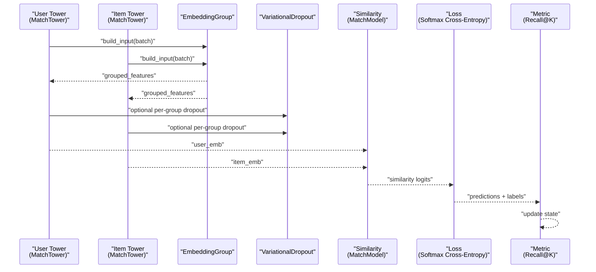

**Diagram sources**

- \[match_model.py\](file://tzrec/models/match_model.py#L110-L191)
- \[match_model.py\](file://tzrec/models/match_model.py#L253-L329)
- \[match_model.py\](file://tzrec/models/match_model.py#L331-L451)
- \[embedding.py\](file://tzrec/modules/embedding.py#L407-L496)
- \[variational_dropout.py\](file://tzrec/modules/variational_dropout.py#L107-L119)

## Detailed Component Analysis

### MatchTower Base Class

- Purpose: Encapsulates user/item tower logic for match models.
- Responsibilities:
  - Initialize embedding group for feature groups.
  - Optionally initialize per-feature variational dropout for non-sequence groups.
  - Build input tensors from batches via the embedding group.
  - Integrate variational dropout outputs and track per-group losses.

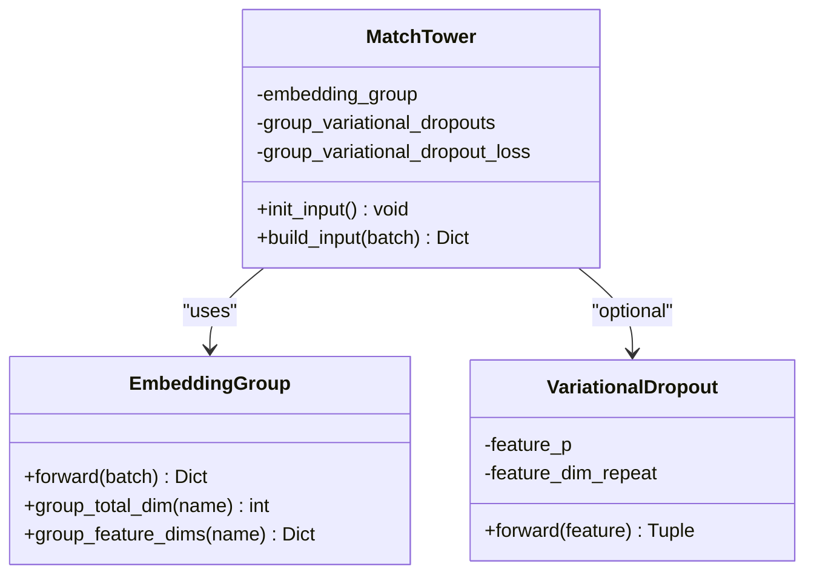

**Diagram sources**

- \[match_model.py\](file://tzrec/models/match_model.py#L110-L191)
- \[embedding.py\](file://tzrec/modules/embedding.py#L139-L508)
- \[variational_dropout.py\](file://tzrec/modules/variational_dropout.py#L38-L119)

**Section sources**

- \[match_model.py\](file://tzrec/models/match_model.py#L110-L191)
- \[embedding.py\](file://tzrec/modules/embedding.py#L139-L508)
- \[variational_dropout.py\](file://tzrec/modules/variational_dropout.py#L38-L119)

### Similarity Computation and Negative Sampling

- In-batch negatives: Uses matrix multiplication for all user-item pairs within a batch.
- External negatives: Uses a specialized function to compute similarities against negative and hard-negative candidates, handling sparse indices for hard negatives.

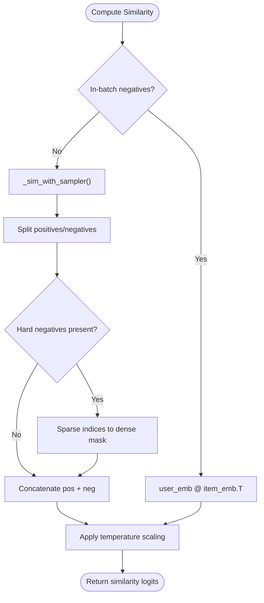

**Diagram sources**

- \[match_model.py\](file://tzrec/models/match_model.py#L253-L264)
- \[match_model.py\](file://tzrec/models/match_model.py#L50-L108)

**Section sources**

- \[match_model.py\](file://tzrec/models/match_model.py#L253-L264)
- \[match_model.py\](file://tzrec/models/match_model.py#L50-L108)

### Loss Function: Softmax Cross-Entropy

- Only softmax cross-entropy is supported for match models.
- Labels differ depending on negative strategy:
  - In-batch: integer labels indicating matching positions.
  - External: zeroth column is positive, others are negatives.
- Optional sample weights are supported.

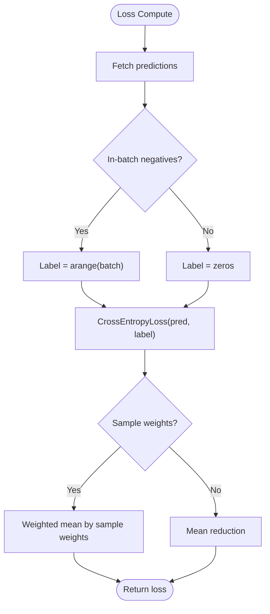

**Diagram sources**

- \[match_model.py\](file://tzrec/models/match_model.py#L265-L329)

**Section sources**

- \[match_model.py\](file://tzrec/models/match_model.py#L265-L329)

### Metrics: Recall@K

- Only Recall@K is supported for match models.
- Targets depend on negative strategy:
  - In-batch: diagonal mask for positives.
  - External: first column indicates positives.

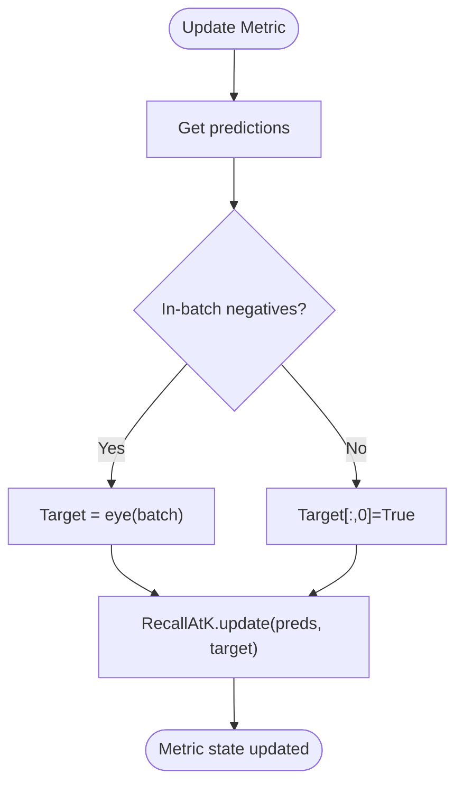

**Diagram sources**

- \[match_model.py\](file://tzrec/models/match_model.py#L331-L411)
- \[recall_at_k.py\](file://tzrec/metrics/recall_at_k.py#L19-L55)

**Section sources**

- \[match_model.py\](file://tzrec/models/match_model.py#L331-L411)
- \[recall_at_k.py\](file://tzrec/metrics/recall_at_k.py#L19-L55)

### JIT Scripting Wrappers

- TowerWrapper: Wraps a tower module for inference with TorchScript/JIT, exposing a predict method that returns embeddings.
- TowerWoEGWrapper: Similar wrapper for towers that rely on a standalone embedding group (no shared embedding group).

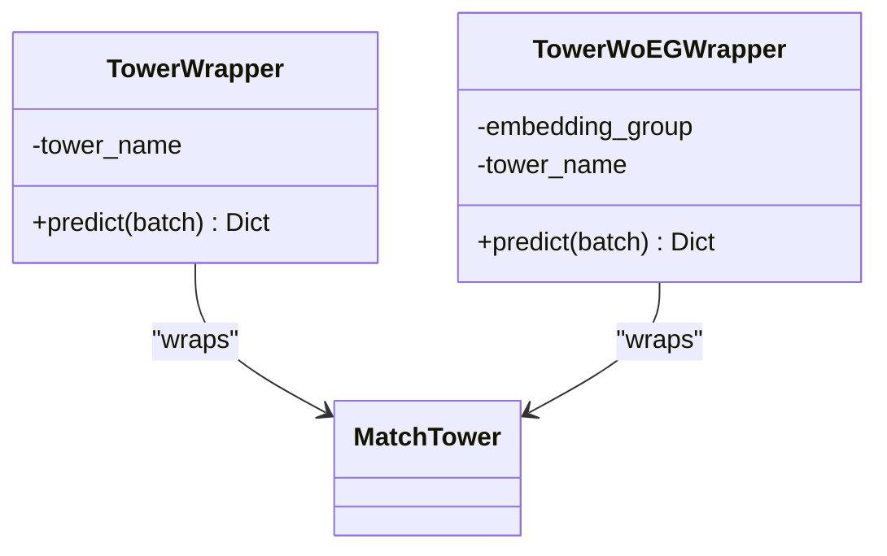

**Diagram sources**

- \[match_model.py\](file://tzrec/models/match_model.py#L453-L500)

**Section sources**

- \[match_model.py\](file://tzrec/models/match_model.py#L453-L500)

### Embedding Group Architecture

- Supports sparse, dense, and sequence features.
- Groups features by data group and constructs embedding collections accordingly.
- Provides per-group total and feature-wise dimensions for downstream towers.

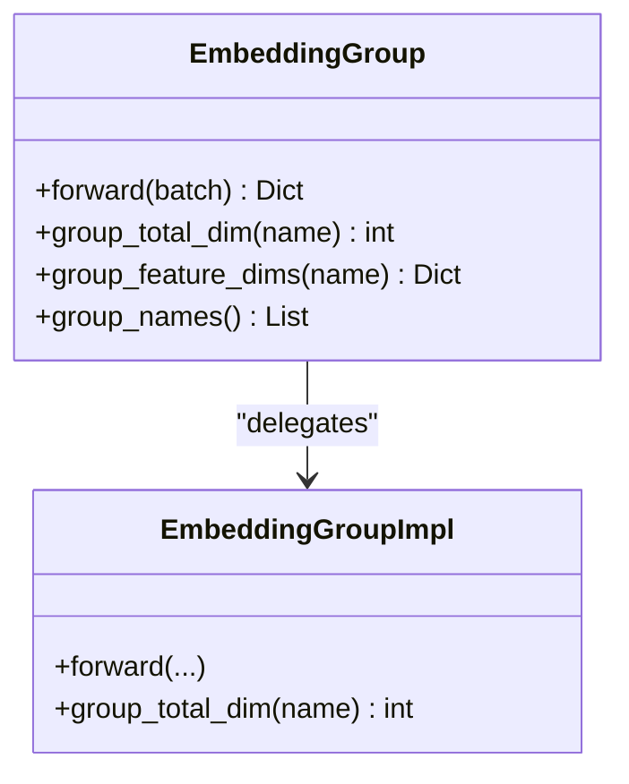

**Diagram sources**

- \[embedding.py\](file://tzrec/modules/embedding.py#L139-L508)

**Section sources**

- \[embedding.py\](file://tzrec/modules/embedding.py#L139-L508)

### Variational Dropout Integration

- Optional per-feature dropout regularization applied during feature processing.
- Tracks a penalty term per feature group for integration into the loss.

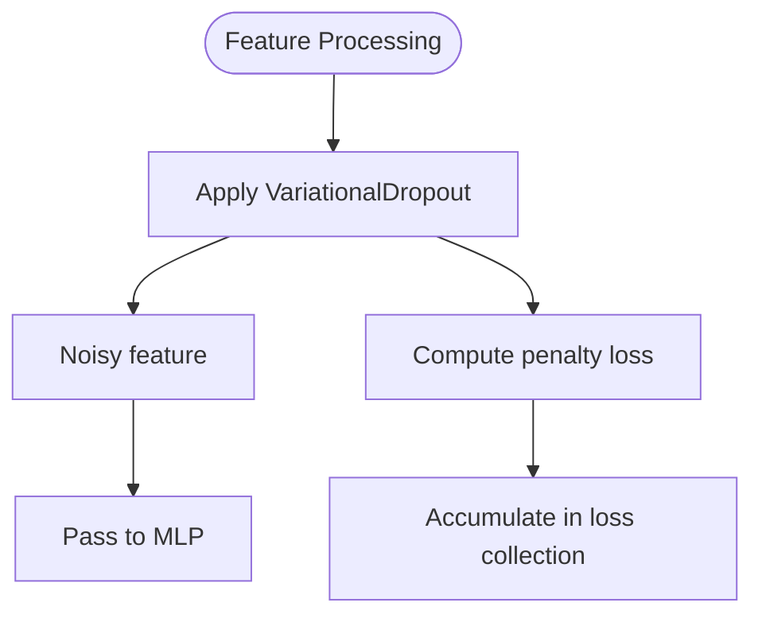

**Diagram sources**

- \[variational_dropout.py\](file://tzrec/modules/variational_dropout.py#L107-L119)
- \[match_model.py\](file://tzrec/models/match_model.py#L173-L190)

**Section sources**

- \[variational_dropout.py\](file://tzrec/modules/variational_dropout.py#L38-L119)
- \[match_model.py\](file://tzrec/models/match_model.py#L173-L190)

### Concrete Example: DSSM

- Demonstrates typical usage of MatchTower and MatchModel with MLP-based towers and cosine normalization for similarity.

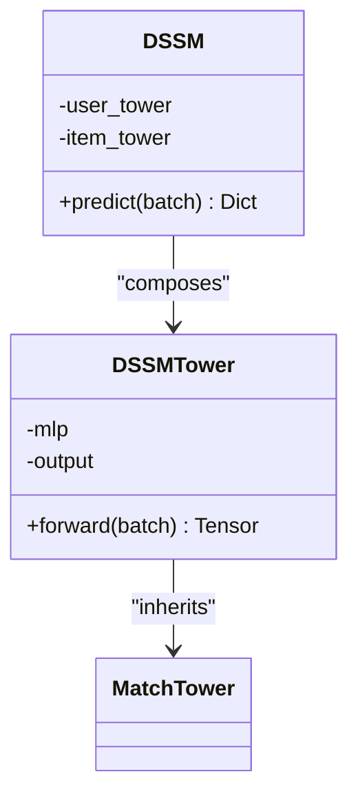

**Diagram sources**

- \[dssm.py\](file://tzrec/models/dssm.py#L38-L156)
- \[match_model.py\](file://tzrec/models/match_model.py#L110-L191)

**Section sources**

- \[dssm.py\](file://tzrec/models/dssm.py#L38-L156)
- \[match_model.py\](file://tzrec/models/match_model.py#L110-L191)

## Dependency Analysis

- MatchModel depends on BaseModel for common loss/metric scaffolding.
- Towers depend on EmbeddingGroup for feature grouping and embedding lookup.
- Optional VariationalDropout integrates into feature processing within towers.
- Samplers produce external negatives and hard negative indices for extended similarity computation.
- Protos define tower configurations and similarity types.

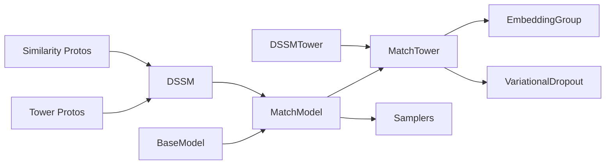

**Diagram sources**

- \[model.py\](file://tzrec/models/model.py#L39-L216)
- \[match_model.py\](file://tzrec/models/match_model.py#L225-L500)
- \[embedding.py\](file://tzrec/modules/embedding.py#L139-L508)
- \[variational_dropout.py\](file://tzrec/modules/variational_dropout.py#L38-L119)
- \[dssm.py\](file://tzrec/models/dssm.py#L86-L156)
- \[tower_pb2.py\](file://tzrec/protos/tower_pb2.py#L15-L55)
- \[simi_pb2.py\](file://tzrec/protos/simi_pb2.py#L17-L26)
- \[sampler.py\](file://tzrec/datasets/sampler.py#L219-L751)

**Section sources**

- \[model.py\](file://tzrec/models/model.py#L39-L216)
- \[match_model.py\](file://tzrec/models/match_model.py#L225-L500)
- \[embedding.py\](file://tzrec/modules/embedding.py#L139-L508)
- \[variational_dropout.py\](file://tzrec/modules/variational_dropout.py#L38-L119)
- \[dssm.py\](file://tzrec/models/dssm.py#L86-L156)
- \[tower_pb2.py\](file://tzrec/protos/tower_pb2.py#L15-L55)
- \[simi_pb2.py\](file://tzrec/protos/simi_pb2.py#L17-L26)
- \[sampler.py\](file://tzrec/datasets/sampler.py#L219-L751)

## Performance Considerations

- In-batch negatives: Efficient matrix operations scale with batch size squared for similarity computation. Suitable for moderate batch sizes.
- External negatives: Enables larger candidate sets and hard negatives, at the cost of increased memory and computation for concatenation and masking.
- Temperature scaling: Controls probability sharpness of similarity logits.
- Variational dropout: Adds regularization and slight computational overhead; useful for preventing overfitting in small datasets.
- JIT wrappers: Enable optimized inference for production deployment.

[No sources needed since this section provides general guidance]

## Troubleshooting Guide

- Loss assertion failures: MatchModel enforces softmax cross-entropy and single-loss configuration. Ensure only one softmax cross-entropy loss is configured.
- Metric assertion failures: Only recall@K is supported for match models. Ensure metrics configuration matches this requirement.
- Negative sampling mismatches: Verify sampler configuration aligns with model’s expectation of external negatives and hard negative indices.
- Feature group configuration: Ensure feature groups are properly defined and that sequence encoders are configured only for DEEP groups.

**Section sources**

- \[match_model.py\](file://tzrec/models/match_model.py#L265-L341)
- \[match_model.py\](file://tzrec/models/match_model.py#L331-L411)
- \[sampler.py\](file://tzrec/datasets/sampler.py#L464-L751)

## Conclusion

The MatchModel base architecture cleanly separates user and item representation learning, supports flexible negative sampling strategies, and provides a unified interface for similarity computation, loss, and metrics. The embedding group and optional variational dropout enable robust feature processing and regularization. The design accommodates both in-batch and external sampling, making it suitable for scalable retrieval scenarios.

[No sources needed since this section summarizes without analyzing specific files]

## Appendices

### Configuration Examples

- DSSM configuration demonstrates feature groups, user/item towers, output dimension, similarity type, and metrics/losses.

**Section sources**

- \[dssm_taobao.config\](file://examples/dssm_taobao.config#L201-L267)

### Similarity Types and Protos

- Similarity enum defines supported similarity functions used by match models.

**Section sources**

- \[simi_pb2.py\](file://tzrec/protos/simi_pb2.py#L17-L26)

### Tower Protos

- Protobuf definitions for tower configurations used by match models.

**Section sources**

- \[tower_pb2.py\](file://tzrec/protos/tower_pb2.py#L15-L55)
