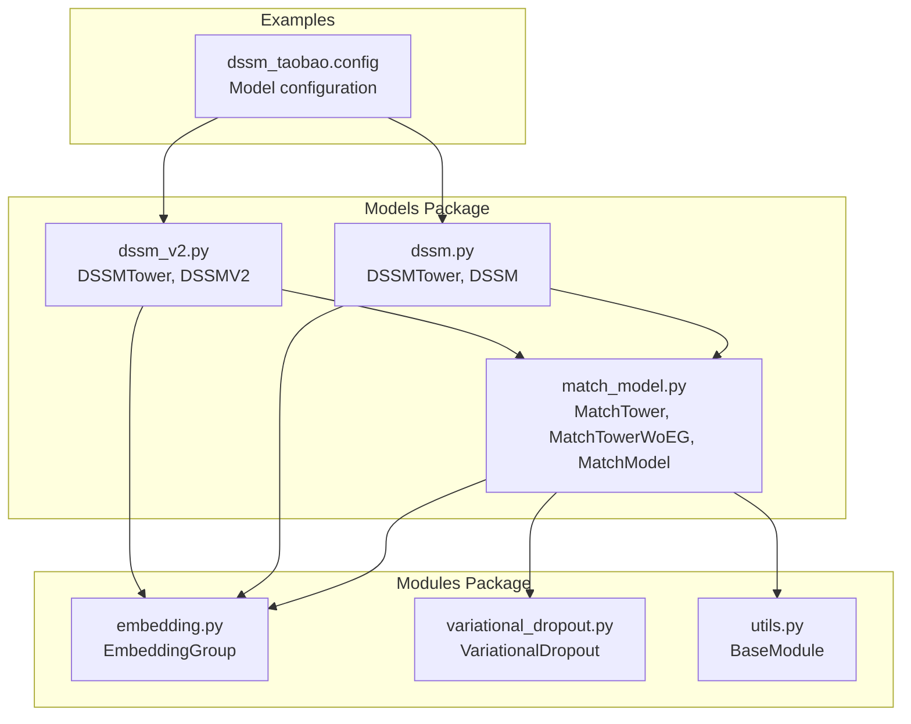
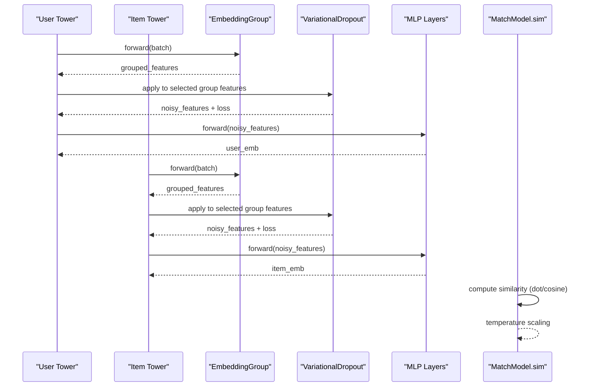
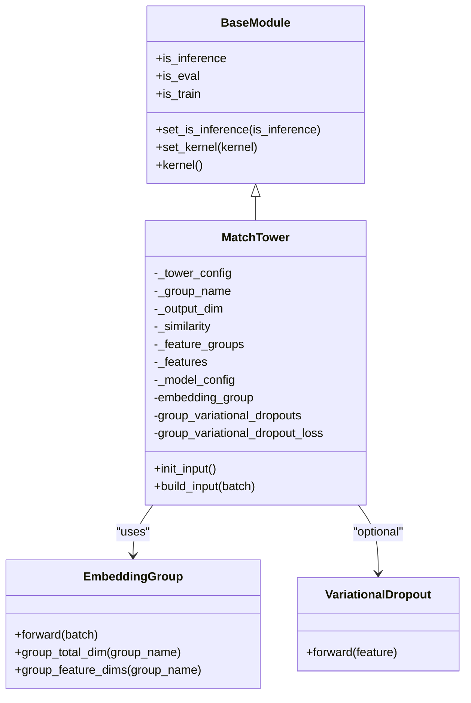
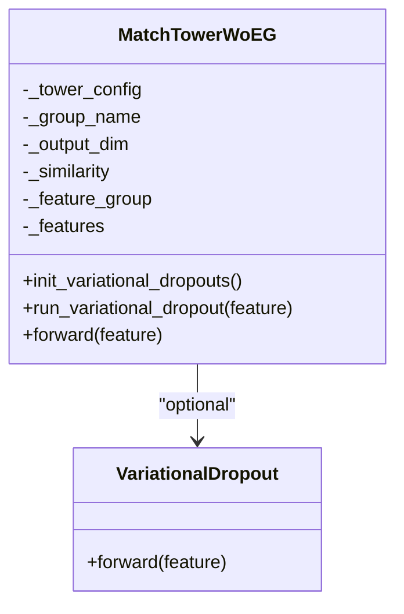
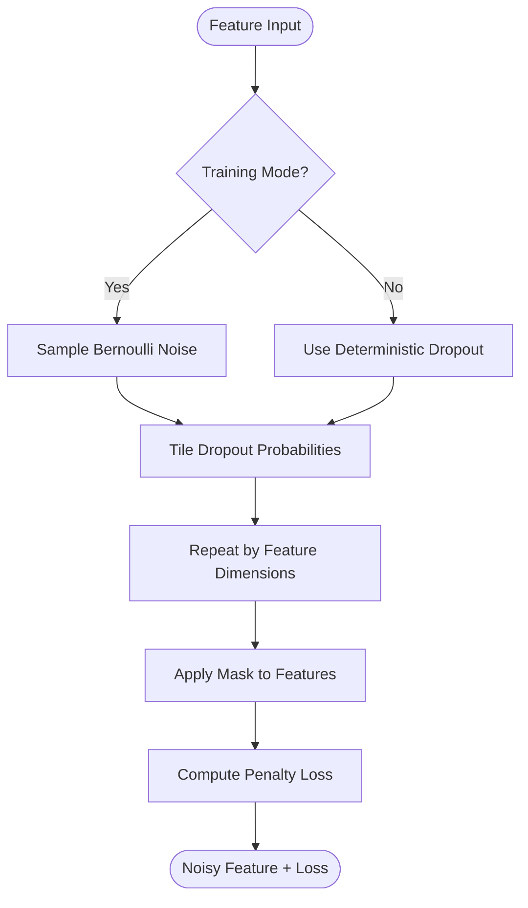
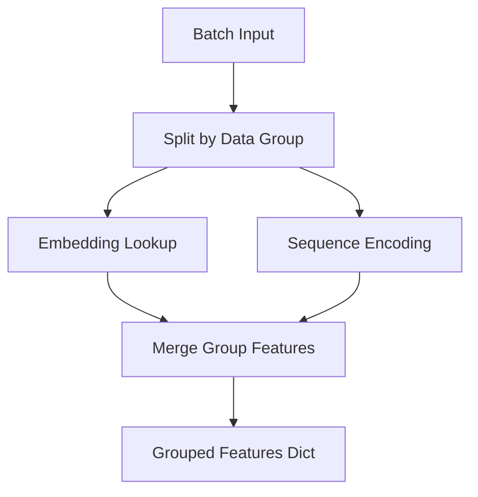
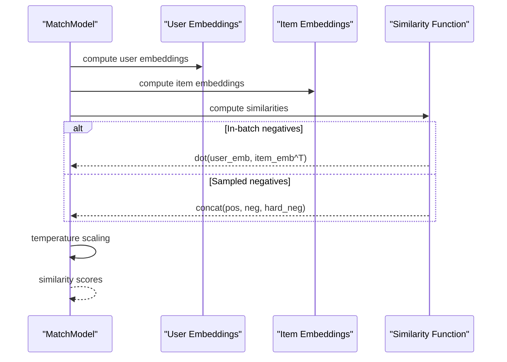
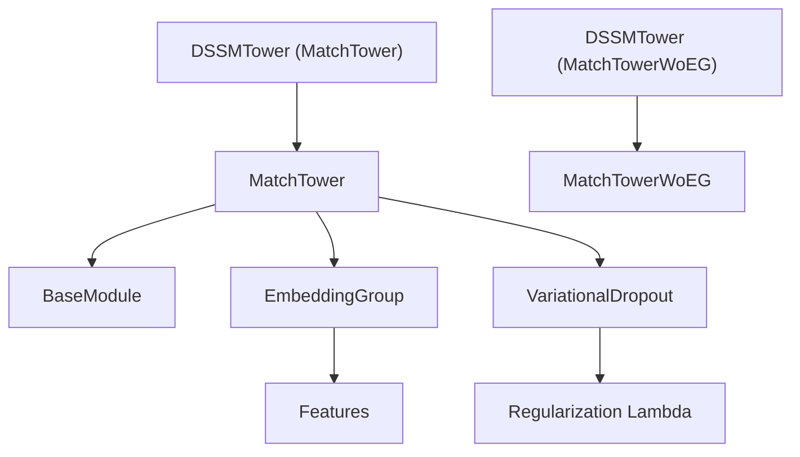

# MatchTower Base Class

<cite>
**Referenced Files in This Document**
- [match_model.py](file://tzrec/models/match_model.py)
- [embedding.py](file://tzrec/modules/embedding.py)
- [variational_dropout.py](file://tzrec/modules/variational_dropout.py)
- [utils.py](file://tzrec/modules/utils.py)
- [dssm.py](file://tzrec/models/dssm.py)
- [dssm_v2.py](file://tzrec/models/dssm_v2.py)
- [dssm_taobao.config](file://examples/dssm_taobao.config)
</cite>

## Table of Contents

1. [Introduction](#introduction)
1. [Project Structure](#project-structure)
1. [Core Components](#core-components)
1. [Architecture Overview](#architecture-overview)
1. [Detailed Component Analysis](#detailed-component-analysis)
1. [Dependency Analysis](#dependency-analysis)
1. [Performance Considerations](#performance-considerations)
1. [Troubleshooting Guide](#troubleshooting-guide)
1. [Conclusion](#conclusion)

## Introduction

This document explains the MatchTower base class architecture in TorchEasyRec, focusing on how user and item towers are designed for matching models. It covers the fundamental design that extends BaseModule to provide embedding group initialization, feature processing, and variational dropout integration. The document also compares MatchTower with its variant MatchTowerWoEG, detailing how shared embeddings are handled without embedding groups. Practical examples demonstrate configuration for different similarity functions and feature processing strategies, along with the relationship between tower architecture and downstream similarity computation.

## Project Structure

The MatchTower architecture spans several modules:

- Base class definitions and model orchestration in the models package
- Embedding group construction and feature grouping in the modules package
- Variational dropout regularization in the modules package
- Example model implementations (DSSM/DSSM V2) that inherit from MatchTower variants

**Diagram sources**

- \[match_model.py\](file://tzrec/models/match_model.py#L110-L233)
- \[embedding.py\](file://tzrec/modules/embedding.py#L139-L508)
- \[variational_dropout.py\](file://tzrec/modules/variational_dropout.py#L38-L119)
- \[utils.py\](file://tzrec/modules/utils.py#L21-L74)
- \[dssm.py\](file://tzrec/models/dssm.py#L38-L156)
- \[dssm_v2.py\](file://tzrec/models/dssm_v2.py#L30-L198)
- \[dssm_taobao.config\](file://examples/dssm_taobao.config#L201-L267)

**Section sources**

- \[match_model.py\](file://tzrec/models/match_model.py#L110-L233)
- \[embedding.py\](file://tzrec/modules/embedding.py#L139-L508)
- \[variational_dropout.py\](file://tzrec/modules/variational_dropout.py#L38-L119)
- \[utils.py\](file://tzrec/modules/utils.py#L21-L74)
- \[dssm.py\](file://tzrec/models/dssm.py#L38-L156)
- \[dssm_v2.py\](file://tzrec/models/dssm_v2.py#L30-L198)
- \[dssm_taobao.config\](file://examples/dssm_taobao.config#L201-L267)

## Core Components

- MatchTower: Base class extending BaseModule for user/item towers. It initializes an EmbeddingGroup and optional group-wise variational dropout modules. It processes batches through embedding groups and applies variational dropout when configured.
- MatchTowerWoEG: Variant that does not rely on EmbeddingGroup. Instead, it manages variational dropout directly and expects pre-grouped features as input tensors.
- VariationalDropout: Applies group-wise variational dropout regularization to selected feature groups, computing a penalty term integrated into training loss.
- EmbeddingGroup: Builds embedding lookups for feature groups, handling sparse, dense, and sequence features, and computes per-feature dimensions and total dimensions.

Key constructor parameters:

- tower_config: Tower configuration specifying input feature group and tower structure
- output_dim: Output embedding dimension for the tower
- similarity: Similarity setting (e.g., dot product vs cosine normalization)
- feature_groups: List of feature group configurations for MatchTower
- features: List of feature instances
- model_config: Model-level configuration including variational dropout settings

**Section sources**

- \[match_model.py\](file://tzrec/models/match_model.py#L110-L233)
- \[variational_dropout.py\](file://tzrec/modules/variational_dropout.py#L38-L119)
- \[embedding.py\](file://tzrec/modules/embedding.py#L139-L508)
- \[utils.py\](file://tzrec/modules/utils.py#L21-L74)

## Architecture Overview

The MatchTower architecture separates concerns between:

- Feature grouping and embedding lookup (via EmbeddingGroup)
- Regularization (via VariationalDropout)
- Tower-specific transformations (MLP layers, output projection)
- Similarity computation (via MatchModel)

**Diagram sources**

- \[match_model.py\](file://tzrec/models/match_model.py#L148-L191)
- \[match_model.py\](file://tzrec/models/match_model.py#L253-L264)
- \[embedding.py\](file://tzrec/modules/embedding.py#L407-L496)
- \[variational_dropout.py\](file://tzrec/modules/variational_dropout.py#L107-L119)
- \[dssm.py\](file://tzrec/models/dssm.py#L68-L84)

## Detailed Component Analysis

### MatchTower Base Class

MatchTower extends BaseModule and encapsulates:

- EmbeddingGroup initialization via init_input()
- Group-wise variational dropout setup
- Batch processing through build_input()
- Cosine normalization when similarity is set to cosine

Constructor parameters:

- tower_config: Defines input feature group and tower structure
- output_dim: Target embedding dimension
- similarity: Similarity mode affecting normalization
- feature_groups: Feature group configurations for embedding
- features: Feature instances
- model_config: Model-level configuration including variational dropout

Key methods:

- init_input(): Creates EmbeddingGroup and initializes group-wise VariationalDropout modules for non-sequence groups
- build_input(batch): Runs embedding group on batch, applies variational dropout per group, and returns grouped features with loss contributions stored in group_variational_dropout_loss

**Diagram sources**

- \[utils.py\](file://tzrec/modules/utils.py#L21-L74)
- \[match_model.py\](file://tzrec/models/match_model.py#L110-L191)
- \[embedding.py\](file://tzrec/modules/embedding.py#L139-L508)
- \[variational_dropout.py\](file://tzrec/modules/variational_dropout.py#L38-L119)

**Section sources**

- \[match_model.py\](file://tzrec/models/match_model.py#L110-L191)
- \[utils.py\](file://tzrec/modules/utils.py#L21-L74)

### MatchTowerWoEG Variant

MatchTowerWoEG is designed for scenarios where embeddings are shared across groups and an EmbeddingGroup is not used. It:

- Does not initialize an EmbeddingGroup
- Manages variational dropout directly on pre-grouped features
- Expects feature dimensions passed explicitly
- Integrates with MatchModel.predict to compute similarities

Key differences:

- Constructor takes a single feature_group instead of a list of feature_groups
- Variational dropout initialization is performed separately via init_variational_dropouts()
- Forward method receives a single tensor of grouped features and applies variational dropout before MLP

**Diagram sources**

- \[match_model.py\](file://tzrec/models/match_model.py#L193-L223)
- \[variational_dropout.py\](file://tzrec/modules/variational_dropout.py#L38-L119)

**Section sources**

- \[match_model.py\](file://tzrec/models/match_model.py#L193-L223)
- \[dssm_v2.py\](file://tzrec/models/dssm_v2.py#L30-L111)

### Variational Dropout Integration

VariationalDropout adds group-wise regularization by:

- Learning per-feature dropout probabilities via a parameter vector
- Applying stochastic masking during training and deterministic scaling during evaluation
- Computing a penalty term proportional to the dropout probability, scaled by regularization_lambda and batch size
- Returning both the noisy input and the regularization loss for integration into training

**Diagram sources**

- \[variational_dropout.py\](file://tzrec/modules/variational_dropout.py#L71-L119)

**Section sources**

- \[variational_dropout.py\](file://tzrec/modules/variational_dropout.py#L38-L119)

### Feature Processing with EmbeddingGroup

EmbeddingGroup performs:

- Sparse and dense embedding lookups per feature group
- Sequence feature encoding when configured
- Aggregation of per-feature tensors into grouped feature dictionaries
- Computation of per-feature dimensions and total dimensions for downstream towers

**Diagram sources**

- \[embedding.py\](file://tzrec/modules/embedding.py#L407-L496)

**Section sources**

- \[embedding.py\](file://tzrec/modules/embedding.py#L139-L508)

### Practical Configuration Examples

#### Dot Product Similarity

- Configure similarity mode to dot product in model_config
- No normalization applied in the tower forward pass
- Suitable for models that normalize embeddings externally or rely on learned temperature scaling

Example configuration reference:

- Similarity setting in model configuration for DSSM

**Section sources**

- \[dssm_taobao.config\](file://examples/dssm_taobao.config#L201-L267)
- \[dssm.py\](file://tzrec/models/dssm.py#L82-L83)

#### Cosine Similarity

- Set similarity mode to cosine in model_config
- Tower forward normalizes output embeddings using L2 normalization
- Improves robustness to magnitude variations in embeddings

Example configuration reference:

- Similarity setting in model configuration for DSSM

**Section sources**

- \[dssm_taobao.config\](file://examples/dssm_taobao.config#L201-L267)
- \[dssm.py\](file://tzrec/models/dssm.py#L81-L83)

#### Feature Processing Strategies

- Feature groups define which features belong to user and item towers
- Sequence features can be included via sequence_groups and sequence_encoders
- Dense features and sparse features are handled by EmbeddingGroup

Example configuration reference:

- Feature groups and sequence encoders in DSSM configuration

**Section sources**

- \[dssm_taobao.config\](file://examples/dssm_taobao.config#L202-L237)
- \[embedding.py\](file://tzrec/modules/embedding.py#L272-L343)

### Relationship Between Tower Architecture and Similarity Computation

- Towers produce user and item embeddings after applying MLP and optional normalization
- MatchModel.sim computes either in-batch or sampled similarities
- Temperature scaling is applied to similarity scores
- Hard negatives can be incorporated via sparse indices for fine-grained ranking

**Diagram sources**

- \[match_model.py\](file://tzrec/models/match_model.py#L253-L264)
- \[match_model.py\](file://tzrec/models/match_model.py#L50-L108)

**Section sources**

- \[match_model.py\](file://tzrec/models/match_model.py#L225-L452)

## Dependency Analysis

MatchTower depends on:

- BaseModule for common module utilities and kernel selection
- EmbeddingGroup for feature grouping and embedding lookups
- VariationalDropout for regularization when enabled

**Diagram sources**

- \[match_model.py\](file://tzrec/models/match_model.py#L110-L233)
- \[utils.py\](file://tzrec/modules/utils.py#L21-L74)
- \[embedding.py\](file://tzrec/modules/embedding.py#L139-L508)
- \[variational_dropout.py\](file://tzrec/modules/variational_dropout.py#L38-L119)
- \[dssm.py\](file://tzrec/models/dssm.py#L38-L84)
- \[dssm_v2.py\](file://tzrec/models/dssm_v2.py#L30-L111)

**Section sources**

- \[match_model.py\](file://tzrec/models/match_model.py#L110-L233)
- \[dssm.py\](file://tzrec/models/dssm.py#L38-L84)
- \[dssm_v2.py\](file://tzrec/models/dssm_v2.py#L30-L111)

## Performance Considerations

- EmbeddingGroup consolidates embedding lookups and sequence encodings, reducing overhead
- Variational dropout adds minimal computational cost during training while providing regularization benefits
- Cosine normalization is lightweight but improves numerical stability for similarity computations
- Temperature scaling helps control similarity magnitudes and improves ranking quality

## Troubleshooting Guide

Common issues and resolutions:

- Variational dropout not applied: Ensure model_config includes variational_dropout and that feature groups are not SEQUENCE type
- Incorrect feature dimensions: Verify group_feature_dims and group_total_dim calculations via EmbeddingGroup
- Normalization mismatch: Confirm similarity setting aligns with intended normalization behavior
- Hard negative indexing errors: Validate hard_neg_indices shape and sparsity format when using sampled negatives

**Section sources**

- \[match_model.py\](file://tzrec/models/match_model.py#L148-L191)
- \[match_model.py\](file://tzrec/models/match_model.py#L50-L108)
- \[embedding.py\](file://tzrec/modules/embedding.py#L388-L401)

## Conclusion

MatchTower provides a flexible and extensible foundation for building user and item towers in matching models. By leveraging EmbeddingGroup for feature processing and integrating VariationalDropout for regularization, it supports both standard and advanced architectures. MatchTowerWoEG complements this design for scenarios requiring shared embeddings without embedding groups. Together, these components enable efficient and scalable matching systems with configurable similarity computation and robust training dynamics.
