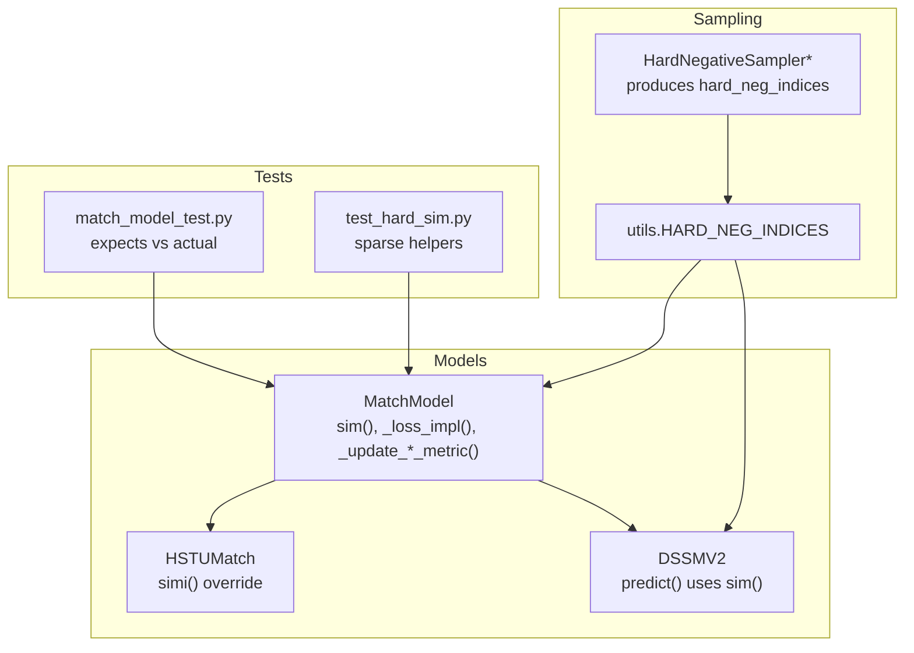
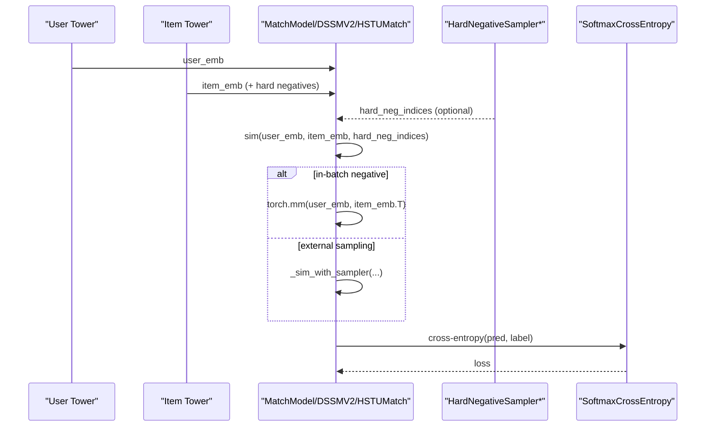
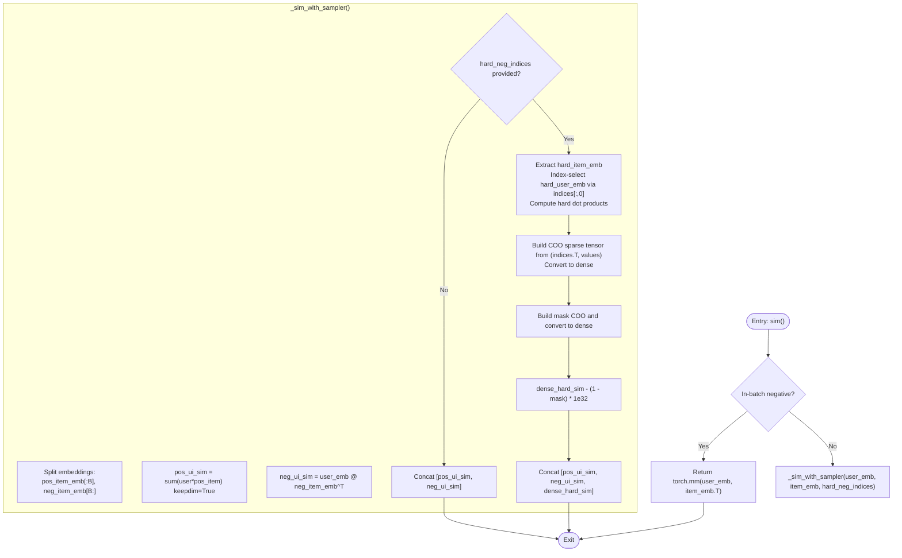
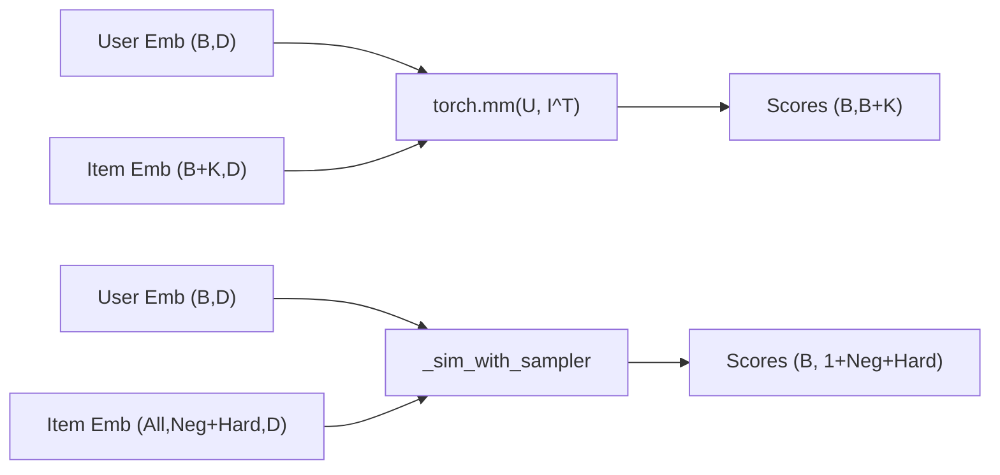
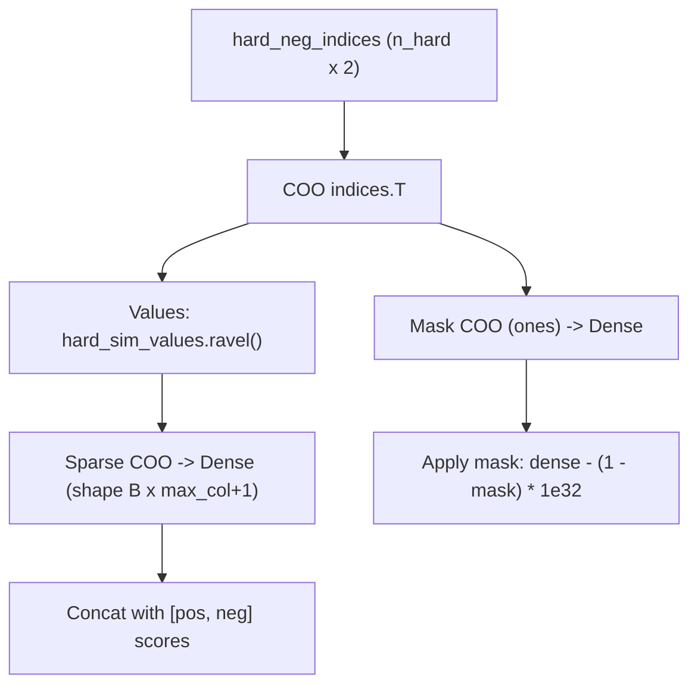
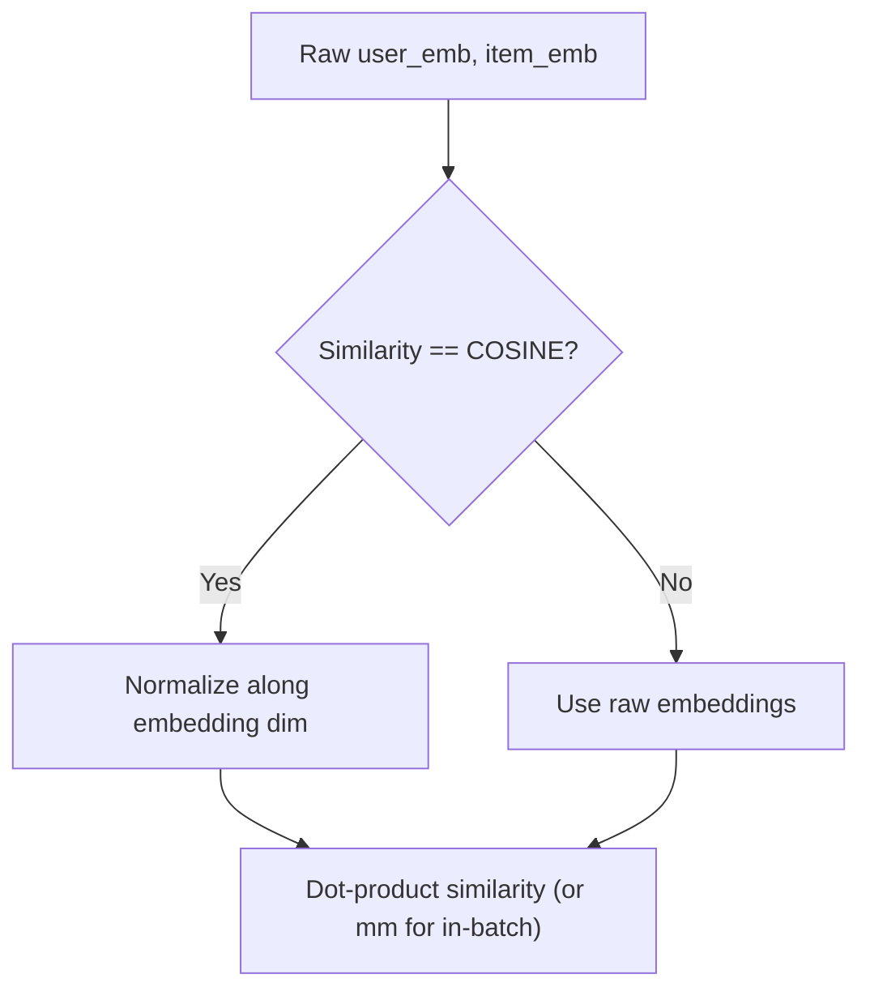
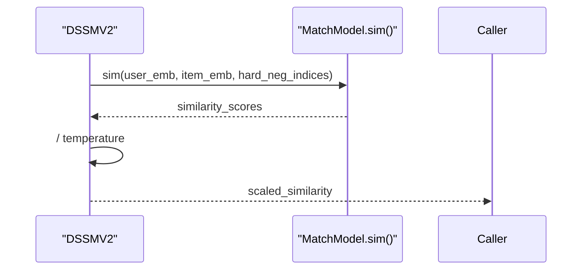
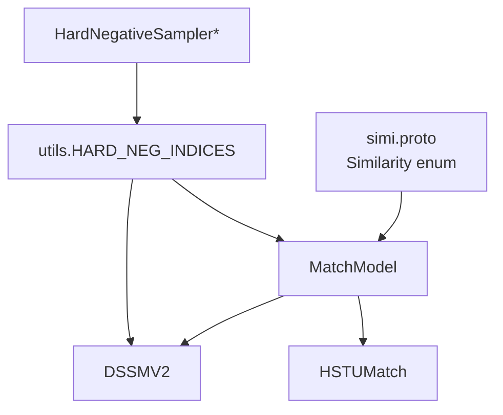

# Similarity Computation Methods

<cite>
**Referenced Files in This Document**
- [match_model.py](file://tzrec/models/match_model.py)
- [match_model_test.py](file://tzrec/models/match_model_test.py)
- [dssm_v2.py](file://tzrec/models/dssm_v2.py)
- [hstu.py](file://tzrec/models/hstu.py)
- [sampler.py](file://tzrec/datasets/sampler.py)
- [utils.py](file://tzrec/datasets/utils.py)
- [test_hard_sim.py](file://experiments/test_hard_sim.py)
- [simi.proto](file://tzrec/protos/simi.proto)
</cite>

## Table of Contents

1. [Introduction](#introduction)
1. [Project Structure](#project-structure)
1. [Core Components](#core-components)
1. [Architecture Overview](#architecture-overview)
1. [Detailed Component Analysis](#detailed-component-analysis)
1. [Dependency Analysis](#dependency-analysis)
1. [Performance Considerations](#performance-considerations)
1. [Troubleshooting Guide](#troubleshooting-guide)
1. [Conclusion](#conclusion)

## Introduction

This document explains the similarity computation methods used in match models, focusing on:

- The core sim() method in MatchModel that computes user-item embedding similarity
- In-batch negative sampling versus external sampling (including hard negatives)
- The \_sim_with_sampler() helper that orchestrates positive pairs, negative samples, and hard negatives
- Differences between torch.mm() for in-batch scenarios and more complex matrix operations for external sampling
- Normalization of embeddings for cosine similarity
- Handling of hard negative indices via sparse tensors and masking
- Examples of similarity computation across sampling strategies, batch sizes, and embedding dimensions
- Performance and memory optimization techniques

## Project Structure

The relevant implementation spans model definitions, sampling utilities, and tests:

- MatchModel and helper functions for similarity computation
- Model-specific overrides for specialized similarity logic
- Sampler utilities that produce hard negative indices
- Tests validating expected outputs for different configurations

**Diagram sources**

- \[match_model.py\](file://tzrec/models/match_model.py#L225-L451)
- \[dssm_v2.py\](file://tzrec/models/dssm_v2.py#L113-L198)
- \[hstu.py\](file://tzrec/models/hstu.py#L120-L231)
- \[sampler.py\](file://tzrec/datasets/sampler.py#L630-L750)
- \[utils.py\](file://tzrec/datasets/utils.py#L25-L40)
- \[match_model_test.py\](file://tzrec/models/match_model_test.py#L51-L132)
- \[test_hard_sim.py\](file://experiments/test_hard_sim.py#L1-L68)

**Section sources**

- \[match_model.py\](file://tzrec/models/match_model.py#L225-L451)
- \[dssm_v2.py\](file://tzrec/models/dssm_v2.py#L113-L198)
- \[hstu.py\](file://tzrec/models/hstu.py#L120-L231)
- \[sampler.py\](file://tzrec/datasets/sampler.py#L630-L750)
- \[utils.py\](file://tzrec/datasets/utils.py#L25-L40)
- \[match_model_test.py\](file://tzrec/models/match_model_test.py#L51-L132)
- \[test_hard_sim.py\](file://experiments/test_hard_sim.py#L1-L68)

## Core Components

- MatchModel.sim(): central entry for computing user-item similarity. It routes to torch.mm() for in-batch negatives or to \_sim_with_sampler() for external sampling (including hard negatives).
- \_sim_with_sampler(): computes:
  - Positive pair similarities (dot product between matched user and item embeddings)
  - Negative pair similarities (matrix multiplication for non-matching pairs)
  - Hard negative similarities (sparse-indexed dot products), then densifies and masks
- DSSMV2.predict(): calls sim() and applies temperature scaling
- HSTUMatch.simi(): specialized override for HSTU-style grouping of positives/negatives
- HardNegativeSampler\*: produces hard_neg_indices and appends hard negatives to the negative pool

Key behaviors:

- In-batch negative mode: uses torch.mm(user_emb, item_emb.T) for O(B^2) comparisons
- External sampling mode: uses \_sim_with_sampler() to handle mixed pools of simple negatives and hard negatives
- Cosine normalization: applied in towers when similarity type is set to COSINE

**Section sources**

- \[match_model.py\](file://tzrec/models/match_model.py#L253-L264)
- \[match_model.py\](file://tzrec/models/match_model.py#L50-L108)
- \[dssm_v2.py\](file://tzrec/models/dssm_v2.py#L189-L197)
- \[hstu.py\](file://tzrec/models/hstu.py#L206-L231)
- \[sampler.py\](file://tzrec/datasets/sampler.py#L630-L750)
- \[simi.proto\](file://tzrec/protos/simi.proto#L4-L8)

## Architecture Overview

The similarity pipeline integrates model outputs, sampling, and loss/metric updates.

**Diagram sources**

- \[match_model.py\](file://tzrec/models/match_model.py#L253-L315)
- \[dssm_v2.py\](file://tzrec/models/dssm_v2.py#L189-L197)
- \[hstu.py\](file://tzrec/models/hstu.py#L206-L231)
- \[sampler.py\](file://tzrec/datasets/sampler.py#L630-L750)

## Detailed Component Analysis

### MatchModel.sim() and \_sim_with_sampler()

- MatchModel.sim():
  - If in-batch negative is enabled, returns torch.mm(user_emb, item_emb.T)
  - Otherwise delegates to \_sim_with_sampler() for external sampling
- \_sim_with_sampler():
  - Computes positive similarities by element-wise multiply along the embedding dimension, then keepsdim
  - Computes negative similarities via matrix multiplication user_emb @ neg_item_emb^T
  - For hard negatives:
    - Extracts hard_item_emb and selects corresponding user_emb rows via hard_neg_indices[:, 0]
    - Computes per-pair dot products and builds a COO sparse tensor with indices hard_neg_indices.T
    - Converts to dense and subtracts a large penalty for missing entries using a mask tensor

**Diagram sources**

- \[match_model.py\](file://tzrec/models/match_model.py#L253-L264)
- \[match_model.py\](file://tzrec/models/match_model.py#L50-L108)

**Section sources**

- \[match_model.py\](file://tzrec/models/match_model.py#L253-L264)
- \[match_model.py\](file://tzrec/models/match_model.py#L50-L108)

### In-Batch vs External Sampling

- In-batch negative:
  - torch.mm(user_emb, item_emb.T) yields a B×(B+K) matrix where K is the number of negatives appended after positives
  - Suitable when positives and negatives are concatenated in-batch
- External sampling:
  - \_sim_with_sampler() supports arbitrary pools of simple negatives plus hard negatives
  - Enables heterogeneous negative sets and hard negatives produced by graph sampling

**Diagram sources**

- \[match_model.py\](file://tzrec/models/match_model.py#L253-L264)
- \[match_model.py\](file://tzrec/models/match_model.py#L50-L108)

**Section sources**

- \[match_model.py\](file://tzrec/models/match_model.py#L253-L264)
- \[match_model.py\](file://tzrec/models/match_model.py#L50-L108)

### Hard Negative Indices and Sparse Tensor Handling

- Hard negatives are produced by HardNegativeSampler\* and stored under utils.HARD_NEG_INDICES
- The helper constructs:
  - A sparse COO tensor from (row=indices[:,0], col=indices[:,1], values=hard_sim_values)
  - A mask COO tensor to mark presence of hard negatives
  - Converts both to dense matrices and applies a large penalty to absent positions

**Diagram sources**

- \[match_model.py\](file://tzrec/models/match_model.py#L50-L108)
- \[sampler.py\](file://tzrec/datasets/sampler.py#L630-L750)
- \[utils.py\](file://tzrec/datasets/utils.py#L25-L40)
- \[test_hard_sim.py\](file://experiments/test_hard_sim.py#L5-L68)

**Section sources**

- \[match_model.py\](file://tzrec/models/match_model.py#L50-L108)
- \[sampler.py\](file://tzrec/datasets/sampler.py#L630-L750)
- \[utils.py\](file://tzrec/datasets/utils.py#L25-L40)
- \[test_hard_sim.py\](file://experiments/test_hard_sim.py#L5-L68)

### Cosine Similarity and Normalization

- When similarity type is set to COSINE, embeddings are normalized before similarity computation:
  - In towers: normalization is applied post-MLP and pre-similarity
  - In MatchModel, the helper uses dot products; with normalized embeddings, dot products approximate cosine similarity
- The similarity enum is defined in simi.proto

**Diagram sources**

- \[dssm_v2.py\](file://tzrec/models/dssm_v2.py#L108-L110)
- \[simi.proto\](file://tzrec/protos/simi.proto#L4-L8)

**Section sources**

- \[dssm_v2.py\](file://tzrec/models/dssm_v2.py#L108-L110)
- \[simi.proto\](file://tzrec/protos/simi.proto#L4-L8)

### Model-Specific Overrides

- HSTUMatch.simi():
  - Specializes external sampling for grouped sequences
  - Supports two modes for negative aggregation per user
- DSSMV2.predict():
  - Calls sim() and divides by temperature for sharper distributions

**Diagram sources**

- \[hstu.py\](file://tzrec/models/hstu.py#L206-L231)
- \[dssm_v2.py\](file://tzrec/models/dssm_v2.py#L189-L197)

**Section sources**

- \[hstu.py\](file://tzrec/models/hstu.py#L206-L231)
- \[dssm_v2.py\](file://tzrec/models/dssm_v2.py#L189-L197)

### Example Scenarios and Expected Shapes

- In-batch negative:
  - Inputs: user_emb (B,D), item_emb (B,D)
  - Output: scores (B,B) via torch.mm
- External sampling (no hard negatives):
  - Inputs: user_emb (B,D), item_emb (B+N,D)
  - Output: scores (B,1+N)
- External sampling (with hard negatives):
  - Inputs: user_emb (B,D), item_emb (B+N+H,D), hard_neg_indices (H,2)
  - Output: scores (B,1+N+H)

These shapes align with test expectations for recall and loss.

**Section sources**

- \[match_model_test.py\](file://tzrec/models/match_model_test.py#L98-L128)
- \[hstu.py\](file://tzrec/models/hstu.py#L206-L231)
- \[dssm_v2.py\](file://tzrec/models/dssm_v2.py#L189-L197)

## Dependency Analysis

- MatchModel depends on:
  - Similarity configuration (COSINE vs INNER_PRODUCT)
  - In-batch flag to choose torch.mm() vs helper
  - Additional infos for hard_neg_indices
- DSSMV2 and HSTUMatch depend on MatchModel’s sim() and may override it for specialized layouts
- Sampler utilities feed hard_neg_indices into the pipeline

**Diagram sources**

- \[simi.proto\](file://tzrec/protos/simi.proto#L4-L8)
- \[match_model.py\](file://tzrec/models/match_model.py#L225-L451)
- \[dssm_v2.py\](file://tzrec/models/dssm_v2.py#L113-L198)
- \[hstu.py\](file://tzrec/models/hstu.py#L120-L231)
- \[sampler.py\](file://tzrec/datasets/sampler.py#L630-L750)
- \[utils.py\](file://tzrec/datasets/utils.py#L25-L40)

**Section sources**

- \[simi.proto\](file://tzrec/protos/simi.proto#L4-L8)
- \[match_model.py\](file://tzrec/models/match_model.py#L225-L451)
- \[dssm_v2.py\](file://tzrec/models/dssm_v2.py#L113-L198)
- \[hstu.py\](file://tzrec/models/hstu.py#L120-L231)
- \[sampler.py\](file://tzrec/datasets/sampler.py#L630-L750)
- \[utils.py\](file://tzrec/datasets/utils.py#L25-L40)

## Performance Considerations

- In-batch negative:
  - torch.mm scales as O(B^2D) for B users and D embedding dim
  - Memory intensive; suitable when negatives fit in memory and batch size is moderate
- External sampling:
  - \_sim_with_sampler() avoids full B×B matrix when negatives are large
  - Hard negatives are processed via sparse-to-dense conversion; cost depends on number of hard negatives and max negative index
- Normalization:
  - L2-normalization adds overhead but improves similarity quality for cosine
- Temperature scaling:
  - DSSMV2 divides similarity by temperature to sharpen distributions during inference

[No sources needed since this section provides general guidance]

## Troubleshooting Guide

Common issues and checks:

- Incorrect output shape:
  - Verify in-batch flag and concatenation order of positives/negatives
  - Confirm hard_neg_indices shape and range relative to batch size
- Numerical instability:
  - Ensure embeddings are normalized when using cosine similarity
  - Check temperature scaling to avoid extreme softmax saturation
- Sparse mask artifacts:
  - Confirm that missing hard negative positions are masked with a large penalty
  - Validate indices are within bounds of the dense matrix

**Section sources**

- \[match_model.py\](file://tzrec/models/match_model.py#L253-L315)
- \[dssm_v2.py\](file://tzrec/models/dssm_v2.py#L189-L197)
- \[test_hard_sim.py\](file://experiments/test_hard_sim.py#L5-L68)

## Conclusion

MatchModel provides a flexible similarity computation backbone:

- In-batch mode uses efficient matrix multiplication
- External sampling leverages \_sim_with_sampler() to combine simple negatives and hard negatives
- Cosine similarity is supported by embedding normalization
- Tests validate expected shapes and metrics across configurations

[No sources needed since this section summarizes without analyzing specific files]
