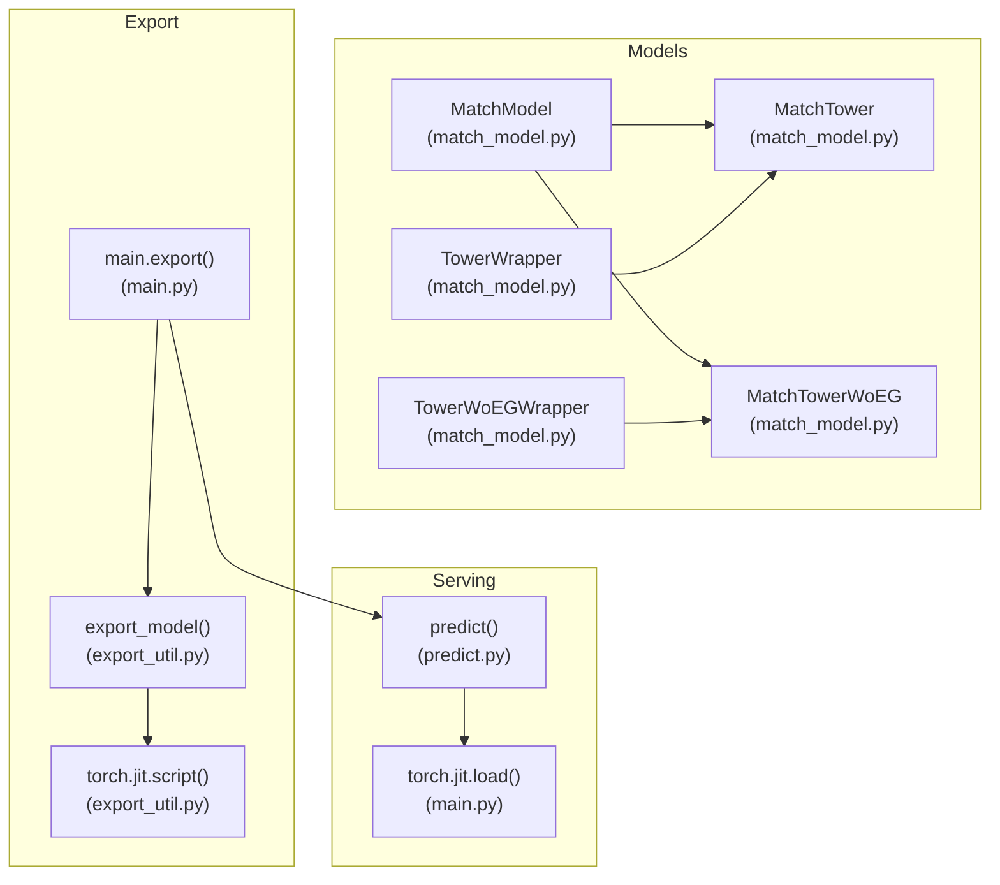
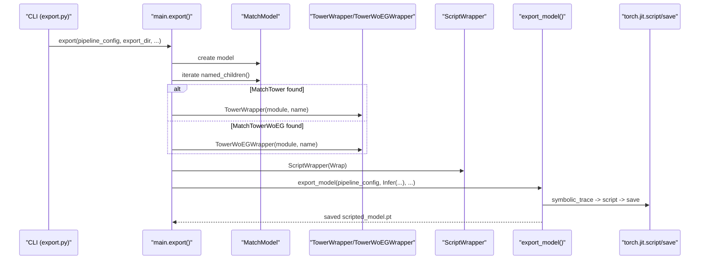
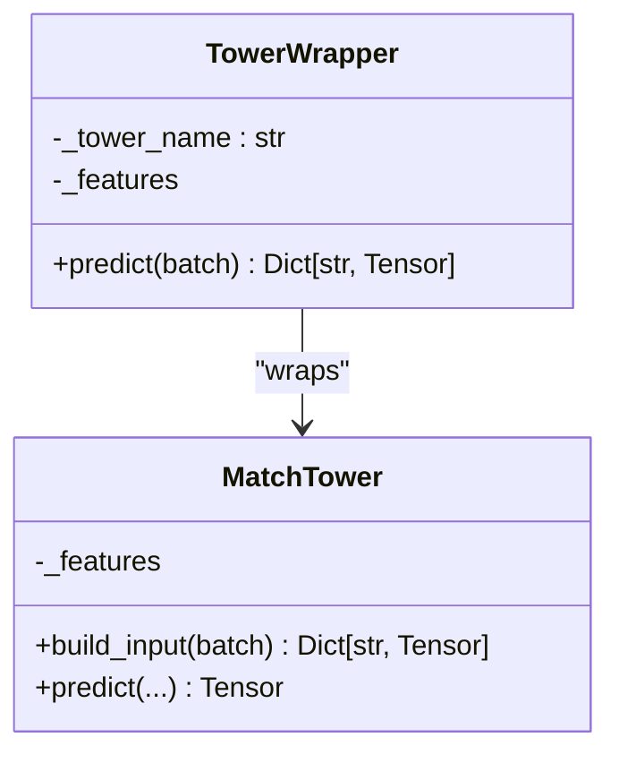
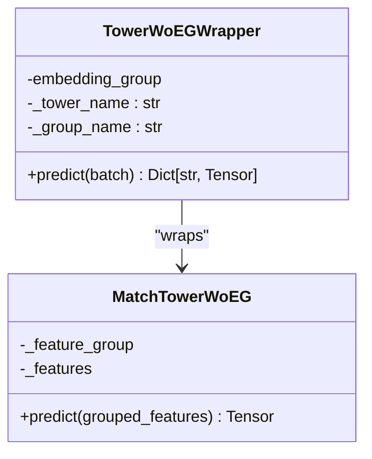
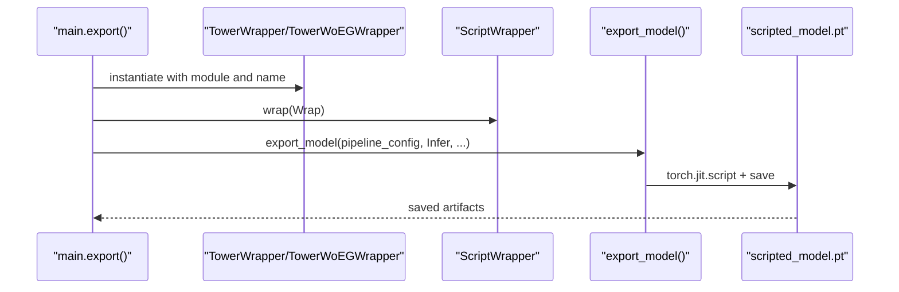

# Tower Wrappers for Inference

<cite>
**Referenced Files in This Document**
- [match_model.py](file://tzrec/models/match_model.py)
- [main.py](file://tzrec/main.py)
- [export_util.py](file://tzrec/utils/export_util.py)
- [export.py](file://tzrec/export.py)
- [predict.py](file://tzrec/predict.py)
</cite>

## Table of Contents

1. [Introduction](#introduction)
1. [Project Structure](#project-structure)
1. [Core Components](#core-components)
1. [Architecture Overview](#architecture-overview)
1. [Detailed Component Analysis](#detailed-component-analysis)
1. [Dependency Analysis](#dependency-analysis)
1. [Performance Considerations](#performance-considerations)
1. [Troubleshooting Guide](#troubleshooting-guide)
1. [Conclusion](#conclusion)

## Introduction

This document explains the tower wrapper classes used for inference and TorchScript compilation in matching models. It focuses on:

- TowerWrapper: a JIT-scriptable wrapper enabling inference for MatchTower modules with embedding groups.
- TowerWoEGWrapper: a wrapper for towers without embedding groups, reconstructing embedding groups during inference.
- Standardized predict() outputs with tower-specific naming conventions.
- Integration with TorchScript/AOT/RTD export and production serving pipelines.

These wrappers ensure that individual towers can be exported and served independently, while preserving feature handling and embedding group semantics.

## Project Structure

The relevant components are organized across model definitions, export utilities, and CLI entry points:

- Tower wrapper classes live in the matching model module.
- Export orchestration and per-tower export logic are in the main export pipeline.
- Serving loads exported scripted models and runs prediction loops.

**Diagram sources**

- \[match_model.py\](file://tzrec/models/match_model.py#L452-L500)
- \[main.py\](file://tzrec/main.py#L840-L937)
- \[export_util.py\](file://tzrec/utils/export_util.py#L75-L239)
- \[predict.py\](file://tzrec/predict.py#L1-L144)

**Section sources**

- \[match_model.py\](file://tzrec/models/match_model.py#L452-L500)
- \[main.py\](file://tzrec/main.py#L840-L937)
- \[export_util.py\](file://tzrec/utils/export_util.py#L75-L239)
- \[predict.py\](file://tzrec/predict.py#L1-L144)

## Core Components

- TowerWrapper: wraps a MatchTower to expose a unified predict() interface returning a standardized dictionary with a tower-specific embedding key.
- TowerWoEGWrapper: wraps a MatchTowerWoEG by constructing an EmbeddingGroup internally and forwarding grouped features to the tower’s predict-like call.
- Both wrappers dynamically attach the underlying tower module under a configurable name and preserve feature metadata for export.

Key behaviors:

- Dynamic attribute setting via setattr(self, tower_name, module) ensures the wrapped module is addressable by name.
- predict() returns a dictionary with a single key "\<tower_name>\_emb", aligning with downstream expectations.
- TowerWoEGWrapper rebuilds the embedding group from the single feature group associated with MatchTowerWoEG.

**Section sources**

- \[match_model.py\](file://tzrec/models/match_model.py#L452-L500)

## Architecture Overview

The export pipeline detects matching models and exports each tower independently. Each tower is wrapped with TowerWrapper or TowerWoEGWrapper, then exported as a standalone TorchScript module.

**Diagram sources**

- \[export.py\](file://tzrec/export.py#L1-L51)
- \[main.py\](file://tzrec/main.py#L840-L937)
- \[export_util.py\](file://tzrec/utils/export_util.py#L75-L239)
- \[match_model.py\](file://tzrec/models/match_model.py#L452-L500)

## Detailed Component Analysis

### TowerWrapper

Purpose:

- Enable JIT scripting for MatchTower modules with embedding groups.
- Provide a standardized predict() method returning a dictionary with a tower-specific embedding key.

Implementation highlights:

- Dynamically attaches the underlying module under a configurable name.
- Exposes predict(batch) that returns a dictionary with a single key "\<tower_name>\_emb".
- Preserves feature metadata for export-time tracing.

**Diagram sources**

- \[match_model.py\](file://tzrec/models/match_model.py#L452-L472)

**Section sources**

- \[match_model.py\](file://tzrec/models/match_model.py#L452-L472)

### TowerWoEGWrapper

Purpose:

- Enable JIT scripting for MatchTowerWoEG modules that do not own an embedding group.
- Reconstruct the embedding group at inference time using the single feature group associated with the tower.

Implementation highlights:

- Constructs an EmbeddingGroup from module.\_feature_group during initialization.
- Calls embedding_group(batch) to produce grouped features.
- Forwards grouped features to the underlying tower module and returns a standardized embedding dictionary.

**Diagram sources**

- \[match_model.py\](file://tzrec/models/match_model.py#L474-L500)

**Section sources**

- \[match_model.py\](file://tzrec/models/match_model.py#L474-L500)

### Integration with Export and Serving Pipelines

- Export orchestration:
  - main.export() detects a MatchModel and iterates its children.
  - For each MatchTower, it creates TowerWrapper; for each MatchTowerWoEG, it creates TowerWoEGWrapper.
  - Each wrapper is wrapped with ScriptWrapper and exported via export_model().
  - export_model() traces the model, scripts it, and saves scripted_model.pt along with auxiliary assets.
- Serving:
  - predict() loads the scripted model and runs batches through it.
  - The wrapper’s predict() returns a dictionary with a single "\<tower_name>\_emb" key, suitable for downstream aggregation or retrieval.

**Diagram sources**

- \[main.py\](file://tzrec/main.py#L896-L910)
- \[export_util.py\](file://tzrec/utils/export_util.py#L209-L239)
- \[match_model.py\](file://tzrec/models/match_model.py#L452-L500)

**Section sources**

- \[main.py\](file://tzrec/main.py#L896-L910)
- \[export_util.py\](file://tzrec/utils/export_util.py#L209-L239)

## Dependency Analysis

- TowerWrapper depends on:
  - The underlying MatchTower’s predict() method and its internal feature metadata.
  - The Batch input format expected by the tower’s build_input().
- TowerWoEGWrapper additionally depends on:
  - Creating an EmbeddingGroup from the single feature group owned by MatchTowerWoEG.
  - Forwarding the grouped tensor under the tower’s expected group name.

Coupling and cohesion:

- Wrappers are cohesive around a single responsibility: adapting a tower for TorchScript export and standardizing outputs.
- Coupling is minimal: they rely on the tower’s predict signature and embedding group semantics.

Potential circular dependencies:

- None observed; wrappers are lightweight adapters.

External dependencies:

- torch.jit.script for TorchScript compilation.
- export_model() for FX tracing and saving.

**Section sources**

- \[match_model.py\](file://tzrec/models/match_model.py#L452-L500)
- \[export_util.py\](file://tzrec/utils/export_util.py#L209-L239)

## Performance Considerations

- TorchScript compilation benefits from static shapes and deterministic control flow; wrappers preserve these by forwarding predict() calls directly.
- TowerWoEGWrapper introduces an extra embedding group construction step at inference time; this overhead is typically small compared to the forward pass.
- For production serving, ensure batch sizes and input dtypes match export-time tracing to avoid recompilation.

## Troubleshooting Guide

Common issues and resolutions:

- Missing or mismatched embedding groups:
  - Ensure the feature group configuration passed to TowerWoEGWrapper matches the original tower’s configuration.
- Unexpected output keys:
  - predict() returns a dictionary with a single key "\<tower_name>\_emb"; verify the tower_name argument passed to the wrapper.
- Export failures:
  - Confirm the model is traced with a representative batch and that all dynamic control flow is FX-compatible.
- Serving errors:
  - Verify scripted_model.pt was generated with the same pipeline configuration and that inputs are parsed consistently.

**Section sources**

- \[match_model.py\](file://tzrec/models/match_model.py#L452-L500)
- \[export_util.py\](file://tzrec/utils/export_util.py#L209-L239)

## Conclusion

TowerWrapper and TowerWoEGWrapper provide a clean abstraction for exporting and serving individual towers from matching models. They standardize outputs, handle embedding group reconstruction where needed, and integrate seamlessly with TorchScript/AOT/RTD export and production serving workflows. By wrapping towers with these adapters, teams can deploy specialized user/item towers independently while maintaining consistent feature handling and naming conventions.
