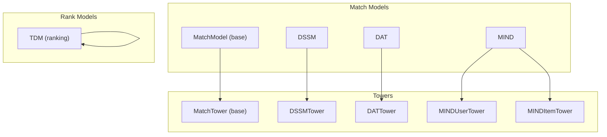
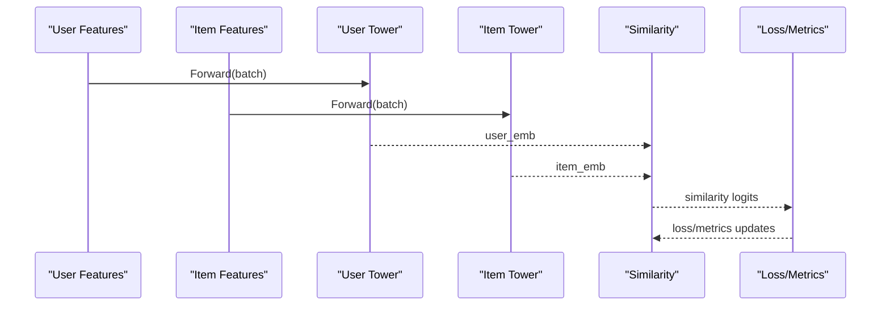
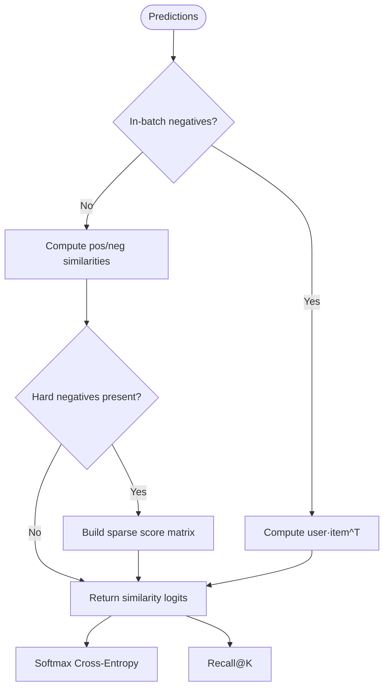
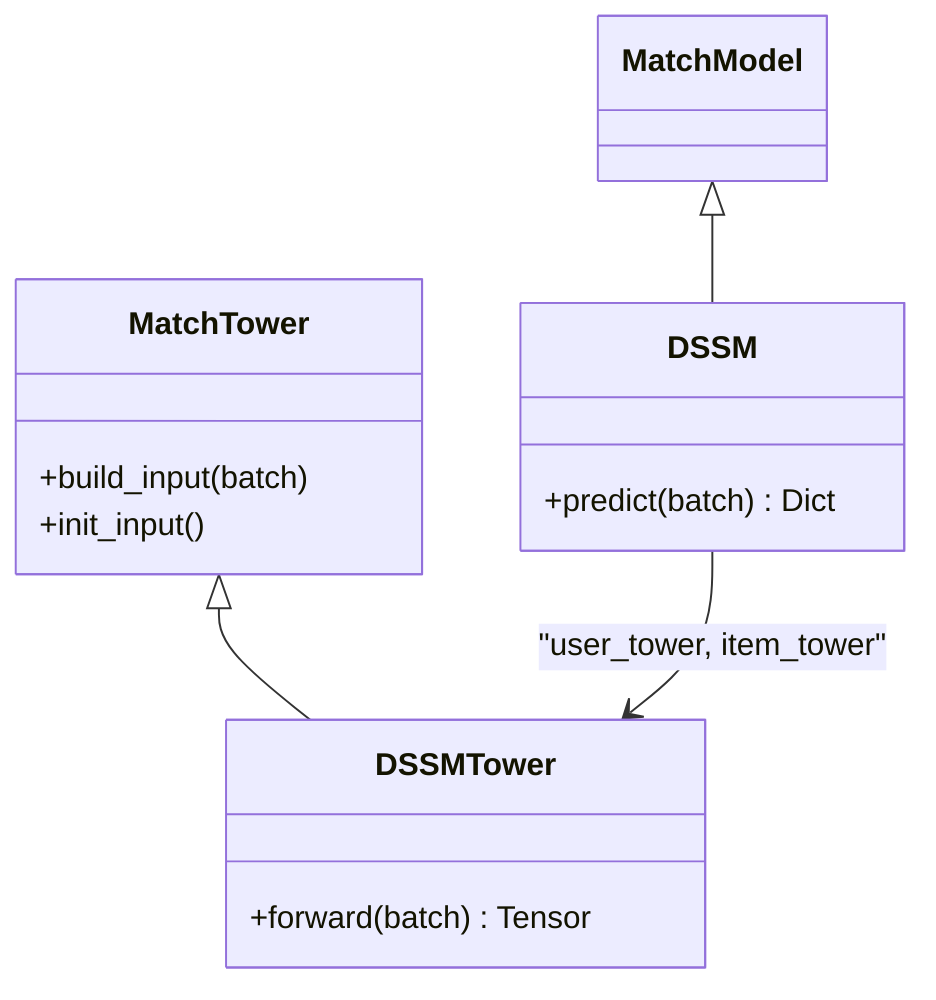
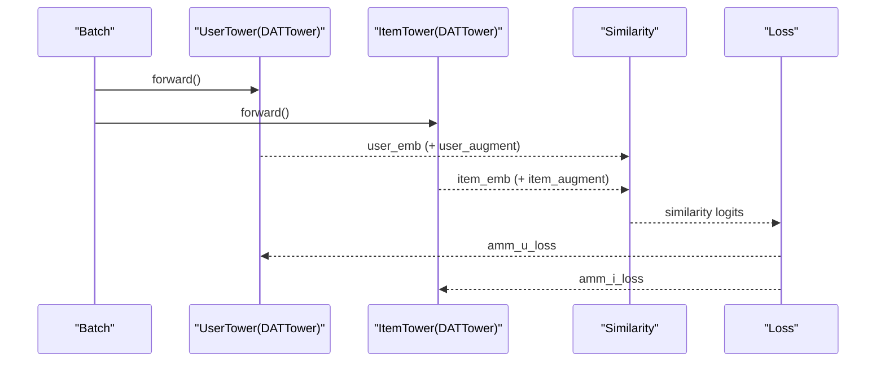
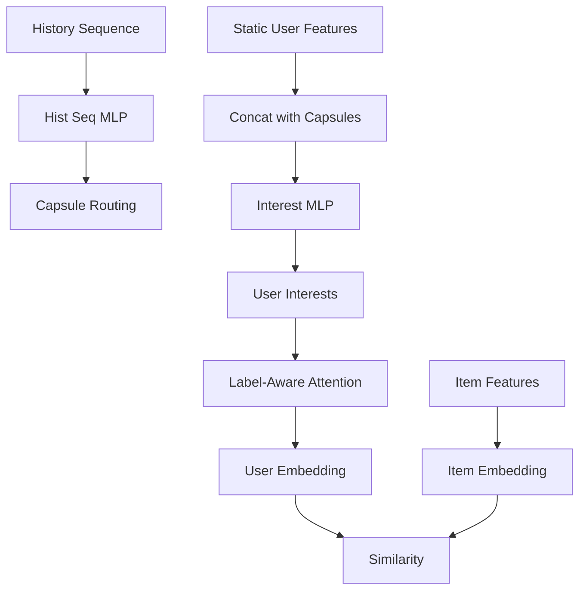
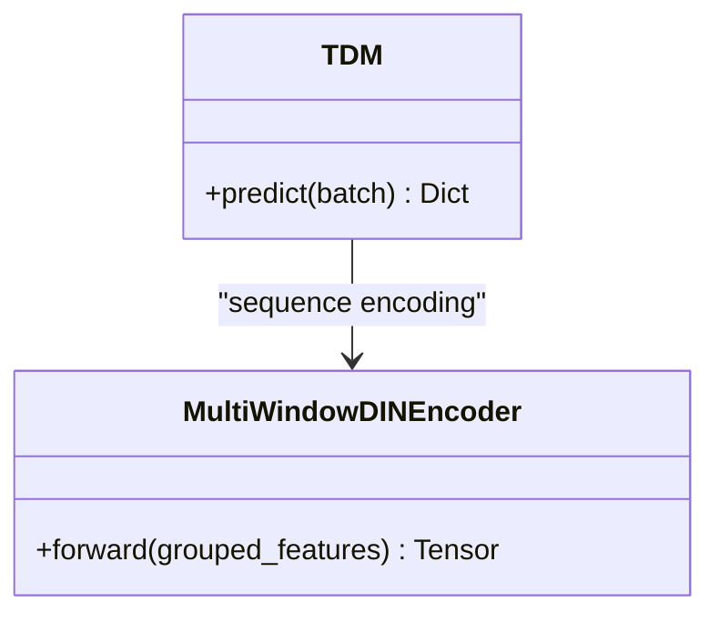
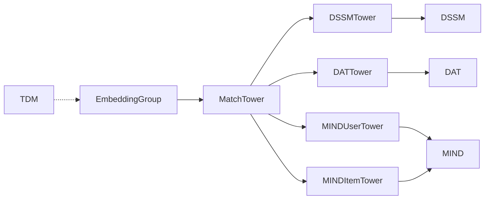

# Match Models (Candidate Generation)

<cite>
**Referenced Files in This Document**
- [match_model.py](file://tzrec/models/match_model.py)
- [dssm.py](file://tzrec/models/dssm.py)
- [dat.py](file://tzrec/models/dat.py)
- [mind.py](file://tzrec/models/mind.py)
- [tdm.py](file://tzrec/models/tdm.py)
- [dssm.md](file://docs/source/models/dssm.md)
- [mind.md](file://docs/source/models/mind.md)
- [tdm_taobao.config](file://examples/tdm_taobao.config)
- [dssm_taobao.config](file://examples/dssm_taobao.config)
- [mind_taobao.config](file://examples/mind_taobao.config)
- [recall_at_k.py](file://tzrec/metrics/recall_at_k.py)
</cite>

## Table of Contents

1. [Introduction](#introduction)
1. [Project Structure](#project-structure)
1. [Core Components](#core-components)
1. [Architecture Overview](#architecture-overview)
1. [Detailed Component Analysis](#detailed-component-analysis)
1. [Dependency Analysis](#dependency-analysis)
1. [Performance Considerations](#performance-considerations)
1. [Troubleshooting Guide](#troubleshooting-guide)
1. [Conclusion](#conclusion)
1. [Appendices](#appendices)

## Introduction

This document explains match models (candidate generation models) in TorchEasyRec. It focuses on the MatchModel base class and its implementations for efficient candidate generation in retrieval systems. It clarifies the distinction between matching and ranking, details the DSSM, TDM, DAT, and MIND models, and covers embedding-based similarity, tree-based sampling, attention for multi-interest modeling, and the trade-offs among accuracy, efficiency, and scalability. It also provides configuration examples, training methodology for candidate generation, integration patterns with downstream ranking models, evaluation metrics, and performance impact.

## Project Structure

Match models live under the models package and share a common base class and tower abstractions. Each model defines user and item towers and computes a similarity score for candidate selection.

**Diagram sources**

- \[match_model.py\](file://tzrec/models/match_model.py#L225-L499)
- \[dssm.py\](file://tzrec/models/dssm.py#L38-L156)
- \[dat.py\](file://tzrec/models/dat.py#L39-L260)
- \[mind.py\](file://tzrec/models/mind.py#L28-L366)
- \[tdm.py\](file://tzrec/models/tdm.py#L28-L146)

**Section sources**

- \[match_model.py\](file://tzrec/models/match_model.py#L110-L499)
- \[dssm.py\](file://tzrec/models/dssm.py#L38-L156)
- \[dat.py\](file://tzrec/models/dat.py#L39-L260)
- \[mind.py\](file://tzrec/models/mind.py#L28-L366)
- \[tdm.py\](file://tzrec/models/tdm.py#L28-L146)

## Core Components

- MatchModel (base): Provides shared loss, metrics, and similarity computation for match models. Supports in-batch negatives and negative sampling with optional hard negatives.
- MatchTower (base): Builds embeddings from feature groups, supports optional variational dropout, and normalizes outputs for cosine similarity.
- TowerWrapper and TowerWoEGWrapper: Jit-compatible wrappers for standalone tower inference.
- DSSM/DSSMTower: Two-tower MLP with optional output projection and normalization for inner-product or cosine similarity.
- DAT/DATTower: Dual augmented two-towers with an auxiliary branch and adaptive-mimic mechanism (AMM) loss during training.
- MIND/MINDUserTower/MINDItemTower: Multi-interest modeling via capsule routing and label-aware attention over user interests; item tower is a standard MLP.
- TDM: Ranking model that can be used downstream after candidate generation; includes sequence encoding and multi-window attention.

Key behaviors:

- Similarity computation supports in-batch negatives and sampled negatives, with optional hard negatives.
- Metrics include Recall@K for candidate generation quality.
- Temperature scaling and similarity type (inner product or cosine) are configurable.

**Section sources**

- \[match_model.py\](file://tzrec/models/match_model.py#L225-L451)
- \[dssm.py\](file://tzrec/models/dssm.py#L38-L156)
- \[dat.py\](file://tzrec/models/dat.py#L39-L260)
- \[mind.py\](file://tzrec/models/mind.py#L28-L366)
- \[tdm.py\](file://tzrec/models/tdm.py#L28-L146)

## Architecture Overview

The match pipeline converts user and item features into embeddings and scores their similarity to produce a ranked candidate list.

**Diagram sources**

- \[match_model.py\](file://tzrec/models/match_model.py#L253-L329)
- \[dssm.py\](file://tzrec/models/dssm.py#L129-L156)
- \[dat.py\](file://tzrec/models/dat.py#L168-L211)
- \[mind.py\](file://tzrec/models/mind.py#L335-L366)

## Detailed Component Analysis

### MatchModel Base Class

- Loss: Softmax cross-entropy with optional per-sample weights.
- Metrics: Recall@K for candidate quality.
- Similarity: Supports in-batch negatives (matrix multiplication) and sampled negatives (concatenated positive/negative scores).
- Hard negatives: Optional sparse tensor construction for hard negative indices.

**Diagram sources**

- \[match_model.py\](file://tzrec/models/match_model.py#L253-L329)
- \[recall_at_k.py\](file://tzrec/metrics/recall_at_k.py#L19-L55)

**Section sources**

- \[match_model.py\](file://tzrec/models/match_model.py#L225-L451)
- \[recall_at_k.py\](file://tzrec/metrics/recall_at_k.py#L19-L55)

### DSSM (Deep Structured Semantic Model)

- Two-tower architecture: user and item towers with MLPs and optional output projection.
- Similarity: inner product or cosine depending on configuration.
- Training: supports negative sampling and hard negatives.

**Diagram sources**

- \[dssm.py\](file://tzrec/models/dssm.py#L38-L156)
- \[match_model.py\](file://tzrec/models/match_model.py#L110-L191)

**Section sources**

- \[dssm.py\](file://tzrec/models/dssm.py#L38-L156)
- \[dssm.md\](file://docs/source/models/dssm.md#L1-L153)
- \[dssm_taobao.config\](file://examples/dssm_taobao.config#L201-L267)

### DAT (Dual Augmented Two-Towers)

- Extends DSSM with dual augmented branches and AMM loss to align augmented embeddings with the main item embeddings.
- Training-time outputs include augmented features and detached embeddings for AMM regularization.

**Diagram sources**

- \[dat.py\](file://tzrec/models/dat.py#L109-L260)
- \[match_model.py\](file://tzrec/models/match_model.py#L253-L329)

**Section sources**

- \[dat.py\](file://tzrec/models/dat.py#L39-L260)

### MIND (Multi-Interest Neural Degrading)

- User tower: builds user interests via capsule routing over history sequences and concatenates with user static features.
- Attention: label-aware attention over interests conditioned on the current item embedding.
- Item tower: standard MLP embedding.
- Similarity: computed between user embedding (attended interests) and item embedding.

**Diagram sources**

- \[mind.py\](file://tzrec/models/mind.py#L28-L366)

**Section sources**

- \[mind.py\](file://tzrec/models/mind.py#L28-L366)
- \[mind.md\](file://docs/source/models/mind.md#L1-L257)
- \[mind_taobao.config\](file://examples/mind_taobao.config#L206-L296)

### TDM (Two-Tower Matching)

- TDM is a ranking model that can be used downstream of candidate generation.
- It encodes sequences with multi-window attention and combines with static features.
- In candidate generation scenarios, TDM can be adapted to produce item embeddings for retrieval.

**Diagram sources**

- \[tdm.py\](file://tzrec/models/tdm.py#L28-L146)

**Section sources**

- \[tdm.py\](file://tzrec/models/tdm.py#L28-L146)
- \[tdm_taobao.config\](file://examples/tdm_taobao.config#L210-L264)

## Dependency Analysis

- MatchTower depends on EmbeddingGroup and optional variational dropout per feature group.
- DSSM/DAT/MIND inherit from MatchTower and MatchModel; they define user and item towers and compute similarity.
- MIND’s user tower uses capsule routing and attention; item tower uses MLP.
- TDM is a separate ranking model but shares embedding infrastructure.

**Diagram sources**

- \[match_model.py\](file://tzrec/models/match_model.py#L110-L191)
- \[dssm.py\](file://tzrec/models/dssm.py#L38-L156)
- \[dat.py\](file://tzrec/models/dat.py#L39-L260)
- \[mind.py\](file://tzrec/models/mind.py#L28-L366)
- \[tdm.py\](file://tzrec/models/tdm.py#L28-L146)

**Section sources**

- \[match_model.py\](file://tzrec/models/match_model.py#L110-L191)
- \[dssm.py\](file://tzrec/models/dssm.py#L38-L156)
- \[dat.py\](file://tzrec/models/dat.py#L39-L260)
- \[mind.py\](file://tzrec/models/mind.py#L28-L366)
- \[tdm.py\](file://tzrec/models/tdm.py#L28-L146)

## Performance Considerations

- In-batch negatives vs sampled negatives:
  - In-batch negatives compute a full user-item affinity matrix; suitable for small batches and strong GPU memory.
  - Sampled negatives reduce compute by scoring positives against a sampled set; recommended for large-scale retrieval.
- Temperature scaling:
  - Lower temperature increases separation between positive and negative scores, improving ranking quality.
- Similarity type:
  - Cosine similarity normalizes embeddings; often improves generalization but adds overhead.
- Hard negatives:
  - Improve discrimination but require sparse tensor construction; use when computational budget allows.
- Multi-interest modeling (MIND):
  - Captures diverse user interests; attention and capsule routing add compute but improve recall and diversity.
- Downstream ranking (TDM):
  - Sequence modeling and multi-window attention increase latency; use for post-retrieval reranking.

[No sources needed since this section provides general guidance]

## Troubleshooting Guide

- Recall@K not reported:
  - Ensure metrics include recall_at_k and top_k is configured.
- Loss mismatch:
  - Match models currently support softmax_cross_entropy only; verify model_config.losses.
- In-batch negative mismatch:
  - When in_batch_negative is enabled, labels are constructed as arange; otherwise zeroth column is positive.
- Negative sampling issues:
  - Verify negative_sampler configuration and ensure num_sample is appropriate for hardware capacity.

**Section sources**

- \[match_model.py\](file://tzrec/models/match_model.py#L265-L329)
- \[recall_at_k.py\](file://tzrec/metrics/recall_at_k.py#L19-L55)

## Conclusion

Match models in TorchEasyRec provide efficient, scalable candidate generation through embedding-based similarity. DSSM offers a simple two-tower baseline; DAT augments with auxiliary branches and AMM loss; MIND captures multi-interest via capsules and attention; TDM is a strong ranking model for downstream reranking. Choose models based on data scale, hardware budget, and accuracy needs, and integrate with downstream ranking for end-to-end performance.

[No sources needed since this section summarizes without analyzing specific files]

## Appendices

### Configuration Examples and Training Methodology

- DSSM (candidate generation with negative sampling):

  - data_config.negative_sampler: configure item attributes and sampling counts.
  - model_config.dssm: specify user/item towers and output_dim.
  - metrics: recall_at_k for candidate quality.
  - losses: softmax_cross_entropy.

  Example path: \[dssm_taobao.config\](file://examples/dssm_taobao.config#L201-L267)

- MIND (multi-interest candidate generation):

  - feature_groups: user, item, hist (sequence).
  - model_config.mind: user_tower/history_input, capsule_config, concat_mlp, simi_pow, temperature.
  - metrics: recall_at_k.

  Example path: \[mind_taobao.config\](file://examples/mind_taobao.config#L206-L296)

- TDM (downstream ranking):

  - model_config.tdm: multiwindow_din, final MLP.
  - metrics: auc; losses: softmax_cross_entropy.

  Example path: \[tdm_taobao.config\](file://examples/tdm_taobao.config#L210-L264)

- Training methodology for candidate generation:

  - Prepare click logs as positive samples; rely on negative samplers for negatives.
  - Use Recall@K to monitor candidate quality; tune temperature and similarity type.
  - For hard negatives, enable hard negative sampler and adjust num_hard_sample.

**Section sources**

- \[dssm.md\](file://docs/source/models/dssm.md#L1-L153)
- \[mind.md\](file://docs/source/models/mind.md#L1-L257)
- \[dssm_taobao.config\](file://examples/dssm_taobao.config#L201-L267)
- \[mind_taobao.config\](file://examples/mind_taobao.config#L206-L296)
- \[tdm_taobao.config\](file://examples/tdm_taobao.config#L210-L264)

### Evaluation Metrics for Candidate Generation

- Recall@K: fraction of relevant candidates in top-K retrieved by similarity.
- Implemented via torchmetrics-based RecallAtK.

**Section sources**

- \[recall_at_k.py\](file://tzrec/metrics/recall_at_k.py#L19-L55)
- \[match_model.py\](file://tzrec/models/match_model.py#L331-L451)

### Integration Patterns with Downstream Ranking Models

- Candidate generation (DSSM/DAT/MIND) produces user/item embeddings or similarity scores.
- Downstream ranking (TDM) can re-rank candidates using richer features and sequence modeling.
- Export item embeddings for fast retrieval; use user embeddings to score against item pools.

**Section sources**

- \[mind.py\](file://tzrec/models/mind.py#L335-L366)
- \[tdm.py\](file://tzrec/models/tdm.py#L79-L99)
