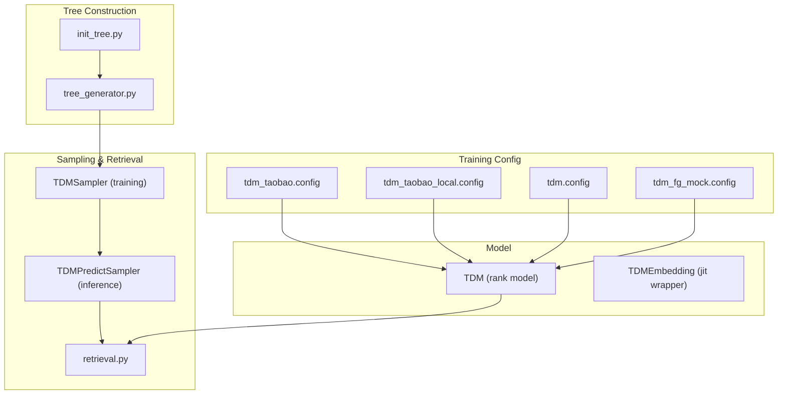
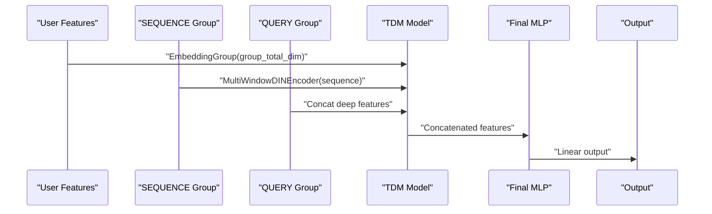
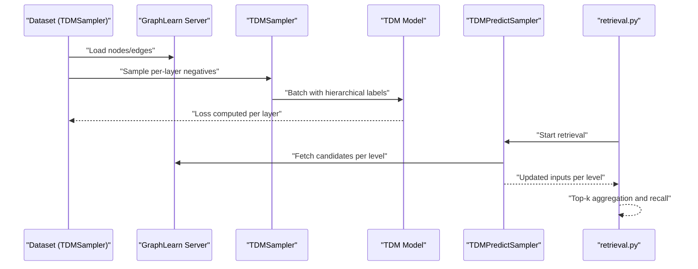
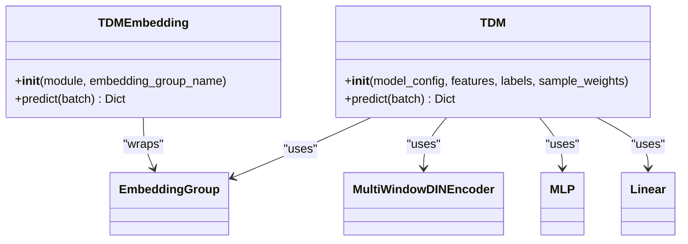
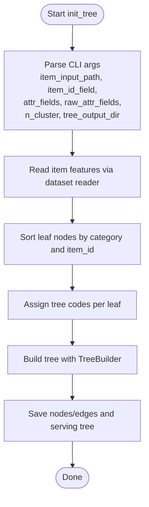
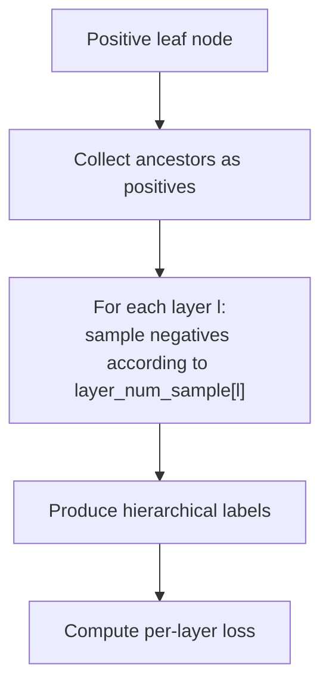
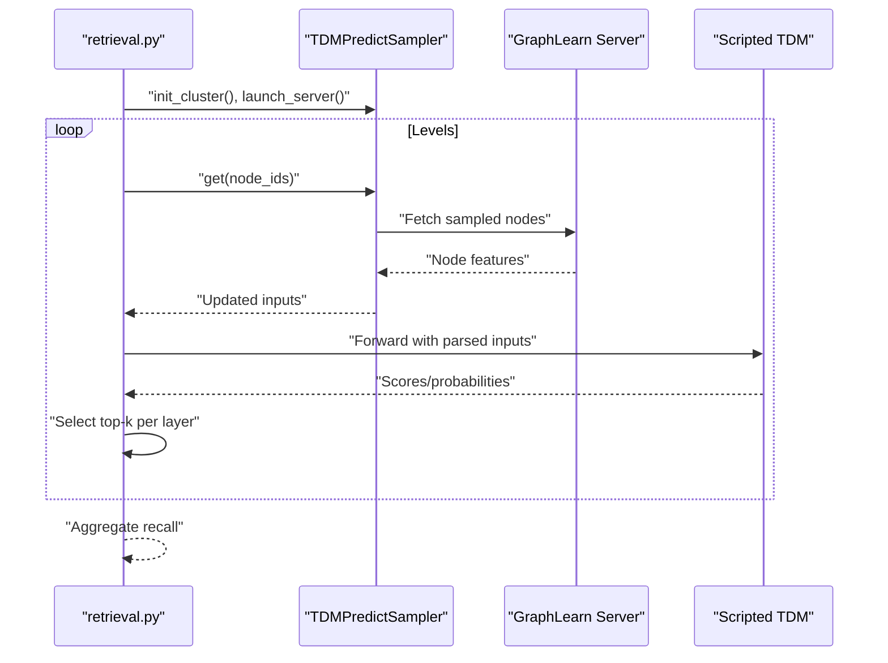
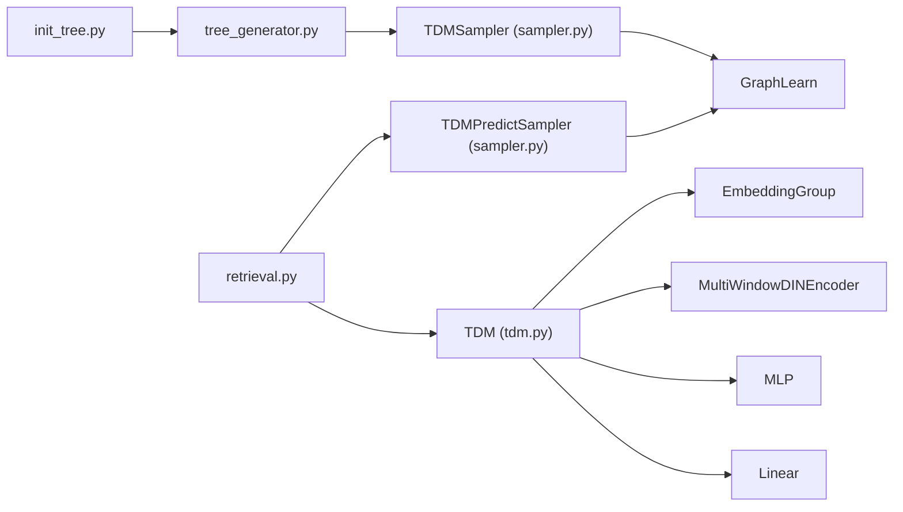

# TDM (Tree-based Deep Model)

<cite>
**Referenced Files in This Document**
- [tdm.py](file://tzrec/models/tdm.py)
- [tdm.md](file://docs/source/models/tdm.md)
- [tdm_taobao.config](file://examples/tdm_taobao.config)
- [tdm_taobao_local.config](file://experiments/taobao/tdm_taobao_local.config)
- [tdm.config](file://experiments/xingqudao/tdm/tdm.config)
- [tdm_fg_mock.config](file://tzrec/tests/configs/tdm_fg_mock.config)
- [init_tree.py](file://tzrec/tools/tdm/init_tree.py)
- [tree_generator.py](file://tzrec/tools/tdm/gen_tree/tree_generator.py)
- [retrieval.py](file://tzrec/tools/tdm/retrieval.py)
- [sampler.py](file://tzrec/datasets/sampler.py)
</cite>

## Table of Contents

1. [Introduction](#introduction)
1. [Project Structure](#project-structure)
1. [Core Components](#core-components)
1. [Architecture Overview](#architecture-overview)
1. [Detailed Component Analysis](#detailed-component-analysis)
1. [Dependency Analysis](#dependency-analysis)
1. [Performance Considerations](#performance-considerations)
1. [Troubleshooting Guide](#troubleshooting-guide)
1. [Conclusion](#conclusion)
1. [Appendices](#appendices)

## Introduction

This document explains the Tree-based Deep Model (TDM) implementation in TorchEasyRec. TDM leverages hierarchical tree structures to accelerate large-scale candidate generation and enable early cross-feature interactions. It supports training with hierarchical labels derived from the tree: each positive sample (e.g., a clicked item) contributes signals up its ancestor path, enabling multi-layer classification with progressively refined negatives. The system integrates tree construction, runtime negative sampling, and retrieval across tree layers to scale to large vocabularies and taxonomy-based recommendations.

## Project Structure

The TDM implementation spans model definition, training configuration, tree construction tools, and retrieval/inference utilities:

- Model definition: TDM model and embedding wrapper
- Training configuration: Example configs for Taobao and Xingqudao datasets
- Tree construction: CLI to generate tree nodes and edges from item features
- Sampling and retrieval: Runtime negative sampling and multi-level retrieval pipeline

**Diagram sources**

- \[tdm.py\](file://tzrec/models/tdm.py#L28-L98)
- \[tdm_taobao.config\](file://examples/tdm_taobao.config#L1-L264)
- \[tdm_taobao_local.config\](file://experiments/taobao/tdm_taobao_local.config#L1-L266)
- \[tdm.config\](file://experiments/xingqudao/tdm/tdm.config#L1-L986)
- \[tdm_fg_mock.config\](file://tzrec/tests/configs/tdm_fg_mock.config#L1-L203)
- \[init_tree.py\](file://tzrec/tools/tdm/init_tree.py#L18-L107)
- \[tree_generator.py\](file://tzrec/tools/tdm/gen_tree/tree_generator.py#L21-L137)
- \[sampler.py\](file://tzrec/datasets/sampler.py#L753-L850)
- \[retrieval.py\](file://tzrec/tools/tdm/retrieval.py#L121-L499)

**Section sources**

- \[tdm.py\](file://tzrec/models/tdm.py#L28-L98)
- \[tdm_taobao.config\](file://examples/tdm_taobao.config#L1-L264)
- \[tdm_taobao_local.config\](file://experiments/taobao/tdm_taobao_local.config#L1-L266)
- \[tdm.config\](file://experiments/xingqudao/tdm/tdm.config#L1-L986)
- \[tdm_fg_mock.config\](file://tzrec/tests/configs/tdm_fg_mock.config#L1-L203)
- \[init_tree.py\](file://tzrec/tools/tdm/init_tree.py#L18-L107)
- \[tree_generator.py\](file://tzrec/tools/tdm/gen_tree/tree_generator.py#L21-L137)
- \[sampler.py\](file://tzrec/datasets/sampler.py#L753-L850)
- \[retrieval.py\](file://tzrec/tools/tdm/retrieval.py#L121-L499)

## Core Components

- TDM model: A ranking model that embeds features, applies multi-window DIEN-style encoding on sequential features, concatenates deep features, and passes through a final MLP to produce scores.
- TDMEmbedding: A JIT-friendly wrapper to extract item embeddings for retrieval.
- TDMSampler: Hierarchical negative sampler that samples positives along the path and negatives layer-by-layer according to configured layer counts.
- TDMPredictSampler: Distributed sampler for multi-level retrieval using GraphLearn-backed servers.
- Tree construction tools: CLI and generator to build hierarchical trees from item attributes and persist nodes/edges for training and serving.

Key implementation references:

- Model definition and forward pass: \[tdm.py\](file://tzrec/models/tdm.py#L28-L98)
- JIT embedding wrapper: \[tdm.py\](file://tzrec/models/tdm.py#L101-L146)
- Training sampler (TDMSampler): \[sampler.py\](file://tzrec/datasets/sampler.py#L753-L850)
- Predict sampler and retrieval loop: \[sampler.py\](file://tzrec/datasets/sampler.py#L850-L1055), \[retrieval.py\](file://tzrec/tools/tdm/retrieval.py#L121-L499)
- Tree init CLI and generator: \[init_tree.py\](file://tzrec/tools/tdm/init_tree.py#L18-L107), \[tree_generator.py\](file://tzrec/tools/tdm/gen_tree/tree_generator.py#L21-L137)

**Section sources**

- \[tdm.py\](file://tzrec/models/tdm.py#L28-L146)
- \[sampler.py\](file://tzrec/datasets/sampler.py#L753-L1055)
- \[retrieval.py\](file://tzrec/tools/tdm/retrieval.py#L121-L499)
- \[init_tree.py\](file://tzrec/tools/tdm/init_tree.py#L18-L107)
- \[tree_generator.py\](file://tzrec/tools/tdm/gen_tree/tree_generator.py#L21-L137)

## Architecture Overview

The TDM architecture integrates:

- Feature groups: SEQUENCE (e.g., click history) and DEEP (static/user/item features)
- Multi-window DIEN encoder on sequences
- Concatenation of deep features and sequence representation
- Final MLP and linear output head
- Hierarchical training via TDMSampler and multi-level retrieval via TDMPredictSampler

**Diagram sources**

- \[tdm.py\](file://tzrec/models/tdm.py#L46-L98)

Training and inference flow:

**Diagram sources**

- \[sampler.py\](file://tzrec/datasets/sampler.py#L753-L1055)
- \[retrieval.py\](file://tzrec/tools/tdm/retrieval.py#L121-L499)

## Detailed Component Analysis

### TDM Model

- EmbeddingGroup aggregates embeddings across feature groups
- MultiWindowDINEncoder captures temporal dynamics across multiple time windows
- Deep MLP and output linear layer produce scores for ranking

**Diagram sources**

- \[tdm.py\](file://tzrec/models/tdm.py#L28-L146)

**Section sources**

- \[tdm.py\](file://tzrec/models/tdm.py#L28-L146)

### Tree Construction Pipeline

- CLI initializes tree building with item attributes and clustering parameters
- Generator reads items, assigns tree codes, builds internal tree, and persists nodes/edges
- Search utilities export node/edge tables and serving tree artifacts

**Diagram sources**

- \[init_tree.py\](file://tzrec/tools/tdm/init_tree.py#L18-L107)
- \[tree_generator.py\](file://tzrec/tools/tdm/gen_tree/tree_generator.py#L63-L137)

**Section sources**

- \[init_tree.py\](file://tzrec/tools/tdm/init_tree.py#L18-L107)
- \[tree_generator.py\](file://tzrec/tools/tdm/gen_tree/tree_generator.py#L21-L137)

### Training with Hierarchical Sampling (TDMSampler)

- Loads item nodes and edges from configured paths
- For each positive leaf, collects all ancestors as positives
- Samples negatives layer-by-layer according to layer_num_sample
- Supports configurable probability types for selecting non-leaf layers during training

**Diagram sources**

- \[sampler.py\](file://tzrec/datasets/sampler.py#L753-L850)

**Section sources**

- \[sampler.py\](file://tzrec/datasets/sampler.py#L753-L850)

### Multi-Level Retrieval (TDMPredictSampler + retrieval.py)

- Determines first_recall_layer based on desired recall_num and n_cluster
- Launches GraphLearn server and clients per rank
- Per level: sample nodes, update inputs, parse, forward, select top-k, and propagate to next level
- Aggregates recall results across workers/ranks

**Diagram sources**

- \[retrieval.py\](file://tzrec/tools/tdm/retrieval.py#L121-L499)
- \[sampler.py\](file://tzrec/datasets/sampler.py#L850-L1055)

**Section sources**

- \[retrieval.py\](file://tzrec/tools/tdm/retrieval.py#L121-L499)
- \[sampler.py\](file://tzrec/datasets/sampler.py#L850-L1055)

### Configuration Examples and Best Practices

- Taobao config demonstrates SEQUENCE and DEEP feature groups, multiwindow DIEN, and softmax cross entropy loss
- Local Taobao variant adds FG-encoded dataset support and explicit layer sampling
- Xingqudao config shows ODPS-backed tree initialization and richer item/user features
- Mock config illustrates minimal DAG feature groups and small-scale testing

Recommendations:

- Choose n_cluster (branching factor) to balance depth and per-layer fan-out
- Tune layer_num_sample to reflect hierarchical difficulty and class imbalance
- Ensure attr_fields order matches tree construction (tree_level first, then item_id, then attributes)
- Use FG_DAG for complex feature dependencies; otherwise FG_NONE for simpler pipelines

**Section sources**

- \[tdm_taobao.config\](file://examples/tdm_taobao.config#L1-L264)
- \[tdm_taobao_local.config\](file://experiments/taobao/tdm_taobao_local.config#L1-L266)
- \[tdm.config\](file://experiments/xingqudao/tdm/tdm.config#L1-L986)
- \[tdm_fg_mock.config\](file://tzrec/tests/configs/tdm_fg_mock.config#L1-L203)

## Dependency Analysis

- TDM depends on EmbeddingGroup, MultiWindowDINEncoder, MLP, and Linear layers
- Training relies on TDMSampler backed by GraphLearn graph storage
- Inference relies on TDMPredictSampler and retrieval pipeline
- Tree construction is decoupled and produces node/edge tables consumed by sampling

**Diagram sources**

- \[tdm.py\](file://tzrec/models/tdm.py#L28-L98)
- \[sampler.py\](file://tzrec/datasets/sampler.py#L753-L1055)
- \[retrieval.py\](file://tzrec/tools/tdm/retrieval.py#L121-L499)
- \[init_tree.py\](file://tzrec/tools/tdm/init_tree.py#L18-L107)
- \[tree_generator.py\](file://tzrec/tools/tdm/gen_tree/tree_generator.py#L21-L137)

**Section sources**

- \[tdm.py\](file://tzrec/models/tdm.py#L28-L98)
- \[sampler.py\](file://tzrec/datasets/sampler.py#L753-L1055)
- \[retrieval.py\](file://tzrec/tools/tdm/retrieval.py#L121-L499)
- \[init_tree.py\](file://tzrec/tools/tdm/init_tree.py#L18-L107)
- \[tree_generator.py\](file://tzrec/tools/tdm/gen_tree/tree_generator.py#L21-L137)

## Performance Considerations

- Memory usage: Tree nodes/edges are loaded into GraphLearn; tune batch sizes and layer_num_sample to fit GPU memory
- Throughput: Multi-worker per level in retrieval improves latency; adjust num_worker_per_level accordingly
- Scalability: Distributed sampler cluster scales across ranks; ensure adequate WORLD_SIZE and LOCAL_WORLD_SIZE
- Depth vs. branching: Deeper trees reduce per-layer fan-out but increase traversal cost; tune n_cluster and layer_num_sample to balance
- Embedding dimensionality: Larger embedding dims improve modeling but increase compute and memory

[No sources needed since this section provides general guidance]

## Troubleshooting Guide

Common issues and resolutions:

- Missing tree_level or incorrect attr_fields order: Ensure "tree_level" is the first attribute and matches construction order
- GraphLearn timeouts or connection errors: Verify cluster bootstrap and network connectivity; check free ports and quotas
- Inconsistent item_id types: Ensure item_id_field types align with hash/string ID settings
- Low recall at top levels: Increase first_recall_layer estimation or adjust n_cluster and recall_num
- Excessive memory usage: Reduce batch_size, layer_num_sample, or embedding dimensions

**Section sources**

- \[sampler.py\](file://tzrec/datasets/sampler.py#L753-L1055)
- \[retrieval.py\](file://tzrec/tools/tdm/retrieval.py#L121-L499)
- \[init_tree.py\](file://tzrec/tools/tdm/init_tree.py#L18-L107)

## Conclusion

TDM in TorchEasyRec provides an efficient, scalable framework for hierarchical candidate generation and ranking. By structuring items in a tree and leveraging per-layer hierarchical sampling, it accelerates training and retrieval for large vocabularies and taxonomy-based recommendations. Proper configuration of tree structure, branching factor, and sampling parameters, combined with the provided tools for construction and retrieval, enables robust deployment in production environments.

[No sources needed since this section summarizes without analyzing specific files]

## Appendices

### Configuration Reference Highlights

- data_config.tdm_sampler: item_input_path, edge_input_path, predict_edge_input_path, attr_fields, layer_num_sample, item_id_field, attr_delimiter
- model_config.tdm.multiwindow_din: windows_len, attn_mlp.hidden_units and activation
- model_config.tdm.final: hidden_units and use_bn
- losses and metrics: softmax_cross_entropy and auc

**Section sources**

- \[tdm.md\](file://docs/source/models/tdm.md#L15-L129)
- \[tdm_taobao.config\](file://examples/tdm_taobao.config#L25-L89)
- \[tdm_taobao_local.config\](file://experiments/taobao/tdm_taobao_local.config#L25-L89)
- \[tdm.config\](file://experiments/xingqudao/tdm/tdm.config#L22-L51)
- \[tdm_fg_mock.config\](file://tzrec/tests/configs/tdm_fg_mock.config#L23-L202)
