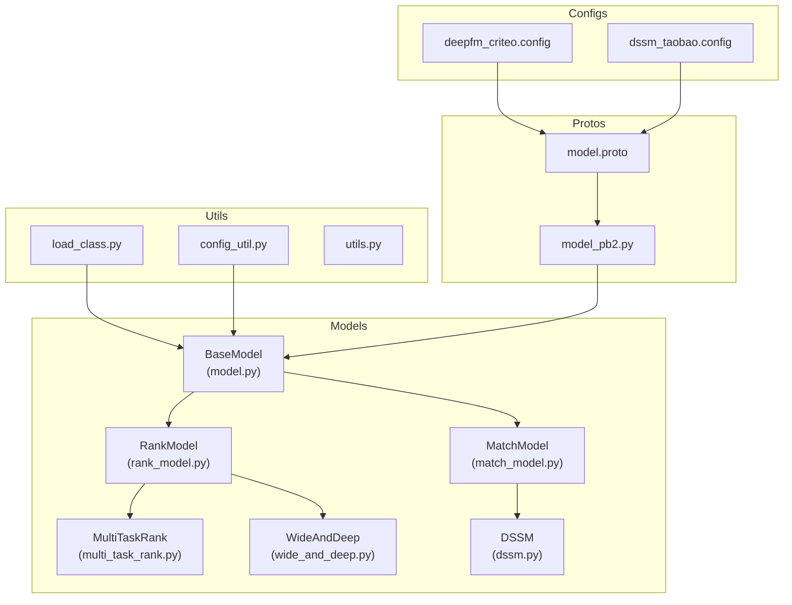
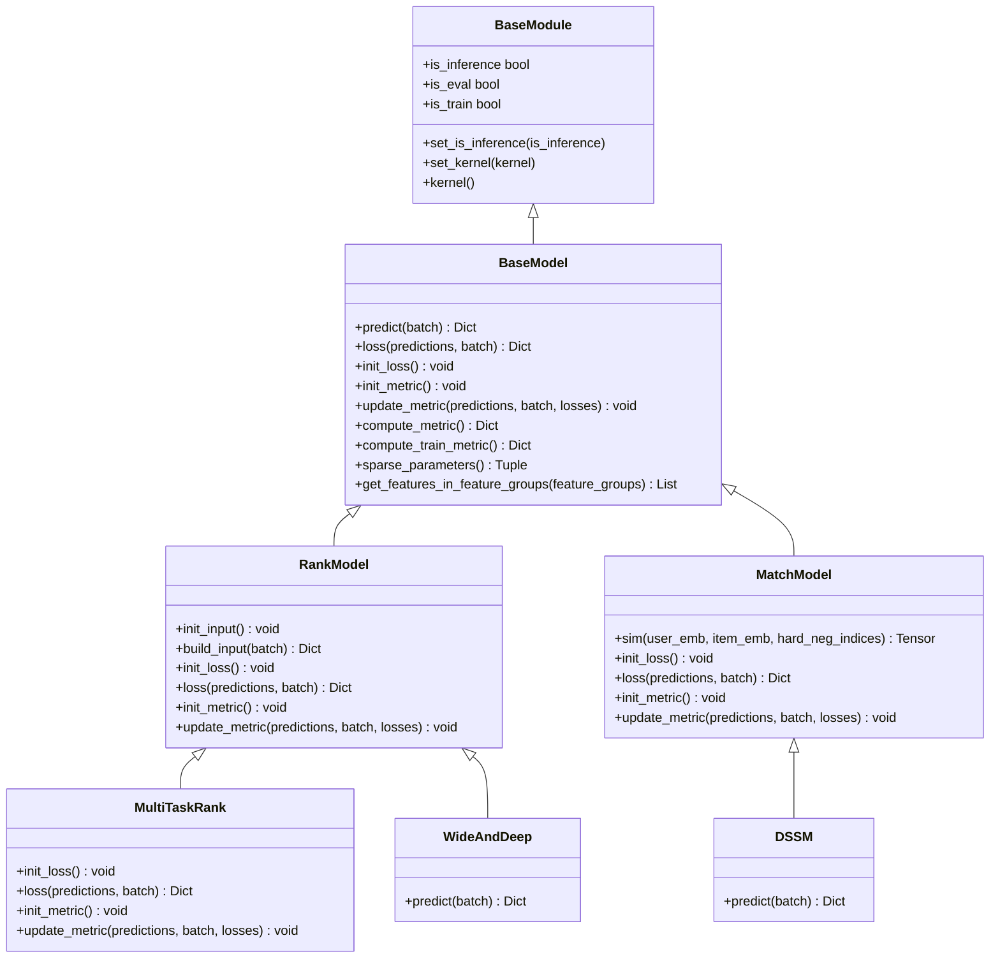
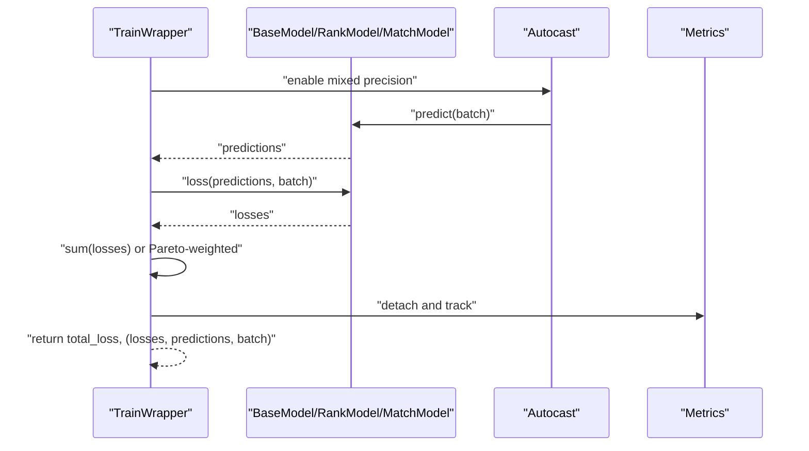
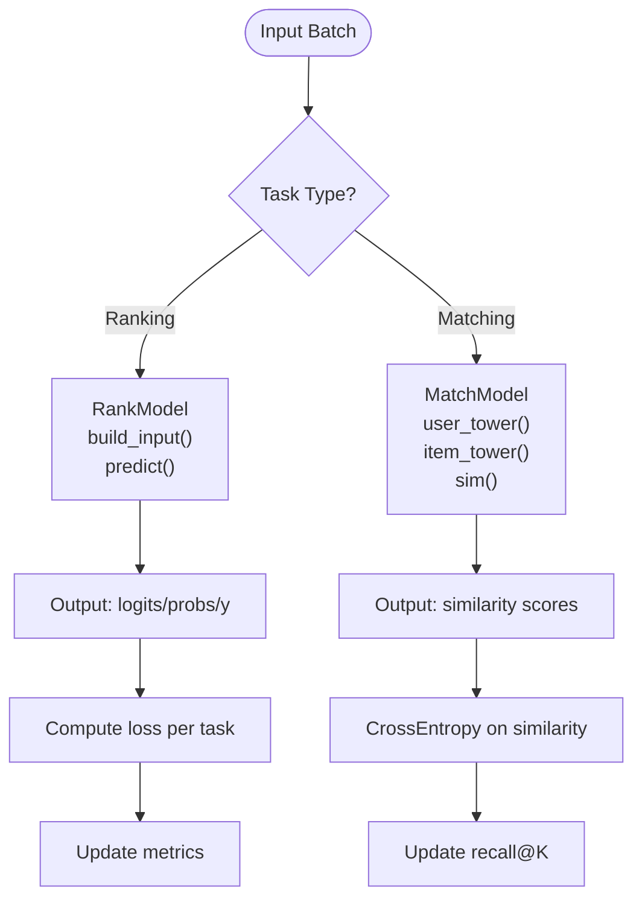
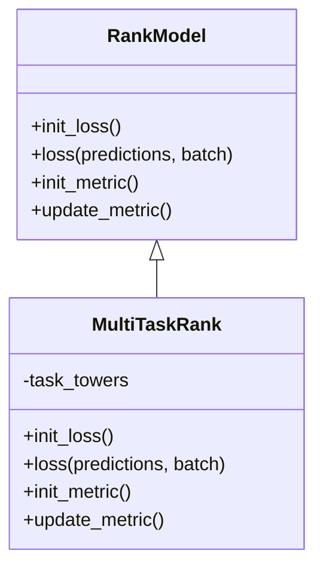
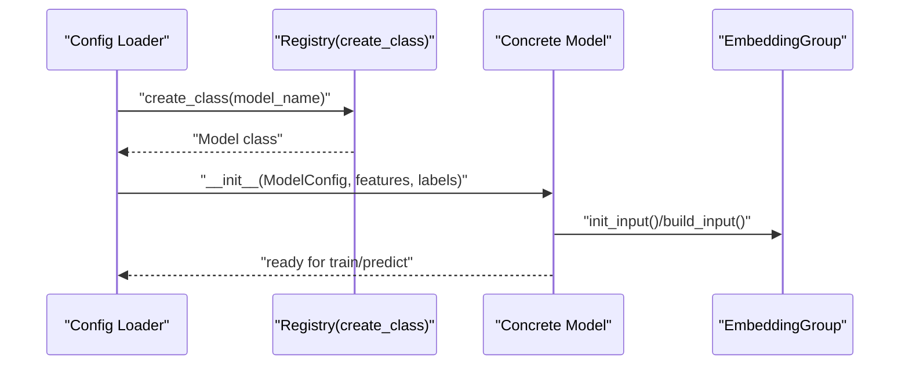
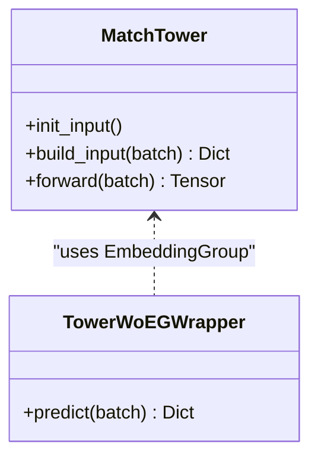
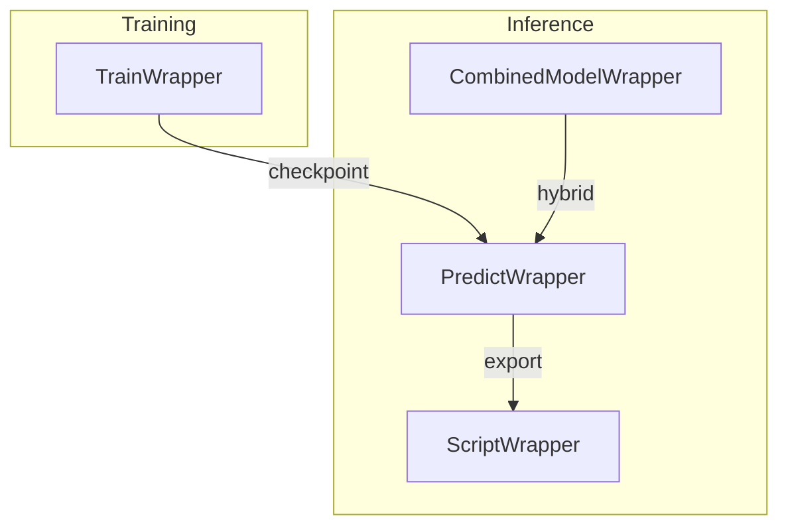
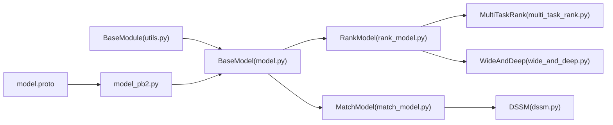

# Model Architecture and Implementation

<cite>
**Referenced Files in This Document**
- [model.py](file://tzrec/models/model.py)
- [rank_model.py](file://tzrec/models/rank_model.py)
- [match_model.py](file://tzrec/models/match_model.py)
- [multi_task_rank.py](file://tzrec/models/multi_task_rank.py)
- [dssm.py](file://tzrec/models/dssm.py)
- [wide_and_deep.py](file://tzrec/models/wide_and_deep.py)
- [model.proto](file://tzrec/protos/model.proto)
- [model_pb2.py](file://tzrec/protos/model_pb2.py)
- [load_class.py](file://tzrec/utils/load_class.py)
- [config_util.py](file://tzrec/utils/config_util.py)
- [utils.py](file://tzrec/modules/utils.py)
- [deepfm_criteo.config](file://examples/deepfm_criteo.config)
- [dssm_taobao.config](file://examples/dssm_taobao.config)
</cite>

## Table of Contents

1. [Introduction](#introduction)
1. [Project Structure](#project-structure)
1. [Core Components](#core-components)
1. [Architecture Overview](#architecture-overview)
1. [Detailed Component Analysis](#detailed-component-analysis)
1. [Dependency Analysis](#dependency-analysis)
1. [Performance Considerations](#performance-considerations)
1. [Troubleshooting Guide](#troubleshooting-guide)
1. [Conclusion](#conclusion)
1. [Appendices](#appendices)

## Introduction

This document explains TorchEasyRec’s model architecture and implementation with a focus on:

- The base model system and factory pattern for model registration
- Distinction between rank models (scoring) and match models (candidate generation)
- Multi-task learning framework
- Model configuration via Protocol Buffers
- Model initialization and construction patterns
- Model interface contracts, parameter sharing strategies, and custom model development guidelines
- Serialization, checkpoint management, and deployment considerations
- Extending the framework with custom models while maintaining compatibility

## Project Structure

TorchEasyRec organizes model logic under a layered structure:

- Base abstractions and wrappers live in the models package
- Concrete model implementations reside alongside base classes
- Configuration is defined via Protocol Buffers and consumed at runtime
- Utilities support dynamic class registration, configuration conversion, and module base classes

**Diagram sources**

- \[model.py\](file://tzrec/models/model.py#L39-L423)
- \[rank_model.py\](file://tzrec/models/rank_model.py#L56-L513)
- \[match_model.py\](file://tzrec/models/match_model.py#L225-L500)
- \[multi_task_rank.py\](file://tzrec/models/multi_task_rank.py#L25-L221)
- \[dssm.py\](file://tzrec/models/dssm.py#L86-L156)
- \[wide_and_deep.py\](file://tzrec/models/wide_and_deep.py#L25-L89)
- \[model.proto\](file://tzrec/protos/model.proto#L40-L90)
- \[model_pb2.py\](file://tzrec/protos/model_pb2.py#L25-L43)
- \[load_class.py\](file://tzrec/utils/load_class.py#L117-L146)
- \[config_util.py\](file://tzrec/utils/config_util.py#L66-L71)
- \[utils.py\](file://tzrec/modules/utils.py#L21-L75)
- \[deepfm_criteo.config\](file://examples/deepfm_criteo.config#L278-L397)
- \[dssm_taobao.config\](file://examples/dssm_taobao.config#L201-L267)

**Section sources**

- \[model.py\](file://tzrec/models/model.py#L39-L423)
- \[model.proto\](file://tzrec/protos/model.proto#L40-L90)
- \[load_class.py\](file://tzrec/utils/load_class.py#L117-L146)
- \[config_util.py\](file://tzrec/utils/config_util.py#L66-L71)
- \[utils.py\](file://tzrec/modules/utils.py#L21-L75)
- \[deepfm_criteo.config\](file://examples/deepfm_criteo.config#L278-L397)
- \[dssm_taobao.config\](file://examples/dssm_taobao.config#L201-L267)

## Core Components

- BaseModel: Defines the contract for predict, loss, metric initialization and updates, and exposes helpers for sparse parameter selection and feature group ordering. It also provides wrappers for training and prediction pipelines.
- RankModel: Specialization for scoring tasks with classification/regression losses, metrics, and optional variational dropout per feature group.
- MatchModel: Specialization for candidate generation with user/item towers, similarity computation, and recall metrics.
- MultiTaskRank: Extends RankModel to support multi-task learning with per-task losses, metrics, and optional per-task weighting and Pareto-efficient loss weighting.
- DSSM: Example match model with user/item towers and cosine-normalized embeddings.
- WideAndDeep: Example rank model combining wide and deep pathways.

Key capabilities:

- Factory pattern via dynamic class registration enables runtime instantiation of models from configuration.
- Protocol Buffer-based configuration decouples model definition from training pipeline.
- Pipeline wrappers encapsulate forward passes, loss computation, and mixed precision execution.

**Section sources**

- \[model.py\](file://tzrec/models/model.py#L39-L423)
- \[rank_model.py\](file://tzrec/models/rank_model.py#L56-L513)
- \[match_model.py\](file://tzrec/models/match_model.py#L225-L500)
- \[multi_task_rank.py\](file://tzrec/models/multi_task_rank.py#L25-L221)
- \[dssm.py\](file://tzrec/models/dssm.py#L86-L156)
- \[wide_and_deep.py\](file://tzrec/models/wide_and_deep.py#L25-L89)

## Architecture Overview

The model system follows a layered design:

- Base abstractions define the interface and shared utilities
- Concrete models implement domain-specific logic
- Protocol Buffers define model configurations
- Utilities enable dynamic registration and configuration conversion
- Pipeline wrappers integrate models into training and inference

**Diagram sources**

- \[utils.py\](file://tzrec/modules/utils.py#L21-L75)
- \[model.py\](file://tzrec/models/model.py#L39-L423)
- \[rank_model.py\](file://tzrec/models/rank_model.py#L56-L513)
- \[match_model.py\](file://tzrec/models/match_model.py#L225-L500)
- \[multi_task_rank.py\](file://tzrec/models/multi_task_rank.py#L25-L221)
- \[dssm.py\](file://tzrec/models/dssm.py#L86-L156)
- \[wide_and_deep.py\](file://tzrec/models/wide_and_deep.py#L25-L89)

## Detailed Component Analysis

### Base Model System and Factory Pattern

- Dynamic registration: A metaclass registers subclasses into a global map upon class definition, enabling creation by name at runtime.
- Wrapper classes:
  - TrainWrapper: Initializes loss and metrics, runs forward, computes total loss, and detaches tensors for logging.
  - PredictWrapper: Runs forward under autocast, optionally filters output columns, and moves results to CPU.
  - ScriptWrapper: Converts dict inputs to Batch and runs predict for TorchScript export.
  - CombinedModelWrapper: Composes sparse and dense parts for hybrid inference.

**Diagram sources**

- \[model.py\](file://tzrec/models/model.py#L222-L285)

**Section sources**

- \[model.py\](file://tzrec/models/model.py#L35-L36)
- \[model.py\](file://tzrec/models/model.py#L117-L216)
- \[model.py\](file://tzrec/models/model.py#L222-L346)
- \[model.py\](file://tzrec/models/model.py#L348-L423)
- \[load_class.py\](file://tzrec/utils/load_class.py#L117-L146)

### Rank Models vs Match Models

- Rank models:
  - Focus on scoring tasks with classification/regression losses and metrics
  - Support variational dropout per feature group
  - Output logits/probabilities depending on loss type
- Match models:
  - Focus on candidate generation with user/item towers
  - Compute similarities (with optional hard negatives) and support recall metrics

**Diagram sources**

- \[rank_model.py\](file://tzrec/models/rank_model.py#L115-L181)
- \[match_model.py\](file://tzrec/models/match_model.py#L253-L329)

**Section sources**

- \[rank_model.py\](file://tzrec/models/rank_model.py#L56-L513)
- \[match_model.py\](file://tzrec/models/match_model.py#L225-L500)

### Multi-Task Learning Framework

- MultiTaskRank extends RankModel to support multiple task towers, each with its own losses and metrics
- Supports per-task weighting, task-space indicators, and optional Pareto-efficient loss weighting
- Aggregates per-task losses and metrics consistently with base model contracts

**Diagram sources**

- \[multi_task_rank.py\](file://tzrec/models/multi_task_rank.py#L25-L221)
- \[rank_model.py\](file://tzrec/models/rank_model.py#L56-L513)

**Section sources**

- \[multi_task_rank.py\](file://tzrec/models/multi_task_rank.py#L25-L221)

### Model Configuration System Using Protocol Buffers

- ModelConfig defines feature groups, oneof model variants, losses, metrics, train metrics, variational dropout, kernel, and Pareto loss weight flag
- model_pb2.py is generated from model.proto and exposes strongly-typed configuration messages
- config_util.py converts protobuf messages to kwargs for model constructors
- Examples show how configs define feature groups, model-specific parameters, and metrics/losses

**Diagram sources**

- \[model.proto\](file://tzrec/protos/model.proto#L40-L90)
- \[model_pb2.py\](file://tzrec/protos/model_pb2.py#L25-L43)
- \[config_util.py\](file://tzrec/utils/config_util.py#L66-L71)
- \[load_class.py\](file://tzrec/utils/load_class.py#L132-L143)

**Section sources**

- \[model.proto\](file://tzrec/protos/model.proto#L40-L90)
- \[model_pb2.py\](file://tzrec/protos/model_pb2.py#L25-L43)
- \[config_util.py\](file://tzrec/utils/config_util.py#L66-L71)
- \[deepfm_criteo.config\](file://examples/deepfm_criteo.config#L278-L397)
- \[dssm_taobao.config\](file://examples/dssm_taobao.config#L201-L267)

### Model Initialization and Construction Patterns

- BaseModel stores ModelConfig and selects the active model variant via WhichOneof
- RankModel initializes EmbeddingGroup and optional variational dropout per feature group
- MatchModel constructs user/item towers and prepares similarity computation
- MultiTaskRank aggregates task towers and per-task configurations
- DSSM composes user/item towers and computes normalized similarity
- WideAndDeep builds wide and deep pathways and merges outputs

**Diagram sources**

- \[load_class.py\](file://tzrec/utils/load_class.py#L132-L143)
- \[rank_model.py\](file://tzrec/models/rank_model.py#L84-L132)
- \[match_model.py\](file://tzrec/models/match_model.py#L148-L190)
- \[multi_task_rank.py\](file://tzrec/models/multi_task_rank.py#L35-L50)
- \[dssm.py\](file://tzrec/models/dssm.py#L103-L127)
- \[wide_and_deep.py\](file://tzrec/models/wide_and_deep.py#L43-L61)

**Section sources**

- \[model.py\](file://tzrec/models/model.py#L49-L67)
- \[rank_model.py\](file://tzrec/models/rank_model.py#L84-L132)
- \[match_model.py\](file://tzrec/models/match_model.py#L148-L190)
- \[multi_task_rank.py\](file://tzrec/models/multi_task_rank.py#L35-L50)
- \[dssm.py\](file://tzrec/models/dssm.py#L103-L127)
- \[wide_and_deep.py\](file://tzrec/models/wide_and_deep.py#L43-L61)

### Model Interface Contracts and Parameter Sharing Strategies

- Interface contracts:
  - predict(batch) -> Dict\[str, Tensor\]: produce outputs consistent with configured losses/metrics
  - loss(predictions, batch) -> Dict\[str, Tensor\]: compute per-loss tensors
  - init_loss(), init_metric(), update_metric(): lifecycle hooks for metrics
  - sparse_parameters(): separate trainable/frozen parameters for sparse embeddings
- Parameter sharing:
  - MatchTower supports sharing embedding groups across towers
  - TowerWoEGWrapper demonstrates composing a standalone tower with an embedding group wrapper

**Diagram sources**

- \[match_model.py\](file://tzrec/models/match_model.py#L110-L190)
- \[match_model.py\](file://tzrec/models/match_model.py#L474-L500)

**Section sources**

- \[model.py\](file://tzrec/models/model.py#L140-L179)
- \[match_model.py\](file://tzrec/models/match_model.py#L110-L190)
- \[match_model.py\](file://tzrec/models/match_model.py#L474-L500)

### Custom Model Development Guidelines

- Subclass the appropriate base:
  - BaseModel for minimal contracts
  - RankModel for scoring tasks
  - MatchModel for candidate generation
  - MultiTaskRank for multi-task extensions
- Implement predict(), init_loss(), loss(), init_metric(), update_metric()
- Respect feature groups and variational dropout if applicable
- Register the model class so it can be instantiated from configuration
- Keep outputs named consistently with configured losses/metrics

**Section sources**

- \[model.py\](file://tzrec/models/model.py#L73-L119)
- \[rank_model.py\](file://tzrec/models/rank_model.py#L182-L213)
- \[match_model.py\](file://tzrec/models/match_model.py#L265-L281)
- \[load_class.py\](file://tzrec/utils/load_class.py#L102-L115)

### Serialization, Checkpoint Management, and Deployment

- Model serialization and export are integrated into the pipeline; wrappers support TorchScript-friendly inputs and outputs
- Mixed precision wrappers support FP16/BF16 during training/inference
- Deployment considerations:
  - Use ScriptWrapper for TorchScript export paths
  - Use PredictWrapper for serving with autocast and output filtering
  - CombinedModelWrapper enables hybrid sparse/dense inference

**Diagram sources**

- \[model.py\](file://tzrec/models/model.py#L222-L346)
- \[model.py\](file://tzrec/models/model.py#L348-L423)

**Section sources**

- \[model.py\](file://tzrec/models/model.py#L222-L346)
- \[model.py\](file://tzrec/models/model.py#L348-L423)

## Dependency Analysis

- Coupling:
  - Models depend on BaseModule for kernel and inference flags
  - RankModel/MatchModel depend on EmbeddingGroup and MLP modules
  - MultiTaskRank depends on task tower configurations
- Cohesion:
  - Each model class encapsulates domain-specific logic (ranking vs matching)
- External dependencies:
  - Protocol Buffers for configuration
  - Torch and torchrec for modules and embeddings
  - torchmetrics for metrics

**Diagram sources**

- \[utils.py\](file://tzrec/modules/utils.py#L21-L75)
- \[model.py\](file://tzrec/models/model.py#L39-L423)
- \[rank_model.py\](file://tzrec/models/rank_model.py#L56-L513)
- \[match_model.py\](file://tzrec/models/match_model.py#L225-L500)
- \[multi_task_rank.py\](file://tzrec/models/multi_task_rank.py#L25-L221)
- \[dssm.py\](file://tzrec/models/dssm.py#L86-L156)
- \[wide_and_deep.py\](file://tzrec/models/wide_and_deep.py#L25-L89)
- \[model.proto\](file://tzrec/protos/model.proto#L40-L90)
- \[model_pb2.py\](file://tzrec/protos/model_pb2.py#L25-L43)

**Section sources**

- \[utils.py\](file://tzrec/modules/utils.py#L21-L75)
- \[model.py\](file://tzrec/models/model.py#L39-L423)
- \[rank_model.py\](file://tzrec/models/rank_model.py#L56-L513)
- \[match_model.py\](file://tzrec/models/match_model.py#L225-L500)
- \[multi_task_rank.py\](file://tzrec/models/multi_task_rank.py#L25-L221)
- \[dssm.py\](file://tzrec/models/dssm.py#L86-L156)
- \[wide_and_deep.py\](file://tzrec/models/wide_and_deep.py#L25-L89)
- \[model.proto\](file://tzrec/protos/model.proto#L40-L90)
- \[model_pb2.py\](file://tzrec/protos/model_pb2.py#L25-L43)

## Performance Considerations

- Mixed precision training/inference via wrappers reduces memory footprint and improves throughput
- Variational dropout can regularize per-feature-group representations
- Embedding collections and embedding bag collections are detected to separate trainable and frozen parameters
- Similarity computation supports in-batch negatives for efficient training

[No sources needed since this section provides general guidance]

## Troubleshooting Guide

Common issues and resolutions:

- Loss/metric mismatch: Ensure predictions produced by predict() align with configured losses/metrics
- Feature group ordering: Use get_features_in_feature_groups() to maintain consistent feature ordering
- Sparse parameter separation: Use sparse_parameters() to configure optimizers for trainable/frozen embeddings
- Mixed precision errors: Verify FP16/BF16 settings in wrappers and ensure compatible dtypes

**Section sources**

- \[model.py\](file://tzrec/models/model.py#L181-L216)
- \[model.py\](file://tzrec/models/model.py#L140-L179)
- \[model.py\](file://tzrec/models/model.py#L270-L284)

## Conclusion

TorchEasyRec’s model architecture cleanly separates concerns between base abstractions, domain-specific models, and configuration-driven instantiation. The factory pattern and Protocol Buffer-based configuration enable flexible, extensible model development. The wrappers streamline training and inference, while utilities support advanced features like multi-task learning, variational dropout, and mixed precision. Following the provided guidelines ensures compatibility with the broader training and serving pipelines.

[No sources needed since this section summarizes without analyzing specific files]

## Appendices

### Appendix A: Example Configurations

- Ranking example (DeepFM) demonstrates feature groups, model-specific parameters, and metrics/losses
- Matching example (DSSM) demonstrates user/item towers, similarity settings, and recall metrics

**Section sources**

- \[deepfm_criteo.config\](file://examples/deepfm_criteo.config#L278-L397)
- \[dssm_taobao.config\](file://examples/dssm_taobao.config#L201-L267)
