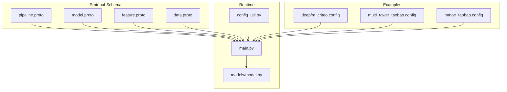
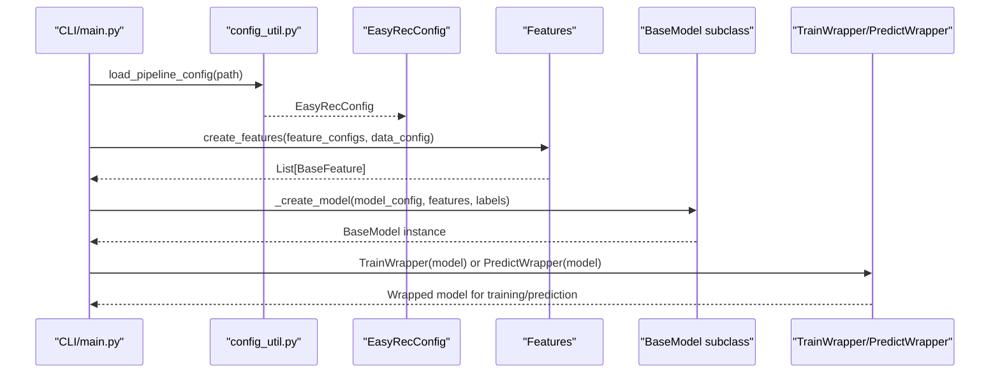
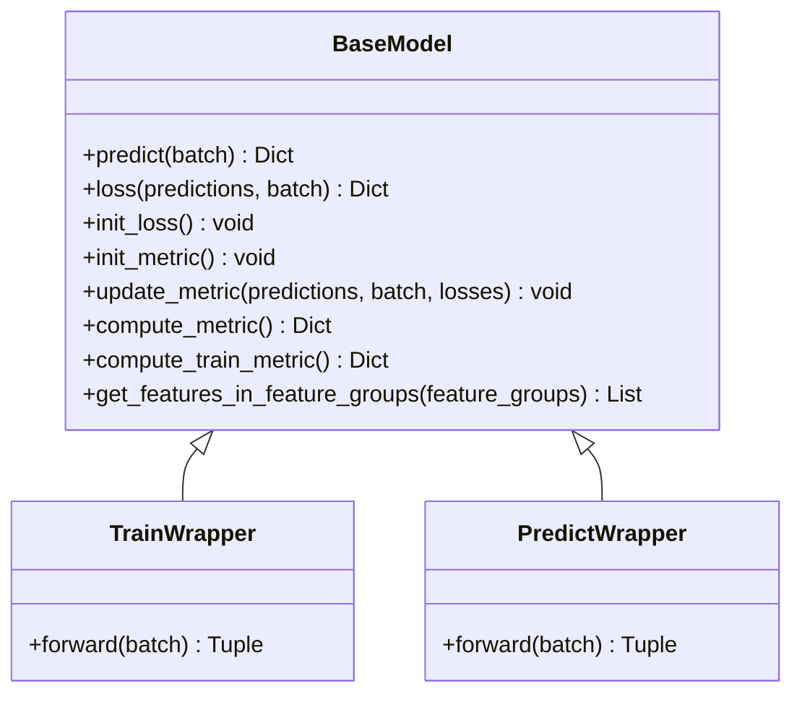
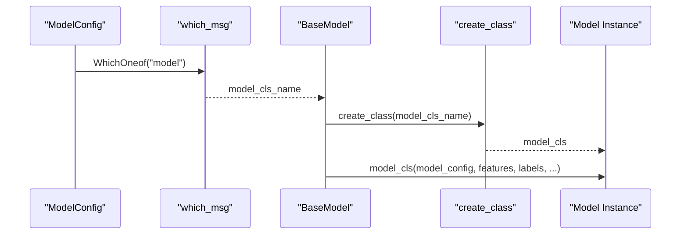
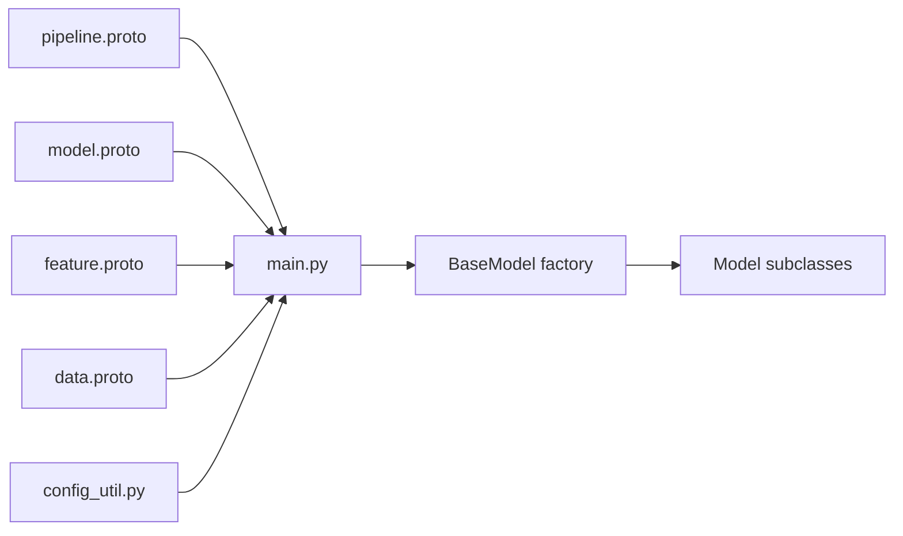

# Model Configuration System

<cite>
**Referenced Files in This Document**
- [model.proto](file://tzrec/protos/model.proto)
- [feature.proto](file://tzrec/protos/feature.proto)
- [pipeline.proto](file://tzrec/protos/pipeline.proto)
- [data.proto](file://tzrec/protos/data.proto)
- [config_util.py](file://tzrec/utils/config_util.py)
- [main.py](file://tzrec/main.py)
- [model.py](file://tzrec/models/model.py)
- [deepfm_criteo.config](file://examples/deepfm_criteo.config)
- [multi_tower_taobao.config](file://examples/multi_tower_taobao.config)
- [mmoe_taobao.config](file://examples/mmoe_taobao.config)
</cite>

## Table of Contents

1. [Introduction](#introduction)
1. [Project Structure](#project-structure)
1. [Core Components](#core-components)
1. [Architecture Overview](#architecture-overview)
1. [Detailed Component Analysis](#detailed-component-analysis)
1. [Dependency Analysis](#dependency-analysis)
1. [Performance Considerations](#performance-considerations)
1. [Troubleshooting Guide](#troubleshooting-guide)
1. [Conclusion](#conclusion)
1. [Appendices](#appendices)

## Introduction

This document explains the model configuration system in TorchEasyRec, focusing on the Protocol Buffers-based schema defined in model.proto, feature.proto, and related configuration files. It covers how configurations define model architecture, feature groups, loss functions, and training parameters; how validation and defaults are handled; and how configuration maps to runtime model instantiation via a factory pattern. It also documents the feature group and embedding subsystems, configuration inheritance patterns, and best practices for organizing complex model setups.

## Project Structure

The configuration system centers around:

- Protobuf schema definitions for pipeline, model, features, and data
- Utilities for loading, editing, and saving configuration messages
- Runtime entry points that parse configurations and instantiate models and features
- Example configuration files demonstrating real-world setups

**Diagram sources**

- \[pipeline.proto\](file://tzrec/protos/pipeline.proto#L1-L30)
- \[model.proto\](file://tzrec/protos/model.proto#L1-L90)
- \[feature.proto\](file://tzrec/protos/feature.proto#L1-L800)
- \[data.proto\](file://tzrec/protos/data.proto#L1-L138)
- \[config_util.py\](file://tzrec/utils/config_util.py#L25-L48)
- \[main.py\](file://tzrec/main.py#L527-L734)
- \[model.py\](file://tzrec/models/model.py#L39-L158)
- \[deepfm_criteo.config\](file://examples/deepfm_criteo.config#L1-L397)
- \[multi_tower_taobao.config\](file://examples/multi_tower_taobao.config#L1-L207)
- \[mmoe_taobao.config\](file://examples/mmoe_taobao.config#L1-L216)

**Section sources**

- \[pipeline.proto\](file://tzrec/protos/pipeline.proto#L1-L30)
- \[model.proto\](file://tzrec/protos/model.proto#L1-L90)
- \[feature.proto\](file://tzrec/protos/feature.proto#L1-L800)
- \[data.proto\](file://tzrec/protos/data.proto#L1-L138)
- \[config_util.py\](file://tzrec/utils/config_util.py#L25-L48)
- \[main.py\](file://tzrec/main.py#L527-L734)
- \[model.py\](file://tzrec/models/model.py#L39-L158)

## Core Components

- Pipeline configuration container: defines training/evaluation paths, directories, data configuration, feature definitions, and the model configuration.
- Model configuration: declares feature groups, model architecture (oneof), loss functions, metrics, training metrics, variational dropout, kernel selection, and Pareto loss weighting.
- Feature configuration: defines how raw or preprocessed features are transformed into embeddings, including ID/raw/combo/lookup/match features, normalization, pooling, sequence handling, and dynamic/embedding parameters.
- Data configuration: controls dataset type, batching, FG modes, label fields, sampling, and negative sampling strategies.
- Configuration utilities: load/save, edit/update, and compatibility helpers for configuration manipulation.
- Factory and runtime: resolve the configured model type, instantiate features, and construct the model with the selected kernel.

Key responsibilities:

- Schema-driven validation and defaults via protobuf descriptors
- Feature group orchestration for embedding collection and sequence encoders
- Loss and metric registration for training and evaluation
- Optimizer and scheduler wiring based on configuration

**Section sources**

- \[pipeline.proto\](file://tzrec/protos/pipeline.proto#L11-L29)
- \[model.proto\](file://tzrec/protos/model.proto#L26-L89)
- \[feature.proto\](file://tzrec/protos/feature.proto#L112-L180)
- \[data.proto\](file://tzrec/protos/data.proto#L43-L137)
- \[config_util.py\](file://tzrec/utils/config_util.py#L25-L48)
- \[main.py\](file://tzrec/main.py#L126-L158)

## Architecture Overview

The configuration-to-runtime flow:

**Diagram sources**

- \[main.py\](file://tzrec/main.py#L527-L734)
- \[config_util.py\](file://tzrec/utils/config_util.py#L25-L48)
- \[model.py\](file://tzrec/models/model.py#L126-L158)

## Detailed Component Analysis

### Model Configuration Schema (model.proto)

- FeatureGroupConfig: groups named features by group_name and group_type (DEEP/WIDE/SEQUENCE/JAGGED_SEQUENCE), with optional sequence_groups and sequence_encoders.
- ModelConfig: contains:
  - feature_groups: list of FeatureGroupConfig
  - model (oneof): supports DLRM, DeepFM, MultiTower, MultiTowerDIN, MaskNet, WideAndDeep, DCNV1, DCNV2, xDeepFM, WuKong, SimpleMultiTask, MMoE, DBMTL, PLE, DC2VR, DlrmHSTU, DSSM, DSSMV2, DAT, HSTUMatch, MIND, TDM, RocketLaunching
  - num_class: default 1
  - losses: repeated LossConfig
  - metrics: repeated MetricConfig
  - train_metrics: repeated TrainMetricConfig
  - variational_dropout: optional
  - kernel: default PYTORCH
  - use_pareto_loss_weight: default false

Default handling:

- group_type defaults to DEEP
- kernel defaults to PYTORCH
- num_class defaults to 1
- use_pareto_loss_weight defaults to false

Validation:

- Proto compiler enforces presence of required fields and oneof selection
- Defaults are applied automatically during parsing

**Section sources**

- \[model.proto\](file://tzrec/protos/model.proto#L13-L32)
- \[model.proto\](file://tzrec/protos/model.proto#L40-L89)

### Feature Configuration Schema (feature.proto)

Feature types and embedding configurations:

- IdFeature: embedding_dim, hash_bucket_size, vocab_list/dict, value_dim, pooling, default_value, separator, weighted, init_fn, mask, ZCH, vocab_file, asset_dir, dynamic embedding, sequence\_\* options, constraints, trainable, stub_type, data_type
- RawFeature: boundaries, value_dim, normalizer, pooling, default_value, separator, init_fn, mask, sequence\_\* options, constraints, trainable, stub_type, data_type, dense_emb (AutoDisEmbedding or MLPEmbedding)
- ComboFeature: vocab_list/dict, value_dim, pooling, default_value, separator, init_fn, mask, ZCH, vocab_file, asset_dir, dynamic embedding, sequence\_\* options, constraints, trainable, stub_type, data_type
- LookupFeature: map/key, boundaries/hash_bucket_size/num_buckets/vocab_list/vocab_dict, pooling, combiner, default_value, separator, need_discrete/need_key, normalizer, init_fn, value_dim, value_separator, mask, ZCH, vocab_file, asset_dir, dynamic embedding, sequence\_\* options, constraints, trainable, stub_type, data_type, dense_emb
- MatchFeature: nested_map/pkey/skey, boundaries/hash_bucket_size/num_buckets/vocab_list/vocab_dict, pooling, default_value, separator, need_discrete/show_pkey/show_skey, normalizer, init_fn, value_dim, mask, ZCH, vocab_file, asset_dir, dynamic embedding, sequence\_\* options, constraints, trainable, stub_type, data_type, dense_emb
- ExprFeature, OverlapFeature, TokenizeFeature, KvDotProduct, CustomFeature: similar patterns with normalization, pooling, sequence support, constraints, and trainable/stub/data_type flags

Dynamic embedding and constraints:

- DynamicEmbedding: initializer args, eval initializer args, score_strategy, max_capacity, cache_load_factor, init_capacity_per_rank, init_table, admission_strategy (frequency_admission_strategy)
- ParameterConstraints: sharding_types and compute_kernels constraints

Sequence handling:

- sequence_length, sequence_delim, sequence_fields supported across feature types

**Section sources**

- \[feature.proto\](file://tzrec/protos/feature.proto#L112-L180)
- \[feature.proto\](file://tzrec/protos/feature.proto#L182-L239)
- \[feature.proto\](file://tzrec/protos/feature.proto#L241-L301)
- \[feature.proto\](file://tzrec/protos/feature.proto#L303-L396)
- \[feature.proto\](file://tzrec/protos/feature.proto#L398-L490)
- \[feature.proto\](file://tzrec/protos/feature.proto#L492-L546)
- \[feature.proto\](file://tzrec/protos/feature.proto#L548-L606)
- \[feature.proto\](file://tzrec/protos/feature.proto#L635-L681)
- \[feature.proto\](file://tzrec/protos/feature.proto#L684-L742)
- \[feature.proto\](file://tzrec/protos/feature.proto#L744-L800)
- \[feature.proto\](file://tzrec/protos/feature.proto#L90-L110)
- \[feature.proto\](file://tzrec/protos/feature.proto#L6-L13)

### Data Configuration (data.proto)

- DatasetType: OdpsDataset, ParquetDataset, CsvDataset, OdpsDatasetV1
- FgMode: FG_NONE, FG_NORMAL, FG_DAG, FG_BUCKETIZE
- DataConfig fields: batch_size, dataset_type, label_fields, num_workers, pin_memory, input_fields, delimiter, with_header, eval_batch_size, drop_remainder, fg_threads, is_orderby_partition, odps_data_quota_name, sample_mask_prob, negative_sample_mask_prob, force_base_data_group, sample_weight_fields, fg_mode, enable_hstu, shuffle, shuffle_buffer_size, odps_data_compression, sample_cost_field, batch_cost_size, sampler variants

Defaults:

- Many fields have explicit defaults (e.g., batch_size, dataset_type, fg_mode, shuffle_buffer_size)

**Section sources**

- \[data.proto\](file://tzrec/protos/data.proto#L6-L34)
- \[data.proto\](file://tzrec/protos/data.proto#L43-L137)

### Configuration Loading and Editing (config_util.py)

- load_pipeline_config: reads JSON or text proto and parses into EasyRecConfig; handles compatibility for fg_encoded -> fg_mode
- save_message: writes a proto message to text format
- config_to_kwargs: converts a proto message to a dict including default values and preserving proto field names
- which_msg: resolves the selected oneof field name for a given message
- edit_config: updates nested fields via dot notation and bracket selectors; supports indexing, slicing, and condition-based selection; type converts scalars and parses complex fields

Compatibility:

- fg_encoded flag is translated to fg_mode for backward compatibility

**Section sources**

- \[config_util.py\](file://tzrec/utils/config_util.py#L25-L48)
- \[config_util.py\](file://tzrec/utils/config_util.py#L51-L64)
- \[config_util.py\](file://tzrec/utils/config_util.py#L66-L70)
- \[config_util.py\](file://tzrec/utils/config_util.py#L73-L76)
- \[config_util.py\](file://tzrec/utils/config_util.py#L144-L299)
- \[config_util.py\](file://tzrec/utils/config_util.py#L78-L92)

### Model Factory and Runtime Instantiation (main.py, model.py)

- \_create_model: resolves the configured model type via which_msg, creates the registered BaseModel subclass, and sets the kernel
- BaseModel: base class that stores model_config, extracts the active model oneof, initializes loss/metric modules, and orchestrates feature selection by feature groups
- TrainWrapper/PredictWrapper: wrap the model for training/inference with autocast and optional mixed precision; handle Pareto-efficient multi-task loss when configured

**Diagram sources**

- \[model.py\](file://tzrec/models/model.py#L39-L158)
- \[model.py\](file://tzrec/models/model.py#L222-L346)

**Section sources**

- \[main.py\](file://tzrec/main.py#L126-L158)
- \[model.py\](file://tzrec/models/model.py#L39-L158)

### Feature Group Configuration and Embedding System

Feature groups define how features are routed to model branches:

- FeatureGroupConfig.group_type selects DEEP/WIDE/SEQUENCE/JAGGED_SEQUENCE
- FeatureGroupConfig.sequence_groups and sequence_encoders enable sequence modeling
- BaseModel.get_features_in_feature_groups orders features by group membership and sequence groups

Embedding configurations:

- Each feature type supports embedding_dim, pooling, trainable, data_type, constraints, and dynamic embedding
- Dynamic embedding enables adaptive capacity and admission strategies
- Sequence features support sequence_length, sequence_delim, sequence_fields

**Section sources**

- \[model.proto\](file://tzrec/protos/model.proto#L26-L32)
- \[model.py\](file://tzrec/models/model.py#L203-L216)
- \[feature.proto\](file://tzrec/protos/feature.proto#L112-L180)
- \[feature.proto\](file://tzrec/protos/feature.proto#L90-L110)

### Model Types and How They Consume Configuration

The model oneof in ModelConfig selects a specific architecture. Examples:

- DeepFM: consumes feature_groups (WIDE/DEEP), deep MLP layers, final MLP layers, losses, metrics
- MultiTower/MultiTowerDIN: consumes feature_groups per tower, per-tower MLPs, final MLP, losses, metrics
- MMoE: consumes expert MLP, num_expert, task towers with label_name, per-task MLPs, losses, metrics

These architectures are resolved at runtime via the factory and constructed with the provided feature groups and model-specific sub-configurations.

**Section sources**

- \[model.proto\](file://tzrec/protos/model.proto#L44-L72)
- \[deepfm_criteo.config\](file://examples/deepfm_criteo.config#L278-L396)
- \[multi_tower_taobao.config\](file://examples/multi_tower_taobao.config#L158-L206)
- \[mmoe_taobao.config\](file://examples/mmoe_taobao.config#L159-L215)

### Configuration Validation and Defaults

- Proto schema enforces required fields and oneof exclusivity
- Default values are applied automatically during parsing
- Compatibility conversion ensures legacy fields (e.g., fg_encoded) map to current ones (e.g., fg_mode)
- Edit operations preserve type safety and support complex selectors

**Section sources**

- \[model.proto\](file://tzrec/protos/model.proto#L29-L32)
- \[model.proto\](file://tzrec/protos/model.proto#L84-L85)
- \[config_util.py\](file://tzrec/utils/config_util.py#L78-L92)
- \[config_util.py\](file://tzrec/utils/config_util.py#L156-L170)

### Relationship Between Configuration Changes and Model Behavior

- Changing model oneof switches architecture and consumed sub-configurations
- Modifying feature_groups alters input routing and embedding collection
- Adjusting losses/metrics affects training objectives and evaluation
- Kernel selection influences compute backend
- Pareto loss weighting enables multi-task loss balancing

**Section sources**

- \[model.proto\](file://tzrec/protos/model.proto#L44-L72)
- \[model.proto\](file://tzrec/protos/model.proto#L82-L87)
- \[model.py\](file://tzrec/models/model.py#L250-L256)

### Integration Between Configuration System and Factory Pattern

- which_msg resolves the active model oneof branch
- BaseModel.create_class maps the resolved name to a registered model class
- \_create_model constructs the model with features, labels, and kernel selection

**Diagram sources**

- \[main.py\](file://tzrec/main.py#L144-L154)
- \[model.py\](file://tzrec/models/model.py#L59-L64)

## Dependency Analysis

- Pipeline depends on model, feature, data, train, eval, export protos
- Runtime depends on config_util for parsing/editing, and on model factory for instantiation
- Model factory depends on BaseModel registry and model oneof resolution

**Diagram sources**

- \[pipeline.proto\](file://tzrec/protos/pipeline.proto#L1-L30)
- \[model.proto\](file://tzrec/protos/model.proto#L1-L90)
- \[feature.proto\](file://tzrec/protos/feature.proto#L1-L800)
- \[data.proto\](file://tzrec/protos/data.proto#L1-L138)
- \[config_util.py\](file://tzrec/utils/config_util.py#L25-L48)
- \[main.py\](file://tzrec/main.py#L126-L158)
- \[model.py\](file://tzrec/models/model.py#L39-L64)

**Section sources**

- \[pipeline.proto\](file://tzrec/protos/pipeline.proto#L1-L30)
- \[main.py\](file://tzrec/main.py#L126-L158)
- \[model.py\](file://tzrec/models/model.py#L39-L64)

## Performance Considerations

- Mixed precision: TrainWrapper/PredictWrapper support FP16/BF16 autocast
- Kernel selection: ModelConfig.kernel chooses compute backend (TRITON/PYTORCH/CUDA)
- Dynamic embedding: Adaptive capacity and admission strategies reduce memory footprint
- Sequence handling: Properly setting sequence_length and delimiters improves throughput
- FG modes: FG_DAG can accelerate preprocessing for raw features

[No sources needed since this section provides general guidance]

## Troubleshooting Guide

Common configuration errors and debugging techniques:

- Unknown fields: load_pipeline_config supports skipping unknown fields; avoid relying on this long-term
- Oneof mismatches: Ensure only one model branch is set
- Missing required fields: Verify feature_configs and model_config are complete
- Legacy fields: Use fg_mode instead of fg_encoded
- Editing mistakes: Use edit_config with dot-bracket notation; validate types and paths

Debugging tips:

- Save effective config: save_message writes the parsed proto to text format
- Inspect resolved model: which_msg reveals the active model oneof branch
- Validate feature groups: ensure feature_names exist in feature_configs
- Check defaults: config_to_kwargs preserves default values for inspection

**Section sources**

- \[config_util.py\](file://tzrec/utils/config_util.py#L25-L48)
- \[config_util.py\](file://tzrec/utils/config_util.py#L51-L64)
- \[config_util.py\](file://tzrec/utils/config_util.py#L66-L70)
- \[config_util.py\](file://tzrec/utils/config_util.py#L73-L76)
- \[config_util.py\](file://tzrec/utils/config_util.py#L144-L299)

## Conclusion

TorchEasyRec’s configuration system leverages Protocol Buffers to define a robust, extensible schema for model architecture, feature groups, embeddings, losses, metrics, and training parameters. The runtime integrates seamlessly with a factory pattern to instantiate models from configuration, while utilities provide powerful mechanisms for loading, editing, and validating configurations. By following best practices for feature grouping, embedding configuration, and model selection, users can compose complex multi-task and multi-tower models efficiently and reliably.

[No sources needed since this section summarizes without analyzing specific files]

## Appendices

### Example Configurations and Best Practices

- DeepFM on Criteo:

  - Wide and Deep feature groups
  - Deep and Final MLP layers
  - Binary cross-entropy loss and AUC metric
  - Reference: \[deepfm_criteo.config\](file://examples/deepfm_criteo.config#L278-L396)

- MultiTower on Taobao:

  - Feature groups per tower (user/item)
  - Per-tower MLPs and shared final MLP
  - Binary cross-entropy loss and AUC metric
  - Reference: \[multi_tower_taobao.config\](file://examples/multi_tower_taobao.config#L158-L206)

- MMoE on Taobao (multi-task):

  - Single all-feature group
  - Expert MLP and two task towers with distinct labels
  - Separate losses and metrics per task
  - Reference: \[mmoe_taobao.config\](file://examples/mmoe_taobao.config#L159-L215)

Best practices:

- Organize feature_configs by domain (user/item/context) and reuse embedding names for shared embeddings
- Use feature_groups to separate WIDE vs DEEP pathways for linear and nonlinear terms
- Prefer FG_DAG for raw feature preprocessing at scale
- Keep defaults explicit in configs for readability and reproducibility
- Use edit_config to adjust hyperparameters without manual edits

**Section sources**

- \[deepfm_criteo.config\](file://examples/deepfm_criteo.config#L278-L396)
- \[multi_tower_taobao.config\](file://examples/multi_tower_taobao.config#L158-L206)
- \[mmoe_taobao.config\](file://examples/mmoe_taobao.config#L159-L215)
