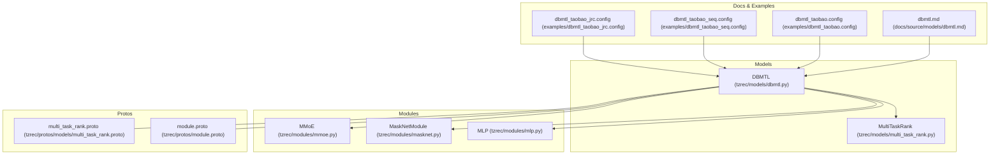
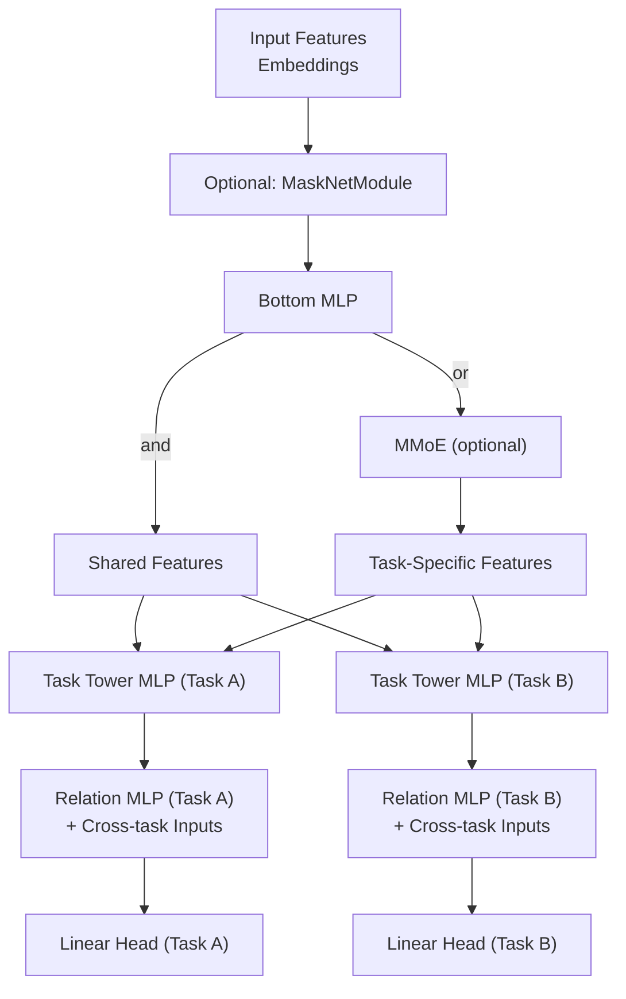
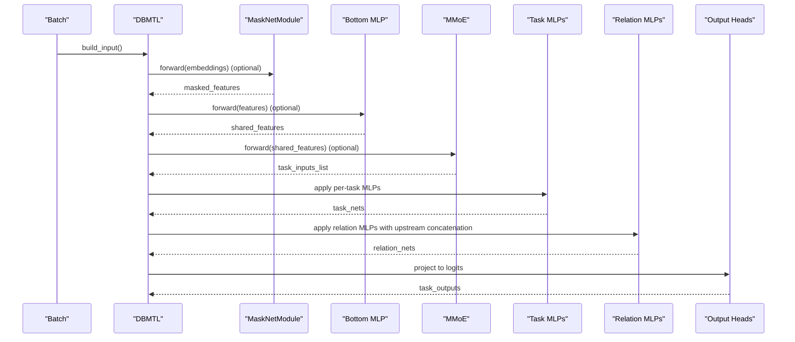
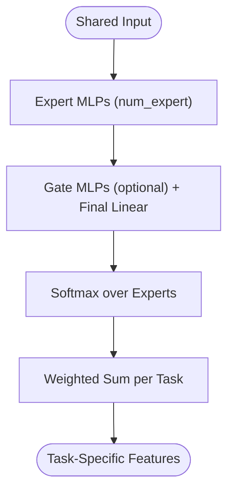
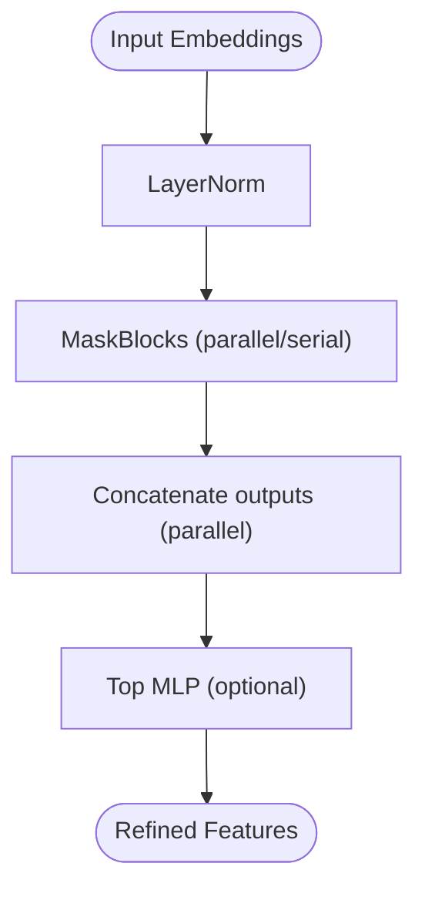
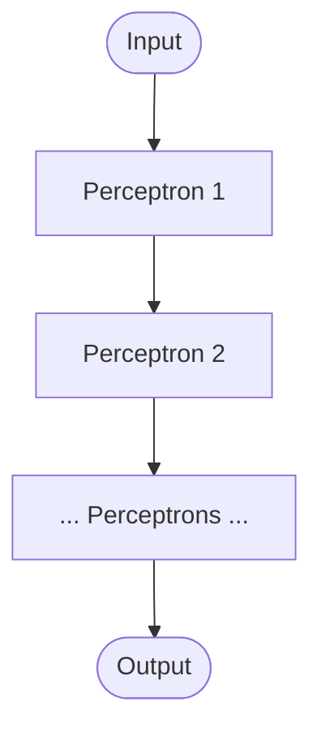
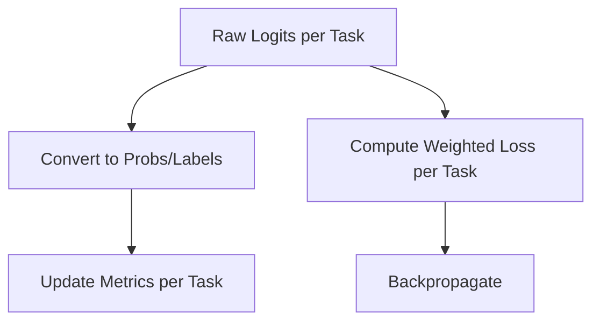
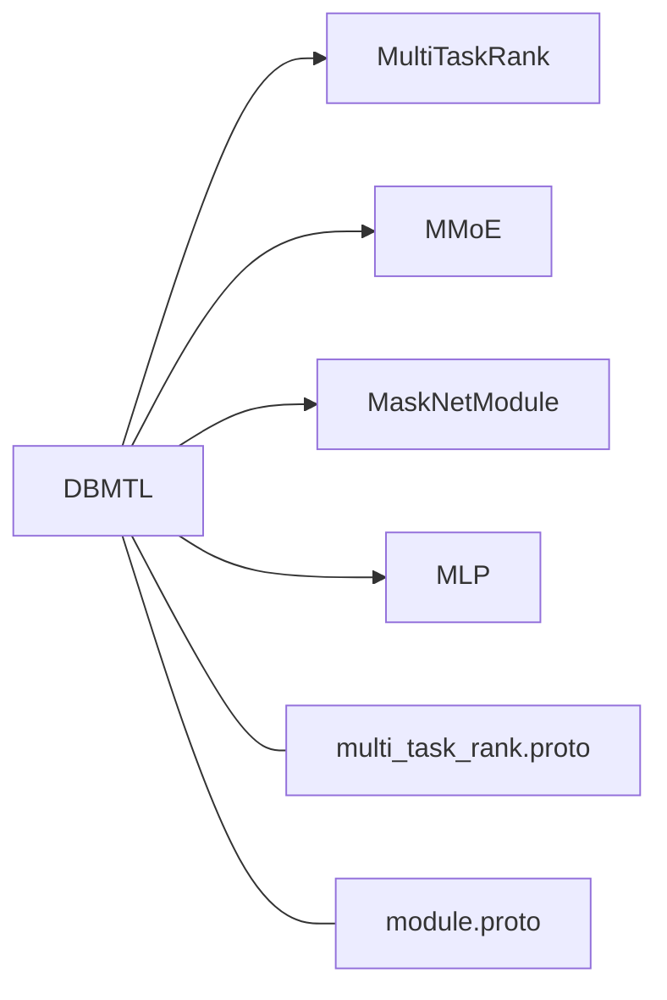

# DBMTL Model (Deep Bi-Modal Transformer Learning)

<cite>
**Referenced Files in This Document**
- [dbmtl.py](file://tzrec/models/dbmtl.py)
- [multi_task_rank.py](file://tzrec/models/multi_task_rank.py)
- [mmoe.py](file://tzrec/modules/mmoe.py)
- [masknet.py](file://tzrec/modules/masknet.py)
- [mlp.py](file://tzrec/modules/mlp.py)
- [multi_task_rank.proto](file://tzrec/protos/models/multi_task_rank.proto)
- [module.proto](file://tzrec/protos/module.proto)
- [dbmtl.md](file://docs/source/models/dbmtl.md)
- [dbmtl_taobao.config](file://examples/dbmtl_taobao.config)
- [dbmtl_taobao_seq.config](file://examples/dbmtl_taobao_seq.config)
- [dbmtl_taobao_jrc.config](file://examples/dbmtl_taobao_jrc.config)
</cite>

## Table of Contents

1. [Introduction](#introduction)
1. [Project Structure](#project-structure)
1. [Core Components](#core-components)
1. [Architecture Overview](#architecture-overview)
1. [Detailed Component Analysis](#detailed-component-analysis)
1. [Dependency Analysis](#dependency-analysis)
1. [Performance Considerations](#performance-considerations)
1. [Troubleshooting Guide](#troubleshooting-guide)
1. [Conclusion](#conclusion)
1. [Appendices](#appendices)

## Introduction

DBMTL (Deep Bi-Modal Transformer Learning) is a multi-task learning architecture designed to jointly optimize multiple related objectives by modeling explicit relationships among tasks. It supports both hard parameter sharing (via a shared bottom MLP or MaskNet) and soft parameter sharing (via an expert-gate mechanism similar to MMoE). The model introduces a hierarchical fusion pathway: a base shared representation is transformed by task towers; a relation MLP then integrates cross-task signals to refine predictions. This document explains the dual-path design, hierarchical fusion, and how DBMTL enables knowledge transfer across related tasks, with configuration guidance, practical examples, and optimization strategies.

## Project Structure

The DBMTL implementation resides in the models and modules packages, with configuration defined via protocol buffers and documented in the project’s documentation.

**Diagram sources**

- \[dbmtl.py\](file://tzrec/models/dbmtl.py#L28-L176)
- \[multi_task_rank.py\](file://tzrec/models/multi_task_rank.py#L25-L221)
- \[mmoe.py\](file://tzrec/modules/mmoe.py#L21-L78)
- \[masknet.py\](file://tzrec/modules/masknet.py#L88-L162)
- \[mlp.py\](file://tzrec/modules/mlp.py#L86-L178)
- \[multi_task_rank.proto\](file://tzrec/protos/models/multi_task_rank.proto#L22-L35)
- \[module.proto\](file://tzrec/protos/module.proto#L62-L80)
- \[dbmtl.md\](file://docs/source/models/dbmtl.md#L1-L160)
- \[dbmtl_taobao.config\](file://examples/dbmtl_taobao.config#L1-L224)
- \[dbmtl_taobao_seq.config\](file://examples/dbmtl_taobao_seq.config#L1-L257)
- \[dbmtl_taobao_jrc.config\](file://examples/dbmtl_taobao_jrc.config#L1-L209)

**Section sources**

- \[dbmtl.py\](file://tzrec/models/dbmtl.py#L28-L176)
- \[multi_task_rank.py\](file://tzrec/models/multi_task_rank.py#L25-L221)
- \[multi_task_rank.proto\](file://tzrec/protos/models/multi_task_rank.proto#L22-L35)
- \[module.proto\](file://tzrec/protos/module.proto#L62-L80)
- \[dbmtl.md\](file://docs/source/models/dbmtl.md#L1-L160)

## Core Components

- Shared Bottom Path
  - MaskNetModule: Optional masking and gating pathway that generates refined embeddings before downstream layers.
  - Bottom MLP: A shared MLP applied after MaskNet or directly on concatenated features.
- Expert-Gate Path (Soft Sharing)
  - MMoE: Produces task-specific features by mixing expert MLPs via learned gates; optionally with gate MLPs.
- Task Towers
  - Task Tower MLPs: Task-specific MLPs that transform base features.
  - Relation MLPs: Cross-task fusion MLPs that integrate outputs from related towers.
  - Output Heads: Linear layers mapping fused representations to task logits.
- Multi-Task Infrastructure
  - MultiTaskRank: Provides shared loss/metric initialization and prediction conversion across tasks.

Key implementation references:

- DBMTL initialization and forward pass: \[dbmtl.py\](file://tzrec/models/dbmtl.py#L38-L176)
- MMoE expert-gate mixing: \[mmoe.py\](file://tzrec/modules/mmoe.py#L21-L78)
- MaskNetModule masking and FFN: \[masknet.py\](file://tzrec/modules/masknet.py#L88-L162)
- MLP construction and stacking: \[mlp.py\](file://tzrec/modules/mlp.py#L86-L178)
- Multi-task prediction and loss wiring: \[multi_task_rank.py\](file://tzrec/models/multi_task_rank.py#L50-L221)

**Section sources**

- \[dbmtl.py\](file://tzrec/models/dbmtl.py#L38-L176)
- \[mmoe.py\](file://tzrec/modules/mmoe.py#L21-L78)
- \[masknet.py\](file://tzrec/modules/masknet.py#L88-L162)
- \[mlp.py\](file://tzrec/modules/mlp.py#L86-L178)
- \[multi_task_rank.py\](file://tzrec/models/multi_task_rank.py#L50-L221)

## Architecture Overview

DBMTL follows a dual-path design:

- Hard Parameter Sharing: Shared bottom via MaskNetModule or Bottom MLP.
- Soft Parameter Sharing: Optional MMoE replaces the shared bottom to produce task-specific features via expert-gate mixing.
- Hierarchical Fusion: Task towers transform base features; Relation MLPs fuse cross-task signals; final outputs are produced by task-specific linear heads.

**Diagram sources**

- \[dbmtl.py\](file://tzrec/models/dbmtl.py#L57-L124)
- \[mmoe.py\](file://tzrec/modules/mmoe.py#L60-L77)
- \[masknet.py\](file://tzrec/modules/masknet.py#L142-L161)
- \[mlp.py\](file://tzrec/modules/mlp.py#L161-L177)

**Section sources**

- \[dbmtl.py\](file://tzrec/models/dbmtl.py#L57-L124)
- \[mmoe.py\](file://tzrec/modules/mmoe.py#L60-L77)
- \[masknet.py\](file://tzrec/modules/masknet.py#L142-L161)
- \[mlp.py\](file://tzrec/modules/mlp.py#L161-L177)

## Detailed Component Analysis

### DBMTL Class and Forward Pass

- Initialization
  - Validates DBMTL configuration and initializes task towers.
  - Builds MaskNetModule (optional), Bottom MLP (optional), and MMoE (optional).
  - Constructs task MLPs and relation MLPs per task; relation inputs are concatenated from related towers’ outputs.
  - Creates linear output heads per task.
- Forward Pass
  - Builds grouped input features.
  - Applies MaskNetModule and/or Bottom MLP.
  - Produces task-specific inputs via MMoE or replicated shared features.
  - Applies task MLPs and relation MLPs in order; concatenates upstream relations.
  - Projects to logits via linear heads.

**Diagram sources**

- \[dbmtl.py\](file://tzrec/models/dbmtl.py#L125-L176)
- \[masknet.py\](file://tzrec/modules/masknet.py#L142-L161)
- \[mlp.py\](file://tzrec/modules/mlp.py#L161-L177)
- \[mmoe.py\](file://tzrec/modules/mmoe.py#L60-L77)

**Section sources**

- \[dbmtl.py\](file://tzrec/models/dbmtl.py#L38-L176)

### MMoE Module (Soft Parameter Sharing)

- Purpose: Replace hard shared bottom with soft sharing via mixture-of-experts and task gates.
- Mechanism:
  - Multiple expert MLPs transform the shared input independently.
  - Gate networks (optionally via gate MLPs) compute task-specific mixing weights.
  - Outputs are weighted sums over experts per task.

**Diagram sources**

- \[mmoe.py\](file://tzrec/modules/mmoe.py#L60-L77)

**Section sources**

- \[mmoe.py\](file://tzrec/modules/mmoe.py#L21-L78)

### MaskNetModule (Bi-Modal Masking)

- Purpose: Intelligently mask and refine input embeddings before downstream layers.
- Mechanism:
  - Parallel or serial MaskBlocks compute attention-like weights from embeddings and apply gating.
  - Optional top MLP further refines the masked features.
  - Supports reduction ratio or explicit aggregation dimension.

**Diagram sources**

- \[masknet.py\](file://tzrec/modules/masknet.py#L142-L161)

**Section sources**

- \[masknet.py\](file://tzrec/modules/masknet.py#L88-L162)

### MLP Stack (Perceptrons and Stacking)

- Purpose: Build deep, optionally normalized, and regularized task towers and relation MLPs.
- Mechanism:
  - Perceptron layers support batch/layer norm, activations, and dropout.
  - MLP stacks multiple Perceptrons sequentially.

**Diagram sources**

- \[mlp.py\](file://tzrec/modules/mlp.py#L161-L177)

**Section sources**

- \[mlp.py\](file://tzrec/modules/mlp.py#L86-L178)

### MultiTaskRank Infrastructure

- Provides:
  - Prediction conversion from raw logits to probabilities and labels.
  - Loss initialization with support for sample/task weights and task-space indicators.
  - Metric initialization and updates across tasks.

**Diagram sources**

- \[multi_task_rank.py\](file://tzrec/models/multi_task_rank.py#L50-L221)

**Section sources**

- \[multi_task_rank.py\](file://tzrec/models/multi_task_rank.py#L25-L221)

## Dependency Analysis

- DBMTL depends on:
  - MultiTaskRank for multi-task scaffolding.
  - MaskNetModule and MLP for shared bottom pathways.
  - MMoE for soft parameter sharing.
- Protobuf definitions:
  - DBMTL message defines optional MaskNetModule, Bottom MLP, optional MMoE expert/gate MLPs, and task towers.
  - Module messages define MLP, MaskBlock, and MaskNetModule configurations.

**Diagram sources**

- \[dbmtl.py\](file://tzrec/models/dbmtl.py#L18-L25)
- \[multi_task_rank.proto\](file://tzrec/protos/models/multi_task_rank.proto#L22-L35)
- \[module.proto\](file://tzrec/protos/module.proto#L62-L80)

**Section sources**

- \[dbmtl.py\](file://tzrec/models/dbmtl.py#L18-L25)
- \[multi_task_rank.proto\](file://tzrec/protos/models/multi_task_rank.proto#L22-L35)
- \[module.proto\](file://tzrec/protos/module.proto#L62-L80)

## Performance Considerations

- Memory Efficiency
  - Use MaskNetModule with serial mode to reduce intermediate feature dimensions when memory is constrained.
  - Reduce n_mask_blocks or top_mlp dimensions to lower compute overhead.
  - Prefer Bottom MLP over MMoE when expert count is high; MMoE increases parameter count and compute due to multiple experts and gates.
- Compute Efficiency
  - Limit num_expert in MMoE to balance capacity and speed.
  - Use layer norm or batch norm judiciously; they improve stability but add compute.
  - Control dropout ratios to avoid over-smoothing while keeping training stable.
- Scalability
  - Relation MLPs increase fusion cost; limit the number of upstream relations and fusion dimensions.
  - Downstream task MLPs should be pruned to task needs to avoid unnecessary computation.

[No sources needed since this section provides general guidance]

## Troubleshooting Guide

- Validation Failures
  - Ensure the model config’s WhichOneof("model") matches "dbmtl" and the message type is DBMTL.
- Shape Mismatches
  - Verify that relation MLP input dimensions match the concatenated upstream outputs (task MLP output or shared features).
- Loss Weighting Issues
  - When using task-space indicators, confirm that in/out task space weights are set appropriately; weights are normalized per batch.
- Sequence Integration
  - When combining sequential encoders with DBMTL, ensure sequence groups and query/sequence feature names align with the configured sequence encoder.

**Section sources**

- \[dbmtl.py\](file://tzrec/models/dbmtl.py#L46-L50)
- \[multi_task_rank.py\](file://tzrec/models/multi_task_rank.py#L105-L126)

## Conclusion

DBMTL offers a flexible, modular framework for multi-task learning with explicit task relationships. Its dual-path design—hard sharing via MaskNet/Bottom MLP and soft sharing via MMoE—enables robust knowledge transfer across related tasks. Hierarchical fusion through task towers and relation MLPs improves performance by leveraging cross-task signals. With careful configuration of modal specifications, transformer-like attention modules (e.g., MaskNet), and fusion strategies, DBMTL can be adapted to heterogeneous recommendation scenarios and scaled efficiently.

[No sources needed since this section summarizes without analyzing specific files]

## Appendices

### Configuration Requirements

- Modal Specifications
  - Define a single feature group aggregating user/item/context features.
  - Optionally configure sequence groups and encoders for temporal features.
- Transformer-like Attention Modules
  - MaskNetModule: Configure n_mask_blocks, mask_block (reduction_ratio or aggregation_dim, hidden_dim), top_mlp, and use_parallel.
  - Sequence Encoders: Choose DIN, SelfAttention, or pooling variants depending on temporal dynamics.
- Transformer Layers and Fusion
  - Bottom MLP: hidden_units per layer.
  - MMoE: expert_mlp, gate_mlp (optional), num_expert.
  - Task Towers: mlp per task; relation_tower_names and relation_mlp for cross-task fusion.
  - Output Heads: Linear layers mapping to num_class per task.

**Section sources**

- \[dbmtl.md\](file://docs/source/models/dbmtl.md#L12-L160)
- \[multi_task_rank.proto\](file://tzrec/protos/models/multi_task_rank.proto#L22-L35)
- \[module.proto\](file://tzrec/protos/module.proto#L62-L80)

### Practical Examples

- Taobao CTR/CVR Baseline
  - Uses a shared bottom MLP and a relation MLP connecting CVR to CTR outputs.
  - References: \[dbmtl_taobao.config\](file://examples/dbmtl_taobao.config#L159-L224)
- Sequence-Aware DBMTL
  - Adds a DIN encoder over click sequences; combines with DBMTL task towers.
  - References: \[dbmtl_taobao_seq.config\](file://examples/dbmtl_taobao_seq.config#L171-L256)
- Joint Ranking with Session-Based Loss
  - Demonstrates JRC loss usage with DBMTL task towers.
  - References: \[dbmtl_taobao_jrc.config\](file://examples/dbmtl_taobao_jrc.config#L143-L209)

**Section sources**

- \[dbmtl_taobao.config\](file://examples/dbmtl_taobao.config#L159-L224)
- \[dbmtl_taobao_seq.config\](file://examples/dbmtl_taobao_seq.config#L171-L256)
- \[dbmtl_taobao_jrc.config\](file://examples/dbmtl_taobao_jrc.config#L143-L209)
