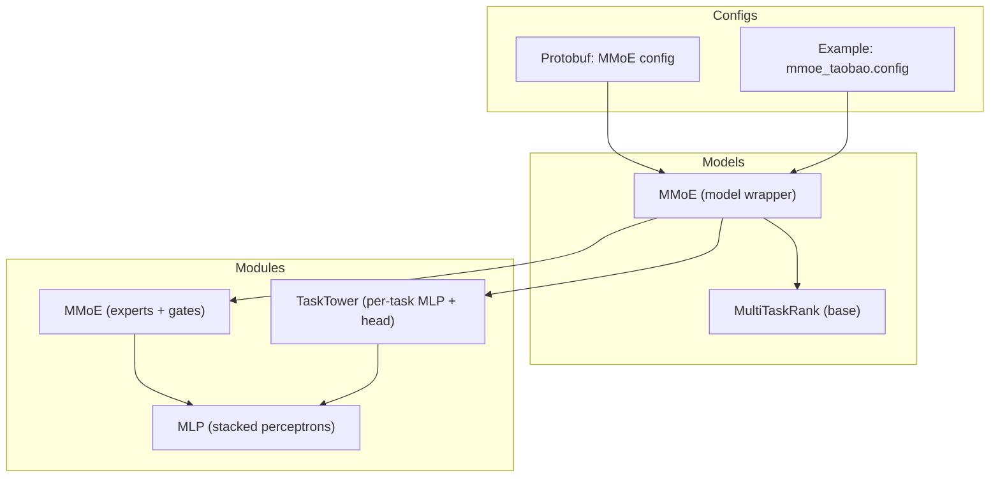
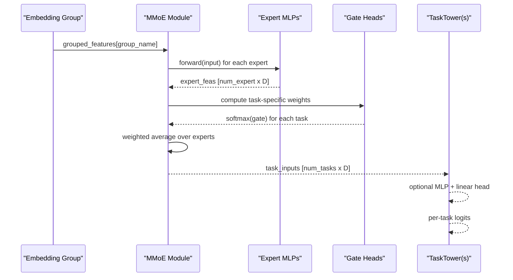
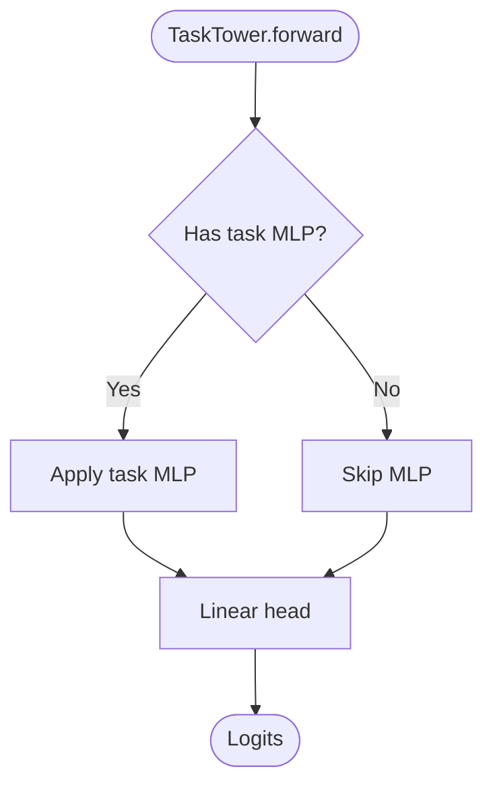
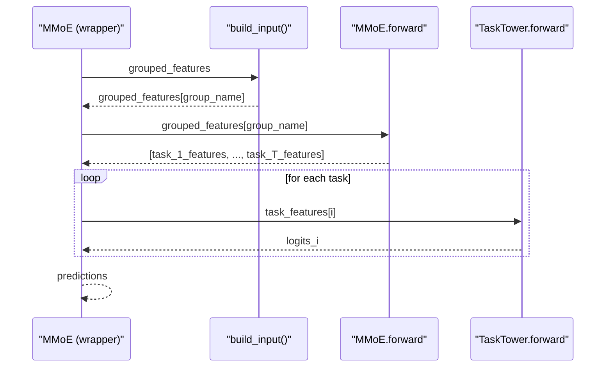
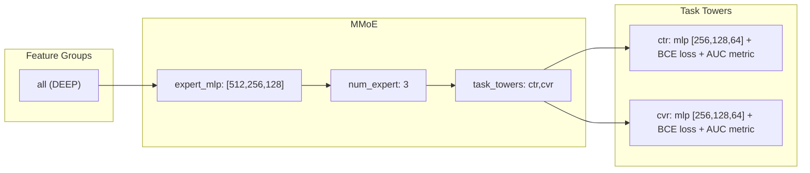
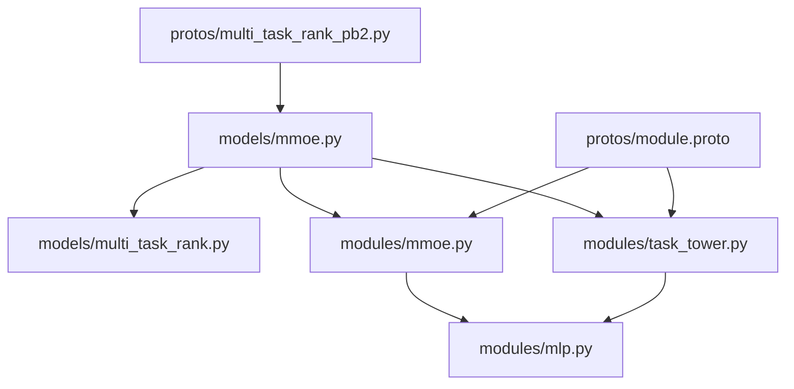

# MMoE Model (Multi-gate Mixture-of-Experts)

<cite>
**Referenced Files in This Document**
- [mmoe.py](file://tzrec/models/mmoe.py)
- [mmoe.py](file://tzrec/modules/mmoe.py)
- [task_tower.py](file://tzrec/modules/task_tower.py)
- [mlp.py](file://tzrec/modules/mlp.py)
- [multi_task_rank.py](file://tzrec/models/multi_task_rank.py)
- [mmoe_taobao.config](file://examples/mmoe_taobao.config)
- [mmoe.md](file://docs/source/models/mmoe.md)
- [multi_task_rank_pb2.py](file://tzrec/protos/models/multi_task_rank_pb2.py)
- [module.proto](file://tzrec/protos/module.proto)
</cite>

## Table of Contents

1. [Introduction](#introduction)
1. [Project Structure](#project-structure)
1. [Core Components](#core-components)
1. [Architecture Overview](#architecture-overview)
1. [Detailed Component Analysis](#detailed-component-analysis)
1. [Dependency Analysis](#dependency-analysis)
1. [Performance Considerations](#performance-considerations)
1. [Troubleshooting Guide](#troubleshooting-guide)
1. [Conclusion](#conclusion)
1. [Appendices](#appendices)

## Introduction

This document explains the MMoE (Multi-gate Mixture-of-Experts) model implementation in TorchEasyRec. It covers the architectural concept of task-specific expert networks with shared resources, the gating network mechanism for task routing, and the mathematical formulation behind expert specialization and task collaboration. It also documents the implementation of the mixture-of-experts architecture, gate network design for task-specific routing, and the shared-except-specific strategy. Configuration parameters such as expert dimensions, number of experts, task towers, and gating strategies are detailed, along with practical examples for common multi-task scenarios (CTR+CV, watch_time+conversion), performance optimization techniques, and guidance on choosing expert configurations for different scales.

## Project Structure

The MMoE implementation spans several modules:

- Model wrapper: orchestrates input embedding grouping, MMoE module instantiation, and task towers.
- MMoE module: defines the expert networks and task-specific gates.
- TaskTower module: applies task-specific MLPs and final linear heads.
- MLP module: reusable multi-layer perceptrons with configurable activations, normalization, and dropout.
- MultiTaskRank base class: provides shared multi-task training, loss computation, and metric updates.
- Example configuration: demonstrates a two-task setup (CTR and CVR) on Taobao-like data.



**Diagram sources**

- \[mmoe.py\](file://tzrec/models/mmoe.py#L26-L87)
- \[mmoe.py\](file://tzrec/modules/mmoe.py#L21-L78)
- \[task_tower.py\](file://tzrec/modules/task_tower.py#L21-L52)
- \[mlp.py\](file://tzrec/modules/mlp.py#L86-L178)
- \[multi_task_rank.py\](file://tzrec/models/multi_task_rank.py#L25-L221)
- \[mmoe_taobao.config\](file://examples/mmoe_taobao.config#L159-L216)
- \[multi_task_rank_pb2.py\](file://tzrec/protos/models/multi_task_rank_pb2.py#L19-L39)

**Section sources**

- \[mmoe.py\](file://tzrec/models/mmoe.py#L26-L87)
- \[mmoe.py\](file://tzrec/modules/mmoe.py#L21-L78)
- \[task_tower.py\](file://tzrec/modules/task_tower.py#L21-L52)
- \[mlp.py\](file://tzrec/modules/mlp.py#L86-L178)
- \[multi_task_rank.py\](file://tzrec/models/multi_task_rank.py#L25-L221)
- \[mmoe_taobao.config\](file://examples/mmoe_taobao.config#L159-L216)
- \[mmoe.md\](file://docs/source/models/mmoe.md#L1-L88)
- \[multi_task_rank_pb2.py\](file://tzrec/protos/models/multi_task_rank_pb2.py#L19-L39)
- \[module.proto\](file://tzrec/protos/module.proto#L4-L17)

## Core Components

- MMoE model wrapper:
  - Builds grouped embeddings, instantiates the MMoE module with expert MLPs and optional gate MLPs, and constructs task towers for each task.
  - Implements the forward pass to route signals through the MMoE and produce per-task outputs.
- MMoE module:
  - Contains a list of expert MLPs and a list of gate heads (optionally preceded by gate MLPs).
  - Produces a list of task-specific features by computing task-specific gating weights and mixing expert outputs.
- TaskTower module:
  - Applies an optional task MLP followed by a linear head to produce per-task logits.
- MLP module:
  - Stacked perceptrons with configurable activation, batch/layer norm, and dropout.
- MultiTaskRank base:
  - Provides shared logic for multi-task training, loss initialization, metric updates, and prediction post-processing.

Key configuration parameters:

- Expert MLP: hidden_units define expert capacities.
- num_expert: number of experts (capacity).
- Gate MLP (optional): task-specific routing head before linear gate.
- Task towers: each defines label_name, num_class, optional MLP, losses, metrics, and weighting options.

**Section sources**

- \[mmoe.py\](file://tzrec/models/mmoe.py#L36-L87)
- \[mmoe.py\](file://tzrec/modules/mmoe.py#L29-L78)
- \[task_tower.py\](file://tzrec/modules/task_tower.py#L30-L52)
- \[mlp.py\](file://tzrec/modules/mlp.py#L103-L178)
- \[multi_task_rank.py\](file://tzrec/models/multi_task_rank.py#L50-L221)
- \[mmoe_taobao.config\](file://examples/mmoe_taobao.config#L180-L213)
- \[mmoe.md\](file://docs/source/models/mmoe.md#L8-L74)
- \[multi_task_rank_pb2.py\](file://tzrec/protos/models/multi_task_rank_pb2.py#L28-L39)
- \[module.proto\](file://tzrec/protos/module.proto#L4-L17)

## Architecture Overview

The MMoE architecture separates shared representation learning from task specialization:

- Shared backbone: embedding groups feed into the MMoE module.
- Experts: multiple identical MLPs transform the shared input independently.
- Gates: task-specific softmax over experts; weights are computed from either the raw input or a task-specific gate MLP.
- Routing: weighted combination of expert outputs produces per-task features.
- Task towers: per-task MLPs and linear heads produce final predictions.



**Diagram sources**

- \[mmoe.py\](file://tzrec/models/mmoe.py#L68-L87)
- \[mmoe.py\](file://tzrec/modules/mmoe.py#L60-L78)
- \[task_tower.py\](file://tzrec/modules/task_tower.py#L45-L52)

## Detailed Component Analysis

### MMoE Module Implementation

The MMoE module encapsulates:

- Expert networks: a ModuleList of identical MLPs.
- Gate networks: optional task-specific MLPs followed by a linear layer to produce gate logits; softmax yields routing weights.
- Forward pass: stacks expert outputs and computes a weighted average per task.

```mermaid
classDiagram
class MMoE {
+int num_expert
+int num_task
+bool has_gate_mlp
+output_dim() int
+forward(input) List[Tensor]
}
class MLP {
+int[] hidden_units
+output_dim() int
+forward(input) Tensor
}
class TaskTower {
+int num_class
+forward(features) Tensor
}
MMoE --> MLP : "expert_mlps"
MMoE --> MLP : "gate_mlps (optional)"
MMoE --> "linear" : "gate_finals"
TaskTower --> MLP : "tower_mlp (optional)"
```

**Diagram sources**

- \[mmoe.py\](file://tzrec/modules/mmoe.py#L21-L78)
- \[mlp.py\](file://tzrec/modules/mlp.py#L86-L178)
- \[task_tower.py\](file://tzrec/modules/task_tower.py#L21-L52)

**Section sources**

- \[mmoe.py\](file://tzrec/modules/mmoe.py#L29-L78)
- \[mlp.py\](file://tzrec/modules/mlp.py#L103-L178)

### Mathematical Formulation

Let:

- E be the number of experts.
- D_in be the input dimension to experts.
- D_out be the output dimension of experts.
- x ∈ R^{D_in} be the shared input from embedding groups.
- W^{(e)} ∈ R^{D\_{in} \\times D\_{out}} be the weights of expert e.
- g_t ∈ R^E be the gate logits for task t, computed as g_t = Linear_t([MLP\_{gate_t}(x)] or x).
- α\_{t,e} = softmax(g_t)\_e be the routing weight for expert e under task t.

Then:

- h^{(e)} = expert(x) = MLP_e(x)
- z_t = \\sum\_{e=1}^E α\_{t,e} h^{(e)}

The per-task output is produced by a task tower head applied to z_t.

Routing interpretation:

- When tasks are unrelated, α\_{t,e} concentrates on a small subset of experts, enabling specialization.
- When tasks are related, α\_{t,e} may distribute across experts, enabling collaboration.

**Section sources**

- \[mmoe.py\](file://tzrec/modules/mmoe.py#L60-L78)

### Task Tower Design

Each task has:

- An optional task MLP to refine the routed representation.
- A final linear layer producing logits for the specified number of classes.



**Diagram sources**

- \[task_tower.py\](file://tzrec/modules/task_tower.py#L45-L52)

**Section sources**

- \[task_tower.py\](file://tzrec/modules/task_tower.py#L30-L52)

### Model Wrapper and Prediction Pipeline

The MMoE model wrapper:

- Initializes input embedding grouping and computes total input dimension.
- Instantiates MMoE with expert MLPs, optional gate MLPs, and task towers.
- Executes forward pass: builds grouped features, runs MMoE to get task-specific inputs, feeds each into its TaskTower, and converts outputs to predictions.



**Diagram sources**

- \[mmoe.py\](file://tzrec/models/mmoe.py#L68-L87)
- \[mmoe.py\](file://tzrec/modules/mmoe.py#L60-L78)
- \[task_tower.py\](file://tzrec/modules/task_tower.py#L45-L52)

**Section sources**

- \[mmoe.py\](file://tzrec/models/mmoe.py#L36-L87)

### Configuration Parameters and Examples

- Expert MLP: hidden_units define expert capacities; output dimension becomes the input to task towers.
- num_expert: controls expert capacity and model complexity.
- Gate MLP (optional): enables task-specific routing heads; if absent, routing is based on the raw input.
- Task towers: specify label_name, num_class, optional MLP, losses, and metrics.

Practical example (CTR+CVR):

- Two tasks: "ctr" and "cvr".
- Expert MLP: [512, 256, 128].
- num_expert: 3.
- Task MLPs: [256, 128, 64] per task.
- Losses: binary cross entropy per task.
- Metrics: AUC for both tasks.



**Diagram sources**

- \[mmoe_taobao.config\](file://examples/mmoe_taobao.config#L159-L216)
- \[mmoe.md\](file://docs/source/models/mmoe.md#L81-L84)

**Section sources**

- \[mmoe_taobao.config\](file://examples/mmoe_taobao.config#L159-L216)
- \[mmoe.md\](file://docs/source/models/mmoe.md#L8-L74)

## Dependency Analysis

High-level dependencies:

- MMoE model wrapper depends on MultiTaskRank for multi-task training infrastructure.
- MMoE module depends on MLP for expert and optional gate MLPs.
- TaskTower depends on MLP for optional refinement and linear head for logits.
- Protobuf definitions describe configuration structures for MMoE and MLP.



**Diagram sources**

- \[mmoe.py\](file://tzrec/models/mmoe.py#L26-L87)
- \[multi_task_rank.py\](file://tzrec/models/multi_task_rank.py#L25-L221)
- \[mmoe.py\](file://tzrec/modules/mmoe.py#L21-L78)
- \[task_tower.py\](file://tzrec/modules/task_tower.py#L21-L52)
- \[mlp.py\](file://tzrec/modules/mlp.py#L86-L178)
- \[multi_task_rank_pb2.py\](file://tzrec/protos/models/multi_task_rank_pb2.py#L19-L39)
- \[module.proto\](file://tzrec/protos/module.proto#L4-L17)

**Section sources**

- \[mmoe.py\](file://tzrec/models/mmoe.py#L26-L87)
- \[mmoe.py\](file://tzrec/modules/mmoe.py#L21-L78)
- \[task_tower.py\](file://tzrec/modules/task_tower.py#L21-L52)
- \[mlp.py\](file://tzrec/modules/mlp.py#L86-L178)
- \[multi_task_rank.py\](file://tzrec/models/multi_task_rank.py#L25-L221)
- \[multi_task_rank_pb2.py\](file://tzrec/protos/models/multi_task_rank_pb2.py#L19-L39)
- \[module.proto\](file://tzrec/protos/module.proto#L4-L17)

## Performance Considerations

- Expert capacity vs. computational cost:
  - Increasing num_expert increases memory footprint and compute during expert forward passes and gating.
  - Larger expert MLP hidden_units increase per-expert compute and memory.
- Gate MLP overhead:
  - Optional gate MLPs add compute per task; beneficial when tasks require distinct routing.
- Task tower costs:
  - Deeper task towers improve representational power but increase compute and risk overfitting on small tasks.
- Routing efficiency:
  - Softmax over experts is O(E) per task; E should be tuned to dataset difficulty and task correlation.
- Practical tuning tips:
  - Start with moderate num_expert (e.g., 3–5) and adjust based on validation metrics.
  - Use gate MLPs only if routing variance across tasks is significant.
  - Prefer shared-except-specific strategy: shared experts plus task-specific MLPs in towers for balanced collaboration and specialization.

[No sources needed since this section provides general guidance]

## Troubleshooting Guide

Common issues and checks:

- Shape mismatches:
  - Ensure embedding group total dimension matches MMoE in_features.
  - Verify expert MLP output_dim equals task tower input dimension.
- Routing collapse:
  - If softmax over experts collapses to a single expert, consider increasing num_expert or adding gate MLPs.
- Overfitting:
  - Reduce expert MLP depth or add dropout; regularize task towers.
- Metric and loss alignment:
  - Confirm label_name and num_class match task configuration; ensure losses and metrics are properly configured per task.

**Section sources**

- \[mmoe.py\](file://tzrec/models/mmoe.py#L46-L66)
- \[mmoe.py\](file://tzrec/modules/mmoe.py#L56-L58)
- \[task_tower.py\](file://tzrec/modules/task_tower.py#L30-L43)
- \[multi_task_rank.py\](file://tzrec/models/multi_task_rank.py#L80-L142)

## Conclusion

The MMoE implementation in TorchEasyRec cleanly separates shared representation learning from task specialization via experts and task-specific gates. The shared-except-specific strategy enables both collaboration among related tasks and specialization for unrelated ones. Configuration is straightforward: define expert MLP capacities, number of experts, optional gate MLPs, and per-task towers with losses and metrics. Practical examples demonstrate setting up CTR+CVR pipelines, while performance guidance helps balance expert capacity against computational efficiency.

[No sources needed since this section summarizes without analyzing specific files]

## Appendices

### Configuration Reference

- MMoE config fields:
  - expert_mlp: MLP specification for experts.
  - gate_mlp: optional MLP for task-specific routing.
  - num_expert: number of experts.
  - task_towers: list of task configurations with label_name, num_class, mlp, losses, metrics.
- MLP config fields:
  - hidden_units: list of layer widths.
  - activation, use_bn, use_ln, dropout_ratio, bias.

**Section sources**

- \[mmoe.md\](file://docs/source/models/mmoe.md#L8-L74)
- \[multi_task_rank_pb2.py\](file://tzrec/protos/models/multi_task_rank_pb2.py#L28-L39)
- \[module.proto\](file://tzrec/protos/module.proto#L4-L17)
