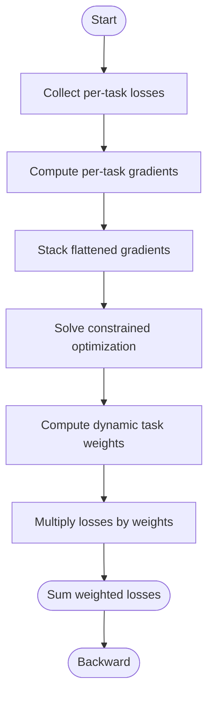

# Multi-Task Learning Framework

<cite>
**Referenced Files in This Document**
- [multi_task_rank.py](file://tzrec/models/multi_task_rank.py)
- [mmoe.py](file://tzrec/models/mmoe.py)
- [dbmtl.py](file://tzrec/models/dbmtl.py)
- [ple.py](file://tzrec/models/ple.py)
- [pe_mtl_loss.py](file://tzrec/loss/pe_mtl_loss.py)
- [mmoe.py](file://tzrec/modules/mmoe.py)
- [extraction_net.py](file://tzrec/modules/extraction_net.py)
- [mmoe_taobao.config](file://examples/mmoe_taobao.config)
- [dbmtl_taobao.config](file://examples/dbmtl_taobao.config)
- [ple_taobao.config](file://examples/ple_taobao.config)
- [mmoe.md](file://docs/source/models/mmoe.md)
- [dbmtl.md](file://docs/source/models/dbmtl.md)
- [ple.md](file://docs/source/models/ple.md)
</cite>

## Table of Contents

1. [Introduction](#introduction)
1. [Project Structure](#project-structure)
1. [Core Components](#core-components)
1. [Architecture Overview](#architecture-overview)
1. [Detailed Component Analysis](#detailed-component-analysis)
1. [Dependency Analysis](#dependency-analysis)
1. [Performance Considerations](#performance-considerations)
1. [Troubleshooting Guide](#troubleshooting-guide)
1. [Conclusion](#conclusion)
1. [Appendices](#appendices)

## Introduction

This document explains the multi-task learning framework in TorchEasyRec, focusing on the MultiTaskRank base class and three specialized architectures: MMoE (Multi-gate Mixture-of-Experts), DBMTL (Deep Bayesian Multi-Target Learning), and PLE (Progressive Layered Extraction). It covers how these models share representational capacity across tasks, the Pareto-efficient multi-task loss weighting mechanism, gradient balancing, configuration requirements, loss combinations, evaluation strategies, and practical multi-task scenarios. It also describes integration with single-task models and a decision framework for task prioritization.

## Project Structure

The multi-task learning stack centers around a shared base class and modularized task towers and experts:

- Base class: MultiTaskRank orchestrates initialization, prediction, loss computation, and metrics for multiple tasks.
- Specializations:
  - MMoE: Task-specific gating over shared experts.
  - DBMTL: Shared bottom layers, optional MMoE, task-specific MLPs, and explicit inter-task relations via relation MLPs.
  - PLE: Progressive layered extraction with task and shared experts, reducing seesaw effects.
- Loss weighting: Pareto-efficient dynamic weighting balances competing tasks.
- Modules: MMoE experts and PLE extraction networks implement the core sharing mechanisms.

**Diagram sources**

- \[multi_task_rank.py\](file://tzrec/models/multi_task_rank.py#L25-L221)
- \[mmoe.py\](file://tzrec/models/mmoe.py#L26-L87)
- \[dbmtl.py\](file://tzrec/models/dbmtl.py#L28-L176)
- \[ple.py\](file://tzrec/models/ple.py#L27-L110)
- \[mmoe.py\](file://tzrec/modules/mmoe.py#L21-L78)
- \[extraction_net.py\](file://tzrec/modules/extraction_net.py#L20-L140)
- \[pe_mtl_loss.py\](file://tzrec/loss/pe_mtl_loss.py#L18-L111)

**Section sources**

- \[multi_task_rank.py\](file://tzrec/models/multi_task_rank.py#L25-L221)
- \[mmoe.py\](file://tzrec/models/mmoe.py#L26-L87)
- \[dbmtl.py\](file://tzrec/models/dbmtl.py#L28-L176)
- \[ple.py\](file://tzrec/models/ple.py#L27-L110)
- \[mmoe.py\](file://tzrec/modules/mmoe.py#L21-L78)
- \[extraction_net.py\](file://tzrec/modules/extraction_net.py#L20-L140)
- \[pe_mtl_loss.py\](file://tzrec/loss/pe_mtl_loss.py#L18-L111)

## Core Components

- MultiTaskRank base class
  - Manages task towers, labels, and sample weights.
  - Initializes per-task losses with optional per-sample weights and task-space indicators.
  - Aggregates per-task predictions, metrics, and loss metrics.
  - Supports Pareto-efficient loss weighting when enabled.
- MMoE specialization
  - Single shared embedding group feeds an MMoE module producing task-specific features via soft gating over experts.
  - Each task has an independent TaskTower head.
- DBMTL specialization
  - Optional MaskNet, Bottom MLP, and optional MMoE at the bottom.
  - Task-specific MLPs and relation MLPs define inter-task dependencies.
  - Outputs per-task logits via linear heads.
- PLE specialization
  - Progressive extraction networks with task experts and shared experts.
  - Final task towers consume extracted features from each layer.
- Pareto-efficient multi-task loss
  - Dynamically computes task weights by balancing gradient norms across tasks, minimizing negative transfer and seesaw effects.

**Section sources**

- \[multi_task_rank.py\](file://tzrec/models/multi_task_rank.py#L25-L221)
- \[mmoe.py\](file://tzrec/models/mmoe.py#L26-L87)
- \[dbmtl.py\](file://tzrec/models/dbmtl.py#L28-L176)
- \[ple.py\](file://tzrec/models/ple.py#L27-L110)
- \[pe_mtl_loss.py\](file://tzrec/loss/pe_mtl_loss.py#L18-L111)

## Architecture Overview

The framework supports flexible sharing strategies:

- Hard parameter sharing (DBMTL bottom/shared layers, PLE extraction nets) enables strong collaboration but may amplify negative transfer.
- Soft parameter sharing (MMoE gating) adapts expert utilization per task, improving adaptivity.
- Inter-task relations (DBMTL relation MLPs) explicitly model dependencies.
- Pareto-efficient loss weighting dynamically balances tasks’ contributions to the global gradient.

**Diagram sources**

- \[multi_task_rank.py\](file://tzrec/models/multi_task_rank.py#L97-L142)
- \[mmoe.py\](file://tzrec/models/mmoe.py#L68-L87)
- \[dbmtl.py\](file://tzrec/models/dbmtl.py#L125-L176)
- \[ple.py\](file://tzrec/models/ple.py#L87-L110)
- \[pe_mtl_loss.py\](file://tzrec/loss/pe_mtl_loss.py#L77-L110)

## Detailed Component Analysis

### MultiTaskRank Base Class

Key responsibilities:

- Task tower parsing and per-task loss initialization with optional sample weights and task-space indicators.
- Prediction aggregation across task towers.
- Metric initialization and updates for both evaluation and training.
- Optional Pareto-efficient loss weighting initialization.

Implementation highlights:

- Per-task loss weighting normalization and optional task-space masking.
- Dynamic suffix-based naming for predictions/metrics/losses per task.
- Integration hook for Pareto-efficient loss weighting.

**Diagram sources**

- \[multi_task_rank.py\](file://tzrec/models/multi_task_rank.py#L25-L221)

**Section sources**

- \[multi_task_rank.py\](file://tzrec/models/multi_task_rank.py#L25-L221)

### MMoE Model

Architectural approach:

- Embedding group → MMoE module → TaskTower per task.
- Experts are shared across tasks; gates select expert mixtures per task.

**Diagram sources**

- \[mmoe.py\](file://tzrec/models/mmoe.py#L26-L87)
- \[mmoe.py\](file://tzrec/modules/mmoe.py#L21-L78)

**Section sources**

- \[mmoe.py\](file://tzrec/models/mmoe.py#L26-L87)
- \[mmoe.py\](file://tzrec/modules/mmoe.py#L21-L78)
- \[mmoe.md\](file://docs/source/models/mmoe.md#L1-L88)

### DBMTL Model

Architectural approach:

- Optional MaskNet → optional Bottom MLP → optional MMoE → Task-specific MLPs → Relation MLPs (optional) → Linear heads per task.

**Diagram sources**

- \[dbmtl.py\](file://tzrec/models/dbmtl.py#L28-L176)

**Section sources**

- \[dbmtl.py\](file://tzrec/models/dbmtl.py#L28-L176)
- \[dbmtl.md\](file://docs/source/models/dbmtl.md#L1-L160)

### PLE Model

Architectural approach:

- Embedding group → ExtractionNet layers (progressive) → Task towers per task.
- Each layer composes task experts and shared experts via gated fusion.

**Diagram sources**

- \[ple.py\](file://tzrec/models/ple.py#L27-L110)
- \[extraction_net.py\](file://tzrec/modules/extraction_net.py#L20-L140)

**Section sources**

- \[ple.py\](file://tzrec/models/ple.py#L27-L110)
- \[extraction_net.py\](file://tzrec/modules/extraction_net.py#L20-L140)
- \[ple.md\](file://docs/source/models/ple.md#L1-L118)

### Pareto-Efficient Multi-Task Loss

Mechanism:

- Computes per-task gradients and solves a constrained optimization to balance gradient magnitudes.
- Returns a weighted combination of per-task losses for backward pass.

**Diagram sources**

- \[pe_mtl_loss.py\](file://tzrec/loss/pe_mtl_loss.py#L77-L110)

**Section sources**

- \[pe_mtl_loss.py\](file://tzrec/loss/pe_mtl_loss.py#L18-L111)

## Dependency Analysis

- MultiTaskRank depends on:
  - RankModel base for common training hooks.
  - Protobuf task tower configurations for per-task heads, losses, metrics, and weights.
  - Utility div_no_nan for safe normalization of per-sample weights.
- MMoE depends on:
  - MMoE module for soft expert gating.
  - TaskTower for per-task heads.
- DBMTL depends on:
  - MaskNetModule, MLP, optional MMoE, and per-task/relation MLPs.
- PLE depends on:
  - ExtractionNet for progressive expert fusion.
  - TaskTower for per-task heads.
- Pareto-efficient loss depends on:
  - Autograd to compute per-task gradients and NumPy/SciPy for optimization.

**Diagram sources**

- \[multi_task_rank.py\](file://tzrec/models/multi_task_rank.py#L25-L221)
- \[mmoe.py\](file://tzrec/models/mmoe.py#L26-L87)
- \[dbmtl.py\](file://tzrec/models/dbmtl.py#L28-L176)
- \[ple.py\](file://tzrec/models/ple.py#L27-L110)
- \[pe_mtl_loss.py\](file://tzrec/loss/pe_mtl_loss.py#L18-L111)

**Section sources**

- \[multi_task_rank.py\](file://tzrec/models/multi_task_rank.py#L25-L221)
- \[mmoe.py\](file://tzrec/models/mmoe.py#L26-L87)
- \[dbmtl.py\](file://tzrec/models/dbmtl.py#L28-L176)
- \[ple.py\](file://tzrec/models/ple.py#L27-L110)
- \[pe_mtl_loss.py\](file://tzrec/loss/pe_mtl_loss.py#L18-L111)

## Performance Considerations

- Gradient balancing: Pareto-efficient loss reduces gradient disagreement among tasks, stabilizing training and improving convergence.
- Sharing strategies:
  - MMoE: soft sharing via gating; effective when tasks differ in expertise needs.
  - DBMTL: hard sharing plus relations; powerful when explicit causal dependencies exist.
  - PLE: progressive extraction; mitigates seesaw effects by gradually exposing shared/task-specific features.
- Computational overhead:
  - MMoE adds gating computations; PLE adds multiple extraction layers; DBMTL adds optional MaskNet/Bottom MLP/MMoE.
- Memory footprint:
  - Larger expert counts increase memory; consider expert_num and hidden_units carefully.

[No sources needed since this section provides general guidance]

## Troubleshooting Guide

Common issues and remedies:

- Imbalanced tasks and vanishing gradients:
  - Enable Pareto-efficient loss weighting to balance gradients across tasks.
- Task-space mismatch:
  - Use task_space_indicator_label with in/out task-space weights to restrict loss computation to relevant samples.
- Poor CVR performance relative to CTR:
  - In DBMTL, configure relation MLP linking CVR to CTR to exploit dependency.
- Training instability:
  - Reduce learning rates for dense/sparse optimizers; adjust expert_num and hidden_units; monitor per-task metrics.

**Section sources**

- \[multi_task_rank.py\](file://tzrec/models/multi_task_rank.py#L97-L142)
- \[dbmtl.py\](file://tzrec/models/dbmtl.py#L90-L123)
- \[pe_mtl_loss.py\](file://tzrec/loss/pe_mtl_loss.py#L77-L110)

## Conclusion

TorchEasyRec’s multi-task framework provides a unified base class and modular specializations to address diverse multi-objective recommendation needs. MMoE excels in adaptive expert utilization, DBMTL leverages explicit task relations and hard sharing, and PLE reduces seesaw effects via progressive extraction. The Pareto-efficient loss mechanism further improves training stability and performance by dynamically balancing competing objectives.

[No sources needed since this section summarizes without analyzing specific files]

## Appendices

### Configuration Requirements and Examples

- MMoE configuration
  - Define feature groups and mmoe block with expert_mlp, num_expert, and task_towers.
  - Example: \[mmoe_taobao.config\](file://examples/mmoe_taobao.config#L159-L215)
- DBMTL configuration
  - Configure bottom_mlp, optional expert_mlp/num_expert, task_towers, and relation_tower_names/relation_mlp.
  - Example: \[dbmtl_taobao.config\](file://examples/dbmtl_taobao.config#L159-L223)
- PLE configuration
  - Specify extraction_networks with expert_num_per_task, share_num, task_expert_net, and share_expert_net.
  - Example: \[ple_taobao.config\](file://examples/ple_taobao.config#L159-L245)

Evaluation and metrics:

- Per-task metrics configured per task_tower; outputs suffixed by tower_name.
- Training metrics and loss metrics are initialized per task.

Integration with single-task models:

- Single-task models can reuse the same feature groups and task towers; simply set one task_tower and remove others.

Practical multi-task settings:

- CTR + CTCVR: Use MMoE or PLE; optionally link CVR to CTR via relation MLP in DBMTL.
- Watch time + conversion: Use PLE or DBMTL with relation MLP modeling temporal-to-outcome dependencies.

Training dynamics and monitoring:

- Monitor per-task AUC/loss curves; enable Pareto-efficient loss for balanced gradients.
- Adjust task weights and task-space indicators to prioritize or constrain objectives.

**Section sources**

- \[mmoe_taobao.config\](file://examples/mmoe_taobao.config#L159-L215)
- \[dbmtl_taobao.config\](file://examples/dbmtl_taobao.config#L159-L223)
- \[ple_taobao.config\](file://examples/ple_taobao.config#L159-L245)
- \[mmoe.md\](file://docs/source/models/mmoe.md#L75-L80)
- \[dbmtl.md\](file://docs/source/models/dbmtl.md#L147-L152)
- \[ple.md\](file://docs/source/models/ple.md#L111-L113)
