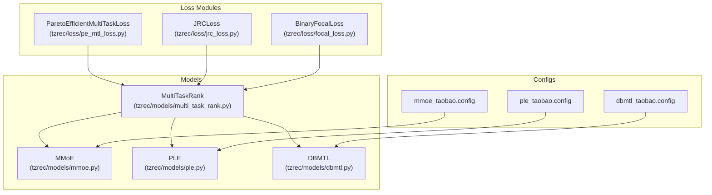
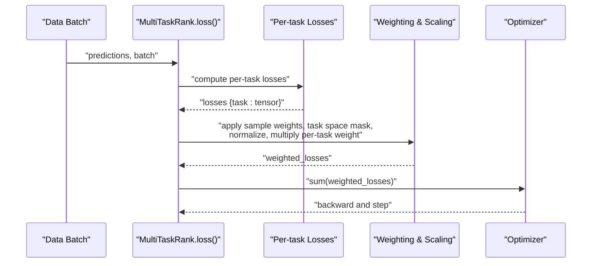
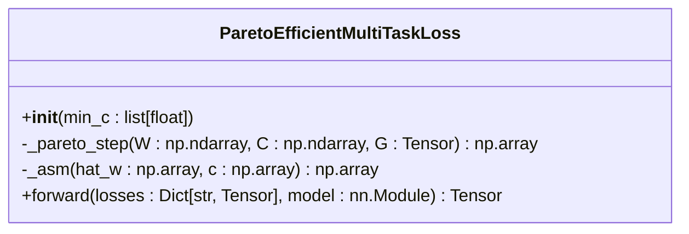
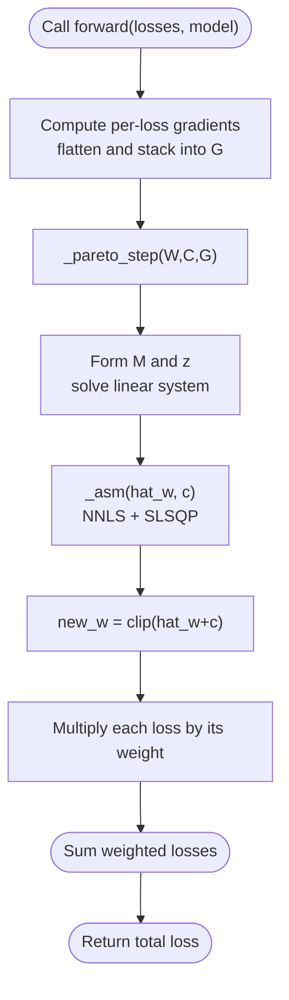
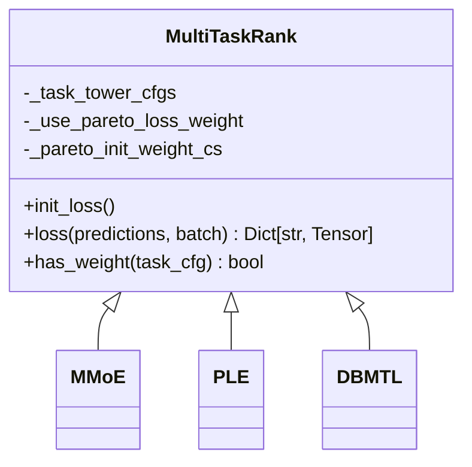
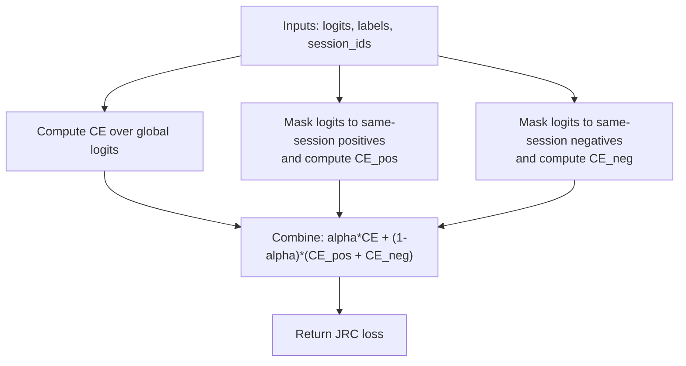
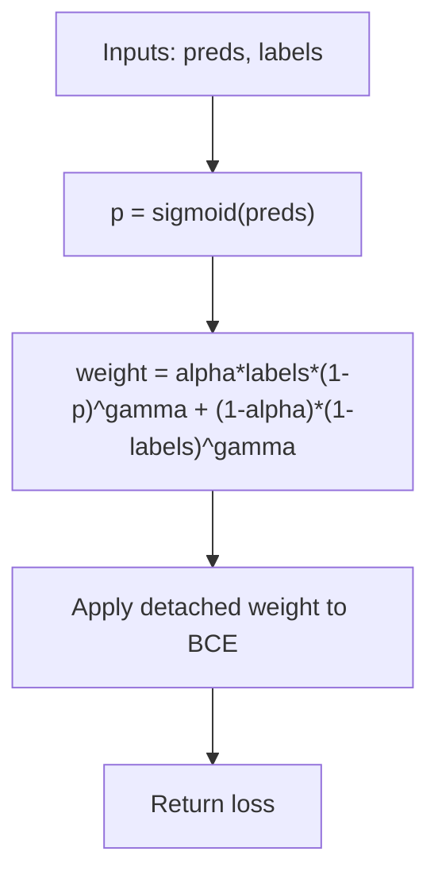
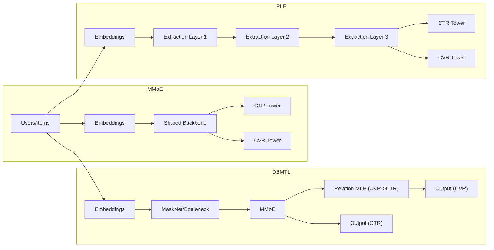
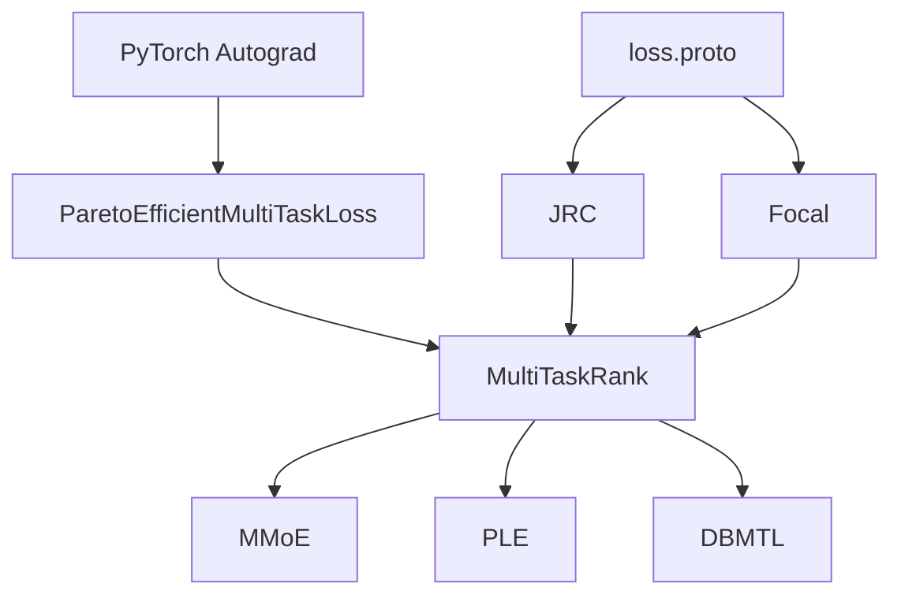

# Multi-Task Loss Management

<cite>
**Referenced Files in This Document**
- [tzrec/loss/pe_mtl_loss.py](file://tzrec/loss/pe_mtl_loss.py)
- [tzrec/loss/jrc_loss.py](file://tzrec/loss/jrc_loss.py)
- [tzrec/loss/focal_loss.py](file://tzrec/loss/focal_loss.py)
- [tzrec/models/multi_task_rank.py](file://tzrec/models/multi_task_rank.py)
- [tzrec/models/mmoe.py](file://tzrec/models/mmoe.py)
- [tzrec/models/ple.py](file://tzrec/models/ple.py)
- [tzrec/models/dbmtl.py](file://tzrec/models/dbmtl.py)
- [tzrec/protos/loss.proto](file://tzrec/protos/loss.proto)
- [examples/mmoe_taobao.config](file://examples/mmoe_taobao.config)
- [examples/dbmtl_taobao.config](file://examples/dbmtl_taobao.config)
- [examples/ple_taobao.config](file://examples/ple_taobao.config)
</cite>

## Table of Contents

1. [Introduction](#introduction)
1. [Project Structure](#project-structure)
1. [Core Components](#core-components)
1. [Architecture Overview](#architecture-overview)
1. [Detailed Component Analysis](#detailed-component-analysis)
1. [Dependency Analysis](#dependency-analysis)
1. [Performance Considerations](#performance-considerations)
1. [Troubleshooting Guide](#troubleshooting-guide)
1. [Conclusion](#conclusion)
1. [Appendices](#appendices)

## Introduction

This document explains multi-task loss management and optimization strategies in TorchEasyRec. It focuses on:

- Pareto-efficient multi-task loss weighting for conflicting objectives
- Gradient balancing and dynamic loss scaling
- Sample weight integration and task space indicators for selective training
- Practical multi-task configurations (CTR+CTCVR, watch_time+conversion, revenue+retention)
- Monitoring and troubleshooting multi-objective training

It synthesizes the Pareto-efficient loss weighting implementation, the multi-task model framework, and representative configuration examples to guide selection of strategies aligned with task relationships and business goals.

## Project Structure

The multi-task loss stack spans three layers:

- Loss modules: Pareto-efficient weighting, JRC, and focal loss
- Multi-task model framework: shared backbone with task towers and loss composition
- Configurations: task towers, per-task weights, and optional task space indicators

**Diagram sources**

- \[tzrec/loss/pe_mtl_loss.py\](file://tzrec/loss/pe_mtl_loss.py#L18-L111)
- \[tzrec/loss/jrc_loss.py\](file://tzrec/loss/jrc_loss.py#L29-L118)
- \[tzrec/loss/focal_loss.py\](file://tzrec/loss/focal_loss.py#L18-L73)
- \[tzrec/models/multi_task_rank.py\](file://tzrec/models/multi_task_rank.py#L25-L221)
- \[tzrec/models/mmoe.py\](file://tzrec/models/mmoe.py#L26-L87)
- \[tzrec/models/ple.py\](file://tzrec/models/ple.py#L27-L110)
- \[tzrec/models/dbmtl.py\](file://tzrec/models/dbmtl.py#L28-L176)
- \[examples/mmoe_taobao.config\](file://examples/mmoe_taobao.config#L159-L216)
- \[examples/dbmtl_taobao.config\](file://examples/dbmtl_taobao.config#L159-L224)
- \[examples/ple_taobao.config\](file://examples/ple_taobao.config#L159-L246)

**Section sources**

- \[tzrec/loss/pe_mtl_loss.py\](file://tzrec/loss/pe_mtl_loss.py#L18-L111)
- \[tzrec/models/multi_task_rank.py\](file://tzrec/models/multi_task_rank.py#L25-L221)
- \[examples/mmoe_taobao.config\](file://examples/mmoe_taobao.config#L159-L216)
- \[examples/dbmtl_taobao.config\](file://examples/dbmtl_taobao.config#L159-L224)
- \[examples/ple_taobao.config\](file://examples/ple_taobao.config#L159-L246)

## Core Components

- Pareto-efficient multi-task loss weighting: dynamically adjusts task weights based on gradient geometry to move toward the Pareto front.
- Multi-task model framework: constructs task-specific towers, composes per-task losses, and supports per-task weights, sample weights, and task space indicators.
- Loss primitives: binary cross-entropy, softmax cross-entropy, L2 loss, JRC (session-aware), and binary focal loss.

Key capabilities:

- Dynamic loss scaling via per-task weights and normalization
- Task space indicator masking for selective training
- Optional sample weights for importance weighting
- Joint loss composition across tasks

**Section sources**

- \[tzrec/loss/pe_mtl_loss.py\](file://tzrec/loss/pe_mtl_loss.py#L18-L111)
- \[tzrec/models/multi_task_rank.py\](file://tzrec/models/multi_task_rank.py#L97-L142)
- \[tzrec/loss/jrc_loss.py\](file://tzrec/loss/jrc_loss.py#L29-L118)
- \[tzrec/loss/focal_loss.py\](file://tzrec/loss/focal_loss.py#L18-L73)
- \[tzrec/protos/loss.proto\](file://tzrec/protos/loss.proto#L4-L32)

## Architecture Overview

The multi-task training pipeline integrates model outputs, per-task losses, and optional weighting mechanisms.

**Diagram sources**

- \[tzrec/models/multi_task_rank.py\](file://tzrec/models/multi_task_rank.py#L97-L142)

## Detailed Component Analysis

### Pareto-Efficient Multi-Task Loss Weighting

This module computes dynamic task weights by solving a constrained optimization problem over recent gradient norms and directions, aiming to move toward the Pareto-efficient frontier.

Implementation highlights:

- Builds per-loss gradients w.r.t. trainable parameters
- Constructs Gram matrix GG^T from stacked flattened gradients
- Solves a quadratic program with equality and bound constraints
- Projects onto non-negative orthant and normalizes weights
- Applies weights to per-task losses and sums them

**Diagram sources**

- \[tzrec/loss/pe_mtl_loss.py\](file://tzrec/loss/pe_mtl_loss.py#L30-L75)
- \[tzrec/loss/pe_mtl_loss.py\](file://tzrec/loss/pe_mtl_loss.py#L77-L111)

Practical guidance:

- Suitable for tasks with strong conflict (non-commensurate scales)
- Requires frequent gradient computation; consider frequency tuning
- Initialize min_c small but non-zero to bias toward less dominant tasks

**Section sources**

- \[tzrec/loss/pe_mtl_loss.py\](file://tzrec/loss/pe_mtl_loss.py#L18-L111)

### Multi-Task Model Framework and Loss Composition

The framework supports:

- Per-task weights, optional sample weights, and task space indicators
- Normalization of per-sample weights
- Loss reduction modes: none (for per-sample weighting) vs mean
- Metrics and loss metrics per task

Key logic:

- Reduction mode set to "none" when any weighting is used to enable per-sample tensors
- Sample weights are normalized by their mean
- Task space indicator multiplies weights inside/outside the task region
- Losses are collected and returned as a dictionary keyed by task/loss names

**Diagram sources**

- \[tzrec/models/multi_task_rank.py\](file://tzrec/models/multi_task_rank.py#L25-L221)
- \[tzrec/models/mmoe.py\](file://tzrec/models/mmoe.py#L26-L87)
- \[tzrec/models/ple.py\](file://tzrec/models/ple.py#L27-L110)
- \[tzrec/models/dbmtl.py\](file://tzrec/models/dbmtl.py#L28-L176)

**Section sources**

- \[tzrec/models/multi_task_rank.py\](file://tzrec/models/multi_task_rank.py#L67-L142)

### Session-Aware Ranking Calibration (JRC)

JRC adjusts cross-entropy by decomposing positive and negative contributions within sessions, encouraging intra-session positive competition.

**Diagram sources**

- \[tzrec/loss/jrc_loss.py\](file://tzrec/loss/jrc_loss.py#L51-L117)

**Section sources**

- \[tzrec/loss/jrc_loss.py\](file://tzrec/loss/jrc_loss.py#L29-L118)

### Binary Focal Loss

Focal loss reduces emphasis on easy examples by down-weighting by a modulating factor based on prediction confidence.

**Diagram sources**

- \[tzrec/loss/focal_loss.py\](file://tzrec/loss/focal_loss.py#L46-L72)

**Section sources**

- \[tzrec/loss/focal_loss.py\](file://tzrec/loss/focal_loss.py#L18-L73)

### Representative Multi-Task Configurations

- CTR + CTCVR (MMoE): two task towers sharing experts; suitable for disjoint objectives (ranking vs conversion)
- CTR + CVR with relations (DBMTL): task tower for CVR conditioned on CTR representation
- CTR + CVR (PLE): hierarchical extraction networks with shared and task-specific experts

**Diagram sources**

- \[examples/mmoe_taobao.config\](file://examples/mmoe_taobao.config#L180-L213)
- \[examples/dbmtl_taobao.config\](file://examples/dbmtl_taobao.config#L180-L222)
- \[examples/ple_taobao.config\](file://examples/ple_taobao.config#L180-L243)

**Section sources**

- \[examples/mmoe_taobao.config\](file://examples/mmoe_taobao.config#L159-L216)
- \[examples/dbmtl_taobao.config\](file://examples/dbmtl_taobao.config#L159-L224)
- \[examples/ple_taobao.config\](file://examples/ple_taobao.config#L159-L246)

## Dependency Analysis

- Loss modules depend on PyTorch autograd to compute per-loss gradients
- Multi-task models depend on the loss modules and configuration-driven task towers
- Protobuf definitions specify supported loss types and parameters

**Diagram sources**

- \[tzrec/loss/pe_mtl_loss.py\](file://tzrec/loss/pe_mtl_loss.py#L84-L101)
- \[tzrec/models/multi_task_rank.py\](file://tzrec/models/multi_task_rank.py#L97-L142)
- \[tzrec/loss/jrc_loss.py\](file://tzrec/loss/jrc_loss.py#L29-L49)
- \[tzrec/loss/focal_loss.py\](file://tzrec/loss/focal_loss.py#L18-L38)
- \[tzrec/protos/loss.proto\](file://tzrec/protos/loss.proto#L4-L32)

**Section sources**

- \[tzrec/loss/pe_mtl_loss.py\](file://tzrec/loss/pe_mtl_loss.py#L84-L101)
- \[tzrec/models/multi_task_rank.py\](file://tzrec/models/multi_task_rank.py#L97-L142)
- \[tzrec/protos/loss.proto\](file://tzrec/protos/loss.proto#L4-L32)

## Performance Considerations

- Pareto weighting:
  - Computationally heavier due to gradient-based optimization; consider reducing frequency or using approximate updates
  - Small min_c biases towards under-represented tasks; tune based on observed loss scales
- Weight normalization:
  - Mean-normalization of sample weights stabilizes per-sample variance
- Task space indicators:
  - Multiplicative masks reduce effective batch participation; ensure sufficient samples remain in-task
- Model families:
  - MMoE: good for competing objectives; gating may require careful initialization
  - PLE: deeper extraction improves disentanglement; monitor overfitting
  - DBMTL: explicit relations can improve downstream tasks; ensure relation MLP sizes are justified

[No sources needed since this section provides general guidance]

## Troubleshooting Guide

Common issues and remedies:

- Loss explosion or NaN:
  - Verify per-sample weights are finite and normalized
  - Check task space indicator masks do not zero out entire batches
  - Reduce learning rate or enable gradient clipping
- Poor convergence or oscillation:
  - Switch from Pareto weighting to static per-task weights for stability
  - Normalize targets or adjust label smoothing for softmax cross-entropy
- Under-performance on secondary task:
  - Increase task weight or enable Pareto weighting with small min_c
  - Consider adding a relation MLP (DBMTL) or deeper extraction (PLE)
- Imbalanced sessions (JRC):
  - Adjust alpha to emphasize intra-session contrast
  - Ensure session ids are consistent across the batch

**Section sources**

- \[tzrec/models/multi_task_rank.py\](file://tzrec/models/multi_task_rank.py#L105-L127)
- \[tzrec/loss/jrc_loss.py\](file://tzrec/loss/jrc_loss.py#L41-L48)

## Conclusion

TorchEasyRec provides a flexible, modular stack for multi-task learning:

- Dynamic Pareto weighting balances conflicting objectives by leveraging gradient geometry
- The multi-task framework enables per-task weights, sample weights, and task space indicators
- Representative architectures (MMoE, PLE, DBMTL) support diverse task relationships
  Adopt Pareto weighting for strong conflicts, static weights for stability, and relation-aware designs when tasks are dependent. Monitor task-wise metrics and adjust weights and architectures iteratively.

[No sources needed since this section summarizes without analyzing specific files]

## Appendices

### Mathematical Foundations and Strategies

- Weighted sum: simplest, requires prior knowledge of task scales
- Gradient surgery: aligns gradients to reduce interference; sensitive to gradient magnitudes
- Adaptive weighting (Pareto): moves toward Pareto frontier without manual scale tuning
- Task space indicators: mask training to relevant regions
- Sample weights: importance reweighting with mean normalization
- Dynamic loss scaling: per-batch normalization of weights

[No sources needed since this section provides general guidance]
