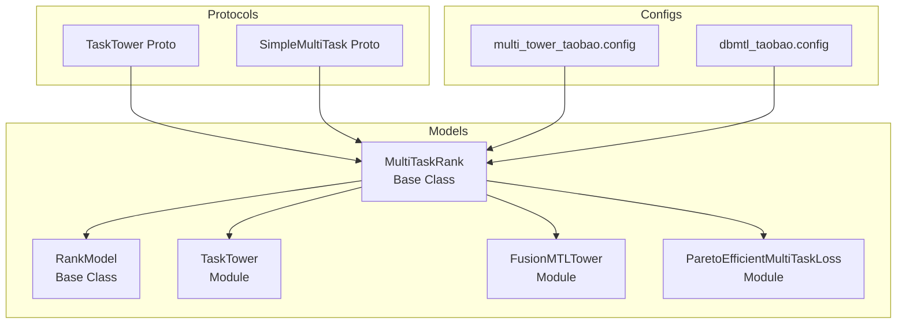
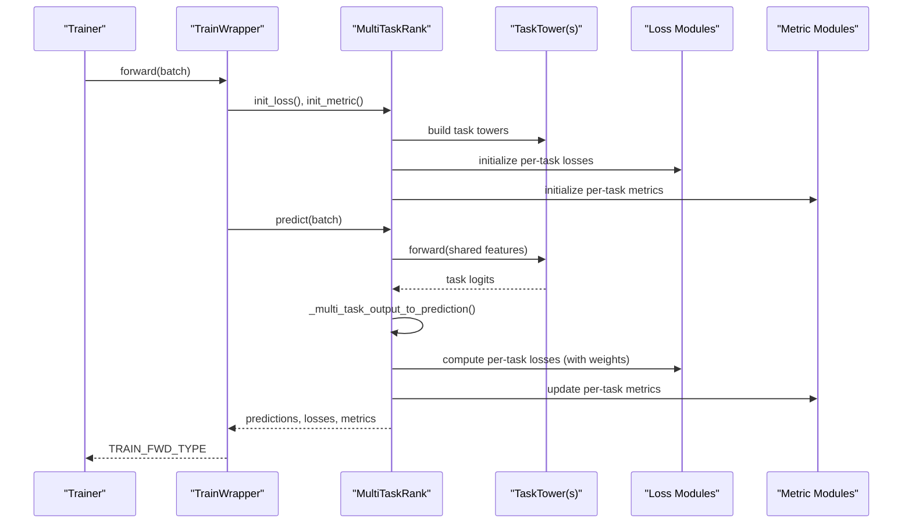
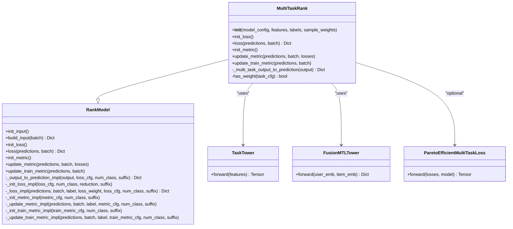
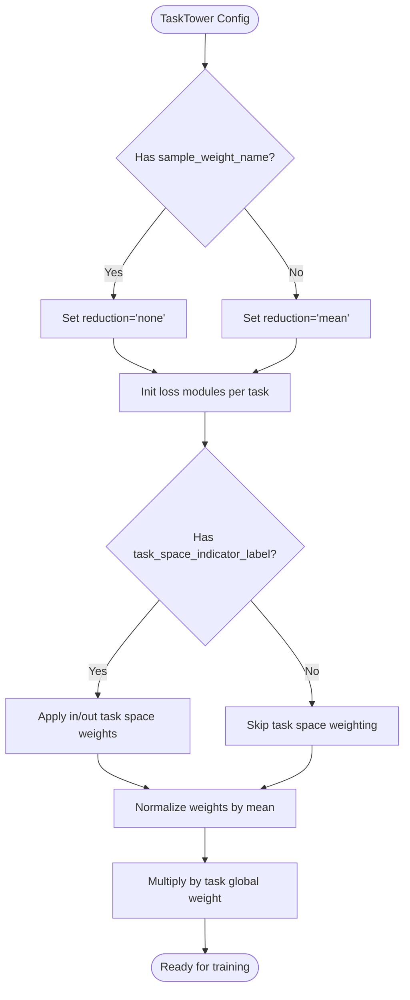
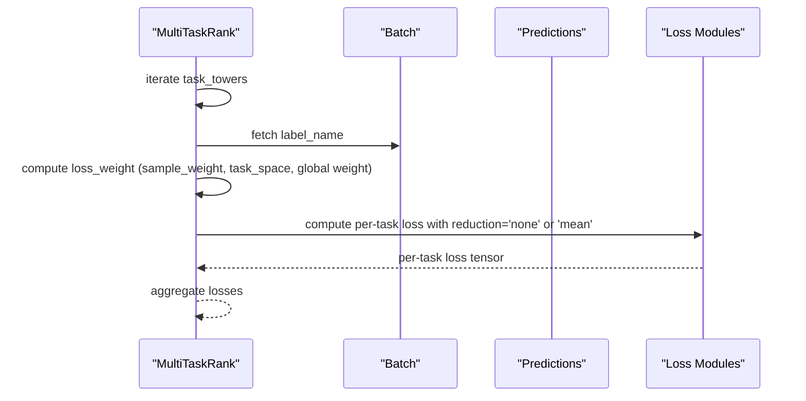
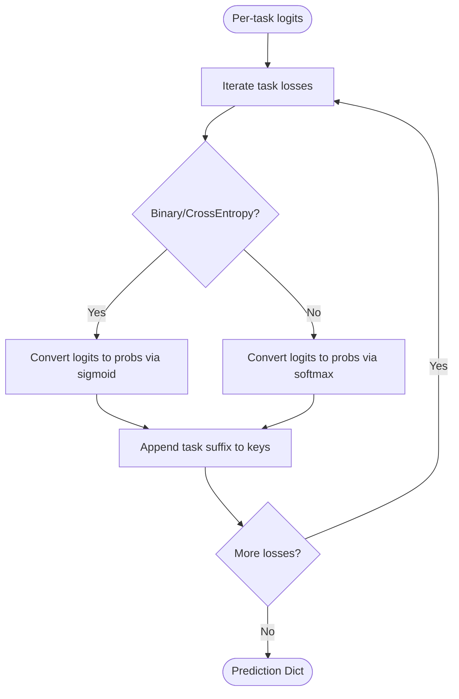
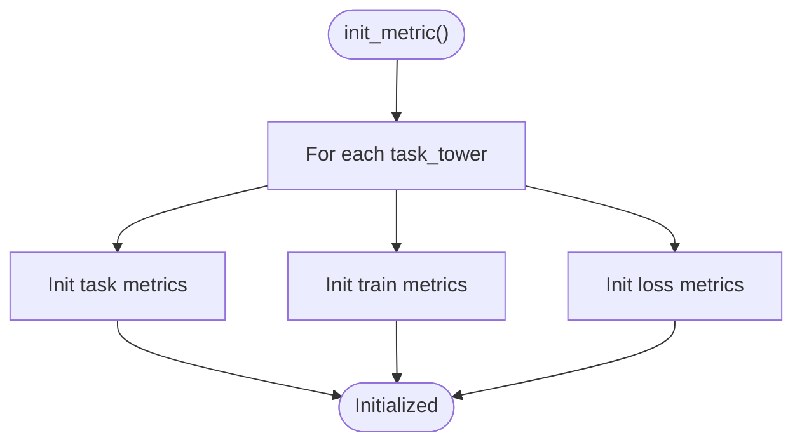
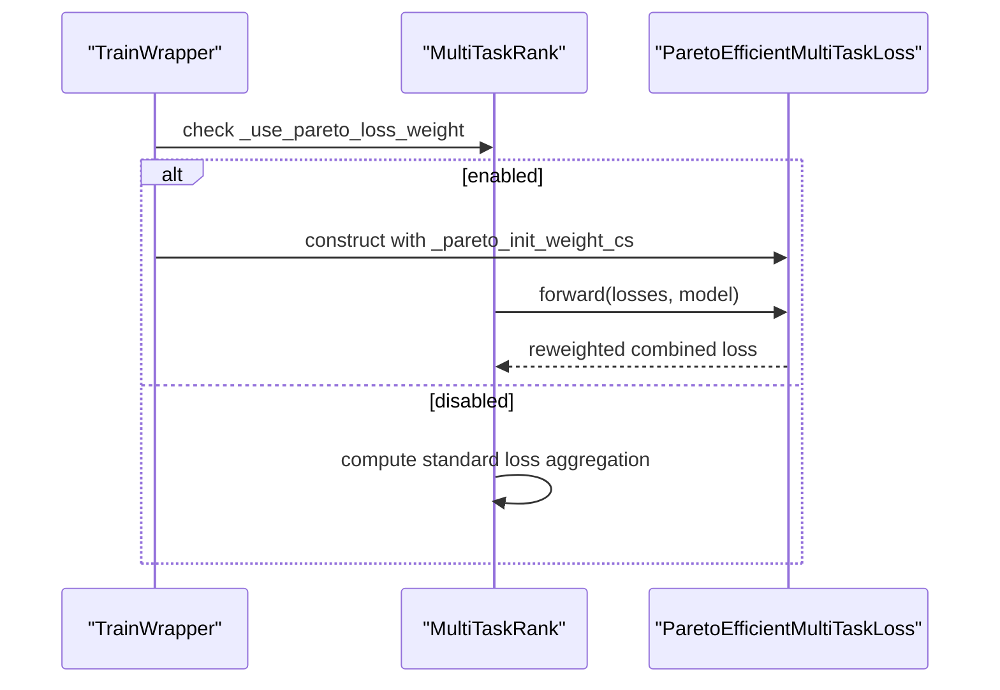
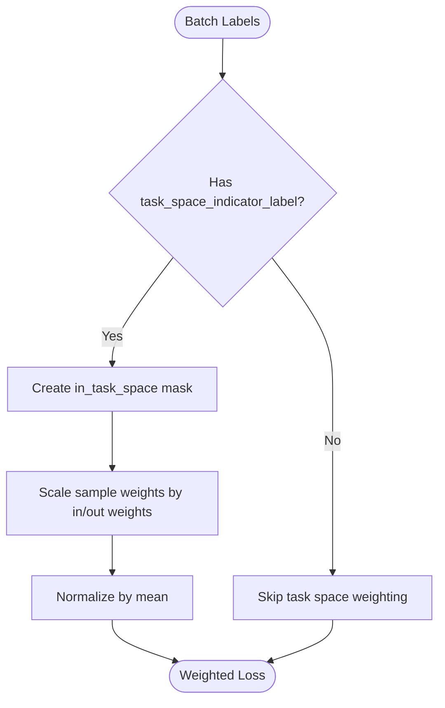
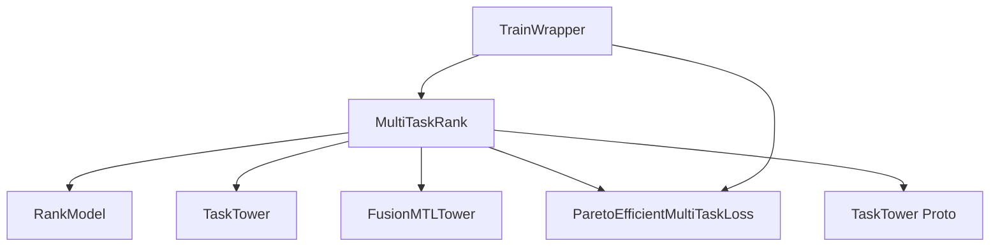

# MultiTaskRank Base Class

<cite>
**Referenced Files in This Document**
- [multi_task_rank.py](file://tzrec/models/multi_task_rank.py)
- [rank_model.py](file://tzrec/models/rank_model.py)
- [task_tower.py](file://tzrec/modules/task_tower.py)
- [pe_mtl_loss.py](file://tzrec/loss/pe_mtl_loss.py)
- [model.py](file://tzrec/models/model.py)
- [multi_task_rank.proto](file://tzrec/protos/models/multi_task_rank.proto)
- [tower_pb2.py](file://tzrec/protos/tower_pb2.py)
- [multi_tower_taobao.config](file://examples/multi_tower_taobao.config)
- [dbmtl_taobao.config](file://examples/dbmtl_taobao.config)
- [multi_task_rank_test.py](file://tzrec/models/multi_task_rank_test.py)
</cite>

## Table of Contents

1. [Introduction](#introduction)
1. [Project Structure](#project-structure)
1. [Core Components](#core-components)
1. [Architecture Overview](#architecture-overview)
1. [Detailed Component Analysis](#detailed-component-analysis)
1. [Dependency Analysis](#dependency-analysis)
1. [Performance Considerations](#performance-considerations)
1. [Troubleshooting Guide](#troubleshooting-guide)
1. [Conclusion](#conclusion)
1. [Appendices](#appendices)

## Introduction

This document provides a comprehensive technical guide to the MultiTaskRank base class implementation in TorchEasyRec. It explains the architectural foundation enabling multi-task learning, including the task tower configuration system, loss computation across multiple objectives, and metric management for joint optimization. It covers initialization of task towers, prediction output mapping for multiple tasks, loss weighting mechanisms (including Pareto-efficient loss weighting), task space indicators for selective training, sample weight integration, and the unified interface for multi-task model development. Practical examples demonstrate task tower configuration, loss combination strategies, and evaluation approaches for multi-objective recommendation scenarios.

## Project Structure

The MultiTaskRank base class sits within the model layer and orchestrates multi-task learning across task towers. It builds upon the RankModel base class and integrates with task towers, loss modules, and metric modules. The configuration schema for task towers is defined in protocol buffers, and example configurations illustrate real-world usage.

**Diagram sources**

- \[multi_task_rank.py\](file://tzrec/models/multi_task_rank.py#L25-L221)
- \[rank_model.py\](file://tzrec/models/rank_model.py#L56-L513)
- \[task_tower.py\](file://tzrec/modules/task_tower.py#L21-L94)
- \[pe_mtl_loss.py\](file://tzrec/loss/pe_mtl_loss.py#L18-L110)
- \[multi_task_rank.proto\](file://tzrec/protos/models/multi_task_rank.proto#L7-L57)
- \[multi_tower_taobao.config\](file://examples/multi_tower_taobao.config#L158-L200)
- \[dbmtl_taobao.config\](file://examples/dbmtl_taobao.config#L159-L200)

**Section sources**

- \[multi_task_rank.py\](file://tzrec/models/multi_task_rank.py#L25-L221)
- \[rank_model.py\](file://tzrec/models/rank_model.py#L56-L513)
- \[task_tower.py\](file://tzrec/modules/task_tower.py#L21-L94)
- \[pe_mtl_loss.py\](file://tzrec/loss/pe_mtl_loss.py#L18-L110)
- \[multi_task_rank.proto\](file://tzrec/protos/models/multi_task_rank.proto#L7-L57)
- \[multi_tower_taobao.config\](file://examples/multi_tower_taobao.config#L158-L200)
- \[dbmtl_taobao.config\](file://examples/dbmtl_taobao.config#L159-L200)

## Core Components

- MultiTaskRank: Orchestrates multi-task learning, manages task towers, computes task-specific losses and metrics, and applies sample/task-space weights.
- TaskTower: A modular MLP-based head that produces task-specific logits given shared or separated features.
- FusionMTLTower: A fusion-based tower that combines multiple tasks into a single forward pass.
- ParetoEfficientMultiTaskLoss: Dynamic loss weighting based on Pareto efficiency for multi-task optimization.
- RankModel: Provides shared ranking infrastructure (embedding groups, base loss/metric implementations) used by MultiTaskRank.

Key capabilities:

- Task tower configuration via protocol buffers with metrics, losses, and optional MLP heads.
- Sample weight integration and task space indicator weighting for selective training.
- Unified prediction mapping across multiple tasks.
- Joint metric management for each task and loss metrics.

**Section sources**

- \[multi_task_rank.py\](file://tzrec/models/multi_task_rank.py#L25-L221)
- \[task_tower.py\](file://tzrec/modules/task_tower.py#L21-L94)
- \[pe_mtl_loss.py\](file://tzrec/loss/pe_mtl_loss.py#L18-L110)
- \[rank_model.py\](file://tzrec/models/rank_model.py#L56-L513)

## Architecture Overview

The MultiTaskRank architecture composes a shared backbone (embedding groups and feature processing) with per-task towers. It initializes loss and metric modules per task, computes weighted losses, and updates metrics accordingly. Optional Pareto-efficient loss weighting dynamically adjusts task weights based on gradient norms.

**Diagram sources**

- \[model.py\](file://tzrec/models/model.py#L222-L259)
- \[multi_task_rank.py\](file://tzrec/models/multi_task_rank.py#L80-L221)
- \[task_tower.py\](file://tzrec/modules/task_tower.py#L21-L52)

**Section sources**

- \[model.py\](file://tzrec/models/model.py#L222-L259)
- \[multi_task_rank.py\](file://tzrec/models/multi_task_rank.py#L80-L221)

## Detailed Component Analysis

### MultiTaskRank Base Class

Responsibilities:

- Initialize task towers from model configuration.
- Build per-task loss modules with appropriate reduction modes.
- Compute weighted losses per task, integrating sample weights and task space indicators.
- Map task tower outputs to predictions for each loss type.
- Initialize and update per-task metrics and loss metrics.
- Optionally enable Pareto-efficient loss weighting.

Key methods and behaviors:

- Initialization: stores task tower configurations and sets up Pareto flag.
- Prediction mapping: converts per-task logits to probabilities/logits depending on loss type.
- Weighted loss computation: supports sample weights, task-space indicators, and global task weights.
- Metric management: initializes and updates both evaluation and training metrics per task.

**Diagram sources**

- \[multi_task_rank.py\](file://tzrec/models/multi_task_rank.py#L25-L221)
- \[rank_model.py\](file://tzrec/models/rank_model.py#L56-L513)
- \[task_tower.py\](file://tzrec/modules/task_tower.py#L21-L94)
- \[pe_mtl_loss.py\](file://tzrec/loss/pe_mtl_loss.py#L18-L110)

**Section sources**

- \[multi_task_rank.py\](file://tzrec/models/multi_task_rank.py#L25-L221)
- \[rank_model.py\](file://tzrec/models/rank_model.py#L56-L513)

### Task Tower Configuration System

Task towers are configured via protocol buffers and define:

- tower_name: Unique identifier for the task.
- label_name: Corresponding label field name.
- num_class: Number of classes for classification tasks.
- mlp: Optional MLP head for the task tower.
- metrics and train_metrics: Evaluation and training metrics per task.
- losses: Loss configurations per task.
- weight: Global task weight multiplier.
- sample_weight_name: Column name for per-sample weights.
- task_space_indicator_label: Label indicating whether a sample belongs to the task space.
- in_task_space_weight/out_task_space_weight: Per-sample weight scaling for in/out task space.
- pareto_min_loss_weight: Minimum loss weight for Pareto-efficient weighting.

**Diagram sources**

- \[multi_task_rank.py\](file://tzrec/models/multi_task_rank.py#L80-L142)
- \[tower_pb2.py\](file://tzrec/protos/tower_pb2.py#L34-L78)

**Section sources**

- \[multi_task_rank.py\](file://tzrec/models/multi_task_rank.py#L80-L142)
- \[tower_pb2.py\](file://tzrec/protos/tower_pb2.py#L34-L78)

### Loss Computation Across Multiple Objectives

MultiTaskRank computes per-task losses and aggregates them:

- For each task, it selects the appropriate loss module based on the loss configuration.
- Applies sample weights and task-space indicators when present.
- Normalizes weights by their mean across the batch.
- Multiplies by the task’s global weight.
- Aggregates all task losses into a single dictionary.

**Diagram sources**

- \[multi_task_rank.py\](file://tzrec/models/multi_task_rank.py#L97-L142)
- \[rank_model.py\](file://tzrec/models/rank_model.py#L220-L284)

**Section sources**

- \[multi_task_rank.py\](file://tzrec/models/multi_task_rank.py#L97-L142)
- \[rank_model.py\](file://tzrec/models/rank_model.py#L220-L284)

### Prediction Output Mapping for Multiple Tasks

After computing task tower outputs, MultiTaskRank maps them to predictions:

- For each task, it iterates through the task’s loss configurations.
- Converts logits to probabilities/logits according to the loss type.
- Appends task-specific suffixes to prediction keys for uniqueness.

**Diagram sources**

- \[multi_task_rank.py\](file://tzrec/models/multi_task_rank.py#L50-L65)
- \[rank_model.py\](file://tzrec/models/rank_model.py#L134-L180)

**Section sources**

- \[multi_task_rank.py\](file://tzrec/models/multi_task_rank.py#L50-L65)
- \[rank_model.py\](file://tzrec/models/rank_model.py#L134-L180)

### Metric Management for Joint Optimization

MultiTaskRank initializes and updates:

- Evaluation metrics per task (e.g., AUC, grouped AUC).
- Training metrics per task (e.g., decayed AUC).
- Loss metrics derived from computed losses.

**Diagram sources**

- \[multi_task_rank.py\](file://tzrec/models/multi_task_rank.py#L144-L162)
- \[rank_model.py\](file://tzrec/models/rank_model.py#L358-L466)

**Section sources**

- \[multi_task_rank.py\](file://tzrec/models/multi_task_rank.py#L144-L162)
- \[rank_model.py\](file://tzrec/models/rank_model.py#L358-L466)

### Pareto-Efficient Loss Weighting

When enabled, MultiTaskRank collects per-task minimum loss weights and delegates dynamic weighting to ParetoEfficientMultiTaskLoss during training. The wrapper constructs the Pareto module if configured.

**Diagram sources**

- \[model.py\](file://tzrec/models/model.py#L249-L256)
- \[multi_task_rank.py\](file://tzrec/models/multi_task_rank.py#L46-L95)
- \[pe_mtl_loss.py\](file://tzrec/loss/pe_mtl_loss.py#L18-L110)

**Section sources**

- \[model.py\](file://tzrec/models/model.py#L249-L256)
- \[multi_task_rank.py\](file://tzrec/models/multi_task_rank.py#L46-L95)
- \[pe_mtl_loss.py\](file://tzrec/loss/pe_mtl_loss.py#L18-L110)

### Task Space Indicator Functionality

Task space indicators allow selective training within a specific task’s valid samples:

- task_space_indicator_label: Binary indicator column.
- in_task_space_weight/out_task_space_weight: Per-sample multiplicative weights for in/out task space.
- Normalization ensures weights are balanced across the batch.

**Diagram sources**

- \[multi_task_rank.py\](file://tzrec/models/multi_task_rank.py#L114-L127)

**Section sources**

- \[multi_task_rank.py\](file://tzrec/models/multi_task_rank.py#L114-L127)

### Sample Weight Integration

Sample weights can be provided per task:

- sample_weight_name: Column name for per-sample weights.
- Weights are normalized by their mean across the batch before application.
- Combined with task-space indicators and global task weights.

**Section sources**

- \[multi_task_rank.py\](file://tzrec/models/multi_task_rank.py#L106-L127)

### Unified Interface for Multi-Task Model Development

MultiTaskRank provides a unified interface:

- Task tower configuration via protocol buffers.
- Shared embedding and feature processing from RankModel.
- Consistent loss and metric initialization/update across tasks.
- Optional Pareto-efficient weighting for robust multi-task optimization.

**Section sources**

- \[multi_task_rank.py\](file://tzrec/models/multi_task_rank.py#L25-L221)
- \[rank_model.py\](file://tzrec/models/rank_model.py#L56-L513)

## Dependency Analysis

The following diagram shows key dependencies among components:

**Diagram sources**

- \[multi_task_rank.py\](file://tzrec/models/multi_task_rank.py#L25-L221)
- \[rank_model.py\](file://tzrec/models/rank_model.py#L56-L513)
- \[task_tower.py\](file://tzrec/modules/task_tower.py#L21-L94)
- \[pe_mtl_loss.py\](file://tzrec/loss/pe_mtl_loss.py#L18-L110)
- \[model.py\](file://tzrec/models/model.py#L222-L259)

**Section sources**

- \[multi_task_rank.py\](file://tzrec/models/multi_task_rank.py#L25-L221)
- \[model.py\](file://tzrec/models/model.py#L222-L259)

## Performance Considerations

- Use reduction='none' for per-task losses when applying sample/task-space weights to avoid premature reduction.
- Normalize weights by mean to stabilize training dynamics.
- Prefer task-specific MLP heads only when necessary to reduce computational overhead.
- Enable Pareto-efficient weighting when tasks exhibit conflicting gradients or varying scales.

[No sources needed since this section provides general guidance]

## Troubleshooting Guide

Common issues and resolutions:

- Incorrect num_class for loss type: Ensure num_class matches the loss type (e.g., binary cross-entropy requires num_class=1).
- Missing label_name or sample_weight_name: Verify task tower configuration and batch data.
- Task space weights not applied: Confirm task_space_indicator_label and in/out weights are set appropriately.
- Pareto weighting not active: Ensure use_pareto_loss_weight is enabled and per-task pareto_min_loss_weight values are valid.

**Section sources**

- \[multi_task_rank.py\](file://tzrec/models/multi_task_rank.py#L134-L168)
- \[rank_model.py\](file://tzrec/models/rank_model.py#L148-L168)

## Conclusion

The MultiTaskRank base class provides a robust, extensible foundation for multi-task learning in TorchEasyRec. It unifies task tower configuration, loss computation, and metric management while supporting advanced features like sample-weighted training, task-space selection, and Pareto-efficient loss weighting. Together with the TaskTower and FusionMTLTower modules, it enables flexible architectures for multi-objective recommendation scenarios.

[No sources needed since this section summarizes without analyzing specific files]

## Appendices

### Practical Examples

- Example configuration for multi-tower models:

  - \[multi_tower_taobao.config\](file://examples/multi_tower_taobao.config#L158-L200)
  - \[dbmtl_taobao.config\](file://examples/dbmtl_taobao.config#L159-L200)

- Protocol buffer definitions for task towers:

  - \[multi_task_rank.proto\](file://tzrec/protos/models/multi_task_rank.proto#L7-L57)
  - \[tower_pb2.py\](file://tzrec/protos/tower_pb2.py#L34-L78)

- Unit tests demonstrating usage:

  - \[multi_task_rank_test.py\](file://tzrec/models/multi_task_rank_test.py#L30-L82)

**Section sources**

- \[multi_tower_taobao.config\](file://examples/multi_tower_taobao.config#L158-L200)
- \[dbmtl_taobao.config\](file://examples/dbmtl_taobao.config#L159-L200)
- \[multi_task_rank.proto\](file://tzrec/protos/models/multi_task_rank.proto#L7-L57)
- \[tower_pb2.py\](file://tzrec/protos/tower_pb2.py#L34-L78)
- \[multi_task_rank_test.py\](file://tzrec/models/multi_task_rank_test.py#L30-L82)
