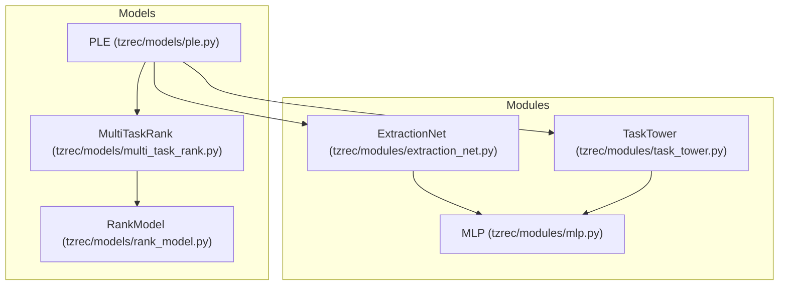
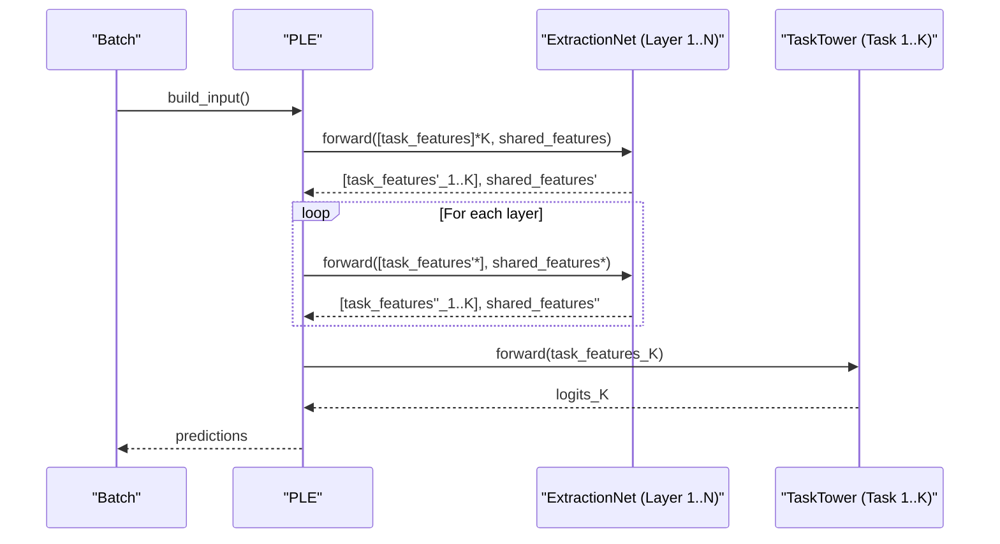
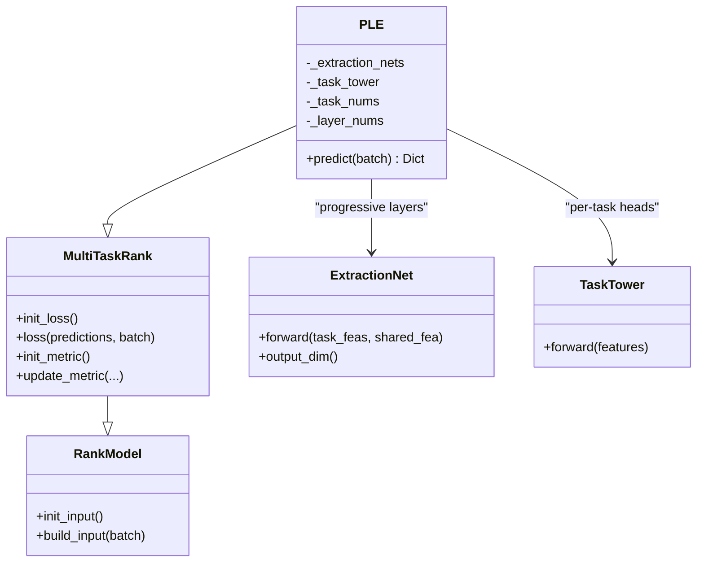
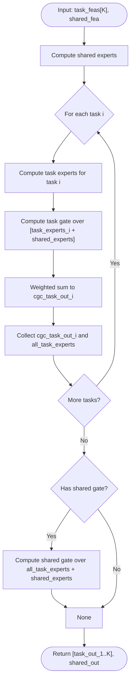
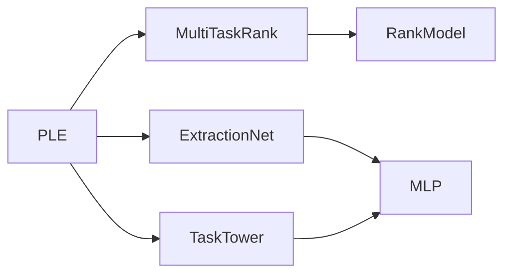

# PLE Model (Progressive Layered Extraction)

<cite>
**Referenced Files in This Document**
- [ple.py](file://tzrec/models/ple.py)
- [extraction_net.py](file://tzrec/modules/extraction_net.py)
- [task_tower.py](file://tzrec/modules/task_tower.py)
- [multi_task_rank.py](file://tzrec/models/multi_task_rank.py)
- [rank_model.py](file://tzrec/models/rank_model.py)
- [mlp.py](file://tzrec/modules/mlp.py)
- [ple.md](file://docs/source/models/ple.md)
- [ple_taobao.config](file://examples/ple_taobao.config)
- [ple_test.py](file://tzrec/models/ple_test.py)
</cite>

## Table of Contents

1. [Introduction](#introduction)
1. [Project Structure](#project-structure)
1. [Core Components](#core-components)
1. [Architecture Overview](#architecture-overview)
1. [Detailed Component Analysis](#detailed-component-analysis)
1. [Dependency Analysis](#dependency-analysis)
1. [Performance Considerations](#performance-considerations)
1. [Troubleshooting Guide](#troubleshooting-guide)
1. [Conclusion](#conclusion)
1. [Appendices](#appendices)

## Introduction

This document explains the Progressive Layered Extraction (PLE) model implementation in TorchEasyRec. PLE progressively extracts features across multiple layers, enabling hierarchical task specialization while preserving shared representation learning. It introduces a progressive expansion mechanism that grows task-specific feature capacity across layers, and a layer-wise gating strategy that routes signals to both task-specific experts and shared experts. The model comprises:

- Shared and exclusive layers organized into progressive extraction networks
- A progressive routing mechanism allowing tasks to access both shared and task-specific features
- Layer-wise expert allocation strategies controlled by configuration parameters
- Practical examples for multi-task learning scenarios and performance optimization tips

## Project Structure

The PLE implementation is composed of several modules:

- Model definition and orchestration: PLE class
- Multi-task base: MultiTaskRank and RankModel
- Feature extraction: ExtractionNet (MoE-style experts and gates)
- Task-specific heads: TaskTower
- Shared building blocks: MLP

**Diagram sources**

- \[ple.py\](file://tzrec/models/ple.py#L27-L110)
- \[multi_task_rank.py\](file://tzrec/models/multi_task_rank.py#L25-L221)
- \[rank_model.py\](file://tzrec/models/rank_model.py#L56-L513)
- \[extraction_net.py\](file://tzrec/modules/extraction_net.py#L20-L140)
- \[task_tower.py\](file://tzrec/modules/task_tower.py#L21-L94)
- \[mlp.py\](file://tzrec/modules/mlp.py#L86-L178)

**Section sources**

- \[ple.py\](file://tzrec/models/ple.py#L27-L110)
- \[multi_task_rank.py\](file://tzrec/models/multi_task_rank.py#L25-L221)
- \[rank_model.py\](file://tzrec/models/rank_model.py#L56-L513)
- \[extraction_net.py\](file://tzrec/modules/extraction_net.py#L20-L140)
- \[task_tower.py\](file://tzrec/modules/task_tower.py#L21-L94)
- \[mlp.py\](file://tzrec/modules/mlp.py#L86-L178)

## Core Components

- PLE: orchestrates progressive extraction across layers, manages task towers, and performs prediction.
- ExtractionNet: implements MoE-style experts and gates per task plus shared experts, with progressive gating between layers.
- TaskTower: applies optional MLP head and projects to task-specific logits.
- MultiTaskRank and RankModel: provide multi-task scaffolding, input embedding, loss/metric initialization, and prediction conversion.

Key configuration parameters:

- num_layers: number of progressive extraction networks
- num_experts: controls expert_num_per_task and share_num per layer
- task_towers: defines per-task heads and losses/metrics
- progressive expansion patterns: controlled by expert_num_per_task and share_num increasing across layers

**Section sources**

- \[ple.py\](file://tzrec/models/ple.py#L27-L110)
- \[extraction_net.py\](file://tzrec/modules/extraction_net.py#L20-L140)
- \[task_tower.py\](file://tzrec/modules/task_tower.py#L21-L94)
- \[multi_task_rank.py\](file://tzrec/models/multi_task_rank.py#L25-L221)
- \[rank_model.py\](file://tzrec/models/rank_model.py#L56-L513)

## Architecture Overview

The PLE architecture consists of:

- Shared and exclusive feature pathways that grow progressively across layers
- Layer-wise gating that mixes task-specific experts and shared experts
- Final task towers that consume per-task features

**Diagram sources**

- \[ple.py\](file://tzrec/models/ple.py#L87-L110)
- \[extraction_net.py\](file://tzrec/modules/extraction_net.py#L111-L140)
- \[task_tower.py\](file://tzrec/modules/task_tower.py#L45-L52)

## Detailed Component Analysis

### PLE Class

- Initializes multi-task scaffolding and validates PLE configuration.
- Builds progressive extraction networks from configuration, computing output dimensions across layers.
- Constructs task towers for each task with optional MLP heads.
- Implements predict() that feeds embeddings through progressive extraction networks and produces task predictions.

**Diagram sources**

- \[ple.py\](file://tzrec/models/ple.py#L27-L110)
- \[multi_task_rank.py\](file://tzrec/models/multi_task_rank.py#L25-L221)
- \[rank_model.py\](file://tzrec/models/rank_model.py#L56-L513)
- \[extraction_net.py\](file://tzrec/modules/extraction_net.py#L20-L140)
- \[task_tower.py\](file://tzrec/modules/task_tower.py#L21-L94)

**Section sources**

- \[ple.py\](file://tzrec/models/ple.py#L27-L110)

### ExtractionNet (Progressive Layered Experts and Gates)

- Maintains:
  - Shared experts: MLP stacks with share_num experts
  - Task-specific experts: per-task MLP stacks with expert_num_per_task experts
  - Task gates: per-task linear layers to compute mixture weights over task experts + shared experts
  - Shared gate: optional linear layer to mix all experts into a shared signal (except final layer)
- Forward:
  - Computes shared experts from shared input
  - For each task: computes task experts from task input, mixes them with shared experts via softmax gating, and collects outputs
  - Optionally mixes all task experts and shared experts into a new shared signal using the shared gate
  - Returns [task_outputs], optional_shared_output

**Diagram sources**

- \[extraction_net.py\](file://tzrec/modules/extraction_net.py#L98-L140)

**Section sources**

- \[extraction_net.py\](file://tzrec/modules/extraction_net.py#L20-L140)

### TaskTower

- Applies optional MLP head to task input, then projects to logits for the task’s number of classes.
- Supports multi-class and binary classification via downstream conversion in MultiTaskRank.

**Section sources**

- \[task_tower.py\](file://tzrec/modules/task_tower.py#L21-L94)

### MultiTaskRank and RankModel

- MultiTaskRank:
  - Provides multi-task scaffolding: loss/metric initialization, prediction conversion, and weighting support (including task-space indicators).
- RankModel:
  - Handles embedding group construction, input building, and prediction conversion for various loss types.

**Section sources**

- \[multi_task_rank.py\](file://tzrec/models/multi_task_rank.py#L25-L221)
- \[rank_model.py\](file://tzrec/models/rank_model.py#L56-L513)

## Dependency Analysis

- PLE depends on:
  - MultiTaskRank for multi-task infrastructure
  - ExtractionNet for progressive expert/gate computation
  - TaskTower for per-task heads
  - MLP for expert and tower MLP components
- ExtractionNet depends on MLP for expert networks and linear layers for gating
- TaskTower depends on MLP for optional head stacking

**Diagram sources**

- \[ple.py\](file://tzrec/models/ple.py#L27-L110)
- \[multi_task_rank.py\](file://tzrec/models/multi_task_rank.py#L25-L221)
- \[rank_model.py\](file://tzrec/models/rank_model.py#L56-L513)
- \[extraction_net.py\](file://tzrec/modules/extraction_net.py#L20-L140)
- \[task_tower.py\](file://tzrec/modules/task_tower.py#L21-L94)
- \[mlp.py\](file://tzrec/modules/mlp.py#L86-L178)

**Section sources**

- \[ple.py\](file://tzrec/models/ple.py#L27-L110)
- \[extraction_net.py\](file://tzrec/modules/extraction_net.py#L20-L140)
- \[task_tower.py\](file://tzrec/modules/task_tower.py#L21-L94)
- \[multi_task_rank.py\](file://tzrec/models/multi_task_rank.py#L25-L221)
- \[rank_model.py\](file://tzrec/models/rank_model.py#L56-L513)
- \[mlp.py\](file://tzrec/modules/mlp.py#L86-L178)

## Performance Considerations

- Progressive expansion: increasing expert_num_per_task and share_num across layers allows deeper task specialization without increasing shared capacity until later layers.
- Gating overhead: softmax over concatenated experts scales with the number of experts; tune expert_num_per_task and share_num to balance capacity and speed.
- MLP stacking: each expert and optional tower MLP adds layers; reduce hidden_units or layers for constrained environments.
- Memory footprint: larger expert sets increase memory usage; consider batch size and device resources.
- Mixed precision training: enable autocast for faster training on supported devices.
- Optimizer choice: Adam often works well for multi-task; adjust learning rates per sparse/dense parameters.

[No sources needed since this section provides general guidance]

## Troubleshooting Guide

Common issues and resolutions:

- Shape mismatches during forward pass:
  - Ensure output_dim() of ExtractionNet aligns with subsequent layers’ input expectations.
  - Verify task_tower input dimensions match the last layer’s task output dimensions.
- Incorrect configuration:
  - expert_num_per_task and share_num must be positive integers.
  - task_towers must match the number of tasks and define appropriate losses/metrics.
- Task-space weighting:
  - task_space_indicator_label and in/out weights require correct batch labels and normalization.
- Embedding dimension mismatch:
  - Confirm feature_groups and embedding_group total dimensions match initial inputs.

**Section sources**

- \[ple.py\](file://tzrec/models/ple.py#L58-L86)
- \[extraction_net.py\](file://tzrec/modules/extraction_net.py#L85-L87)
- \[multi_task_rank.py\](file://tzrec/models/multi_task_rank.py#L67-L142)

## Conclusion

PLE enables progressive, hierarchical multi-task learning by growing task-specific capacity across layers while preserving shared representation learning. Its layer-wise gating strategy mixes task experts and shared experts, reducing negative transfer and seesaw effects. Proper configuration of expert counts and MLP depths allows adaptation to task complexity, while the modular design supports efficient training and deployment.

[No sources needed since this section summarizes without analyzing specific files]

## Appendices

### Configuration Parameters and Patterns

- num_layers: Number of progressive extraction networks; each defines expert_num_per_task and share_num.
- num_experts: Controls expert_num_per_task and share_num per layer; typically increases across layers for progressive expansion.
- task_towers: Defines per-task MLP heads and losses/metrics; supports binary and multi-class tasks.
- Progressive expansion patterns:
  - Increase expert_num_per_task and share_num across layers to deepen task-specific modeling.
  - Keep shared capacity modest initially, then expand shared experts in later layers.

**Section sources**

- \[ple.md\](file://docs/source/models/ple.md#L13-L118)
- \[ple_taobao.config\](file://examples/ple_taobao.config#L159-L246)

### Practical Example Setup

- Use the example configuration to define feature groups, progressive extraction networks, and task towers.
- Adjust expert_num_per_task and share_num per layer to reflect task complexity.
- Configure losses and metrics per task; leverage task-space indicators for specialized training windows.

**Section sources**

- \[ple_taobao.config\](file://examples/ple_taobao.config#L159-L246)
- \[ple_test.py\](file://tzrec/models/ple_test.py#L63-L123)

### Advantages Over Simultaneous Multi-Task Learning

- Reduces seesaw effect by progressively exposing task-specific capacity.
- Mitigates negative transfer by mixing shared and task experts in a controlled manner.
- Allows adaptive depth: simpler tasks can rely on shallow shared features; complex tasks benefit from deeper progressive specialization.

[No sources needed since this section provides general guidance]
