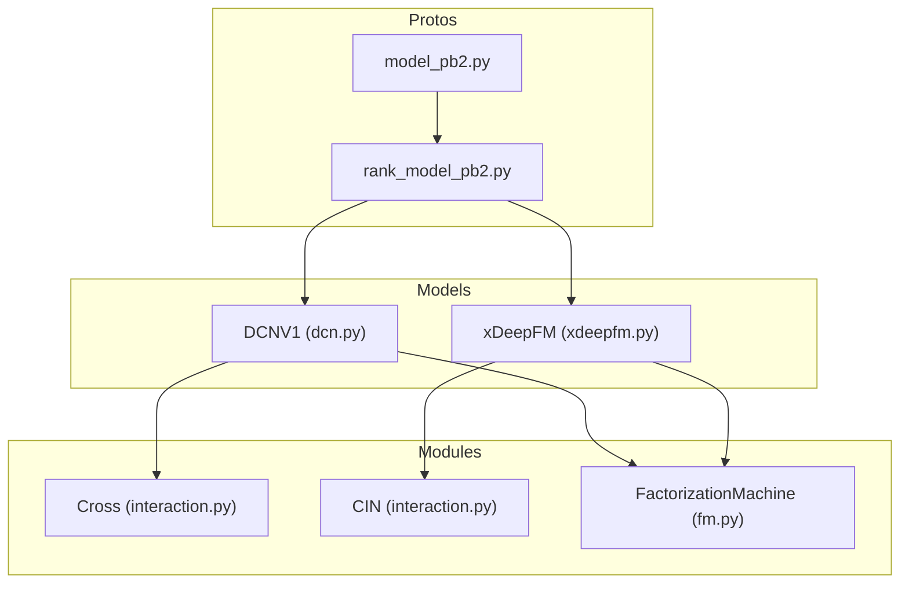
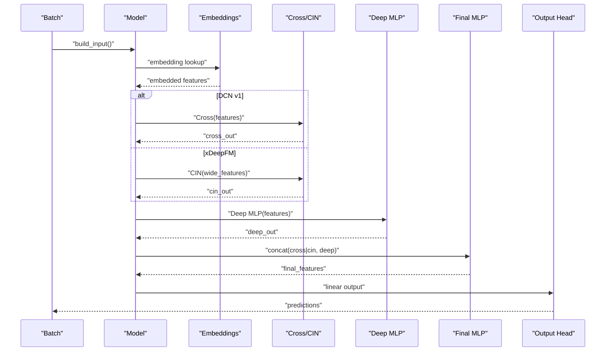
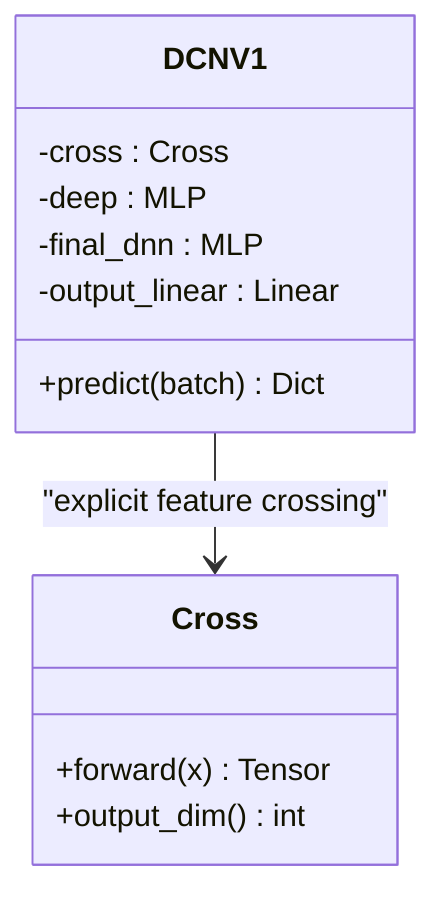
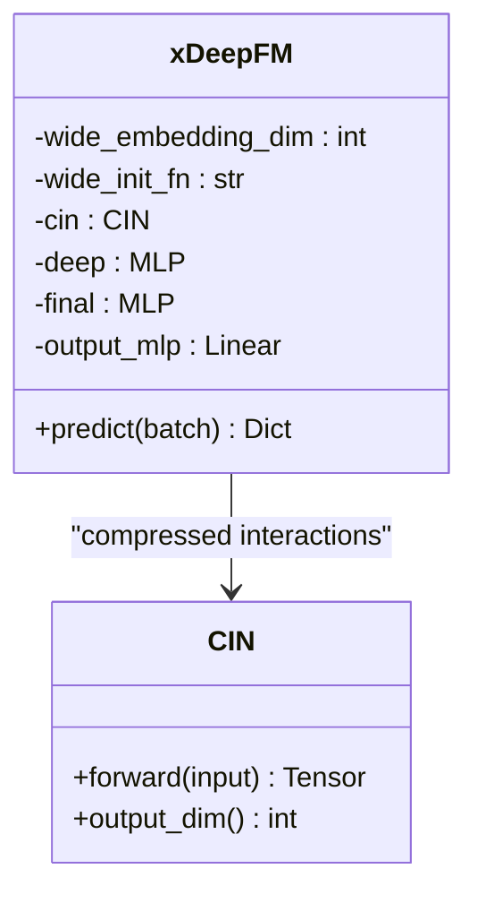
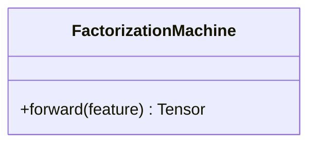
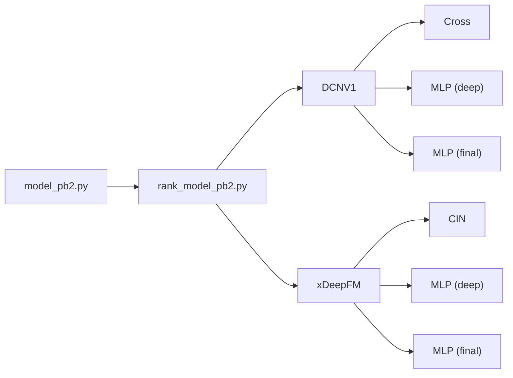

# Deep & Cross Network and xDeepFM

<cite>
**Referenced Files in This Document**
- [dcn.py](file://tzrec/models/dcn.py)
- [xdeepfm.py](file://tzrec/models/xdeepfm.py)
- [interaction.py](file://tzrec/modules/interaction.py)
- [fm.py](file://tzrec/modules/fm.py)
- [dcn.md](file://docs/source/models/dcn.md)
- [xdeepfm.md](file://docs/source/models/xdeepfm.md)
- [rank_model_pb2.py](file://tzrec/protos/models/rank_model_pb2.py)
- [model_pb2.py](file://tzrec/protos/model_pb2.py)
- [dcn_test.py](file://tzrec/models/dcn_test.py)
- [xdeepfm_test.py](file://tzrec/models/xdeepfm_test.py)
</cite>

## Table of Contents

1. [Introduction](#introduction)
1. [Project Structure](#project-structure)
1. [Core Components](#core-components)
1. [Architecture Overview](#architecture-overview)
1. [Detailed Component Analysis](#detailed-component-analysis)
1. [Dependency Analysis](#dependency-analysis)
1. [Performance Considerations](#performance-considerations)
1. [Troubleshooting Guide](#troubleshooting-guide)
1. [Conclusion](#conclusion)
1. [Appendices](#appendices)

## Introduction

This document explains the Deep & Cross Network (DCN) and xDeepFM models in TorchEasyRec. It covers:

- Mathematical foundations of explicit feature crossing via Cross layers and implicit feature learning via Deep MLPs
- xDeepFM’s extension with Compressed Interaction Network (CIN) for efficient high-order feature interactions
- Configuration options, cross network depths, and factorization-machine-related components
- Practical examples for model definition, feature engineering, and optimization strategies
- Guidance on choosing DCN vs xDeepFM based on dataset scale, computational budget, and performance goals

## Project Structure

DCN and xDeepFM are implemented as rank models built on shared modules:

- Models: DCN v1 and xDeepFM live under the models package
- Feature interaction modules: Cross, CrossV2, and CIN are implemented in the interaction module
- Factorization Machine support: FactorizationMachine module exists for 2nd-order interactions
- Protos: Model configurations are defined via protobuf messages for DCN v1, DCN v2, and xDeepFM

**Diagram sources**

- \[dcn.py\](file://tzrec/models/dcn.py#L26-L74)
- \[xdeepfm.py\](file://tzrec/models/xdeepfm.py#L26-L87)
- \[interaction.py\](file://tzrec/modules/interaction.py#L94-L234)
- \[fm.py\](file://tzrec/modules/fm.py#L17-L42)
- \[rank_model_pb2.py\](file://tzrec/protos/models/rank_model_pb2.py#L1-L47)
- \[model_pb2.py\](file://tzrec/protos/model_pb2.py#L1-L43)

**Section sources**

- \[dcn.py\](file://tzrec/models/dcn.py#L26-L74)
- \[xdeepfm.py\](file://tzrec/models/xdeepfm.py#L26-L87)
- \[interaction.py\](file://tzrec/modules/interaction.py#L94-L234)
- \[fm.py\](file://tzrec/modules/fm.py#L17-L42)
- \[rank_model_pb2.py\](file://tzrec/protos/models/rank_model_pb2.py#L1-L47)
- \[model_pb2.py\](file://tzrec/protos/model_pb2.py#L1-L43)

## Core Components

- DCN v1
  - Explicit feature crossing via Cross layers
  - Implicit learning via a Deep MLP
  - Final fusion through a small MLP followed by a linear output head
- xDeepFM
  - Wide side: CIN for compressed high-order feature interactions
  - Deep side: Deep MLP
  - Final fusion and output head
- Factorization Machine (FM)
  - Supports 2nd-order feature interactions in dedicated blocks and modules

Key configuration points:

- DCN v1: cross cross_num, deep hidden_units, final hidden_units
- xDeepFM: cin cin_layer_size, deep hidden_units, final hidden_units, wide_embedding_dim, wide_init_fn
- Shared: metrics and losses configured at ModelConfig level

**Section sources**

- \[dcn.md\](file://docs/source/models/dcn.md#L11-L65)
- \[xdeepfm.md\](file://docs/source/models/xdeepfm.md#L9-L81)
- \[rank_model_pb2.py\](file://tzrec/protos/models/rank_model_pb2.py#L38-L45)
- \[model_pb2.py\](file://tzrec/protos/model_pb2.py#L25-L43)

## Architecture Overview

High-level flow for both models:

**Diagram sources**

- \[dcn.py\](file://tzrec/models/dcn.py#L63-L74)
- \[xdeepfm.py\](file://tzrec/models/xdeepfm.py#L63-L87)
- \[interaction.py\](file://tzrec/modules/interaction.py#L94-L133)
- \[interaction.py\](file://tzrec/modules/interaction.py#L183-L234)

## Detailed Component Analysis

### DCN v1

- Explicit crossing: Cross module applies learnable bilinear transformations across feature dimensions iteratively
- Implicit learning: Deep MLP captures complex non-linear patterns
- Fusion: Concatenates cross and deep outputs, passes through a small final MLP, and projects to logits

**Diagram sources**

- \[dcn.py\](file://tzrec/models/dcn.py#L26-L74)
- \[interaction.py\](file://tzrec/modules/interaction.py#L94-L133)

Mathematical foundation:

- Cross layer computes iterative transformations that approximate high-order feature interactions efficiently
- The forward pass accumulates interactions across cross_num layers

Training considerations:

- Cross depth controls model capacity for explicit interactions
- Deep MLP hidden_units control implicit modeling capacity
- Binary cross entropy loss and AUC metrics commonly used

Practical configuration example references:

- \[dcn.md\](file://docs/source/models/dcn.md#L15-L58)

**Section sources**

- \[dcn.py\](file://tzrec/models/dcn.py#L26-L74)
- \[interaction.py\](file://tzrec/modules/interaction.py#L94-L133)
- \[dcn.md\](file://docs/source/models/dcn.md#L11-L65)
- \[dcn_test.py\](file://tzrec/models/dcn_test.py#L28-L63)

### xDeepFM

- Wide side: CIN learns high-order feature interactions by stacking convolutional layers over outer products of embeddings
- Deep side: Standard MLP on dense embeddings
- Final fusion: Concatenates CIN and Deep MLP outputs, then projects to logits

**Diagram sources**

- \[xdeepfm.py\](file://tzrec/models/xdeepfm.py#L26-L87)
- \[interaction.py\](file://tzrec/modules/interaction.py#L183-L234)

Mathematical foundation:

- CIN uses Einstein summation to compute outer products between field embeddings, stacks conv1d layers to compress and aggregate interactions
- Output dimension equals the sum of per-layer output channels

Training considerations:

- CIN layer sizes control expressive power of explicit interactions
- Deep MLP hidden_units control implicit modeling
- Wide-side embeddings and initialization options configurable

Practical configuration example references:

- \[xdeepfm.md\](file://docs/source/models/xdeepfm.md#L11-L74)

**Section sources**

- \[xdeepfm.py\](file://tzrec/models/xdeepfm.py#L26-L87)
- \[interaction.py\](file://tzrec/modules/interaction.py#L183-L234)
- \[xdeepfm.md\](file://docs/source/models/xdeepfm.md#L9-L81)
- \[xdeepfm_test.py\](file://tzrec/models/xdeepfm_test.py#L101-L146)

### Factorization Machine Support

While DCN v1 does not directly expose a dedicated FM block, the FactorizationMachine module supports 2nd-order interactions and can be used in specialized components or fused with other modules.

**Diagram sources**

- \[fm.py\](file://tzrec/modules/fm.py#L17-L42)

**Section sources**

- \[fm.py\](file://tzrec/modules/fm.py#L17-L42)

## Dependency Analysis

- DCN v1 depends on Cross and MLP modules
- xDeepFM depends on CIN and MLP modules
- Both models inherit from RankModel and use shared embedding groups and feature grouping mechanisms
- Protobuf definitions specify model-specific configuration blocks for cross, cross_v2, and cin

**Diagram sources**

- \[dcn.py\](file://tzrec/models/dcn.py#L44-L61)
- \[xdeepfm.py\](file://tzrec/models/xdeepfm.py#L44-L61)
- \[interaction.py\](file://tzrec/modules/interaction.py#L94-L133)
- \[interaction.py\](file://tzrec/modules/interaction.py#L183-L234)
- \[rank_model_pb2.py\](file://tzrec/protos/models/rank_model_pb2.py#L38-L45)
- \[model_pb2.py\](file://tzrec/protos/model_pb2.py#L25-L43)

**Section sources**

- \[dcn.py\](file://tzrec/models/dcn.py#L44-L61)
- \[xdeepfm.py\](file://tzrec/models/xdeepfm.py#L44-L61)
- \[interaction.py\](file://tzrec/modules/interaction.py#L94-L133)
- \[interaction.py\](file://tzrec/modules/interaction.py#L183-L234)
- \[rank_model_pb2.py\](file://tzrec/protos/models/rank_model_pb2.py#L38-L45)
- \[model_pb2.py\](file://tzrec/protos/model_pb2.py#L25-L43)

## Performance Considerations

- Cross depth (DCN v1) and CIN layer sizes (xDeepFM) directly impact memory and compute; increase gradually and monitor validation metrics
- Wide-side CIN in xDeepFM can be computationally intensive; consider reducing cin_layer_size or using fewer layers for large vocabularies
- Deep MLP width and depth trade-off: deeper networks may improve fit but raise training cost and risk overfitting
- Use appropriate optimizers and learning rates; binary cross entropy with AUC monitoring is typical for ranking tasks

[No sources needed since this section provides general guidance]

## Troubleshooting Guide

Common issues and checks:

- Shape mismatches in embeddings or feature groups: verify feature group definitions and embedding dimensions
- Overfitting: reduce cross_num or cin_layer_size; add regularization; monitor grouped AUC
- Slow convergence: adjust learning rate schedules; ensure proper batch sizing; check optimizer settings
- Large memory footprint: reduce model widths, lower cross/cin depths, or enable mixed precision

[No sources needed since this section provides general guidance]

## Conclusion

DCN v1 excels at explicit feature crossing with minimal overhead, while xDeepFM extends this idea with CIN to capture richer high-order interactions efficiently. Choose DCN v1 for simpler setups or constrained compute; opt for xDeepFM when you need strong explicit interaction modeling and can afford the additional complexity. Align configuration choices with dataset characteristics, resource budgets, and target metrics.

[No sources needed since this section summarizes without analyzing specific files]

## Appendices

### Configuration Reference Summary

- DCN v1
  - cross.cross_num: number of explicit cross layers
  - deep.hidden_units: list of channel counts for deep MLP
  - final.hidden_units: list of channel counts for final fusion MLP
- xDeepFM
  - cin.cin_layer_size: list of output channels per CIN layer
  - deep.hidden_units: list of channel counts for deep MLP
  - final.hidden_units: list of channel counts for final fusion MLP
  - wide_embedding_dim: embedding dimension for wide-side features
  - wide_init_fn: initialization function name for wide embeddings

**Section sources**

- \[dcn.md\](file://docs/source/models/dcn.md#L60-L65)
- \[xdeepfm.md\](file://docs/source/models/xdeepfm.md#L76-L81)
- \[rank_model_pb2.py\](file://tzrec/protos/models/rank_model_pb2.py#L38-L45)
- \[model_pb2.py\](file://tzrec/protos/model_pb2.py#L25-L43)
