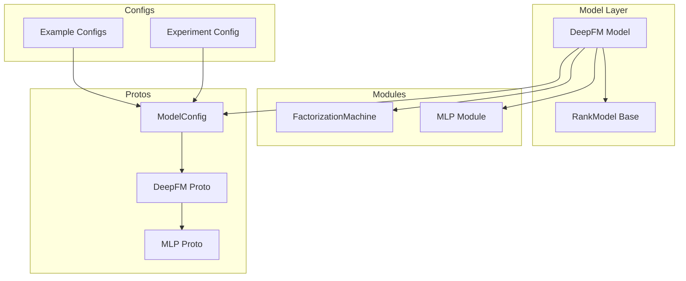
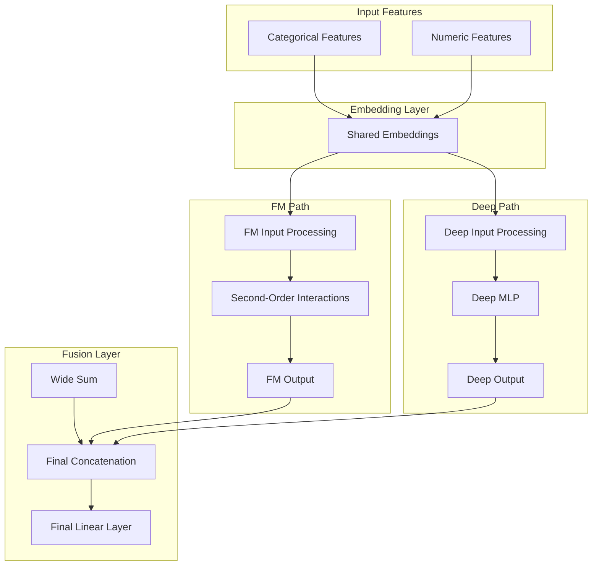
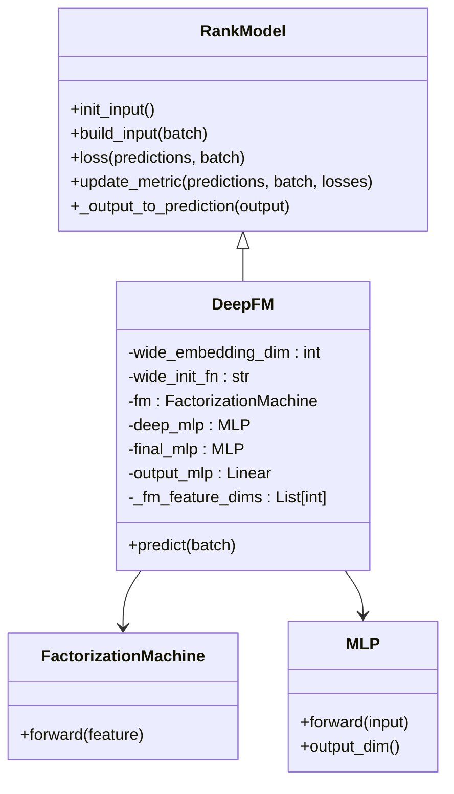
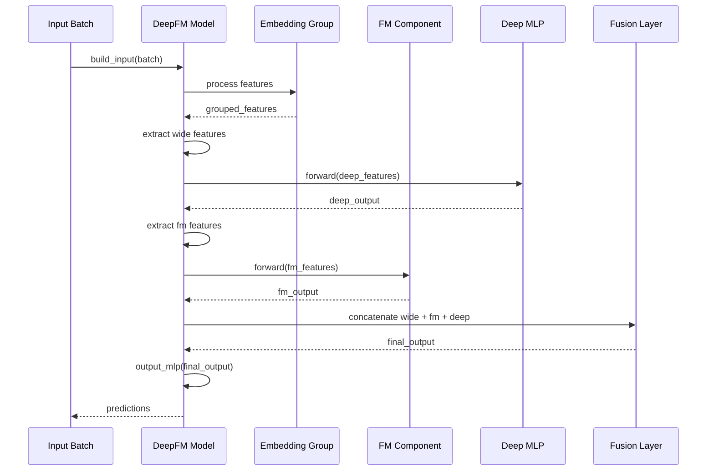
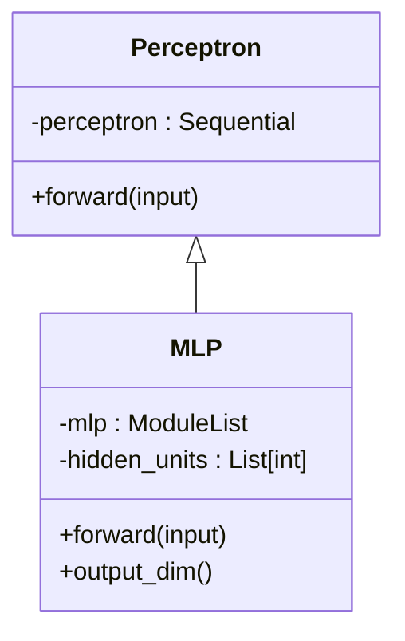
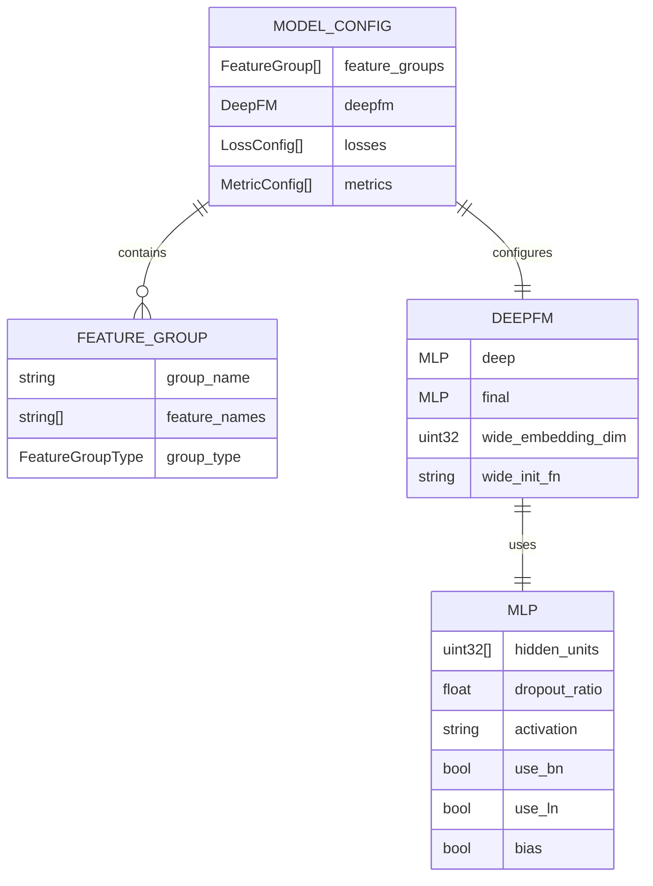
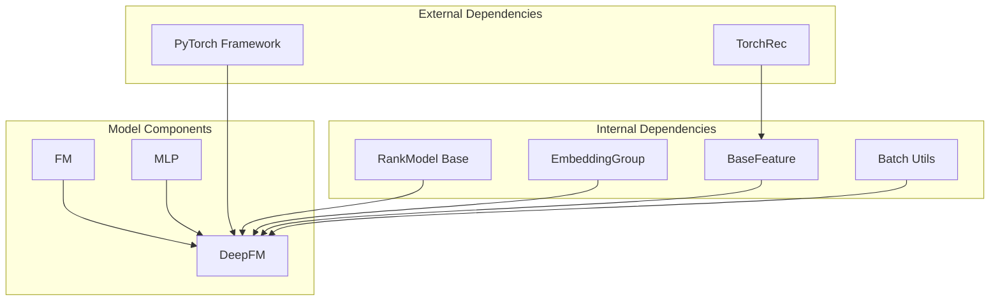

# Deep Factorization Machine

<cite>
**Referenced Files in This Document**
- [deepfm.py](file://tzrec/models/deepfm.py)
- [fm.py](file://tzrec/modules/fm.py)
- [mlp.py](file://tzrec/modules/mlp.py)
- [rank_model.py](file://tzrec/models/rank_model.py)
- [deepfm.md](file://docs/source/models/deepfm.md)
- [deepfm_criteo.config](file://examples/deepfm_criteo.config)
- [deepfm.config](file://experiments/deepfm/deepfm.config)
- [model_pb2.py](file://tzrec/protos/model_pb2.py)
- [rank_model_pb2.py](file://tzrec/protos/models/rank_model_pb2.py)
- [module_pb2.py](file://tzrec/protos/module_pb2.py)
- [deepfm_test.py](file://tzrec/models/deepfm_test.py)
</cite>

## Table of Contents

1. [Introduction](#introduction)
1. [Project Structure](#project-structure)
1. [Core Components](#core-components)
1. [Architecture Overview](#architecture-overview)
1. [Detailed Component Analysis](#detailed-component-analysis)
1. [Dependency Analysis](#dependency-analysis)
1. [Performance Considerations](#performance-considerations)
1. [Troubleshooting Guide](#troubleshooting-guide)
1. [Conclusion](#conclusion)
1. [Appendices](#appendices)

## Introduction

DeepFM (Deep Factorization Machine) is a deep learning model designed for recommendation and ranking tasks. It combines the explicit feature interaction modeling of Factorization Machines (FM) with the implicit higher-order interaction learning capability of deep neural networks. The model automatically discovers and learns feature interactions without manual engineering, making it particularly effective for handling sparse categorical features commonly found in recommendation systems.

DeepFM achieves this by:

- Using FM to capture second-order feature interactions explicitly
- Employing a deep neural network to learn higher-order interactions implicitly
- Sharing embeddings between FM and deep components for efficient computation
- Providing flexible fusion strategies through optional final MLP layers

## Project Structure

The DeepFM implementation is organized across several key modules within the TorchEasyRec framework:



**Diagram sources**

- \[deepfm.py\](file://tzrec/models/deepfm.py#L26-L109)
- \[rank_model.py\](file://tzrec/models/rank_model.py#L56-L513)
- \[fm.py\](file://tzrec/modules/fm.py#L17-L43)
- \[mlp.py\](file://tzrec/modules/mlp.py#L86-L178)
- \[model_pb2.py\](file://tzrec/protos/model_pb2.py#L25-L43)
- \[rank_model_pb2.py\](file://tzrec/protos/models/rank_model_pb2.py#L19-L47)

**Section sources**

- \[deepfm.py\](file://tzrec/models/deepfm.py#L1-L109)
- \[rank_model.py\](file://tzrec/models/rank_model.py#L1-L513)

## Core Components

The DeepFM model consists of three primary components working in concert:

### Factorization Machine Component

The FM component captures explicit second-order feature interactions through a mathematical formulation that computes pairwise feature combinations efficiently.

### Deep Neural Network Component

The deep MLP component learns higher-order feature interactions implicitly through stacked perceptrons with configurable architectures.

### Embedding Sharing Strategy

Both FM and deep components share identical embeddings, enabling efficient computation and consistent feature representation across all model components.

**Section sources**

- \[fm.py\](file://tzrec/modules/fm.py#L17-L43)
- \[mlp.py\](file://tzrec/modules/mlp.py#L86-L178)
- \[deepfm.py\](file://tzrec/models/deepfm.py#L48-L71)

## Architecture Overview

DeepFM follows a hybrid architecture that combines explicit and implicit feature interaction learning:



**Diagram sources**

- \[deepfm.py\](file://tzrec/models/deepfm.py#L72-L109)
- \[fm.py\](file://tzrec/modules/fm.py#L27-L42)
- \[mlp.py\](file://tzrec/modules/mlp.py#L161-L178)

## Detailed Component Analysis

### DeepFM Model Implementation

The DeepFM class extends the RankModel base class and implements the complete model architecture:



**Diagram sources**

- \[deepfm.py\](file://tzrec/models/deepfm.py#L26-L109)
- \[rank_model.py\](file://tzrec/models/rank_model.py#L56-L513)
- \[fm.py\](file://tzrec/modules/fm.py#L17-L43)
- \[mlp.py\](file://tzrec/modules/mlp.py#L86-L178)

#### Model Initialization Process

The DeepFM initialization establishes the model architecture and validates configuration requirements:

1. **Feature Group Validation**: Ensures FM features have consistent embedding dimensions
1. **MLP Construction**: Creates deep neural network with configurable hidden units
1. **Optional Fusion**: Adds final MLP layer for combining wide, FM, and deep outputs
1. **Output Layer**: Configures final linear layer for prediction

#### Forward Pass Execution

The predict method implements the complete inference pipeline:



**Diagram sources**

- \[deepfm.py\](file://tzrec/models/deepfm.py#L72-L109)

**Section sources**

- \[deepfm.py\](file://tzrec/models/deepfm.py#L36-L109)

### Factorization Machine Module

The FM implementation provides explicit second-order interaction learning:

```mermaid
flowchart TD
Input[Input Embeddings<br/>Shape: [B, N, D]] --> Sum[Sum of Input<br/>Σx_i]
Input --> Square[Square of Input<br/>x_i²]
Sum --> SquareOfSum[Square of Sum<br/>(Σx_i)²]
Square --> SumOfSquare[Sum of Square<br/>Σx_i²]
SquareOfSum --> FMCalc[FM Calculation<br/>0.5 * ((Σx_i)² - Σx_i²)]
SumOfSquare --> FMCalc
FMCalc --> Output[Output Embeddings<br/>Shape: [B, D]]
```

**Diagram sources**

- \[fm.py\](file://tzrec/modules/fm.py#L27-L42)

The FM module computes second-order interactions using the mathematical identity:

- Second-order interactions = 0.5 * [(Σx_i)² - Σ(x_i²)]

This approach efficiently captures pairwise feature combinations without requiring explicit enumeration.

**Section sources**

- \[fm.py\](file://tzrec/modules/fm.py#L17-L43)

### MLP Module Architecture

The MLP component provides flexible deep learning capabilities:



**Diagram sources**

- \[mlp.py\](file://tzrec/modules/mlp.py#L21-L178)

Key features of the MLP implementation:

- **Configurable Architecture**: Hidden units define layer sizes
- **Activation Functions**: Supports various activation types
- **Normalization Options**: Batch normalization and layer normalization
- **Dropout Support**: Configurable dropout ratios per layer
- **Flexible Dimensions**: Handles 2D and 3D tensor inputs

**Section sources**

- \[mlp.py\](file://tzrec/modules/mlp.py#L86-L178)

### Configuration and Protos

DeepFM configuration is defined through Protocol Buffers:



**Diagram sources**

- \[model_pb2.py\](file://tzrec/protos/model_pb2.py#L25-L43)
- \[rank_model_pb2.py\](file://tzrec/protos/models/rank_model_pb2.py#L19-L47)
- \[module_pb2.py\](file://tzrec/protos/module_pb2.py#L16-L83)

**Section sources**

- \[model_pb2.py\](file://tzrec/protos/model_pb2.py#L25-L43)
- \[rank_model_pb2.py\](file://tzrec/protos/models/rank_model_pb2.py#L19-L47)
- \[module_pb2.py\](file://tzrec/protos/module_pb2.py#L16-L83)

## Dependency Analysis

The DeepFM model has well-defined dependencies that enable modular design and extensibility:



**Diagram sources**

- \[deepfm.py\](file://tzrec/models/deepfm.py#L12-L24)
- \[rank_model.py\](file://tzrec/models/rank_model.py#L12-L37)

### Component Coupling Analysis

- **High Cohesion**: Each component has a focused responsibility
- **Low Coupling**: Components communicate through well-defined interfaces
- **Extensible Design**: Easy to modify individual components without affecting others

**Section sources**

- \[deepfm.py\](file://tzrec/models/deepfm.py#L12-L24)
- \[rank_model.py\](file://tzrec/models/rank_model.py#L12-L37)

## Performance Considerations

DeepFM offers several performance advantages for recommendation systems:

### Computational Efficiency

- **Shared Embeddings**: Reduces memory footprint and computation
- **Efficient FM Implementation**: O(N²) complexity for pairwise interactions
- **Modular Design**: Enables optimization at component level

### Memory Optimization

- **Embedding Compression**: Consistent embedding dimensions across components
- **Batch Processing**: Optimized for large-scale training scenarios
- **Memory Management**: Leverages PyTorch's memory-efficient operations

### Scalability Features

- **Configurable Architectures**: Adjustable hidden units and layers
- **Flexible Fusion Strategies**: Optional final MLP for different computational needs
- **Sequence Support**: Handles sequential features for temporal modeling

## Troubleshooting Guide

### Common Configuration Issues

1. **Embedding Dimension Mismatch**: Ensure FM and deep feature groups have consistent embedding dimensions
1. **Feature Group Validation**: Verify feature groups are properly defined in model configuration
1. **Optimizer Configuration**: Check sparse and dense optimizer settings for optimal performance

### Training Problems

1. **Learning Rate Tuning**: Adjust learning rates for sparse and dense parameters separately
1. **Batch Size Optimization**: Balance batch size for memory constraints and convergence speed
1. **Gradient Flow**: Monitor gradients during training to detect vanishing/exploding gradient issues

### Evaluation Metrics

DeepFM supports multiple evaluation metrics:

- **AUC**: Area Under ROC Curve for binary classification
- **Binary Cross Entropy**: Primary loss function for recommendation tasks
- **Custom Metrics**: Extensible metric system for specialized evaluation needs

**Section sources**

- \[deepfm_test.py\](file://tzrec/models/deepfm_test.py#L27-L200)

## Conclusion

DeepFM represents a sophisticated approach to recommendation modeling that effectively combines explicit and implicit feature interaction learning. Its architecture enables automatic discovery of feature relationships while maintaining computational efficiency through shared embeddings and modular design.

Key strengths of the DeepFM implementation:

- **Automatic Interaction Learning**: Captures both second-order and higher-order interactions
- **Efficient Computation**: Shared embeddings reduce memory and compute overhead
- **Flexible Configuration**: Extensive customization options for different use cases
- **Production Ready**: Well-tested implementation with comprehensive examples

The model excels in recommendation systems where feature interactions are crucial for performance, particularly in handling sparse categorical features commonly found in user-item recommendation scenarios.

## Appendices

### Practical Usage Examples

#### Basic Model Setup

```python
# Feature configuration with shared embeddings
feature_groups = [
    FeatureGroupConfig(
        group_name="wide",
        feature_names=["user_id", "item_id", "category"],
        group_type=WIDE
    ),
    FeatureGroupConfig(
        group_name="fm",
        feature_names=["user_id", "item_id", "category"],
        group_type=DEEP
    ),
    FeatureGroupConfig(
        group_name="deep",
        feature_names=["user_id", "item_id", "category", "rating"],
        group_type=DEEP
    )
]
```

#### Training Procedure

1. **Data Preparation**: Configure feature groups and embedding dimensions
1. **Model Configuration**: Define deep and final MLP architectures
1. **Training Setup**: Configure optimizers and learning rates
1. **Evaluation**: Monitor AUC and other relevant metrics

#### Evaluation Metrics

- **AUC**: Primary metric for ranking quality
- **Precision/Recall**: For recommendation effectiveness
- **Coverage**: For model diversity assessment

### Configuration Reference

- **wide_embedding_dim**: Output dimension for wide component (default: 4)
- **wide_init_fn**: Initialization function for wide embeddings
- **deep.hidden_units**: MLP layer sizes for deep component
- **final.hidden_units**: Optional fusion layer sizes
- **Embedding Dimensions**: Must be consistent across FM and deep components

**Section sources**

- \[deepfm.md\](file://docs/source/models/deepfm.md#L9-L79)
- \[deepfm_criteo.config\](file://examples/deepfm_criteo.config#L278-L397)
- \[deepfm.config\](file://experiments/deepfm/deepfm.config#L96-L142)
