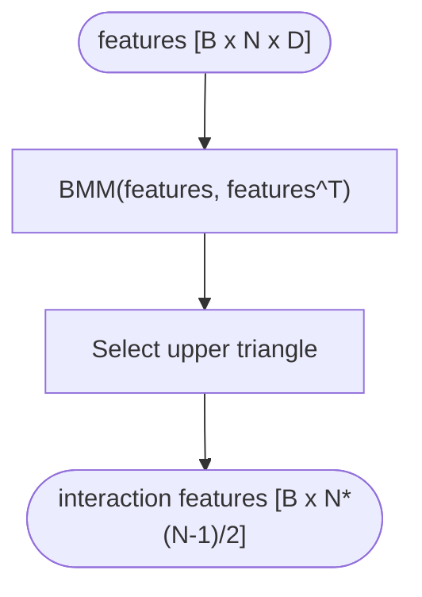

# Deep Learning Recommender Model

<cite>
**Referenced Files in This Document**
- [dlrm.py](file://tzrec/models/dlrm.py)
- [interaction.py](file://tzrec/modules/interaction.py)
- [mlp.py](file://tzrec/modules/mlp.py)
- [embedding.py](file://tzrec/modules/embedding.py)
- [dlrm_test.py](file://tzrec/models/dlrm_test.py)
- [dlrm_criteo.config](file://examples/dlrm_criteo.config)
- [dlrm.md](file://docs/source/models/dlrm.md)
- [rank_model_pb2.py](file://tzrec/protos/models/rank_model_pb2.py)
- [model_pb2.py](file://tzrec/protos/model_pb2.py)
</cite>

## Table of Contents

1. [Introduction](#introduction)
1. [Project Structure](#project-structure)
1. [Core Components](#core-components)
1. [Architecture Overview](#architecture-overview)
1. [Detailed Component Analysis](#detailed-component-analysis)
1. [Dependency Analysis](#dependency-analysis)
1. [Performance Considerations](#performance-considerations)
1. [Troubleshooting Guide](#troubleshooting-guide)
1. [Conclusion](#conclusion)
1. [Appendices](#appendices)

## Introduction

This document explains the DLRM (Deep Learning Recommender Model) implementation in the TorchEasyRec codebase. It focuses on how DLRM handles sparse and dense features efficiently, the architecture of the embedding lookup, dot-product interaction layer, and deep neural network components. It also covers configuration options, embedding dimension settings, and network architecture parameters, and provides practical examples for configuring DLRM for real-world recommendation scenarios.

## Project Structure

The DLRM implementation spans several modules:

- Model definition: DLRM class orchestrates feature grouping, embedding lookup, interaction, and final MLP.
- Interaction module: Implements the dot-product feature interaction layer.
- MLP module: Provides configurable multi-layer perceptrons.
- Embedding module: Manages sparse embedding lookups and dense feature handling.
- Protobuf definitions: Define configuration schemas for DLRM and related models.
- Example configuration: Demonstrates a production-style setup for Criteo Terabyte.

**Diagram sources**

- \[dlrm.py\](file://tzrec/models/dlrm.py#L26-L136)
- \[interaction.py\](file://tzrec/modules/interaction.py#L57-L92)
- \[mlp.py\](file://tzrec/modules/mlp.py#L86-L178)
- \[embedding.py\](file://tzrec/modules/embedding.py#L139-L508)
- \[rank_model_pb2.py\](file://tzrec/protos/models/rank_model_pb2.py#L34-L47)
- \[model_pb2.py\](file://tzrec/protos/model_pb2.py#L25-L42)
- \[dlrm_criteo.config\](file://examples/dlrm_criteo.config#L331-L397)

**Section sources**

- \[dlrm.py\](file://tzrec/models/dlrm.py#L26-L136)
- \[interaction.py\](file://tzrec/modules/interaction.py#L57-L92)
- \[mlp.py\](file://tzrec/modules/mlp.py#L86-L178)
- \[embedding.py\](file://tzrec/modules/embedding.py#L139-L508)
- \[rank_model_pb2.py\](file://tzrec/protos/models/rank_model_pb2.py#L34-L47)
- \[model_pb2.py\](file://tzrec/protos/model_pb2.py#L25-L42)
- \[dlrm_criteo.config\](file://examples/dlrm_criteo.config#L331-L397)

## Core Components

- DLRM model: Orchestrates feature groups, builds inputs, applies dense MLP, computes interactions, concatenates features, and produces logits.
- InteractionArch: Computes pairwise dot-product interactions among feature embeddings using upper triangular matrix selection.
- MLP: Stacked perceptrons with optional normalization, dropout, and activation.
- EmbeddingGroup: Manages sparse embedding lookups and dense feature aggregation, with support for managed collision and input tiling.

Key behaviors:

- Sparse features are grouped and embedded; dense features optionally pass through a dedicated MLP.
- Features are concatenated with dense features (if present) and passed through InteractionArch to compute pairwise interactions.
- Final MLP consumes interaction features plus optional dense and/or sparse features depending on configuration.
- Output head produces logits and probabilities.

**Section sources**

- \[dlrm.py\](file://tzrec/models/dlrm.py#L26-L136)
- \[interaction.py\](file://tzrec/modules/interaction.py#L57-L92)
- \[mlp.py\](file://tzrec/modules/mlp.py#L86-L178)
- \[embedding.py\](file://tzrec/modules/embedding.py#L139-L508)

## Architecture Overview

The DLRM architecture follows a classic two-branch design:

- Bottom branch: EmbeddingGroup produces dense embeddings for sparse features and optional dense features.
- Top branch: InteractionArch computes pairwise dot products across features.
- Fusion: Concatenation of interaction features with dense features and optionally sparse features.
- Head: Final MLP and output projection produce prediction scores.

**Diagram sources**

- \[dlrm.py\](file://tzrec/models/dlrm.py#L101-L136)
- \[interaction.py\](file://tzrec/modules/interaction.py#L80-L91)
- \[mlp.py\](file://tzrec/modules/mlp.py#L161-L177)
- \[embedding.py\](file://tzrec/modules/embedding.py#L407-L496)

## Detailed Component Analysis

### DLRM Model

The DLRM class initializes feature groups, validates configurations, constructs dense MLP and InteractionArch, and defines the forward pass.

Key initialization checks:

- Ensures dense MLP output dimension equals sparse embedding dimension.
- Enforces uniform sparse embedding dimensions across features.
- Supports optional dense features and optional concatenation of sparse features into the final MLP.

Forward pass:

- Builds grouped features from the batch.
- Reshapes sparse features into [B x N x D].
- Optionally runs dense features through MLP and prepends to sparse features.
- Applies InteractionArch to compute pairwise interactions.
- Concatenates interaction features with dense features and optionally sparse features.
- Passes through final MLP and output projection.

**Diagram sources**

- \[dlrm.py\](file://tzrec/models/dlrm.py#L101-L136)

**Section sources**

- \[dlrm.py\](file://tzrec/models/dlrm.py#L26-L136)

### InteractionArch (Dot-Product Interaction)

Computes pairwise dot products across features using batched matrix multiplication and upper-triangular selection.

Implementation highlights:

- Stores upper triangular indices as a buffer for efficient selection.
- Forward computes B x N x D features against transpose to produce B x N x N interactions, then selects upper triangle.

Complexity:

- O(B x N^2 x D) for the bmm; selection is O(N^2).
- Practical efficiency achieved by vectorized operations and contiguous memory layout.

**Diagram sources**

- \[interaction.py\](file://tzrec/modules/interaction.py#L80-L91)

**Section sources**

- \[interaction.py\](file://tzrec/modules/interaction.py#L57-L92)

### MLP Module

Stacked perceptrons with optional batch/layer normalization, dropout, and activation.

Key features:

- Configurable hidden units per layer.
- Dropout ratios per layer or globally.
- Optional return of intermediate hidden features.
- Flexible activation selection via factory.

Typical usage in DLRM:

- Dense MLP transforms dense features to match sparse embedding dimension.
- Final MLP consumes fused features and produces logits.

**Section sources**

- \[mlp.py\](file://tzrec/modules/mlp.py#L86-L178)

### EmbeddingGroup (Sparse/Dense Feature Handling)

Manages embedding lookups and dense feature aggregation.

Highlights:

- Supports sparse embeddings via EmbeddingBagCollection and managed collision variants.
- Supports dense embeddings via DenseEmbeddingCollection.
- Handles input tiling for scalable inference.
- Validates feature group configuration and raises clear errors for invalid setups.

Integration with DLRM:

- DLRM relies on EmbeddingGroup to produce grouped dense embeddings for sparse and dense features.
- Ensures correct shapes and dimensions for downstream modules.

**Section sources**

- \[embedding.py\](file://tzrec/modules/embedding.py#L139-L508)

### Protobuf Model Configuration

The DLRM configuration schema is defined in protobuf messages.

Key fields:

- DLRM message includes dense_mlp, final MLP, and arch_with_sparse flag.
- ModelConfig aggregates feature_groups and model-specific configuration.

This enables declarative configuration of DLRM in training configs.

**Section sources**

- \[rank_model_pb2.py\](file://tzrec/protos/models/rank_model_pb2.py#L34-L47)
- \[model_pb2.py\](file://tzrec/protos/model_pb2.py#L25-L42)

## Dependency Analysis

The DLRM model depends on:

- EmbeddingGroup for feature grouping and embedding lookups.
- InteractionArch for computing pairwise interactions.
- MLP for dense transformations and final prediction head.
- Protobuf definitions for configuration.

**Diagram sources**

- \[dlrm.py\](file://tzrec/models/dlrm.py#L26-L136)
- \[interaction.py\](file://tzrec/modules/interaction.py#L57-L92)
- \[mlp.py\](file://tzrec/modules/mlp.py#L86-L178)
- \[embedding.py\](file://tzrec/modules/embedding.py#L139-L508)
- \[rank_model_pb2.py\](file://tzrec/protos/models/rank_model_pb2.py#L34-L47)

**Section sources**

- \[dlrm.py\](file://tzrec/models/dlrm.py#L26-L136)
- \[interaction.py\](file://tzrec/modules/interaction.py#L57-L92)
- \[mlp.py\](file://tzrec/modules/mlp.py#L86-L178)
- \[embedding.py\](file://tzrec/modules/embedding.py#L139-L508)
- \[rank_model_pb2.py\](file://tzrec/protos/models/rank_model_pb2.py#L34-L47)

## Performance Considerations

- Efficient interaction computation: Using batched matrix multiplication and upper-triangular selection minimizes redundant computations.
- Dense MLP alignment: Ensuring dense MLP output dimension matches sparse embedding dimension avoids costly reshaping and enables seamless concatenation.
- Embedding scalability: EmbeddingGroup supports managed collision and input tiling to handle large embedding tables and reduce memory pressure during inference.
- Mixed precision and distributed training: While not part of the DLRM module itself, the framework supports training optimizations that can be combined with DLRM configurations.

[No sources needed since this section provides general guidance]

## Troubleshooting Guide

Common issues and resolutions:

- Dense MLP dimension mismatch: The dense MLP’s last hidden unit must equal the sparse embedding dimension; otherwise, initialization raises an exception.
- Sparse feature dimension mismatch: All sparse features must have identical embedding dimensions; otherwise, initialization raises an exception.
- Dense group with sequence features: Dense group cannot contain sequence features; initialization raises an exception.
- Sparse group with sequence features: Sparse group cannot contain sequence features; initialization raises an exception.
- Missing feature groups: If dense features are configured, the dense MLP must be configured accordingly.

Validation and tests:

- Unit tests demonstrate correct shapes and behavior for typical DLRM configurations.

**Section sources**

- \[dlrm.py\](file://tzrec/models/dlrm.py#L47-L90)
- \[dlrm_test.py\](file://tzrec/models/dlrm_test.py#L38-L102)

## Conclusion

The DLRM implementation in TorchEasyRec provides an efficient, modular architecture for large-scale recommendation systems. It cleanly separates sparse embedding lookup, dense feature processing, and dot-product feature interactions, while offering flexible configuration for production scenarios. The design emphasizes correctness, scalability, and ease of use through strong validation and clear configuration schemas.

[No sources needed since this section summarizes without analyzing specific files]

## Appendices

### Configuration Options and Parameters

- feature_groups:
  - dense: Optional group of dense features; when present, dense MLP is enabled.
  - sparse: Required group of sparse features; all must have the same embedding dimension.
- DLRM model config:
  - dense_mlp: Hidden units define the dense MLP; last hidden unit must match sparse embedding dimension.
  - final: Hidden units define the final MLP that consumes fused features.
  - arch_with_sparse: Whether to include sparse features in the final MLP; defaults to true.

Example configuration demonstrates a production-style setup for Criteo Terabyte with sparse categorical features and dense integer features.

**Section sources**

- \[dlrm.md\](file://docs/source/models/dlrm.md#L23-L96)
- \[dlrm_criteo.config\](file://examples/dlrm_criteo.config#L331-L397)

### Practical Examples

- Feature processing:
  - Configure id features with embedding_dim and num_buckets; configure raw features as needed.
  - Group features into dense and sparse groups as shown in the example config.
- Model definition:
  - Define dense_mlp and final MLP hidden_units in the model config.
  - Enable arch_with_sparse as desired.
- Training optimization:
  - Use separate sparse and dense optimizers as demonstrated in the example config.
  - Adjust batch size and learning rates according to dataset scale.

**Section sources**

- \[dlrm_criteo.config\](file://examples/dlrm_criteo.config#L1-L398)
- \[dlrm_test.py\](file://tzrec/models/dlrm_test.py#L38-L102)
