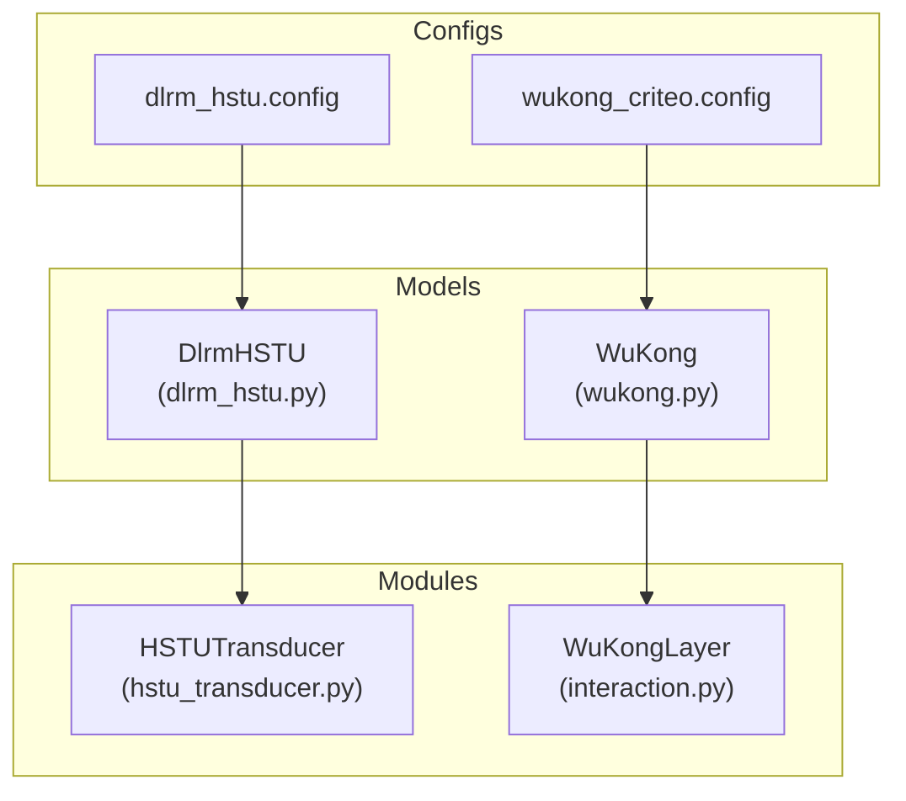
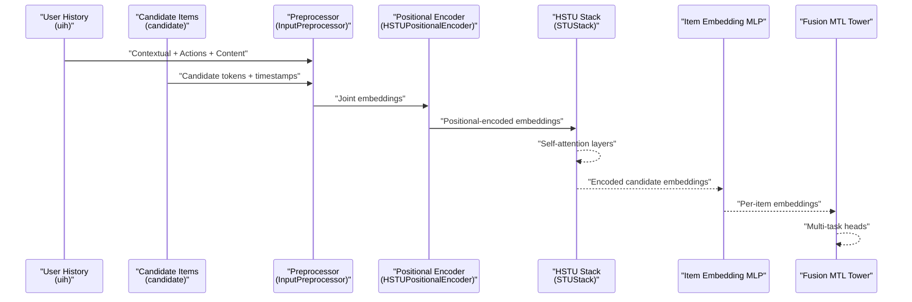
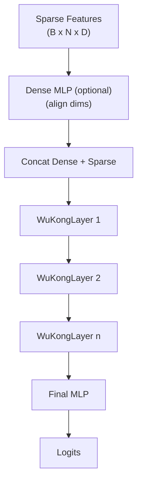
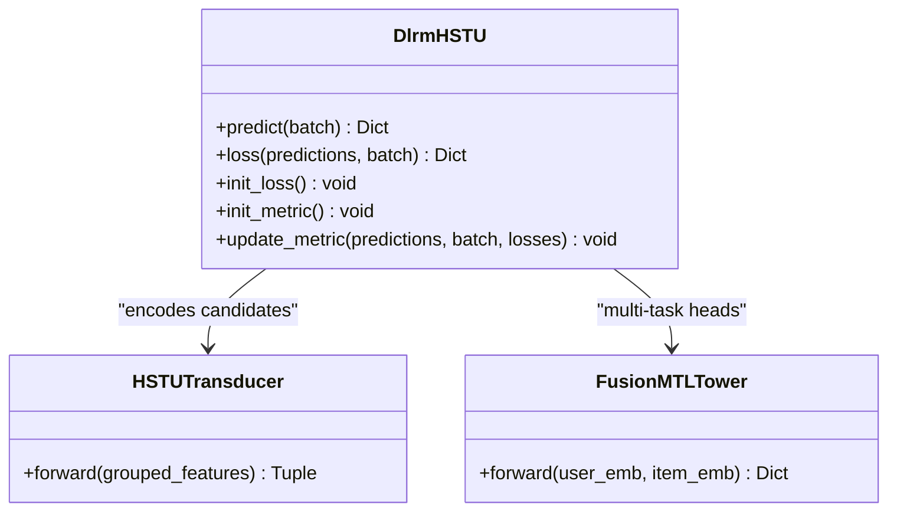
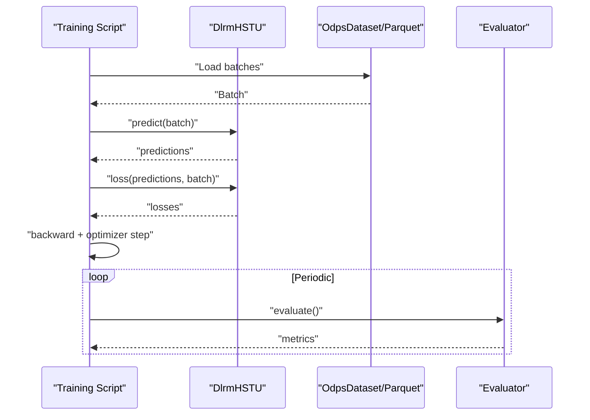
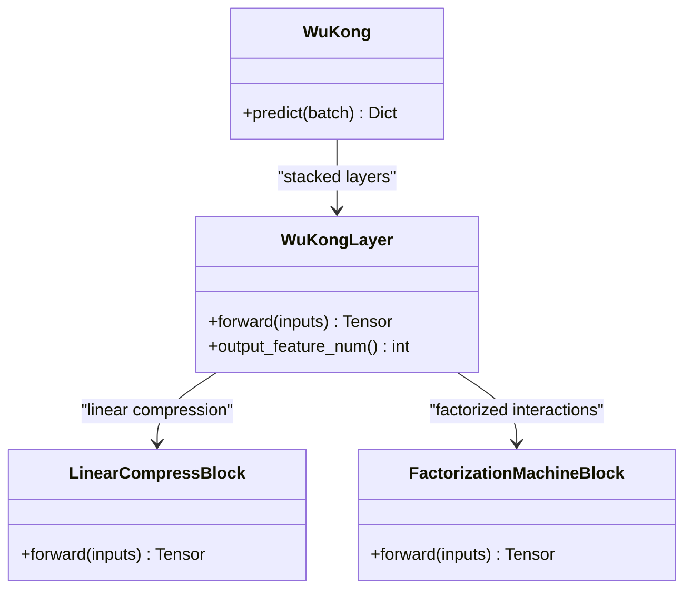
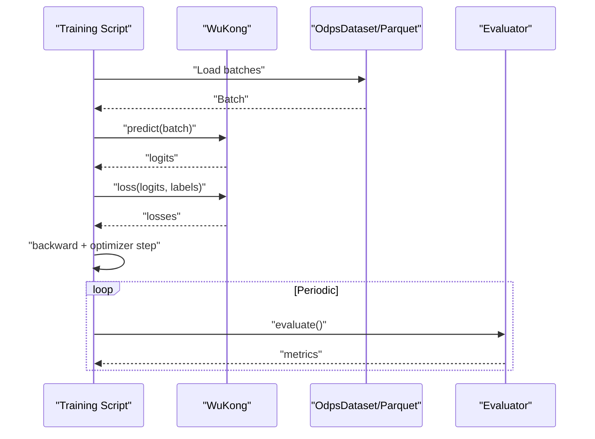
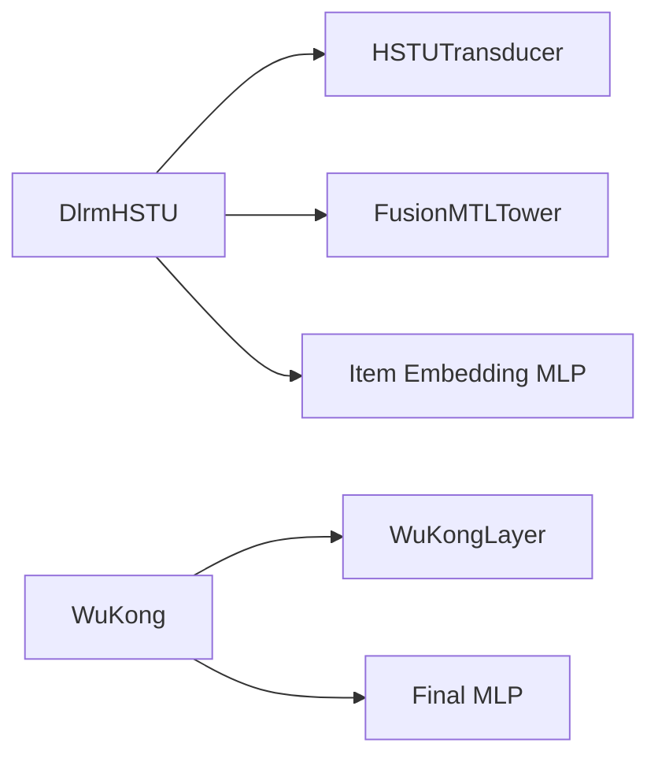

# Generative Recommendation Models

<cite>
**Referenced Files in This Document**
- [dlrm_hstu.md](file://docs/source/models/dlrm_hstu.md)
- [wukong.md](file://docs/source/models/wukong.md)
- [dlrm_hstu.py](file://tzrec/models/dlrm_hstu.py)
- [wukong.py](file://tzrec/models/wukong.py)
- [hstu_transducer.py](file://tzrec/modules/gr/hstu_transducer.py)
- [interaction.py](file://tzrec/modules/interaction.py)
- [dlrm_hstu.config](file://tzrec/benchmark/configs/kuairand/dlrm_hstu.config)
- [wukong_criteo.config](file://examples/wukong_criteo.config)
- [train.md](file://docs/source/usage/train.md)
- [eval.md](file://docs/source/usage/eval.md)
- [metric.proto](file://tzrec/protos/metric.proto)
</cite>

## Table of Contents

1. [Introduction](#introduction)
1. [Project Structure](#project-structure)
1. [Core Components](#core-components)
1. [Architecture Overview](#architecture-overview)
1. [Detailed Component Analysis](#detailed-component-analysis)
1. [Dependency Analysis](#dependency-analysis)
1. [Performance Considerations](#performance-considerations)
1. [Troubleshooting Guide](#troubleshooting-guide)
1. [Conclusion](#conclusion)
1. [Appendices](#appendices)

## Introduction

This document explains generative recommendation models in TorchEasyRec with a focus on DLRM-HSTU and WuKong. Generative models learn to produce relevant items rather than merely scoring existing candidates. They enable scalable, sequence-aware modeling of user behavior and can improve cold-start handling, exploration, and adaptation to evolving preferences.

- DLRM-HSTU: A generative ranking model that encodes long user interaction sequences with hierarchical self-training units (HSTU) and produces per-item embeddings conditioned on user history and candidate attributes.
- WuKong: A dense scaling architecture designed to capture high-order feature interactions efficiently while maintaining strong scaling laws.

We cover model configurations, training and evaluation procedures, metrics, and practical examples for setup and training.

## Project Structure

The generative recommendation components are implemented across model definitions, modules, and configuration examples:

- Model definitions:
  - DLRM-HSTU: \[dlrm_hstu.py\](file://tzrec/models/dlrm_hstu.py)
  - WuKong: \[wukong.py\](file://tzrec/models/wukong.py)
- Generative modules:
  - HSTU transducer: \[hstu_transducer.py\](file://tzrec/modules/gr/hstu_transducer.py)
  - WuKong interaction blocks: \[interaction.py\](file://tzrec/modules/interaction.py)
- Documentation and configs:
  - DLRM-HSTU docs: \[dlrm_hstu.md\](file://docs/source/models/dlrm_hstu.md)
  - WuKong docs: \[wukong.md\](file://docs/source/models/wukong.md)
  - DLRM-HSTU benchmark config: \[dlrm_hstu.config\](file://tzrec/benchmark/configs/kuairand/dlrm_hstu.config)
  - WuKong example config: \[wukong_criteo.config\](file://examples/wukong_criteo.config)
- Training and evaluation:
  - Training guide: \[train.md\](file://docs/source/usage/train.md)
  - Evaluation guide: \[eval.md\](file://docs/source/usage/eval.md)
  - Metrics definition: \[metric.proto\](file://tzrec/protos/metric.proto)

**Diagram sources**

- \[dlrm_hstu.py\](file://tzrec/models/dlrm_hstu.py#L82-L353)
- \[wukong.py\](file://tzrec/models/wukong.py#L26-L131)
- \[hstu_transducer.py\](file://tzrec/modules/gr/hstu_transducer.py#L35-L282)
- \[interaction.py\](file://tzrec/modules/interaction.py#L324-L379)
- \[dlrm_hstu.config\](file://tzrec/benchmark/configs/kuairand/dlrm_hstu.config#L117-L303)
- \[wukong_criteo.config\](file://examples/wukong_criteo.config#L331-L413)

**Section sources**

- \[dlrm_hstu.py\](file://tzrec/models/dlrm_hstu.py#L82-L353)
- \[wukong.py\](file://tzrec/models/wukong.py#L26-L131)
- \[hstu_transducer.py\](file://tzrec/modules/gr/hstu_transducer.py#L35-L282)
- \[interaction.py\](file://tzrec/modules/interaction.py#L324-L379)
- \[dlrm_hstu.md\](file://docs/source/models/dlrm_hstu.md#L1-L313)
- \[wukong.md\](file://docs/source/models/wukong.md#L1-L112)
- \[dlrm_hstu.config\](file://tzrec/benchmark/configs/kuairand/dlrm_hstu.config#L117-L303)
- \[wukong_criteo.config\](file://examples/wukong_criteo.config#L331-L413)

## Core Components

- DlrmHSTU
  - Encodes user history and candidate sequences via HSTU, then fuses with per-item embeddings for multi-task prediction.
  - Key parts: HSTU transducer, item embedding MLP, multi-task tower.
- WuKong
  - Stacked WuKongLayer modules that combine linear compression and factorized interactions to scale dense feature interactions efficiently.
  - Supports optional dense MLP to align dense features with sparse embedding dimensions.

Key implementation references:

- DlrmHSTU model class and forward logic: \[dlrm_hstu.py\](file://tzrec/models/dlrm_hstu.py#L82-L220)
- WuKong model class and forward logic: \[wukong.py\](file://tzrec/models/wukong.py#L26-L131)
- HSTU transducer: \[hstu_transducer.py\](file://tzrec/modules/gr/hstu_transducer.py#L35-L282)
- WuKongLayer building blocks: \[interaction.py\](file://tzrec/modules/interaction.py#L324-L379)

**Section sources**

- \[dlrm_hstu.py\](file://tzrec/models/dlrm_hstu.py#L82-L220)
- \[wukong.py\](file://tzrec/models/wukong.py#L26-L131)
- \[hstu_transducer.py\](file://tzrec/modules/gr/hstu_transducer.py#L35-L282)
- \[interaction.py\](file://tzrec/modules/interaction.py#L324-L379)

## Architecture Overview

The generative architecture for DLRM-HSTU integrates sequence modeling and multi-task learning:

**Diagram sources**

- \[hstu_transducer.py\](file://tzrec/modules/gr/hstu_transducer.py#L99-L151)
- \[hstu_transducer.py\](file://tzrec/modules/gr/hstu_transducer.py#L153-L169)
- \[hstu_transducer.py\](file://tzrec/modules/gr/hstu_transducer.py#L171-L228)
- \[dlrm_hstu.py\](file://tzrec/models/dlrm_hstu.py#L164-L167)

WuKong’s architecture stacks WuKongLayer modules to progressively increase interaction capacity:

**Diagram sources**

- \[wukong.py\](file://tzrec/models/wukong.py#L102-L130)
- \[interaction.py\](file://tzrec/modules/interaction.py#L324-L379)

## Detailed Component Analysis

### DLRM-HSTU Analysis

- Purpose: Generate per-item embeddings conditioned on long user interaction sequences and contextual features, enabling multi-task ranking.
- Key modules:
  - HSTUTransducer: Preprocesses and positions joint user/candidate sequences, applies stacked self-training units, and returns candidate embeddings.
  - Item Embedding MLP: Projects candidate embeddings to the HSTU embedding space.
  - Fusion MTL Tower: Multi-task heads for classification objectives.

**Diagram sources**

- \[dlrm_hstu.py\](file://tzrec/models/dlrm_hstu.py#L82-L220)
- \[hstu_transducer.py\](file://tzrec/modules/gr/hstu_transducer.py#L230-L281)
- \[dlrm_hstu.py\](file://tzrec/models/dlrm_hstu.py#L164-L167)

Training and evaluation flow for DLRM-HSTU:

**Diagram sources**

- \[train.md\](file://docs/source/usage/train.md#L5-L23)
- \[eval.md\](file://docs/source/usage/eval.md#L5-L16)
- \[dlrm_hstu.py\](file://tzrec/models/dlrm_hstu.py#L247-L273)

Configuration highlights:

- Feature groups: contextual, uih (user history), candidate, uih_action, uih_watchtime, uih_timestamp, candidate_timestamp.
- HSTU parameters: embedding_dim, num_heads, attn_num_layers, positional encoding, input dropout.
- Multi-task tower: task_configs with label_name and bitmask for multi-label classification.
- Kernel selection: TRITON vs PYTORCH for compute performance.

References:

- Model config and feature groups: \[dlrm_hstu.md\](file://docs/source/models/dlrm_hstu.md#L11-L168)
- Benchmark config example: \[dlrm_hstu.config\](file://tzrec/benchmark/configs/kuairand/dlrm_hstu.config#L117-L303)

**Section sources**

- \[dlrm_hstu.py\](file://tzrec/models/dlrm_hstu.py#L82-L353)
- \[hstu_transducer.py\](file://tzrec/modules/gr/hstu_transducer.py#L35-L282)
- \[dlrm_hstu.md\](file://docs/source/models/dlrm_hstu.md#L11-L168)
- \[dlrm_hstu.config\](file://tzrec/benchmark/configs/kuairand/dlrm_hstu.config#L117-L303)

### WuKong Analysis

- Purpose: Efficiently scale dense feature interactions with stacked WuKongLayer modules that combine linear compression and factorized interactions.
- Key modules:
  - WuKongLayer: LinearCompressBlock + FactorizationMachineBlock with residual normalization.
  - Final MLP and output projection for logits.

**Diagram sources**

- \[wukong.py\](file://tzrec/models/wukong.py#L26-L131)
- \[interaction.py\](file://tzrec/modules/interaction.py#L324-L379)
- \[interaction.py\](file://tzrec/modules/interaction.py#L236-L265)
- \[interaction.py\](file://tzrec/modules/interaction.py#L267-L322)

Training and evaluation flow for WuKong:

**Diagram sources**

- \[train.md\](file://docs/source/usage/train.md#L5-L23)
- \[eval.md\](file://docs/source/usage/eval.md#L5-L16)
- \[wukong.py\](file://tzrec/models/wukong.py#L102-L130)

Configuration highlights:

- Feature groups: dense and sparse groups (names fixed).
- Dense MLP: optional, must match sparse embedding dimension.
- WuKong layers: lcb_feature_num, fmb_feature_num, compressed_feature_num, feature_num_mlp.
- Loss and metrics: binary cross entropy and AUC.

References:

- Model config and feature groups: \[wukong.md\](file://docs/source/models/wukong.md#L13-L104)
- Example config: \[wukong_criteo.config\](file://examples/wukong_criteo.config#L331-L413)

**Section sources**

- \[wukong.py\](file://tzrec/models/wukong.py#L26-L131)
- \[interaction.py\](file://tzrec/modules/interaction.py#L324-L379)
- \[wukong.md\](file://docs/source/models/wukong.md#L13-L104)
- \[wukong_criteo.config\](file://examples/wukong_criteo.config#L331-L413)

## Dependency Analysis

- DLRM-HSTU depends on:
  - HSTUTransducer for sequence modeling and positional encoding.
  - FusionMTLTower for multi-task heads.
  - Item embedding MLP to project candidate features.
- WuKong depends on:
  - WuKongLayer modules for dense interaction scaling.
  - MLP for final prediction head.

**Diagram sources**

- \[dlrm_hstu.py\](file://tzrec/models/dlrm_hstu.py#L138-L167)
- \[hstu_transducer.py\](file://tzrec/modules/gr/hstu_transducer.py#L72-L87)
- \[wukong.py\](file://tzrec/models/wukong.py#L86-L100)
- \[interaction.py\](file://tzrec/modules/interaction.py#L324-L379)

**Section sources**

- \[dlrm_hstu.py\](file://tzrec/models/dlrm_hstu.py#L138-L167)
- \[wukong.py\](file://tzrec/models/wukong.py#L86-L100)
- \[hstu_transducer.py\](file://tzrec/modules/gr/hstu_transducer.py#L72-L87)
- \[interaction.py\](file://tzrec/modules/interaction.py#L324-L379)

## Performance Considerations

- Mixed precision: Enable BF16 or FP16 to reduce memory and accelerate training.
- Optimizers: Separate sparse (e.g., row-wise AdaGrad) and dense (e.g., Adam) optimizers.
- Kernel selection: TRITON kernel can offer significant speedups for HSTU operations.
- Sequence length: Configure max_seq_len appropriately for long user histories.
- Environment tuning: Adjust bandwidth and storage reserve variables for optimal embedding sharding and communication.

Practical tips:

- Use TRITON kernel for HSTU operations.
- Tune batch size and mixed precision settings.
- Monitor global gradient norms and adjust learning rates accordingly.

**Section sources**

- \[dlrm_hstu.config\](file://tzrec/benchmark/configs/kuairand/dlrm_hstu.config#L21-L22)
- \[dlrm_hstu.config\](file://tzrec/benchmark/configs/kuairand/dlrm_hstu.config#L302-L303)
- \[wukong_criteo.config\](file://examples/wukong_criteo.config#L4-L20)
- \[train.md\](file://docs/source/usage/train.md#L95-L105)
- \[train.md\](file://docs/source/usage/train.md#L113-L131)

## Troubleshooting Guide

Common issues and resolutions:

- Training instability:
  - Disable mixed precision temporarily and remove data_type overrides.
  - Set TF32 flags to true for matmul/triton ops.
  - Reduce learning rate or enable gradient accumulation.
- Shape mismatches:
  - Ensure dense MLP output dimension equals sparse embedding dimension.
  - Verify feature group names and types (DEEP) are correct.
- Sequence ordering:
  - Flip timestamps and predictions if sequences are descending; the model handles reversing internally.

References:

- Stability guidance: \[dlrm_hstu.md\](file://docs/source/models/dlrm_hstu.md#L308-L308)
- Dense-sparse alignment: \[wukong.py\](file://tzrec/models/wukong.py#L81-L84)
- Timestamp handling: \[dlrm_hstu.py\](file://tzrec/models/dlrm_hstu.py#L181-L201)

**Section sources**

- \[dlrm_hstu.md\](file://docs/source/models/dlrm_hstu.md#L308-L308)
- \[wukong.py\](file://tzrec/models/wukong.py#L81-L84)
- \[dlrm_hstu.py\](file://tzrec/models/dlrm_hstu.py#L181-L201)

## Conclusion

Generative recommendation models in TorchEasyRec, particularly DLRM-HSTU and WuKong, provide scalable, sequence-aware architectures for modern recommendation systems. DLRM-HSTU leverages hierarchical self-training units to encode long user histories and produce per-item embeddings for multi-task ranking. WuKong scales dense feature interactions efficiently through stacked WuKongLayer modules. With proper configuration, training, and evaluation procedures, these models can improve cold-start handling, exploration, and adaptability to dynamic user preferences.

## Appendices

### Practical Setup and Training Examples

- DLRM-HSTU
  - Data: Use OdpsDataset or Parquet with feature groups as documented.
  - Train command: \[train.md\](file://docs/source/usage/train.md#L5-L23)
  - Config: \[dlrm_hstu.config\](file://tzrec/benchmark/configs/kuairand/dlrm_hstu.config#L117-L303)
- WuKong
  - Train command: \[train.md\](file://docs/source/usage/train.md#L5-L23)
  - Config: \[wukong_criteo.config\](file://examples/wukong_criteo.config#L331-L413)
  - Evaluate: \[eval.md\](file://docs/source/usage/eval.md#L5-L16)

### Evaluation Metrics

- Supported metrics include AUC, Recall@K, and others defined in the metrics protobuf.
- Configure metrics in model_config as needed.

References:

- Metrics definition: \[metric.proto\](file://tzrec/protos/metric.proto#L4-L60)

**Section sources**

- \[train.md\](file://docs/source/usage/train.md#L5-L23)
- \[eval.md\](file://docs/source/usage/eval.md#L5-L16)
- \[dlrm_hstu.config\](file://tzrec/benchmark/configs/kuairand/dlrm_hstu.config#L117-L303)
- \[wukong_criteo.config\](file://examples/wukong_criteo.config#L331-L413)
- \[metric.proto\](file://tzrec/protos/metric.proto#L4-L60)
