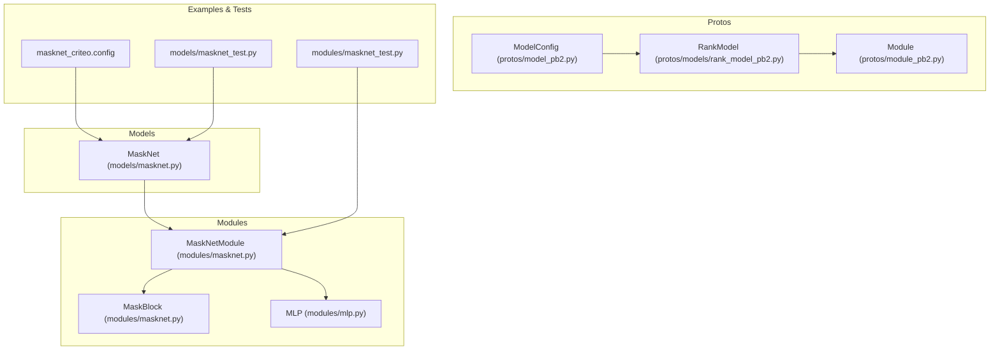
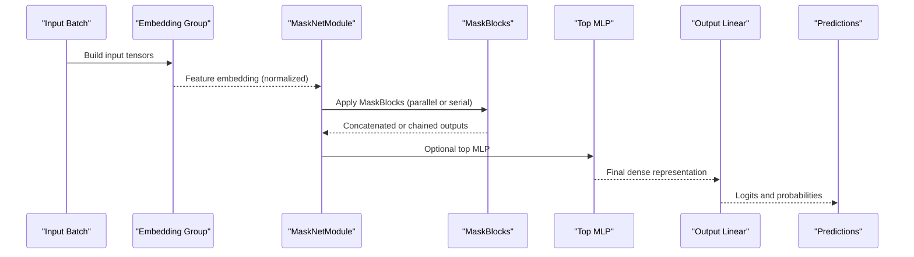
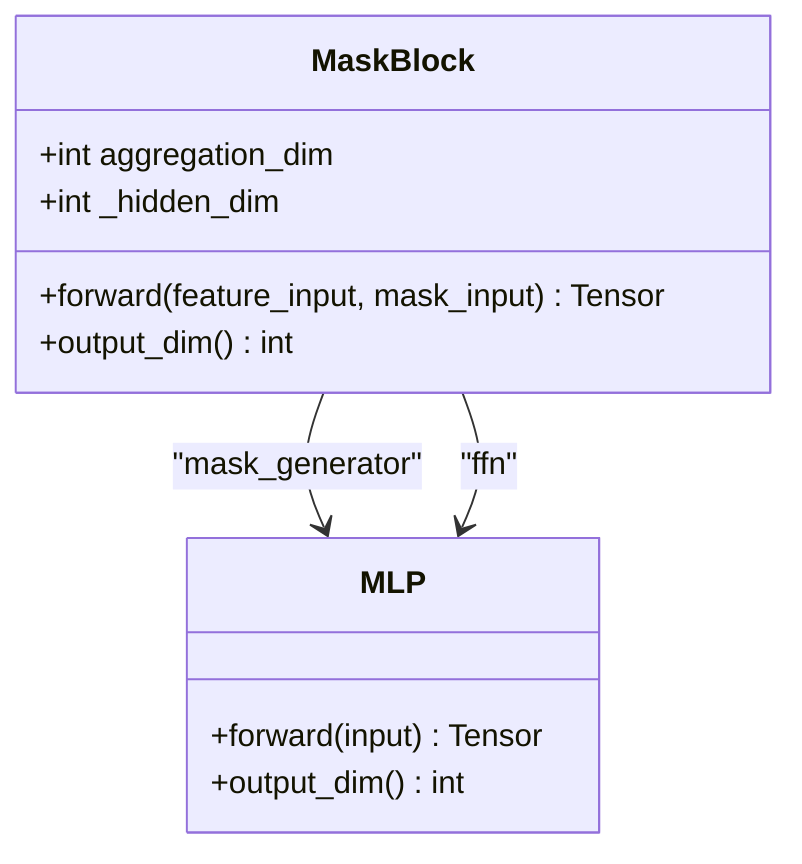
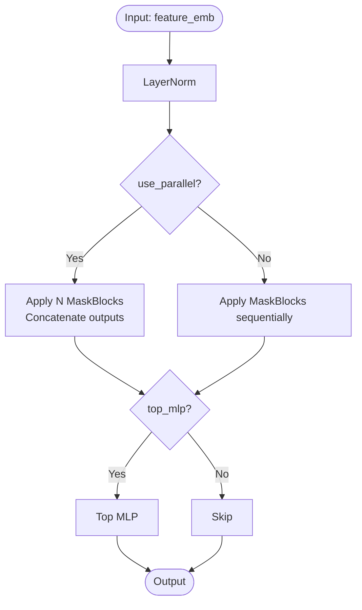
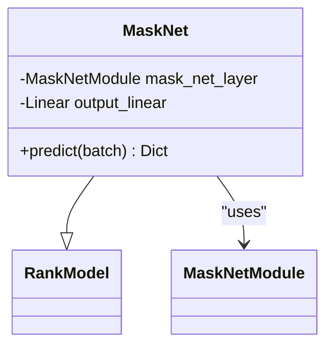
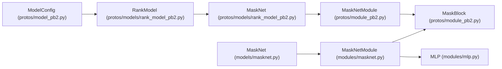

# MaskNet Model

<cite>
**Referenced Files in This Document**
- [masknet.py](file://tzrec/models/masknet.py)
- [masknet.py](file://tzrec/modules/masknet.py)
- [masknet.md](file://docs/source/models/masknet.md)
- [masknet_criteo.config](file://examples/masknet_criteo.config)
- [model_pb2.py](file://tzrec/protos/model_pb2.py)
- [rank_model_pb2.py](file://tzrec/protos/models/rank_model_pb2.py)
- [module_pb2.py](file://tzrec/protos/module_pb2.py)
- [mlp.py](file://tzrec/modules/mlp.py)
- [masknet_test.py](file://tzrec/models/masknet_test.py)
- [masknet_test.py](file://tzrec/modules/masknet_test.py)
</cite>

## Table of Contents

1. [Introduction](#introduction)
1. [Project Structure](#project-structure)
1. [Core Components](#core-components)
1. [Architecture Overview](#architecture-overview)
1. [Detailed Component Analysis](#detailed-component-analysis)
1. [Dependency Analysis](#dependency-analysis)
1. [Performance Considerations](#performance-considerations)
1. [Troubleshooting Guide](#troubleshooting-guide)
1. [Conclusion](#conclusion)
1. [Appendices](#appendices)

## Introduction

MaskNet is a recommendation model that introduces instance-aware masking into neural ranking architectures. It replaces traditional additive feature combinations with multiplicative interactions guided by learned masks, enabling stronger feature interactions and selective emphasis on important feature dimensions. The model consists of stacked MaskBlocks that apply attention-like gating to embeddings, followed by optional top MLP layers for final scoring.

MaskNet supports two execution modes:

- Parallel mode: Multiple MaskBlocks process the same normalized embedding independently and concatenate outputs.
- Serial mode: MaskBlocks are chained sequentially, with each subsequent block operating on the previous block’s output.

This document explains the MaskNet architecture, its components, configuration, training strategies, and practical usage patterns for recommendation tasks.

## Project Structure

The MaskNet implementation spans several modules:

- Model wrapper: Defines the high-level model interface and integrates with the feature embedding pipeline.
- Module implementation: Provides the core MaskNetModule and MaskBlock building blocks.
- Protos: Define configuration schemas for MaskNetModule and MaskBlock.
- Examples and tests: Demonstrate configuration and usage patterns.

**Diagram sources**

- \[masknet.py\](file://tzrec/models/masknet.py#L25-L66)
- \[masknet.py\](file://tzrec/modules/masknet.py#L88-L162)
- \[model_pb2.py\](file://tzrec/protos/model_pb2.py#L1-L43)
- \[rank_model_pb2.py\](file://tzrec/protos/models/rank_model_pb2.py#L1-L47)
- \[module_pb2.py\](file://tzrec/protos/module_pb2.py#L1-L83)
- \[masknet_criteo.config\](file://examples/masknet_criteo.config#L346-L412)
- \[masknet_test.py\](file://tzrec/models/masknet_test.py#L27-L102)
- \[masknet_test.py\](file://tzrec/modules/masknet_test.py#L22-L53)

**Section sources**

- \[masknet.py\](file://tzrec/models/masknet.py#L1-L66)
- \[masknet.py\](file://tzrec/modules/masknet.py#L1-L162)
- \[model_pb2.py\](file://tzrec/protos/model_pb2.py#L1-L43)
- \[rank_model_pb2.py\](file://tzrec/protos/models/rank_model_pb2.py#L1-L47)
- \[module_pb2.py\](file://tzrec/protos/module_pb2.py#L1-L83)
- \[masknet_criteo.config\](file://examples/masknet_criteo.config#L1-L413)
- \[masknet_test.py\](file://tzrec/models/masknet_test.py#L27-L102)
- \[masknet_test.py\](file://tzrec/modules/masknet_test.py#L22-L53)

## Core Components

- MaskNet (RankModel): Wraps MaskNetModule and adds a final linear head for classification. It builds inputs from the configured feature groups and applies the MaskNetModule to produce a dense representation, then projects to logits.
- MaskNetModule: Orchestrates MaskBlocks with support for parallel or serial execution. It normalizes inputs, applies MaskBlocks, concatenates outputs in parallel mode, and optionally passes through a top MLP.
- MaskBlock: Generates instance-aware attention weights from the embedding tensor, scales the input embedding by these weights, and feeds the result through a feed-forward network with LayerNorm and ReLU.
- MLP: A configurable stack of Perceptrons supporting batch normalization, layer normalization, activations, and dropout.

Key design principles:

- Instance-aware masking: The mask generator learns to emphasize important feature dimensions per sample.
- Multiplicative interactions: Weighted embeddings replace additive stacking, enabling richer feature interactions.
- Flexible composition: Parallel and serial modes offer different trade-offs between capacity and depth.

**Section sources**

- \[masknet.py\](file://tzrec/models/masknet.py#L25-L66)
- \[masknet.py\](file://tzrec/modules/masknet.py#L20-L86)
- \[masknet.py\](file://tzrec/modules/masknet.py#L88-L162)
- \[mlp.py\](file://tzrec/modules/mlp.py#L86-L178)

## Architecture Overview

The MaskNet architecture processes concatenated dense and sparse features through a shared embedding group. The pipeline is:

**Diagram sources**

- \[masknet.py\](file://tzrec/models/masknet.py#L57-L66)
- \[masknet.py\](file://tzrec/modules/masknet.py#L142-L161)

## Detailed Component Analysis

### MaskBlock

MaskBlock performs instance-aware masking:

- Input normalization: Normalizes the feature embedding before masking.
- Mask generation: A small MLP generates attention weights from the embedding itself.
- Weighted embedding: Multiplies the normalized embedding by the generated weights.
- Feed-forward: Applies a small FFN with LayerNorm and ReLU to the masked embedding.

**Diagram sources**

- \[masknet.py\](file://tzrec/modules/masknet.py#L20-L86)
- \[mlp.py\](file://tzrec/modules/mlp.py#L86-L178)

**Section sources**

- \[masknet.py\](file://tzrec/modules/masknet.py#L20-L86)

### MaskNetModule

MaskNetModule composes multiple MaskBlocks:

- Normalization: Applies LayerNorm to the input embedding.
- Parallel vs serial: In parallel mode, multiple MaskBlocks operate independently and concatenate outputs. In serial mode, outputs are chained.
- Top MLP: Optional dense layers applied after MaskBlocks to refine representations.

**Diagram sources**

- \[masknet.py\](file://tzrec/modules/masknet.py#L88-L162)
- \[mlp.py\](file://tzrec/modules/mlp.py#L86-L178)

**Section sources**

- \[masknet.py\](file://tzrec/modules/masknet.py#L88-L162)

### MaskNet (RankModel)

MaskNet integrates MaskNetModule into the model framework:

- Builds input from the configured feature group.
- Passes the embedding through MaskNetModule.
- Projects to logits using a final linear layer.

**Diagram sources**

- \[masknet.py\](file://tzrec/models/masknet.py#L25-L66)
- \[masknet.py\](file://tzrec/modules/masknet.py#L88-L162)

**Section sources**

- \[masknet.py\](file://tzrec/models/masknet.py#L25-L66)

## Dependency Analysis

MaskNet depends on:

- Protobuf schemas for configuration (ModelConfig, RankModel, Module).
- Feature embedding pipeline for input construction.
- MLP module for top layers.

**Diagram sources**

- \[model_pb2.py\](file://tzrec/protos/model_pb2.py#L1-L43)
- \[rank_model_pb2.py\](file://tzrec/protos/models/rank_model_pb2.py#L1-L47)
- \[module_pb2.py\](file://tzrec/protos/module_pb2.py#L1-L83)
- \[masknet.py\](file://tzrec/models/masknet.py#L25-L66)
- \[masknet.py\](file://tzrec/modules/masknet.py#L88-L162)
- \[mlp.py\](file://tzrec/modules/mlp.py#L86-L178)

**Section sources**

- \[model_pb2.py\](file://tzrec/protos/model_pb2.py#L1-L43)
- \[rank_model_pb2.py\](file://tzrec/protos/models/rank_model_pb2.py#L1-L47)
- \[module_pb2.py\](file://tzrec/protos/module_pb2.py#L1-L83)
- \[masknet.py\](file://tzrec/models/masknet.py#L25-L66)
- \[masknet.py\](file://tzrec/modules/masknet.py#L88-L162)
- \[mlp.py\](file://tzrec/modules/mlp.py#L86-L178)

## Performance Considerations

- Parallel vs serial: Parallel mode increases compute and memory due to concatenation of multiple MaskBlocks. Serial mode reduces memory footprint but may require more blocks to achieve comparable capacity.
- MaskBlock parameters: Larger hidden_dim and higher n_mask_blocks increase representational power but also computational cost. Choose based on dataset scale and hardware budget.
- Top MLP: Adding a top MLP improves expressiveness but also increases parameters and computation. Consider the trade-off against embedding dimension and downstream task complexity.
- Normalization: LayerNorm is lightweight and beneficial for stability; ensure it aligns with training dynamics.

[No sources needed since this section provides general guidance]

## Troubleshooting Guide

Common issues and resolutions:

- Invalid configuration: Ensure either aggregation_dim or reduction_ratio is provided in MaskBlock configuration. Both missing raises an error during initialization.
- Dimension mismatches: Verify that the feature embedding dimension matches the input_dim of MaskBlock and that top MLP hidden_units align with the final output dimension.
- Training instability: If training diverges, reduce learning rates or adjust top MLP dropout and regularization settings.
- Memory pressure: Switch to serial mode or reduce n_mask_blocks and hidden_dim to fit available memory.

**Section sources**

- \[masknet.py\](file://tzrec/modules/masknet.py#L43-L56)
- \[masknet.py\](file://tzrec/modules/masknet.py#L113-L128)

## Conclusion

MaskNet enhances recommendation models by introducing instance-aware masking that emphasizes important feature dimensions through multiplicative interactions. Its modular design allows flexible composition via parallel or serial MaskBlocks, while optional top MLP layers enable fine-tuned representation learning. Proper configuration of MaskBlock parameters and execution mode is crucial for balancing performance and resource usage.

[No sources needed since this section summarizes without analyzing specific files]

## Appendices

### Configuration Options

- Model-level configuration:

  - feature_groups: Defines the embedding group(s) used by the model.
  - mask_net: Contains mask_net_module configuration.
  - metrics: Evaluation metrics (e.g., AUC).
  - losses: Loss configuration (e.g., binary cross entropy).

- MaskNetModule configuration:

  - n_mask_blocks: Number of MaskBlocks to stack.
  - use_parallel: Whether to run MaskBlocks in parallel or serial mode.
  - mask_block: Configuration for each MaskBlock.
  - top_mlp: Optional MLP applied after MaskBlocks.

- MaskBlock configuration:

  - reduction_ratio: Ratio used to compute aggregation_dim from input_dim.
  - aggregation_dim: Fixed dimension for the aggregation layer.
  - hidden_dim: Hidden dimension for the FFN within MaskBlock.

- Example configuration:

  - See \[masknet_criteo.config\](file://examples/masknet_criteo.config#L346-L412) for a complete setup including feature definitions, feature groups, and model configuration.

**Section sources**

- \[masknet.md\](file://docs/source/models/masknet.md#L8-L31)
- \[masknet_criteo.config\](file://examples/masknet_criteo.config#L346-L412)
- \[module_pb2.py\](file://tzrec/protos/module_pb2.py#L64-L83)

### Practical Examples

- Model setup:

  - Configure feature groups and embedding dimensions.
  - Define mask_net_module with desired n_mask_blocks, use_parallel, mask_block, and optional top_mlp.
  - Set metrics and losses for training and evaluation.

- Feature engineering considerations:

  - Normalize continuous features appropriately (e.g., logarithmic transformations).
  - Bucket categorical features to manage embedding sizes.
  - Ensure consistent feature names across feature_configs and feature_groups.

- Evaluation procedures:

  - Use AUC or other appropriate metrics as configured.
  - Monitor training progress and adjust hyperparameters accordingly.

**Section sources**

- \[masknet_criteo.config\](file://examples/masknet_criteo.config#L33-L412)
- \[masknet_test.py\](file://tzrec/models/masknet_test.py#L27-L102)
- \[masknet_test.py\](file://tzrec/modules/masknet_test.py#L22-L53)

### Comparative Advantages

- Multiplicative interactions: MaskNet’s masking mechanism can capture richer feature interactions compared to additive stacking.
- Flexibility: Parallel and serial modes allow tuning capacity and memory usage.
- Modular design: Easy to integrate top MLP layers and adapt to various recommendation tasks.

[No sources needed since this section provides general guidance]
