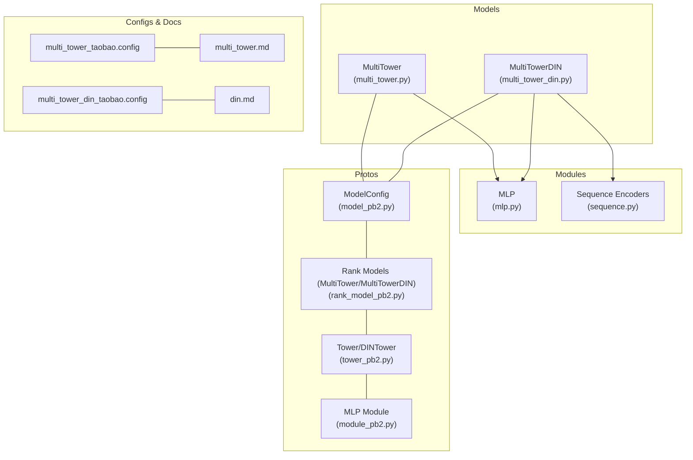
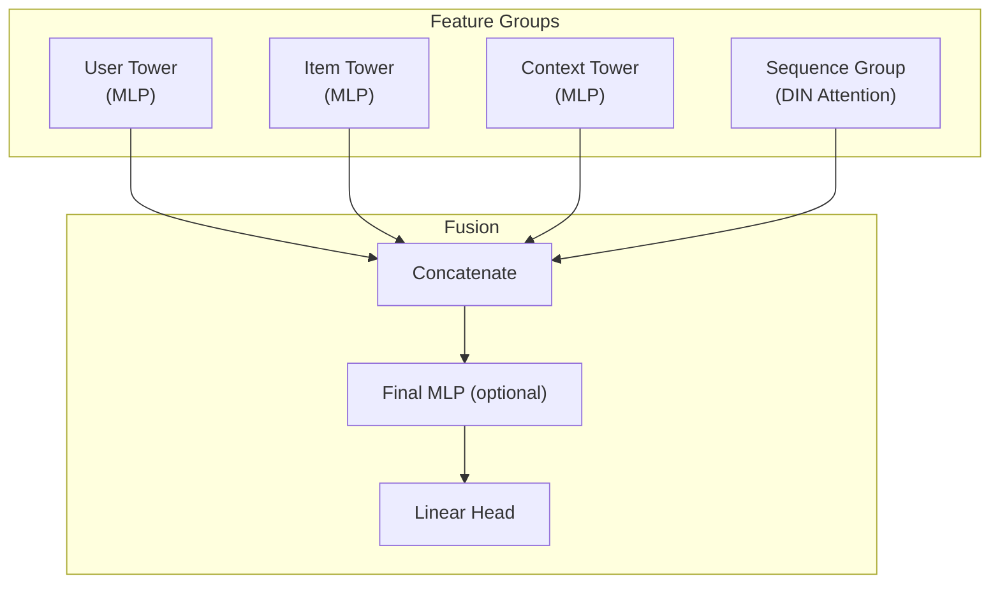
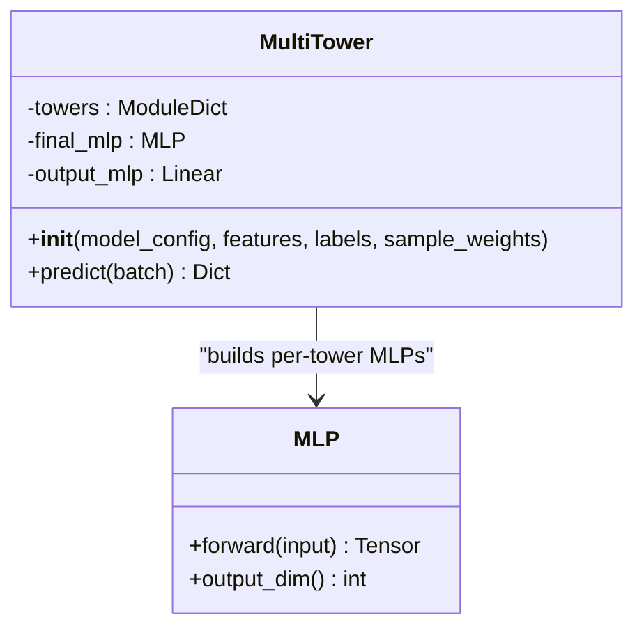
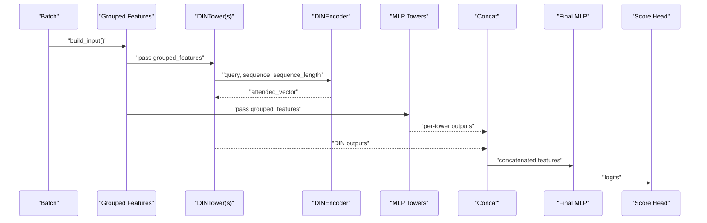
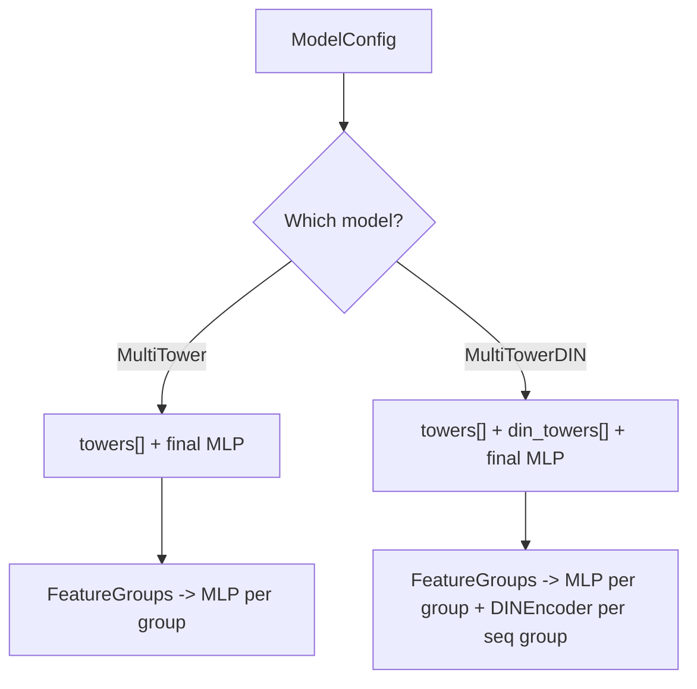
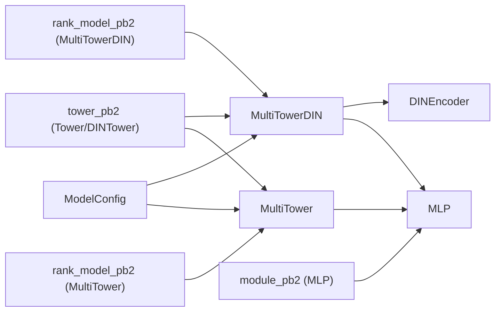

# Multi-Tower Architecture

<cite>
**Referenced Files in This Document**
- [multi_tower.py](file://tzrec/models/multi_tower.py)
- [multi_tower_din.py](file://tzrec/models/multi_tower_din.py)
- [multi_tower.md](file://docs/source/models/multi_tower.md)
- [din.md](file://docs/source/models/din.md)
- [multi_tower_taobao.config](file://examples/multi_tower_taobao.config)
- [multi_tower_din_taobao.config](file://examples/multi_tower_din_taobao.config)
- [mlp.py](file://tzrec/modules/mlp.py)
- [sequence.py](file://tzrec/modules/sequence.py)
- [model_pb2.py](file://tzrec/protos/model_pb2.py)
- [rank_model_pb2.py](file://tzrec/protos/models/rank_model_pb2.py)
- [tower_pb2.py](file://tzrec/protos/tower_pb2.py)
- [module_pb2.py](file://tzrec/protos/module_pb2.py)
- [multi_tower_test.py](file://tzrec/models/multi_tower_test.py)
- [multi_tower_din_test.py](file://tzrec/models/multi_tower_din_test.py)
</cite>

## Table of Contents

1. [Introduction](#introduction)
1. [Project Structure](#project-structure)
1. [Core Components](#core-components)
1. [Architecture Overview](#architecture-overview)
1. [Detailed Component Analysis](#detailed-component-analysis)
1. [Dependency Analysis](#dependency-analysis)
1. [Performance Considerations](#performance-considerations)
1. [Troubleshooting Guide](#troubleshooting-guide)
1. [Conclusion](#conclusion)
1. [Appendices](#appendices)

## Introduction

This document explains the MultiTower model family in TorchEasyRec, focusing on the standard MultiTower and the MultiTowerDIN variant. Both models adopt a multi-tower architecture that processes distinct feature groups (e.g., user, item, context) through dedicated towers, then fuses their representations for scoring. The standard MultiTower applies per-group MLP towers, while MultiTowerDIN augments selected groups with attention over sequential behavior to capture temporal dynamics. The document covers architecture design, attention mechanisms, fusion strategies, configuration options, and practical examples for real-world recommendation scenarios.

## Project Structure

The MultiTower family resides in the models package and integrates with feature grouping, embedding collection, and sequence encoders. The configuration is defined via Protocol Buffers and consumed at runtime to construct the model and its towers.

**Diagram sources**

- \[multi_tower.py\](file://tzrec/models/multi_tower.py#L25-L86)
- \[multi_tower_din.py\](file://tzrec/models/multi_tower_din.py#L26-L105)
- \[mlp.py\](file://tzrec/modules/mlp.py#L86-L178)
- \[sequence.py\](file://tzrec/modules/sequence.py#L70-L134)
- \[model_pb2.py\](file://tzrec/protos/model_pb2.py#L25-L42)
- \[rank_model_pb2.py\](file://tzrec/protos/models/rank_model_pb2.py#L30-L45)
- \[tower_pb2.py\](file://tzrec/protos/tower_pb2.py#L21-L33)
- \[module_pb2.py\](file://tzrec/protos/module_pb2.py#L17-L83)
- \[multi_tower_taobao.config\](file://examples/multi_tower_taobao.config#L158-L206)
- \[multi_tower_din_taobao.config\](file://examples/multi_tower_din_taobao.config#L189-L243)
- \[multi_tower.md\](file://docs/source/models/multi_tower.md#L10-L72)
- \[din.md\](file://docs/source/models/din.md#L59-L89)

**Section sources**

- \[multi_tower.py\](file://tzrec/models/multi_tower.py#L25-L86)
- \[multi_tower_din.py\](file://tzrec/models/multi_tower_din.py#L26-L105)
- \[model_pb2.py\](file://tzrec/protos/model_pb2.py#L25-L42)
- \[rank_model_pb2.py\](file://tzrec/protos/models/rank_model_pb2.py#L30-L45)
- \[tower_pb2.py\](file://tzrec/protos/tower_pb2.py#L21-L33)
- \[module_pb2.py\](file://tzrec/protos/module_pb2.py#L17-L83)
- \[multi_tower_taobao.config\](file://examples/multi_tower_taobao.config#L158-L206)
- \[multi_tower_din_taobao.config\](file://examples/multi_tower_din_taobao.config#L189-L243)
- \[multi_tower.md\](file://docs/source/models/multi_tower.md#L10-L72)
- \[din.md\](file://docs/source/models/din.md#L59-L89)

## Core Components

- MultiTower: Implements a modular multi-tower architecture. Each feature group is processed by a dedicated MLP tower; outputs are concatenated and optionally passed through a final MLP before scoring.
- MultiTowerDIN: Extends MultiTower by adding DINAware towers for sequential feature groups. Each DINTower computes attention over the sequence representation using a query and sequence embedding, then produces a context-aware vector fused with deep towers.
- MLP: A configurable stack of linear layers with activation, optional batch/layer normalization, and dropout.
- Sequence Encoders: Provide attention-based or pooling-based aggregation for sequence features (e.g., DINEncoder).

Key implementation references:

- MultiTower initialization and forward pass: \[multi_tower.py\](file://tzrec/models/multi_tower.py#L35-L86)
- MultiTowerDIN initialization and forward pass: \[multi_tower_din.py\](file://tzrec/models/multi_tower_din.py#L36-L105)
- MLP module: \[mlp.py\](file://tzrec/modules/mlp.py#L86-L178)
- DINEncoder attention mechanism: \[sequence.py\](file://tzrec/modules/sequence.py#L70-L134)

**Section sources**

- \[multi_tower.py\](file://tzrec/models/multi_tower.py#L25-L86)
- \[multi_tower_din.py\](file://tzrec/models/multi_tower_din.py#L26-L105)
- \[mlp.py\](file://tzrec/modules/mlp.py#L86-L178)
- \[sequence.py\](file://tzrec/modules/sequence.py#L70-L134)

## Architecture Overview

The MultiTower family separates feature processing into independent towers, enabling specialized representations per domain (user, item, context). Fusion occurs by concatenating tower outputs followed by optional final MLP layers. MultiTowerDIN augments this with attention over sequences to emphasize recent or relevant interactions.

**Diagram sources**

- \[multi_tower.py\](file://tzrec/models/multi_tower.py#L46-L63)
- \[multi_tower_din.py\](file://tzrec/models/multi_tower_din.py#L47-L80)
- \[sequence.py\](file://tzrec/modules/sequence.py#L70-L134)

## Detailed Component Analysis

### MultiTower Standard Implementation

- Tower construction: For each configured tower, the model computes the total embedding dimension for the group and builds an MLP tower accordingly.
- Fusion: Concatenates all tower outputs along the feature dimension.
- Final MLP: Optional global MLP applied after concatenation to further transform the fused representation.
- Scoring head: Linear layer mapping to the number of classes.

**Diagram sources**

- \[multi_tower.py\](file://tzrec/models/multi_tower.py#L35-L86)
- \[mlp.py\](file://tzrec/modules/mlp.py#L86-L178)

**Section sources**

- \[multi_tower.py\](file://tzrec/models/multi_tower.py#L35-L86)
- \[mlp.py\](file://tzrec/modules/mlp.py#L86-L178)

### MultiTowerDIN Attention Mechanism

- DINTower construction: For each sequence feature group, constructs a DINEncoder that takes a query vector and a sequence tensor, then applies attention to produce a weighted summary.
- Attention computation: Concatenates query with sequence elements and combinations (element-wise difference and product), passes through an MLP, then a linear layer to obtain attention scores, masked by sequence length, normalized, and used to compute a weighted sum over the sequence.
- Fusion: Concatenates both MLP towers and DINTowers, then proceeds with optional final MLP and scoring.

**Diagram sources**

- \[multi_tower_din.py\](file://tzrec/models/multi_tower_din.py#L82-L105)
- \[sequence.py\](file://tzrec/modules/sequence.py#L106-L133)

**Section sources**

- \[multi_tower_din.py\](file://tzrec/models/multi_tower_din.py#L36-L105)
- \[sequence.py\](file://tzrec/modules/sequence.py#L70-L134)

### Configuration Options and Protobuf Contracts

- ModelConfig: Contains feature_groups and model-specific sections (multi_tower or multi_tower_din).
- MultiTower: Composed of multiple Tower entries (input group name and MLP config) and an optional final MLP.
- MultiTowerDIN: Composed of Tower entries (for deep groups) and DINTower entries (for sequence groups), each specifying an attn_mlp MLP.

**Diagram sources**

- \[model_pb2.py\](file://tzrec/protos/model_pb2.py#L25-L42)
- \[rank_model_pb2.py\](file://tzrec/protos/models/rank_model_pb2.py#L30-L45)
- \[tower_pb2.py\](file://tzrec/protos/tower_pb2.py#L21-L33)
- \[module_pb2.py\](file://tzrec/protos/module_pb2.py#L17-L83)

**Section sources**

- \[model_pb2.py\](file://tzrec/protos/model_pb2.py#L25-L42)
- \[rank_model_pb2.py\](file://tzrec/protos/models/rank_model_pb2.py#L30-L45)
- \[tower_pb2.py\](file://tzrec/protos/tower_pb2.py#L21-L33)
- \[module_pb2.py\](file://tzrec/protos/module_pb2.py#L17-L83)

### Practical Examples and Training Workflows

- Standard MultiTower example: Configure feature_groups for user and item, define two towers with MLP hidden_units, and an optional final MLP. Loss and metrics are specified in ModelConfig.
- MultiTowerDIN example: Define a deep feature group and a sequence feature group, configure a DINTower with attn_mlp, and optionally a final MLP.

References:

- Standard MultiTower config: \[multi_tower_taobao.config\](file://examples/multi_tower_taobao.config#L158-L206)
- MultiTowerDIN config: \[multi_tower_din_taobao.config\](file://examples/multi_tower_din_taobao.config#L189-L243)
- Model docs: \[multi_tower.md\](file://docs/source/models/multi_tower.md#L10-L72), \[din.md\](file://docs/source/models/din.md#L59-L89)

Training workflow highlights:

- Feature definition and embedding dimensions in feature_configs.
- Feature groups mapping features to groups (DEEP or SEQUENCE).
- Model selection via multi_tower or multi_tower_din blocks.
- Metrics and losses configured globally in ModelConfig.

**Section sources**

- \[multi_tower_taobao.config\](file://examples/multi_tower_taobao.config#L158-L206)
- \[multi_tower_din_taobao.config\](file://examples/multi_tower_din_taobao.config#L189-L243)
- \[multi_tower.md\](file://docs/source/models/multi_tower.md#L10-L72)
- \[din.md\](file://docs/source/models/din.md#L59-L89)

## Dependency Analysis

- MultiTower depends on MLP for per-tower transformations and optionally a final MLP before scoring.
- MultiTowerDIN additionally depends on DINEncoder for attention over sequences.
- Protobuf definitions specify the configuration schema for towers, MLP units, and attention modules.

**Diagram sources**

- \[multi_tower.py\](file://tzrec/models/multi_tower.py#L46-L63)
- \[multi_tower_din.py\](file://tzrec/models/multi_tower_din.py#L56-L80)
- \[sequence.py\](file://tzrec/modules/sequence.py#L70-L134)
- \[model_pb2.py\](file://tzrec/protos/model_pb2.py#L25-L42)
- \[rank_model_pb2.py\](file://tzrec/protos/models/rank_model_pb2.py#L30-L45)
- \[tower_pb2.py\](file://tzrec/protos/tower_pb2.py#L21-L33)
- \[module_pb2.py\](file://tzrec/protos/module_pb2.py#L17-L83)

**Section sources**

- \[multi_tower.py\](file://tzrec/models/multi_tower.py#L46-L63)
- \[multi_tower_din.py\](file://tzrec/models/multi_tower_din.py#L56-L80)
- \[sequence.py\](file://tzrec/modules/sequence.py#L70-L134)
- \[model_pb2.py\](file://tzrec/protos/model_pb2.py#L25-L42)
- \[rank_model_pb2.py\](file://tzrec/protos/models/rank_model_pb2.py#L30-L45)
- \[tower_pb2.py\](file://tzrec/protos/tower_pb2.py#L21-L33)
- \[module_pb2.py\](file://tzrec/protos/module_pb2.py#L17-L83)

## Performance Considerations

- Modular towers enable independent tuning of hidden_units and normalization per group, potentially reducing interference between domains.
- Attention in MultiTowerDIN adds computational overhead proportional to sequence length and attention MLP width; consider limiting max_seq_length and using efficient masking.
- Final MLP can increase capacity; balance representational power against training stability and inference latency.
- Embedding dimensions can vary per group, allowing memory and accuracy trade-offs per feature domain.

[No sources needed since this section provides general guidance]

## Troubleshooting Guide

Common issues and checks:

- Shape mismatches during concatenation: Verify that the total fused dimension matches the input of the final MLP and the score head.
- Sequence attention errors: Ensure query and sequence embedding dimensions are compatible and that sequence_length masks are correctly computed.
- Configuration mismatches: Confirm that each tower’s input matches a declared feature_group name and that DINTower inputs correspond to SEQUENCE groups.

Validation references:

- MultiTower shape and forward pass tests: \[multi_tower_test.py\](file://tzrec/models/multi_tower_test.py#L38-L110)
- MultiTowerDIN shape and forward pass tests: \[multi_tower_din_test.py\](file://tzrec/models/multi_tower_din_test.py#L54-L194)

**Section sources**

- \[multi_tower_test.py\](file://tzrec/models/multi_tower_test.py#L38-L110)
- \[multi_tower_din_test.py\](file://tzrec/models/multi_tower_din_test.py#L54-L194)

## Conclusion

The MultiTower family offers a flexible, modular architecture for recommendation tasks. MultiTower excels in structured feature domains by separating user, item, and context representations into dedicated towers. MultiTowerDIN extends this by incorporating attention over sequential behavior, capturing temporal relevance. Proper configuration of feature groups, tower MLPs, and attention parameters enables strong performance across diverse recommendation scenarios.

[No sources needed since this section summarizes without analyzing specific files]

## Appendices

### Choosing Between MultiTower and Other Architectures

- Choose MultiTower when:
  - Feature groups are well-separated and benefit from independent per-group modeling.
  - There is no strong need for attention over long sequences.
- Choose MultiTowerDIN when:
  - Sequential behavior (e.g., clicks, views) is important and should influence the final score.
  - You want attention-based summarization of recent interactions.
- Compare with other architectures (e.g., DeepFM, Wide & Deep) based on dataset characteristics, interpretability needs, and computational budget.

[No sources needed since this section provides general guidance]
