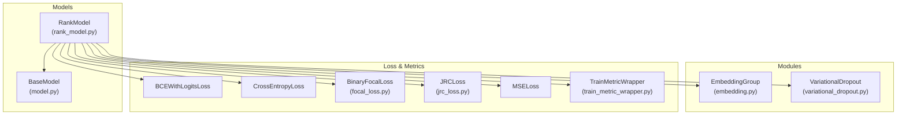
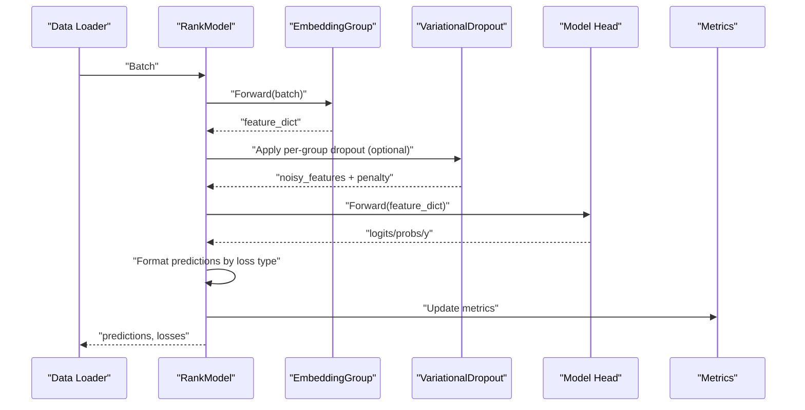
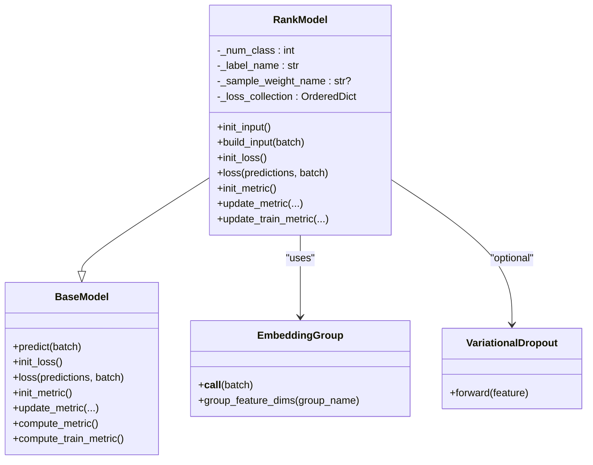
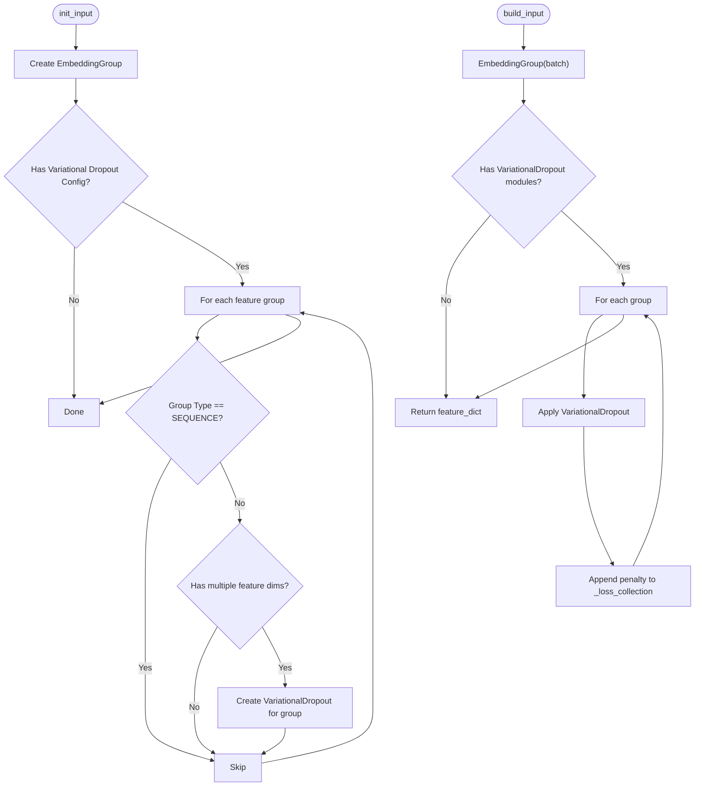
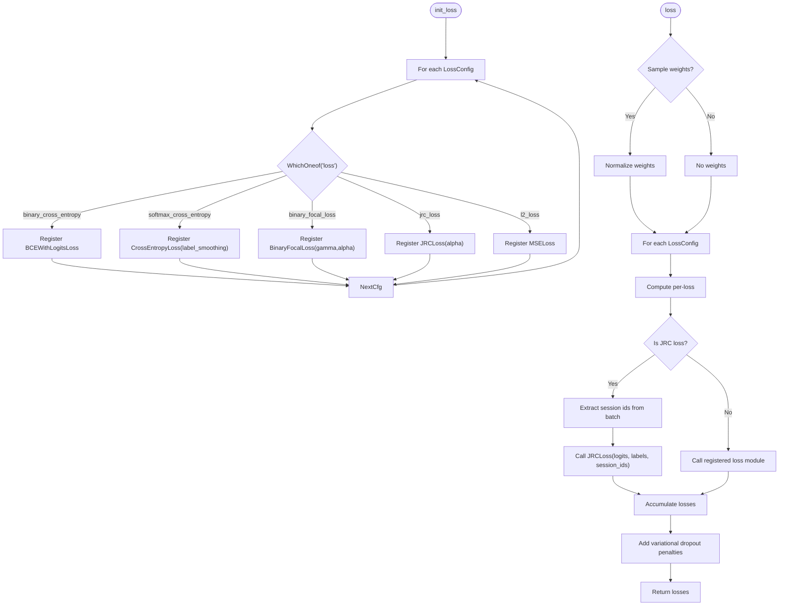
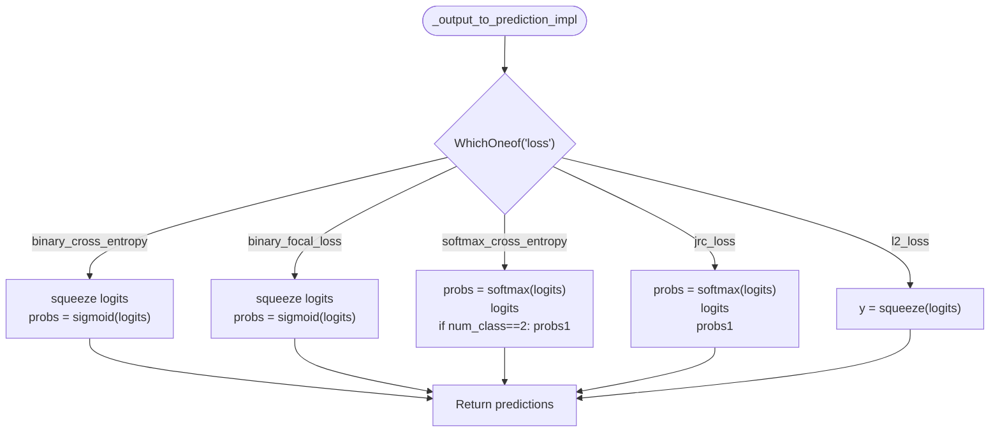
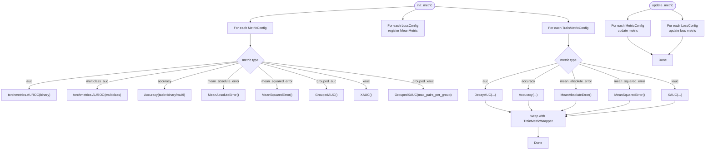
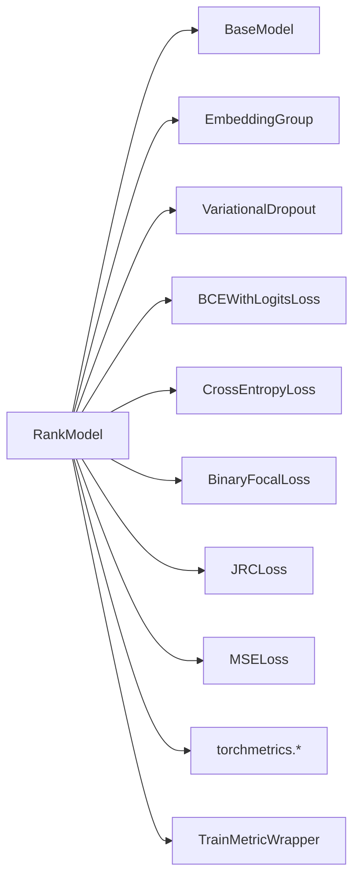

# Rank Model Base Class

<cite>
**Referenced Files in This Document**
- [rank_model.py](file://tzrec/models/rank_model.py)
- [model.py](file://tzrec/models/model.py)
- [embedding.py](file://tzrec/modules/embedding.py)
- [variational_dropout.py](file://tzrec/modules/variational_dropout.py)
- [focal_loss.py](file://tzrec/loss/focal_loss.py)
- [jrc_loss.py](file://tzrec/loss/jrc_loss.py)
- [train_metric_wrapper.py](file://tzrec/metrics/train_metric_wrapper.py)
- [deepfm_criteo.config](file://examples/deepfm_criteo.config)
- [dssm_taobao.config](file://examples/dssm_taobao.config)
- [model_pb2.py](file://tzrec/protos/model_pb2.py)
</cite>

## Table of Contents

1. [Introduction](#introduction)
1. [Project Structure](#project-structure)
1. [Core Components](#core-components)
1. [Architecture Overview](#architecture-overview)
1. [Detailed Component Analysis](#detailed-component-analysis)
1. [Dependency Analysis](#dependency-analysis)
1. [Performance Considerations](#performance-considerations)
1. [Troubleshooting Guide](#troubleshooting-guide)
1. [Conclusion](#conclusion)
1. [Appendices](#appendices)

## Introduction

This document explains the RankModel base class that underpins all ranking models in TorchEasyRec. It covers the architectural design, inheritance from BaseModel, and how RankModel differs from candidate generation models. We describe the core methods for input initialization, building inputs, loss initialization, and metric initialization. We also detail embedding group construction, variational dropout integration, supported loss functions (binary cross entropy, softmax cross entropy, focal loss, JRC loss, L2 loss), prediction output formatting, and the metric initialization system. Finally, we provide configuration examples and explain RankModel’s place in the broader TorchEasyRec framework.

## Project Structure

RankModel resides in the models package and builds upon the generic BaseModel. It integrates with:

- EmbeddingGroup for efficient feature embedding per group
- VariationalDropout for regularized feature selection
- Loss modules (binary cross entropy, softmax cross entropy, focal loss, JRC loss, L2)
- Metric modules (AUROC, accuracy, MAE, MSE, grouped AUC/XAUC, and train-time decayed metrics)

**Diagram sources**

- \[rank_model.py\](file://tzrec/models/rank_model.py#L56-L513)
- \[model.py\](file://tzrec/models/model.py#L39-L423)
- \[embedding.py\](file://tzrec/modules/embedding.py#L139-L200)
- \[variational_dropout.py\](file://tzrec/modules/variational_dropout.py#L38-L119)
- \[focal_loss.py\](file://tzrec/loss/focal_loss.py#L18-L73)
- \[jrc_loss.py\](file://tzrec/loss/jrc_loss.py#L29-L118)
- \[train_metric_wrapper.py\](file://tzrec/metrics/train_metric_wrapper.py#L20-L63)

**Section sources**

- \[rank_model.py\](file://tzrec/models/rank_model.py#L56-L513)
- \[model.py\](file://tzrec/models/model.py#L39-L423)

## Core Components

- RankModel extends BaseModel and adds ranking-specific behaviors:
  - EmbeddingGroup initialization and per-feature-group variational dropout
  - Prediction output formatting tailored to loss types
  - Multi-loss support and metric initialization
- BaseModel defines the generic model interface and shared utilities (loss/metric registries, train/predict wrappers).

Key responsibilities:

- init_input(): Build EmbeddingGroup and optional per-group VariationalDropout
- build_input(): Apply embeddings and optional variational dropout to feature groups
- init_loss(): Register loss modules based on configuration
- loss(): Compute loss with optional sample weights and variational dropout penalties
- init_metric(): Initialize evaluation and train-time metrics
- update_metric()/update_train_metric(): Update metric states during training/evaluation

**Section sources**

- \[rank_model.py\](file://tzrec/models/rank_model.py#L84-L132)
- \[rank_model.py\](file://tzrec/models/rank_model.py#L182-L213)
- \[rank_model.py\](file://tzrec/models/rank_model.py#L261-L284)
- \[rank_model.py\](file://tzrec/models/rank_model.py#L286-L366)
- \[model.py\](file://tzrec/models/model.py#L39-L138)

## Architecture Overview

RankModel sits atop BaseModel and orchestrates feature embedding, optional regularization via variational dropout, and loss/metric computation. The pipeline is:

- Input parsing → EmbeddingGroup → optional VariationalDropout → model head → predictions → loss/metrics

**Diagram sources**

- \[rank_model.py\](file://tzrec/models/rank_model.py#L115-L132)
- \[rank_model.py\](file://tzrec/models/rank_model.py#L134-L180)
- \[rank_model.py\](file://tzrec/models/rank_model.py#L261-L284)
- \[embedding.py\](file://tzrec/modules/embedding.py#L139-L200)
- \[variational_dropout.py\](file://tzrec/modules/variational_dropout.py#L107-L119)

## Detailed Component Analysis

### RankModel Class Design

- Inherits from BaseModel and initializes internal state (number of classes, label name, optional sample weights).
- Manages:
  - EmbeddingGroup for grouped feature embeddings
  - ModuleDict of per-feature-group VariationalDropout modules
  - Loss and metric registries

**Diagram sources**

- \[model.py\](file://tzrec/models/model.py#L39-L138)
- \[rank_model.py\](file://tzrec/models/rank_model.py#L56-L132)
- \[embedding.py\](file://tzrec/modules/embedding.py#L139-L200)
- \[variational_dropout.py\](file://tzrec/modules/variational_dropout.py#L38-L119)

**Section sources**

- \[rank_model.py\](file://tzrec/models/rank_model.py#L56-L132)
- \[model.py\](file://tzrec/models/model.py#L39-L138)

### Input Initialization and Building

- init_input():
  - Creates EmbeddingGroup from features and feature_groups
  - Optionally creates per-feature-group VariationalDropout modules for non-sequential groups
- build_input():
  - Runs batch through EmbeddingGroup
  - Applies variational dropout to each group and collects per-group penalties into loss collection

**Diagram sources**

- \[rank_model.py\](file://tzrec/models/rank_model.py#L84-L132)
- \[embedding.py\](file://tzrec/modules/embedding.py#L139-L200)
- \[variational_dropout.py\](file://tzrec/modules/variational_dropout.py#L107-L119)

**Section sources**

- \[rank_model.py\](file://tzrec/models/rank_model.py#L84-L132)

### Loss Initialization and Computation

Supported losses:

- Binary cross entropy (BCEWithLogitsLoss)
- Softmax cross entropy (CrossEntropyLoss) with label smoothing
- Binary focal loss (BinaryFocalLoss)
- JRC loss (JRCLoss) for session-based ranking
- L2 loss (MSELoss)

Initialization:

- init_loss() iterates configured losses and registers appropriate loss modules
- Reduction defaults to “none” when sample weights are present, otherwise “mean”

Computation:

- loss() computes per-loss values and optionally applies normalized sample weights
- For JRC loss, extracts session ids from batch sparse features and passes to loss module
- Variational dropout penalties are appended to losses from \_loss_collection

**Diagram sources**

- \[rank_model.py\](file://tzrec/models/rank_model.py#L182-L213)
- \[rank_model.py\](file://tzrec/models/rank_model.py#L261-L284)
- \[focal_loss.py\](file://tzrec/loss/focal_loss.py#L18-L73)
- \[jrc_loss.py\](file://tzrec/loss/jrc_loss.py#L29-L118)

**Section sources**

- \[rank_model.py\](file://tzrec/models/rank_model.py#L182-L213)
- \[rank_model.py\](file://tzrec/models/rank_model.py#L261-L284)

### Prediction Output Formatting

RankModel converts raw model outputs into standardized prediction tensors depending on the configured loss:

- Binary/ focal loss: logits and probabilities
- Softmax cross entropy: logits, probabilities, and class-1 probability for two-class case
- JRC loss: logits, probabilities, and class-1 probability
- L2 loss: predicted y

**Diagram sources**

- \[rank_model.py\](file://tzrec/models/rank_model.py#L134-L180)

**Section sources**

- \[rank_model.py\](file://tzrec/models/rank_model.py#L134-L180)

### Metric Initialization and Updates

RankModel supports:

- Evaluation metrics: AUROC (binary/multiclass), accuracy, MAE, MSE, grouped AUC/XAUC
- Train metrics: DecayAUC, accuracy, MAE/MSE, XAUC (with decay wrapper)
- Loss metrics: MeanMetric for each configured loss

Initialization:

- init_metric() registers:
  - Standard metrics for configured MetricConfig entries
  - Per-loss metrics via BaseModel’s helper
  - Train metrics via TrainMetricWrapper for TrainMetricConfig entries

Updates:

- update_metric() updates evaluation metrics using predictions and labels
- update_train_metric() updates train metrics with decayed behavior

**Diagram sources**

- \[rank_model.py\](file://tzrec/models/rank_model.py#L286-L366)
- \[model.py\](file://tzrec/models/model.py#L185-L202)
- \[train_metric_wrapper.py\](file://tzrec/metrics/train_metric_wrapper.py#L20-L63)

**Section sources**

- \[rank_model.py\](file://tzrec/models/rank_model.py#L286-L366)
- \[model.py\](file://tzrec/models/model.py#L185-L202)
- \[train_metric_wrapper.py\](file://tzrec/metrics/train_metric_wrapper.py#L20-L63)

### Relationship Between Ranking and Candidate Generation Models

- Ranking models (RankModel subclasses) produce per-example scores or probabilities for scoring and reranking.
- Candidate generation models (e.g., DSSM) often output embeddings for retrieval and may use different loss types (e.g., softmax cross entropy for contrastive training).
- Both share the same embedding infrastructure and metric systems, but differ in output interpretation and typical loss choices.

[No sources needed since this section provides conceptual comparison]

## Dependency Analysis

RankModel depends on:

- BaseModel for shared interfaces and utilities
- EmbeddingGroup for grouped feature embeddings
- VariationalDropout for per-feature-group regularization
- Loss modules for training objectives
- Metric modules for evaluation and training monitoring

**Diagram sources**

- \[rank_model.py\](file://tzrec/models/rank_model.py#L56-L513)
- \[model.py\](file://tzrec/models/model.py#L39-L138)
- \[embedding.py\](file://tzrec/modules/embedding.py#L139-L200)
- \[variational_dropout.py\](file://tzrec/modules/variational_dropout.py#L38-L119)
- \[focal_loss.py\](file://tzrec/loss/focal_loss.py#L18-L73)
- \[jrc_loss.py\](file://tzrec/loss/jrc_loss.py#L29-L118)
- \[train_metric_wrapper.py\](file://tzrec/metrics/train_metric_wrapper.py#L20-L63)

**Section sources**

- \[rank_model.py\](file://tzrec/models/rank_model.py#L56-L513)
- \[model.py\](file://tzrec/models/model.py#L39-L138)

## Performance Considerations

- Variational dropout adds lightweight regularization with per-feature dropout probabilities and a penalty term scaled by batch size.
- Using grouped embeddings reduces memory footprint and improves throughput by sharing embedding tables across related features.
- Sample weights normalization ensures unbiased gradient updates when re-weighting examples.
- Mixed precision training can be enabled via the training wrapper to reduce memory and improve speed.

[No sources needed since this section provides general guidance]

## Troubleshooting Guide

Common issues and resolutions:

- Incorrect num_class for loss/metric:
  - Binary/ focal loss requires num_class == 1
  - Softmax/JRC loss requires num_class > 1
  - Multiclass AUC requires num_class > 1
- JRC loss requires session ids in batch sparse features under the configured session_name
- Grouped AUC/XAUC require grouping keys present in batch sparse features
- Ensure feature groups are properly defined and feature names match those in the dataset

**Section sources**

- \[rank_model.py\](file://tzrec/models/rank_model.py#L143-L167)
- \[rank_model.py\](file://tzrec/models/rank_model.py#L241-L256)
- \[rank_model.py\](file://tzrec/models/rank_model.py#L314-L326)

## Conclusion

RankModel provides a robust, extensible foundation for ranking tasks in TorchEasyRec. By centralizing embedding group management, optional variational dropout, multi-loss support, and comprehensive metrics, it enables consistent model development across diverse ranking scenarios. Its design cleanly separates concerns between input preparation, loss computation, and evaluation, while integrating seamlessly with the broader TorchEasyRec ecosystem.

## Appendices

### Configuration Examples

- Binary classification ranking (CTR) with BCE and AUC:

  - Define feature groups (wide/deep), model config, and a single binary cross entropy loss
  - Example: \[deepfm_criteo.config\](file://examples/deepfm_criteo.config#L278-L396)

- Multi-class ranking with softmax cross entropy and multiclass AUC:

  - Define feature groups and softmax cross entropy loss
  - Example: \[dssm_taobao.config\](file://examples/dssm_taobao.config#L201-L266)

- Session-aware ranking with JRC loss:

  - Configure JRC loss with session_name and ensure session ids are present in batch sparse features

- Using feature groups:

  - Feature groups define which features go into which embedding collections; see examples for wide/deep/sequence group definitions

- Model configuration schema:

  - ModelConfig includes feature_groups, losses, metrics, train_metrics, and optional variational_dropout
  - Reference: \[model_pb2.py\](file://tzrec/protos/model_pb2.py#L1-L43)

**Section sources**

- \[deepfm_criteo.config\](file://examples/deepfm_criteo.config#L278-L396)
- \[dssm_taobao.config\](file://examples/dssm_taobao.config#L201-L266)
- \[model_pb2.py\](file://tzrec/protos/model_pb2.py#L1-L43)
