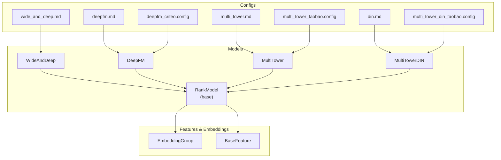
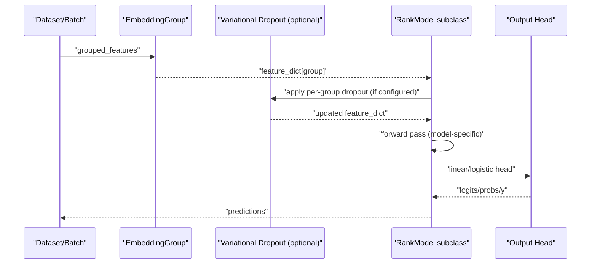
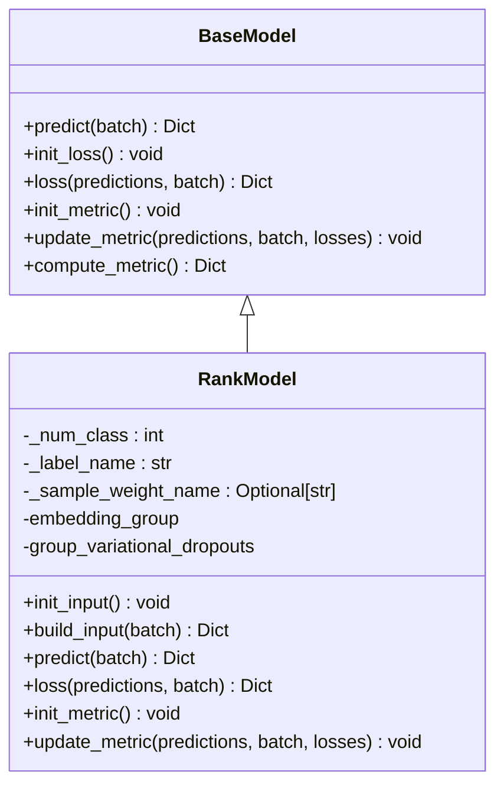
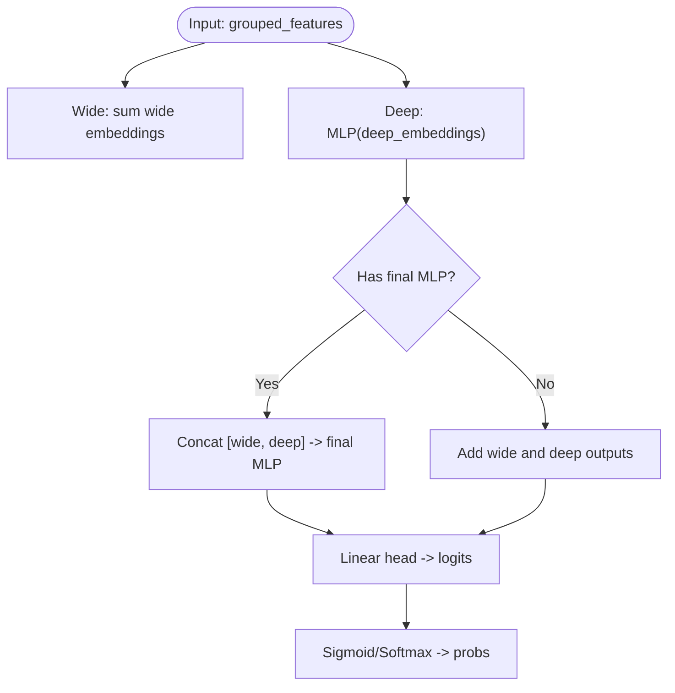
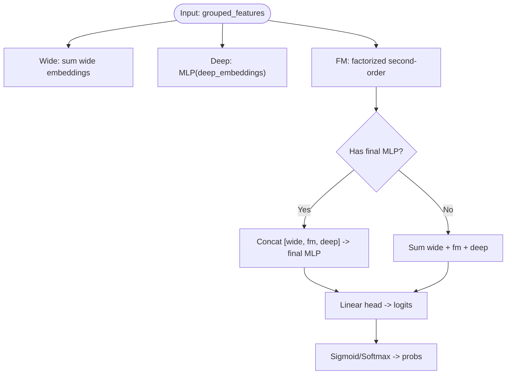
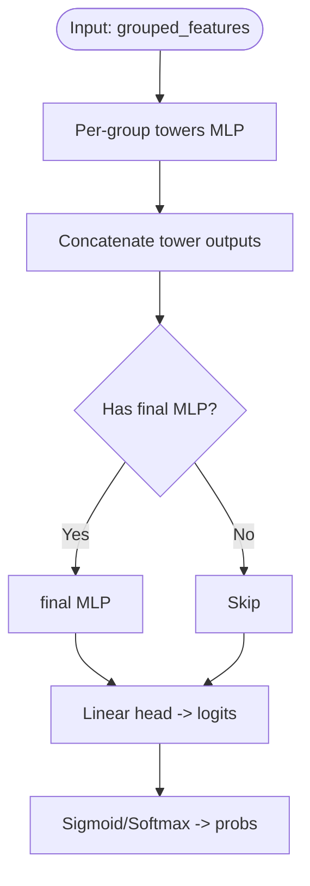
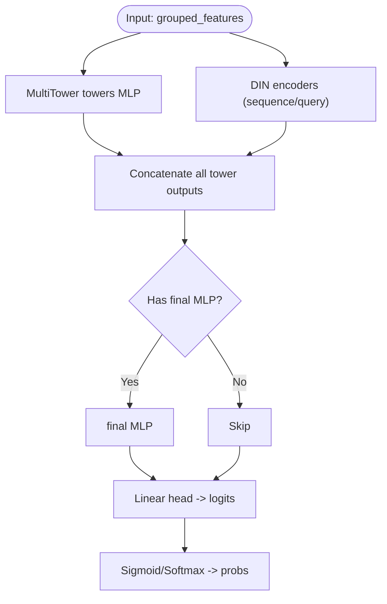
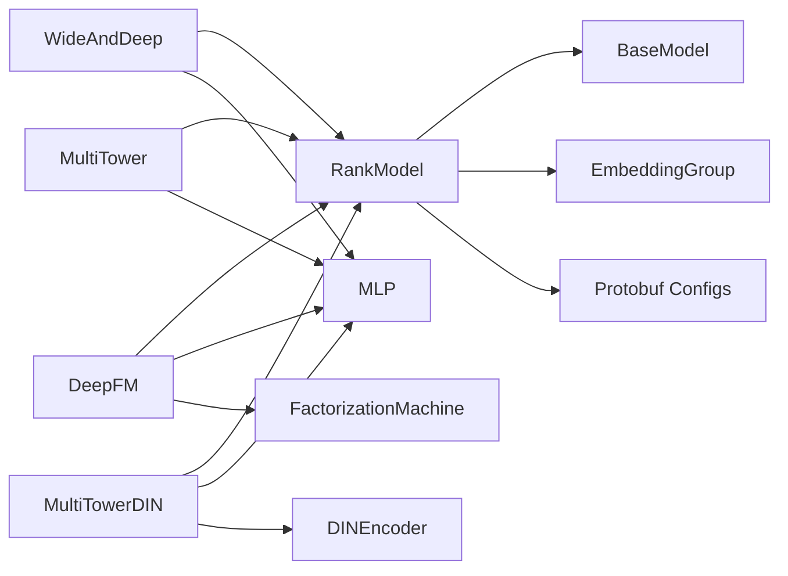

# Rank Models (Scoring)

<cite>
**Referenced Files in This Document**
- [rank_model.py](file://tzrec/models/rank_model.py)
- [wide_and_deep.py](file://tzrec/models/wide_and_deep.py)
- [deepfm.py](file://tzrec/models/deepfm.py)
- [multi_tower.py](file://tzrec/models/multi_tower.py)
- [multi_tower_din.py](file://tzrec/models/multi_tower_din.py)
- [model.py](file://tzrec/models/model.py)
- [wide_and_deep.md](file://docs/source/models/wide_and_deep.md)
- [deepfm.md](file://docs/source/models/deepfm.md)
- [multi_tower.md](file://docs/source/models/multi_tower.md)
- [din.md](file://docs/source/models/din.md)
- [multi_tower_taobao.config](file://examples/multi_tower_taobao.config)
- [multi_tower_din_taobao.config](file://examples/multi_tower_din_taobao.config)
- [deepfm_criteo.config](file://examples/deepfm_criteo.config)
- [rank.rst](file://docs/source/models/rank.rst)
- [train.md](file://docs/source/usage/train.md)
</cite>

## Table of Contents

1. [Introduction](#introduction)
1. [Project Structure](#project-structure)
1. [Core Components](#core-components)
1. [Architecture Overview](#architecture-overview)
1. [Detailed Component Analysis](#detailed-component-analysis)
1. [Dependency Analysis](#dependency-analysis)
1. [Performance Considerations](#performance-considerations)
1. [Troubleshooting Guide](#troubleshooting-guide)
1. [Conclusion](#conclusion)
1. [Appendices](#appendices)

## Introduction

This document explains rank models (scoring models) in TorchEasyRec. It focuses on the RankModel base class and its specific implementations for recommendation scoring tasks: WideAndDeep, DeepFM, MultiTower, and MultiTowerDIN. It clarifies how rank models transform preprocessed features into relevance scores for candidate items given a user, contrasts ranking with candidate generation, and covers feature processing, embeddings, scoring mechanisms, configuration, training, evaluation metrics, and end-to-end system relationships.

## Project Structure

Rank models live under the models package and share a common base class that standardizes embedding, loss, metrics, and prediction interfaces. Example configurations demonstrate typical feature groups and model setups.

**Diagram sources**

- \[rank_model.py\](file://tzrec/models/rank_model.py#L56-L133)
- \[wide_and_deep.py\](file://tzrec/models/wide_and_deep.py#L25-L89)
- \[deepfm.py\](file://tzrec/models/deepfm.py#L26-L109)
- \[multi_tower.py\](file://tzrec/models/multi_tower.py#L25-L86)
- \[multi_tower_din.py\](file://tzrec/models/multi_tower_din.py#L26-L105)
- \[wide_and_deep.md\](file://docs/source/models/wide_and_deep.md#L1-L59)
- \[deepfm.md\](file://docs/source/models/deepfm.md#L1-L79)
- \[multi_tower.md\](file://docs/source/models/multi_tower.md#L1-L72)
- \[din.md\](file://docs/source/models/din.md#L1-L89)
- \[multi_tower_taobao.config\](file://examples/multi_tower_taobao.config#L158-L206)
- \[multi_tower_din_taobao.config\](file://examples/multi_tower_din_taobao.config#L189-L243)
- \[deepfm_criteo.config\](file://examples/deepfm_criteo.config#L278-L396)

**Section sources**

- \[rank_model.py\](file://tzrec/models/rank_model.py#L56-L133)
- \[rank.rst\](file://docs/source/models/rank.rst#L1-L18)

## Core Components

- RankModel base class
  - Initializes embedding groups and optional variational dropout per feature group.
  - Builds feature tensors from batches via an embedding collection.
  - Provides standardized prediction outputs (logits/probs/y) depending on loss type.
  - Implements loss initialization and computation for BCE, Focal Loss, Softmax CE, JRC, and L2.
  - Initializes and updates metrics including AUC, multiclass AUC, accuracy, MAE, MSE, XAUC, grouped AUC/XAUC.
- Rank model implementations
  - WideAndDeep: wide linear + deep MLP, optionally fused with final MLP.
  - DeepFM: wide + FM (factorized second-order) + deep MLP, sharing embeddings.
  - MultiTower: multiple dedicated towers per feature group, concatenated and optionally finalized.
  - MultiTowerDIN: MultiTower plus DIN attention towers over sequence feature groups.

Key behaviors:

- Input: Batch of features grouped by feature groups (wide/deep/fm/sequence).
- Embedding: EmbeddingGroup aggregates per-group embeddings; optional per-group variational dropout adds regularization.
- Scoring: Final linear head produces logits; output conversion yields probabilities for classification or continuous predictions for regression.

**Section sources**

- \[rank_model.py\](file://tzrec/models/rank_model.py#L56-L513)
- \[wide_and_deep.py\](file://tzrec/models/wide_and_deep.py#L25-L89)
- \[deepfm.py\](file://tzrec/models/deepfm.py#L26-L109)
- \[multi_tower.py\](file://tzrec/models/multi_tower.py#L25-L86)
- \[multi_tower_din.py\](file://tzrec/models/multi_tower_din.py#L26-L105)

## Architecture Overview

The rank model stack shares a common pipeline: feature parsing, embedding, optional regularization, model-specific fusion, and scoring.

**Diagram sources**

- \[rank_model.py\](file://tzrec/models/rank_model.py#L84-L133)
- \[wide_and_deep.py\](file://tzrec/models/wide_and_deep.py#L62-L89)
- \[deepfm.py\](file://tzrec/models/deepfm.py#L72-L109)
- \[multi_tower.py\](file://tzrec/models/multi_tower.py#L65-L86)
- \[multi_tower_din.py\](file://tzrec/models/multi_tower_din.py#L82-L105)

## Detailed Component Analysis

### RankModel Base Class

- Initialization
  - Stores number of classes, label name, optional sample weights.
  - Creates EmbeddingGroup from feature groups and optional wide-side parameters.
  - Optionally sets up per-feature-group variational dropout for regularization.
- Input building
  - Converts raw batch features into embedded tensors per group.
  - Applies variational dropout and collects auxiliary losses.
- Prediction outputs
  - Classification: logits and probabilities (sigmoid for binary, softmax for multi-class).
  - Regression: raw y predictions.
- Loss and metrics
  - Supports BCE, Focal Loss, Softmax CE, JRC, L2.
  - Metrics include AUC, multiclass AUC, accuracy, MAE, MSE, XAUC, grouped AUC/XAUC.
  - Handles optional per-example weights and session-aware JRC loss.

**Diagram sources**

- \[model.py\](file://tzrec/models/model.py#L39-L200)
- \[rank_model.py\](file://tzrec/models/rank_model.py#L56-L513)

**Section sources**

- \[rank_model.py\](file://tzrec/models/rank_model.py#L56-L513)
- \[model.py\](file://tzrec/models/model.py#L39-L200)

### WideAndDeep

- Architecture
  - Wide: sum of wide embeddings (memory of explicit feature crosses).
  - Deep: shared embeddings passed through MLP (generalization via learned interactions).
  - Optional final MLP to fuse wide and deep before output head.
- Scoring
  - Sum of wide output and linear projection of deep MLP; or fused via final MLP then linear output.
- Typical configuration
  - Requires separate wide and deep feature groups.
  - Supports wide embedding dimension and initializer customization.

**Diagram sources**

- \[wide_and_deep.py\](file://tzrec/models/wide_and_deep.py#L62-L89)

**Section sources**

- \[wide_and_deep.py\](file://tzrec/models/wide_and_deep.py#L25-L89)
- \[wide_and_deep.md\](file://docs/source/models/wide_and_deep.md#L9-L59)

### DeepFM

- Architecture
  - Wide: sum of wide embeddings.
  - FM: factorized second-order interactions on embeddings.
  - Deep: shared embeddings passed through MLP.
  - Optional final MLP to fuse wide, FM, and deep.
- Scoring
  - Sum of wide, FM, and deep outputs; or fused via final MLP then linear output.
- Typical configuration
  - Supports wide, fm, and deep groups; FM group can mirror deep or be specified separately.

**Diagram sources**

- \[deepfm.py\](file://tzrec/models/deepfm.py#L72-L109)

**Section sources**

- \[deepfm.py\](file://tzrec/models/deepfm.py#L26-L109)
- \[deepfm.md\](file://docs/source/models/deepfm.md#L9-L79)

### MultiTower

- Architecture
  - One MLP tower per feature group (e.g., user, item).
  - Concatenated tower outputs; optional final MLP; linear output head.
- Scoring
  - Concatenation of per-tower MLP outputs followed by optional final MLP and linear head.
- Typical configuration
  - Feature groups can be named freely; each maps to a tower with its own MLP.

**Diagram sources**

- \[multi_tower.py\](file://tzrec/models/multi_tower.py#L65-L86)

**Section sources**

- \[multi_tower.py\](file://tzrec/models/multi_tower.py#L25-L86)
- \[multi_tower.md\](file://docs/source/models/multi_tower.md#L10-L72)

### MultiTowerDIN

- Architecture
  - MultiTower towers plus DIN attention towers over sequence feature groups.
  - DIN encoders compute attention-aware representations using sequence and query dimensions.
- Scoring
  - Concatenates MultiTower towers and DIN attention outputs; optional final MLP and linear output head.
- Typical configuration
  - Requires a SEQUENCE feature group; supports multiple din_towers with attention MLPs.

**Diagram sources**

- \[multi_tower_din.py\](file://tzrec/models/multi_tower_din.py#L82-L105)

**Section sources**

- \[multi_tower_din.py\](file://tzrec/models/multi_tower_din.py#L26-L105)
- \[din.md\](file://docs/source/models/din.md#L9-L89)

## Dependency Analysis

- RankModel depends on:
  - BaseModel for lifecycle hooks and metric/loss scaffolding.
  - EmbeddingGroup for feature embedding and grouping.
  - Protobuf configs for model, loss, metric definitions.
  - Torch modules for MLP, FM, and optional DIN encoder.
- Implementation dependencies:
  - WideAndDeep: MLP, EmbeddingGroup.
  - DeepFM: MLP, FM, EmbeddingGroup.
  - MultiTower: MLP, EmbeddingGroup.
  - MultiTowerDIN: MLP, EmbeddingGroup, DINEncoder.

**Diagram sources**

- \[rank_model.py\](file://tzrec/models/rank_model.py#L56-L133)
- \[wide_and_deep.py\](file://tzrec/models/wide_and_deep.py#L25-L89)
- \[deepfm.py\](file://tzrec/models/deepfm.py#L26-L109)
- \[multi_tower.py\](file://tzrec/models/multi_tower.py#L25-L86)
- \[multi_tower_din.py\](file://tzrec/models/multi_tower_din.py#L26-L105)

**Section sources**

- \[rank_model.py\](file://tzrec/models/rank_model.py#L56-L133)
- \[wide_and_deep.py\](file://tzrec/models/wide_and_deep.py#L25-L89)
- \[deepfm.py\](file://tzrec/models/deepfm.py#L26-L109)
- \[multi_tower.py\](file://tzrec/models/multi_tower.py#L25-L86)
- \[multi_tower_din.py\](file://tzrec/models/multi_tower_din.py#L26-L105)

## Performance Considerations

- Mixed precision and gradient scaling can improve throughput; enable FP16/BF16 training and GradScaler when appropriate.
- Gradient accumulation helps increase effective batch size when memory is constrained.
- TensorBoard summaries can be selectively enabled to avoid overhead during long runs.
- Environment tuning for RDMA/NVLINK and storage reserve percent helps optimize embedding sharding and reduce communication overhead.

**Section sources**

- \[train.md\](file://docs/source/usage/train.md#L95-L132)

## Troubleshooting Guide

- Loss and metric mismatches
  - Ensure num_class matches loss type (e.g., binary cross entropy requires num_class=1).
  - For JRC loss, ensure two-class setting and proper session field.
- Grouped metrics
  - Grouped AUC/XAUC require a grouping key present in the batch’s base sparse features.
- Session-aware JRC
  - Session ID must be provided and repeated to match repeated targets when interleaving occurs.
- Variational dropout
  - Enabled per non-sequence feature group; ensure feature dimensions are compatible.

**Section sources**

- \[rank_model.py\](file://tzrec/models/rank_model.py#L143-L167)
- \[rank_model.py\](file://tzrec/models/rank_model.py#L244-L251)
- \[rank_model.py\](file://tzrec/models/rank_model.py#L413-L416)
- \[rank_model.py\](file://tzrec/models/rank_model.py#L118-L132)

## Conclusion

Rank models in TorchEasyRec provide a unified framework for transforming user and item features into relevance scores. The RankModel base class standardizes embedding, loss, and metrics, while specialized models (WideAndDeep, DeepFM, MultiTower, MultiTowerDIN) offer flexible architectures suited to different data and performance needs. Proper configuration of feature groups, embeddings, and training settings ensures robust and efficient ranking pipelines.

## Appendices

### Candidate Generation vs Ranking

- Candidate generation: Produces a diverse set of candidate items for a user (e.g., retrieval via embeddings or dense retrieval).
- Ranking: Scores the pre-selected candidates against the user to produce a final order or relevance score.

[No sources needed since this section provides conceptual distinction]

### Feature Processing Pipeline for Ranking

- Feature groups define how raw features map to embeddings (wide, deep, fm, sequence).
- EmbeddingGroup aggregates per-group embeddings and applies optional variational dropout.
- Model-specific branches process embeddings (wide sums, MLPs, FM, DIN attention) and fuse outputs.

**Section sources**

- \[rank_model.py\](file://tzrec/models/rank_model.py#L84-L133)
- \[wide_and_deep.py\](file://tzrec/models/wide_and_deep.py#L48-L61)
- \[deepfm.py\](file://tzrec/models/deepfm.py#L58-L70)
- \[multi_tower.py\](file://tzrec/models/multi_tower.py#L46-L63)
- \[multi_tower_din.py\](file://tzrec/models/multi_tower_din.py#L46-L80)

### Configuration Examples

- WideAndDeep
  - Requires wide and deep feature groups; optional wide embedding dimension and initializer.
  - Reference: \[wide_and_deep.md\](file://docs/source/models/wide_and_deep.md#L9-L59)
- DeepFM
  - Supports wide, fm, deep groups; optional final MLP.
  - Reference: \[deepfm.md\](file://docs/source/models/deepfm.md#L9-L79)
- MultiTower
  - Multiple feature groups mapped to towers; optional final MLP.
  - Reference: \[multi_tower.md\](file://docs/source/models/multi_tower.md#L10-L72)
- MultiTowerDIN
  - Sequence feature group plus DIN attention; optional final MLP.
  - Reference: \[din.md\](file://docs/source/models/din.md#L9-L89)
- Example configs
  - MultiTower Taobao: \[multi_tower_taobao.config\](file://examples/multi_tower_taobao.config#L158-L206)
  - MultiTowerDIN Taobao: \[multi_tower_din_taobao.config\](file://examples/multi_tower_din_taobao.config#L189-L243)
  - DeepFM Criteo: \[deepfm_criteo.config\](file://examples/deepfm_criteo.config#L278-L396)

**Section sources**

- \[wide_and_deep.md\](file://docs/source/models/wide_and_deep.md#L9-L59)
- \[deepfm.md\](file://docs/source/models/deepfm.md#L9-L79)
- \[multi_tower.md\](file://docs/source/models/multi_tower.md#L10-L72)
- \[din.md\](file://docs/source/models/din.md#L9-L89)
- \[multi_tower_taobao.config\](file://examples/multi_tower_taobao.config#L158-L206)
- \[multi_tower_din_taobao.config\](file://examples/multi_tower_din_taobao.config#L189-L243)
- \[deepfm_criteo.config\](file://examples/deepfm_criteo.config#L278-L396)

### Training and Evaluation Notes

- Training command and options, optimizer separation for sparse/dense parameters, LR schedules, mixed precision, profiling, and environment tuning are documented in the training guide.
- Example training invocation and environment variables for MaxCompute datasets are included.

**Section sources**

- \[train.md\](file://docs/source/usage/train.md#L1-L132)
