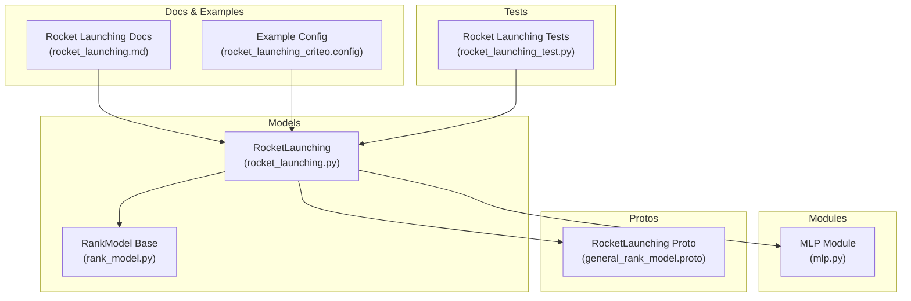
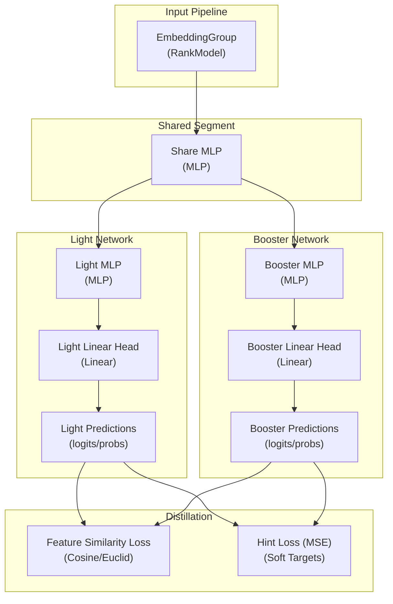
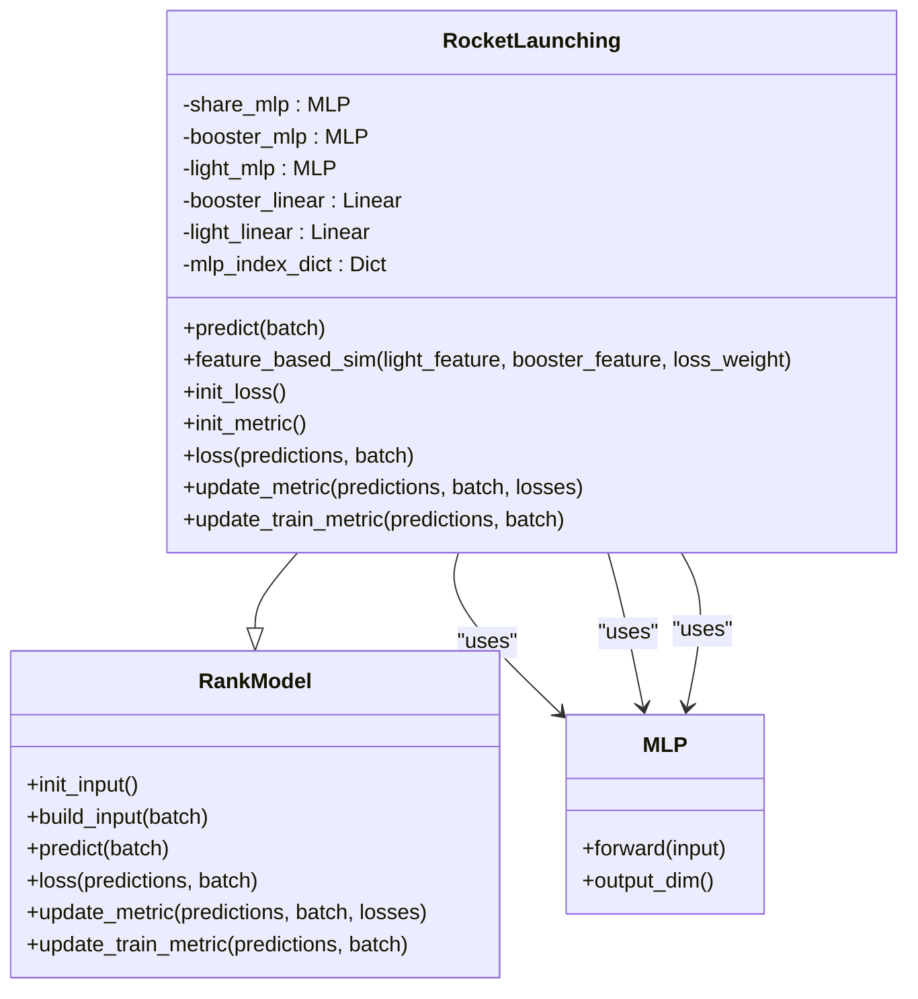
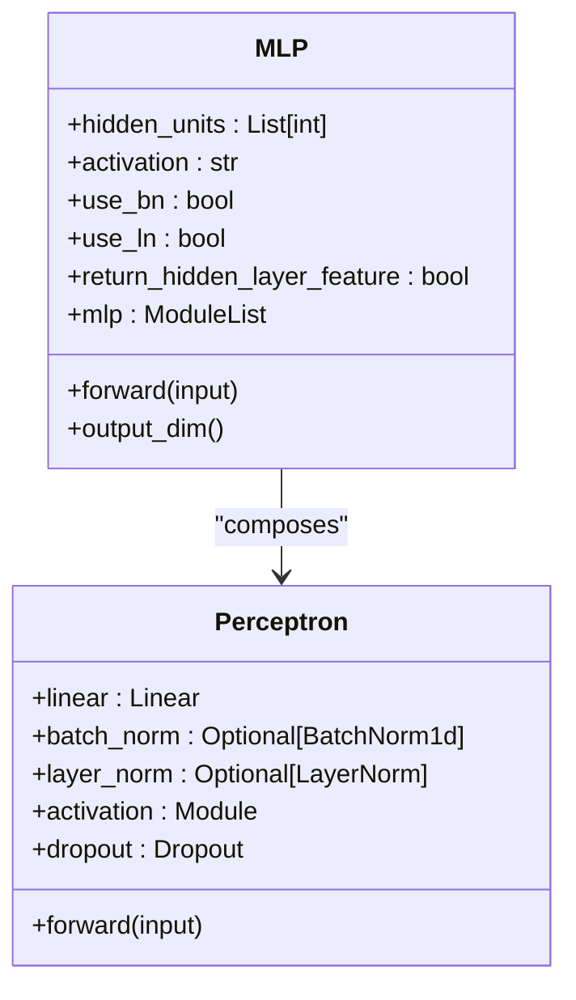
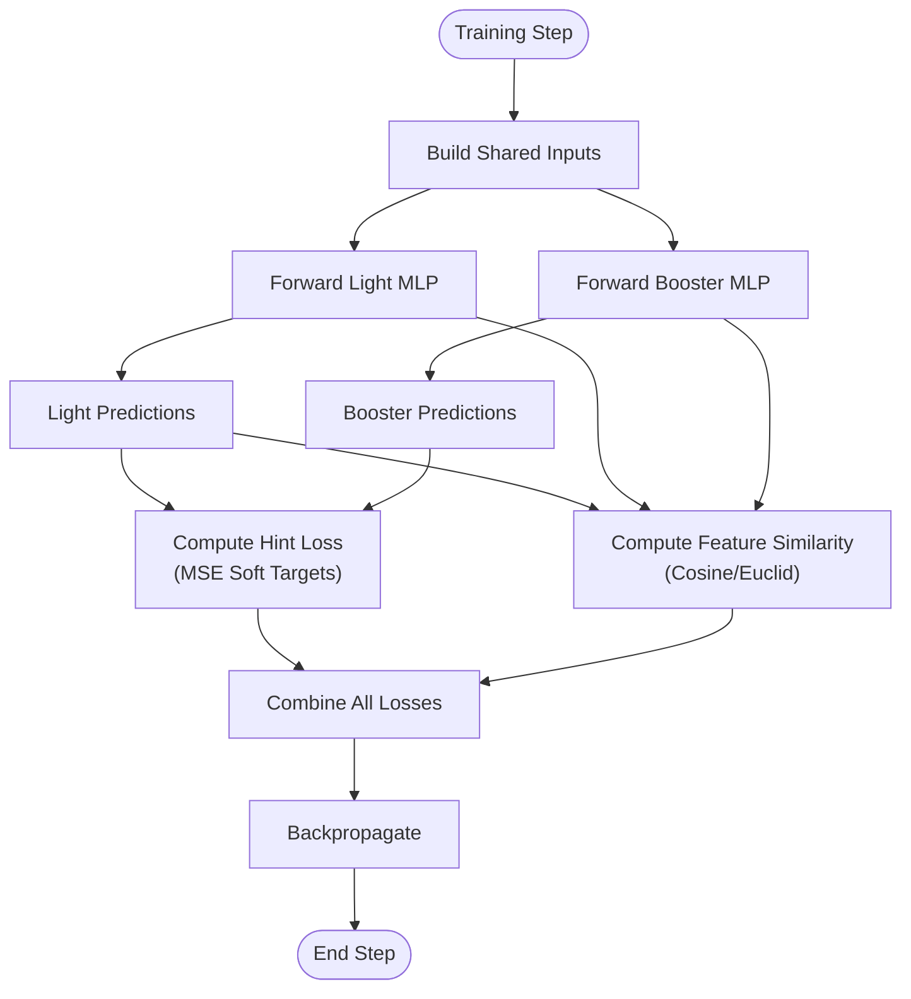
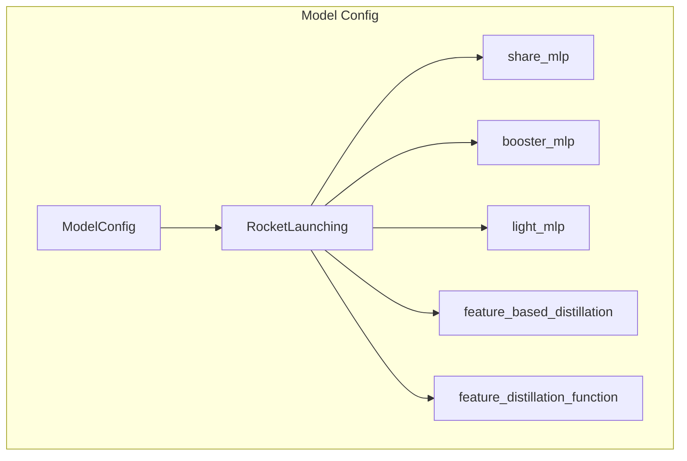
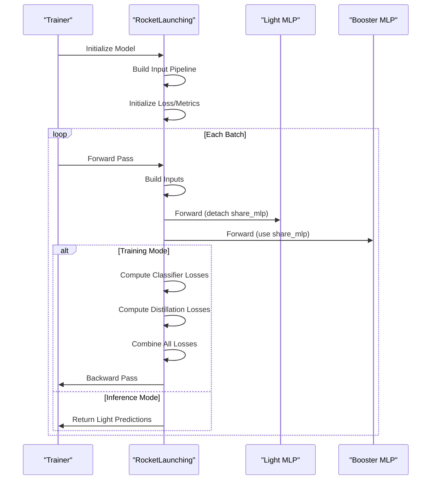
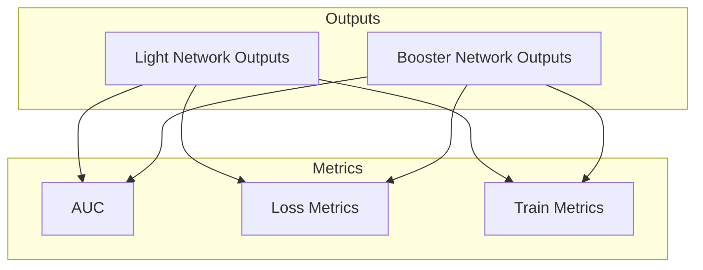
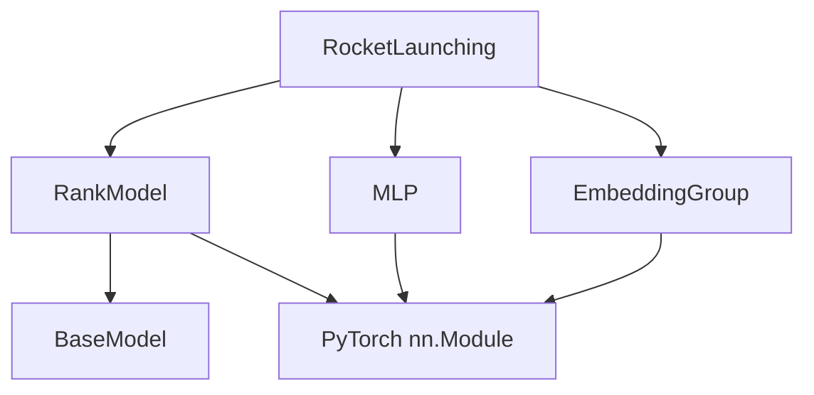

# Rocket Launching Model

<cite>
**Referenced Files in This Document**
- [rocket_launching.py](file://tzrec/models/rocket_launching.py)
- [rocket_launching.md](file://docs/source/models/rocket_launching.md)
- [rocket_launching_criteo.config](file://examples/rocket_launching_criteo.config)
- [rank_model.py](file://tzrec/models/rank_model.py)
- [mlp.py](file://tzrec/modules/mlp.py)
- [general_rank_model.proto](file://tzrec/protos/models/general_rank_model.proto)
- [rocket_launching_test.py](file://tzrec/models/rocket_launching_test.py)
</cite>

## Table of Contents

1. [Introduction](#introduction)
1. [Project Structure](#project-structure)
1. [Core Components](#core-components)
1. [Architecture Overview](#architecture-overview)
1. [Detailed Component Analysis](#detailed-component-analysis)
1. [Dependency Analysis](#dependency-analysis)
1. [Performance Considerations](#performance-considerations)
1. [Troubleshooting Guide](#troubleshooting-guide)
1. [Conclusion](#conclusion)
1. [Appendices](#appendices)

## Introduction

Rocket Launching is a specialized training framework designed to produce a compact, high-performance light-weight model while maintaining strong predictive quality. It achieves this by training two networks concurrently during the training phase: a complex booster network and a lightweight light network. Both networks share part of their parameters and learn from the same labels. During inference, only the lightweight network is used, enabling fast online serving with minimal latency.

Key design principles:

- Shared parameter segment between booster and light networks
- Feature-based distillation (optional) to align intermediate representations
- Logits-based distillation (MSE between soft targets) to improve light network learning
- Separate heads for booster and light networks with distinct outputs and metrics
- Lightweight inference path optimized for real-time response

## Project Structure

The Rocket Launching model is implemented within the TorchEasyRec framework and integrates with the broader model ecosystem. The following files are central to its implementation and documentation:

**Diagram sources**

- \[rocket_launching.py\](file://tzrec/models/rocket_launching.py#L28-L324)
- \[rank_model.py\](file://tzrec/models/rank_model.py#L56-L200)
- \[mlp.py\](file://tzrec/modules/mlp.py#L86-L178)
- \[general_rank_model.proto\](file://tzrec/protos/models/general_rank_model.proto#L8-L15)
- \[rocket_launching.md\](file://docs/source/models/rocket_launching.md#L1-L76)
- \[rocket_launching_criteo.config\](file://examples/rocket_launching_criteo.config#L331-L391)
- \[rocket_launching_test.py\](file://tzrec/models/rocket_launching_test.py#L33-L182)

**Section sources**

- \[rocket_launching.py\](file://tzrec/models/rocket_launching.py#L1-L324)
- \[rocket_launching.md\](file://docs/source/models/rocket_launching.md#L1-L76)
- \[rocket_launching_criteo.config\](file://examples/rocket_launching_criteo.config#L1-L392)

## Core Components

Rocket Launching comprises several core components that work together to achieve efficient training and inference:

- Shared MLP: A parameter-sharing segment that forms the backbone of both networks
- Booster MLP: A deeper, more complex network used for supervision and distillation signals
- Light MLP: A compact network used for inference and fast serving
- Distillation Mechanisms:
  - Feature-based distillation: Aligns intermediate representations using cosine or Euclidean similarity
  - Logits-based distillation: MSE loss between soft targets from booster and light networks
- Output Heads: Separate classification heads for booster and light networks with distinct predictions and metrics

These components enable the model to leverage the strengths of both networks while optimizing for inference speed.

**Section sources**

- \[rocket_launching.py\](file://tzrec/models/rocket_launching.py#L38-L123)
- \[mlp.py\](file://tzrec/modules/mlp.py#L86-L178)

## Architecture Overview

The Rocket Launching architecture trains two complementary networks with shared parameters and distillation mechanisms:

**Diagram sources**

- \[rocket_launching.py\](file://tzrec/models/rocket_launching.py#L88-L123)
- \[mlp.py\](file://tzrec/modules/mlp.py#L161-L177)
- \[rank_model.py\](file://tzrec/models/rank_model.py#L115-L132)

**Section sources**

- \[rocket_launching.py\](file://tzrec/models/rocket_launching.py#L88-L123)
- \[rank_model.py\](file://tzrec/models/rank_model.py#L115-L132)

## Detailed Component Analysis

### RocketLaunching Class

The RocketLaunching class extends RankModel and implements the dual-network training and inference pipeline:

**Diagram sources**

- \[rocket_launching.py\](file://tzrec/models/rocket_launching.py#L28-L324)
- \[rank_model.py\](file://tzrec/models/rank_model.py#L56-L200)
- \[mlp.py\](file://tzrec/modules/mlp.py#L86-L178)

Key implementation details:

- Parameter sharing: The share_mlp module is shared between booster and light networks
- Dual heads: Separate MLPs and linear heads for booster and light predictions
- Distillation indices: MLP index mapping enables aligned feature-level distillation
- Training vs inference: Booster head disabled during inference for speed

**Section sources**

- \[rocket_launching.py\](file://tzrec/models/rocket_launching.py#L38-L123)

### MLP Module

The MLP module provides the building blocks for both shared and specialized network segments:

**Diagram sources**

- \[mlp.py\](file://tzrec/modules/mlp.py#L21-L84)
- \[mlp.py\](file://tzrec/modules/mlp.py#L86-L178)

Key features:

- Configurable activations, normalization, and dropout
- Optional hidden layer feature extraction for distillation
- Flexible depth and width configurations

**Section sources**

- \[mlp.py\](file://tzrec/modules/mlp.py#L86-L178)

### Distillation Mechanisms

Rocket Launching implements two complementary distillation strategies:

**Diagram sources**

- \[rocket_launching.py\](file://tzrec/models/rocket_launching.py#L182-L245)

Feature-based similarity computation:

- Cosine similarity: Normalizes features and computes element-wise multiplication
- Euclidean distance: Computes L2 distance between features
- Weighted averaging: Supports sample weights for robust training

Logits-based distillation:

- Uses MSE loss between light network logits and detached booster logits
- Encourages light network to mimic booster's learned decision boundaries

**Section sources**

- \[rocket_launching.py\](file://tzrec/models/rocket_launching.py#L125-L204)

### Configuration Options

Rocket Launching supports extensive configuration through protocol buffers:

**Diagram sources**

- \[general_rank_model.proto\](file://tzrec/protos/models/general_rank_model.proto#L8-L15)

Configuration highlights:

- share_mlp: Hidden units for shared parameter segment
- booster_mlp: Hidden units for complex network (deeper)
- light_mlp: Hidden units for lightweight network (shallower)
- feature_based_distillation: Enable/disable feature-level distillation
- feature_distillation_function: Similarity measure (COSINE/EUCLID)

**Section sources**

- \[general_rank_model.proto\](file://tzrec/protos/models/general_rank_model.proto#L8-L15)
- \[rocket_launching.md\](file://docs/source/models/rocket_launching.md#L10-L76)

### Training Procedures and Optimization Strategies

Training Rocket Launching involves coordinated optimization across multiple objectives:

**Diagram sources**

- \[rocket_launching.py\](file://tzrec/models/rocket_launching.py#L88-L123)
- \[rocket_launching.py\](file://tzrec/models/rocket_launching.py#L206-L245)

Optimization strategies:

- Separate optimizers for sparse and dense embeddings
- Balanced learning rates between booster and light networks
- Sample weighting for robust loss computation
- Feature-based distillation alignment through shared indices

**Section sources**

- \[rocket_launching.py\](file://tzrec/models/rocket_launching.py#L157-L181)
- \[rocket_launching.py\](file://tzrec/models/rocket_launching.py#L206-L245)

### Practical Examples and Setup

Example configurations demonstrate typical Rocket Launching setups:

- Example configuration: \[rocket_launching_criteo.config\](file://examples/rocket_launching_criteo.config#L331-L391)
- Documentation: \[rocket_launching.md\](file://docs/source/models/rocket_launching.md#L10-L76)

Setup considerations:

- Feature groups: Configure a single deep feature group
- Embedding dimensions: Balance representational power vs. latency
- MLP architectures: Deeper booster, shallower light network
- Distillation: Enable feature-based distillation for improved performance

**Section sources**

- \[rocket_launching_criteo.config\](file://examples/rocket_launching_criteo.config#L331-L391)
- \[rocket_launching.md\](file://docs/source/models/rocket_launching.md#L10-L76)

### Evaluation Approaches

Evaluation combines standard metrics with model-specific outputs:

**Diagram sources**

- \[rocket_launching.py\](file://tzrec/models/rocket_launching.py#L169-L181)
- \[rocket_launching.py\](file://tzrec/models/rocket_launching.py#L247-L294)

Evaluation strategies:

- Separate AUC calculations for light and booster networks
- Loss metrics computed for both networks
- Train metrics tracked for both networks during training
- Consistent label handling across all outputs

**Section sources**

- \[rocket_launching.py\](file://tzrec/models/rocket_launching.py#L169-L181)
- \[rocket_launching.py\](file://tzrec/models/rocket_launching.py#L247-L294)

## Dependency Analysis

Rocket Launching depends on several core framework components:

**Diagram sources**

- \[rocket_launching.py\](file://tzrec/models/rocket_launching.py#L28-L324)
- \[rank_model.py\](file://tzrec/models/rank_model.py#L56-L200)
- \[mlp.py\](file://tzrec/modules/mlp.py#L86-L178)

Key dependencies:

- RankModel provides input building, loss/metric infrastructure
- MLP module supplies configurable feed-forward layers
- EmbeddingGroup handles feature embedding and grouping
- PyTorch nn.Module provides the foundational neural network interface

**Section sources**

- \[rocket_launching.py\](file://tzrec/models/rocket_launching.py#L18-L25)
- \[rank_model.py\](file://tzrec/models/rank_model.py#L84-L95)

## Performance Considerations

Rocket Launching is optimized for inference speed while maintaining competitive accuracy:

- Lightweight inference: Only the light network is used during inference
- Parameter sharing: Reduces memory footprint and computational overhead
- Feature-based distillation: Improves light network performance without significant cost
- Optimized MLP configurations: Deeper networks for supervision, shallower for inference
- Efficient similarity computations: Vectorized operations for distillation losses

Performance trade-offs:

- Training overhead: Dual network training increases compute requirements
- Memory usage: Both networks trained simultaneously
- Accuracy: May require careful tuning for optimal balance

## Troubleshooting Guide

Common issues and solutions when working with Rocket Launching:

- Shape mismatches in distillation: Ensure MLP index mapping aligns shared hidden units
- Feature dimension mismatches: Verify embedding dimensions match MLP input sizes
- Training instability: Adjust learning rates between booster and light networks
- Memory issues: Reduce batch size or simplify MLP architectures
- Convergence problems: Enable feature-based distillation for better alignment

Diagnostic steps:

- Validate configuration against protos
- Check tensor shapes in forward pass
- Monitor both booster and light metrics separately
- Verify distillation loss contributions

**Section sources**

- \[rocket_launching.py\](file://tzrec/models/rocket_launching.py#L77-L86)
- \[rocket_launching.py\](file://tzrec/models/rocket_launching.py#L182-L204)

## Conclusion

Rocket Launching represents a sophisticated approach to balancing model performance and inference speed. By training complementary networks with shared parameters and multiple distillation mechanisms, it achieves superior accuracy compared to purely lightweight models while maintaining fast inference capabilities. The framework's modular design, extensive configuration options, and comprehensive evaluation support make it suitable for production deployment in real-time recommendation systems.

Key advantages:

- Fast inference with maintained accuracy
- Flexible architecture supporting various network depths
- Comprehensive distillation strategies
- Robust training pipeline with separate metrics

When to choose Rocket Launching:

- Real-time serving requirements with strict latency budgets
- Need for high-quality lightweight models
- Production environments requiring reliable performance
- Scenarios where dual-network training is feasible

## Appendices

### Configuration Reference

Complete Rocket Launching configuration options:

- share_mlp: Hidden units for shared parameter segment
- booster_mlp: Hidden units for complex network
- light_mlp: Hidden units for lightweight network
- feature_based_distillation: Enable feature-level distillation
- feature_distillation_function: Similarity measure (COSINE/EUCLID)

**Section sources**

- \[general_rank_model.proto\](file://tzrec/protos/models/general_rank_model.proto#L8-L15)
- \[rocket_launching.md\](file://docs/source/models/rocket_launching.md#L10-L76)

### Example Usage

Practical example configurations and documentation:

- Complete example configuration: \[rocket_launching_criteo.config\](file://examples/rocket_launching_criteo.config#L331-L391)
- Model documentation: \[rocket_launching.md\](file://docs/source/models/rocket_launching.md#L1-L76)

**Section sources**

- \[rocket_launching_criteo.config\](file://examples/rocket_launching_criteo.config#L331-L391)
- \[rocket_launching.md\](file://docs/source/models/rocket_launching.md#L1-L76)
