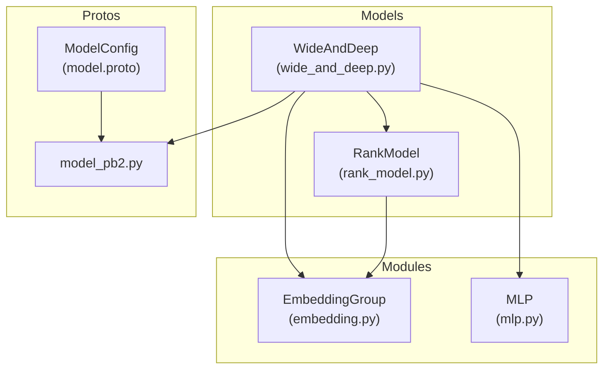
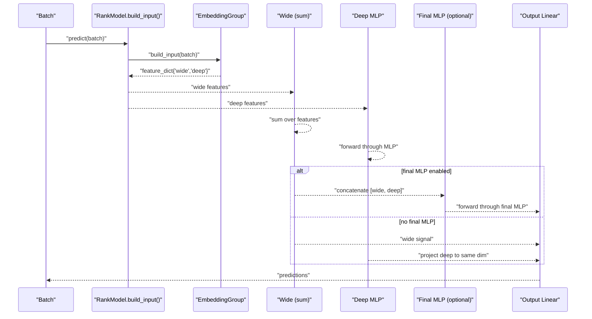
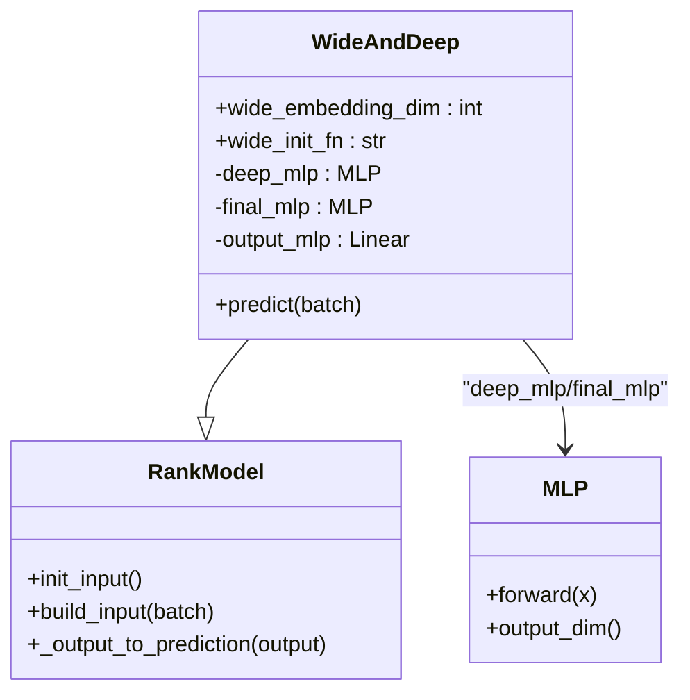
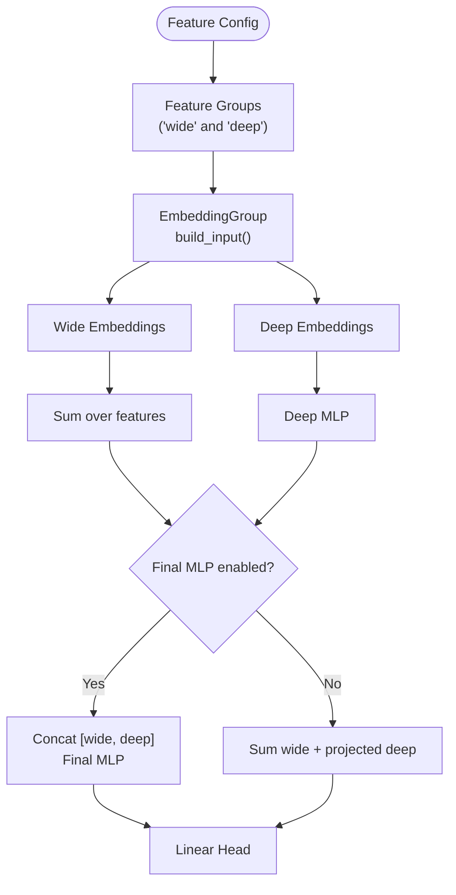
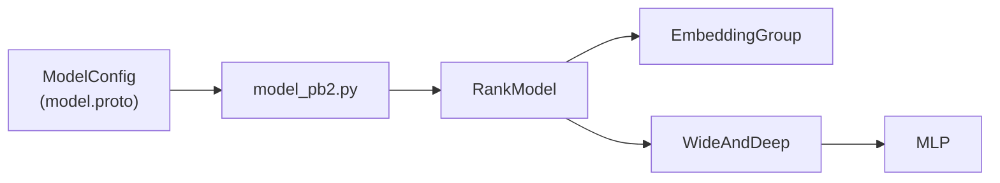

# Wide & Deep Model

<cite>
**Referenced Files in This Document**
- [wide_and_deep.py](file://tzrec/models/wide_and_deep.py)
- [wide_and_deep.md](file://docs/source/models/wide_and_deep.md)
- [rank_model.py](file://tzrec/models/rank_model.py)
- [embedding.py](file://tzrec/modules/embedding.py)
- [mlp.py](file://tzrec/modules/mlp.py)
- [model_pb2.py](file://tzrec/protos/model_pb2.py)
- [model.proto](file://tzrec/protos/model.proto)
- [wide_and_deep_test.py](file://tzrec/models/wide_and_deep_test.py)
</cite>

## Table of Contents

1. [Introduction](#introduction)
1. [Project Structure](#project-structure)
1. [Core Components](#core-components)
1. [Architecture Overview](#architecture-overview)
1. [Detailed Component Analysis](#detailed-component-analysis)
1. [Dependency Analysis](#dependency-analysis)
1. [Performance Considerations](#performance-considerations)
1. [Troubleshooting Guide](#troubleshooting-guide)
1. [Conclusion](#conclusion)
1. [Appendices](#appendices)

## Introduction

Wide & Deep is a hybrid model that combines two complementary capabilities:

- Wide component: Memorization via explicit feature crosses and linear modeling
- Deep component: Generalization via learned high-order feature interactions through a deep neural network

This document explains the TorchEasyRec implementation of Wide & Deep, including feature processing, embedding strategies, the fusion mechanism between wide and deep branches, configuration options, training considerations, and performance characteristics. It also provides practical examples for configuring Wide & Deep across different recommendation scenarios.

## Project Structure

Wide & Deep resides in the models package and integrates with the shared ranking model infrastructure, embedding group, and MLP modules. The model is configured via the unified ModelConfig protobuf, which supports feature groups and per-model configurations.

**Diagram sources**

- \[wide_and_deep.py\](file://tzrec/models/wide_and_deep.py#L25-L61)
- \[rank_model.py\](file://tzrec/models/rank_model.py#L56-L95)
- \[embedding.py\](file://tzrec/modules/embedding.py#L139-L200)
- \[mlp.py\](file://tzrec/modules/mlp.py#L86-L178)
- \[model.proto\](file://tzrec/protos/model.proto#L40-L72)
- \[model_pb2.py\](file://tzrec/protos/model_pb2.py#L25-L42)

**Section sources**

- \[wide_and_deep.py\](file://tzrec/models/wide_and_deep.py#L25-L61)
- \[rank_model.py\](file://tzrec/models/rank_model.py#L56-L132)
- \[embedding.py\](file://tzrec/modules/embedding.py#L139-L200)
- \[mlp.py\](file://tzrec/modules/mlp.py#L86-L178)
- \[model.proto\](file://tzrec/protos/model.proto#L40-L72)
- \[model_pb2.py\](file://tzrec/protos/model_pb2.py#L25-L42)

## Core Components

- WideAndDeep model class: Implements the hybrid architecture, builds embeddings, computes wide and deep branches, and fuses outputs.
- RankModel base class: Provides shared initialization, embedding group construction, input building, and prediction post-processing.
- EmbeddingGroup: Manages feature embeddings per group (wide and deep), supports configurable wide embedding dimension and initialization.
- MLP: Stacked perceptrons forming the deep branch; supports normalization, dropout, and optional hidden-layer feature outputs.

Key implementation highlights:

- Feature groups: Two required groups named "wide" and "deep".
- Wide branch: Summation of embedded features to produce a linear signal.
- Deep branch: MLP applied to concatenated deep embeddings.
- Fusion: Optional final MLP to combine wide and deep features; otherwise, wide and deep outputs are summed before the final projection.

**Section sources**

- \[wide_and_deep.py\](file://tzrec/models/wide_and_deep.py#L25-L61)
- \[rank_model.py\](file://tzrec/models/rank_model.py#L84-L132)
- \[embedding.py\](file://tzrec/modules/embedding.py#L139-L200)
- \[mlp.py\](file://tzrec/modules/mlp.py#L86-L178)

## Architecture Overview

The Wide & Deep model follows a two-branch pipeline:

- Input embedding: Features are embedded according to their group membership.
- Wide branch: Sums embedded vectors from the wide group to form a memorization signal.
- Deep branch: Passes concatenated deep embeddings through an MLP to capture generalization patterns.
- Fusion: Optionally concatenates wide and deep signals, passes through a final MLP, then projects to logits.

**Diagram sources**

- \[wide_and_deep.py\](file://tzrec/models/wide_and_deep.py#L62-L88)
- \[rank_model.py\](file://tzrec/models/rank_model.py#L115-L132)
- \[mlp.py\](file://tzrec/modules/mlp.py#L161-L177)

## Detailed Component Analysis

### WideAndDeep Class

The WideAndDeep class extends RankModel and defines:

- Initialization: Reads model config, constructs deep MLP from deep group total embedding dimension, optionally constructs a final MLP, and sets up the output projection head.
- Forward pass: Builds grouped inputs, computes wide sum, runs deep MLP, optionally fuses via final MLP, and produces predictions.

**Diagram sources**

- \[wide_and_deep.py\](file://tzrec/models/wide_and_deep.py#L25-L61)
- \[rank_model.py\](file://tzrec/models/rank_model.py#L56-L95)
- \[mlp.py\](file://tzrec/modules/mlp.py#L86-L178)

**Section sources**

- \[wide_and_deep.py\](file://tzrec/models/wide_and_deep.py#L25-L61)
- \[wide_and_deep.py\](file://tzrec/models/wide_and_deep.py#L62-L88)

### Feature Groups and Embedding Strategy

- Two feature groups are mandatory:
  - "wide": Features used for explicit memorization.
  - "deep": Features used for generalization via MLP.
- EmbeddingGroup constructs embeddings per group and supports:
  - wide_embedding_dim: Controls the output dimension of wide embeddings.
  - wide_init_fn: Optional initialization function for wide embeddings.

**Diagram sources**

- \[embedding.py\](file://tzrec/modules/embedding.py#L139-L200)
- \[rank_model.py\](file://tzrec/models/rank_model.py#L84-L132)
- \[wide_and_deep.py\](file://tzrec/models/wide_and_deep.py#L48-L60)

**Section sources**

- \[embedding.py\](file://tzrec/modules/embedding.py#L139-L200)
- \[rank_model.py\](file://tzrec/models/rank_model.py#L84-L132)
- \[wide_and_deep.py\](file://tzrec/models/wide_and_deep.py#L44-L60)

### Model Configuration Options

Configuration is defined via ModelConfig with a dedicated wide_and_deep section:

- feature_groups: Must include "wide" and "deep" groups.
- wide_and_deep:
  - deep: Hidden units for the deep MLP.
  - wide_embedding_dim: Output dimension for wide embeddings.
  - wide_init_fn: Optional initialization function name for wide embeddings.
  - final: Optional final MLP to fuse wide and deep; its hidden_units define fusion capacity.

Losses and metrics are configured globally in ModelConfig.

Practical example references:

- Example configuration link is provided in the documentation page.

**Section sources**

- \[wide_and_deep.md\](file://docs/source/models/wide_and_deep.md#L9-L46)
- \[model.proto\](file://tzrec/protos/model.proto#L40-L72)
- \[model_pb2.py\](file://tzrec/protos/model_pb2.py#L25-L42)

### Training Considerations

- RankModel handles:
  - Loss module initialization based on configured losses.
  - Prediction post-processing to produce logits/probs/y depending on loss type.
- Variational dropout can be configured per feature group and contributes auxiliary losses collected internally.

Recommendations:

- Choose wide_embedding_dim and deep hidden_units based on data cardinality and compute budget.
- Enable final MLP when explicit fusion of wide and deep signals is desired.
- Monitor training metrics and adjust learning rates and regularization accordingly.

**Section sources**

- \[rank_model.py\](file://tzrec/models/rank_model.py#L134-L200)
- \[rank_model.py\](file://tzrec/models/rank_model.py#L97-L132)

### Practical Examples and Workflows

Below are code snippet paths demonstrating typical configuration and usage patterns. Replace the placeholder paths with actual file paths in your environment.

- Feature engineering and model definition:

  - Define feature configs and feature groups for "wide" and "deep".
  - Configure wide_and_deep deep hidden_units, wide_embedding_dim, and optional final MLP.
  - Reference: \[wide_and_deep.md\](file://docs/source/models/wide_and_deep.md#L9-L46)

- Training workflow:

  - Prepare dataset and pipeline.
  - Initialize model with ModelConfig.
  - Run training loop and evaluation using built-in utilities.
  - Reference: \[rank_model.py\](file://tzrec/models/rank_model.py#L134-L200)

- Testing configuration:

  - Example test setup with feature groups and model config.
  - Reference: \[wide_and_deep_test.py\](file://tzrec/models/wide_and_deep_test.py#L27-L61)

Note: The repository does not include a ready-to-use example config file named wide_and_deep_criteo.config; consult the documentation page for the example link and adapt it to your dataset.

**Section sources**

- \[wide_and_deep.md\](file://docs/source/models/wide_and_deep.md#L52-L54)
- \[wide_and_deep_test.py\](file://tzrec/models/wide_and_deep_test.py#L27-L61)
- \[rank_model.py\](file://tzrec/models/rank_model.py#L134-L200)

## Dependency Analysis

Wide & Deep depends on shared infrastructure:

- Protobuf model configuration for feature groups and model selection.
- RankModel for input building and prediction post-processing.
- EmbeddingGroup for per-group embedding computation.
- MLP for deep feature transformation.

**Diagram sources**

- \[model.proto\](file://tzrec/protos/model.proto#L40-L72)
- \[model_pb2.py\](file://tzrec/protos/model_pb2.py#L25-L42)
- \[rank_model.py\](file://tzrec/models/rank_model.py#L56-L95)
- \[wide_and_deep.py\](file://tzrec/models/wide_and_deep.py#L25-L61)
- \[mlp.py\](file://tzrec/modules/mlp.py#L86-L178)

**Section sources**

- \[model.proto\](file://tzrec/protos/model.proto#L40-L72)
- \[model_pb2.py\](file://tzrec/protos/model_pb2.py#L25-L42)
- \[rank_model.py\](file://tzrec/models/rank_model.py#L56-L95)
- \[wide_and_deep.py\](file://tzrec/models/wide_and_deep.py#L25-L61)
- \[mlp.py\](file://tzrec/modules/mlp.py#L86-L178)

## Performance Considerations

- Memory footprint:
  - Wide embeddings: controlled by wide_embedding_dim and number of wide features.
  - Deep MLP: dominated by hidden_units and input dimension from deep group.
- Compute efficiency:
  - Summation in wide branch is lightweight.
  - Deep MLP depth and width directly impact latency and memory.
- Fusion cost:
  - Enabling final MLP adds a small overhead but can improve expressiveness.
- Regularization:
  - Dropout and normalization in MLP can help generalize and reduce overfitting.

[No sources needed since this section provides general guidance]

## Troubleshooting Guide

Common issues and resolutions:

- Missing feature groups:
  - Ensure both "wide" and "deep" groups are present in feature_groups.
- Wide embedding dimension mismatch:
  - Verify wide_embedding_dim aligns with expectations; adjust if training instability occurs.
- Shape mismatches in fusion:
  - When final MLP is enabled, ensure concatenation dimensions are consistent.
- Loss and metric mismatch:
  - Confirm loss configuration matches task type (binary, multi-class, regression).

Diagnostic helpers:

- RankModel’s prediction post-processing selects appropriate outputs based on loss type.
- EmbeddingGroup supports per-group variational dropout; enable if needed for regularization.

**Section sources**

- \[rank_model.py\](file://tzrec/models/rank_model.py#L134-L200)
- \[embedding.py\](file://tzrec/modules/embedding.py#L139-L200)

## Conclusion

Wide & Deep in TorchEasyRec offers a robust, modular hybrid architecture that leverages explicit memorization and implicit generalization. By carefully designing feature groups, configuring embedding dimensions, and tuning the deep and fusion components, practitioners can achieve strong performance across diverse recommendation tasks. The provided configuration patterns and testing examples serve as a foundation for building production-ready models.

[No sources needed since this section summarizes without analyzing specific files]

## Appendices

### Configuration Quick Reference

- Required feature groups: "wide", "deep"
- wide_and_deep parameters:
  - deep.hidden_units: list of integers
  - wide_embedding_dim: integer
  - wide_init_fn: string (optional)
  - final.hidden_units: list of integers (optional)

**Section sources**

- \[wide_and_deep.md\](file://docs/source/models/wide_and_deep.md#L9-L46)
- \[model.proto\](file://tzrec/protos/model.proto#L40-L72)
