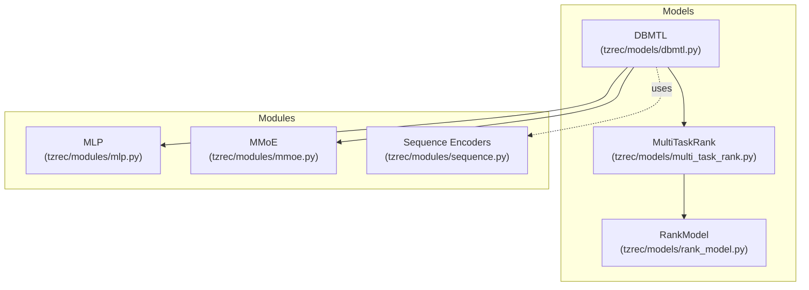
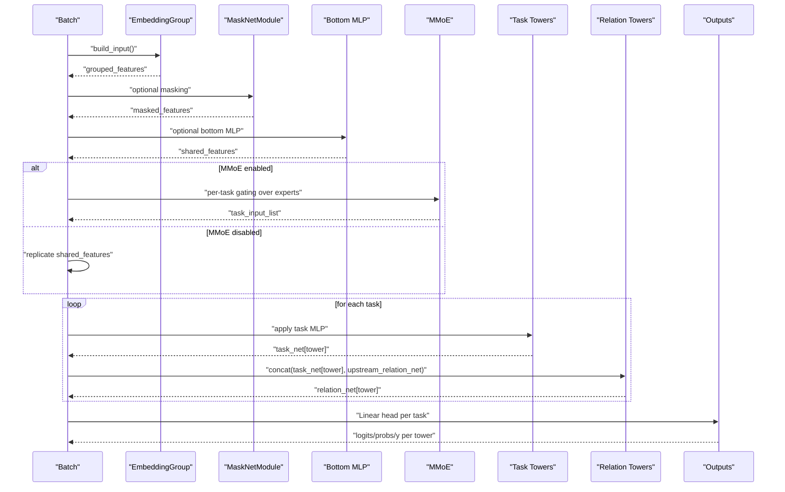
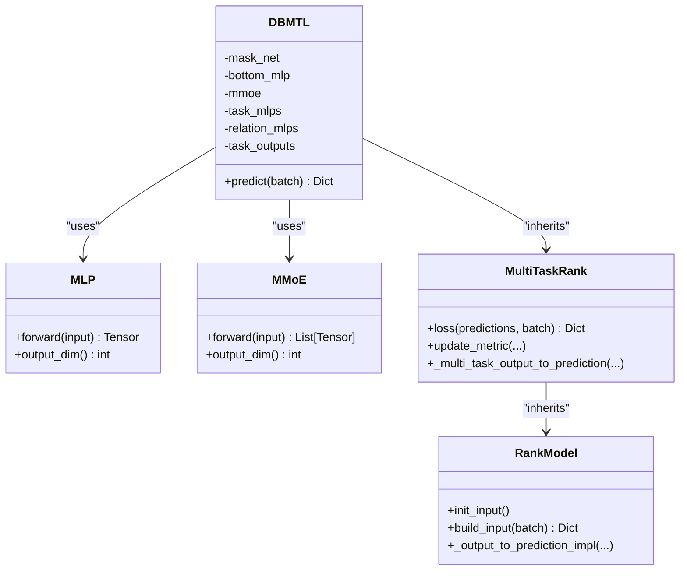
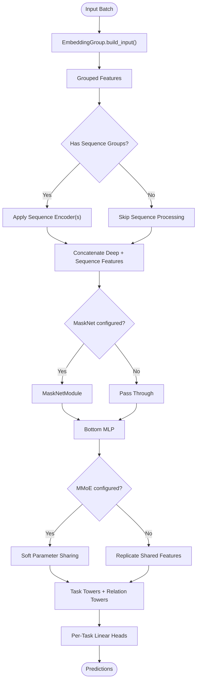
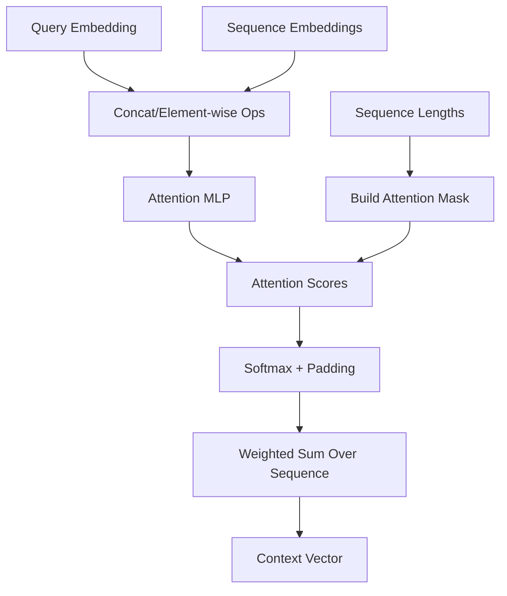
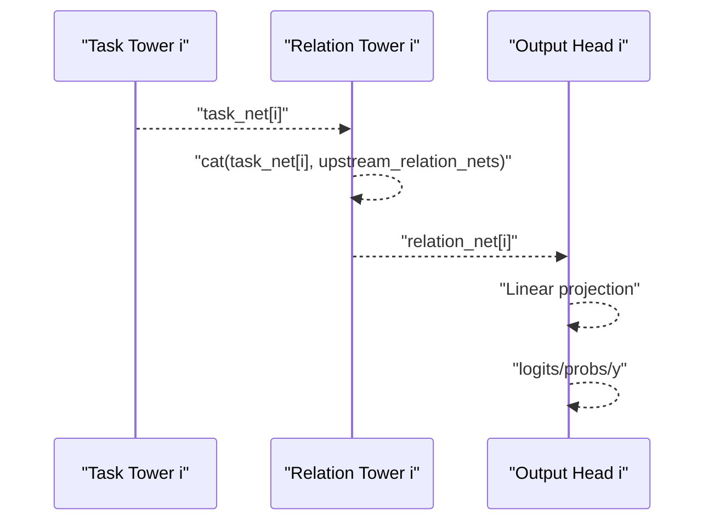
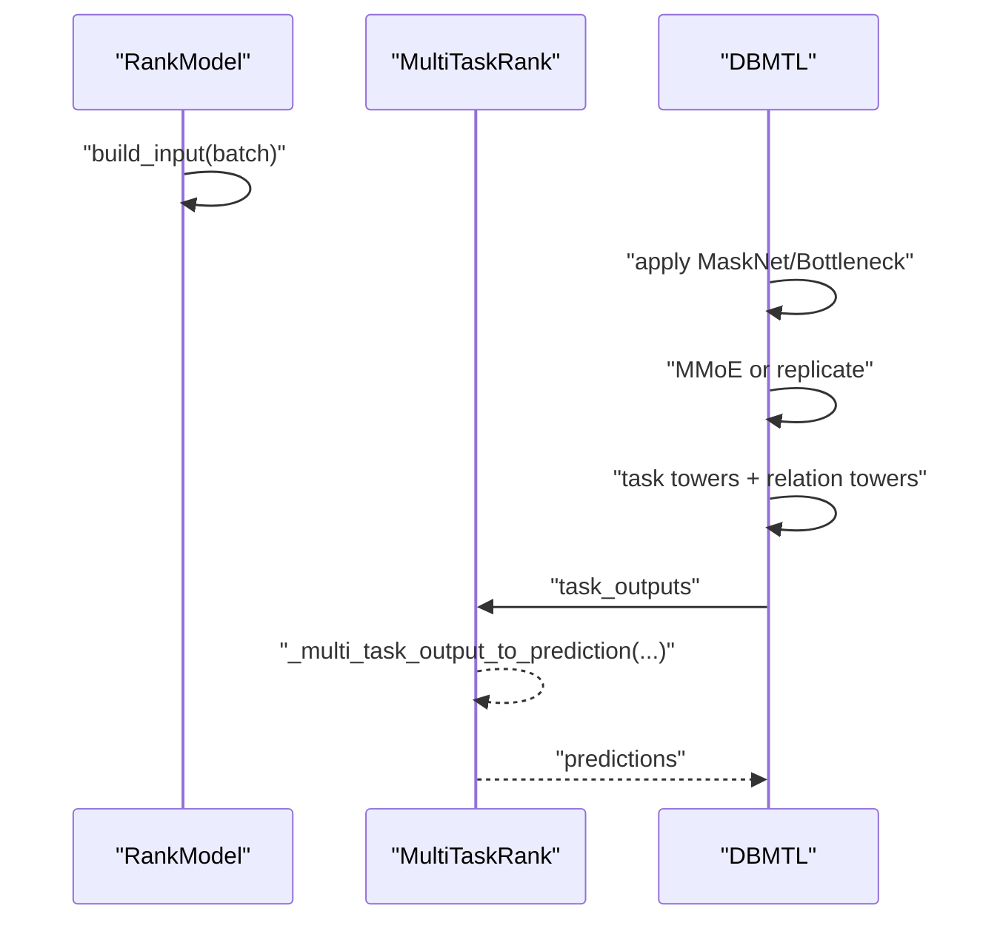
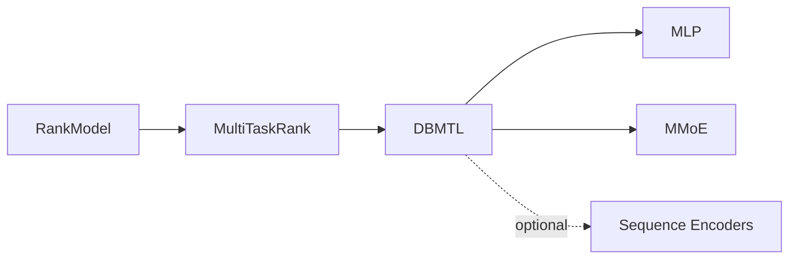

# DBMTL Model (Deep Bi-Modal Transformer Learning)

<cite>
**Referenced Files in This Document**
- [dbmtl.py](file://tzrec/models/dbmtl.py)
- [multi_task_rank.py](file://tzrec/models/multi_task_rank.py)
- [rank_model.py](file://tzrec/models/rank_model.py)
- [mlp.py](file://tzrec/modules/mlp.py)
- [mmoe.py](file://tzrec/modules/mmoe.py)
- [sequence.py](file://tzrec/modules/sequence.py)
- [dbmtl.md](file://docs/source/models/dbmtl.md)
- [dbmtl_taobao.config](file://examples/dbmtl_taobao.config)
- [dbmtl_taobao_seq.config](file://examples/dbmtl_taobao_seq.config)
- [dbmtl_taobao_jrc.config](file://examples/dbmtl_taobao_jrc.config)
</cite>

## Table of Contents

1. [Introduction](#introduction)
1. [Project Structure](#project-structure)
1. [Core Components](#core-components)
1. [Architecture Overview](#architecture-overview)
1. [Detailed Component Analysis](#detailed-component-analysis)
1. [Dependency Analysis](#dependency-analysis)
1. [Performance Considerations](#performance-considerations)
1. [Troubleshooting Guide](#troubleshooting-guide)
1. [Conclusion](#conclusion)
1. [Appendices](#appendices)

## Introduction

This document explains the DBMTL (Deep Bi-Modal Transformer Learning) model implementation in the TorchEasyRec codebase. It focuses on the bi-modal fusion approach and transformer-based multi-task learning architecture, detailing how heterogeneous inputs are processed, how shared representations are learned across tasks, and how task-specific decoders operate. It also documents configuration patterns for bi-modal inputs, transformer-like sequence encoders, and task-specific components, and describes the forward propagation, attention mechanisms, and output generation for multiple tasks. Finally, it outlines advantages of transformer-style approaches for multi-modal multi-task learning, computational efficiency considerations, and scaling strategies for large-scale deployments.

## Project Structure

The DBMTL model sits within the models package and leverages shared infrastructure from the multi-task ranking framework. Key elements include:

- Model definition and forward pass: \[dbmtl.py\](file://tzrec/models/dbmtl.py)
- Multi-task base behavior (loss, metrics, prediction conversion): \[multi_task_rank.py\](file://tzrec/models/multi_task_rank.py)
- Ranking base behavior (embedding grouping, input building, prediction conversion): \[rank_model.py\](file://tzrec/models/rank_model.py)
- Core modules used by DBMTL: MLP, MMoE, and sequence encoders: \[mlp.py\](file://tzrec/modules/mlp.py), \[mmoe.py\](file://tzrec/modules/mmoe.py), \[sequence.py\](file://tzrec/modules/sequence.py)
- Documentation and configuration examples: \[dbmtl.md\](file://docs/source/models/dbmtl.md), \[dbmtl_taobao.config\](file://examples/dbmtl_taobao.config), \[dbmtl_taobao_seq.config\](file://examples/dbmtl_taobao_seq.config), \[dbmtl_taobao_jrc.config\](file://examples/dbmtl_taobao_jrc.config)

**Diagram sources**

- \[dbmtl.py\](file://tzrec/models/dbmtl.py#L28-L176)
- \[multi_task_rank.py\](file://tzrec/models/multi_task_rank.py#L25-L221)
- \[rank_model.py\](file://tzrec/models/rank_model.py#L56-L200)
- \[mlp.py\](file://tzrec/modules/mlp.py#L86-L178)
- \[mmoe.py\](file://tzrec/modules/mmoe.py#L21-L78)
- \[sequence.py\](file://tzrec/modules/sequence.py#L54-L604)

**Section sources**

- \[dbmtl.py\](file://tzrec/models/dbmtl.py#L1-L176)
- \[multi_task_rank.py\](file://tzrec/models/multi_task_rank.py#L1-L221)
- \[rank_model.py\](file://tzrec/models/rank_model.py#L1-L200)
- \[mlp.py\](file://tzrec/modules/mlp.py#L1-L178)
- \[mmoe.py\](file://tzrec/modules/mmoe.py#L1-L78)
- \[sequence.py\](file://tzrec/modules/sequence.py#L1-L604)

## Core Components

- DBMTL: Implements the bi-modal multi-task architecture with optional masking, a shared bottom MLP, optional MMoE experts/gates per task, task towers, and relation towers that fuse inter-task signals.
- MultiTaskRank: Provides multi-task loss initialization, weighting, and metric updates; converts task tower outputs into predictions.
- RankModel: Handles embedding group construction, input feature building, and prediction conversions for various loss types.
- MLP: Stacked perceptrons with activation, normalization, and dropout support; used for bottom layers, task towers, and relation towers.
- MMoE: Multi-gate mixture-of-experts module that produces task-specific features via soft parameter sharing.
- Sequence Encoders: Transformer-style attention modules (DIN, MultiHead Attention, etc.) for modeling temporal sequences.

Key implementation references:

- DBMTL initialization and forward pass: \[dbmtl.py\](file://tzrec/models/dbmtl.py#L38-L176)
- Multi-task loss/metric orchestration: \[multi_task_rank.py\](file://tzrec/models/multi_task_rank.py#L50-L196)
- Input building and prediction conversion: \[rank_model.py\](file://tzrec/models/rank_model.py#L115-L180)
- MLP module: \[mlp.py\](file://tzrec/modules/mlp.py#L86-L178)
- MMoE module: \[mmoe.py\](file://tzrec/modules/mmoe.py#L21-L78)
- Sequence encoders: \[sequence.py\](file://tzrec/modules/sequence.py#L70-L290)

**Section sources**

- \[dbmtl.py\](file://tzrec/models/dbmtl.py#L28-L176)
- \[multi_task_rank.py\](file://tzrec/models/multi_task_rank.py#L25-L196)
- \[rank_model.py\](file://tzrec/models/rank_model.py#L56-L180)
- \[mlp.py\](file://tzrec/modules/mlp.py#L86-L178)
- \[mmoe.py\](file://tzrec/modules/mmoe.py#L21-L78)
- \[sequence.py\](file://tzrec/modules/sequence.py#L70-L290)

## Architecture Overview

DBMTL composes a shared representation pipeline with optional task-specific refinements:

- Bi-modal input processing: Embeddings grouped by feature groups; optional sequence encoders transform sequential features.
- Shared backbone: Optional MaskNet and/or bottom MLP to produce a unified latent vector.
- Task specialization: Optional MMoE produces per-task features via soft parameter sharing; otherwise, identical copies are used.
- Task towers: Per-task MLPs refine shared/task-specific features.
- Relation towers: Optional MLPs fuse outputs from upstream related tasks.
- Final outputs: Linear heads per task produce logits/probabilities/regression values.

**Diagram sources**

- \[dbmtl.py\](file://tzrec/models/dbmtl.py#L125-L176)
- \[multi_task_rank.py\](file://tzrec/models/multi_task_rank.py#L50-L65)
- \[rank_model.py\](file://tzrec/models/rank_model.py#L115-L132)
- \[mlp.py\](file://tzrec/modules/mlp.py#L86-L178)
- \[mmoe.py\](file://tzrec/modules/mmoe.py#L21-L78)

## Detailed Component Analysis

### DBMTL Model Structure

- Initialization:
  - Validates model config type and constructs feature groups.
  - Optionally builds MaskNetModule, Bottom MLP, and MMoE.
  - Builds task towers (MLPs) and relation towers (MLPs) with inter-task fusion.
  - Adds per-task Linear outputs.
- Forward pass:
  - Builds grouped embeddings, applies optional MaskNet and Bottom MLP.
  - Produces task_input_list via MMoE or replicated shared features.
  - Applies task MLPs and concatenates with upstream relation nets.
  - Projects to per-task outputs and converts to predictions.

**Diagram sources**

- \[dbmtl.py\](file://tzrec/models/dbmtl.py#L28-L124)
- \[mlp.py\](file://tzrec/modules/mlp.py#L86-L178)
- \[mmoe.py\](file://tzrec/modules/mmoe.py#L21-L78)
- \[multi_task_rank.py\](file://tzrec/models/multi_task_rank.py#L25-L65)
- \[rank_model.py\](file://tzrec/models/rank_model.py#L56-L132)

**Section sources**

- \[dbmtl.py\](file://tzrec/models/dbmtl.py#L38-L176)
- \[multi_task_rank.py\](file://tzrec/models/multi_task_rank.py#L50-L196)
- \[rank_model.py\](file://tzrec/models/rank_model.py#L115-L180)
- \[mlp.py\](file://tzrec/modules/mlp.py#L86-L178)
- \[mmoe.py\](file://tzrec/modules/mmoe.py#L21-L78)

### Bi-Modal Fusion and Heterogeneous Inputs

- Feature groups aggregate heterogeneous features (user, item, context) into a single embedding tensor per group.
- Sequence encoders (e.g., DIN, MultiHead Attention) transform sequential features into fixed-size representations, enabling temporal modeling akin to attention.
- Example configurations demonstrate:
  - Basic deep feature groups with ID/raw features.
  - Sequence groups with sequence encoders for click history.

**Diagram sources**

- \[rank_model.py\](file://tzrec/models/rank_model.py#L115-L132)
- \[sequence.py\](file://tzrec/modules/sequence.py#L106-L133)
- \[sequence.py\](file://tzrec/modules/sequence.py#L273-L290)
- \[dbmtl.py\](file://tzrec/models/dbmtl.py#L125-L176)

**Section sources**

- \[rank_model.py\](file://tzrec/models/rank_model.py#L84-L132)
- \[sequence.py\](file://tzrec/modules/sequence.py#L70-L290)
- \[dbmtl_taobao.config\](file://examples/dbmtl_taobao.config#L159-L224)
- \[dbmtl_taobao_seq.config\](file://examples/dbmtl_taobao_seq.config#L171-L256)

### Transformer-Like Attention Patterns

- Sequence encoders implement attention mechanisms similar to transformers:
  - DIN attention computes attention scores between query and sequence embeddings, applies masking, and aggregates attended sequences.
  - MultiHead Attention computes multi-head attention with attention masks derived from sequence lengths.
- These modules enable contextual modeling of heterogeneous sequential inputs (e.g., click sequences) and can be integrated into DBMTL’s bi-modal pipeline.

**Diagram sources**

- \[sequence.py\](file://tzrec/modules/sequence.py#L106-L133)
- \[sequence.py\](file://tzrec/modules/sequence.py#L273-L290)

**Section sources**

- \[sequence.py\](file://tzrec/modules/sequence.py#L70-L290)

### Task-Specific Decoders and Inter-Task Relations

- Task towers: Optional MLP per task refines shared/task-specific features.
- Relation towers: Optional MLPs concatenate a task’s own refined features with upstream relation features from related tasks, then refine further.
- Final outputs: Linear projection per task yields logits/probabilities for classification or regression.

**Diagram sources**

- \[dbmtl.py\](file://tzrec/models/dbmtl.py#L147-L175)

**Section sources**

- \[dbmtl.py\](file://tzrec/models/dbmtl.py#L84-L124)
- \[dbmtl.py\](file://tzrec/models/dbmtl.py#L147-L175)

### Forward Propagation and Output Generation

- Input building: EmbeddingGroup constructs grouped tensors from the batch.
- Optional preprocessing: MaskNet and Bottom MLP transform the joint embedding.
- Task specialization: MMoE gates expert MLPs to produce per-task features; otherwise, shared features are replicated.
- Task refinement: Task MLPs and relation MLPs process features; outputs are projected to per-task logits.
- Prediction conversion: MultiTaskRank converts logits/probabilities/y into standardized prediction keys.

**Diagram sources**

- \[rank_model.py\](file://tzrec/models/rank_model.py#L115-L132)
- \[multi_task_rank.py\](file://tzrec/models/multi_task_rank.py#L50-L65)
- \[dbmtl.py\](file://tzrec/models/dbmtl.py#L125-L176)

**Section sources**

- \[rank_model.py\](file://tzrec/models/rank_model.py#L115-L180)
- \[multi_task_rank.py\](file://tzrec/models/multi_task_rank.py#L50-L65)
- \[dbmtl.py\](file://tzrec/models/dbmtl.py#L125-L176)

## Dependency Analysis

- DBMTL depends on:
  - RankModel for input building and prediction conversion.
  - MultiTaskRank for loss/metric orchestration and weighted loss computation.
  - MLP and MMoE for shared and task-specific feature transformations.
  - Sequence encoders for temporal modeling when sequence groups are present.
- Coupling and cohesion:
  - DBMTL maintains high cohesion around multi-task fusion while delegating input handling and prediction conversion to base classes.
  - Optional components (MaskNet, Bottom MLP, MMoE) are conditionally instantiated, reducing coupling when unused.

**Diagram sources**

- \[rank_model.py\](file://tzrec/models/rank_model.py#L56-L132)
- \[multi_task_rank.py\](file://tzrec/models/multi_task_rank.py#L25-L65)
- \[dbmtl.py\](file://tzrec/models/dbmtl.py#L57-L82)
- \[mlp.py\](file://tzrec/modules/mlp.py#L86-L178)
- \[mmoe.py\](file://tzrec/modules/mmoe.py#L21-L78)
- \[sequence.py\](file://tzrec/modules/sequence.py#L54-L604)

**Section sources**

- \[dbmtl.py\](file://tzrec/models/dbmtl.py#L57-L124)
- \[multi_task_rank.py\](file://tzrec/models/multi_task_rank.py#L25-L65)
- \[rank_model.py\](file://tzrec/models/rank_model.py#L56-L132)
- \[mlp.py\](file://tzrec/modules/mlp.py#L86-L178)
- \[mmoe.py\](file://tzrec/modules/mmoe.py#L21-L78)
- \[sequence.py\](file://tzrec/modules/sequence.py#L54-L604)

## Performance Considerations

- Computational efficiency:
  - MaskNet reduces dimensionality early, potentially lowering downstream compute.
  - Bottom MLP compresses shared features; choose hidden_units carefully to balance capacity and speed.
  - MMoE enables soft parameter sharing; tune num_expert and expert_mlp widths to control model capacity.
  - Sequence encoders add compute proportional to sequence length; cap max_seq_length and use efficient attention variants.
- Scaling strategies:
  - Use sequence encoders judiciously; consider simpler pooling for very long sequences.
  - Enable mixed precision training and gradient checkpointing where supported.
  - Shard embedding tables and use distributed training for large vocabularies.
  - Reduce batch size or use gradient accumulation for memory-constrained environments.

[No sources needed since this section provides general guidance]

## Troubleshooting Guide

- Shape mismatches:
  - Ensure feature_in matches the concatenated embedding dimension after MaskNet/Bottom MLP.
  - Verify task tower relation inputs align with provided relation_tower_names and MLP output dimensions.
- Loss weighting:
  - When using task_space_indicator_label, confirm indicator labels and weights are set consistently across tasks.
  - Normalize weights to avoid skewed gradients.
- Sequence encoder issues:
  - Validate sequence lengths and masks; incorrect lengths lead to masked attention artifacts.
  - Confirm sequence group feature names match the configured query/sequence fields.

**Section sources**

- \[multi_task_rank.py\](file://tzrec/models/multi_task_rank.py#L105-L126)
- \[sequence.py\](file://tzrec/modules/sequence.py#L106-L133)
- \[sequence.py\](file://tzrec/modules/sequence.py#L273-L290)

## Conclusion

DBMTL integrates bi-modal inputs with optional masking, shared bottlenecks, and task-specific refinements. It supports soft parameter sharing via MMoE and inter-task relation fusion to improve multi-task learning effectiveness. Sequence encoders enable transformer-like attention over temporal features, enhancing modeling of heterogeneous inputs. Proper configuration of feature groups, sequence encoders, and task towers allows scalable deployment across large vocabularies and long sequences.

[No sources needed since this section summarizes without analyzing specific files]

## Appendices

### Configuration Examples and Best Practices

- Basic DBMTL configuration:
  - Define feature_groups with heterogeneous features (IDs, raw values).
  - Configure bottom_mlp for shared representation.
  - Define task_towers with mlp and losses/metrics per task.
  - Optionally add relation_tower_names and relation_mlp for inter-task fusion.
  - Reference: \[dbmtl_taobao.config\](file://examples/dbmtl_taobao.config#L159-L224), \[dbmtl.md\](file://docs/source/models/dbmtl.md#L16-L84)
- DBMTL with MMoE:
  - Add expert_mlp and num_expert; optionally configure gate_mlp.
  - Reference: \[dbmtl.md\](file://docs/source/models/dbmtl.md#L85-L146)
- Sequence-enabled DBMTL:
  - Define sequence_groups and sequence_encoders (e.g., DIN).
  - Reference: \[dbmtl_taobao_seq.config\](file://examples/dbmtl_taobao_seq.config#L171-L256)
- Session-aware losses:
  - Use jrc_loss with session_name for session-level regularization.
  - Reference: \[dbmtl_taobao_jrc.config\](file://examples/dbmtl_taobao_jrc.config#L164-L206)

**Section sources**

- \[dbmtl_taobao.config\](file://examples/dbmtl_taobao.config#L159-L224)
- \[dbmtl_taobao_seq.config\](file://examples/dbmtl_taobao_seq.config#L171-L256)
- \[dbmtl_taobao_jrc.config\](file://examples/dbmtl_taobao_jrc.config#L164-L206)
- \[dbmtl.md\](file://docs/source/models/dbmtl.md#L12-L146)
