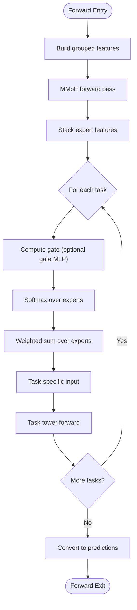

# MMoE Model (Multi-gate Mixture-of-Experts)

<cite>
**Referenced Files in This Document**
- [mmoe.py](file://tzrec/models/mmoe.py)
- [mmoe.py](file://tzrec/modules/mmoe.py)
- [task_tower.py](file://tzrec/modules/task_tower.py)
- [mlp.py](file://tzrec/modules/mlp.py)
- [multi_task_rank.py](file://tzrec/models/multi_task_rank.py)
- [mmoe.md](file://docs/source/models/mmoe.md)
- [mmoe_taobao.config](file://examples/mmoe_taobao.config)
- [multi_task_rank.proto](file://tzrec/protos/models/multi_task_rank.proto)
</cite>

## Table of Contents

1. [Introduction](#introduction)
1. [Project Structure](#project-structure)
1. [Core Components](#core-components)
1. [Architecture Overview](#architecture-overview)
1. [Detailed Component Analysis](#detailed-component-analysis)
1. [Dependency Analysis](#dependency-analysis)
1. [Performance Considerations](#performance-considerations)
1. [Troubleshooting Guide](#troubleshooting-guide)
1. [Conclusion](#conclusion)
1. [Appendices](#appendices)

## Introduction

The MMoE (Multi-gate Mixture-of-Experts) model is a multi-task learning architecture that enables flexible specialization per task while sharing a common representation across tasks. It achieves a shared-exclusivity trade-off by:

- Shared representation: All tasks share a common embedding and expert MLPs.
- Task specialization: Each task has its own gating network that selects relevant experts for that task.
- Flexible routing: Experts are weighted by softmax gates per task, allowing each task to emphasize different subsets of experts.

This design allows the model to adaptively allocate capacity to task-relevant features, improving performance when tasks are weakly correlated.

## Project Structure

The MMoE implementation spans several modules:

- Model wrapper: Defines the full model interface and integrates with the multi-task framework.
- Core module: Implements the MMoE gating mechanism and expert aggregation.
- Task towers: Provides task-specific heads with optional MLPs.
- MLP utilities: Generic multi-layer perceptrons with normalization and activation support.

**Diagram sources**

- \[mmoe.py\](file://tzrec/models/mmoe.py#L26-L87)
- \[mmoe.py\](file://tzrec/modules/mmoe.py#L21-L78)
- \[task_tower.py\](file://tzrec/modules/task_tower.py#L21-L52)
- \[mlp.py\](file://tzrec/modules/mlp.py#L86-L178)

**Section sources**

- \[mmoe.py\](file://tzrec/models/mmoe.py#L1-L87)
- \[mmoe.py\](file://tzrec/modules/mmoe.py#L1-L78)
- \[task_tower.py\](file://tzrec/modules/task_tower.py#L1-L94)
- \[mlp.py\](file://tzrec/modules/mlp.py#L1-L178)

## Core Components

This section documents the key building blocks of the MMoE implementation.

### MMoE (Module) - Core Gating Mechanism

The MMoE module implements the multi-gate mixture-of-experts architecture:

- Expert networks: Parallel MLPs that transform the shared input into task-relevant features.
- Gate networks: Task-specific gating networks that compute weights for each expert per sample.
- Aggregation: Softmax-normalized gating weights are applied to expert outputs to produce task-specific representations.

Key characteristics:

- Configurable number of experts and tasks.
- Optional gate MLPs for task-specific gating.
- Output dimension equals the last hidden unit count of expert MLPs.

Implementation highlights:

- Expert MLPs are stored as a ModuleList for efficient parameter management.
- Gate MLPs are optional; if absent, the original input is used for gating.
- Gates are computed via softmax over experts per task.

**Section sources**

- \[mmoe.py\](file://tzrec/modules/mmoe.py#L21-L78)

### TaskTower - Task-Specific Heads

Each task has its own tower that:

- Optionally applies an MLP transformation to the aggregated expert features.
- Projects to task-specific logits using a linear layer.
- Supports multi-class classification via the number of output classes.

Integration:

- The MMoE model creates a ModuleList of TaskTowers, one per configured task.
- Each TaskTower receives the gated expert features for that task.

**Section sources**

- \[task_tower.py\](file://tzrec/modules/task_tower.py#L21-L52)

### MLP Utilities - Building Blocks

The MLP module provides:

- Stacked Perceptron layers with configurable activation, normalization, and dropout.
- Flexible hidden unit specifications.
- Optional return of intermediate hidden features for analysis.

Used by:

- Expert MLPs in MMoE.
- Optional gate MLPs in MMoE.
- Task tower MLPs.

**Section sources**

- \[mlp.py\](file://tzrec/modules/mlp.py#L86-L178)

## Architecture Overview

The MMoE architecture consists of three main stages: shared representation, expert specialization, and task-specific adaptation.

**Diagram sources**

- \[mmoe.py\](file://tzrec/models/mmoe.py#L68-L87)
- \[mmoe.py\](file://tzrec/modules/mmoe.py#L60-L78)
- \[task_tower.py\](file://tzrec/modules/task_tower.py#L45-L51)

## Detailed Component Analysis

### MMoE Class Structure

The MMoE model class orchestrates the end-to-end pipeline:

- Initializes embedding group and computes input dimensions.
- Constructs the MMoE module with expert MLPs, optional gate MLPs, and task-specific gate layers.
- Builds task towers with optional MLPs and linear projections.
- Executes forward pass: builds input, runs MMoE gating, feeds outputs to task towers, and converts to predictions.

**Diagram sources**

- \[mmoe.py\](file://tzrec/models/mmoe.py#L26-L87)
- \[mmoe.py\](file://tzrec/modules/mmoe.py#L21-L78)
- \[task_tower.py\](file://tzrec/modules/task_tower.py#L21-L52)

**Section sources**

- \[mmoe.py\](file://tzrec/models/mmoe.py#L26-L87)

### Forward Pass Mechanism

The forward pass executes in three stages:

1. Input preparation: The model builds grouped features from the embedding group.
1. Expert processing: Each expert MLP transforms the input independently.
1. Gating and aggregation: For each task, a gate network computes weights, which are softmax-normalized and applied to expert outputs via matrix multiplication.
1. Task tower processing: Each task tower applies its MLP (if configured) and projects to logits.

**Diagram sources**

- \[mmoe.py\](file://tzrec/models/mmoe.py#L68-L87)
- \[mmoe.py\](file://tzrec/modules/mmoe.py#L60-L78)
- \[task_tower.py\](file://tzrec/modules/task_tower.py#L45-L51)

**Section sources**

- \[mmoe.py\](file://tzrec/models/mmoe.py#L68-L87)
- \[mmoe.py\](file://tzrec/modules/mmoe.py#L60-L78)

### Configuration and Practical Examples

The MMoE model is configured via protocol buffers and example configs:

- Model configuration structure:

  - Feature groups define the input features.
  - MMoE block specifies expert MLP architecture, number of experts, optional gate MLP, and task towers.
  - Task towers define per-task MLPs, labels, losses, and metrics.

- Example configuration:

  - The Taobao example demonstrates two tasks (CTR and CVR) with separate MLPs and loss configurations.

- Key configuration parameters:

  - expert_mlp.hidden_units: Expert MLP layer sizes.
  - num_expert: Number of expert networks.
  - gate_mlp.hidden_units: Optional gate MLP layer sizes.
  - task_towers[].mlp.hidden_units: Task tower MLP layer sizes.
  - task_towers[].label_name: Target label for each task.
  - task_towers[].losses: Task-specific loss configuration.

**Section sources**

- \[mmoe.md\](file://docs/source/models/mmoe.md#L10-L55)
- \[mmoe_taobao.config\](file://examples/mmoe_taobao.config#L159-L215)
- \[multi_task_rank.proto\](file://tzrec/protos/models/multi_task_rank.proto#L11-L20)

## Dependency Analysis

The MMoE implementation exhibits clear separation of concerns with minimal coupling:

**Diagram sources**

- \[mmoe.py\](file://tzrec/models/mmoe.py#L46-L66)
- \[mmoe.py\](file://tzrec/modules/mmoe.py#L41-L54)
- \[task_tower.py\](file://tzrec/modules/task_tower.py#L30-L43)
- \[mlp.py\](file://tzrec/modules/mlp.py#L138-L155)

**Section sources**

- \[mmoe.py\](file://tzrec/models/mmoe.py#L46-L66)
- \[mmoe.py\](file://tzrec/modules/mmoe.py#L41-L54)
- \[task_tower.py\](file://tzrec/modules/task_tower.py#L30-L43)
- \[mlp.py\](file://tzrec/modules/mlp.py#L138-L155)

## Performance Considerations

- Expert count tuning: Increasing experts improves task specialization but raises computational cost. Start with moderate counts (e.g., 3–5) and scale based on GPU memory and latency budgets.
- Gate MLP optional: Disabling gate MLPs reduces parameters and computation when simple gating is sufficient.
- Task tower MLPs: Keep task-specific MLPs shallow to minimize overhead; rely on shared expert representations for feature learning.
- Normalization and dropout: Use batch normalization or layer normalization in expert MLPs to stabilize training; apply dropout judiciously to prevent overfitting.
- Mixed precision: Enable automatic mixed precision during training to improve throughput.
- Distributed training: Utilize data parallelism and gradient accumulation for large batch sizes.

[No sources needed since this section provides general guidance]

## Troubleshooting Guide

Common issues and resolutions:

- Shape mismatches: Ensure the embedding group output dimension matches the in_features of the MMoE module.
- Gate dimension mismatch: Verify that gate MLP output dimension aligns with the final gate input dimension.
- Task tower output mismatch: Confirm num_class matches the number of classes for each task.
- Training instability: Reduce learning rates, add gradient clipping, or adjust normalization settings.
- Memory issues: Lower expert count, reduce batch size, or disable gate MLPs.

**Section sources**

- \[mmoe.py\](file://tzrec/modules/mmoe.py#L56-L58)
- \[task_tower.py\](file://tzrec/modules/task_tower.py#L30-L43)

## Conclusion

The MMoE implementation provides a robust, modular framework for multi-task learning with adaptive expert specialization. By combining shared representations with task-specific gating, it effectively balances shared-exclusivity trade-offs. The design emphasizes configurability, performance, and ease of integration with the broader TorchEasyRec ecosystem.

[No sources needed since this section summarizes without analyzing specific files]

## Appendices

### Input/Output Specifications

- Input: Grouped dense features from the embedding group.
- Expert MLP output: Shared feature representation per expert.
- Gate computation: Task-specific softmax weights over experts.
- Task tower output: Logits per task; probabilities derived automatically by the multi-task framework.

**Section sources**

- \[mmoe.py\](file://tzrec/models/mmoe.py#L68-L87)
- \[mmoe.py\](file://tzrec/modules/mmoe.py#L60-L78)
- \[multi_task_rank.py\](file://tzrec/models/multi_task_rank.py#L50-L65)
